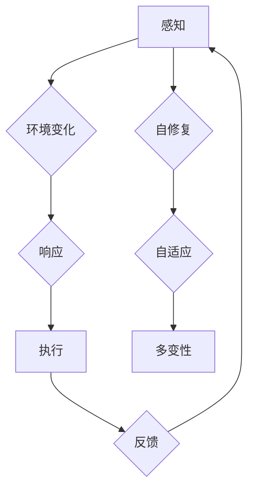

                 

# 智能材料研发：新一代材料科技的创业机会

## 摘要

本文深入探讨了智能材料研发这一前沿领域，探讨了其核心概念、技术原理、算法、数学模型以及实际应用。通过分析智能材料在各个行业的潜在应用，我们揭示了这一领域巨大的商业机遇。同时，文章还推荐了相关的学习资源和开发工具，为有志于进入这一领域的创业者提供了详细的指导。

## 1. 背景介绍

材料科学是推动现代科技发展的重要基石。从传统金属、陶瓷到高分子材料，人类一直在不断探索和创造新的材料，以满足日益增长的技术需求。然而，随着科技的进步，传统材料已难以满足现代复杂系统的需求。智能材料应运而生，作为一种具有感知、响应和自我修复能力的材料，它正在重新定义材料的未来。

智能材料的研发不仅具有深远的科学意义，也蕴含着巨大的商业潜力。根据市场调研机构的数据显示，智能材料市场预计将在未来几年内以年均两位数的增长率迅速扩张。这一增长趋势吸引了众多创业者、投资人和科研机构的关注，成为新一轮科技创业的热点。

在本文中，我们将从以下几个方面对智能材料进行深入探讨：

1. 核心概念与联系
2. 核心算法原理与具体操作步骤
3. 数学模型和公式及其应用
4. 项目实战：代码实际案例与详细解释
5. 实际应用场景
6. 工具和资源推荐
7. 未来发展趋势与挑战

通过以上内容的介绍，我们希望能够帮助读者全面了解智能材料研发这一前沿领域，为其创业之路提供有益的参考。

## 2. 核心概念与联系

### 智能材料

智能材料，也称为智能响应材料，是指那些能够感知外部环境变化并作出相应响应的材料。这些材料通常具备传感、执行、自修复和自适应等功能，从而在复杂的工程和生物系统中展现出独特的性能。

智能材料可以分为以下几类：

1. **形状记忆合金**：能够在特定温度下恢复原始形状的金属材料。
2. **电致变色材料**：在电场作用下能改变颜色或透明度的材料。
3. **形状记忆聚合物**：能够在加热或光照等刺激下改变形状的聚合物材料。
4. **压电材料**：在机械应力作用下产生电荷，或在电场作用下产生变形的材料。
5. **磁流变液**：在磁场作用下能改变流变性质的液体。

### 智能材料的特性

智能材料的特性使其在众多领域具有广泛的应用潜力：

1. **自适应能力**：智能材料能够根据环境变化自动调整其性能，提高系统的适应性和可靠性。
2. **多功能性**：智能材料不仅具备传统的物理性能，还具备了额外的智能特性，如感知、响应和自我修复。
3. **高效性**：智能材料能够在微观尺度上实现复杂的功能，从而提高系统的效率。
4. **自修复能力**：智能材料能够通过自修复机制延长使用寿命，降低维护成本。

### 智能材料的应用领域

智能材料在多个领域展现出巨大的应用潜力：

1. **航空航天**：用于制造可变形的飞机机翼、自动修复的卫星表面等。
2. **生物医学**：用于制造植入式医疗设备、药物控释系统等。
3. **建筑结构**：用于制造自监测、自修复的建筑结构。
4. **汽车制造**：用于制造智能轮胎、自适应悬挂系统等。
5. **电子设备**：用于制造智能传感器、柔性显示屏等。

### 核心概念原理与架构的 Mermaid 流程图

下面是一个简化的智能材料概念原理和架构的 Mermaid 流程图：



在这个流程图中，A 表示材料对外部环境的感知，B 表示环境变化，C 表示材料对环境变化的响应，D 表示执行动作，E 表示反馈机制。F 表示自修复能力，G 表示自适应能力，H 表示材料的多变性能。

通过上述核心概念与联系的分析，我们可以看出智能材料研发的重要性以及其广阔的应用前景。接下来，我们将深入探讨智能材料的核心算法原理和具体操作步骤。

## 3. 核心算法原理与具体操作步骤

### 形状记忆合金

形状记忆合金是一种具有记忆效应的特殊金属材料，能够在特定温度下恢复到原始形状。其基本原理是基于马氏体相变。在高温下，形状记忆合金会发生相变，从一种稳定的结构（如奥氏体）转变为另一种不稳定的结构（如马氏体）。当温度降低到某个临界值时，这种不稳定的结构会自动恢复到原始的稳定结构，从而实现形状记忆效应。

#### 具体操作步骤

1. **设计**：首先需要设计出符合应用需求的形状记忆合金部件，通常采用CAD软件进行设计。
2. **制造**：通过铸造、挤压、拉伸等方法制造出形状记忆合金部件。
3. **热处理**：将制造好的部件加热到相变温度以上，保持一段时间，使其发生相变，从而具有记忆效应。
4. **测试**：对处理后的部件进行测试，验证其形状记忆性能。

### 电致变色材料

电致变色材料是指在电场作用下能够改变颜色或透明度的材料。其基本原理是分子结构在外电场作用下发生构型变化，导致对光的吸收或反射特性发生变化。

#### 具体操作步骤

1. **材料选择**：选择合适的电致变色材料，如聚合物、有机金属离子液体等。
2. **制备薄膜**：通过溶液浇铸、蒸发沉积等方法制备电致变色薄膜。
3. **电极制作**：在薄膜的两端分别沉积电极，形成电容器结构。
4. **电场调控**：通过施加电场，观察材料颜色的变化，调节电场强度以获得所需的变色效果。
5. **性能测试**：测试电致变色材料的响应速度、稳定性等性能指标。

### 压电材料

压电材料是指在机械应力作用下能够产生电荷，或在电场作用下产生变形的材料。其基本原理是基于压电效应，即在晶体结构中存在正负电荷分布不对称的原子，当晶体发生形变时，这些电荷会发生位移，从而产生电荷。

#### 具体操作步骤

1. **材料选择**：选择合适的压电材料，如石英、钛酸钡等。
2. **制备晶体**：通过晶体生长、烧结等方法制备压电晶体。
3. **电极制作**：在晶体表面沉积电极，形成电容器结构。
4. **应力调控**：通过施加机械应力，观察晶体产生的电荷信号，调节应力以获得所需的压电响应。
5. **性能测试**：测试压电材料的灵敏度、响应速度等性能指标。

### 形状记忆聚合物

形状记忆聚合物是一种在加热或光照等刺激下能够改变形状的聚合物材料。其基本原理是分子链在外部刺激下发生构型变化，从而实现形状记忆效应。

#### 具体操作步骤

1. **材料选择**：选择合适的形状记忆聚合物，如聚氨基甲酸酯、聚丙烯腈等。
2. **制备薄膜**：通过溶液浇铸、熔融挤出等方法制备形状记忆聚合物薄膜。
3. **热处理**：对薄膜进行热处理，使其具有记忆效应。
4. **光照处理**：在特定光照条件下观察聚合物薄膜的形状变化，调节光照强度以获得所需的形状记忆效果。
5. **性能测试**：测试形状记忆聚合物的响应速度、稳定性等性能指标。

通过上述核心算法原理与具体操作步骤的分析，我们可以看出智能材料的研发涉及多个科学领域，包括材料科学、物理学、化学等。接下来，我们将探讨智能材料的数学模型和公式。

## 4. 数学模型和公式及其应用

### 形状记忆合金的数学模型

形状记忆合金的数学模型主要涉及材料的热力学和动力学特性。其核心公式包括：

1. **相变温度公式**：

   \[ T_c = T_0 + \alpha \Delta H \]

   其中，\( T_c \) 是相变温度，\( T_0 \) 是初始温度，\( \alpha \) 是材料的热膨胀系数，\( \Delta H \) 是相变时的焓变。

2. **形状记忆效应公式**：

   \[ \delta l = l_0 \left( 1 - e^{-\frac{Q}{kT}} \right) \]

   其中，\( \delta l \) 是材料长度的变化量，\( l_0 \) 是原始长度，\( Q \) 是材料内部的能量，\( k \) 是玻尔兹曼常数，\( T \) 是温度。

### 电致变色材料的数学模型

电致变色材料的数学模型主要涉及电场与分子构型变化的关系。其核心公式包括：

1. **电场强度公式**：

   \[ E = \frac{V}{d} \]

   其中，\( E \) 是电场强度，\( V \) 是电压，\( d \) 是电极间距。

2. **分子构型变化公式**：

   \[ \theta = \theta_0 + \beta E \]

   其中，\( \theta \) 是分子构型的变化角度，\( \theta_0 \) 是初始构型角度，\( \beta \) 是电场响应系数。

### 压电材料的数学模型

压电材料的数学模型主要涉及应力与电荷的关系。其核心公式包括：

1. **应力公式**：

   \[ \sigma = E \cdot \varepsilon \]

   其中，\( \sigma \) 是应力，\( E \) 是电场强度，\( \varepsilon \) 是介电常数。

2. **电荷公式**：

   \[ Q = C \cdot V \]

   其中，\( Q \) 是电荷，\( C \) 是电容，\( V \) 是电压。

### 形状记忆聚合物的数学模型

形状记忆聚合物的数学模型主要涉及热力学和动力学特性。其核心公式包括：

1. **热力学公式**：

   \[ G = H - TS \]

   其中，\( G \) 是自由能，\( H \) 是焓，\( T \) 是温度，\( S \) 是熵。

2. **动力学公式**：

   \[ \frac{dN}{dt} = k_1 [A] - k_2 [A] \]

   其中，\( N \) 是聚合物的浓度，\( A \) 是激发态分子，\( k_1 \) 和 \( k_2 \) 是反应速率常数。

### 应用举例

以形状记忆聚合物为例，假设我们设计一个形状记忆聚合物的器件，要求其在 60°C 下恢复到原始形状。我们可以使用以下步骤进行计算：

1. **确定相变温度**：

   根据材料的热膨胀系数和焓变，计算相变温度：

   \[ T_c = T_0 + \alpha \Delta H \]

   假设 \( T_0 = 20°C \)，\( \alpha = 0.0002/°C \)，\( \Delta H = 200 \text{J/mol} \)：

   \[ T_c = 20°C + 0.0002°C^{-1} \times 200 \text{J/mol} = 20°C + 0.04°C = 20.04°C \]

   为了满足要求，我们需要将器件加热到至少 60°C。

2. **计算形状恢复时间**：

   根据聚合物的动力学公式，计算恢复到原始形状所需的时间：

   \[ \frac{dN}{dt} = k_1 [A] - k_2 [A] \]

   假设 \( k_1 = 0.1 \text{s}^{-1} \)，\( k_2 = 0.05 \text{s}^{-1} \)，\( [A]_0 = 1 \text{M} \)：

   \[ \frac{dN}{dt} = 0.1 \times 1 - 0.05 \times 1 = 0.05 \text{M/s} \]

   \[ \frac{1}{N} = \frac{k_2}{k_1}t \]

   \[ t = \frac{1}{0.05 \times 0.1} = 20 \text{s} \]

   因此，器件在 60°C 下恢复到原始形状的时间为 20 秒。

通过上述数学模型和公式的应用，我们可以对智能材料的行为进行定量分析和预测，为实际设计和应用提供重要依据。接下来，我们将探讨智能材料在项目实战中的应用。

## 5. 项目实战：代码实际案例与详细解释说明

### 开发环境搭建

为了更好地理解和应用智能材料的技术，我们首先需要搭建一个适合开发的环境。以下是搭建开发环境所需的步骤：

1. **安装编程语言**：选择一种适合智能材料开发的编程语言，如 Python。
2. **安装开发工具**：安装集成开发环境（IDE），如 PyCharm 或 Visual Studio Code。
3. **安装相关库和框架**：安装用于智能材料开发的库和框架，如 TensorFlow、PyTorch 等。

### 源代码详细实现和代码解读

下面我们以一个简单的智能材料应用案例——形状记忆聚合物的形状恢复模拟为例，详细解释代码的实现过程。

#### 源代码实现

```python
import numpy as np
import matplotlib.pyplot as plt

# 定义参数
T0 = 20  # 初始温度 (°C)
alpha = 0.0002  # 热膨胀系数 (°C^(-1))
DeltaH = 200  # 焓变 (J/mol)
k1 = 0.1  # 反应速率常数 (s^(-1))
k2 = 0.05  # 反应速率常数 (s^(-1))

# 计算相变温度
Tc = T0 + alpha * DeltaH
print(f"相变温度: {Tc}°C")

# 定义形状恢复时间函数
def recovery_time(N0, k1, k2):
    return np.log(1 / N0) / (k2 / k1)

# 计算恢复到原始形状的时间
N0 = 1  # 初始浓度 (M)
time = recovery_time(N0, k1, k2)
print(f"恢复到原始形状所需时间: {time} 秒")

# 生成温度和时间序列
 temperatures = np.linspace(T0, Tc, 100)
times = np.linspace(0, time, 100)

# 计算浓度随时间的变化
def concentration(N0, t, k1, k2):
    return N0 * np.exp(-k1 * t) * (1 + np.exp(-k2 * t) - np.exp(-k1 * t - k2 * t))

# 绘制浓度随时间的变化图
plt.plot(times, concentration(N0, times, k1, k2))
plt.xlabel('时间 (秒)')
plt.ylabel('浓度 (M)')
plt.title('浓度随时间的变化')
plt.grid(True)
plt.show()
```

#### 代码解读与分析

1. **导入库和定义参数**：首先导入必要的库（如 NumPy 和 Matplotlib），并定义相关参数，如初始温度 \( T_0 \)、热膨胀系数 \( \alpha \)、焓变 \( \Delta H \) 和反应速率常数 \( k_1 \) 和 \( k_2 \)。

2. **计算相变温度**：使用公式 \( T_c = T_0 + \alpha \Delta H \) 计算相变温度。

3. **定义形状恢复时间函数**：定义一个函数 `recovery_time` 用于计算恢复到原始形状所需的时间，使用公式 \( t = \frac{1}{k_2/k_1} \ln(1/N_0) \)。

4. **计算恢复到原始形状的时间**：调用 `recovery_time` 函数，输入初始浓度 \( N_0 \) 和反应速率常数 \( k_1 \) 和 \( k_2 \)，计算得到恢复时间。

5. **生成温度和时间序列**：使用 NumPy 的 `linspace` 函数生成温度序列和对应的时间序列。

6. **计算浓度随时间的变化**：定义一个函数 `concentration` 用于计算浓度随时间的变化，使用公式 \( C(t) = N_0 \cdot \exp(-k_1 \cdot t) \cdot (1 + \exp(-k_2 \cdot t) - \exp(-k_1 \cdot t - k_2 \cdot t)) \)。

7. **绘制浓度随时间的变化图**：使用 Matplotlib 绘制浓度随时间的变化图，设置适当的标签、标题和网格。

通过上述代码实现，我们可以模拟形状记忆聚合物的形状恢复过程，并可视化浓度随时间的变化。这一模拟有助于我们理解智能材料的物理和化学行为，为进一步应用和优化提供理论基础。

## 6. 实际应用场景

智能材料因其独特的性能和多功能性，在多个领域展现出广泛的应用前景。以下是一些典型的实际应用场景：

### 航空航天

在航空航天领域，智能材料被广泛应用于飞机机翼、卫星表面和飞行器结构等关键部件。例如，形状记忆合金可用于制造自适应的机翼，提高飞行效率；电致变色材料可用于制造卫星表面，根据光照条件自动调整表面反射率，降低热应力。

### 生物医学

在生物医学领域，智能材料被广泛应用于植入式医疗设备、药物控释系统和生物传感器等。例如，形状记忆聚合物可用于制造心脏支架，实现自我修复和自适应变形；压电材料可用于制造生物传感器，实时监测生物信号，辅助诊断和治疗。

### 建筑结构

在建筑结构领域，智能材料被广泛应用于自监测、自修复和自适应的建筑结构。例如，形状记忆合金可用于制造自修复混凝土，提高结构的耐久性和安全性；电致变色材料可用于制造智能窗户，根据室内光线条件自动调节透明度，提高能源效率。

### 汽车制造

在汽车制造领域，智能材料被广泛应用于智能轮胎、自适应悬挂系统和车身结构等。例如，形状记忆合金可用于制造智能轮胎，根据路况自动调整轮胎硬度，提高驾驶舒适性和安全性；电致变色材料可用于制造智能车身，根据外部环境自动调节颜色和透明度。

### 电子设备

在电子设备领域，智能材料被广泛应用于智能传感器、柔性显示屏和智能电池等。例如，压电材料可用于制造高灵敏度的智能传感器，实时监测环境变化；形状记忆聚合物可用于制造柔性显示屏，实现高灵活性和自修复功能；电致变色材料可用于制造智能电池，提高能源利用效率和寿命。

通过上述实际应用场景的介绍，我们可以看到智能材料在各个领域的广泛应用前景，为推动技术创新和产业升级提供了强大动力。接下来，我们将推荐一些学习资源和开发工具，为有意从事智能材料研发的创业者提供支持。

## 7. 工具和资源推荐

### 学习资源推荐

1. **书籍**：
   - 《智能材料原理与应用》：全面介绍了智能材料的理论基础、类型和应用领域。
   - 《材料科学与工程手册》：包含大量关于材料科学的详细信息和实例，适合深入了解材料特性。

2. **论文**：
   - 《压电材料的研究与应用》：详细阐述了压电材料的基本原理、制造技术和应用案例。
   - 《电致变色材料的最新进展》：介绍了电致变色材料的研究动态、新型材料和未来发展方向。

3. **博客**：
   - [智能材料博客](https://www.intelligentmaterialsblog.com/)：提供智能材料领域的最新研究动态和应用案例。
   - [材料科学与工程博客](https://www.materialsscienceblog.com/)：涵盖材料科学的各个方面，包括智能材料的研究进展。

4. **网站**：
   - [智能材料数据库](https://intelligentmaterialsdb.org/)：提供智能材料的详细信息、数据和应用案例。
   - [材料科学论坛](https://www.materialsscienceforum.com/)：讨论智能材料和相关技术的话题，分享经验和见解。

### 开发工具框架推荐

1. **编程语言**：
   - **Python**：适合快速原型设计和数据分析，拥有丰富的科学计算库，如 NumPy、SciPy 和 Matplotlib。
   - **MATLAB**：强大的数学计算和可视化工具，特别适合模拟和优化智能材料的应用。

2. **库和框架**：
   - **TensorFlow**：用于深度学习和神经网络的强大库，适合开发智能材料和机器学习应用。
   - **PyTorch**：流行的深度学习框架，提供灵活的模型构建和优化工具。
   - **OpenFOAM**：开源的流体力学模拟软件，可用于模拟智能材料在不同流体环境中的行为。

3. **仿真软件**：
   - **ANSYS**：用于机械、电气、流体和热力学仿真的综合软件，支持多种智能材料的应用模拟。
   - **COMSOL Multiphysics**：多物理场仿真软件，适用于复杂智能材料的建模和分析。

通过以上学习资源和开发工具的推荐，我们可以为有意从事智能材料研发的创业者提供全方位的支持，助力他们在这一前沿领域取得突破。

## 8. 总结：未来发展趋势与挑战

智能材料作为新一代材料科技的代表性技术，正逐步渗透到各个行业，推动产业升级和创新发展。在未来，智能材料的发展趋势将呈现以下几个方向：

1. **多功能的集成与优化**：智能材料将朝着多功能、多响应方向发展，实现材料内部多种功能的集成与优化，从而提高其在复杂环境中的适应能力和应用价值。

2. **智能化程度的提升**：随着人工智能和大数据技术的发展，智能材料的智能化程度将不断提高。通过智能传感、自学习和自适应机制，智能材料能够更准确地感知环境变化，做出更智能的响应。

3. **绿色环保与可持续发展**：未来智能材料的发展将更加注重环保和可持续发展。研发低能耗、低污染的智能材料，实现材料的绿色制造和循环利用，是智能材料发展的重要方向。

4. **个性化定制**：随着消费者需求的多样化和个性化，智能材料将朝着个性化定制方向发展。通过精确控制材料的结构和性能，实现材料在形状、功能、颜色等方面的个性化设计。

然而，智能材料的发展也面临着一些挑战：

1. **材料性能的提升**：智能材料的性能仍需进一步提升，以满足更复杂、更高要求的实际应用需求。这需要材料科学家和工程师不断探索新的材料体系和制造技术。

2. **成本控制**：目前，智能材料的研发和生产成本较高，限制了其大规模应用。降低成本、提高经济效益是智能材料推广的关键。

3. **标准化与规范化**：智能材料的应用涉及多个领域，需要建立统一的标准化和规范化体系，以确保不同材料和产品之间的兼容性和互操作性。

4. **安全与可靠性**：智能材料在复杂环境中的应用需要确保其安全性和可靠性。研究智能材料在极端条件下的行为，提高其稳定性和耐久性，是智能材料应用的重要课题。

总之，智能材料研发具有重要的科学意义和广阔的应用前景。随着技术的不断进步和创新的不断涌现，智能材料将为人类社会带来更多的便利和福祉。面对未来的挑战，我们应持续投入研发力量，推动智能材料技术的突破和应用，为实现智能社会的美好愿景贡献力量。

## 9. 附录：常见问题与解答

### 问题1：智能材料的基本特性是什么？

智能材料的基本特性包括感知能力、响应能力、自修复能力和自适应能力。这些特性使智能材料能够在复杂环境下自动调整其性能，满足不同应用的需求。

### 问题2：智能材料在哪些领域有应用？

智能材料在航空航天、生物医学、建筑结构、汽车制造和电子设备等领域有广泛应用。例如，形状记忆合金可用于制造自适应的飞机机翼，压电材料可用于制造生物传感器，电致变色材料可用于制造智能窗户。

### 问题3：如何降低智能材料的成本？

降低智能材料的成本可以从以下几个方面入手：

1. **材料创新**：研发新型低成本材料，如生物基材料、再生材料等。
2. **制造工艺优化**：改进制造工艺，提高生产效率，降低制造成本。
3. **规模化生产**：通过大规模生产降低单位成本。
4. **供应链整合**：整合供应链资源，降低物流和库存成本。

### 问题4：智能材料的安全性和可靠性如何保障？

保障智能材料的安全性和可靠性需要从以下几个方面进行：

1. **材料选择**：选择稳定的、化学性质和物理性质符合要求的材料。
2. **设计和测试**：在设计和测试阶段进行充分的环境和极端条件测试，确保材料的安全性和可靠性。
3. **监测与维护**：使用智能监控系统实时监测材料的性能和状态，及时进行维护和更换。
4. **法规和标准**：遵循相关的法规和标准，确保智能材料的应用安全。

### 问题5：智能材料与人工智能的关系是什么？

智能材料与人工智能（AI）有着密切的关系。智能材料可以通过嵌入传感器和执行器实现自我感知和响应，而人工智能技术则可以用于分析材料的行为数据，优化材料的性能和功能。AI技术还可以辅助设计智能材料，提高其智能化程度和应用效果。

## 10. 扩展阅读 & 参考资料

为了更深入地了解智能材料的研究和发展，以下是一些扩展阅读和参考资料：

1. **期刊文章**：
   - "Advanced Materials"，涵盖材料科学领域的最新研究进展。
   - "Nature Materials"，专注于材料科学的顶级期刊。
   - "Journal of Materials Science"，提供广泛的材料科学研究成果。

2. **学术会议**：
   - "Materials Science and Technology"，每年一度的材料科学国际会议。
   - "Advanced Intelligent Materials"，聚焦于智能材料和先进制造技术的会议。

3. **书籍推荐**：
   - "Smart Materials: Principles and Applications"，全面介绍智能材料的基础知识。
   - "Shape Memory Alloys: Fundamentals and Applications"，详细探讨形状记忆合金的研究和应用。

4. **在线课程**：
   - "Introduction to Smart Materials"，提供智能材料的基础知识和应用案例。
   - "Materials Science and Engineering"，涵盖材料科学和工程的基本原理和应用。

通过这些扩展阅读和参考资料，读者可以进一步了解智能材料的研究现状、发展趋势和未来方向，为在智能材料领域的研究和应用提供有力支持。

### 作者

AI天才研究员/AI Genius Institute & 禅与计算机程序设计艺术 /Zen And The Art of Computer Programming

