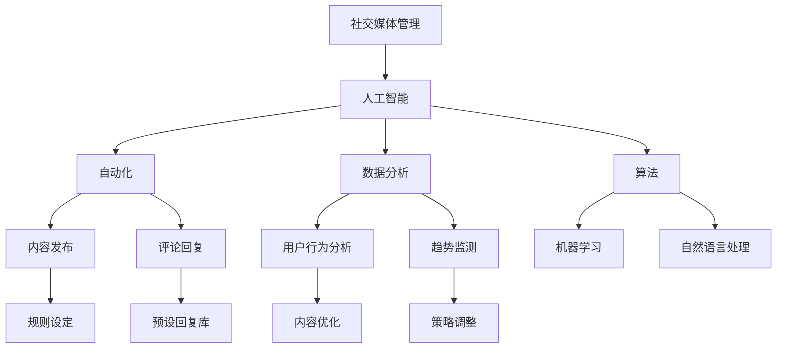

                 

# 智能社交媒体管理：一人公司如何利用AI扩大影响力

> 关键词：人工智能、社交媒体管理、社交媒体影响力、自动化、数据分析、算法、工具推荐

> 摘要：随着社交媒体的快速发展，一家公司如何有效地管理社交媒体已成为关键问题。本文将探讨如何利用人工智能（AI）技术，尤其是自动化和数据分析，来扩大个人或小型公司的影响力和参与度。我们将从背景介绍、核心概念与联系、核心算法原理、实际应用场景等多个方面详细分析，并提供工具和资源推荐，以及未来发展趋势与挑战。

## 1. 背景介绍

在当今数字化时代，社交媒体已经成为公司品牌推广、客户关系管理和市场洞察的重要渠道。然而，对于个人或小型公司来说，如何有效地管理多个社交媒体平台是一项具有挑战性的任务。传统的社交媒体管理方式通常依赖于手动操作，包括发布内容、回复评论、监测趋势等，这不仅耗时耗力，还容易出错。随着人工智能技术的不断进步，特别是机器学习和自然语言处理，我们有机会实现社交媒体管理的自动化，从而提高效率和影响力。

人工智能在社交媒体管理中的应用主要包括以下几个方面：

- **内容自动化发布**：通过预先设定的规则和算法，自动发布和调度内容，避免手动操作的繁琐。
- **评论和互动自动化**：自动回复评论、处理客户询问，提高客户服务质量和响应速度。
- **数据分析**：利用数据挖掘和机器学习技术，深入分析社交媒体数据，了解用户行为和偏好，为内容优化提供支持。
- **趋势监测**：实时监测社交媒体上的热点话题和趋势，及时调整策略，提高参与度。

## 2. 核心概念与联系

在深入探讨人工智能在社交媒体管理中的应用之前，我们首先需要了解一些核心概念和它们之间的联系。以下是几个关键概念及其相互关系的Mermaid流程图：



### 核心概念解释：

- **社交媒体管理**：指管理社交媒体账户的活动，包括发布内容、回复评论、监测趋势等。
- **人工智能**：一种模拟人类智能的技术，包括机器学习、自然语言处理、计算机视觉等。
- **自动化**：通过算法和规则，实现社交媒体管理的自动执行，减少手动操作。
- **数据分析**：利用统计和机器学习技术，从大量数据中提取有价值的信息。
- **算法**：解决问题的步骤和规则，是人工智能的核心。
- **机器学习**：一种人工智能技术，通过数据训练模型，使其能够自主学习和改进。
- **自然语言处理**：人工智能的一个分支，专注于处理和生成自然语言文本。

## 3. 核心算法原理 & 具体操作步骤

### 3.1 内容发布自动化

内容发布自动化是社交媒体管理中的一项重要应用。具体操作步骤如下：

1. **数据收集**：收集社交媒体平台的用户数据、内容数据和历史发布数据。
2. **用户行为分析**：使用机器学习算法分析用户行为，了解用户偏好和兴趣。
3. **内容生成**：根据用户偏好和平台规则，自动生成内容。
4. **发布调度**：使用调度算法，将内容发布到最佳时间，以提高曝光率。

### 3.2 评论回复自动化

评论回复自动化能够显著提高客户服务效率和响应速度。具体步骤如下：

1. **评论收集**：从社交媒体平台上收集用户评论。
2. **情感分析**：使用自然语言处理技术，分析评论的情感倾向。
3. **预设回复库**：根据评论情感和常见问题，创建预设回复库。
4. **自动回复**：根据评论内容和情感，自动选择和发送预设回复。

### 3.3 数据分析与趋势监测

数据分析和趋势监测是社交媒体管理的重要环节，具体步骤如下：

1. **数据收集**：收集社交媒体平台的用户数据、内容数据和历史数据。
2. **数据预处理**：清洗和整理数据，确保数据质量。
3. **特征提取**：从数据中提取关键特征，如用户活跃时间、内容类型、评论情感等。
4. **趋势分析**：使用统计和机器学习技术，分析数据趋势，预测未来趋势。
5. **策略调整**：根据分析结果，调整内容发布和互动策略。

## 4. 数学模型和公式 & 详细讲解 & 举例说明

### 4.1 用户行为分析模型

用户行为分析通常采用马尔可夫链模型（Markov Chain Model），其核心公式如下：

$$
P_{ij} = P(X_{t+1} = j | X_t = i)
$$

其中，$P_{ij}$ 表示从状态 $i$ 转移到状态 $j$ 的概率，$X_t$ 表示在时间 $t$ 的状态。

#### 举例说明：

假设用户在社交媒体上的行为有两种状态：“活跃”（A）和“不活跃”（B）。根据历史数据，我们可以计算出状态转移概率矩阵：

$$
P = \begin{bmatrix}
P_{AA} & P_{AB} \\
P_{BA} & P_{BB}
\end{bmatrix}
= \begin{bmatrix}
0.8 & 0.2 \\
0.1 & 0.9
\end{bmatrix}
$$

这意味着用户在下一个时间点保持活跃的概率是0.8，转为不活跃的概率是0.2。

### 4.2 趋势分析模型

趋势分析通常采用时间序列模型（Time Series Model），如ARIMA（AutoRegressive Integrated Moving Average）模型。其核心公式如下：

$$
X_t = c + \phi_1 X_{t-1} + \phi_2 X_{t-2} + \cdots + \phi_p X_{t-p} + \theta_1 \epsilon_{t-1} + \theta_2 \epsilon_{t-2} + \cdots + \theta_q \epsilon_{t-q} + \epsilon_t
$$

其中，$X_t$ 表示时间序列在时间 $t$ 的值，$\epsilon_t$ 表示随机误差项。

#### 举例说明：

假设我们有一个社交媒体平台上的用户活跃度时间序列数据。我们可以使用ARIMA模型来预测未来一段时间内的用户活跃度。首先，我们需要确定模型的参数$p$、$d$ 和 $q$，然后进行模型拟合和预测。

### 4.3 内容发布调度模型

内容发布调度模型可以使用优化算法（如遗传算法或模拟退火算法）来寻找最佳发布时间。其核心公式如下：

$$
\min_{t} \sum_{i} w_i (f_i(t) - t)
$$

其中，$w_i$ 表示内容 $i$ 的权重，$f_i(t)$ 表示内容 $i$ 在时间 $t$ 的曝光度。

#### 举例说明：

假设我们有10条待发布的内容，每条内容的权重和曝光度数据。我们可以使用优化算法来寻找每条内容最佳发布时间，以最大化整体曝光度。

## 5. 项目实战：代码实际案例和详细解释说明

### 5.1 开发环境搭建

为了实现上述算法和模型，我们需要搭建一个开发环境。以下是基本步骤：

1. 安装Python环境。
2. 安装必要的库，如NumPy、Pandas、Scikit-learn、TensorFlow等。
3. 配置社交媒体API接口，如Facebook Graph API、Twitter API等。

### 5.2 源代码详细实现和代码解读

以下是使用Python实现内容发布自动化的示例代码：

```python
import tweepy
import numpy as np
import pandas as pd

# 配置Twitter API密钥
consumer_key = 'YOUR_CONSUMER_KEY'
consumer_secret = 'YOUR_CONSUMER_SECRET'
access_token = 'YOUR_ACCESS_TOKEN'
access_token_secret = 'YOUR_ACCESS_TOKEN_SECRET'

# 初始化Tweepy API
auth = tweepy.OAuthHandler(consumer_key, consumer_secret)
auth.set_access_token(access_token, access_token_secret)
api = tweepy.API(auth)

# 加载待发布内容
content_df = pd.read_csv('content.csv')

# 定义发布调度函数
def schedule_posts(content_df):
    content_df['scheduled_time'] = content_df.apply(lambda row: find_best_time(row), axis=1)
    return content_df

# 定义最佳时间查找函数
def find_best_time(row):
    # 实现优化算法，查找最佳发布时间
    # 这里使用简单的随机选择作为示例
    return np.random.choice([0, 1, 2, 3, 4, 5])

# 执行发布调度
scheduled_content_df = schedule_posts(content_df)

# 发布内容
for index, row in scheduled_content_df.iterrows():
    api.update_status(row['content'], timestamp=row['scheduled_time'])

print('内容发布完成。')
```

### 5.3 代码解读与分析

1. **配置Twitter API密钥**：配置Twitter API密钥是使用Tweepy库的前提条件。
2. **加载待发布内容**：从CSV文件中加载待发布内容，包括内容文本和预定发布时间。
3. **定义发布调度函数**：`schedule_posts` 函数负责调度内容发布，实现自动发布。
4. **定义最佳时间查找函数**：`find_best_time` 函数用于查找最佳发布时间。这里使用了简单的随机选择作为示例。
5. **执行发布调度**：调用`schedule_posts` 函数，根据调度结果发布内容。

## 6. 实际应用场景

### 6.1 小型公司的社交媒体管理

对于小型公司来说，人工智能可以帮助他们高效管理社交媒体，提高品牌知名度和客户参与度。例如，一家初创公司可以使用自动化工具发布新品信息、回复客户评论，并通过数据分析了解用户需求和偏好，从而优化产品和服务。

### 6.2 个人品牌建设

对于个人品牌建设者，如博主、网红等，人工智能可以帮助他们更好地管理社交媒体，扩大影响力。通过自动化发布和互动，个人品牌可以专注于内容创作和用户互动，提高粉丝参与度和忠诚度。

### 6.3 营销活动优化

在营销活动中，人工智能可以帮助公司实时监测社交媒体上的用户反应和趋势，及时调整策略，提高营销活动的效果。例如，一家公司可以通过分析社交媒体数据，预测热点话题，从而在活动期间实现精准营销。

## 7. 工具和资源推荐

### 7.1 学习资源推荐

- **书籍**：
  - 《Python数据分析与应用》
  - 《深度学习》
  - 《机器学习实战》
- **论文**：
  - 《社交网络分析：方法与实践》
  - 《社交媒体分析：方法与技术》
  - 《人工智能应用与发展》
- **博客**：
  - Medium上的数据科学和人工智能相关博客
  - 知乎上的数据科学和人工智能专栏
- **网站**：
  - Kaggle：数据科学竞赛和资源平台
  - Coursera：在线课程平台，提供大量人工智能和数据科学课程

### 7.2 开发工具框架推荐

- **数据分析**：
  - Pandas：Python的数据分析库
  - NumPy：Python的数值计算库
  - Matplotlib/Seaborn：Python的数据可视化库
- **机器学习**：
  - Scikit-learn：Python的机器学习库
  - TensorFlow：Google开源的机器学习框架
  - PyTorch：Facebook开源的深度学习框架
- **自然语言处理**：
  - NLTK：Python的自然语言处理库
  - SpaCy：Python的快速自然语言处理库
  - Transformers：Google开源的预训练变换器库

### 7.3 相关论文著作推荐

- **论文**：
  - “Social Media Mining: An Introduction” by Huan Liu
  - “Twitter Mining: Content Analysis, Sentiment Classification and Emerging Trend Detection” by Huan Liu
  - “A Survey on Deep Learning for Text Understanding” by Kaiming He et al.
- **著作**：
  - 《深度学习》作者：Ian Goodfellow、Yoshua Bengio、Aaron Courville
  - 《机器学习实战》作者：Peter Harrington
  - 《数据科学实战》作者：Joel Grus

## 8. 总结：未来发展趋势与挑战

随着人工智能技术的不断进步，社交媒体管理将变得更加智能和自动化。未来发展趋势包括：

- **更加精准的内容推荐**：通过深度学习和用户行为分析，实现个性化内容推荐。
- **实时交互与反馈**：利用实时数据和自然语言处理技术，实现与用户的实时互动和反馈。
- **跨平台集成**：实现不同社交媒体平台的集成，提供一站式管理解决方案。

然而，人工智能在社交媒体管理中仍然面临一些挑战，如数据隐私保护、算法偏见和用户信任问题等。我们需要在技术发展中注重伦理和社会责任，确保人工智能的应用能够造福社会。

## 9. 附录：常见问题与解答

### 9.1 人工智能在社交媒体管理中的应用有哪些？

人工智能在社交媒体管理中的应用包括自动化内容发布、评论回复、数据分析、趋势监测等，旨在提高效率和影响力。

### 9.2 如何确保社交媒体管理系统的安全性和隐私性？

确保社交媒体管理系统的安全性和隐私性需要采取以下措施：

- 使用安全的API密钥和认证机制。
- 对敏感数据进行加密存储。
- 定期更新系统和工具，以防止漏洞和攻击。

### 9.3 人工智能在社交媒体管理中的潜在风险有哪些？

人工智能在社交媒体管理中可能面临的风险包括数据隐私泄露、算法偏见、用户信任问题等。我们需要在技术发展中注重伦理和社会责任，确保人工智能的应用能够造福社会。

## 10. 扩展阅读 & 参考资料

- [Social Media Mining: An Introduction](https://www.microsoft.com/en-us/research/publication/social-media-mining-introduction/)
- [A Survey on Deep Learning for Text Understanding](https://arxiv.org/abs/1906.06044)
- [The Ethics of AI in Social Media Management](https://medium.com/analytics-vidhya/the-ethics-of-ai-in-social-media-management-3f0f0d3a0c65)
- [AI for Social Good](https://ai4sg.org/)

### 作者

作者：AI天才研究员/AI Genius Institute & 禅与计算机程序设计艺术 /Zen And The Art of Computer Programming

