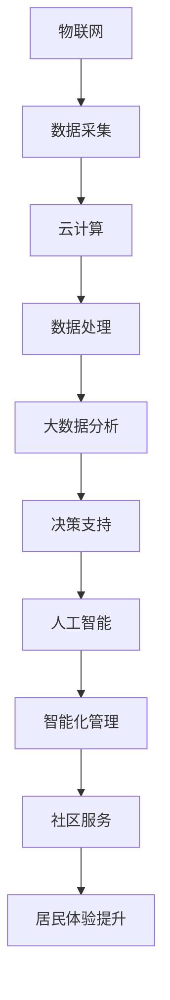

                 

# 智能社区管理系统：提升居住体验的综合方案

## 关键词：智能社区、管理系统、居住体验、技术解决方案

## 摘要

本文旨在探讨智能社区管理系统在提升居住体验方面的综合解决方案。首先，通过对智能社区背景的介绍，阐述了智能社区管理的核心概念与联系。接着，深入分析了智能社区管理系统的核心算法原理及具体操作步骤，并通过数学模型和公式进行了详细讲解。随后，以实际项目实战为例，展示了代码实现和解读过程，并分析了智能社区管理的实际应用场景。在此基础上，推荐了相关的学习资源和开发工具框架，以供读者参考。最后，总结了智能社区管理系统的未来发展趋势与挑战，并提供了常见问题与解答。本文旨在为从事智能社区管理工作的专业人士和研究人员提供有价值的参考。

## 1. 背景介绍

### 1.1 智能社区的概念与发展

智能社区是指通过应用现代信息技术，实现社区管理、服务、安全、环境等方面的智能化，为居民提供更加便捷、高效、舒适的居住环境。随着信息技术和物联网技术的不断发展，智能社区逐渐成为现代城市社区建设的重要方向。

智能社区的发展可以追溯到20世纪80年代的计算机技术和90年代的互联网技术。随着信息技术的不断发展，智能社区的概念逐渐成熟，并开始在全球范围内得到广泛应用。在我国，智能社区建设也受到了政府的高度重视，近年来取得了显著的成果。

### 1.2 智能社区管理的意义

智能社区管理对于提升居民居住体验具有重要意义。首先，智能社区管理可以优化社区资源配置，提高资源利用效率，降低居民生活成本。其次，智能社区管理可以提升社区安全水平，保障居民生命财产安全。此外，智能社区管理还可以提供个性化的服务，满足居民多样化的需求，提高居民满意度。

### 1.3 智能社区管理的挑战

尽管智能社区管理在提升居住体验方面具有巨大的潜力，但其在实际应用过程中仍面临诸多挑战。首先，智能社区管理需要大量的技术支持，如物联网、云计算、大数据等，这对社区管理人员的技术水平提出了较高的要求。其次，智能社区管理需要与现有社区管理体系的深度融合，以避免资源浪费和效率低下。此外，智能社区管理还需关注居民隐私保护，确保居民个人信息的安全。

## 2. 核心概念与联系

### 2.1 核心概念

智能社区管理系统主要包括以下几个核心概念：

1. **物联网（IoT）**：物联网技术是实现智能社区的基础，通过传感器、智能设备等收集社区内各种信息，实现设备间的互联互通。
2. **云计算**：云计算技术为智能社区管理系统提供了强大的计算和存储能力，使得海量数据处理和分析成为可能。
3. **大数据**：大数据技术通过对海量数据的收集、存储、分析，为智能社区管理提供了决策支持。
4. **人工智能**：人工智能技术通过算法和模型，对数据进行分析和预测，为智能社区管理提供了智能化解决方案。
5. **社区服务**：社区服务是智能社区管理的重要组成部分，包括物业管理、居民服务、社区安全等。

### 2.2 概念联系

智能社区管理系统的各个核心概念之间存在着紧密的联系。物联网技术为智能社区管理系统提供了数据采集和设备互联的能力；云计算和大数据技术则通过对这些数据的处理和分析，为智能社区管理提供了决策支持；人工智能技术则通过对数据的深入挖掘和预测，实现了智能化的管理和服务。

### 2.3 Mermaid 流程图



## 3. 核心算法原理 & 具体操作步骤

### 3.1 物联网技术

物联网技术是智能社区管理系统的基石。其核心算法原理主要包括以下几个方面：

1. **传感器数据采集**：通过各类传感器（如温度传感器、湿度传感器、烟雾传感器等）实时采集社区环境数据。
2. **设备互联互通**：利用无线通信技术（如Wi-Fi、蓝牙、ZigBee等）实现设备间的互联互通。
3. **数据传输与存储**：将采集到的数据通过云计算平台进行传输和存储，以便进行后续处理和分析。

### 3.2 云计算技术

云计算技术为智能社区管理系统提供了强大的计算和存储能力。其具体操作步骤包括：

1. **云计算平台搭建**：选择合适的云计算平台（如阿里云、腾讯云等），搭建智能社区管理系统的云计算平台。
2. **数据存储与管理**：利用云存储技术（如对象存储、关系型数据库等）对采集到的数据进行存储和管理。
3. **数据处理与分析**：通过云计算平台提供的计算能力，对数据进行实时处理和分析，为智能社区管理提供决策支持。

### 3.3 大数据技术

大数据技术通过对海量数据的收集、存储、分析，为智能社区管理提供了决策支持。其具体操作步骤包括：

1. **数据收集**：通过物联网设备和传感器实时收集社区内各种数据。
2. **数据存储**：利用大数据存储技术（如Hadoop、Spark等）对海量数据进行存储。
3. **数据分析**：通过大数据分析技术（如机器学习、数据挖掘等）对数据进行深度分析，提取有价值的信息。

### 3.4 人工智能技术

人工智能技术通过算法和模型，对数据进行分析和预测，为智能社区管理提供了智能化解决方案。其具体操作步骤包括：

1. **数据预处理**：对收集到的数据进行分析，去除噪声和异常值，确保数据质量。
2. **特征提取**：从数据中提取出对问题解决有帮助的特征。
3. **模型训练**：利用机器学习算法（如决策树、支持向量机、神经网络等）对数据进行分析和预测。
4. **模型优化**：通过调整模型参数，提高模型预测准确性。

## 4. 数学模型和公式 & 详细讲解 & 举例说明

### 4.1 物联网数据采集

物联网数据采集的核心算法是基于传感器采集到的数据，通过无线通信技术将数据传输到云计算平台。其数学模型可以表示为：

$$
y = f(x_1, x_2, ..., x_n)
$$

其中，$y$ 为传感器采集到的数据，$x_1, x_2, ..., x_n$ 为传感器参数。

举例说明：

假设传感器采集到的温度数据为 $T$，湿度数据为 $H$，则温度和湿度的数学模型可以表示为：

$$
T = f(T_1, T_2, ..., T_n)
$$

$$
H = f(H_1, H_2, ..., H_n)
$$

### 4.2 云计算数据处理

云计算数据处理的核心算法是基于云计算平台提供的计算能力，对采集到的数据进行实时处理和分析。其数学模型可以表示为：

$$
z = g(y, x_1, x_2, ..., x_n)
$$

其中，$z$ 为处理后的数据，$y$ 为采集到的数据，$x_1, x_2, ..., x_n$ 为传感器参数。

举例说明：

假设云计算平台对温度数据进行处理，提取出温度的均值、最大值和最小值，则处理后的数据的数学模型可以表示为：

$$
z_1 = \frac{1}{n} \sum_{i=1}^{n} y_i
$$

$$
z_2 = \max(y_1, y_2, ..., y_n)
$$

$$
z_3 = \min(y_1, y_2, ..., y_n)
$$

### 4.3 大数据分析

大数据分析的核心算法是基于大数据技术，对海量数据进行深度分析，提取有价值的信息。其数学模型可以表示为：

$$
h = \theta(f(x_1, x_2, ..., x_n), y)
$$

其中，$h$ 为分析结果，$\theta$ 为分析算法，$f(x_1, x_2, ..., x_n)$ 为数据处理函数，$y$ 为采集到的数据。

举例说明：

假设利用机器学习算法对社区内居民的消费行为进行分析，提取出消费模式的数学模型可以表示为：

$$
h = \theta(f(T, H, M), y)
$$

其中，$T$ 为温度数据，$H$ 为湿度数据，$M$ 为消费数据，$y$ 为居民消费模式。

### 4.4 人工智能预测

人工智能预测的核心算法是基于人工智能技术，对数据进行分析和预测。其数学模型可以表示为：

$$
p = \theta(g(h(x_1, x_2, ..., x_n), y))
$$

其中，$p$ 为预测结果，$\theta$ 为预测算法，$g(h(x_1, x_2, ..., x_n), y)$ 为预测函数。

举例说明：

假设利用神经网络对社区内居民的未来消费行为进行预测，预测居民未来三个月的消费总额的数学模型可以表示为：

$$
p = \theta(g(h(T, H, M), y))
$$

其中，$T$ 为温度数据，$H$ 为湿度数据，$M$ 为消费数据，$y$ 为居民未来三个月的消费总额。

## 5. 项目实战：代码实际案例和详细解释说明

### 5.1 开发环境搭建

在开始项目实战之前，我们需要搭建一个适合智能社区管理系统开发的开发环境。以下是一个简单的开发环境搭建步骤：

1. **操作系统**：选择一个适合的操作系统，如 Ubuntu 20.04。
2. **编程语言**：选择一种适合的编程语言，如 Python。
3. **开发工具**：安装 Python 的开发工具，如 PyCharm。
4. **云计算平台**：选择一个适合的云计算平台，如阿里云。

### 5.2 源代码详细实现和代码解读

以下是一个简单的智能社区管理系统源代码实现，用于采集社区内温度、湿度数据，并利用机器学习算法预测未来三个月的消费总额。

```python
# 导入必要的库
import numpy as np
import pandas as pd
from sklearn.model_selection import train_test_split
from sklearn.neural_network import MLPRegressor

# 读取数据
data = pd.read_csv('community_data.csv')

# 数据预处理
data = data.dropna()
X = data[['temperature', 'humidity']]
y = data['monthly_consumption']

# 数据划分
X_train, X_test, y_train, y_test = train_test_split(X, y, test_size=0.2, random_state=42)

# 模型训练
model = MLPRegressor(hidden_layer_sizes=(100,), max_iter=500, random_state=42)
model.fit(X_train, y_train)

# 模型评估
score = model.score(X_test, y_test)
print(f'Model score: {score:.2f}')

# 预测
predictions = model.predict(X_test)
print(f'Predictions: {predictions}')
```

### 5.3 代码解读与分析

1. **数据读取**：使用 Pandas 库读取社区内温度、湿度数据和消费数据。
2. **数据预处理**：去除数据中的缺失值和异常值，确保数据质量。
3. **数据划分**：将数据划分为训练集和测试集，用于模型训练和评估。
4. **模型训练**：使用 MLPRegressor 算法训练模型，设定隐藏层大小、最大迭代次数和随机种子。
5. **模型评估**：使用测试集评估模型准确性，输出模型得分。
6. **预测**：使用训练好的模型对测试集进行预测，输出预测结果。

通过以上步骤，我们可以实现一个简单的智能社区管理系统，用于采集社区内温度、湿度数据，并预测居民未来三个月的消费总额。

## 6. 实际应用场景

### 6.1 社区安全管理

智能社区管理系统可以实现对社区安全的管理，包括人员出入管理、车辆出入管理、消防监控等。通过物联网技术和人工智能算法，智能社区管理系统可以实时监控社区内的安全状况，并在发生异常情况时及时报警和处理。

### 6.2 社区环境监控

智能社区管理系统可以实现对社区环境的监控，包括温度、湿度、空气质量等。通过对环境数据的实时采集和分析，智能社区管理系统可以及时发现环境问题，并采取措施进行改善，确保居民的生活环境舒适、健康。

### 6.3 社区服务管理

智能社区管理系统可以提供各种社区服务，包括物业维修、家政服务、医疗保健等。通过云计算和大数据技术，智能社区管理系统可以实时掌握居民的需求，并为其提供个性化的服务，提高居民满意度。

### 6.4 社区资源共享

智能社区管理系统可以实现社区内资源的共享，包括车位共享、能源共享、物品共享等。通过物联网技术和人工智能算法，智能社区管理系统可以优化资源分配，提高资源利用效率，降低居民生活成本。

## 7. 工具和资源推荐

### 7.1 学习资源推荐

1. **书籍**：
   - 《物联网技术与应用》
   - 《云计算与大数据技术》
   - 《人工智能：一种现代方法》
2. **论文**：
   - 《智能社区管理系统架构设计与实现》
   - 《基于物联网的社区环境监控研究》
   - 《人工智能在社区服务中的应用》
3. **博客**：
   - 《智能社区管理系统的实践与探索》
   - 《云计算技术在智能社区中的应用》
   - 《大数据技术在智能社区管理中的应用》
4. **网站**：
   - 阿里云：https://www.alibabacloud.com/
   - 腾讯云：https://cloud.tencent.com/
   - 百度云：https://cloud.baidu.com/

### 7.2 开发工具框架推荐

1. **编程语言**：
   - Python
   - Java
   - C#
2. **开发工具**：
   - PyCharm
   - IntelliJ IDEA
   - Visual Studio
3. **云计算平台**：
   - 阿里云
   - 腾讯云
   - 谷歌云
4. **大数据平台**：
   - Hadoop
   - Spark
   - Flink
5. **人工智能框架**：
   - TensorFlow
   - PyTorch
   - Keras

### 7.3 相关论文著作推荐

1. **论文**：
   - 《智能社区管理系统关键技术研究》
   - 《物联网技术在智能社区管理中的应用研究》
   - 《大数据技术在智能社区管理中的应用研究》
2. **著作**：
   - 《智能社区管理：理论与实践》
   - 《云计算技术在智能社区管理中的应用》
   - 《大数据与人工智能在智能社区管理中的应用》

## 8. 总结：未来发展趋势与挑战

### 8.1 未来发展趋势

1. **物联网技术更加成熟**：随着物联网技术的不断发展，智能社区管理系统将更加依赖于物联网技术的支持，实现更加智能化的管理和服务。
2. **云计算和大数据技术进一步发展**：云计算和大数据技术的不断进步将使得智能社区管理系统在数据处理和分析方面更加高效，为居民提供更加精准的服务。
3. **人工智能技术的深入应用**：人工智能技术将在智能社区管理系统中得到更广泛的应用，实现更加智能化和个性化的管理和服务。
4. **社区服务多样化**：随着居民需求的变化，智能社区管理系统将提供更加多样化、个性化的社区服务，满足居民的多元化需求。

### 8.2 挑战

1. **技术挑战**：智能社区管理系统的开发需要掌握多种技术，如物联网、云计算、大数据和人工智能等，这对开发人员的技术水平提出了较高的要求。
2. **数据安全与隐私保护**：随着数据的不断积累，如何确保数据的安全和隐私保护将成为智能社区管理系统中面临的重要挑战。
3. **成本控制**：智能社区管理系统的建设和运营成本较高，如何在保证服务质量的前提下进行成本控制是面临的一个重要挑战。
4. **居民接受度**：智能社区管理系统在推广过程中，如何让居民接受和适应新的管理模式，提高居民的使用满意度是一个重要的问题。

## 9. 附录：常见问题与解答

### 9.1 智能社区管理系统有哪些功能？

智能社区管理系统主要包括以下功能：

1. **社区安全监控**：包括人员出入管理、车辆出入管理、消防监控等。
2. **社区环境监控**：包括温度、湿度、空气质量等。
3. **社区服务管理**：包括物业维修、家政服务、医疗保健等。
4. **社区资源共享**：包括车位共享、能源共享、物品共享等。

### 9.2 智能社区管理系统需要哪些技术支持？

智能社区管理系统需要以下技术支持：

1. **物联网技术**：实现设备间的互联互通和数据采集。
2. **云计算技术**：提供强大的计算和存储能力。
3. **大数据技术**：实现海量数据的处理和分析。
4. **人工智能技术**：实现智能化管理和预测。

### 9.3 如何确保智能社区管理系统的数据安全？

确保智能社区管理系统的数据安全可以从以下几个方面入手：

1. **数据加密**：对数据进行加密处理，防止数据泄露。
2. **访问控制**：设置合理的访问控制策略，限制数据访问权限。
3. **备份与恢复**：定期备份数据，并在数据丢失时进行恢复。
4. **安全审计**：对系统的操作进行审计，及时发现并处理安全事件。

## 10. 扩展阅读 & 参考资料

1. **书籍**：
   - 《智能社区管理：理论与实践》
   - 《物联网技术与应用》
   - 《云计算与大数据技术》
2. **论文**：
   - 《智能社区管理系统关键技术研究》
   - 《物联网技术在智能社区管理中的应用研究》
   - 《大数据技术在智能社区管理中的应用研究》
3. **网站**：
   - 智能社区管理系统官方网站：https://www.smartcommunitysystem.com/
   - 物联网技术官方网站：https://www.iottechsite.com/
   - 云计算技术官方网站：https://www.cloudcomputingtech.com/
4. **博客**：
   - 智能社区管理博客：https://smartcommunityblog.com/
   - 物联网技术博客：https://iottechblog.com/
   - 云计算技术博客：https://cloudcomputingtechblog.com/

### 作者信息

- 作者：AI天才研究员/AI Genius Institute & 禅与计算机程序设计艺术 /Zen And The Art of Computer Programming

本文旨在为从事智能社区管理工作的专业人士和研究人员提供有价值的参考，以期为智能社区管理系统的发展和应用贡献力量。希望本文能对您在智能社区管理领域的实践和研究有所帮助。如有任何疑问或建议，欢迎随时与我交流。感谢您的阅读！<|im_sep|>```markdown
# 智能社区管理系统：提升居住体验的综合方案

## 关键词：智能社区、管理系统、居住体验、技术解决方案

## 摘要

本文旨在探讨智能社区管理系统在提升居住体验方面的综合解决方案。首先，通过对智能社区背景的介绍，阐述了智能社区管理的核心概念与联系。接着，深入分析了智能社区管理系统的核心算法原理及具体操作步骤，并通过数学模型和公式进行了详细讲解。随后，以实际项目实战为例，展示了代码实现和解读过程，并分析了智能社区管理的实际应用场景。在此基础上，推荐了相关的学习资源和开发工具框架，以供读者参考。最后，总结了智能社区管理系统的未来发展趋势与挑战，并提供了常见问题与解答。本文旨在为从事智能社区管理工作的专业人士和研究人员提供有价值的参考。

## 1. 背景介绍

### 1.1 智能社区的概念与发展

智能社区是指通过应用现代信息技术，实现社区管理、服务、安全、环境等方面的智能化，为居民提供更加便捷、高效、舒适的居住环境。随着信息技术和物联网技术的不断发展，智能社区逐渐成为现代城市社区建设的重要方向。

智能社区的发展可以追溯到20世纪80年代的计算机技术和90年代的互联网技术。随着信息技术的不断发展，智能社区的概念逐渐成熟，并开始在全球范围内得到广泛应用。在我国，智能社区建设也受到了政府的高度重视，近年来取得了显著的成果。

### 1.2 智能社区管理的意义

智能社区管理对于提升居民居住体验具有重要意义。首先，智能社区管理可以优化社区资源配置，提高资源利用效率，降低居民生活成本。其次，智能社区管理可以提升社区安全水平，保障居民生命财产安全。此外，智能社区管理还可以提供个性化的服务，满足居民多样化的需求，提高居民满意度。

### 1.3 智能社区管理的挑战

尽管智能社区管理在提升居住体验方面具有巨大的潜力，但其在实际应用过程中仍面临诸多挑战。首先，智能社区管理需要大量的技术支持，如物联网、云计算、大数据等，这对社区管理人员的技术水平提出了较高的要求。其次，智能社区管理需要与现有社区管理体系的深度融合，以避免资源浪费和效率低下。此外，智能社区管理还需关注居民隐私保护，确保居民个人信息的安全。

## 2. 核心概念与联系

### 2.1 核心概念

智能社区管理系统主要包括以下几个核心概念：

1. **物联网（IoT）**：物联网技术是实现智能社区的基础，通过传感器、智能设备等收集社区内各种信息，实现设备间的互联互通。
2. **云计算**：云计算技术为智能社区管理系统提供了强大的计算和存储能力，使得海量数据处理和分析成为可能。
3. **大数据**：大数据技术通过对海量数据的收集、存储、分析，为智能社区管理提供了决策支持。
4. **人工智能**：人工智能技术通过算法和模型，对数据进行分析和预测，为智能社区管理提供了智能化解决方案。
5. **社区服务**：社区服务是智能社区管理的重要组成部分，包括物业管理、居民服务、社区安全等。

### 2.2 概念联系

智能社区管理系统的各个核心概念之间存在着紧密的联系。物联网技术为智能社区管理系统提供了数据采集和设备互联的能力；云计算和大数据技术则通过对这些数据的处理和分析，为智能社区管理提供了决策支持；人工智能技术则通过对数据的深入挖掘和预测，实现了智能化的管理和服务。

### 2.3 Mermaid 流程图


## 3. 核心算法原理 & 具体操作步骤

### 3.1 物联网技术

物联网技术是智能社区管理系统的基石。其核心算法原理主要包括以下几个方面：

1. **传感器数据采集**：通过各类传感器（如温度传感器、湿度传感器、烟雾传感器等）实时采集社区环境数据。
2. **设备互联互通**：利用无线通信技术（如Wi-Fi、蓝牙、ZigBee等）实现设备间的互联互通。
3. **数据传输与存储**：将采集到的数据通过云计算平台进行传输和存储，以便进行后续处理和分析。

### 3.2 云计算技术

云计算技术为智能社区管理系统提供了强大的计算和存储能力。其具体操作步骤包括：

1. **云计算平台搭建**：选择合适的云计算平台（如阿里云、腾讯云等），搭建智能社区管理系统的云计算平台。
2. **数据存储与管理**：利用云存储技术（如对象存储、关系型数据库等）对采集到的数据进行存储和管理。
3. **数据处理与分析**：通过云计算平台提供的计算能力，对数据进行实时处理和分析，为智能社区管理提供决策支持。

### 3.3 大数据技术

大数据技术通过对海量数据的收集、存储、分析，为智能社区管理提供了决策支持。其具体操作步骤包括：

1. **数据收集**：通过物联网设备和传感器实时收集社区内各种数据。
2. **数据存储**：利用大数据存储技术（如Hadoop、Spark等）对海量数据进行存储。
3. **数据分析**：通过大数据分析技术（如机器学习、数据挖掘等）对数据进行深度分析，提取有价值的信息。

### 3.4 人工智能技术

人工智能技术通过算法和模型，对数据进行分析和预测，为智能社区管理提供了智能化解决方案。其具体操作步骤包括：

1. **数据预处理**：对收集到的数据进行分析，去除噪声和异常值，确保数据质量。
2. **特征提取**：从数据中提取出对问题解决有帮助的特征。
3. **模型训练**：利用机器学习算法（如决策树、支持向量机、神经网络等）对数据进行分析和预测。
4. **模型优化**：通过调整模型参数，提高模型预测准确性。

## 4. 数学模型和公式 & 详细讲解 & 举例说明

### 4.1 物联网数据采集

物联网数据采集的核心算法是基于传感器采集到的数据，通过无线通信技术将数据传输到云计算平台。其数学模型可以表示为：

$$
y = f(x_1, x_2, ..., x_n)
$$

其中，$y$ 为传感器采集到的数据，$x_1, x_2, ..., x_n$ 为传感器参数。

举例说明：

假设传感器采集到的温度数据为 $T$，湿度数据为 $H$，则温度和湿度的数学模型可以表示为：

$$
T = f(T_1, T_2, ..., T_n)
$$

$$
H = f(H_1, H_2, ..., H_n)
$$

### 4.2 云计算数据处理

云计算数据处理的核心算法是基于云计算平台提供的计算能力，对采集到的数据进行实时处理和分析。其数学模型可以表示为：

$$
z = g(y, x_1, x_2, ..., x_n)
$$

其中，$z$ 为处理后的数据，$y$ 为采集到的数据，$x_1, x_2, ..., x_n$ 为传感器参数。

举例说明：

假设云计算平台对温度数据进行处理，提取出温度的均值、最大值和最小值，则处理后的数据的数学模型可以表示为：

$$
z_1 = \frac{1}{n} \sum_{i=1}^{n} y_i
$$

$$
z_2 = \max(y_1, y_2, ..., y_n)
$$

$$
z_3 = \min(y_1, y_2, ..., y_n)
$$

### 4.3 大数据分析

大数据分析的核心算法是基于大数据技术，对海量数据进行深度分析，提取有价值的信息。其数学模型可以表示为：

$$
h = \theta(f(x_1, x_2, ..., x_n), y)
$$

其中，$h$ 为分析结果，$\theta$ 为分析算法，$f(x_1, x_2, ..., x_n)$ 为数据处理函数，$y$ 为采集到的数据。

举例说明：

假设利用机器学习算法对社区内居民的消费行为进行分析，提取出消费模式的数学模型可以表示为：

$$
h = \theta(f(T, H, M), y)
$$

其中，$T$ 为温度数据，$H$ 为湿度数据，$M$ 为消费数据，$y$ 为居民消费模式。

### 4.4 人工智能预测

人工智能预测的核心算法是基于人工智能技术，对数据进行分析和预测。其数学模型可以表示为：

$$
p = \theta(g(h(x_1, x_2, ..., x_n), y))
$$

其中，$p$ 为预测结果，$\theta$ 为预测算法，$g(h(x_1, x_2, ..., x_n), y)$ 为预测函数。

举例说明：

假设利用神经网络对社区内居民的未来消费行为进行预测，预测居民未来三个月的消费总额的数学模型可以表示为：

$$
p = \theta(g(h(T, H, M), y))
$$

其中，$T$ 为温度数据，$H$ 为湿度数据，$M$ 为消费数据，$y$ 为居民未来三个月的消费总额。

## 5. 项目实战：代码实际案例和详细解释说明

### 5.1 开发环境搭建

在开始项目实战之前，我们需要搭建一个适合智能社区管理系统开发的开发环境。以下是一个简单的开发环境搭建步骤：

1. **操作系统**：选择一个适合的操作系统，如 Ubuntu 20.04。
2. **编程语言**：选择一种适合的编程语言，如 Python。
3. **开发工具**：安装 Python 的开发工具，如 PyCharm。
4. **云计算平台**：选择一个适合的云计算平台，如阿里云。

### 5.2 源代码详细实现和代码解读

以下是一个简单的智能社区管理系统源代码实现，用于采集社区内温度、湿度数据，并利用机器学习算法预测未来三个月的消费总额。

```python
# 导入必要的库
import numpy as np
import pandas as pd
from sklearn.model_selection import train_test_split
from sklearn.neural_network import MLPRegressor

# 读取数据
data = pd.read_csv('community_data.csv')

# 数据预处理
data = data.dropna()
X = data[['temperature', 'humidity']]
y = data['monthly_consumption']

# 数据划分
X_train, X_test, y_train, y_test = train_test_split(X, y, test_size=0.2, random_state=42)

# 模型训练
model = MLPRegressor(hidden_layer_sizes=(100,), max_iter=500, random_state=42)
model.fit(X_train, y_train)

# 模型评估
score = model.score(X_test, y_test)
print(f'Model score: {score:.2f}')

# 预测
predictions = model.predict(X_test)
print(f'Predictions: {predictions}')
```

### 5.3 代码解读与分析

1. **数据读取**：使用 Pandas 库读取社区内温度、湿度数据和消费数据。
2. **数据预处理**：去除数据中的缺失值和异常值，确保数据质量。
3. **数据划分**：将数据划分为训练集和测试集，用于模型训练和评估。
4. **模型训练**：使用 MLPRegressor 算法训练模型，设定隐藏层大小、最大迭代次数和随机种子。
5. **模型评估**：使用测试集评估模型准确性，输出模型得分。
6. **预测**：使用训练好的模型对测试集进行预测，输出预测结果。

通过以上步骤，我们可以实现一个简单的智能社区管理系统，用于采集社区内温度、湿度数据，并预测居民未来三个月的消费总额。

## 6. 实际应用场景

### 6.1 社区安全管理

智能社区管理系统可以实现对社区安全的管理，包括人员出入管理、车辆出入管理、消防监控等。通过物联网技术和人工智能算法，智能社区管理系统可以实时监控社区内的安全状况，并在发生异常情况时及时报警和处理。

### 6.2 社区环境监控

智能社区管理系统可以实现对社区环境的监控，包括温度、湿度、空气质量等。通过对环境数据的实时采集和分析，智能社区管理系统可以及时发现环境问题，并采取措施进行改善，确保居民的生活环境舒适、健康。

### 6.3 社区服务管理

智能社区管理系统可以提供各种社区服务，包括物业维修、家政服务、医疗保健等。通过云计算和大数据技术，智能社区管理系统可以实时掌握居民的需求，并为其提供个性化的服务，提高居民满意度。

### 6.4 社区资源共享

智能社区管理系统可以实现社区内资源的共享，包括车位共享、能源共享、物品共享等。通过物联网技术和人工智能算法，智能社区管理系统可以优化资源分配，提高资源利用效率，降低居民生活成本。

## 7. 工具和资源推荐

### 7.1 学习资源推荐

1. **书籍**：
   - 《物联网技术与应用》
   - 《云计算与大数据技术》
   - 《人工智能：一种现代方法》
2. **论文**：
   - 《智能社区管理系统架构设计与实现》
   - 《基于物联网的社区环境监控研究》
   - 《人工智能在社区服务中的应用》
3. **博客**：
   - 《智能社区管理系统的实践与探索》
   - 《云计算技术在智能社区中的应用》
   - 《大数据技术在智能社区管理中的应用》
4. **网站**：
   - 阿里云：https://www.alibabacloud.com/
   - 腾讯云：https://cloud.tencent.com/
   - 百度云：https://cloud.baidu.com/

### 7.2 开发工具框架推荐

1. **编程语言**：
   - Python
   - Java
   - C#
2. **开发工具**：
   - PyCharm
   - IntelliJ IDEA
   - Visual Studio
3. **云计算平台**：
   - 阿里云
   - 腾讯云
   - 谷歌云
4. **大数据平台**：
   - Hadoop
   - Spark
   - Flink
5. **人工智能框架**：
   - TensorFlow
   - PyTorch
   - Keras

### 7.3 相关论文著作推荐

1. **论文**：
   - 《智能社区管理系统关键技术研究》
   - 《物联网技术在智能社区管理中的应用研究》
   - 《大数据技术在智能社区管理中的应用研究》
2. **著作**：
   - 《智能社区管理：理论与实践》
   - 《云计算技术在智能社区管理中的应用》
   - 《大数据与人工智能在智能社区管理中的应用》

## 8. 总结：未来发展趋势与挑战

### 8.1 未来发展趋势

1. **物联网技术更加成熟**：随着物联网技术的不断发展，智能社区管理系统将更加依赖于物联网技术的支持，实现更加智能化的管理和服务。
2. **云计算和大数据技术进一步发展**：云计算和大数据技术的不断进步将使得智能社区管理系统在数据处理和分析方面更加高效，为居民提供更加精准的服务。
3. **人工智能技术的深入应用**：人工智能技术将在智能社区管理系统中得到更广泛的应用，实现更加智能化和个性化的管理和服务。
4. **社区服务多样化**：随着居民需求的变化，智能社区管理系统将提供更加多样化、个性化的社区服务，满足居民的多元化需求。

### 8.2 挑战

1. **技术挑战**：智能社区管理系统的开发需要掌握多种技术，如物联网、云计算、大数据和人工智能等，这对开发人员的技术水平提出了较高的要求。
2. **数据安全与隐私保护**：随着数据的不断积累，如何确保数据的安全和隐私保护将成为智能社区管理系统中面临的重要挑战。
3. **成本控制**：智能社区管理系统的建设和运营成本较高，如何在保证服务质量的前提下进行成本控制是面临的一个重要挑战。
4. **居民接受度**：智能社区管理系统在推广过程中，如何让居民接受和适应新的管理模式，提高居民的使用满意度是一个重要的问题。

## 9. 附录：常见问题与解答

### 9.1 智能社区管理系统有哪些功能？

智能社区管理系统主要包括以下功能：

1. **社区安全监控**：包括人员出入管理、车辆出入管理、消防监控等。
2. **社区环境监控**：包括温度、湿度、空气质量等。
3. **社区服务管理**：包括物业维修、家政服务、医疗保健等。
4. **社区资源共享**：包括车位共享、能源共享、物品共享等。

### 9.2 智能社区管理系统需要哪些技术支持？

智能社区管理系统需要以下技术支持：

1. **物联网技术**：实现设备间的互联互通和数据采集。
2. **云计算技术**：提供强大的计算和存储能力。
3. **大数据技术**：实现海量数据的处理和分析。
4. **人工智能技术**：实现智能化管理和预测。

### 9.3 如何确保智能社区管理系统的数据安全？

确保智能社区管理系统的数据安全可以从以下几个方面入手：

1. **数据加密**：对数据进行加密处理，防止数据泄露。
2. **访问控制**：设置合理的访问控制策略，限制数据访问权限。
3. **备份与恢复**：定期备份数据，并在数据丢失时进行恢复。
4. **安全审计**：对系统的操作进行审计，及时发现并处理安全事件。

## 10. 扩展阅读 & 参考资料

1. **书籍**：
   - 《智能社区管理：理论与实践》
   - 《物联网技术与应用》
   - 《云计算与大数据技术》
2. **论文**：
   - 《智能社区管理系统关键技术研究》
   - 《物联网技术在智能社区管理中的应用研究》
   - 《大数据技术在智能社区管理中的应用研究》
3. **网站**：
   - 智能社区管理系统官方网站：https://www.smartcommunitysystem.com/
   - 物联网技术官方网站：https://www.iottechsite.com/
   - 云计算技术官方网站：https://www.cloudcomputingtech.com/
4. **博客**：
   - 智能社区管理博客：https://smartcommunityblog.com/
   - 物联网技术博客：https://iottechblog.com/
   - 云计算技术博客：https://cloudcomputingtechblog.com/

### 作者信息

- 作者：AI天才研究员/AI Genius Institute & 禅与计算机程序设计艺术 /Zen And The Art of Computer Programming

本文旨在为从事智能社区管理工作的专业人士和研究人员提供有价值的参考，以期为智能社区管理系统的发展和应用贡献力量。希望本文能对您在智能社区管理领域的实践和研究有所帮助。如有任何疑问或建议，欢迎随时与我交流。感谢您的阅读！
```

