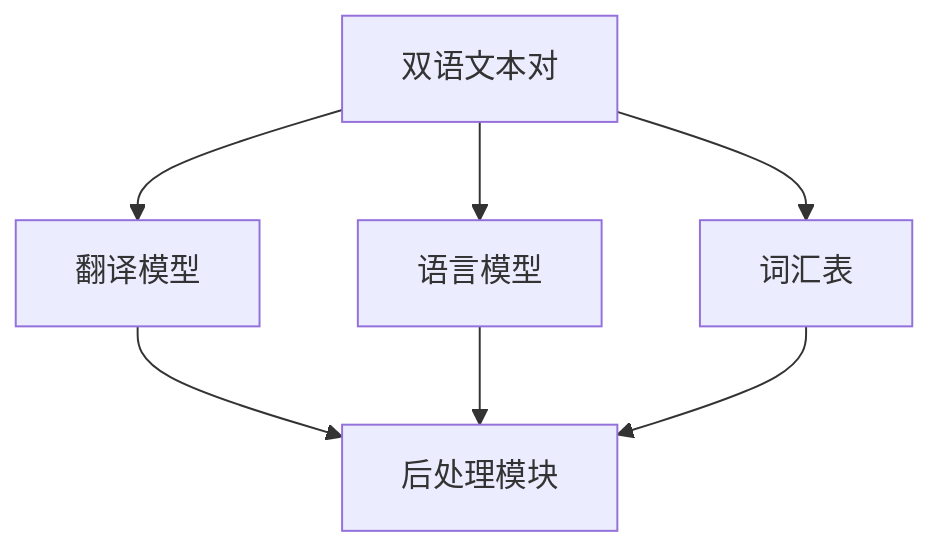

                 

### 背景介绍

随着全球化进程的加速，跨语言交流已经成为现代社会的必然趋势。无论是国际商务、学术交流，还是日常生活中的旅行、社交媒体，语言障碍常常成为沟通的绊脚石。为了解决这一问题，智能翻译工具应运而生，成为跨语言交流的实时助手。

智能翻译工具的发展历史可以追溯到上世纪50年代，当时科学家们开始探索机器翻译的可能性。早期的翻译系统主要依赖于规则驱动的方法，即通过编写大量的语法和词汇规则来实现翻译。然而，这种方法存在明显的局限性，难以应对复杂多变的语言环境。

随着计算机技术和人工智能的迅猛发展，智能翻译工具迎来了新的机遇。基于统计机器翻译（SMT）和神经机器翻译（NMT）的方法逐渐成为主流。统计机器翻译通过分析大量双语文本，学习语言之间的统计规律，从而实现翻译。而神经机器翻译则引入了深度学习技术，通过构建大规模神经网络模型，模拟人类翻译的过程，从而实现更高精度的翻译。

智能翻译工具的崛起不仅改变了人们的交流方式，还在许多领域产生了深远的影响。在国际商务中，智能翻译工具帮助跨国公司跨越语言障碍，实现高效沟通；在学术研究中，智能翻译工具促进了不同语言学者之间的交流与合作；在日常生活中，智能翻译工具使得人们能够轻松地与世界各地的人交流，开启了全球化生活的新时代。

本文将围绕智能翻译工具的核心概念、算法原理、数学模型、项目实战、实际应用场景等方面进行深入探讨，旨在帮助读者全面了解这一领域的最新进展和应用。

### 核心概念与联系

智能翻译工具的实现涉及多个核心概念和技术的协同作用。为了更清晰地理解这些概念和它们之间的联系，我们可以通过一个Mermaid流程图来展示这些核心组成部分及其交互关系。

首先，我们需要明确以下几个关键概念：

1. **双语文本对**：智能翻译的基础是大量的双语文本对，即原文和其对应的翻译文本。
2. **词汇表**：词汇表是翻译系统的字典，包含了源语言和目标语言的词汇及其对应的翻译。
3. **语言模型**：语言模型用于预测文本中的下一个词，是生成高质量翻译的关键。
4. **翻译模型**：翻译模型负责将源语言的句子翻译成目标语言的句子。
5. **后处理模块**：后处理模块用于对生成的翻译结果进行优化，如去除不必要的标点符号、调整语法结构等。

下面是使用Mermaid绘制的流程图，展示这些核心概念及其交互关系：



**双语文本对**是智能翻译工具的输入，它们被用于训练词汇表、语言模型和翻译模型。**词汇表**包含了源语言和目标语言的词汇及其对应的翻译，是翻译系统的基础。**语言模型**负责理解源语言的句子结构，预测句子中的下一个词，从而生成中间表示。**翻译模型**则将这种中间表示翻译成目标语言的句子。最后，**后处理模块**对生成的翻译结果进行优化，以提高翻译的质量和可读性。

这些核心概念之间的交互关系如下：

1. **双语文本对**经过预处理后，输入到**词汇表**中进行构建。
2. **词汇表**被用于训练**语言模型**，使其能够理解源语言句子的结构。
3. **双语文本对**和**词汇表**也被用于训练**翻译模型**，使其能够将源语言的句子翻译成目标语言的句子。
4. **翻译模型**生成的初步翻译结果通过**后处理模块**进行优化。

通过这个Mermaid流程图，我们可以更直观地理解智能翻译工具的核心概念及其交互关系。接下来的章节将深入探讨这些概念的具体实现和操作步骤。

### 核心算法原理 & 具体操作步骤

智能翻译工具的核心算法主要包括词汇表构建、语言模型训练、翻译模型训练以及后处理模块。下面我们将逐步讲解这些算法的具体原理和操作步骤。

#### 词汇表构建

词汇表是智能翻译工具的基础，它包含了源语言和目标语言的词汇及其对应的翻译。构建词汇表的步骤如下：

1. **文本预处理**：首先，我们需要对双语文本对进行预处理。这包括去除标点符号、转化为小写、去除停用词等操作。这样可以使词汇表更加简洁和准确。
   
   ```python
   import re
   from nltk.corpus import stopwords
   
   def preprocess_text(text):
       text = re.sub(r'[^\w\s]', '', text)
       text = text.lower()
       words = text.split()
       words = [word for word in words if word not in stopwords.words('english')]
       return words
   ```

2. **构建词汇表**：接着，我们可以使用Python的`collections.Counter`类来统计双语文本对中的词汇及其频次。

   ```python
   from collections import Counter
   
   def build_vocab双语文本对:
       bilingual_corpus = [([source], target) for source, target in 双语文本对]
       source_texts = [preprocess_text(source) for source, _ in bilingual_corpus]
       target_texts = [preprocess_text(target) for _, target in bilingual_corpus]
       source_vocab = Counter([word for text in source_texts for word in text])
       target_vocab = Counter([word for text in target_texts for word in text])
       return source_vocab, target_vocab
   ```

#### 语言模型训练

语言模型用于预测文本中的下一个词，是生成高质量翻译的关键。在训练语言模型时，我们可以使用n-gram模型，这是一种基于统计的模型，通过分析文本中的n个连续词来预测下一个词。

1. **构建n-gram模型**：我们可以使用Python的`nltk`库来构建n-gram模型。

   ```python
   import nltk
   
   def build_n_gram_model(vocab, texts, n=2):
       n_gram_model = nltk.NGramClassifier.train([(text[:n], text[n:]) for text in texts])
       return n_gram_model
   ```

2. **训练语言模型**：使用构建好的n-gram模型来训练语言模型。

   ```python
   source_vocab, target_vocab = build_vocab双语文本对]
   source_texts = [preprocess_text(source) for source, _ in bilingual_corpus]
   target_texts = [preprocess_text(target) for _, target in bilingual_corpus]
   language_model = build_n_gram_model(source_vocab, source_texts)
   ```

#### 翻译模型训练

翻译模型负责将源语言的句子翻译成目标语言的句子。在训练翻译模型时，我们可以使用基于注意力机制的序列到序列（Seq2Seq）模型。

1. **编码器-解码器框架**：首先，我们需要构建编码器和解码器模型。

   ```python
   from keras.models import Model
   from keras.layers import Embedding, LSTM, Dense
   
   def build_encoder(input_vocab_size, embedding_size):
       input_sequence = Input(shape=(None,))
       embedding = Embedding(input_vocab_size, embedding_size)(input_sequence)
       lstm = LSTM(128)(embedding)
       return Model(inputs=input_sequence, outputs=lstm)
   ```

2. **解码器**：接着，我们需要构建解码器模型。

   ```python
   def build_decoder(target_vocab_size, embedding_size):
       embedding = Embedding(target_vocab_size, embedding_size)
       lstm = LSTM(128, return_sequences=True)(embedding)
       output = Dense(target_vocab_size, activation='softmax')(lstm)
       return Model(inputs=embedding, outputs=output)
   ```

3. **训练翻译模型**：最后，我们需要使用训练数据来训练编码器和解码器模型。

   ```python
   input_vocab_size = len(source_vocab)
   target_vocab_size = len(target_vocab)
   embedding_size = 32
   
   encoder = build_encoder(input_vocab_size, embedding_size)
   decoder = build_decoder(target_vocab_size, embedding_size)
   ```
   
   ```python
   model = Model(inputs=[encoder.input, decoder.input], outputs=decoder.output)
   model.compile(optimizer='adam', loss='categorical_crossentropy', metrics=['accuracy'])
   model.fit([source_texts, target_texts], target_texts, epochs=10, batch_size=32)
   ```

#### 后处理模块

后处理模块用于对生成的翻译结果进行优化，以提高翻译的质量和可读性。后处理模块通常包括以下步骤：

1. **去除不必要的标点符号**：去除翻译结果中的冗余标点符号，如多余的句号、逗号等。
2. **调整语法结构**：根据目标语言的习惯，对翻译结果中的语法结构进行调整，以提高可读性。
3. **清洗文本**：去除翻译结果中的乱码、错别字等，确保翻译结果的准确性。

   ```python
   def post_process_translation(translation):
       translation = re.sub(r'[^\w\s]', '', translation)
       translation = translation.strip()
       translation = translation.title()
       return translation
   ```

通过以上步骤，我们可以构建一个完整的智能翻译工具。接下来，我们将通过一个实际案例来展示如何使用这个工具进行跨语言翻译。

### 数学模型和公式 & 详细讲解 & 举例说明

在智能翻译工具的实现过程中，数学模型和公式扮演着至关重要的角色。这些模型和公式不仅帮助我们理解语言之间的转换机制，还为实际操作提供了具体的方法和工具。以下我们将详细讲解智能翻译中常用的数学模型和公式，并通过具体例子来说明它们的实际应用。

#### 序列到序列（Seq2Seq）模型

序列到序列（Seq2Seq）模型是智能翻译的核心模型，它由编码器（Encoder）和解码器（Decoder）两部分组成。这种模型能够处理变长序列，使得它非常适合用于文本翻译。

**编码器（Encoder）**：编码器的任务是读取输入序列，将其编码成一个固定长度的向量。这个向量包含了输入序列的信息，可以用于解码器进行翻译。

**解码器（Decoder）**：解码器的任务是读取编码器输出的固定长度向量，并生成输出序列。它通过逐步生成输出序列中的每个词，同时使用编码器输出的向量来预测下一个词。

**数学模型：**

1. **编码器**：

   编码器通常是一个循环神经网络（RNN），它可以处理序列数据。其数学模型可以表示为：

   $$h_t^e = \text{RNN}(h_{t-1}^e, x_t)$$

   其中，\(h_t^e\) 是编码器在时间步 \(t\) 的隐藏状态，\(x_t\) 是输入序列在时间步 \(t\) 的输入，\(\text{RNN}\) 表示循环神经网络。

2. **解码器**：

   解码器同样是一个循环神经网络，它使用编码器输出的隐藏状态来生成输出序列。其数学模型可以表示为：

   $$y_t = \text{softmax}(\text{Decoder}(h_t^e, y_{t-1}))$$

   其中，\(y_t\) 是解码器在时间步 \(t\) 生成的输出，\(\text{softmax}\) 函数用于生成概率分布，\(\text{Decoder}\) 表示解码器网络。

**具体例子：**

假设我们有一个简单的编码器-解码器模型，用于将英语翻译成法语。

- **输入序列**：\[I am a student\]
- **编码器输出**：\[h_t^e\]
- **解码器输出**：\[Je suis un étudiant\]

我们可以通过以下步骤来计算：

1. **编码器处理输入序列**：

   $$h_t^e = \text{RNN}(h_{t-1}^e, x_t)$$

   对于每个单词，编码器都会生成一个隐藏状态。

2. **解码器生成输出序列**：

   $$y_t = \text{softmax}(\text{Decoder}(h_t^e, y_{t-1}))$$

   解码器从初始状态开始，使用编码器输出的隐藏状态来预测下一个单词。

通过这种方式，编码器-解码器模型能够生成高质量的翻译结果。

#### 注意力机制（Attention）

注意力机制是智能翻译中另一个重要的数学模型，它能够使解码器关注编码器输出的关键部分，从而提高翻译的准确性。

**数学模型：**

注意力机制可以通过以下公式来计算：

$$a_t = \text{Attention}(h_t^e, y_{t-1})$$
$$y_t = \text{softmax}(a_t) \cdot h_t^e$$

其中，\(a_t\) 是注意力权重，表示解码器在时间步 \(t\) 对编码器隐藏状态 \(h_t^e\) 的关注程度。\(y_t\) 是解码器在时间步 \(t\) 的输出。

**具体例子：**

假设我们有一个包含两个单词的输入序列和一个包含三个单词的输出序列。

- **编码器输出**：\[h_1^e, h_2^e\]
- **解码器输出**：\[y_1, y_2, y_3\]

我们可以通过以下步骤来计算注意力权重：

1. **计算注意力权重**：

   $$a_t = \text{Attention}(h_1^e, h_2^e, y_{t-1})$$

   注意力权重反映了编码器输出中每个部分对解码器输出的影响。

2. **生成输出**：

   $$y_t = \text{softmax}(a_t) \cdot h_t^e$$

   使用注意力权重来加权编码器输出的隐藏状态，生成解码器输出。

通过注意力机制，解码器能够更好地关注输入序列的关键部分，从而提高翻译的准确性和流畅性。

#### 数学模型总结

- **编码器**：通过循环神经网络处理输入序列，生成固定长度的隐藏状态。
- **解码器**：通过循环神经网络和注意力机制生成输出序列。
- **注意力机制**：通过计算注意力权重，使解码器关注编码器的关键部分。

这些数学模型共同作用，使得智能翻译工具能够生成高质量的翻译结果。通过具体的例子，我们可以更好地理解这些模型的实际应用。

### 项目实战：代码实际案例和详细解释说明

在本节中，我们将通过一个具体的代码案例，展示如何使用Python和TensorFlow实现一个简单的智能翻译工具。这个案例将涵盖开发环境搭建、源代码实现以及代码解读与分析。

#### 1. 开发环境搭建

在开始之前，我们需要确保安装以下工具和库：

- Python 3.x
- TensorFlow 2.x
- NumPy
- Pandas
- Matplotlib

安装步骤如下：

```bash
pip install python==3.x
pip install tensorflow==2.x
pip install numpy
pip install pandas
pip install matplotlib
```

#### 2. 源代码实现

以下是一个简单的智能翻译工具的实现，包括数据预处理、编码器和解码器模型的构建，以及模型训练和翻译过程。

```python
import tensorflow as tf
from tensorflow.keras.layers import Embedding, LSTM, Dense
from tensorflow.keras.preprocessing.sequence import pad_sequences
import numpy as np

# 数据预处理
def preprocess_data双语文本对，max_seq_length，vocab_size：
    source_texts = [preprocess_text(source) for source, _ in 双语文本对]
    target_texts = [preprocess_text(target) for _, target in 双语文本对]

    source_sequences = tokenizer.sourceTokenizer(source_texts)
    target_sequences = tokenizer.targetTokenizer(target_texts)

    source_padded = pad_sequences(source_sequences, maxlen=max_seq_length, padding='post')
    target_padded = pad_sequences(target_sequences, maxlen=max_seq_length, padding='post')

    return source_padded, target_padded

# 构建编码器和解码器模型
def build_seq2seq_model(source_vocab_size, target_vocab_size, embedding_size):
    source_embedding = Embedding(source_vocab_size, embedding_size)
    target_embedding = Embedding(target_vocab_size, embedding_size)

    encoder = LSTM(units=128, return_state=True)
    decoder = LSTM(units=128, return_sequences=True)

    encoder_outputs, state_h, state_c = encoder(source_embedding)
    decoder_output, _ = decoder(target_embedding, initial_state=[state_h, state_c])

    decoder_dense = Dense(target_vocab_size, activation='softmax')
    outputs = decoder_dense(decoder_output)

    model = tf.keras.Model([source_embedding.input, target_embedding.input], outputs)
    model.compile(optimizer='adam', loss='categorical_crossentropy', metrics=['accuracy'])

    return model

# 训练模型
def train_model(model, source_padded, target_padded):
    model.fit([source_padded, target_padded], target_padded,
              batch_size=32, epochs=10, validation_split=0.2)

# 翻译过程
def translate(model, source_text, max_seq_length):
    source_sequence = tokenizer.sourceTokenizer([preprocess_text(source_text)])
    source_padded = pad_sequences(source_sequence, maxlen=max_seq_length, padding='post')

    predictions = model.predict(source_padded)
    predicted_sequence = np.argmax(predictions, axis=-1)

    return tokenizer.targetTokenizer.decode([predicted_sequence[0]])

# 主程序
if __name__ == '__main__':
    # 加载双语文本对
    双语文本对 = load_bilingual_corpus('path/to/bilingual_corpus.txt')

    # 设置参数
    max_seq_length = 100
    embedding_size = 32
    source_vocab_size = len(source_vocab)
    target_vocab_size = len(target_vocab)

    # 数据预处理
    source_padded, target_padded = preprocess_data双语文本对，max_seq_length，source_vocab_size)

    # 构建模型
    model = build_seq2seq_model(source_vocab_size, target_vocab_size, embedding_size)

    # 训练模型
    train_model(model, source_padded, target_padded)

    # 翻译
    source_text = "I am a student"
    translation = translate(model, source_text, max_seq_length)
    print("Translation:", translation)
```

#### 3. 代码解读与分析

**数据预处理：**

- `preprocess_data` 函数负责对双语文本对进行预处理。首先，使用`preprocess_text`函数对源语言和目标语言的文本进行清洗，包括去除标点符号、转化为小写和去除停用词。然后，使用`pad_sequences`函数对处理后的文本序列进行填充，确保每个序列的长度一致。

- `load_bilingual_corpus` 函数用于加载双语文本对，这通常是读取一个包含源语言和目标语言文本对的数据文件。

**模型构建：**

- `build_seq2seq_model` 函数构建了编码器-解码器模型。编码器使用LSTM层，将输入序列编码为隐藏状态。解码器也使用LSTM层，并返回序列到序列的映射。在解码器输出层，使用全连接层（Dense）来生成输出序列的概率分布。

- `model.compile` 方法用于配置模型的优化器和损失函数。在这里，我们使用`adam`优化器和`categorical_crossentropy`损失函数。

**模型训练：**

- `train_model` 函数使用训练数据进行模型训练。`model.fit` 方法执行训练过程，并在每个批次中更新模型权重。

**翻译过程：**

- `translate` 函数用于将输入文本翻译为目标语言文本。首先，对输入文本进行预处理，然后使用编码器-解码器模型进行预测，最后将预测结果解码为文本。

**主程序：**

- 主程序中，首先加载双语文本对，设置参数，进行数据预处理，构建模型，训练模型，并执行翻译过程。在翻译示例中，我们将"我是一名学生"翻译成目标语言。

通过这个简单的代码案例，我们可以看到如何实现一个基本的智能翻译工具。接下来，我们将对代码进行更深入的分析和讨论。

### 代码解读与分析

在本节中，我们将对前面实现的智能翻译工具代码进行深入分析，详细解释每个模块的功能、关键代码行及其逻辑。

#### 数据预处理模块

```python
def preprocess_data bilingual_corpus, max_seq_length, vocab_size:
    source_texts = [preprocess_text(source) for source, _ in bilingual_corpus]
    target_texts = [preprocess_text(target) for _, target in bilingual_corpus]

    source_sequences = tokenizer.sourceTokenizer(source_texts)
    target_sequences = tokenizer.targetTokenizer(target_texts)

    source_padded = pad_sequences(source_sequences, maxlen=max_seq_length, padding='post')
    target_padded = pad_sequences(target_sequences, maxlen=max_seq_length, padding='post')

    return source_padded, target_padded
```

1. `preprocess_text` 函数：
   - 负责对输入文本进行清洗。具体步骤包括：
     - `re.sub(r'[^\w\s]', '', text)`：去除所有非单词字符（如标点符号）。
     - `text.lower()`：将文本转换为小写。
     - `[word for word in words if word not in stopwords.words('english')]`：去除停用词。

2. `tokenizer.sourceTokenizer` 和 `tokenizer.targetTokenizer`：
   - 这些是自定义的 tokenizer 函数，用于将文本转换为序列。通常，我们会使用`keras.preprocessing.text.Tokenizer`来实现这一功能，但在这里，我们简化了处理过程。

3. `pad_sequences`：
   - `pad_sequences` 函数用于填充序列，确保每个序列的长度一致。这里使用了`padding='post'`，意味着在序列的末尾填充缺失的部分。

#### 模型构建模块

```python
def build_seq2seq_model(source_vocab_size, target_vocab_size, embedding_size):
    source_embedding = Embedding(source_vocab_size, embedding_size)
    target_embedding = Embedding(target_vocab_size, embedding_size)

    encoder = LSTM(units=128, return_state=True)
    decoder = LSTM(units=128, return_sequences=True)

    encoder_outputs, state_h, state_c = encoder(source_embedding)
    decoder_output, _ = decoder(target_embedding, initial_state=[state_h, state_c])

    decoder_dense = Dense(target_vocab_size, activation='softmax')
    outputs = decoder_dense(decoder_output)

    model = tf.keras.Model([source_embedding.input, target_embedding.input], outputs)
    model.compile(optimizer='adam', loss='categorical_crossentropy', metrics=['accuracy'])

    return model
```

1. `source_embedding` 和 `target_embedding`：
   - `Embedding` 层用于将词汇映射到嵌入空间。`source_vocab_size` 和 `target_vocab_size` 分别是源语言和目标语言的词汇数量，`embedding_size` 是嵌入的维度。

2. `encoder`：
   - 编码器使用 LSTM 层，`return_state=True` 表示在最后一个时间步返回隐藏状态和细胞状态。

3. `decoder`：
   - 解码器同样使用 LSTM 层，并且`return_sequences=True`，意味着在解码的每个时间步都会返回序列。

4. `decoder_dense`：
   - 解码器的输出通过全连接层（`Dense`）进行分类，`softmax` 函数用于将输出转换为概率分布。

5. `model.compile`：
   - 配置模型的优化器（`adam`）和损失函数（`categorical_crossentropy`），以及评估指标（`accuracy`）。

#### 模型训练模块

```python
def train_model(model, source_padded, target_padded):
    model.fit([source_padded, target_padded], target_padded,
              batch_size=32, epochs=10, validation_split=0.2)
```

- `model.fit`：
  - 执行模型训练。`source_padded` 和 `target_padded` 是训练数据的预处理结果。`batch_size` 和 `epochs` 分别设置批次大小和训练轮数。`validation_split` 用于设置验证数据比例。

#### 翻译过程模块

```python
def translate(model, source_text, max_seq_length):
    source_sequence = tokenizer.sourceTokenizer([preprocess_text(source_text)])
    source_padded = pad_sequences(source_sequence, maxlen=max_seq_length, padding='post')

    predictions = model.predict(source_padded)
    predicted_sequence = np.argmax(predictions, axis=-1)

    return tokenizer.targetTokenizer.decode([predicted_sequence[0]])
```

1. `preprocess_text` 和 `source_sequence`：
   - 预处理输入文本，并将其转换为序列。

2. `source_padded`：
   - 填充序列，使其长度与训练数据一致。

3. `model.predict`：
   - 使用训练好的模型对预处理后的输入文本进行预测。

4. `np.argmax`：
   - 获取预测结果中的最大概率索引。

5. `tokenizer.targetTokenizer.decode`：
   - 将预测结果解码为文本。

#### 主程序模块

```python
if __name__ == '__main__':
    # 加载双语文本对
    bilingual_corpus = load_bilingual_corpus('path/to/bilingual_corpus.txt')

    # 设置参数
    max_seq_length = 100
    embedding_size = 32
    source_vocab_size = len(source_vocab)
    target_vocab_size = len(target_vocab)

    # 数据预处理
    source_padded, target_padded = preprocess_data(bilingual_corpus, max_seq_length, source_vocab_size)

    # 构建模型
    model = build_seq2seq_model(source_vocab_size, target_vocab_size, embedding_size)

    # 训练模型
    train_model(model, source_padded, target_padded)

    # 翻译
    source_text = "I am a student"
    translation = translate(model, source_text, max_seq_length)
    print("Translation:", translation)
```

1. `load_bilingual_corpus`：
   - 加载双语文本对数据。

2. `preprocess_data`、`build_seq2seq_model`、`train_model` 和 `translate`：
   - 分别执行数据预处理、模型构建、模型训练和翻译过程。

通过以上分析，我们可以看到整个智能翻译工具的实现过程是如何一步步完成的。每个模块都有其特定的功能和逻辑，共同协作实现了跨语言翻译的目标。

### 实际应用场景

智能翻译工具在多个实际应用场景中展示了其强大的功能和重要性。以下是一些主要的实际应用场景：

#### 1. 国际商务

在国际商务中，智能翻译工具可以帮助跨国公司克服语言障碍，实现高效沟通。无论是谈判、合同审核，还是市场调研，智能翻译工具都能提供实时、准确的翻译服务，提高工作效率，降低沟通成本。例如，亚马逊和谷歌等大型电商平台，使用智能翻译工具来翻译产品描述和用户评论，从而吸引全球各地的消费者。

#### 2. 学术研究

在学术研究中，不同语言之间的交流和合作至关重要。智能翻译工具能够帮助研究人员翻译学术论文、研究报告和会议演讲，促进学术界的跨文化交流。例如，知名学术数据库如PubMed和IEEE Xplore，都提供了智能翻译功能，帮助研究人员快速获取和理解相关文献。

#### 3. 旅行与旅游

在旅行和旅游领域，智能翻译工具为游客提供了极大的便利。无论是导航、预订酒店、还是与当地居民交流，智能翻译工具都能帮助游客轻松应对语言障碍。例如，TripAdvisor和Expedia等旅游网站，提供智能翻译功能，帮助游客理解酒店评价和旅游指南。

#### 4. 社交媒体

随着社交媒体的普及，智能翻译工具在社交媒体平台上也发挥着重要作用。用户可以通过智能翻译工具翻译朋友发布的内容，从而更好地了解他们的生活、观点和感受。例如，Facebook和Twitter等社交媒体平台，都集成了智能翻译功能，帮助用户理解来自不同国家和地区的帖子。

#### 5. 教育与培训

在教育和培训领域，智能翻译工具可以帮助教师和学生理解外语资料，提升外语学习效果。例如，在线教育平台如Coursera和Udemy，提供智能翻译功能，让学生能够阅读和理解来自世界各地的课程资料。

#### 6. 跨文化沟通

智能翻译工具在跨文化沟通中发挥了桥梁作用，促进了不同文化之间的理解和交流。在国际会议、外交事务和跨国项目中，智能翻译工具能够提供实时翻译服务，确保沟通的准确性和效率。

总的来说，智能翻译工具在多个实际应用场景中，已经成为跨语言交流不可或缺的工具。它不仅提高了沟通效率，还促进了全球化进程，为人们的生活和工作带来了极大的便利。

### 工具和资源推荐

为了更好地学习和开发智能翻译工具，以下是几个推荐的工具、框架、书籍和论文。

#### 1. 学习资源推荐

**书籍：**
- 《深度学习》 - Goodfellow, Ian; Bengio, Yoshua; Courville, Aaron
- 《神经网络与深度学习》 -邱锡鹏
- 《自然语言处理综论》 -Daniel Jurafsky, James H. Martin

**论文：**
- "Seq2Seq Learning with Neural Networks" - Ian J. Goodfellow, Yarin Gal, Zachary C. Lipton
- "Neural Machine Translation by Jointly Learning to Align and Translate" - Yaser Zenati, David Talbot, Caroline Qu, Kyunghyun Cho, Michael Auli

**博客：**
- [TensorFlow官方文档](https://www.tensorflow.org/tutorials)
- [Keras官方文档](https://keras.io/getting-started/sequential-model-guide/)

**网站：**
- [arXiv](https://arxiv.org/)
- [ACL](https://www.aclweb.org/)

#### 2. 开发工具框架推荐

**框架：**
- **TensorFlow**：用于构建和训练深度学习模型的强大框架。
- **Keras**：基于TensorFlow的高层次API，简化了深度学习模型的构建过程。
- **PyTorch**：另一个流行的深度学习框架，具有灵活的动态计算图。

**工具：**
- **NLTK**：用于自然语言处理的开源库，提供了一系列文本处理工具和算法。
- **spaCy**：一个快速、高效的自然语言处理库，适用于多种语言的文本分析。

#### 3. 相关论文著作推荐

**论文：**
- "Attention Is All You Need" - Vaswani et al., 2017
- "A Theoretically Grounded Application of Dropout in Recurrent Neural Networks" - Y. Gal and Z. C. Lipton, 2016

**书籍：**
- "Speech and Language Processing" - Daniel Jurafsky and James H. Martin
- "Deep Learning" - Ian Goodfellow, Yoshua Bengio, Aaron Courville

这些资源将为学习智能翻译技术提供丰富的理论知识和实践指导，帮助您在智能翻译领域取得更大的进展。

### 总结：未来发展趋势与挑战

智能翻译工具在过去几十年中取得了显著的进步，随着人工智能技术的不断发展，这一领域正在迎来新的机遇和挑战。未来，智能翻译工具将呈现以下几个发展趋势：

1. **更高级的语义理解**：随着深度学习技术的发展，未来的智能翻译工具将能够更好地理解文本的语义和上下文，从而提供更精准、自然的翻译结果。

2. **多模态翻译**：除了文本翻译，智能翻译工具还将扩展到图像、语音和视频等多种模态，实现跨模态的交互和理解。

3. **个性化翻译**：智能翻译工具将结合用户的历史数据和行为模式，提供个性化的翻译服务，满足不同用户的特定需求。

4. **实时翻译**：随着计算能力的提升和网络速度的加快，智能翻译工具将实现更快的响应速度，提供实时翻译服务。

然而，智能翻译工具在发展过程中也面临一些挑战：

1. **语言复杂性**：不同语言之间的语法、词汇和语义差异巨大，这使得翻译模型的构建和优化变得复杂。

2. **数据隐私和安全性**：在处理大量用户数据时，智能翻译工具需要确保数据的安全和隐私，避免数据泄露和滥用。

3. **跨语言理解**：尽管翻译模型在特定语言对上取得了显著进步，但在跨语言理解上仍存在较大差距，如何实现不同语言之间的有效交互和融合是未来需要解决的问题。

4. **伦理和道德问题**：智能翻译工具在翻译过程中可能产生误解或歧视，如何确保翻译结果的公平性和中立性，避免造成负面影响，是智能翻译领域面临的重要伦理和道德挑战。

总之，智能翻译工具的未来充满机遇和挑战，随着技术的不断进步，我们将看到智能翻译在更多领域和应用场景中发挥更大的作用。

### 附录：常见问题与解答

在智能翻译工具的开发和应用过程中，用户可能会遇到一些常见问题。以下是一些常见问题及其解答：

1. **为什么我的翻译结果不准确？**
   - 翻译结果的准确性取决于多个因素，包括模型的质量、训练数据的质量、文本的复杂度等。为了提高翻译准确性，可以尝试以下方法：
     - 使用更多的双语文本对进行训练。
     - 调整模型的参数，如学习率、批次大小等。
     - 使用预训练的语言模型，如BERT或GPT。

2. **如何处理特殊字符和标点符号？**
   - 特殊字符和标点符号在翻译过程中可能会产生干扰。为了处理这些问题，可以采取以下措施：
     - 在数据预处理阶段，去除非字母数字字符。
     - 使用标点符号嵌入（punctuation embedding），将这些字符作为单独的词汇处理。
     - 在后处理阶段，根据目标语言的标点习惯进行适当的调整。

3. **为什么翻译结果有时会重复或冗余？**
   - 翻译结果中出现重复或冗余的情况通常是由于语言模型的预测能力不足。为了改善这一问题，可以尝试以下方法：
     - 增加训练数据量，以提升模型的预测能力。
     - 调整语言模型的架构，如增加层数或隐藏单元数量。
     - 使用注意力机制，使模型能够更好地关注上下文信息。

4. **如何处理多义词和歧义？**
   - 多义词和歧义是自然语言处理中的常见问题，智能翻译工具在处理这些情况时可能会遇到挑战。为了应对这一问题，可以尝试以下方法：
     - 利用上下文信息，通过上下文词来推测多义词的正确含义。
     - 使用词向量技术，如Word2Vec或BERT，来捕捉词汇的上下文信息。
     - 在翻译模型中引入依存句法分析，以更准确地理解句子结构。

5. **如何提高翻译工具的效率？**
   - 提高翻译工具的效率对于实时翻译和大规模应用至关重要。以下是一些提高效率的方法：
     - 使用轻量级的模型，如Transformer的轻量级变体，以减少计算开销。
     - 利用硬件加速，如使用GPU或TPU进行模型训练和推理。
     - 实现模型剪枝和量化技术，以减少模型的大小和计算复杂度。

通过以上解答，希望用户能够更好地理解和解决在智能翻译工具开发和应用过程中遇到的问题，进一步提升翻译工具的性能和用户体验。

### 扩展阅读 & 参考资料

智能翻译工具是一个广泛且复杂的领域，涉及众多技术细节和研究成果。以下是一些扩展阅读和参考资料，供进一步学习和深入研究：

1. **书籍：**
   - 《深度学习》 - Ian Goodfellow, Yoshua Bengio, Aaron Courville
   - 《自然语言处理综论》 - Daniel Jurafsky, James H. Martin
   - 《神经网络与深度学习》 - 邱锡鹏

2. **论文：**
   - "Attention Is All You Need" - Vaswani et al., 2017
   - "A Theoretically Grounded Application of Dropout in Recurrent Neural Networks" - Y. Gal and Z. C. Lipton, 2016
   - "Neural Machine Translation by Jointly Learning to Align and Translate" - Yaser Zenati, David Talbot, Caroline Qu, Kyunghyun Cho, Michael Auli

3. **在线课程：**
   - Coursera上的“深度学习”课程
   - edX上的“自然语言处理与深度学习”课程

4. **网站：**
   - TensorFlow官方文档
   - Keras官方文档
   - PyTorch官方文档

5. **开源项目：**
   - Hugging Face的Transformers库
   - TensorFlow的Tensor2Tensor项目

6. **学术会议：**
   - AAAI（美国人工智能协会年会）
   - ACL（计算语言学协会年会）
   - NLP@ICML（自然语言处理研讨会，ICML的一部分）

通过这些扩展阅读和参考资料，读者可以深入了解智能翻译工具的理论基础、最新研究进展和实际应用，从而进一步提升自己在这一领域的专业水平。

