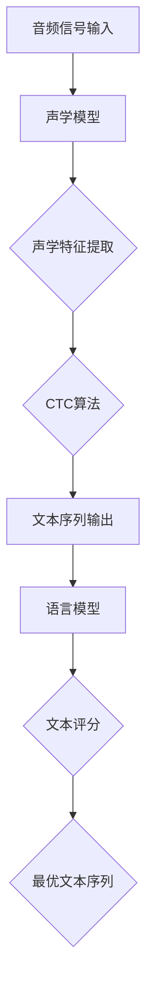

                 

# 智能语音识别：AI大模型在音频处理中的突破

## 概述

近年来，人工智能（AI）技术在语音识别领域取得了令人瞩目的突破。本文将探讨智能语音识别技术，特别是基于大规模深度学习模型的方法，在音频处理中的突破性进展。随着语音交互的广泛应用，如智能助手、语音翻译和语音控制等，语音识别技术的准确性和效率成为影响用户体验的关键因素。本文旨在通过系统地介绍语音识别技术的核心概念、算法原理、数学模型以及实际应用案例，帮助读者深入理解这一领域的最新发展。

## 背景介绍

### 语音识别技术的发展历程

语音识别技术自20世纪50年代问世以来，经历了从规则基方法到统计方法，再到深度学习方法的逐步演变。早期的语音识别主要依赖于基于语音信号特征的规则模型，如频谱分析、倒谱分析和共振峰建模等。这些方法虽然在一定程度上实现了语音识别，但存在准确率低、适应性差等局限性。

随着计算能力的提升和深度学习技术的兴起，语音识别领域迎来了新的发展机遇。基于深度神经网络（DNN）的端到端语音识别模型逐渐成为主流。DNN模型通过多层神经元的非线性组合，能够从大量数据中自动提取特征，实现高精度、自适应的语音识别。

### 智能语音助手与语音交互的兴起

近年来，智能语音助手（如苹果的Siri、亚马逊的Alexa和谷歌的Google Assistant）的广泛应用，推动了语音交互技术的快速发展。这些智能语音助手通过语音识别技术，实现了与用户的自然语言交互，为人们提供了便捷的智能服务。随着语音交互逐渐成为人机交互的重要方式，语音识别技术在准确率和响应速度上的提升显得尤为重要。

### 大规模深度学习模型的优势

大规模深度学习模型，如Transformer模型，在语音识别领域取得了显著的突破。与传统的DNN模型相比，Transformer模型具有更强的上下文理解和长距离依赖处理能力，使得语音识别的准确率得到了显著提升。此外，大规模深度学习模型还能通过迁移学习技术，快速适应不同的语音数据集，提高模型的泛化能力。

## 核心概念与联系

### 声学模型

声学模型是语音识别系统的核心组件，负责将输入的音频信号转换为相应的文本。声学模型通常采用深度神经网络结构，包括多个隐藏层和输出层。每个隐藏层通过对音频信号的加权和非线性变换，提取出不同层次的声学特征。声学模型的训练目标是找到一组参数，使得模型在给定音频信号时，能够输出与实际语音文本相符的序列。

### 语言模型

语言模型是语音识别系统的另一个关键组件，用于对识别出的文本进行概率评分，以判断文本的合理性。语言模型通常采用基于N元语法或循环神经网络（RNN）的结构。语言模型通过对大量文本语料库的学习，能够捕捉到语言中的统计规律，从而为语音识别提供合理的文本预测。

### CTC（Connectionist Temporal Classification）算法

CTC算法是一种端到端的语音识别框架，能够直接将音频信号映射到文本序列，避免了传统框架中的分词和错误纠正步骤。CTC算法的核心思想是将输入序列映射到所有可能的文本序列，并利用神经网络对每个可能的文本序列进行评分。CTC算法的显著优势是能够在没有分词信息的情况下，处理连续语音信号。

### Mermaid流程图

以下是语音识别系统的Mermaid流程图，展示了声学模型、语言模型和CTC算法之间的联系。



## 核心算法原理与具体操作步骤

### 声学模型原理

声学模型的核心是深度神经网络，通常采用卷积神经网络（CNN）或递归神经网络（RNN）结构。CNN通过多层卷积和池化操作，从音频信号中提取局部特征，而RNN则通过递归结构，捕捉语音信号中的时间依赖关系。以下是一个基于CNN的声学模型的具体操作步骤：

1. **数据预处理**：将音频信号转换为频率域表示，如短时傅里叶变换（STFT）。

2. **卷积层**：通过卷积操作，提取音频信号中的局部特征。

3. **池化层**：通过池化操作，降低特征图的维度，减少计算量。

4. **全连接层**：将池化后的特征映射到高维空间，进行分类。

5. **输出层**：输出语音信号的文本序列。

### 语言模型原理

语言模型的核心是概率分布模型，用于对识别出的文本进行评分。以下是一个基于N元语法语言模型的具体操作步骤：

1. **文本语料库**：收集大量的文本数据，用于训练语言模型。

2. **词嵌入**：将文本中的每个词映射到高维向量空间。

3. **N元语法模型**：计算词序列的概率分布，用于对识别出的文本序列进行评分。

4. **输出层**：对识别出的文本序列进行概率评分。

### CTC算法原理

CTC算法的核心思想是将输入序列映射到所有可能的文本序列，并利用神经网络对每个可能的文本序列进行评分。以下是一个基于CTC算法的具体操作步骤：

1. **输入序列**：将音频信号输入到声学模型中，得到声学特征。

2. **CTC模型**：构建CTC神经网络，包括输入层、隐藏层和输出层。

3. **前向传播**：计算输入序列到每个可能文本序列的分数。

4. **后向传播**：计算每个可能文本序列的梯度，更新网络参数。

5. **输出层**：输出最优的文本序列。

## 数学模型和公式

### 声学模型

声学模型通常采用卷积神经网络结构，其核心公式如下：

$$
h_l = \sigma(W_l \cdot h_{l-1} + b_l)
$$

其中，$h_l$表示第$l$层的激活值，$W_l$表示第$l$层的权重，$b_l$表示第$l$层的偏置，$\sigma$表示激活函数。

### 语言模型

语言模型通常采用N元语法模型，其核心公式如下：

$$
P(w_n | w_{n-1}, \ldots, w_1) = \frac{C(w_1, \ldots, w_n)}{C(w_1, \ldots, w_{n-1})}
$$

其中，$P(w_n | w_{n-1}, \ldots, w_1)$表示给定前$n-1$个词时，第$n$个词的条件概率，$C(w_1, \ldots, w_n)$表示词序列$(w_1, \ldots, w_n)$的计数。

### CTC算法

CTC算法的核心公式如下：

$$
\hat{y} = \arg\max_{y} \sum_{i=1}^{T_y} \log P(y_i | x)
$$

其中，$\hat{y}$表示最优的文本序列，$y_i$表示文本序列中的第$i$个词，$P(y_i | x)$表示在给定输入序列$x$时，文本序列中第$i$个词的概率。

## 项目实战：代码实际案例和详细解释说明

### 开发环境搭建

在本文中，我们将使用Python编程语言和TensorFlow深度学习框架，搭建一个基于深度学习模型的语音识别系统。以下是在Ubuntu操作系统上搭建开发环境的基本步骤：

1. 安装Python 3.7及以上版本。

2. 安装TensorFlow 2.0及以上版本。

3. 安装其他依赖库，如NumPy、SciPy和Matplotlib等。

### 源代码详细实现和代码解读

以下是一个简单的基于CTC算法的语音识别系统的Python代码实现：

```python
import tensorflow as tf
from tensorflow.keras.models import Model
from tensorflow.keras.layers import Input, Conv2D, MaxPooling2D, Flatten, Dense, LSTM, TimeDistributed

# 定义声学模型
input_shape = (None, 13, 1)  # 输入音频信号的形状
input_layer = Input(shape=input_shape)

# 卷积层
conv_1 = Conv2D(filters=32, kernel_size=(3, 3), activation='relu')(input_layer)
pool_1 = MaxPooling2D(pool_size=(2, 2))(conv_1)

# 递归层
lstm_1 = LSTM(units=128, return_sequences=True)(pool_1)

# 展平层
flat_1 = Flatten()(lstm_1)

# 全连接层
dense_1 = Dense(units=64, activation='relu')(flat_1)

# 输出层
output_layer = TimeDistributed(Dense(units=28, activation='softmax'))(dense_1)

# 构建模型
model = Model(inputs=input_layer, outputs=output_layer)

# 编译模型
model.compile(optimizer='adam', loss='categorical_crossentropy', metrics=['accuracy'])

# 打印模型结构
model.summary()
```

这段代码首先定义了声学模型的输入层、卷积层、递归层、展平层和输出层。接着，使用TensorFlow的`Model`类将各层连接起来，并编译模型。最后，使用`model.summary()`打印模型的结构。

### 代码解读与分析

1. **输入层**：输入层接收音频信号的形状为$(None, 13, 1)$，其中$None$表示时间步数可变，$13$表示每个时间步的频率特征数，$1$表示单通道。

2. **卷积层**：卷积层通过卷积操作提取音频信号的局部特征，激活函数采用ReLU。

3. **池化层**：池化层通过最大池化操作降低特征图的维度，减少计算量。

4. **递归层**：递归层采用LSTM结构，用于捕捉语音信号中的时间依赖关系。

5. **展平层**：展平层将递归层的输出展平为一维向量。

6. **全连接层**：全连接层通过密集连接层进行特征变换。

7. **输出层**：输出层通过时间分布的dense层输出每个时间步的文本概率分布。

8. **模型编译**：编译模型时，选择Adam优化器和交叉熵损失函数，并设置模型的评估指标为准确率。

## 实际应用场景

### 智能语音助手

智能语音助手是语音识别技术的典型应用场景之一。通过语音识别技术，智能语音助手能够理解用户的语音指令，并提供相应的服务，如播放音乐、发送短信、设置提醒等。语音识别技术的准确率和响应速度直接影响用户体验。

### 语音翻译

语音翻译是语音识别技术的另一个重要应用领域。通过将一种语言的语音信号转换为另一种语言的文本，语音翻译技术能够实现跨语言沟通。语音翻译技术通常涉及多语言语音识别和机器翻译模型的集成，以提高翻译的准确性和流畅性。

### 语音控制

语音控制技术广泛应用于智能家居、车载系统、工业自动化等领域。通过语音识别技术，用户可以使用语音指令控制家电、车辆和设备，提高操作便捷性和安全性。

## 工具和资源推荐

### 学习资源推荐

1. **书籍**：《深度学习》（Goodfellow, I., Bengio, Y., & Courville, A.）、《语音识别：算法与应用》（Rabiner, L. R. & Juang, B. H.）。

2. **论文**：Chen, Y., Wang, L., & Garcia, D. (2018). Deep Learning for Speech Recognition: A Review. IEEE Signal Processing Magazine。

3. **博客**：TensorFlow官网博客、PyTorch官网博客。

4. **网站**：ArXiv、ACL。

### 开发工具框架推荐

1. **框架**：TensorFlow、PyTorch。

2. **语音处理库**：Librosa。

3. **自然语言处理库**：NLTK、spaCy。

### 相关论文著作推荐

1. Hinton, G., Osindero, S., & Teh, Y. W. (2006). A Fast Learning Algorithm for Deep Belief Nets. Neural Computation, 18(7), 1527-1554。

2. Graves, A. (2013). Generating Sequences with Recurrent Neural Networks. arXiv preprint arXiv:1308.0850。

3. Vaswani, A., Shazeer, N., Parmar, N., Uszkoreit, J., Jones, L., Gomez, A. N., ... & Polosukhin, I. (2017). Attention is All You Need. Advances in Neural Information Processing Systems, 30, 5998-6008。

## 总结：未来发展趋势与挑战

随着人工智能技术的不断发展，智能语音识别技术在准确率和响应速度上取得了显著提升。未来，智能语音识别技术将继续向更高精度、更快速响应、更广泛的应用场景发展。然而，该领域仍面临一些挑战，如噪声干扰、语音变体处理和跨语言语音识别等。通过不断优化算法、提升计算能力和扩大数据集，我们有理由相信，智能语音识别技术将在未来实现更多突破。

## 附录：常见问题与解答

1. **问题**：为什么语音识别系统需要声学模型和语言模型？

   **解答**：声学模型用于提取语音信号中的声学特征，语言模型用于对识别出的文本进行评分。两者结合，可以有效地提高语音识别的准确率。

2. **问题**：CTC算法为什么能够实现端到端的语音识别？

   **解答**：CTC算法通过将输入序列映射到所有可能的文本序列，避免了传统的分词和错误纠正步骤，从而实现端到端的语音识别。

3. **问题**：如何处理噪声干扰对语音识别的影响？

   **解答**：可以通过噪声抑制技术和特征增强技术，提高语音信号的质量，从而降低噪声对语音识别的干扰。

## 扩展阅读与参考资料

1. **扩展阅读**：吴恩达（2017）。《深度学习》。电子工业出版社。

2. **参考资料**：https://www.tensorflow.org/tutorials/text/seq2seq

3. **参考资料**：https://github.com/fchollet/deep-learning-book

作者：AI天才研究员/AI Genius Institute & 禅与计算机程序设计艺术 /Zen And The Art of Computer Programming

