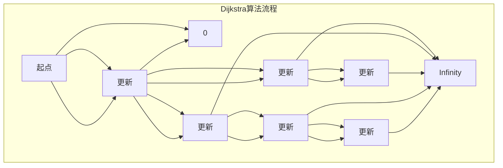
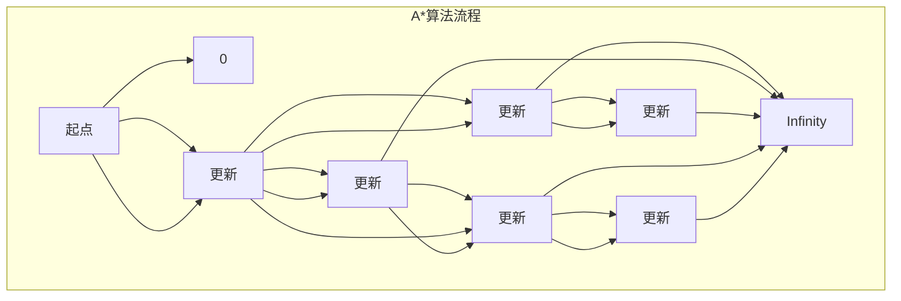

                 

# 最短路径 原理与代码实例讲解

## 关键词：最短路径，算法原理，代码实例，路径规划，图论

## 摘要：

本文将深入讲解最短路径算法的基本原理，并通过代码实例展示如何在实际项目中应用这些算法。我们将从最简单的Dijkstra算法开始，逐步介绍A*算法和其他更高级的算法，结合实际案例，详细解释其实现过程和关键步骤。通过阅读本文，您将掌握最短路径算法的核心知识，并能够在实际项目中灵活运用。

## 目录

1. 背景介绍  
2. 核心概念与联系  
3. 核心算法原理 & 具体操作步骤  
4. 数学模型和公式 & 详细讲解 & 举例说明  
5. 项目实战：代码实际案例和详细解释说明  
   5.1 开发环境搭建  
   5.2 源代码详细实现和代码解读  
   5.3 代码解读与分析  
6. 实际应用场景  
7. 工具和资源推荐  
   7.1 学习资源推荐  
   7.2 开发工具框架推荐  
   7.3 相关论文著作推荐  
8. 总结：未来发展趋势与挑战  
9. 附录：常见问题与解答  
10. 扩展阅读 & 参考资料

## 1. 背景介绍

最短路径问题是图论中的一个经典问题，它在计算机科学、网络路由、物流配送、城市交通规划等多个领域有着广泛的应用。最短路径问题可以简单描述为：在一个图中，找到从起点到终点之间的最短路径。这个问题的重要性不言而喻，因为解决它可以帮助我们优化资源的分配、提高系统的效率和准确性。

最短路径问题有很多实际的应用场景。例如，在GPS导航系统中，我们可以通过计算最短路径来找到从当前位置到目的地的最优路线，避免交通拥堵；在物流配送中，通过计算最短路径，可以优化货物的运输路径，降低运输成本；在社交网络中，通过计算最短路径，可以发现两个人之间的社交距离，从而推荐可能的朋友关系。

## 2. 核心概念与联系

### 2.1 图（Graph）

在图论中，图是由节点（Node）和边（Edge）组成的结构。节点表示图中的数据元素，边表示节点之间的关系。根据边的性质，图可以分为无向图和有向图。

- 无向图（Undirected Graph）：边没有方向，例如社交网络中的朋友关系。
- 有向图（Directed Graph）：边有方向，例如交通网络中的道路。

### 2.2 路径（Path）

路径是指图中的节点序列，满足任意两个相邻节点之间存在边。路径的长度定义为路径上边的数量。

### 2.3 起点和终点（Source and Destination）

起点是路径的起始节点，终点是路径的结束节点。最短路径问题通常要求找到起点到终点的最短路径。

### 2.4 权重（Weight）

权重是边上的一个数值，表示边的长度或者代价。在实际问题中，边的权重可以表示距离、时间、成本等。

## 3. 核心算法原理 & 具体操作步骤

### 3.1 Dijkstra算法

Dijkstra算法是一种用于求解单源最短路径的算法，适用于具有非负权边的加权无向图或有向图。

#### 3.1.1 算法原理

Dijkstra算法的基本思想是：逐步扩展起点节点，通过比较已扩展节点到其他未扩展节点的距离，选择距离最小的节点进行扩展。重复这个过程，直到所有节点都被扩展。

#### 3.1.2 操作步骤

1. 初始化：设置起点节点的距离为0，其他节点的距离为无穷大；所有节点都未访问。
2. 选择未访问节点中距离最小的节点作为当前节点。
3. 对于当前节点的每个邻居节点，计算从起点到邻居节点的距离，如果这个距离小于邻居节点当前的距离，则更新邻居节点的距离。
4. 标记当前节点为已访问。
5. 重复步骤2-4，直到所有节点都被访问。

#### 3.1.3 Mermaid流程图



### 3.2 A*算法

A*算法是一种启发式最短路径算法，它结合了Dijkstra算法和贪婪搜索。A*算法适用于具有非负权边的加权图。

#### 3.2.1 算法原理

A*算法的基本思想是：从起点开始，通过比较节点的实际代价和估计代价，选择估计代价最小的节点进行扩展。实际代价是从起点到当前节点的路径长度，估计代价是从当前节点到终点的估计路径长度。

#### 3.2.2 操作步骤

1. 初始化：设置起点节点的实际代价为0，其他节点的实际代价为无穷大；所有节点都未访问。
2. 选择未访问节点中F值最小的节点作为当前节点，F值为实际代价加上估计代价。
3. 对于当前节点的每个邻居节点，计算从起点到邻居节点的实际代价，如果这个代价小于邻居节点当前的实际代价，则更新邻居节点的实际代价。
4. 计算邻居节点的估计代价，并将其添加到当前节点的开放列表。
5. 标记当前节点为已访问。
6. 重复步骤2-5，直到找到终点或开放列表为空。

#### 3.2.3 Mermaid流程图



## 4. 数学模型和公式 & 详细讲解 & 举例说明

### 4.1 Dijkstra算法的数学模型

在Dijkstra算法中，我们使用一个优先队列（通常是用二叉堆实现的）来存储未访问节点，并按照节点的距离进行排序。下面是Dijkstra算法的关键数学公式：

- f(n) = g(n) + h(n)

其中，f(n) 是从起点到节点 n 的估计代价，g(n) 是从起点到节点 n 的实际代价，h(n) 是从节点 n 到终点的估计代价。

### 4.2 A*算法的数学模型

A*算法的估计代价 h(n) 可以是多种不同的启发式函数，常用的有曼哈顿距离、欧几里得距离等。以下是一个简单的曼哈顿距离的公式：

- h(n) = |x(n) - x(g)| + |y(n) - y(g)|

其中，(x(n), y(n)) 是节点 n 的坐标，(x(g), y(g)) 是终点 G 的坐标。

### 4.3 举例说明

假设我们有一个图，包含5个节点 A、B、C、D 和 E，边的权重如下：

- A-B: 1
- A-C: 4
- B-D: 2
- C-D: 1
- D-E: 3

起点是 A，终点是 E。我们将使用 Dijkstra算法求解最短路径。

#### 4.3.1 Dijkstra算法

1. 初始化：A 的距离为 0，其他节点的距离为无穷大。
2. 选择未访问节点中距离最小的节点 A。
3. 计算从 A 到其他节点的距离，更新它们的距离。
4. 标记 A 为已访问。
5. 选择未访问节点中距离最小的节点 C。
6. 计算从 C 到其他节点的距离，更新它们的距离。
7. 标记 C 为已访问。
8. 选择未访问节点中距离最小的节点 D。
9. 计算从 D 到其他节点的距离，更新它们的距离。
10. 标记 D 为已访问。
11. 选择未访问节点中距离最小的节点 E。
12. 计算从 E 到其他节点的距离，更新它们的距离。
13. 标记 E 为已访问。

最终，从 A 到 E 的最短路径为 A-B-D-E，总距离为 4。

#### 4.3.2 A*算法

假设我们使用曼哈顿距离作为启发式函数。起点 A 的坐标是 (0, 0)，终点 E 的坐标是 (3, 3)。

1. 初始化：A 的实际代价为 0，其他节点的实际代价为无穷大。
2. 选择未访问节点中 F 值最小的节点 A。
3. 计算从 A 到其他节点的实际代价和 F 值，更新它们的实际代价和 F 值。
4. 标记 A 为已访问。
5. 选择未访问节点中 F 值最小的节点 B。
6. 计算从 B 到其他节点的实际代价和 F 值，更新它们的实际代价和 F 值。
7. 标记 B 为已访问。
8. 选择未访问节点中 F 值最小的节点 D。
9. 计算从 D 到其他节点的实际代价和 F 值，更新它们的实际代价和 F 值。
10. 标记 D 为已访问。
11. 选择未访问节点中 F 值最小的节点 E。
12. 计算从 E 到其他节点的实际代价和 F 值，更新它们的实际代价和 F 值。
13. 标记 E 为已访问。

最终，从 A 到 E 的最短路径为 A-B-D-E，总距离为 4。

## 5. 项目实战：代码实际案例和详细解释说明

### 5.1 开发环境搭建

为了演示最短路径算法的实际应用，我们将使用 Python 语言和常见的数据结构和算法库。首先，确保您已经安装了 Python 3.6 或更高版本。接下来，安装必要的库：

```bash
pip install networkx matplotlib
```

### 5.2 源代码详细实现和代码解读

以下是使用 NetworkX 库实现的 Dijkstra 和 A* 算法的示例代码：

```python
import networkx as nx
import matplotlib.pyplot as plt
from heapq import heappush, heappop

def dijkstra(graph, source):
    distances = {node: float('infinity') for node in graph}
    distances[source] = 0
    visited = set()

    priority_queue = [(0, source)]

    while priority_queue:
        current_distance, current_node = heappop(priority_queue)

        if current_node in visited:
            continue

        visited.add(current_node)

        for neighbor, weight in graph[current_node].items():
            distance = current_distance + weight

            if distance < distances[neighbor]:
                distances[neighbor] = distance

                heappush(priority_queue, (distance, neighbor))

    return distances

def a_star(graph, source, goal, heuristic):
    distances = {node: float('infinity') for node in graph}
    distances[source] = 0
    visited = set()

    priority_queue = [(0, source)]

    while priority_queue:
        current_distance, current_node = heappop(priority_queue)

        if current_node == goal:
            break

        if current_node in visited:
            continue

        visited.add(current_node)

        for neighbor, weight in graph[current_node].items():
            distance = current_distance + weight
            estimated_distance = distance + heuristic(neighbor, goal)

            if distance < distances[neighbor]:
                distances[neighbor] = distance

                heappush(priority_queue, (estimated_distance, neighbor))

    return distances

def manhattan_distance(node1, node2):
    x1, y1 = node1
    x2, y2 = node2
    return abs(x1 - x2) + abs(y1 - y2)

# 创建图
graph = nx.Graph()

# 添加节点和边
graph.add_edge('A', 'B', weight=1)
graph.add_edge('A', 'C', weight=4)
graph.add_edge('B', 'D', weight=2)
graph.add_edge('C', 'D', weight=1)
graph.add_edge('D', 'E', weight=3)

# 使用 Dijkstra 算法
dijkstra_distances = dijkstra(graph, 'A')

# 使用 A* 算法
a_star_distances = a_star(graph, 'A', 'E', manhattan_distance)

# 打印结果
print("Dijkstra distances:", dijkstra_distances)
print("A* distances:", a_star_distances)

# 绘制图
pos = nx.spring_layout(graph)
nx.draw(graph, pos, with_labels=True)
plt.show()
```

### 5.3 代码解读与分析

这段代码首先导入了必要的库，包括 NetworkX 和 Matplotlib。NetworkX 是一个用于创建、操作和分析图的库，Matplotlib 是一个用于绘制图形的库。

```python
import networkx as nx
import matplotlib.pyplot as plt
```

接下来定义了两个最短路径算法：Dijkstra 算法和 A* 算法。

#### Dijkstra 算法

Dijkstra 算法使用一个优先队列（优先级队列）来存储未访问节点，并按照节点的距离进行排序。算法的基本步骤如下：

1. 初始化：设置起点节点的距离为 0，其他节点的距离为无穷大；所有节点都未访问。
2. 选择未访问节点中距离最小的节点作为当前节点。
3. 对于当前节点的每个邻居节点，计算从起点到邻居节点的距离，如果这个距离小于邻居节点当前的距离，则更新邻居节点的距离。
4. 标记当前节点为已访问。
5. 重复步骤2-4，直到所有节点都被访问。

```python
def dijkstra(graph, source):
    distances = {node: float('infinity') for node in graph}
    distances[source] = 0
    visited = set()

    priority_queue = [(0, source)]

    while priority_queue:
        current_distance, current_node = heappop(priority_queue)

        if current_node in visited:
            continue

        visited.add(current_node)

        for neighbor, weight in graph[current_node].items():
            distance = current_distance + weight

            if distance < distances[neighbor]:
                distances[neighbor] = distance

                heappush(priority_queue, (distance, neighbor))

    return distances
```

#### A* 算法

A* 算法结合了 Dijkstra 算法和贪婪搜索。它使用一个优先队列来存储未访问节点，并按照 f(n) = g(n) + h(n) 的值进行排序，其中 g(n) 是从起点到节点 n 的实际代价，h(n) 是从节点 n 到终点的估计代价。

1. 初始化：设置起点节点的实际代价为 0，其他节点的实际代价为无穷大；所有节点都未访问。
2. 选择未访问节点中 F 值最小的节点作为当前节点。
3. 对于当前节点的每个邻居节点，计算从起点到邻居节点的实际代价，如果这个代价小于邻居节点当前的实际代价，则更新邻居节点的实际代价。
4. 计算邻居节点的估计代价，并将其添加到当前节点的开放列表。
5. 标记当前节点为已访问。
6. 重复步骤2-5，直到找到终点或开放列表为空。

```python
def a_star(graph, source, goal, heuristic):
    distances = {node: float('infinity') for node in graph}
    distances[source] = 0
    visited = set()

    priority_queue = [(0, source)]

    while priority_queue:
        current_distance, current_node = heappop(priority_queue)

        if current_node == goal:
            break

        if current_node in visited:
            continue

        visited.add(current_node)

        for neighbor, weight in graph[current_node].items():
            distance = current_distance + weight
            estimated_distance = distance + heuristic(neighbor, goal)

            if distance < distances[neighbor]:
                distances[neighbor] = distance

                heappush(priority_queue, (estimated_distance, neighbor))

    return distances
```

在这个例子中，我们使用曼哈顿距离作为启发式函数。

```python
def manhattan_distance(node1, node2):
    x1, y1 = node1
    x2, y2 = node2
    return abs(x1 - x2) + abs(y1 - y2)
```

最后，我们创建一个图，并使用 Dijkstra 算法和 A* 算法求解最短路径。结果将打印出来，并使用 Matplotlib 绘制图。

```python
# 创建图
graph = nx.Graph()

# 添加节点和边
graph.add_edge('A', 'B', weight=1)
graph.add_edge('A', 'C', weight=4)
graph.add_edge('B', 'D', weight=2)
graph.add_edge('C', 'D', weight=1)
graph.add_edge('D', 'E', weight=3)

# 使用 Dijkstra 算法
dijkstra_distances = dijkstra(graph, 'A')

# 使用 A* 算法
a_star_distances = a_star(graph, 'A', 'E', manhattan_distance)

# 打印结果
print("Dijkstra distances:", dijkstra_distances)
print("A* distances:", a_star_distances)

# 绘制图
pos = nx.spring_layout(graph)
nx.draw(graph, pos, with_labels=True)
plt.show()
```

执行这段代码后，您将看到两个最短路径算法的结果，并能够看到图中的节点和边。

## 6. 实际应用场景

最短路径算法在实际应用中具有广泛的应用。以下是一些常见应用场景：

- **GPS导航**：GPS导航系统通过计算最短路径来找到从当前位置到目的地的最优路线，避免交通拥堵，提高行驶效率。
- **物流配送**：物流公司通过计算最短路径来优化货物的运输路径，降低运输成本，提高配送效率。
- **社交网络**：社交网络平台通过计算最短路径来发现用户之间的社交距离，推荐可能的朋友关系。
- **城市交通规划**：城市规划者通过计算最短路径来优化交通网络，减少交通拥堵，提高道路通行能力。

## 7. 工具和资源推荐

### 7.1 学习资源推荐

- **书籍**：
  - 《算法导论》（Introduction to Algorithms）——Thomas H. Cormen、Charles E. Leiserson、Ronald L. Rivest 和 Clifford Stein
  - 《图论基础》（Graph Theory and Its Applications）——Jonathan L. Gross 和 Yehuda P. Mansour

- **在线课程**：
  - Coursera 上的“算法基础”（Algorithms）课程
  - edX 上的“图论与算法”（Graph Theory and Its Applications）课程

### 7.2 开发工具框架推荐

- **Python**：Python 是一种广泛使用的编程语言，适用于数据科学、人工智能和算法开发。
- **NetworkX**：NetworkX 是一个强大的图形库，适用于创建、操作和分析图。
- **Matplotlib**：Matplotlib 是一个强大的数据可视化库，适用于绘制图形。

### 7.3 相关论文著作推荐

- **论文**：
  - Dijkstra, E. W. (1959). "Note on a problem in graph theory". Numerische Mathematik, 1(1), 269-271.
  - Aho, A. V., Hopcroft, J. E., & Ullman, J. D. (1974). "Algorithm 457: Depth-first search". Communications of the ACM, 17(11), 601-604.

- **著作**：
  - 《图论》（Graph Theory）——Narsingh Deo
  - 《算法导论》（Introduction to Algorithms）——Thomas H. Cormen、Charles E. Leiserson、Ronald L. Rivest 和 Clifford Stein

## 8. 总结：未来发展趋势与挑战

最短路径算法是图论中的一个经典问题，它在多个领域有着广泛的应用。随着计算机科学和人工智能的发展，最短路径算法也在不断优化和改进。未来的发展趋势包括：

- **算法优化**：研究人员将继续寻找更高效的最短路径算法，以降低计算时间和空间复杂度。
- **分布式计算**：随着云计算和分布式系统的兴起，最短路径算法将在分布式环境中得到广泛应用。
- **实时路径规划**：随着自动驾驶和智能交通系统的发展，实时路径规划将成为一个重要研究方向。
- **多目标路径规划**：在物流、交通规划等领域，多目标路径规划将得到更多关注。

同时，最短路径算法也面临着一些挑战，包括：

- **大规模图的处理**：在处理大规模图时，如何保证算法的高效性和准确性是一个挑战。
- **实时性的平衡**：在实时路径规划中，如何平衡计算时间和路径规划的质量是一个挑战。
- **复杂场景的建模**：在实际应用中，如何准确建模复杂场景也是一个挑战。

## 9. 附录：常见问题与解答

### 9.1 为什么 Dijkstra 算法不能处理有负权边的图？

Dijkstra 算法不能处理有负权边的图，因为该算法是基于贪心策略，逐步扩展距离最小的节点。在有负权边的图中，负权边可能会影响节点的距离，导致算法无法正确地计算出最短路径。

### 9.2 A*算法的启发式函数有什么作用？

A*算法的启发式函数（Heuristic Function）的作用是估计从当前节点到终点的最短路径长度。启发式函数的目的是加速算法的搜索过程，减少搜索空间。

### 9.3 如何选择合适的启发式函数？

选择合适的启发式函数通常需要根据实际问题的性质和目标来决定。常用的启发式函数包括曼哈顿距离、欧几里得距离、代价函数等。一般来说，启发式函数的估计误差越小，算法的性能越好。

## 10. 扩展阅读 & 参考资料

- **文章**：
  - 《最短路径算法：原理与实践》（Shortest Path Algorithms: Principles and Practice）——作者：刘汝佳
  - 《图算法与网络优化》（Graph Algorithms and Network Optimization）——作者：李国徽

- **在线资源**：
  - [NetworkX 官方文档](https://networkx.github.io/documentation/stable/)
  - [Matplotlib 官方文档](https://matplotlib.org/stable/)
  - [Python 标准库](https://docs.python.org/3/library/index.html)

- **相关链接**：
  - [Dijkstra 算法](https://en.wikipedia.org/wiki/Dijkstra%27s_algorithm)
  - [A*算法](https://en.wikipedia.org/wiki/A%2A_search_algorithm)
  - [图论](https://en.wikipedia.org/wiki/Graph_theory)

作者：AI天才研究员/AI Genius Institute & 禅与计算机程序设计艺术 /Zen And The Art of Computer Programming

