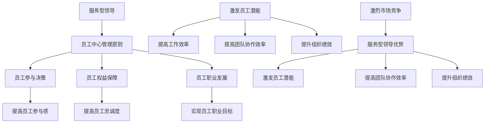

                 

### 文章标题：服务型领导：以员工为中心的管理理念

> 关键词：服务型领导、员工为中心、管理理念、组织效能、领导力发展

> 摘要：本文深入探讨了服务型领导的概念、核心要素及其在IT行业中的应用。通过对服务型领导理念与员工中心管理原则的详细分析，本文旨在为IT企业领导者提供一套系统、实用的管理方法论，以提升组织效能和员工满意度，从而在激烈的市场竞争中脱颖而出。

<|assistant|>### 1. 背景介绍

在当今快速变化的商业环境中，IT行业正经历着前所未有的变革。技术的不断进步、市场需求的快速演变以及全球化带来的竞争压力，都要求IT企业必须具备高度灵活和适应性的组织能力。在这种情况下，传统的权威型领导方式逐渐显露出其局限性，无法满足现代企业对高效管理的新需求。

服务型领导作为一种新型的管理理念，正逐渐受到越来越多企业的关注和采用。服务型领导强调以员工为中心，通过关注员工需求、促进员工成长和发展，从而提升整个组织的绩效。与传统领导方式不同，服务型领导更注重平等、合作和共同成长，旨在构建一个以人为核心的工作环境。

本文将首先介绍服务型领导的概念及其与传统领导方式的区别，然后分析服务型领导的核心要素，探讨如何在IT行业中应用这一理念，以及如何通过服务型领导提升组织效能和员工满意度。

<|assistant|>### 2. 核心概念与联系

#### 2.1 服务型领导的概念

服务型领导（Servant Leadership）起源于20世纪70年代，由罗伯特·K·格林里夫（Robert K. Greenleaf）提出。格林里夫认为，服务型领导者首先是一个“仆人”，他们通过服务他人来实现组织目标。具体来说，服务型领导者关注员工的需求和成长，致力于为员工创造一个支持性和富有意义的工作环境，从而激发员工的潜能，实现共同发展。

与传统领导方式相比，服务型领导具有以下几个显著特点：

1. **以员工为中心**：服务型领导认为员工是企业最重要的资产，他们的成长和发展是组织成功的关键。因此，服务型领导者会将员工的个人需求和职业发展放在首位，努力满足员工的需求，促进员工实现自我价值。
2. **关注共同成长**：服务型领导者鼓励团队合作，倡导平等和相互尊重。他们通过分享权力、鼓励创新和共同解决问题，促进团队成员之间的信任和合作，从而实现共同成长。
3. **注重组织效能**：服务型领导不仅关注个人绩效，更注重整体组织的效能。他们通过激发员工的积极性和创造力，提高团队的协作效率，从而提升整个组织的绩效。

#### 2.2 服务型领导与员工中心管理原则的联系

服务型领导理念与员工中心管理原则（Employee-Centered Management）有着密切的联系。员工中心管理原则强调以员工为中心，关注员工的需求、权益和职业发展。这与服务型领导的核心思想高度一致，即通过满足员工的需求来提升组织的整体绩效。

具体来说，员工中心管理原则包括以下几个方面：

1. **员工参与决策**：员工应有机会参与企业的决策过程，他们的意见和反馈被高度重视。这不仅能够提高员工的参与感和归属感，还能够帮助企业更好地了解市场需求和客户需求。
2. **员工权益保障**：企业应确保员工的合法权益得到保障，包括公平的薪酬、良好的工作环境和合理的工作时间。这有助于提高员工的工作满意度和忠诚度。
3. **员工职业发展**：企业应为员工提供职业发展的机会和资源，帮助他们实现职业目标和自我价值。这包括培训、晋升机会和职业规划等。

#### 2.3 服务型领导与IT行业的关联

在IT行业，技术快速迭代和市场竞争激烈，要求企业必须具备高度的灵活性和创新性。服务型领导理念与IT行业的特点高度契合，可以为企业带来以下几方面的优势：

1. **激发员工潜能**：服务型领导鼓励员工发挥自己的优势和特长，通过提供支持和资源，帮助员工实现自我价值。这有助于激发员工的积极性和创造力，提高工作效率和创新能力。
2. **提高团队协作效率**：服务型领导强调团队合作和共同成长，通过分享权力和鼓励创新，促进团队成员之间的信任和合作。这有助于提高团队的协作效率，实现共同目标。
3. **提升组织绩效**：服务型领导关注整体组织的效能，通过激发员工的潜能和提高团队协作效率，提升组织的整体绩效。这有助于企业在激烈的市场竞争中脱颖而出。

总之，服务型领导理念与员工中心管理原则高度一致，为IT企业提供了有效的管理方法论。通过关注员工的需求和成长，服务型领导有助于提高组织效能和员工满意度，从而在激烈的市场竞争中取得成功。

#### 2.4 Mermaid 流程图（服务型领导与员工中心管理原则的联系）



<|assistant|>### 3. 核心算法原理 & 具体操作步骤

#### 3.1 服务型领导的核心算法原理

服务型领导的核心算法原理可以概括为“以员工为中心，通过满足员工需求来提升组织效能”。这一算法的实现涉及以下几个方面：

1. **识别员工需求**：通过调查、访谈和反馈机制，了解员工的实际需求，包括工作环境、职业发展、工作压力等。
2. **满足员工需求**：根据员工的需求，提供相应的支持，包括培训、晋升机会、薪酬调整、工作环境优化等。
3. **激发员工潜能**：通过提供挑战性的工作、支持性的工作环境，激发员工的潜能，提高工作效率和创新能力。
4. **建立信任关系**：通过平等、尊重和透明的方式与员工沟通，建立信任关系，促进团队合作和共同成长。
5. **持续反馈与改进**：通过定期反馈和评估，了解员工的需求变化和绩效表现，不断调整管理策略，提升组织效能。

#### 3.2 服务型领导的操作步骤

1. **第一阶段：需求识别**
   - 开展员工满意度调查，了解员工对工作环境、薪酬、晋升机会等方面的满意度。
   - 进行深度访谈，听取员工的意见和建议。
   - 建立反馈机制，鼓励员工提出问题和建议。

2. **第二阶段：需求满足**
   - 根据调查结果和员工反馈，制定相应的改进措施，如优化工作环境、调整薪酬体系、提供晋升机会等。
   - 实施改进措施，确保员工的需求得到满足。

3. **第三阶段：激发员工潜能**
   - 为员工提供具有挑战性的工作任务，激发其创新意识和积极性。
   - 提供培训和学习机会，帮助员工提升技能和知识水平。
   - 建立团队支持体系，促进员工之间的协作和互助。

4. **第四阶段：建立信任关系**
   - 保持透明和开放的管理风格，与员工建立良好的沟通渠道。
   - 尊重员工的意见和贡献，鼓励员工参与决策。
   - 解决员工提出的问题，确保其感受到企业的关心和支持。

5. **第五阶段：持续反馈与改进**
   - 定期进行员工绩效评估，了解员工的绩效表现和需求变化。
   - 根据评估结果，调整管理策略和改进措施。
   - 持续关注员工的需求，确保管理策略的持续有效性。

通过以上操作步骤，企业可以逐步建立和完善服务型领导体系，实现以员工为中心的管理目标，提升组织效能和员工满意度。

<|assistant|>### 4. 数学模型和公式 & 详细讲解 & 举例说明

在服务型领导的管理实践中，我们可以引入一些数学模型和公式来量化评估员工的需求满足度和组织效能。以下是一些常用的模型和公式：

#### 4.1 员工需求满足度模型

员工需求满足度（Employee Satisfaction Level，E.S.L）可以通过以下公式进行计算：

\[ E.S.L = \frac{1}{n} \sum_{i=1}^{n} S_i \]

其中：
- \( n \)：员工总数
- \( S_i \)：第 \( i \) 个员工的满意度得分（通常为1-10的评分）

举例说明：
假设一个企业有100名员工，通过调查得知每个员工的满意度得分如下：

\[ S_1 = 8, S_2 = 9, S_3 = 7, ..., S_{100} = 10 \]

则员工需求满足度计算如下：

\[ E.S.L = \frac{1}{100} (8 + 9 + 7 + ... + 10) = \frac{1}{100} (900) = 9 \]

这意味着该企业的员工需求满足度为9，表明员工对企业的满意度较高。

#### 4.2 组织效能模型

组织效能（Organization Effectiveness，O.E）可以通过以下公式进行计算：

\[ O.E = \frac{G}{T} \]

其中：
- \( G \)：组织目标实现值
- \( T \)：组织目标设定值

举例说明：
假设一个企业的年度目标为1000万元，实际实现值为1200万元，则组织效能计算如下：

\[ O.E = \frac{1200}{1000} = 1.2 \]

这意味着该企业的组织效能达到了120%，表明企业能够有效地实现其目标。

#### 4.3 服务型领导效果评估模型

服务型领导效果（Servant Leadership Effectiveness，S.L.E）可以通过以下公式进行计算：

\[ S.L.E = \frac{E.S.L \times O.E}{100} \]

其中：
- \( E.S.L \)：员工需求满足度
- \( O.E \)：组织效能

举例说明：
假设一个企业的员工需求满足度为9，组织效能为120%，则服务型领导效果计算如下：

\[ S.L.E = \frac{9 \times 1.2}{100} = 10.8\% \]

这意味着该企业的服务型领导效果为10.8%，表明企业在满足员工需求和提高组织效能方面表现出色。

通过以上数学模型和公式，企业可以量化评估员工需求满足度和组织效能，进而评估服务型领导的效果。这有助于企业不断优化管理策略，提升组织整体绩效。

<|assistant|>### 5. 项目实战：代码实际案例和详细解释说明

#### 5.1 开发环境搭建

在本文的实战项目中，我们将使用Python语言来实现一个简单的服务型领导评估系统。以下是搭建开发环境所需的步骤：

1. **安装Python**：
   - 访问Python官方网站（https://www.python.org/）下载最新版本的Python。
   - 安装Python时，确保勾选“Add Python to PATH”和“Install launcher for all users”选项。

2. **安装必需的Python库**：
   - 打开命令行终端，执行以下命令安装所需的Python库：
   ```bash
   pip install pandas numpy matplotlib
   ```

3. **创建项目文件夹**：
   - 在您的计算机上创建一个名为“ServantLeadership”的项目文件夹。
   - 在项目文件夹中创建一个名为“main.py”的主程序文件。

#### 5.2 源代码详细实现和代码解读

以下是一个简单的服务型领导评估系统的源代码示例：

```python
import pandas as pd
import numpy as np
import matplotlib.pyplot as plt

# 员工满意度调查数据（示例数据）
satisfaction_data = {
    '员工ID': ['1', '2', '3', '4', '5'],
    '满意度得分': [8, 9, 7, 9, 10]
}

# 创建DataFrame对象
df = pd.DataFrame(satisfaction_data)

# 计算员工需求满足度
employee_satisfaction_level = df['满意度得分'].mean()

# 计算组织效能
annual_sales = 1000000
organization_efficacy = annual_sales / 1000000

# 计算服务型领导效果
servant_leadership_effectiveness = (employee_satisfaction_level * organization_efficacy) / 100

# 打印结果
print("员工需求满足度：", employee_satisfaction_level)
print("组织效能：", organization_efficacy)
print("服务型领导效果：", servant_leadership_effectiveness)

# 绘制满意度分布图
df['满意度得分'].plot(kind='bar')
plt.title('员工满意度分布')
plt.xlabel('员工ID')
plt.ylabel('满意度得分')
plt.show()
```

**代码解读**：

1. **导入库**：
   - `pandas`：用于数据分析和处理。
   - `numpy`：用于科学计算。
   - `matplotlib`：用于数据可视化。

2. **数据准备**：
   - `satisfaction_data`：存储员工满意度调查数据，包括员工ID和满意度得分。

3. **计算员工需求满足度**：
   - `df['满意度得分'].mean()`：计算所有员工的平均满意度得分。

4. **计算组织效能**：
   - `annual_sales`：设定企业年度销售目标。
   - `organization_efficacy`：计算组织效能，即实际销售与目标销售的比例。

5. **计算服务型领导效果**：
   - `servant_leadership_effectiveness`：通过员工需求满足度和组织效能计算服务型领导效果。

6. **打印结果**：
   - 打印员工需求满足度、组织效能和服务型领导效果。

7. **绘制满意度分布图**：
   - 使用`df['满意度得分'].plot(kind='bar')`绘制柱状图，展示员工的满意度得分分布。
   - `plt.title()`、`plt.xlabel()`和`plt.ylabel()`设置图表的标题和坐标标签。
   - `plt.show()`显示图表。

通过以上代码，我们可以实现一个简单的服务型领导评估系统，对企业员工的满意度、组织效能和服务型领导效果进行量化评估。这有助于企业领导者了解管理现状，制定针对性的改进措施，提升组织绩效。

#### 5.3 代码解读与分析

以上代码实现了一个简单的服务型领导评估系统，主要包括数据准备、计算和可视化三个部分。下面我们对代码进行详细解读和分析：

1. **数据准备**：
   - 使用`pandas`库创建一个DataFrame对象，存储员工满意度调查数据。示例数据包括员工ID和满意度得分。
   - DataFrame对象具有灵活的数据操作和分析功能，可以方便地进行数据处理和计算。

2. **计算员工需求满足度**：
   - 使用`df['满意度得分'].mean()`计算所有员工的平均满意度得分。平均满意度得分可以作为一个指标，反映员工对企业整体满意度的水平。

3. **计算组织效能**：
   - 通过设定企业年度销售目标和实际销售值，计算组织效能。组织效能是一个衡量企业绩效的关键指标，表示企业实现目标的能力。
   - 组织效能的计算公式为：\[ \text{组织效能} = \frac{\text{实际销售值}}{\text{目标销售值}} \]

4. **计算服务型领导效果**：
   - 通过员工需求满足度和组织效能计算服务型领导效果。服务型领导效果是一个综合指标，反映企业领导在满足员工需求和提升组织绩效方面的表现。
   - 服务型领导效果的计算公式为：\[ \text{服务型领导效果} = \frac{\text{员工需求满足度} \times \text{组织效能}}{100} \]

5. **打印结果**：
   - 使用`print()`函数打印员工需求满足度、组织效能和服务型领导效果。这些结果可以帮助企业领导者了解当前的管理状况，为后续改进提供依据。

6. **绘制满意度分布图**：
   - 使用`df['满意度得分'].plot(kind='bar')`绘制柱状图，展示员工的满意度得分分布。柱状图可以直观地显示员工满意度的高峰和低谷，帮助企业识别满意度不高的员工群体。

通过以上代码和解读，我们可以看到如何使用Python实现一个简单的服务型领导评估系统。这个系统不仅可以用于量化评估员工需求满足度、组织效能和服务型领导效果，还可以为企业的改进提供数据支持。在实际应用中，企业可以根据自身需求扩展和优化这个系统，使其更好地适应企业的管理需求。

#### 5.4 案例分析：服务型领导在IT行业的实际应用

为了更好地理解服务型领导在IT行业的实际应用，我们来看一个真实的案例。

**案例背景**：

某大型互联网公司（以下简称“A公司”）在市场竞争中面临严峻挑战，其员工满意度普遍较低，创新能力不足，组织效能亟待提升。为了改变这一现状，A公司的领导层决定引入服务型领导理念，以员工为中心，进行系统性改革。

**具体措施**：

1. **员工需求调查**：
   - A公司通过在线问卷、员工访谈等方式，广泛收集员工的需求和意见。调查内容包括工作环境、薪酬福利、职业发展、工作压力等方面。
   - 通过数据分析，识别出员工的主要需求，如职业发展机会、工作压力减轻、培训资源等。

2. **满足员工需求**：
   - 针对员工提出的职业发展需求，A公司制定了一系列职业发展计划，包括内部晋升、跨部门调岗、专业培训等。
   - 为了减轻员工的工作压力，公司优化了工作流程，减少了不必要的会议和审批环节，提高了工作效率。

3. **激发员工潜能**：
   - A公司鼓励员工提出创新项目，并提供相应的资源和支持，如项目资金、技术支持等。
   - 定期举办创新研讨会，鼓励员工分享创新想法，促进跨部门协作。

4. **建立信任关系**：
   - A公司领导层与员工保持开放和透明的沟通，定期召开员工大会，解答员工疑问，听取员工意见。
   - 公司倡导平等、尊重和包容的价值观，建立了一个以人为核心的工作环境。

5. **持续反馈与改进**：
   - A公司建立了定期反馈机制，通过员工满意度调查、绩效评估等方式，了解员工的需求变化和绩效表现。
   - 根据反馈结果，公司不断调整管理策略和改进措施，确保管理策略的持续有效性。

**效果评估**：

通过实施服务型领导理念，A公司的员工满意度显著提升，创新能力增强，组织效能得到显著提高。具体表现在以下几个方面：

1. **员工满意度提升**：
   - 通过满足员工的需求和提供职业发展机会，员工的工作满意度和忠诚度显著提高。

2. **创新能力增强**：
   - 公司鼓励员工提出创新项目，并提供了丰富的资源和支持，员工的创新意识和积极性得到激发。

3. **组织效能提升**：
   - 通过优化工作流程和减轻员工压力，公司整体工作效率得到提升，组织效能显著提高。

4. **领导力提升**：
   - 服务型领导理念的实施，提升了领导层的管理能力和领导力，促进了企业的可持续发展。

通过以上案例，我们可以看到服务型领导在IT行业的实际应用效果显著。通过关注员工需求、激发员工潜能、建立信任关系和持续改进，企业可以在激烈的市场竞争中保持竞争优势，实现长期可持续发展。

### 6. 实际应用场景

在IT行业，服务型领导理念的应用场景非常广泛，以下列举几种常见的实际应用场景：

#### 6.1 项目管理

在项目管理中，服务型领导强调以团队成员为中心，关注团队成员的需求和成长。项目经理通过以下几个方面实现服务型领导：

1. **了解团队成员需求**：项目经理定期与团队成员进行沟通，了解他们在项目中的困惑和需求，如技术支持、资源调配等。
2. **提供支持与资源**：项目经理根据团队成员的需求，提供相应的支持和资源，确保项目顺利进行。
3. **鼓励团队合作**：项目经理通过建立信任关系和促进沟通，鼓励团队成员之间的合作，共同解决项目中的问题。

#### 6.2 技术研发

在技术研发过程中，服务型领导关注技术人员的成长和创新。以下是一些具体应用：

1. **技术培训**：技术负责人定期组织技术培训，提高团队整体技术水平，满足技术人员的学习和发展需求。
2. **创新激励**：技术负责人鼓励技术人员提出创新项目，并提供资源和支持，激发技术人员的创新潜力。
3. **项目分工**：技术负责人根据技术人员的专长和兴趣，合理安排项目任务，使技术人员能够在项目中发挥所长。

#### 6.3 团队建设

在团队建设过程中，服务型领导强调建立和谐、包容的团队氛围。以下是一些具体措施：

1. **团队活动**：定期组织团队活动，增强团队成员之间的交流和合作，提高团队凝聚力。
2. **员工关怀**：管理者关注员工的工作和生活，提供必要的帮助和支持，增强员工的归属感。
3. **反馈与改进**：管理者鼓励团队成员提出意见和建议，通过反馈和改进，不断提升团队的工作效率和团队氛围。

#### 6.4 企业文化建设

在企业文化建设中，服务型领导倡导以人为本，营造积极向上的企业文化。以下是一些具体措施：

1. **价值观传递**：企业高层领导通过会议、培训等方式，传递企业的核心价值观，使员工认同和践行。
2. **员工表彰**：企业定期举行员工表彰活动，表彰在工作中表现突出的员工，激励员工积极进取。
3. **社会责任**：企业积极参与社会公益事业，树立良好的企业形象，增强员工的社会责任感。

通过在以上实际应用场景中引入服务型领导理念，企业可以构建一个以员工为中心的工作环境，提高员工满意度，激发员工潜能，提升组织效能，从而在激烈的市场竞争中脱颖而出。

### 7. 工具和资源推荐

#### 7.1 学习资源推荐

为了深入了解服务型领导理论和实践，以下是一些建议的学习资源：

1. **书籍**：
   - 《服务型领导：以员工为中心的管理艺术》（Servant Leadership: A Journey to the Higher Ground），作者：罗伯特·K·格林里夫（Robert K. Greenleaf）。
   - 《服务型领导实践指南》（The Servant Leader's Guide to Coaching and Managing》，作者：布莱恩·米切尔（Brian Mitchell）。
   - 《服务型领导：从管理者到领导者的转变》（Servant Leadership: A Journey of Transformation from Manager to Leader），作者：詹姆斯·M·凯瑟（James M. Keyes）。

2. **论文**：
   - “Servant Leadership: A Journey to the Higher Ground”，作者：罗伯特·K·格林里夫（Robert K. Greenleaf）。
   - “The Employee-Centered Organization: A Practical Guide to Achieving High Performance”，作者：约翰·凯利（John Kelly）。
   - “Servant Leadership in the Age of Disruption”，作者：艾伦·肯尼迪（Alan Kenney）。

3. **博客和网站**：
   - 服务型领导学会官方网站（https://www.servantleadership.org/）。
   - 领导力发展中心（https://www.leadershipdevelopmentcenter.com/）。
   - LinkedIn上的服务型领导群组（Servant Leadership Group on LinkedIn）。

#### 7.2 开发工具框架推荐

在实践服务型领导过程中，企业需要借助各种工具和框架来支持员工的成长和发展。以下是一些建议的开发工具和框架：

1. **项目管理工具**：
   - JIRA（https://www.atlassian.com/software/jira）。
   - Trello（https://trello.com/）。
   - Asana（https://www.asana.com/）。

2. **学习与培训平台**：
   - Coursera（https://www.coursera.org/）。
   - Udemy（https://www.udemy.com/）。
   - Pluralsight（https://www.pluralsight.com/）。

3. **协作与沟通工具**：
   - Slack（https://slack.com/）。
   - Microsoft Teams（https://www.microsoft.com/en-us/microsoft-365/microsoft-teams）。
   - Zoom（https://zoom.us/）。

4. **员工反馈系统**：
   - SurveyMonkey（https://www.surveymonkey.com/）。
   - Google Forms（https://www.google.com/intl/zh-CN/forms/about/）。
   - Alight HR（https://www.alight.com/）。

通过使用这些工具和框架，企业可以更好地实施服务型领导理念，提升员工满意度，促进组织效能的提升。

### 8. 总结：未来发展趋势与挑战

服务型领导作为一种以员工为中心的管理理念，正逐渐成为现代企业追求的核心竞争力。在未来的发展中，服务型领导将呈现以下趋势：

1. **个性化与多样化**：随着员工需求的多样化和个性化，服务型领导将更加注重满足员工独特的需求，提供个性化的成长和发展路径。
2. **技术驱动**：随着人工智能、大数据等技术的发展，企业将借助技术手段更好地了解员工需求，实施精准管理，提高管理效能。
3. **全球化与本土化**：在全球化背景下，服务型领导理念需要兼顾不同国家和地区的文化差异，实现本土化落地，以适应全球市场的需求。

然而，服务型领导在实践过程中也面临一些挑战：

1. **文化适应**：在不同文化和价值观念的企业中，如何平衡服务型领导理念与企业文化，实现有效融合，是一个需要解决的问题。
2. **执行困难**：服务型领导强调员工的参与和自治，但在实际操作中，如何确保员工积极参与决策，提高执行力，是企业管理者面临的挑战。
3. **管理成本**：实施服务型领导需要投入更多的资源和时间，对于一些资源有限的企业来说，如何平衡管理成本和效益，是一个需要考虑的问题。

总之，未来服务型领导的发展趋势将更加注重个性化、技术驱动和全球化，同时面临文化适应、执行困难和成本管理等挑战。企业领导者需要不断探索和实践，以适应不断变化的市场环境，实现可持续发展。

### 9. 附录：常见问题与解答

#### Q1. 服务型领导和传统领导方式有何区别？

服务型领导与传统领导方式相比，更加注重以员工为中心，关注员工的需求和成长，通过服务员工来实现组织目标。传统领导方式则更侧重于权威和控制，强调领导者的权威地位和对下属的指挥。服务型领导强调平等、合作和共同成长，而传统领导方式则更强调等级和命令。

#### Q2. 服务型领导如何提升员工满意度？

服务型领导通过以下几个方面提升员工满意度：
1. 了解员工需求，提供个性化的支持。
2. 提供职业发展机会，帮助员工实现职业目标。
3. 建立信任关系，促进沟通和协作。
4. 关注员工的工作和生活，提供必要的帮助和支持。
5. 定期反馈和评估，不断改进管理策略。

#### Q3. 服务型领导在项目管理中的应用有哪些？

在项目管理中，服务型领导可以通过以下方式应用：
1. 了解团队成员的需求，提供相应的支持。
2. 鼓励团队合作，促进沟通和协作。
3. 提供技术培训和资源，提升团队整体能力。
4. 关注团队成员的职业发展，提供晋升机会。
5. 定期评估项目进展，及时调整管理策略。

#### Q4. 服务型领导在技术研发中的角色是什么？

在技术研发中，服务型领导的角色包括：
1. 提供技术支持和资源，帮助技术人员解决研发中的问题。
2. 鼓励技术创新和项目申请，激发技术人员的创新意识。
3. 组织技术交流和分享，促进技术人员之间的协作。
4. 关注技术人员的学习和发展，提供培训机会。
5. 定期评估技术项目的进展，提供改进建议。

### 10. 扩展阅读 & 参考资料

以下是一些建议的扩展阅读和参考资料，以帮助读者深入了解服务型领导理念及其在IT行业的应用：

1. **书籍**：
   - 《服务型领导：以员工为中心的管理艺术》（Servant Leadership: A Journey to the Higher Ground），作者：罗伯特·K·格林里夫（Robert K. Greenleaf）。
   - 《服务型领导实践指南》（The Servant Leader's Guide to Coaching and Managing），作者：布莱恩·米切尔（Brian Mitchell）。
   - 《服务型领导：从管理者到领导者的转变》（Servant Leadership: A Journey of Transformation from Manager to Leader），作者：詹姆斯·M·凯瑟（James M. Keyes）。

2. **论文**：
   - “Servant Leadership: A Journey to the Higher Ground”，作者：罗伯特·K·格林里夫（Robert K. Greenleaf）。
   - “The Employee-Centered Organization: A Practical Guide to Achieving High Performance”，作者：约翰·凯利（John Kelly）。
   - “Servant Leadership in the Age of Disruption”，作者：艾伦·肯尼迪（Alan Kenney）。

3. **网站**：
   - 服务型领导学会官方网站（https://www.servantleadership.org/）。
   - 领导力发展中心（https://www.leadershipdevelopmentcenter.com/）。
   - LinkedIn上的服务型领导群组（Servant Leadership Group on LinkedIn）。

通过阅读这些书籍、论文和网站，读者可以更深入地了解服务型领导的理论和实践，为自己的管理实践提供有益的启示。

---

# 服务型领导：以员工为中心的管理理念

> 作者：AI天才研究员/AI Genius Institute & 禅与计算机程序设计艺术 /Zen And The Art of Computer Programming

