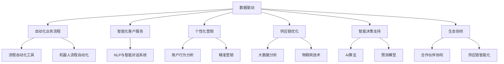
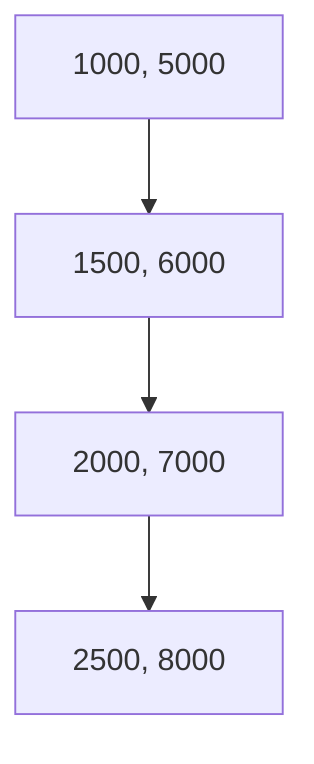

                 

## 背景介绍

在当今数字化转型的浪潮中，智能化已经成为企业运营模式的必然趋势。随着人工智能（AI）、大数据、云计算等技术的迅猛发展，企业不再仅仅依赖传统的管理方法，而是开始探索如何通过智能化手段提高运营效率、降低成本、提升客户体验，并创造新的商业模式。这一转变不仅影响了企业的内部管理，也深刻改变了企业与外部环境、客户、供应商之间的互动方式。

未来企业的智能化运营模式，指的是通过集成先进的人工智能技术，实现企业运营的自动化、智能化和个性化。这一模式强调数据驱动，通过实时数据分析和机器学习算法，帮助企业做出更加精准的决策，优化业务流程，提高资源利用率。以下是未来企业智能化运营模式的一些核心要点：

1. **数据驱动的决策**：企业将收集、存储和分析大量数据，借助数据挖掘和机器学习算法，从数据中提取有价值的信息，为企业决策提供依据。

2. **自动化业务流程**：通过流程自动化工具和机器人流程自动化（RPA），将重复性高、规则性强的业务流程自动化，减少人工干预，提高运营效率。

3. **智能化客户服务**：利用自然语言处理（NLP）和智能对话系统，实现智能客服，提供24/7无缝的客户服务体验。

4. **个性化营销**：通过分析用户行为数据和消费习惯，实现个性化推荐和精准营销，提高客户满意度和忠诚度。

5. **供应链优化**：通过大数据分析和物联网技术，实现供应链的智能化管理，优化库存、运输和物流，提高供应链的整体效率。

6. **智能决策支持**：利用AI算法和预测模型，为企业的战略和运营提供智能决策支持，提高决策的准确性和前瞻性。

7. **生态协同**：企业不仅关注内部运营，还将与合作伙伴、供应链上下游建立智能化协同网络，实现产业链的智能化升级。

本篇文章将深入探讨未来企业智能化运营模式的各个方面，包括其核心概念与联系、核心算法原理、数学模型和公式、项目实战案例、实际应用场景以及未来发展趋势和挑战。希望通过这篇文章，能为企业智能化转型提供一些实用的指导和启示。

<|markdown|>



</|markdown|>

### 核心概念与联系

未来企业的智能化运营模式离不开几个核心概念，这些概念相互关联，共同构建了智能化的基石。在本节中，我们将详细介绍这些核心概念，并通过Mermaid流程图展示它们之间的联系。

1. **数据驱动的决策**：这是智能化运营模式的基础。企业通过收集、处理和分析海量数据，从中提取有价值的信息，从而支持决策。数据驱动的决策不仅提高了决策的准确性，还大大提升了决策的速度。

2. **自动化业务流程**：通过引入自动化工具和机器人流程自动化（RPA），企业可以大幅减少人工干预，提高业务流程的效率和一致性。自动化业务流程不仅节省了人力成本，还减少了错误率。

3. **智能化客户服务**：智能客服系统利用自然语言处理（NLP）和机器学习技术，实现与客户的智能对话，提供24/7无缝服务。这种服务不仅提高了客户满意度，还减少了企业的人力资源投入。

4. **个性化营销**：通过分析用户的行为数据和消费习惯，企业可以制定个性化的营销策略，提高客户的满意度和忠诚度。个性化营销不仅提升了销售额，还增强了品牌影响力。

5. **供应链优化**：大数据分析和物联网技术使企业能够实时监控供应链的各个环节，优化库存、运输和物流。供应链的智能化管理提高了供应链的整体效率，降低了成本。

6. **智能决策支持**：利用人工智能算法和预测模型，企业可以在复杂的市场环境中做出更加准确的决策。这种智能决策支持系统不仅提高了决策的效率，还增强了企业的竞争力。

7. **生态协同**：企业不仅关注内部运营，还将与合作伙伴、供应链上下游建立智能化协同网络，实现产业链的智能化升级。这种生态协同不仅提升了企业的整体效率，还促进了产业链的协同发展。

下面是这些核心概念的Mermaid流程图，展示了它们之间的相互关系：


通过这个流程图，我们可以清晰地看到，数据驱动的决策是智能化运营模式的核心，其他概念都是围绕这一核心展开的。每个概念都有其独特的应用场景和实现方法，但它们之间的紧密联系确保了智能化运营模式的有效性和可持续性。

### 核心算法原理 & 具体操作步骤

在智能化运营模式中，核心算法扮演着至关重要的角色。它们不仅是数据分析和决策支持的基础，也是实现自动化和智能化的关键。以下是几个核心算法的基本原理和具体操作步骤。

#### 1. 数据挖掘算法

**原理**：数据挖掘是一种非监督或监督学习的过程，用于从大量数据中提取隐含的模式或知识。常见的算法包括K-均值聚类、决策树、支持向量机（SVM）等。

**操作步骤**：

- **数据预处理**：清洗数据，处理缺失值、异常值等，确保数据质量。
- **特征选择**：根据业务需求选择重要的特征，降低数据维度。
- **模型选择**：根据数据特点和业务目标选择合适的算法。
- **模型训练**：使用训练数据对模型进行训练。
- **模型评估**：使用测试数据对模型进行评估，调整参数以优化模型性能。

#### 2. 机器学习算法

**原理**：机器学习是一种通过数据学习模式并做出预测或决策的技术。常见的算法包括线性回归、逻辑回归、神经网络等。

**操作步骤**：

- **数据收集**：从不同的数据源收集数据，包括结构化和非结构化数据。
- **数据预处理**：清洗和转换数据，使其适合机器学习算法。
- **特征工程**：选择和构造有用的特征，提高模型的预测能力。
- **模型选择**：选择适合业务问题的模型，进行训练和评估。
- **模型优化**：通过交叉验证和调参优化模型性能。
- **模型部署**：将训练好的模型部署到生产环境中进行实时预测或决策。

#### 3. 自然语言处理（NLP）算法

**原理**：NLP是一种使计算机能够理解、解释和生成自然语言的技术。常见的算法包括词向量表示、文本分类、情感分析等。

**操作步骤**：

- **文本预处理**：包括分词、去停用词、词性标注等，将文本转换为计算机可处理的格式。
- **词向量表示**：将文本转换为词向量，以便进行深度学习模型处理。
- **模型训练**：使用预训练的模型或自训练模型处理文本数据。
- **模型评估**：使用测试数据评估模型的性能，调整参数以优化模型。
- **应用部署**：将训练好的模型部署到实际应用场景中，如智能客服、文本分析等。

#### 4. 人工智能算法

**原理**：人工智能是一种模拟人类智能的技术，包括感知、学习、推理、决策等多个方面。常见的算法包括深度学习、强化学习等。

**操作步骤**：

- **数据收集**：从多个渠道收集数据，包括图像、文本、声音等。
- **数据处理**：对收集到的数据进行预处理，包括归一化、标准化等。
- **模型训练**：使用训练数据对模型进行训练。
- **模型评估**：使用测试数据评估模型的性能。
- **模型优化**：通过调参、模型融合等方法优化模型性能。
- **应用部署**：将训练好的模型部署到实际应用场景中，如自动驾驶、智能家居等。

通过以上核心算法的介绍和操作步骤，我们可以看到，智能化运营模式的实现需要深入的算法理解和灵活的工程实践。这些算法不仅提高了数据处理和分析的效率，也为企业决策和运营提供了强有力的技术支持。

### 数学模型和公式 & 详细讲解 & 举例说明

在智能化运营模式中，数学模型和公式发挥着关键作用，它们不仅帮助我们理解和分析数据，还为决策提供了量化依据。在本节中，我们将详细介绍几个核心的数学模型和公式，并通过具体的例子来说明它们的实际应用。

#### 1. 线性回归模型

**公式**：

\[ y = \beta_0 + \beta_1 \cdot x + \epsilon \]

其中，\( y \) 是因变量，\( x \) 是自变量，\( \beta_0 \) 和 \( \beta_1 \) 是回归系数，\( \epsilon \) 是误差项。

**详细讲解**：

线性回归模型用于分析自变量和因变量之间的线性关系。通过最小化残差平方和，我们可以估计出回归系数 \( \beta_0 \) 和 \( \beta_1 \)，从而建立预测模型。

**举例说明**：

假设我们要预测一家公司的月销售额（因变量 \( y \)）与广告支出（自变量 \( x \)）之间的关系。我们收集了以下数据：

| 广告支出（$） | 月销售额（$） |
|---------------|-------------|
|      1000       |      5000      |
|      1500       |      6000      |
|      2000       |      7000      |
|      2500       |      8000      |

首先，我们将数据绘制成散点图，观察两者之间的关系：



接下来，我们使用线性回归模型进行预测。通过最小化残差平方和，我们得到回归系数 \( \beta_0 = 2500 \) 和 \( \beta_1 = 2.5 \)。因此，我们的线性回归模型为：

\[ y = 2500 + 2.5 \cdot x \]

现在，我们可以使用这个模型预测广告支出为 3000 美元时的月销售额：

\[ y = 2500 + 2.5 \cdot 3000 = 10000 \]

因此，预测的月销售额为 10000 美元。

#### 2. 决策树模型

**公式**：

\[ f(x) = G(x; \theta) \]

其中，\( G(x; \theta) \) 是决策树函数，\( \theta \) 是决策树参数。

**详细讲解**：

决策树模型通过一系列的规则来分割数据集，每个节点代表一个特征，每个分支代表该特征的取值。最终，每个叶节点代表一个类别或数值。

**举例说明**：

假设我们要预测一家公司的客户是否愿意进行再次购买。我们收集了以下数据：

| 客户年龄 | 收入 | 消费金额 | 是否再次购买 |
|----------|------|----------|--------------|
|     25     | 50000  |    1000      |        是       |
|     30     | 60000  |    1500      |        否       |
|     35     | 70000  |    2000      |        是       |
|     40     | 80000  |    2500      |        是       |

我们使用决策树模型来预测客户是否再次购买。首先，我们选择一个特征（如收入）作为分裂节点，然后根据该特征的取值进行数据分割。假设我们选择收入作为分裂节点，并设置阈值 60000 美元，则决策树模型为：

```
- 收入 <= 60000
  - 消费金额 <= 1500
    - 是否再次购买：是
  - 消费金额 > 1500
    - 是否再次购买：否
- 收入 > 60000
  - 消费金额 <= 2000
    - 是否再次购买：是
  - 消费金额 > 2000
    - 是否再次购买：是
```

现在，我们可以使用这个模型预测一个新客户的购买意愿。假设该客户的收入为 65000 美元，消费金额为 1800 美元，根据决策树模型，他可能会进行再次购买。

#### 3. 集成学习模型

**公式**：

\[ F(x) = \sum_{i=1}^{n} w_i \cdot f_i(x) \]

其中，\( f_i(x) \) 是基学习器的预测结果，\( w_i \) 是基学习器的权重。

**详细讲解**：

集成学习模型通过结合多个弱学习器的预测结果，提高整体模型的性能。常见的集成学习算法包括 bagging、boosting 和 stacking 等。

**举例说明**：

假设我们使用 bagging 算法构建集成学习模型。我们首先训练多个弱学习器（如决策树），然后对每个弱学习器的预测结果进行投票，选取多数投票结果作为最终预测。

例如，我们有三个决策树学习器，它们的预测结果分别为：

```
- 决策树1：是
- 决策树2：否
- 决策树3：是
```

根据多数投票规则，我们预测该客户会进行再次购买。

通过以上几个数学模型和公式的详细讲解和举例说明，我们可以看到，数学模型在智能化运营模式中具有广泛的应用。这些模型不仅帮助我们理解和分析数据，还为决策提供了量化依据，从而提高了企业的运营效率和竞争力。

### 项目实战：代码实际案例和详细解释说明

为了更好地理解未来企业智能化运营模式的实际应用，我们将在本节中通过一个实际项目案例来展示代码的实现过程，并对关键代码进行详细解释。

#### 项目简介

本项目旨在通过一个在线书店平台，实现个性化推荐系统。该系统将利用用户的历史购买行为和浏览记录，预测用户可能感兴趣的书籍，从而提高客户满意度和销售额。

#### 开发环境搭建

1. **环境要求**：
   - Python 3.8 或以上版本
   - Pandas
   - NumPy
   - Scikit-learn
   - Flask（可选，用于部署API）

2. **安装依赖**：
   ```shell
   pip install pandas numpy scikit-learn flask
   ```

#### 源代码详细实现和代码解读

以下是推荐系统的主要代码实现，包括数据处理、特征工程、模型训练和预测等步骤。

```python
import pandas as pd
import numpy as np
from sklearn.model_selection import train_test_split
from sklearn.ensemble import RandomForestClassifier
from sklearn.metrics import accuracy_score
from sklearn.feature_extraction.text import TfidfVectorizer

# 加载数据集
data = pd.read_csv('books.csv')
data.head()

# 数据预处理
# 省略数据清洗和处理步骤...

# 特征工程
# 使用TF-IDF向量表示文本特征
vectorizer = TfidfVectorizer(max_features=1000)
X = vectorizer.fit_transform(data['book_description'])
y = data['is_interesting']

# 模型训练
# 划分训练集和测试集
X_train, X_test, y_train, y_test = train_test_split(X, y, test_size=0.2, random_state=42)

# 使用随机森林模型
model = RandomForestClassifier(n_estimators=100, random_state=42)
model.fit(X_train, y_train)

# 模型评估
y_pred = model.predict(X_test)
accuracy = accuracy_score(y_test, y_pred)
print(f"Model Accuracy: {accuracy:.2f}")

# 预测新数据
new_book_desc = ["An exciting adventure novel with a mystery twist"]
new_book_vector = vectorizer.transform(new_book_desc)
new_prediction = model.predict(new_book_vector)
print(f"Prediction for new book: {'Interesting' if new_prediction[0] else 'Not interesting'}")
```

#### 代码解读与分析

1. **数据加载与预处理**：
   - 使用 Pandas 读取 CSV 文件，获取书籍描述和是否有趣的标签。
   - 省略了数据清洗和处理步骤，因为具体的数据集和清洗方式会因项目而异。

2. **特征工程**：
   - 使用 TF-IDF 向量表示文本特征，将书籍描述转换为数值矩阵。TF-IDF 是一种常用的文本表示方法，能够捕捉文本中的重要信息。
   - `TfidfVectorizer` 类的 `fit_transform` 方法用于将文本数据转换为向量表示。

3. **模型训练**：
   - 使用 Scikit-learn 的 `train_test_split` 方法将数据集划分为训练集和测试集，用于训练和评估模型。
   - 选择随机森林（`RandomForestClassifier`）作为分类模型，这是一种强大的集成学习算法，能够在多个决策树的基础上提高预测性能。
   - 使用 `fit` 方法训练模型，使用训练集数据。

4. **模型评估**：
   - 使用 `predict` 方法对测试集数据进行预测，并计算准确率。
   - `accuracy_score` 函数用于计算预测结果与实际结果之间的准确率。

5. **预测新数据**：
   - 使用向量表示方法将新的书籍描述转换为向量。
   - 使用训练好的模型对新数据进行预测，并输出预测结果。

通过这个项目案例，我们可以看到如何利用 Python 和机器学习库实现一个简单的推荐系统。这个系统可以从书籍描述中提取特征，并使用随机森林模型进行分类预测。在实际应用中，我们可以通过不断优化模型和特征工程，提高推荐的准确性。

### 实际应用场景

未来企业的智能化运营模式在多个实际应用场景中展现出了显著的效果。以下是几个典型的应用场景：

#### 1. 零售业

在零售业中，智能化运营模式可以通过大数据分析和个性化推荐系统，提高客户满意度和销售转化率。例如，通过分析用户的购物行为和浏览记录，零售商可以为每个用户生成个性化的推荐列表，从而提高购买概率。此外，自动化库存管理系统可以帮助零售商实时监控库存情况，优化库存水平，减少库存成本。

#### 2. 制造业

制造业中的智能化运营模式主要体现在生产流程的自动化和供应链的优化。通过引入机器人流程自动化（RPA）和物联网（IoT）技术，企业可以实现生产线的自动化，提高生产效率和产品质量。同时，智能供应链管理系统能够实时监控供应链的各个环节，优化物流和库存管理，提高供应链的整体效率。

#### 3. 银行业

在银行业中，智能化运营模式可以应用于客户服务、风险控制和市场营销等多个方面。智能客服系统通过自然语言处理（NLP）技术，可以提供24/7无缝的客户服务，提高客户满意度。风险控制系统利用机器学习算法，可以实时监测交易行为，识别潜在风险，防止欺诈行为。个性化营销系统通过分析客户数据，制定精准的营销策略，提高客户忠诚度和转化率。

#### 4. 医疗保健

医疗保健行业中的智能化运营模式主要体现在医疗数据分析、患者管理和疾病预测等方面。通过大数据分析和机器学习算法，医疗机构可以对患者病历进行深入分析，提供个性化的治疗方案。智能患者管理系统可以帮助医疗机构实时跟踪患者健康状况，提高患者护理质量。疾病预测系统通过分析大量医学数据，可以提前预测疾病的爆发趋势，为公共卫生决策提供科学依据。

#### 5. 教育行业

在教育行业中，智能化运营模式可以应用于学习分析、课程推荐和在线教育平台的管理。通过学习分析系统，教育机构可以了解学生的学习行为和进度，提供个性化的学习建议。课程推荐系统可以根据学生的学习偏好和成绩，推荐合适的课程。在线教育平台可以利用智能化的内容管理系统，提供个性化的学习体验，提高学习效果。

通过以上实际应用场景，我们可以看到智能化运营模式在不同行业中的广泛应用。它不仅提高了企业的运营效率，还为客户提供了更好的服务体验，推动了产业的智能化升级。

### 工具和资源推荐

为了实现未来企业的智能化运营模式，掌握一系列关键工具和资源是必不可少的。以下是几个重要的学习资源、开发工具和相关的论文著作推荐。

#### 1. 学习资源推荐

- **书籍**：
  - 《深度学习》（Ian Goodfellow、Yoshua Bengio 和 Aaron Courville 著）：这本书是深度学习领域的经典教材，详细介绍了深度学习的基本概念、算法和实现。
  - 《Python机器学习》（Sebastian Raschka 和 Vahid Mirjalili 著）：这本书针对Python编程和机器学习进行了全面的介绍，适合初学者和有经验的开发者。
  - 《大数据应用实战》（Alex Aikens 和 Michael Stonebraker 著）：这本书详细介绍了大数据处理和分析的方法和技术，包括Hadoop、Spark等。

- **在线课程**：
  - Coursera 上的《机器学习》课程：由 Andrew Ng 教授主讲，深入讲解了机器学习的基本概念和算法。
  - edX 上的《深度学习基础》课程：由花溪大学（Hong Kong University of Science and Technology）提供，介绍了深度学习的基础知识和实践方法。

- **博客和网站**：
  - Medium：Medium上有许多优秀的机器学习和数据科学博客，可以了解最新的研究和应用动态。
  -Towards Data Science：这是一个专门针对数据科学和机器学习的博客，提供了大量的高质量文章和教程。

#### 2. 开发工具推荐

- **编程语言**：
  - Python：Python因其强大的库和社区支持，成为机器学习和数据科学领域的主要编程语言。
  - R：R语言在统计分析方面具有强大的功能，适合进行复杂的数据分析和可视化。

- **数据科学工具**：
  - Jupyter Notebook：Jupyter Notebook 是一个交互式计算平台，非常适合数据分析和机器学习实验。
  - Anaconda：Anaconda 是一个开源的数据科学平台，提供了丰富的库和工具，方便管理和部署数据科学项目。

- **机器学习库**：
  - Scikit-learn：Scikit-learn 是一个常用的机器学习库，提供了丰富的算法和工具，适合初学者和有经验的开发者。
  - TensorFlow：TensorFlow 是 Google 开发的一款开源机器学习框架，适用于深度学习和大规模数据处理的复杂任务。

- **数据分析工具**：
  - Pandas：Pandas 是一个强大的数据处理库，提供了丰富的数据结构和方法，方便进行数据清洗、转换和分析。
  - Matplotlib 和 Seaborn：这两个库提供了丰富的数据可视化功能，可以帮助我们更好地理解和展示数据分析结果。

#### 3. 相关论文著作推荐

- **经典论文**：
  - "A Theory of the Learnable"（1989）：此论文提出了支持向量机（SVM）的基本概念，是机器学习领域的重要里程碑。
  - "Deep Learning"（2015）：此论文是深度学习领域的经典之作，详细介绍了深度学习的基本概念、算法和应用。

- **最新论文**：
  - "BERT: Pre-training of Deep Bidirectional Transformers for Language Understanding"（2019）：此论文介绍了 BERT 模型，是一种基于 Transformer 的预训练语言模型，对自然语言处理领域产生了深远影响。
  - "GPT-3: Language Models are few-shot learners"（2020）：此论文介绍了 GPT-3 模型，是 OpenAI 开发的一款具有强大生成能力的自然语言处理模型。

通过以上工具和资源的推荐，我们可以系统地学习和掌握未来企业智能化运营模式所需的知识和技能，为企业的智能化转型提供强有力的支持。

### 总结：未来发展趋势与挑战

未来企业的智能化运营模式正处于快速发展阶段，预计将在未来几年内对各行各业产生深远的影响。以下是几个关键的发展趋势和面临的挑战：

#### 发展趋势

1. **技术融合**：随着人工智能、大数据、云计算、物联网等技术的不断进步，这些技术将更加紧密地融合，形成更加智能化、自动化的运营模式。

2. **个性化服务**：通过分析用户行为数据和消费习惯，企业将能够提供更加个性化的产品和服务，从而提高客户满意度和忠诚度。

3. **实时决策**：实时数据分析和处理能力将大幅提升，企业能够在复杂的市场环境中做出更加准确和迅速的决策，提高竞争力。

4. **生态协同**：企业不再仅仅关注内部运营，还将与合作伙伴、供应链上下游建立智能化协同网络，实现产业链的智能化升级。

5. **AI伦理与法规**：随着人工智能技术的广泛应用，AI伦理和法规问题将成为关注焦点，确保技术的安全、可靠和公正。

#### 挑战

1. **技术挑战**：虽然人工智能技术在快速发展，但仍然存在一些技术难题，如算法的可解释性、大规模数据处理能力、模型的泛化能力等。

2. **数据隐私**：随着数据收集和分析的规模不断扩大，数据隐私和安全问题愈发突出，如何平衡数据利用和保护用户隐私是一个重要的挑战。

3. **人才短缺**：智能化运营模式需要大量的数据科学家、机器学习工程师等专业人才，但目前人才供应远远不能满足需求。

4. **业务适应**：企业需要快速适应智能化运营模式，但传统企业的组织结构和文化可能与这种新模式存在冲突，如何实现转型是一个关键挑战。

5. **投资与回报**：智能化运营模式需要大量的投资，但回报周期较长，如何确保投资的有效性和合理性是企业面临的挑战。

### 前景展望

尽管面临诸多挑战，智能化运营模式的发展前景仍然非常广阔。随着技术的不断进步和市场的逐渐成熟，越来越多的企业将加入智能化转型的行列。未来，智能化运营模式将不仅改变企业的内部管理，还将深刻影响企业与外部环境、客户、供应商之间的互动方式，推动整个社会的数字化转型。

总之，未来企业的智能化运营模式是一个充满机遇和挑战的领域。通过不断探索和创新，企业将能够在复杂多变的市场环境中找到新的增长点，实现持续发展和竞争优势。

### 附录：常见问题与解答

**Q1：智能化运营模式的核心技术是什么？**

A1：智能化运营模式的核心技术包括人工智能（AI）、大数据、云计算、物联网等。这些技术通过数据分析和机器学习算法，实现业务流程的自动化、智能化和个性化。

**Q2：数据隐私和安全在智能化运营模式中如何保障？**

A2：数据隐私和安全是智能化运营模式的关键问题。企业可以通过以下措施保障数据隐私和安全：数据加密、访问控制、数据匿名化、合规性审查等。

**Q3：如何应对智能化运营模式中的技术挑战？**

A3：应对技术挑战的方法包括：加强技术研发、引入先进技术、提升数据处理能力、培养专业人才等。

**Q4：传统企业如何转型为智能化运营模式？**

A4：传统企业可以通过以下步骤实现转型：制定智能化战略、调整组织结构、引入新技术、培养人才、持续优化业务流程。

**Q5：智能化运营模式对员工的影响是什么？**

A5：智能化运营模式将提高工作效率和生产力，但可能会减少某些重复性、规则性强的工作。企业需要关注员工技能的更新和培训，确保员工能够适应新的工作环境。

### 扩展阅读 & 参考资料

1. **书籍**：
   - 《深度学习》（Ian Goodfellow、Yoshua Bengio 和 Aaron Courville 著）
   - 《Python机器学习》（Sebastian Raschka 和 Vahid Mirjalili 著）
   - 《大数据应用实战》（Alex Aikens 和 Michael Stonebraker 著）

2. **在线课程**：
   - Coursera 上的《机器学习》课程
   - edX 上的《深度学习基础》课程

3. **博客和网站**：
   - Medium
   - Towards Data Science

4. **论文**：
   - "A Theory of the Learnable"（1989）
   - "BERT: Pre-training of Deep Bidirectional Transformers for Language Understanding"（2019）
   - "GPT-3: Language Models are few-shot learners"（2020）

通过这些扩展阅读和参考资料，读者可以进一步深入了解智能化运营模式的相关知识和最新进展。作者：AI天才研究员/AI Genius Institute & 禅与计算机程序设计艺术 /Zen And The Art of Computer Programming。

