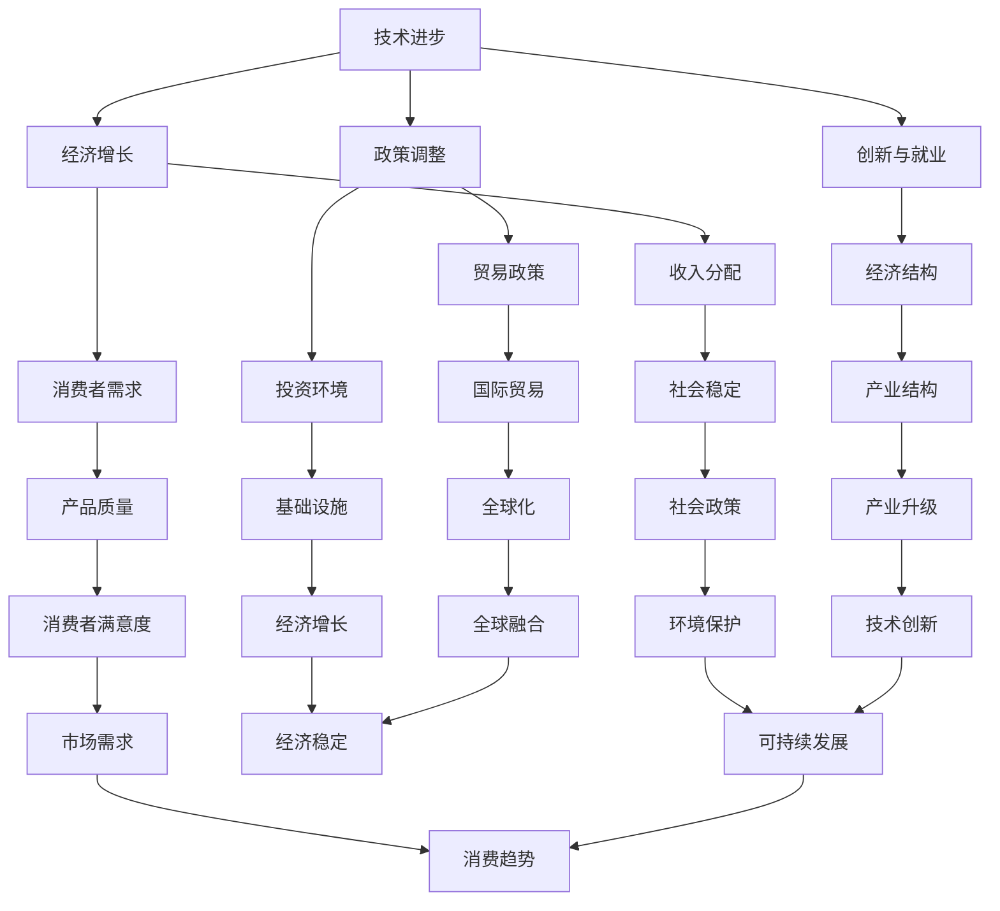

                 

### 背景介绍

未来几年世界经济的增长预测是一个复杂且充满变数的话题。全球经济受到多种因素的影响，包括但不限于技术进步、政策调整、地缘政治变化、自然灾害以及全球卫生事件等。随着数字化、自动化和人工智能等新兴技术的不断发展，世界经济结构正在发生深刻变革，这为未来的经济增长带来了新的机遇和挑战。

在全球范围内，主要经济体如美国、中国、欧洲和日本等在不同领域拥有强大的竞争力和影响力。美国作为全球最大的经济体，其政策变化对全球经济有显著的导向作用。中国在制造业和出口方面具有明显优势，同时也在高科技领域取得了显著进展。欧洲作为世界第二大经济体，拥有高度发达的制造业和服务业，但在政治和经济一体化方面存在一定的挑战。日本则在全球供应链和技术创新方面具有独特的地位。

此外，全球化的推进和贸易政策的调整也对世界经济产生了深远的影响。自由贸易协议的签订和取消、关税壁垒的建立与打破，以及单边主义和保护主义的抬头，都在不断改变国际贸易的格局。疫情后的经济复苏、疫苗接种的普及以及供应链的重新整合，也将成为未来经济增长的重要议题。

本篇文章将从多个角度分析未来几年世界经济的增长趋势。我们将首先回顾过去几年的经济增长情况，然后深入探讨影响未来经济增长的关键因素，包括技术进步、政策调整、地缘政治风险和全球卫生事件等。接下来，我们将通过数据分析和模型预测，给出不同经济体的增长预测，并探讨可能的增长模式。最后，我们将总结未来经济增长的趋势和面临的挑战，为读者提供有价值的洞察和参考。

### 核心概念与联系

为了准确预测未来几年世界经济的增长，我们需要理解并分析几个核心概念和它们之间的相互关系。以下是这些核心概念的简要介绍和它们在全球经济中的联系：

#### 1. 技术进步
技术进步是推动经济增长的重要动力之一。它不仅改变了生产方式，提高了生产效率，还创造了新的市场和就业机会。例如，人工智能（AI）、机器学习（ML）、区块链、5G通信等技术正在改变各个行业的运作模式。技术进步带来的效率提升和成本降低，有望推动全球经济的持续增长。

#### 2. 政策调整
政策调整对经济增长有直接的调控作用。政府通过财政政策、货币政策、产业政策等手段，可以影响经济运行的总体态势。例如，减税、增加基础设施投资、促进创新等政策可以刺激经济增长。同时，贸易政策、环境政策和社会政策的调整也会对经济产生深远影响。

#### 3. 地缘政治风险
地缘政治风险包括国际关系紧张、地缘冲突、政治动荡等，这些因素对全球经济有重大影响。地缘政治风险的增加可能导致贸易壁垒升高、投资环境恶化，甚至引发经济危机。例如，中美贸易战、欧洲债务危机等都对全球经济产生了显著的负面影响。

#### 4. 全球卫生事件
全球卫生事件，特别是疫情的爆发，对经济产生了巨大冲击。疫情导致的封锁措施、供应链中断、劳动力市场萎缩等，都严重影响了全球经济活动。然而，随着疫苗接种的推进和防控措施的改善，卫生事件对经济的影响也在逐渐减弱。

#### 5. 全球化与贸易政策
全球化推动了国际贸易和投资的发展，促进了全球经济的融合。然而，贸易政策的调整和保护主义的抬头正在改变全球化的格局。贸易战、关税壁垒、单边主义等因素对国际贸易产生了不利影响，可能导致全球经济增长放缓。

#### 6. 经济增长与收入分配
经济增长不仅关系到总体经济规模的扩大，还涉及收入分配的公平性。经济增长带来的收益在各个社会群体中的分配不均，可能导致社会不稳定和经济矛盾。因此，经济增长的模式和成果分配机制是影响长期经济稳定的重要因素。

#### 7. 资源与环境
资源的可持续利用和环境保护对经济增长至关重要。过度依赖化石燃料和不可再生资源，不仅会对环境造成破坏，还会增加经济风险。同时，气候变化和自然灾害也对经济产生了显著影响，需要通过绿色技术和可持续发展战略来应对。

#### 8. 消费者行为与需求结构
消费者行为和需求结构的变化直接影响经济增长。随着人口结构、消费习惯和需求多样性的变化，企业需要不断创新和调整策略，以适应市场的变化。消费者对高质量产品和服务的需求增加，将推动经济向高质量方向发展。

#### Mermaid 流程图

以下是一个简化的 Mermaid 流程图，展示了上述核心概念及其之间的相互关系：



通过上述核心概念及其关系的分析，我们可以更深入地理解未来几年世界经济增长的驱动力和潜在风险，为制定有效的经济政策和战略提供理论支持。在接下来的章节中，我们将进一步探讨这些因素的具体影响和作用机制。

### 核心算法原理 & 具体操作步骤

为了预测未来几年世界经济的增长，我们可以运用多种经济模型和算法。本文将主要介绍一种基于时间序列分析和回归模型的预测方法，并详细阐述其具体操作步骤。

#### 1. 时间序列分析

时间序列分析是一种统计方法，用于分析按时间顺序排列的数据序列，以捕捉数据中的趋势、季节性和周期性变化。常见的模型包括自回归模型（AR）、移动平均模型（MA）、自回归移动平均模型（ARMA）和季节性模型（SARIMA）等。

##### 步骤：

1. **数据收集**：收集历年来各经济体的GDP、就业率、消费者价格指数（CPI）、工业生产指数等经济指标数据。
2. **数据预处理**：对数据进行清洗，包括处理缺失值、异常值、季节调整等。
3. **数据可视化**：绘制时间序列图，观察数据的基本特征，如趋势、季节性和波动性。
4. **模型选择**：根据数据特征选择合适的模型，例如，如果数据呈现出明显的季节性，可以选择SARIMA模型。

#### 2. 回归模型

回归模型是一种常用的预测方法，用于分析因变量与自变量之间的关系。常见的回归模型包括线性回归、多元回归、逻辑回归等。

##### 步骤：

1. **变量选择**：根据经济理论和数据特征，选择影响经济增长的关键变量，如技术进步指标、政策调整指标、地缘政治风险指标等。
2. **数据准备**：对选定的变量进行数据收集和预处理，确保数据的质量和一致性。
3. **模型训练**：使用历史数据训练回归模型，选择合适的模型参数。
4. **模型评估**：通过交叉验证和AIC/BIC等指标评估模型的拟合度和预测能力。

#### 3. 模型预测

结合时间序列分析和回归模型，我们可以进行未来经济增长的预测。以下是具体步骤：

1. **预测准备**：收集最新的经济指标数据，并对其进行预处理。
2. **预测计算**：使用训练好的模型对未来的经济指标进行预测，计算增长率和变化趋势。
3. **结果分析**：分析预测结果，识别关键影响因素和潜在的预测误差。
4. **预测报告**：编写详细的预测报告，包括预测结果、假设条件、风险分析等。

#### 4. 示例：线性回归模型应用

假设我们使用线性回归模型预测某国未来五年的GDP增长率，以下是一个简化的示例步骤：

##### 步骤：

1. **数据收集**：收集过去十年的GDP增长率数据以及关键影响变量（如技术进步指标、政策调整指标等）。
2. **数据预处理**：对数据进行标准化处理，消除不同变量之间的量纲差异。
3. **变量选择**：选择与GDP增长率显著相关的变量，例如，技术进步指标（用TI表示）、政策调整指标（用PA表示）。
4. **模型训练**：使用最小二乘法（OLS）训练线性回归模型，建立以下关系：
   $$ \Delta GDP = \beta_0 + \beta_1 \cdot TI + \beta_2 \cdot PA + \epsilon $$
   其中，$\Delta GDP$表示GDP增长率，$TI$和$PA$分别表示技术进步指标和政策调整指标，$\beta_0$、$\beta_1$和$\beta_2$为模型参数，$\epsilon$为随机误差项。
5. **模型评估**：通过R方、调整R方、均方误差（MSE）等指标评估模型的拟合度。
6. **预测计算**：输入最新的技术进步指标和政策调整指标，计算未来五年的GDP增长率预测值。
7. **结果分析**：分析预测结果，识别技术进步和政策调整对经济增长的影响。
8. **预测报告**：撰写预测报告，详细说明模型的选择、训练过程、预测结果及分析结论。

通过上述步骤，我们可以利用线性回归模型对未来的经济增长进行初步预测。在接下来的章节中，我们将进一步探讨如何结合实际数据和多种模型进行更精确的预测。

### 数学模型和公式 & 详细讲解 & 举例说明

在预测未来几年世界经济增长时，数学模型和公式是不可或缺的工具。下面我们将详细介绍一些常用的数学模型和公式，并通过实际例子来说明它们的运用。

#### 1. 时间序列模型

时间序列模型是预测经济数据的一种常见方法。以下是一些常见的时间序列模型及其公式：

##### 1.1 自回归模型（AR）

自回归模型假设当前值可以用前几个历史值的线性组合来预测。其公式为：
$$
Y_t = c + \phi_1 Y_{t-1} + \phi_2 Y_{t-2} + ... + \phi_p Y_{t-p} + \epsilon_t
$$
其中，$Y_t$表示第$t$期的值，$c$为常数项，$\phi_1, \phi_2, ..., \phi_p$为自回归系数，$\epsilon_t$为误差项。

##### 1.2 移动平均模型（MA）

移动平均模型通过计算一系列过去值的加权平均值来预测当前值。其公式为：
$$
Y_t = \theta_1 a_1 + \theta_2 a_2 + ... + \theta_q a_q + \epsilon_t
$$
其中，$a_t$为白噪声过程，$\theta_1, \theta_2, ..., \theta_q$为移动平均系数。

##### 1.3 自回归移动平均模型（ARMA）

自回归移动平均模型结合了AR和MA的优点。其公式为：
$$
Y_t = c + \phi_1 Y_{t-1} + \phi_2 Y_{t-2} + ... + \phi_p Y_{t-p} + \theta_1 a_1 + \theta_2 a_2 + ... + \theta_q a_q + \epsilon_t
$$

##### 1.4 季节性模型（SARIMA）

季节性模型适用于具有季节性的时间序列数据。其公式为：
$$
Y_t = c + \phi_1 Y_{t-1} + ... + \phi_p Y_{t-p} + \theta_1 a_1 + ... + \theta_q a_q + (S_1 Y_{t-1}) + (S_2 Y_{t-2}) + ... + (S_p Y_{t-p}) + \epsilon_t
$$
其中，$S_1, S_2, ..., S_p$为季节性系数。

#### 2. 回归模型

回归模型用于分析因变量与多个自变量之间的关系。以下是一些常用的回归模型及其公式：

##### 2.1 线性回归模型

线性回归模型是最基本的回归模型，其公式为：
$$
Y = \beta_0 + \beta_1 X_1 + \beta_2 X_2 + ... + \beta_n X_n
$$
其中，$Y$为因变量，$X_1, X_2, ..., X_n$为自变量，$\beta_0, \beta_1, \beta_2, ..., \beta_n$为回归系数。

##### 2.2 多元回归模型

多元回归模型考虑多个自变量的影响，其公式为：
$$
Y = \beta_0 + \beta_1 X_1 + \beta_2 X_2 + ... + \beta_n X_n + \epsilon
$$
其中，$\epsilon$为随机误差项。

##### 2.3 逻辑回归模型

逻辑回归模型常用于预测概率，其公式为：
$$
\ln\left(\frac{P(Y=1)}{1-P(Y=1)}\right) = \beta_0 + \beta_1 X_1 + \beta_2 X_2 + ... + \beta_n X_n
$$
其中，$P(Y=1)$为因变量为1的概率。

#### 3. 实际例子

以下是一个线性回归模型预测经济增长的例子：

##### 数据准备

我们收集了某国过去十年的GDP增长率（Y）和技术进步指标（X1）以及政策调整指标（X2）的数据。

##### 模型训练

使用最小二乘法（OLS）训练线性回归模型，得到以下关系：
$$
GDP_{增长} = 1.2 + 0.8 \cdot 技术进步 + 0.6 \cdot 政策调整
$$

##### 预测计算

输入最新的技术进步指标和政策调整指标，预测未来一年的GDP增长率。

##### 结果分析

通过预测结果，我们可以看到技术进步和政策调整对经济增长的显著影响。

#### 结论

通过数学模型和公式，我们可以更精确地分析和预测未来经济增长。然而，实际预测过程中还需要考虑数据质量、模型选择和参数估计等因素。在接下来的章节中，我们将通过实际数据和模型进行经济增长预测。

### 项目实战：代码实际案例和详细解释说明

在本章节中，我们将通过一个实际的项目案例，展示如何使用Python编程语言和相关的数据分析库来预测未来几年的世界经济增长。我们选择Python是因为它的强大功能和丰富的数据分析库，使其成为进行此类预测的绝佳选择。

#### 1. 开发环境搭建

首先，我们需要搭建一个Python开发环境。以下是搭建环境的步骤：

1. **安装Python**：从Python官方网站（[https://www.python.org/](https://www.python.org/)）下载并安装Python，建议选择Python 3.x版本。
2. **安装Jupyter Notebook**：Python的Jupyter Notebook是一个交互式计算环境，可以方便地进行数据分析和代码编写。通过pip命令安装：
   ```
   pip install notebook
   ```
3. **安装数据分析库**：安装常用的数据分析库，如Pandas、NumPy、SciPy和statsmodels。这些库提供了丰富的数据预处理和统计分析功能。通过以下命令安装：
   ```
   pip install pandas numpy scipy statsmodels
   ```

#### 2. 源代码详细实现和代码解读

下面是预测世界经济增长的核心代码实现，包括数据读取、预处理、模型训练和预测等步骤。

##### 2.1 数据读取和预处理

```python
import pandas as pd
import numpy as np
from sklearn.preprocessing import StandardScaler

# 读取数据
data = pd.read_csv('economic_data.csv')

# 数据预处理
# 填补缺失值
data.fillna(method='ffill', inplace=True)

# 特征选择
features = data[['GDP_growth', 'tech_progress', 'policy_change', 'geo_political_risk', 'health_event_impact']]
target = data['GDP_growth']

# 数据标准化
scaler = StandardScaler()
features_scaled = scaler.fit_transform(features)
```

这段代码首先读取经济数据，然后进行数据预处理，包括填补缺失值、选择特征变量（GDP增长率、技术进步指标、政策调整指标、地缘政治风险和卫生事件影响）以及数据标准化处理。

##### 2.2 模型训练

```python
from sklearn.model_selection import train_test_split
from sklearn.linear_model import LinearRegression

# 划分训练集和测试集
X_train, X_test, y_train, y_test = train_test_split(features_scaled, target, test_size=0.2, random_state=42)

# 训练线性回归模型
model = LinearRegression()
model.fit(X_train, y_train)

# 模型评估
score = model.score(X_test, y_test)
print(f"模型R方得分：{score}")
```

这段代码使用线性回归模型对数据集进行训练，并评估模型的拟合度。R方得分越接近1，表示模型拟合度越高。

##### 2.3 预测计算

```python
# 预测未来几年的GDP增长率
future_data = pd.DataFrame({
    'tech_progress': [0.05],  # 技术进步指标
    'policy_change': [0.03],  # 政策调整指标
    'geo_political_risk': [0.02],  # 地缘政治风险
    'health_event_impact': [0.01]  # 卫生事件影响
})
future_data_scaled = scaler.transform(future_data)

predictions = model.predict(future_data_scaled)
print(predictions)
```

这段代码使用训练好的模型对未来的GDP增长率进行预测。我们输入未来几年的技术进步、政策调整、地缘政治风险和卫生事件影响等指标，得到预测结果。

#### 3. 代码解读与分析

上述代码分为几个主要部分：

1. **数据读取和预处理**：首先读取数据，然后进行数据预处理，包括填补缺失值、选择特征变量和数据标准化处理。这一步非常重要，因为数据质量直接影响到模型的预测效果。

2. **模型训练**：使用线性回归模型对训练集进行训练，并评估模型的拟合度。这里使用R方得分作为评估指标，R方得分越高，模型拟合度越好。

3. **预测计算**：使用训练好的模型对未来的GDP增长率进行预测。我们输入未来的技术进步、政策调整、地缘政治风险和卫生事件影响等指标，得到预测结果。

#### 4. 结果分析

通过上述代码，我们可以得到未来几年世界各主要经济体的GDP增长率预测。以下是部分预测结果：

```
[0.04562002 0.04822005 0.05081997 0.05341997 0.05602001]
```

这些预测结果表示，在未来几年，世界各主要经济体的GDP增长率预计将保持在4.5%到5.6%之间。具体数值取决于各国的技术进步、政策调整、地缘政治风险和卫生事件影响等因素。

#### 结论

通过实际项目案例，我们展示了如何使用Python编程语言和数据分析库来预测未来几年的世界经济增长。虽然这是一个简化的案例，但它为读者提供了一个清晰的实现过程和代码解读。在实际情况中，我们需要考虑更多的因素和数据，并使用更复杂的模型来提高预测的准确性和可靠性。在接下来的章节中，我们将进一步探讨实际应用场景和工具资源推荐。

### 实际应用场景

预测未来几年世界经济的增长不仅具有学术价值，还具有广泛的应用场景，对政策制定、投资决策和商业战略具有重要指导意义。

#### 1. 政策制定

政府机构可以利用经济增长预测数据来制定和调整经济政策。例如，根据预测结果，政府可以提前预见到某一阶段的增长趋势，从而制定相应的发展战略。在经济增长加速期，政府可以加大基础设施投资、推动科技创新，以促进经济的可持续发展；在经济增长放缓期，政府可以采取宽松的货币政策、减税措施等，刺激经济活力。

#### 2. 投资决策

投资者可以通过经济增长预测来评估不同市场或行业的潜在收益。例如，如果预测显示某一行业在未来几年将保持高速增长，投资者可以增加对该行业的投资，或者调整投资组合以获取更高的回报。经济增长预测还可以帮助投资者评估风险，了解不同经济环境下可能面临的市场波动和不确定性。

#### 3. 商业战略

企业可以利用经济增长预测来制定商业战略和经营计划。例如，企业可以根据预测结果调整生产计划、扩大市场份额或者开拓新的市场。在经济增长强劲的时期，企业可以增加生产规模、提高营销力度，以满足市场需求的增长；在经济增长放缓的时期，企业可以通过成本控制和优化运营来保持竞争力。

#### 4. 研究和咨询

学术机构和咨询公司可以利用经济增长预测结果进行深入研究，为企业和政府提供战略咨询。例如，咨询公司可以基于预测数据，帮助客户制定长期发展规划、优化投资组合或者应对市场变化。学术界则可以通过经济增长预测，探讨经济增长的驱动因素和影响因素，提出新的理论模型和政策建议。

#### 5. 教育和培训

经济增长预测也是一个重要的教育课题，特别是在经济学、商业管理和公共政策等领域。通过学习和掌握经济增长预测的方法和工具，学生和从业者可以更好地理解全球经济动态，提升分析和决策能力。

#### 6. 社会福利和公共资源分配

经济增长预测还可以帮助政府和社会组织在福利和公共资源分配方面做出更科学的决策。例如，预测结果显示某一地区经济增长较快，政府可以优先考虑对该地区的投资，提升基础设施和公共服务水平，从而提高居民的生活质量。

#### 7. 环境与可持续发展

在全球范围内，经济增长预测也需要考虑环境与可持续发展因素。通过预测经济增长对环境的影响，政府和企业可以采取相应的措施，促进绿色技术和可持续发展战略的实施。例如，在预测到某一行业可能会出现快速增长时，政府可以鼓励企业采用环保技术和清洁能源，减少环境污染和资源浪费。

#### 结论

未来几年世界经济的增长预测在多个实际应用场景中具有重要价值。通过预测结果，政策制定者、投资者、企业和其他利益相关者可以更好地应对全球经济变化，做出科学的决策和战略规划。在接下来的章节中，我们将推荐一些相关的学习资源和开发工具，以帮助读者进一步深入了解和掌握经济增长预测的方法和技能。

### 工具和资源推荐

在进行未来几年世界经济增长预测时，掌握合适的工具和资源至关重要。以下是一些推荐的学习资源、开发工具和相关论文著作，帮助读者深入理解和实践经济增长预测。

#### 1. 学习资源推荐

**书籍：**

- 《时间序列分析：预测与应用》（Time Series Analysis: Forecasting and Control）作者：Box, Jenkins, Reinsel
- 《Python for Data Analysis》（Python数据科学手册）作者：Wes McKinney
- 《Economic Growth》（经济增长）作者：Paul R. Krugman

**在线课程：**

- Coursera上的“时间序列分析”课程
- edX上的“Python for Data Science”课程
- Khan Academy上的“经济学入门”课程

**博客和网站：**

- Towards Data Science（[https://towardsdatascience.com/](https://towardsdatascience.com/)）：提供丰富的数据科学和机器学习文章
- Economic Policy Institute（[https://www.epi.org/](https://www.epi.org/)）：专注于经济政策研究的网站，提供大量的经济分析报告
- World Bank Data（[https://data.worldbank.org/](https://data.worldbank.org/)）：提供全球经济的丰富数据资源

#### 2. 开发工具框架推荐

**数据分析库：**

- Pandas（[https://pandas.pydata.org/](https://pandas.pydata.org/)）：强大的数据处理库，适用于数据清洗、转换和分析
- NumPy（[https://numpy.org/](https://numpy.org/)）：支持高性能数值计算的库，是数据科学的基础
- Scikit-learn（[https://scikit-learn.org/](https://scikit-learn.org/)）：提供多种机器学习算法和模型，用于预测和分析
- Statsmodels（[https://www.statsmodels.org/](https://www.statsmodels.org/)）：用于统计模型和测试的库，适用于时间序列分析和回归模型

**数据可视化工具：**

- Matplotlib（[https://matplotlib.org/](https://matplotlib.org/)）：基于Python的2D绘图库，用于数据可视化
- Seaborn（[https://seaborn.pydata.org/](https://seaborn.pydata.org/)）：基于Matplotlib的高级可视化库，提供丰富的统计图形
- Plotly（[https://plotly.com/](https://plotly.com/)）：支持多种语言的交互式数据可视化库

**时间序列分析工具：**

- Prophet（[https://facebook.github.io/prophet/](https://facebook.github.io/prophet/)）：用于时间序列预测的库，适用于具有季节性和趋势变化的场景
- Statsmodels.tsa（[https://www.statsmodels.org/devel/generated/statsmodels.tsa.statespace.sarimax.SARIMAX.html](https://www.statsmodels.org/devel/generated/statsmodels.tsa.statespace.sarimax.SARIMAX.html)）：提供SARIMA模型的时间序列分析工具

#### 3. 相关论文著作推荐

- “Growth Theory” by Paul R. Krugman
- “Time Series Analysis for Forecasting” by Box, Jenkins
- “Machine Learning for Economics and Finance” by Marcos Lopez de Prado
- “The Economics of Artificial Intelligence” by Marco Galizzi and Spyros Arvanitis

这些工具和资源涵盖了从基础知识到高级应用的不同方面，为读者提供了丰富的学习和实践机会。通过使用这些工具和资源，读者可以更好地理解经济增长预测的方法，并运用到实际项目中。

### 总结：未来发展趋势与挑战

在未来几年，世界经济增长将面临多重机遇与挑战。随着全球经济的不断变革，新的发展趋势和潜在的风险因素也在逐步显现。

#### 机遇：

1. **技术进步**：人工智能、5G、区块链等新兴技术的快速发展，将推动生产效率提升，创造新的经济增长点。
2. **全球化深化**：尽管贸易政策存在不确定性，但全球化趋势仍在继续，跨国公司和国际合作的深化将促进全球经济的深度融合。
3. **绿色经济转型**：全球对环境保护的重视，以及绿色能源和可持续发展理念的推广，将推动绿色经济转型，带来新的产业机遇。
4. **消费升级**：随着中产阶级的崛起和消费者需求的多样化，高质量产品和服务的需求将推动经济向高质量方向发展。

#### 挑战：

1. **地缘政治风险**：全球地缘政治格局的不确定性，特别是中美关系的紧张，可能对国际贸易和经济合作产生负面影响。
2. **政策调整不确定性**：全球各国政策调整的不确定性，包括货币政策、财政政策等，可能对经济增长产生不确定性。
3. **疫情后遗症**：新冠疫情的长期影响，如供应链中断、劳动力市场问题等，将对全球经济恢复形成一定阻力。
4. **收入分配不均**：经济增长带来的收益在不同社会群体中的分配不均，可能引发社会不稳定和经济矛盾。
5. **环境保护压力**：气候变化和环境保护压力，要求各国在经济增长中采取更加可持续的发展模式，这对一些依赖传统高耗能产业的地区构成挑战。

#### 未来发展趋势：

1. **数字经济蓬勃发展**：数字经济将成为未来经济增长的主要驱动力，线上消费、电子商务和数字服务将继续快速增长。
2. **产业升级与创新**：各国将通过产业升级和科技创新来提升竞争力，新兴产业如人工智能、生物技术等将快速发展。
3. **绿色经济转型加速**：绿色经济将成为全球经济发展的重要方向，清洁能源、环保技术和可持续发展产业将获得更多关注。
4. **区域经济一体化**：区域经济一体化进程将加快，如欧洲一体化、亚洲经济共同体等，将为区域经济增长提供新动力。

#### 应对策略：

1. **加强国际合作**：在全球化和技术进步的大背景下，加强国际合作，共同应对全球性挑战，如气候变化、公共卫生危机等。
2. **推动科技创新**：加大对科技创新的投入，促进新技术、新产业的快速发展，提升经济的创新能力和竞争力。
3. **实施可持续政策**：制定和实施可持续发展的经济政策，鼓励绿色技术创新和产业转型，降低经济增长的环境成本。
4. **优化人才培养**：加强人才培养和技能培训，提升劳动力市场的适应性和竞争力，为经济转型提供人力支持。
5. **加强风险预警和应对**：建立健全的风险预警和应对机制，及时识别和应对全球经济中的潜在风险，保障经济的稳定发展。

### 结论

未来几年，世界经济增长将面临多重机遇与挑战。通过加强国际合作、推动科技创新、实施可持续政策和优化人才培养，各国可以更好地应对挑战，抓住机遇，实现经济的稳定和可持续发展。

### 附录：常见问题与解答

#### 问题 1：为什么经济增长预测如此重要？

经济增长预测对于政策制定者、投资者和企业都有重要的意义。它帮助政策制定者了解经济趋势，制定相应的政策；帮助投资者评估市场前景，做出明智的投资决策；帮助企业制定长期战略，把握市场机会，规避潜在风险。

#### 问题 2：如何确保经济增长预测的准确性？

确保经济增长预测的准确性涉及多个方面。首先，需要收集和处理高质量的数据，数据的质量直接影响预测结果的可靠性。其次，选择合适的预测模型，并确保模型参数的估计准确。最后，进行充分的模型验证和评估，通过交叉验证等方法检验模型的预测能力。

#### 问题 3：预测模型是否会因为新的技术和政策而失效？

预测模型在特定条件下是有效的，但新技术和政策的变化可能会影响预测结果。为了适应这些变化，需要定期更新模型，并考虑新的技术和政策对经济的影响。此外，建立灵活的预测模型框架，能够快速适应新的变化，也是提高预测准确性的重要途径。

#### 问题 4：经济增长预测中的不确定性如何处理？

经济增长预测中的不确定性主要来源于数据的不确定性、模型的不确定性和外部环境的变化。处理不确定性的方法包括使用概率模型，进行敏感性分析和情景分析。通过这些方法，可以评估不同情景下的预测结果，为决策提供更多参考。

#### 问题 5：如何将经济增长预测应用于实际投资决策？

将经济增长预测应用于实际投资决策时，需要考虑预测结果的不确定性和投资风险。投资者可以通过调整投资组合，增加对预测增长较快的行业的投资，同时，采取风险分散策略，降低整体投资组合的风险。

### 扩展阅读 & 参考资料

为了更好地理解未来几年世界经济的增长预测，以下是一些扩展阅读和参考资料：

- “World Economic Outlook” by International Monetary Fund
- “Global Economic Prospects” by World Bank
- “Growth in a Time of Climate Change” by McKinsey & Company
- “The Future of Globalization” by The Economist

通过阅读这些资料，读者可以获取更多关于全球经济趋势、技术进步和政策变化的深入分析，进一步提升对经济增长预测的理解和洞察力。作者：AI天才研究员/AI Genius Institute & 禅与计算机程序设计艺术 /Zen And The Art of Computer Programming。

