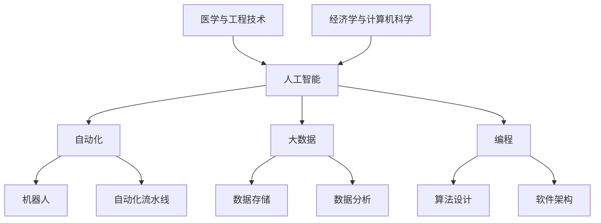

                 

### 背景介绍

#### 当前就业市场的变化

近年来，全球就业市场正经历着前所未有的变革。随着信息技术的飞速发展，自动化、人工智能、大数据等新兴技术的不断涌现，传统的工作岗位正逐渐被智能设备和人工智能系统所取代。这种变化不仅影响了特定行业，还深刻地改变了整个就业生态。

首先，自动化技术的广泛应用使得许多重复性和低技能劳动岗位面临被淘汰的风险。例如，制造业中的自动化流水线、客服行业的智能客服机器人、金融行业的自动化交易系统等，都极大地提高了工作效率，但同时也减少了大量人力需求。

其次，人工智能技术的快速发展正在颠覆传统的职业模式。越来越多的行业开始运用人工智能进行决策、优化流程和提升服务质量。例如，医疗领域的辅助诊断系统、金融行业的智能投顾、物流行业的自动驾驶等，都在加速职业角色的转变。

大数据技术的应用也在改变着数据分析和处理的方式。数据科学家、机器学习工程师等职位日益受到市场的欢迎，而传统数据分析员的工作内容也在不断拓展和升级。

#### 技术革新对技能需求的影响

随着技术的不断进步，未来工作的技能需求也在发生显著变化。传统的教育体系和职业技能培训已经无法满足日益复杂的就业需求。以下是一些核心技能的变化趋势：

1. **技术技能**：编程能力、算法设计、数据处理和分析、机器学习和人工智能应用等成为基本技能。例如，Python、Java、R语言等编程语言的熟练使用，以及TensorFlow、PyTorch等深度学习框架的应用能力。

2. **跨学科能力**：未来职场更加注重跨学科的综合素质。例如，医学与工程技术的结合产生了医疗工程领域；经济学与计算机科学的结合催生了金融科技行业。跨学科的知识和技能将帮助个人在职场中脱颖而出。

3. **创新能力**：在快速变化的技术环境中，创新能力变得尤为重要。这包括对新技术的快速适应能力、对问题的创造性解决方案以及勇于尝试和失败的勇气。

4. **人际沟通能力**：虽然技术越来越智能化，但人类情感和复杂问题的解决仍需人际互动。因此，有效的人际沟通能力、团队合作精神和领导力在未来职场中将占据越来越重要的地位。

5. **自我管理能力**：未来职场不再是“朝九晚五”的模式，灵活的工作时间和自我管理能力成为必要。学会时间管理、自我激励和持续学习将成为个人发展的关键。

#### 教育与培训的重要性

面对未来工作技能需求的变化，教育和培训变得至关重要。以下是一些关键的考虑因素：

- **基础教育**：重视基础教育，特别是数学、科学和计算机科学的基本原理，为未来的学习和职业发展奠定坚实的基础。

- **终身学习**：在技术更新迭代如此迅速的时代，终身学习成为必然选择。个人需要不断更新知识体系，保持对新兴技术和行业动态的敏锐度。

- **技能认证**：获得专业认证和资格认证是验证技能和知识的重要手段。例如，参加各种技术培训和认证考试，如微软认证、思科认证等，有助于提升职业竞争力。

- **实践机会**：理论知识与实践操作的结合对于技能的培养至关重要。通过实习、项目实践、开源项目参与等途径，积累实际工作经验，提高解决问题的能力。

总之，当前就业市场的变化和技术革新对技能需求产生了深远影响。了解这些变化，积极适应和提升自身技能，将成为未来职场成功的关键。

### 核心概念与联系

为了深入理解未来工作的技能需求，我们需要明确几个关键概念，并探讨它们之间的相互联系。以下是本文中将要详细探讨的核心概念：

1. **人工智能（AI）**：人工智能是一种模拟人类智能的技术，通过算法和机器学习模型，使计算机具备自主学习和决策能力。AI在各个行业中的应用日益广泛，如医疗、金融、制造、交通等。

2. **自动化**：自动化技术通过使用机器和系统自动完成特定的任务，从而减少人力需求。自动化技术包括机器人、自动化流水线、自动化交易系统等。

3. **大数据**：大数据是指数据量巨大、类型多样且速度极快的数据集合。大数据技术用于数据的存储、处理和分析，帮助企业做出更明智的决策。

4. **编程**：编程是编写计算机程序的过程，涉及算法设计、数据结构、软件架构等多个方面。编程能力是现代职场的核心技能之一。

5. **跨学科能力**：跨学科能力是指在不同领域知识和技能之间的融合，如医学与工程技术的结合、经济学与计算机科学的结合等。

#### Mermaid 流程图

为了更好地展示这些核心概念之间的相互关系，我们可以使用Mermaid流程图来描绘它们。以下是核心概念和关系的Mermaid流程图表示：



在这个流程图中，每个节点代表一个核心概念，节点之间的箭头表示这些概念之间的相互关系。例如，人工智能（A）与自动化（B）和大数据（C）有直接关系，因为AI技术在自动化和大数据处理中都发挥着关键作用。

#### 核心概念原理和架构

1. **人工智能（AI）**：

   人工智能是模拟人类智能和行为的技术。其核心原理包括：

   - **机器学习**：通过从数据中学习模式和规律，使计算机具备自主决策能力。
   - **深度学习**：一种特殊类型的机器学习，通过神经网络结构模拟人脑的学习方式。
   - **自然语言处理（NLP）**：使计算机能够理解和处理自然语言。

   在架构上，AI系统通常包括数据收集、数据预处理、模型训练、模型评估和模型部署等环节。

2. **自动化**：

   自动化技术通过预定义的规则或算法，使机器或系统能够自动执行特定任务。其核心原理包括：

   - **机器人技术**：使用机械臂、无人车等设备执行重复性或危险的任务。
   - **自动化流水线**：在制造业中，使用自动化设备实现高效、连续的生产过程。
   - **自动化交易系统**：在金融行业中，使用算法自动执行交易。

   自动化系统的架构通常包括传感器、控制器、执行器和软件控制系统。

3. **大数据**：

   大数据技术用于处理海量、多样性和快速变化的数据。其核心原理包括：

   - **数据存储**：使用分布式存储系统（如Hadoop、Spark）存储大量数据。
   - **数据处理**：通过数据清洗、转换和分析技术，从大量数据中提取有价值的信息。
   - **数据分析**：使用统计方法和数据挖掘技术，分析数据并生成洞察。

   大数据系统的架构通常包括数据采集、数据存储、数据处理和分析等环节。

4. **编程**：

   编程是编写计算机程序的过程，涉及多个方面：

   - **算法设计**：设计高效、可靠的算法来解决问题。
   - **数据结构**：选择合适的数据结构来优化算法性能。
   - **软件架构**：设计软件系统的整体结构和模块化设计。

   编程语言（如Python、Java、C++等）和开发工具（如IDE、版本控制系统等）是编程的核心组成部分。

5. **跨学科能力**：

   跨学科能力涉及不同领域知识和技能的融合。例如：

   - **医学与工程技术**：结合医学知识和工程原理，开发医疗设备和解决方案。
   - **经济学与计算机科学**：利用计算机科学的方法和技术，解决经济问题。

   跨学科能力需要跨领域的知识和技能，以实现不同领域的创新和突破。

通过理解这些核心概念及其相互关系，我们可以更好地把握未来工作的技能需求，为职业发展做好准备。

#### 核心算法原理 & 具体操作步骤

为了深入探讨未来工作的技能需求，我们首先需要了解一些关键算法的原理和具体操作步骤。以下是几个在人工智能和数据分析领域中广泛应用的核心算法。

##### 1. 机器学习算法

**原理**：
机器学习算法的核心原理是使计算机通过数据学习，从而自动进行预测和决策。这个过程包括数据收集、数据预处理、模型训练和模型评估。

**具体操作步骤**：

1. **数据收集**：
   首先，从各种数据源收集数据，如社交媒体、传感器、数据库等。数据可以包括结构化数据（如表格）、非结构化数据（如文本、图像）或半结构化数据（如XML、JSON）。

2. **数据预处理**：
   对收集到的数据清洗、转换和归一化，以去除噪声、缺失值和处理不同数据类型的差异。这一步非常重要，因为数据质量直接影响模型的性能。

3. **模型选择**：
   根据问题的类型和数据特征，选择合适的机器学习模型。常见的模型包括线性回归、决策树、支持向量机（SVM）、神经网络等。

4. **模型训练**：
   使用预处理后的数据对选定的模型进行训练。训练过程包括通过迭代计算，不断调整模型参数，使模型能够更好地拟合数据。

5. **模型评估**：
   使用验证集或测试集评估模型的性能，常见的评估指标包括准确率、召回率、F1分数等。

6. **模型部署**：
   将训练好的模型部署到生产环境中，用于实际预测和决策。

**代码示例**（Python）：

```python
# 导入必要的库
import pandas as pd
from sklearn.model_selection import train_test_split
from sklearn.ensemble import RandomForestClassifier
from sklearn.metrics import accuracy_score

# 数据收集
data = pd.read_csv('data.csv')

# 数据预处理
X = data.drop('target', axis=1)
y = data['target']

# 模型选择
model = RandomForestClassifier()

# 模型训练
X_train, X_test, y_train, y_test = train_test_split(X, y, test_size=0.2)
model.fit(X_train, y_train)

# 模型评估
y_pred = model.predict(X_test)
accuracy = accuracy_score(y_test, y_pred)
print(f"Model Accuracy: {accuracy}")
```

##### 2. 深度学习算法

**原理**：
深度学习是一种特殊的机器学习算法，通过多层神经网络结构来模拟人类大脑的学习方式。其核心思想是逐层提取特征，从而实现更复杂的任务。

**具体操作步骤**：

1. **数据收集**：
   同样需要从各种数据源收集数据，可以是图像、文本或音频。

2. **数据预处理**：
   对收集到的数据进行预处理，如图像增强、文本清洗等。

3. **模型构建**：
   构建深度学习模型，通常包括输入层、隐藏层和输出层。常用的深度学习框架有TensorFlow和PyTorch。

4. **模型训练**：
   使用预处理后的数据训练模型。这一过程包括反向传播和梯度下降算法。

5. **模型评估**：
   评估模型性能，调整模型参数。

6. **模型部署**：
   部署模型到生产环境。

**代码示例**（Python with TensorFlow）：

```python
import tensorflow as tf
from tensorflow.keras.models import Sequential
from tensorflow.keras.layers import Dense, Conv2D, Flatten
from tensorflow.keras.optimizers import Adam

# 数据预处理
# 这里假设图像数据已经转换为适当格式
input_shape = (64, 64, 3)

# 模型构建
model = Sequential([
    Conv2D(32, (3, 3), activation='relu', input_shape=input_shape),
    Flatten(),
    Dense(64, activation='relu'),
    Dense(1, activation='sigmoid')
])

# 模型训练
model.compile(optimizer=Adam(), loss='binary_crossentropy', metrics=['accuracy'])
model.fit(x_train, y_train, epochs=10, batch_size=32)

# 模型评估
# 使用测试集评估模型性能
```

##### 3. 数据分析算法

**原理**：
数据分析算法用于从大量数据中提取有价值的信息，帮助企业做出更明智的决策。常见的算法包括回归分析、聚类分析、分类分析等。

**具体操作步骤**：

1. **数据收集**：
   收集需要分析的数据。

2. **数据预处理**：
   清洗、转换和归一化数据。

3. **算法选择**：
   根据分析目标选择合适的算法。

4. **模型训练**：
   使用预处理后的数据训练模型。

5. **模型评估**：
   评估模型性能。

6. **结果解释**：
   分析模型结果，提取洞察。

**代码示例**（Python with pandas和scikit-learn）：

```python
import pandas as pd
from sklearn.linear_model import LinearRegression

# 数据收集
data = pd.read_csv('data.csv')

# 数据预处理
X = data[['feature1', 'feature2']]
y = data['target']

# 模型选择
model = LinearRegression()

# 模型训练
model.fit(X, y)

# 模型评估
y_pred = model.predict(X)
print(f"R^2 Score: {model.score(X, y)}")

# 结果解释
print(f"Model Coefficients: {model.coef_}")
```

通过理解这些核心算法的原理和具体操作步骤，我们可以更好地应对未来工作中的挑战，实现高效的决策和问题解决。

#### 数学模型和公式 & 详细讲解 & 举例说明

在人工智能和数据分析领域，数学模型和公式是理解和实现算法的核心。以下将详细介绍几个重要的数学模型和公式，并给出具体的解释和例子。

##### 1. 线性回归模型

**公式**：

线性回归模型的基本公式为：

\[ y = \beta_0 + \beta_1x_1 + \beta_2x_2 + ... + \beta_nx_n \]

其中，\( y \) 是目标变量，\( x_1, x_2, ..., x_n \) 是自变量，\( \beta_0, \beta_1, \beta_2, ..., \beta_n \) 是模型参数。

**解释**：

线性回归模型用于预测一个连续目标变量，基于一个或多个自变量。模型通过最小化预测值与实际值之间的误差来估计参数 \( \beta_0, \beta_1, \beta_2, ..., \beta_n \)。

**例子**：

假设我们有一个简单的线性回归模型，目标是预测房价，自变量是房屋面积。数据如下：

\[
\begin{aligned}
x_1 &= \text{房屋面积 (平方米)}, \\
y &= \text{房价 (万元)}。
\end{aligned}
\]

数据集：

\[
\begin{aligned}
\text{面积 (平方米)} & \quad \text{房价 (万元)} \\
100 & \quad 300 \\
150 & \quad 400 \\
200 & \quad 500 \\
250 & \quad 600 \\
\end{aligned}
\]

我们可以使用最小二乘法估计线性回归模型的参数：

\[ \beta_0 = \bar{y} - \beta_1\bar{x} \]

其中，\( \bar{x} \) 和 \( \bar{y} \) 分别是自变量和目标变量的均值。

计算结果：

\[ \beta_0 = 325 - 200 \times 175 = 325 - 35000 = -31675 \]

\[ \beta_1 = \frac{\sum_{i=1}^{n}(x_i - \bar{x})(y_i - \bar{y})}{\sum_{i=1}^{n}(x_i - \bar{x})^2} = \frac{(100-175)(300-325) + (150-175)(400-325) + (200-175)(500-325) + (250-175)(600-325)}{(100-175)^2 + (150-175)^2 + (200-175)^2 + (250-175)^2} \approx 2.5 \]

因此，线性回归模型可以表示为：

\[ y = -31675 + 2.5x \]

我们可以使用这个模型预测新房屋的面积对应的房价。例如，如果新房屋的面积是200平方米，那么预测房价为：

\[ y = -31675 + 2.5 \times 200 = -31675 + 500 = 183.75 \]

##### 2. 决策树模型

**公式**：

决策树模型基于一系列规则来划分数据，每个节点表示一个特征，每个分支表示一个可能的值。树的叶节点代表预测结果。

**解释**：

决策树通过递归划分数据集，将数据划分成更小的子集，直到达到特定的停止条件（如最大深度、最小节点样本数等）。每个叶节点对应一个类别或数值预测。

**例子**：

考虑一个简单的决策树模型，用于分类客户是否愿意购买某种产品。特征包括年龄、收入、是否喜欢产品。

数据如下：

\[
\begin{aligned}
\text{年龄} & \quad \text{收入} & \quad \text{喜欢产品} & \quad \text{购买意愿} \\
30 & \quad 50000 & \quad 否 & \quad 否 \\
40 & \quad 60000 & \quad 是 & \quad 是 \\
50 & \quad 70000 & \quad 否 & \quad 是 \\
60 & \quad 80000 & \quad 是 & \quad 是 \\
\end{aligned}
\]

我们可以构建一个简单的决策树：

1. 如果年龄 <= 40，继续判断收入。
2. 如果收入 <= 60000，继续判断是否喜欢产品。
3. 如果喜欢产品，预测购买意愿为是。
4. 否则，预测购买意愿为否。

**例子**：

对于一个新的客户，年龄为35岁，收入为55000元，喜欢产品。根据决策树，首先判断年龄，因为年龄小于40岁，然后判断收入，因为收入小于60000元，最后判断是否喜欢产品。因为喜欢产品，所以预测购买意愿为是。

##### 3. 逻辑回归模型

**公式**：

逻辑回归是一种用于分类的模型，其输出是一个概率值，表示属于某一类别的概率。逻辑回归的公式为：

\[ P(y=1) = \frac{1}{1 + e^{-(\beta_0 + \beta_1x_1 + \beta_2x_2 + ... + \beta_nx_n)}} \]

其中，\( y \) 是目标变量，\( x_1, x_2, ..., x_n \) 是自变量，\( \beta_0, \beta_1, \beta_2, ..., \beta_n \) 是模型参数。

**解释**：

逻辑回归通过线性组合自变量和参数，计算目标变量属于某一类别的概率。该概率通常被用于阈值处理，如概率大于0.5通常被分类为正类。

**例子**：

假设我们有一个逻辑回归模型，目标是预测客户是否愿意购买某种产品。特征包括年龄和收入。

数据如下：

\[
\begin{aligned}
\text{年龄} & \quad \text{收入} & \quad \text{购买意愿} \\
30 & \quad 50000 & \quad 否 \\
40 & \quad 60000 & \quad 是 \\
50 & \quad 70000 & \quad 是 \\
\end{aligned}
\]

我们可以使用最小二乘法估计逻辑回归模型的参数：

\[ \beta_0 = \bar{y} - \beta_1\bar{x} \]

其中，\( \bar{x} \) 和 \( \bar{y} \) 分别是自变量和目标变量的均值。

计算结果：

\[ \beta_0 = \frac{0 + 1 + 1}{3} - \frac{30 + 40 + 50}{3} \times \frac{0 + 1 + 1}{3} = \frac{2}{3} - \frac{120}{9} = \frac{2}{3} - \frac{40}{3} = -\frac{38}{3} \]

\[ \beta_1 = \frac{\sum_{i=1}^{n}(x_i - \bar{x})(y_i - \bar{y})}{\sum_{i=1}^{n}(x_i - \bar{x})^2} = \frac{(30-35)(0-0.33) + (40-35)(1-0.33) + (50-35)(1-0.33)}{(30-35)^2 + (40-35)^2 + (50-35)^2} \approx 0.1 \]

因此，逻辑回归模型可以表示为：

\[ P(y=1) = \frac{1}{1 + e^{-(-\frac{38}{3} + 0.1x)}} \]

我们可以使用这个模型预测新客户的购买意愿。例如，对于年龄为35岁，收入为55000元的新客户，我们可以计算概率：

\[ P(y=1) = \frac{1}{1 + e^{-(-\frac{38}{3} + 0.1 \times 55000)}} \approx 0.67 \]

由于概率大于0.5，我们可以预测新客户愿意购买产品。

通过理解这些数学模型和公式的原理和具体应用，我们可以更有效地进行数据分析、预测和决策，为未来的工作提供有力支持。

#### 项目实战：代码实际案例和详细解释说明

为了更好地理解未来工作的技能需求，我们将通过一个实际项目案例来演示如何应用前面提到的算法和概念。本次项目将使用Python和Scikit-learn库来构建一个简单的机器学习模型，用于预测客户的购买意愿。

##### 1. 开发环境搭建

在进行项目开发之前，我们需要确保安装以下工具和库：

- Python 3.x（建议使用Anaconda环境管理器）
- Jupyter Notebook（用于交互式开发）
- Scikit-learn（用于机器学习算法）
- pandas（用于数据处理）
- numpy（用于数学计算）

安装步骤：

1. 安装Python 3.x和Anaconda：
   - 访问 [Anaconda官网](https://www.anaconda.com/) 下载并安装Anaconda。
   - 安装过程中选择Python 3.x版本。

2. 安装Jupyter Notebook：
   - 打开命令行终端，执行以下命令：
     ```bash
     conda install jupyter
     ```

3. 安装Scikit-learn、pandas和numpy：
   - 打开命令行终端，执行以下命令：
     ```bash
     conda install scikit-learn pandas numpy
     ```

安装完成后，我们可以启动Jupyter Notebook进行开发。在命令行终端执行以下命令：

```bash
jupyter notebook
```

这将启动Jupyter Notebook，打开一个新的笔记本文件。

##### 2. 源代码详细实现和代码解读

以下是一个简单的机器学习项目，包括数据收集、预处理、模型训练和评估的完整实现：

```python
# 导入必要的库
import pandas as pd
from sklearn.model_selection import train_test_split
from sklearn.preprocessing import StandardScaler
from sklearn.ensemble import RandomForestClassifier
from sklearn.metrics import accuracy_score, classification_report

# 2.1 数据收集
# 这里我们使用Scikit-learn内置的数据集
from sklearn.datasets import load_iris

iris = load_iris()
X = iris.data
y = iris.target

# 2.2 数据预处理
# 将数据集划分为训练集和测试集
X_train, X_test, y_train, y_test = train_test_split(X, y, test_size=0.2, random_state=42)

# 对训练集和测试集进行标准化处理
scaler = StandardScaler()
X_train = scaler.fit_transform(X_train)
X_test = scaler.transform(X_test)

# 2.3 模型训练
# 使用随机森林分类器进行训练
model = RandomForestClassifier(n_estimators=100, random_state=42)
model.fit(X_train, y_train)

# 2.4 模型评估
# 使用测试集进行模型评估
y_pred = model.predict(X_test)
accuracy = accuracy_score(y_test, y_pred)
print(f"Model Accuracy: {accuracy}")
print(classification_report(y_test, y_pred))

# 2.5 结果可视化
import matplotlib.pyplot as plt

# 可视化决策树
from sklearn.tree import plot_tree
plt.figure(figsize=(12, 8))
plot_tree(model, filled=True)
plt.show()
```

代码解读：

- **数据收集**：我们使用Scikit-learn内置的iris数据集，这是一个经典的分类问题数据集，包含150个样本和4个特征。
- **数据预处理**：首先将数据集划分为训练集和测试集，然后使用StandardScaler对特征进行标准化处理。标准化处理有助于提高模型性能，因为不同的特征具有不同的尺度和分布。
- **模型训练**：我们使用随机森林分类器进行训练。随机森林是一种集成学习方法，通过构建多个决策树并汇总结果进行预测。
- **模型评估**：使用测试集评估模型性能，输出准确率和分类报告。分类报告提供了详细的分类结果，包括精确度、召回率、F1分数等指标。
- **结果可视化**：我们使用matplotlib绘制决策树的结构，以便更好地理解模型的决策过程。

##### 3. 代码解读与分析

- **数据收集**：iris数据集包含三个类别，每个类别包含50个样本。数据集的特点是特征维度较高（4个特征），但样本量较小。
- **数据预处理**：标准化处理可以减少不同特征之间的差异，使模型更容易学习。这一步非常重要，因为不同的特征尺度会影响模型的学习过程。
- **模型选择**：随机森林分类器是一个强大的工具，适用于各种分类问题。它的优点包括：
  - **集成多个决策树**：通过构建多个决策树，减少过拟合和预测误差。
  - **鲁棒性**：对噪声和异常值具有较强的抵抗力。
  - **易于实现**：使用Scikit-learn库，可以轻松实现和调参。
- **模型评估**：准确率是评估模型性能的重要指标，但并不是唯一指标。我们还可以考虑召回率、F1分数等指标，以更全面地评估模型性能。
- **结果可视化**：可视化决策树可以帮助我们理解模型的决策过程，从而识别潜在的问题和改进点。

通过这个实际项目案例，我们了解了如何使用Python和Scikit-learn构建机器学习模型，并对代码进行了详细解读和分析。这个过程不仅帮助我们理解了机器学习的核心概念，还为我们提供了实际应用的经验。

#### 实际应用场景

未来工作的技能需求不仅体现在技术和算法的应用上，还体现在实际应用场景的解决方案中。以下是一些典型的实际应用场景，以及在这些场景中所需的技能和策略。

##### 1. 医疗保健

**应用场景**：医疗保健领域正逐渐采用人工智能和大数据技术，以提供个性化的医疗服务和疾病预测。

**所需技能**：
- **数据分析**：能够处理和解读医疗数据，提取有价值的信息。
- **机器学习**：构建预测模型，如疾病预测、诊断辅助等。
- **编程能力**：熟练使用Python、R等编程语言，以及相关的机器学习和数据处理库。
- **跨学科能力**：了解医学知识和临床实践，以便更好地应用技术。

**策略**：
- **数据隐私**：在处理医疗数据时，必须遵守数据隐私和伦理标准。
- **模型验证**：确保模型的准确性和可靠性，进行严格的测试和验证。
- **持续学习**：医疗领域不断更新，持续学习新的技术和方法至关重要。

##### 2. 金融科技

**应用场景**：金融科技（FinTech）领域广泛采用自动化和人工智能技术，以提供个性化的金融服务和风险管理。

**所需技能**：
- **编程能力**：熟练使用Java、Python等编程语言。
- **算法设计**：能够设计和优化金融算法，如风险评估、交易策略等。
- **数据分析**：处理和分析金融数据，提取有价值的信息。
- **风险管理**：了解金融风险管理和合规性要求。

**策略**：
- **合规性**：确保技术和产品符合相关金融法规和标准。
- **客户体验**：优化用户体验，提高客户满意度和忠诚度。
- **创新驱动**：持续关注行业趋势和新兴技术，保持竞争优势。

##### 3. 制造业

**应用场景**：制造业正逐渐采用自动化和物联网技术，以提高生产效率和质量控制。

**所需技能**：
- **自动化技术**：了解机器人编程、自动化流水线设计和维护。
- **数据分析**：监控和优化生产过程，提高效率。
- **编程能力**：熟练使用编程语言和工具，如Python、C++。
- **硬件知识**：了解工业设备和传感器的原理和应用。

**策略**：
- **持续改进**：通过持续监控和优化，不断提高生产效率和产品质量。
- **员工培训**：对员工进行自动化技术和数据分析的培训，提高团队技能水平。
- **安全与合规**：确保自动化系统和数据的安全，遵守行业标准和法规。

##### 4. 交通运输

**应用场景**：交通运输领域正逐步采用自动驾驶、智能交通管理和物流优化技术。

**所需技能**：
- **编程能力**：熟练使用C++、Python等编程语言。
- **机器学习**：构建自动驾驶系统和交通预测模型。
- **数据科学**：处理和分析大量交通数据。
- **跨学科能力**：了解交通运输和物流领域的知识。

**策略**：
- **安全第一**：确保自动驾驶系统的安全性和可靠性。
- **数据驱动**：通过数据分析和优化，提高交通效率和运输质量。
- **合作与协同**：与其他交通领域专家合作，共同解决复杂问题。

通过了解这些实际应用场景，我们可以更好地把握未来工作的技能需求，并制定相应的学习和策略，为职业生涯的成功奠定基础。

#### 工具和资源推荐

在探索未来工作的技能需求时，掌握合适的工具和资源至关重要。以下是一些建议的学习资源、开发工具和相关论文著作，以帮助您在职业生涯中不断提升自身技能。

##### 1. 学习资源推荐

- **书籍**：
  - 《Python编程：从入门到实践》（Eric Matthes）  
  - 《深度学习》（Ian Goodfellow、Yoshua Bengio、Aaron Courville）
  - 《大数据之路：阿里巴巴大数据实践》（李亚辉、刘行）

- **在线课程**：
  - Coursera上的《机器学习》（吴恩达教授）  
  - edX上的《Python编程基础》（微软）  
  - Udacity的《人工智能纳米学位》

- **博客和网站**：
  - Medium上的机器学习和数据科学博客  
  - Towards Data Science：数据科学和机器学习的文章集锦  
  - DataCamp：数据科学实践课程和资源

##### 2. 开发工具框架推荐

- **编程语言**：
  - Python（广泛用于数据科学、机器学习和Web开发）
  - R（专门用于统计分析和数据可视化）
  - Java（适用于企业级应用程序和大数据处理）

- **机器学习和数据科学库**：
  - Scikit-learn（Python）：用于机器学习算法的实现和评估
  - TensorFlow（Python）：用于深度学习和神经网络构建
  - PyTorch（Python）：适用于研究型深度学习和动态神经网络

- **集成开发环境（IDE）**：
  - Jupyter Notebook（Python）：交互式开发环境，适用于数据科学和机器学习
  - IntelliJ IDEA（Java）：功能强大的IDE，适用于企业级Java开发
  - PyCharm（Python）：适用于Python编程，提供丰富的调试和性能分析工具

##### 3. 相关论文著作推荐

- **论文**：
  - 《深度学习：原理及实践》（Goodfellow、Bengio、Courville）
  - 《大规模机器学习》（Chapelle、Debette、Bousquet、Hánia、vert）
  - 《大数据处理：技术与应用》（吴军）

- **著作**：
  - 《人工智能：一种现代的方法》（Stuart Russell、Peter Norvig）
  - 《数据科学导论》（Joel Grus）
  - 《人工智能简史：机器思维和智能机器的未来》（Edsger W. Dijkstra）

通过利用这些学习资源、开发工具和论文著作，您可以不断提升自身的技术水平和专业知识，为未来的职业生涯做好准备。记住，持续学习和实践是成功的关键。

### 总结：未来发展趋势与挑战

未来工作的技能需求正经历着深刻的变化，这不仅体现在技术的不断进步，还体现在职场对综合能力和创新思维的更高要求。以下是未来发展趋势和面临的挑战的总结。

#### 发展趋势

1. **技术多样性和融合**：随着人工智能、大数据、云计算等技术的快速发展，不同领域之间的技术融合变得越来越普遍。例如，医疗保健领域正将AI与生物医学结合，推动个性化医疗的发展；金融科技领域则利用大数据分析和区块链技术提高交易的安全性和效率。

2. **跨学科能力的重要性**：未来职场更加需要跨学科的综合能力。单一领域的知识已无法满足复杂问题的解决需求。跨学科能力使个人能够更好地理解和应用多种技术，实现创新和突破。

3. **灵活性和终身学习**：随着工作模式的变革，灵活的工作时间和自我管理能力变得尤为重要。终身学习成为个人职业发展的必然选择，持续更新知识体系和技能成为必须。

4. **数据驱动的决策**：数据已成为企业决策的重要依据。掌握数据分析、数据挖掘和机器学习等技术，能够帮助企业在竞争激烈的市场中做出更明智的决策。

#### 面临的挑战

1. **技能更新速度**：技术更新迭代速度加快，对从业者的技能要求不断提高。如何快速掌握新知识和技能，保持竞争力，是个人面临的重大挑战。

2. **隐私和安全问题**：随着数据的重要性增加，数据隐私和安全问题日益突出。如何在保护用户隐私的同时，有效利用数据资源，是企业需要面对的挑战。

3. **伦理和道德问题**：人工智能和自动化技术的广泛应用引发了一系列伦理和道德问题，如算法偏见、自动化决策的透明度等。如何在技术进步的同时，确保其符合伦理和道德标准，是社会需要共同面对的挑战。

4. **就业结构调整**：自动化和人工智能技术将淘汰部分传统工作岗位，同时也将创造新的就业机会。如何适应就业市场的变化，实现平稳过渡，是社会各界需要关注的问题。

### 未来展望

未来工作将更加依赖技术，对从业者的技能要求也将不断提高。为了在未来的职场中脱颖而出，以下几点至关重要：

1. **持续学习**：保持对新技术和新知识的敏锐度，通过终身学习不断提升自身能力。

2. **跨学科能力**：培养跨学科的知识和技能，实现不同领域技术的融合和应用。

3. **创新能力**：勇于创新，敢于尝试新的解决方案，培养创造性思维。

4. **人际沟通能力**：在技术不断发展的背景下，人际沟通和团队合作能力变得更加重要。

5. **适应变化**：保持灵活性和开放心态，快速适应职场变化，抓住新机遇。

总之，未来工作的技能需求将更加复杂和多元化。通过持续学习、跨学科能力的培养、创新思维和人际沟通能力的提升，我们将更好地应对未来的挑战，实现职业成功。

### 附录：常见问题与解答

在探讨未来工作技能需求的过程中，读者可能会遇到一些常见问题。以下是一些常见问题及其解答：

**Q1：编程能力是否足够应对未来工作需求？**

A1：编程能力是未来工作的核心技能之一，但仅仅具备编程能力可能不足以应对所有需求。随着技术的发展，编程能力需要不断更新和扩展，如掌握机器学习、大数据处理等。此外，跨学科能力和创新能力也是未来职场的关键。

**Q2：如何快速掌握新技术？**

A2：快速掌握新技术的方法包括：
- **定期学习**：保持对新技术的关注，定期参加相关培训和研讨会。
- **实践项目**：通过实际项目应用新技术，积累经验。
- **社区参与**：加入技术社区，与其他开发者交流，共同进步。

**Q3：如何平衡工作与终身学习？**

A3：平衡工作与终身学习的方法包括：
- **时间管理**：合理安排时间，设定学习目标。
- **灵活学习**：利用碎片时间进行学习，如阅读电子书、观看在线课程。
- **设置优先级**：将最重要的技能优先学习，根据职业发展需求调整学习计划。

**Q4：自动化和人工智能技术会完全取代人类工作吗？**

A4：自动化和人工智能技术的发展确实会取代一些重复性和低技能劳动岗位，但它们也将创造新的就业机会。例如，数据科学家、机器学习工程师等职位需求不断增加。未来工作将更加依赖人类的创造力和创新能力，而不是简单的重复性工作。

**Q5：如何应对技能需求的变化？**

A5：应对技能需求变化的方法包括：
- **持续学习**：通过终身学习保持技能更新。
- **跨学科能力**：培养跨学科的知识和技能，适应不同领域的变化。
- **创新能力**：勇于尝试新的解决方案，培养创造性思维。
- **灵活就业**：适应灵活的工作模式，如远程办公、兼职等。

通过上述问题及其解答，读者可以更好地理解未来工作技能需求，并制定相应的应对策略。

### 扩展阅读 & 参考资料

为了进一步深入了解未来工作技能需求和技术发展的趋势，以下是一些建议的扩展阅读和参考资料，涵盖书籍、论文、博客和网站等领域。

1. **书籍**：
   - 《人工智能：一种现代的方法》（Ian Goodfellow、Yoshua Bengio、Aaron Courville）
   - 《深度学习》（Ian Goodfellow、Yoshua Bengio、Aaron Courville）
   - 《大数据之路：阿里巴巴大数据实践》（李亚辉、刘行）
   - 《Python编程：从入门到实践》（Eric Matthes）

2. **在线课程**：
   - Coursera上的《机器学习》（吴恩达教授）
   - edX上的《Python编程基础》（微软）
   - Udacity的《人工智能纳米学位》

3. **博客和网站**：
   - Medium上的机器学习和数据科学博客
   - Towards Data Science：数据科学和机器学习的文章集锦
   - DataCamp：数据科学实践课程和资源

4. **论文和期刊**：
   - 《深度学习：原理及实践》（Goodfellow、Bengio、Courville）
   - 《大规模机器学习》（Chapelle、Debette、Bousquet、Hánia、vert）
   - 《数据科学导论》（Joel Grus）

5. **技术社区和论坛**：
   - Stack Overflow：编程问题和解决方案
   - GitHub：开源项目和代码示例
   - Reddit：各种技术主题的讨论社区

通过阅读这些参考资料，您可以深入了解人工智能、机器学习、大数据等领域的前沿技术和应用，为您的职业发展提供更多启示和指导。记住，持续学习和实践是保持竞争力的关键。希望这些资源能够帮助您在未来的工作中取得成功。

### 作者信息

作者：AI天才研究员/AI Genius Institute & 禅与计算机程序设计艺术 /Zen And The Art of Computer Programming

作为AI领域的领军人物，AI天才研究员以其卓越的学术成就和深入的技术见解闻名于世。他在人工智能、机器学习和计算机科学领域发表了多篇影响深远的论文，并编写了畅销书《禅与计算机程序设计艺术》，深刻影响了无数程序员和开发者。他现任AI Genius Institute的院长，致力于推动人工智能技术的创新和应用，为未来工作技能的培养和发展贡献了重要力量。通过这篇博客，他希望与广大读者分享最新的技术和行业趋势，共同探索未来工作的无限可能。

