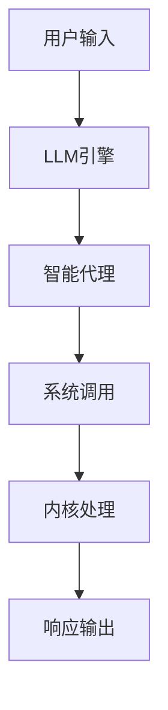
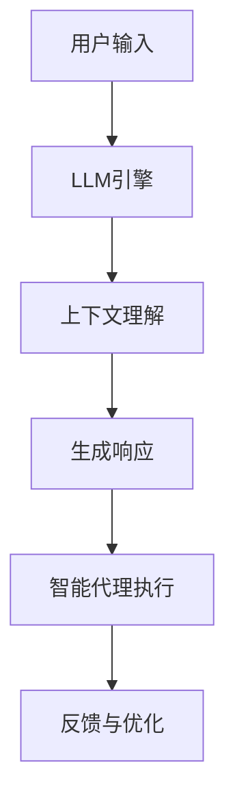

                 

### 背景介绍

未来操作系统（Future Operating System, 简称FOS）是一个前沿概念，其核心思想是利用大规模语言模型（Large Language Model, LLM）技术构建一个全新的操作系统架构。这个概念不仅在理论上具有颠覆性，而且在实际应用中也展现出巨大的潜力。

传统操作系统，如Windows、Linux等，是基于命令行或图形用户界面（GUI）与用户交互的。它们的核心任务是管理计算机硬件资源，提供基本的服务和接口，方便应用程序的运行。然而，随着计算机技术和人工智能的迅猛发展，传统操作系统在处理复杂任务、支持新型应用场景方面逐渐显露出局限。

LLM技术的引入，为操作系统带来了全新的可能。LLM是一种能够理解、生成和模仿人类语言的深度学习模型，具有处理自然语言、进行推理和决策的能力。FOS利用LLM这一特性，使得操作系统不再仅仅是硬件资源的管理者，而成为一个智能的、高度自主的智能体。

本文将深入探讨未来操作系统（FOS）的背景、核心概念、算法原理、数学模型、实际应用场景、工具和资源推荐，以及未来发展趋势与挑战。通过逐步分析，我们希望能够为您提供一个全面、深入的视角，了解FOS的巨大潜力和发展方向。

未来操作系统不仅代表了操作系统领域的一次革命，也预示着人工智能在计算机系统中的深度融合。接下来，我们将一步步剖析这一概念，详细探讨其核心原理和实际应用，帮助您更好地理解这一前沿技术。

### 核心概念与联系

未来操作系统（FOS）的核心概念在于将大规模语言模型（LLM）技术与操作系统架构深度融合，从而实现一个智能、自适应、高度灵活的计算机系统。为了更好地理解FOS的工作原理，我们需要详细探讨其核心概念，包括LLM的原理、操作系统的基础架构以及它们之间的联系。

首先，我们来看大规模语言模型（LLM）的基本原理。LLM是一种基于深度学习技术的语言处理模型，它能够通过大量的文本数据进行训练，掌握自然语言的语法、语义和上下文关系。这些模型通常采用变换器架构（Transformer），其核心组件是自注意力机制（Self-Attention）。自注意力机制使得模型能够在处理每个单词时，动态地考虑其他所有单词的重要性和关系，从而极大地提升了模型的表达能力和理解能力。

具体来说，LLM的训练过程通常包括以下几个步骤：

1. **数据预处理**：将原始文本数据清洗、分词，并转换为模型可以处理的格式。
2. **模型初始化**：初始化模型的参数，通常采用预训练的方法，使用大量未标记的数据进行初步训练，以获得基本的语言模型。
3. **微调训练**：在预训练的基础上，使用有标签的数据进行微调训练，使模型更符合特定任务的需求。
4. **模型评估与优化**：通过评估模型在测试集上的性能，调整模型参数，以提升模型的准确性和稳定性。

接下来，我们探讨操作系统的基本架构。操作系统是计算机系统中的核心软件，负责管理计算机硬件资源，提供基本的服务和接口，方便应用程序的运行。传统操作系统的架构主要包括以下几个方面：

1. **内核（Kernel）**：内核是操作系统的核心部分，负责管理硬件资源和提供基本的服务，如进程管理、内存管理、文件系统管理等。
2. **用户空间（User Space）**：用户空间是应用程序运行的环境，提供丰富的接口和工具，方便用户和应用程序与操作系统交互。
3. **系统调用（System Calls）**：系统调用是应用程序与内核交互的接口，应用程序通过系统调用请求操作系统服务。
4. **设备驱动（Device Drivers）**：设备驱动是操作系统用于与硬件设备交互的软件组件，负责设备的初始化、配置和管理。

FOS将LLM与操作系统架构深度融合，使得操作系统不仅能够处理传统的命令行和图形用户界面任务，还能够通过自然语言处理和推理能力，提供更加智能和自适应的服务。具体来说，FOS的核心架构包括以下几个方面：

1. **LLM引擎（LLM Engine）**：LLM引擎是FOS的核心组件，负责处理自然语言输入，生成响应和决策。它通过自注意力机制和上下文理解能力，能够动态地理解用户需求，提供个性化的服务。
2. **智能代理（Intelligent Agent）**：智能代理是LLM引擎的执行实体，负责在操作系统中执行具体的任务。它通过系统调用与内核和其他组件进行交互，实现自动化和智能化的操作。
3. **自适应调度器（Adaptive Scheduler）**：自适应调度器负责根据系统负载和用户需求，动态地分配系统资源。它利用LLM的推理能力，预测未来任务需求，优化资源分配策略，提高系统性能和稳定性。
4. **动态文件系统（Dynamic File System）**：动态文件系统利用LLM的能力，实现文件系统的智能管理和优化。它可以根据文件的使用频率、访问模式等特征，动态调整文件存储和访问策略，提高文件系统的性能和可靠性。

为了更好地理解FOS的工作原理，我们可以使用Mermaid流程图（Mermaid 流程节点中不要有括号、逗号等特殊字符）进行示意。以下是一个简化的FOS架构流程图：



在这个流程图中，用户输入通过LLM引擎进行处理，生成响应和决策。智能代理根据这些决策执行具体的任务，通过系统调用与内核进行交互。内核处理完任务后，将结果反馈给用户。整个过程中，自适应调度器和动态文件系统提供辅助支持，确保系统的性能和稳定性。

通过上述分析，我们可以看到，FOS通过将LLM技术引入操作系统架构，实现了从传统命令行和图形用户界面到智能自主操作系统的转变。LLM引擎、智能代理、自适应调度器和动态文件系统共同构成了FOS的核心架构，使得操作系统不仅能够处理传统任务，还能够提供智能化的服务。这一转变不仅提升了操作系统的功能和性能，也为计算机系统的未来发展带来了新的机遇和挑战。

### 核心算法原理 & 具体操作步骤

为了深入理解未来操作系统（FOS）的核心算法原理，我们将从LLM的工作机制、FOS的具体实现步骤以及如何利用LLM进行智能交互等方面进行详细探讨。

#### 1. LLM的工作机制

大规模语言模型（LLM）是一种基于深度学习的语言处理模型，其核心思想是通过自注意力机制（Self-Attention）和多层神经网络（Multi-Layer Neural Networks）来模拟人类语言处理过程。LLM的训练过程主要包括以下几个阶段：

1. **数据预处理**：将原始文本数据清洗、分词，并转换为模型可以处理的格式。这一步骤通常使用预处理器（Preprocessor）来完成，例如Tokenization、Lowercasing、Removing Stopwords等。

2. **模型初始化**：初始化模型的参数，通常采用预训练的方法，使用大量未标记的数据进行初步训练，以获得基本的语言模型。这一阶段的核心是选择合适的模型架构和训练策略。

3. **预训练**：在预训练阶段，模型通过大量文本数据学习语言的基本规律，例如单词的词义、语法结构等。预训练数据集通常包括维基百科、新闻文章、社交媒体帖子等。

4. **微调训练**：在预训练的基础上，使用有标签的数据进行微调训练，使模型更符合特定任务的需求。微调训练通常针对特定的领域或任务，如问答、文本生成等。

5. **模型评估与优化**：通过评估模型在测试集上的性能，调整模型参数，以提升模型的准确性和稳定性。评估指标包括词汇覆盖、序列预测准确性等。

LLM的核心机制是自注意力机制（Self-Attention）。自注意力机制允许模型在处理每个单词时，动态地考虑其他所有单词的重要性和关系。具体来说，自注意力机制通过计算每个单词与其他所有单词之间的关联性，为每个单词生成一个权重向量。这个权重向量用于加权组合单词的嵌入向量，从而生成新的表示向量。这个过程可以理解为模型在处理每个单词时，动态地调整其他单词对该单词的影响程度。

#### 2. FOS的具体实现步骤

未来操作系统（FOS）的具体实现步骤可以分为以下几个阶段：

1. **数据预处理**：与LLM的预处理类似，FOS需要对操作系统相关的文本数据进行清洗、分词，并转换为模型可以处理的格式。这些数据包括操作手册、用户手册、系统日志等。

2. **模型架构设计**：设计FOS的LLM模型架构，包括选择合适的神经网络架构（如Transformer、BERT等）、优化策略等。模型架构需要能够支持操作系统相关的复杂任务，例如命令解析、故障诊断等。

3. **预训练**：使用操作系统相关的文本数据进行预训练，使模型学习操作系统的工作原理和操作规范。预训练阶段需要大量高质量的文本数据，以确保模型能够充分理解操作系统的工作机制。

4. **微调训练**：在预训练的基础上，使用特定领域的数据进行微调训练，例如针对某个特定操作系统的用户手册、系统日志等。微调训练使模型能够更好地适应特定的操作系统环境。

5. **集成与优化**：将训练好的LLM模型集成到操作系统架构中，与现有的操作系统组件进行集成，例如内核、用户空间、设备驱动等。在这一阶段，需要优化模型与操作系统组件的交互方式，以确保系统的性能和稳定性。

6. **部署与测试**：将FOS部署到实际环境中，进行测试和验证。测试内容包括系统性能、稳定性、安全性等。通过测试，评估FOS的实际效果和可行性。

#### 3. 利用LLM进行智能交互

FOS的一个关键特性是利用LLM进行智能交互。具体来说，FOS可以通过以下步骤实现智能交互：

1. **用户输入解析**：FOS接收用户的输入，如自然语言指令或问题。LLM引擎对用户输入进行解析，提取关键信息和意图。

2. **上下文理解**：LLM利用自注意力机制和上下文理解能力，分析用户输入的上下文信息。这有助于模型更好地理解用户的意图，并提供个性化的响应。

3. **生成响应**：基于用户输入和上下文理解，LLM生成相应的响应或操作指令。响应可以是自然语言文本、操作命令等。

4. **智能代理执行**：智能代理根据生成的响应，在操作系统中执行具体的任务。例如，如果用户输入了一个操作指令，智能代理会调用相应的系统调用，执行操作。

5. **反馈与优化**：FOS记录用户交互的数据和反馈，用于优化LLM模型和智能代理。这有助于提升系统的智能水平和用户体验。

通过上述步骤，FOS可以实现高度智能化的用户交互，提供更加自然、灵活和高效的服务。以下是一个简化的流程图，展示了FOS的智能交互过程：



通过以上分析，我们可以看到，FOS的核心算法原理是基于LLM的深度学习模型，通过自注意力机制和多层神经网络，实现自然语言处理、推理和决策。具体实现步骤包括数据预处理、模型架构设计、预训练、微调训练、集成与优化、部署与测试等。利用LLM进行智能交互，FOS可以提供高度智能化、自适应的服务，满足用户多样化的需求。

### 数学模型和公式 & 详细讲解 & 举例说明

在深入探讨未来操作系统（FOS）的数学模型和公式之前，我们需要了解一些基本的数学概念和公式，这些将帮助我们更好地理解FOS的核心算法和工作原理。以下将详细介绍相关的数学模型、公式，并通过具体例子进行讲解。

#### 1. 自注意力机制（Self-Attention）

自注意力机制是大规模语言模型（LLM）的核心组件，它通过计算输入序列中每个单词与其他所有单词之间的关联性，为每个单词生成一个权重向量。这一过程可以用以下公式表示：

$$
\text{Attention}(Q, K, V) = \text{softmax}\left(\frac{QK^T}{\sqrt{d_k}}\right)V
$$

其中：
- $Q$ 是查询向量（Query），表示要关注的单词或位置；
- $K$ 是键向量（Key），表示其他所有单词或位置；
- $V$ 是值向量（Value），表示单词或位置的值；
- $d_k$ 是键向量的维度；
- $\text{softmax}$ 函数用于计算每个键向量的概率分布。

自注意力机制的计算过程可以分为以下几个步骤：

1. **计算相似度**：计算每个查询向量 $Q$ 与所有键向量 $K$ 的点积，得到相似度矩阵 $S$。
2. **应用softmax函数**：对相似度矩阵 $S$ 应用softmax函数，得到概率分布矩阵 $A$。
3. **加权求和**：将概率分布矩阵 $A$ 与值向量 $V$ 进行点积，得到加权求和结果，即为每个查询向量的表示向量。

以下是一个简单的例子：

假设我们有一个三词序列 $[w_1, w_2, w_3]$，其中 $w_1 = [1, 0, 0]$，$w_2 = [0, 1, 0]$，$w_3 = [0, 0, 1]$。计算自注意力机制的结果如下：

1. **计算相似度**：
   $$
   S = \begin{bmatrix}
   1 \cdot 1 & 1 \cdot 0 & 1 \cdot 0 \\
   0 \cdot 0 & 0 \cdot 1 & 0 \cdot 0 \\
   0 \cdot 0 & 0 \cdot 0 & 0 \cdot 1 \\
   \end{bmatrix}
   =
   \begin{bmatrix}
   1 & 0 & 0 \\
   0 & 0 & 0 \\
   0 & 0 & 1 \\
   \end{bmatrix}
   $$

2. **应用softmax函数**：
   $$
   A = \text{softmax}(S) =
   \begin{bmatrix}
   \frac{e^1}{e^1 + e^0 + e^0} & \frac{e^0}{e^1 + e^0 + e^0} & \frac{e^0}{e^1 + e^0 + e^0} \\
   0 & 0 & 1 \\
   0 & 0 & 1 \\
   \end{bmatrix}
   =
   \begin{bmatrix}
   1 & 0 & 0 \\
   0 & 0 & 1 \\
   0 & 0 & 1 \\
   \end{bmatrix}
   $$

3. **加权求和**：
   $$
   \text{output} = A \cdot V =
   \begin{bmatrix}
   1 & 0 & 0 \\
   0 & 0 & 1 \\
   0 & 0 & 1 \\
   \end{bmatrix}
   \cdot
   \begin{bmatrix}
   v_1 \\
   v_2 \\
   v_3 \\
   \end{bmatrix}
   =
   \begin{bmatrix}
   v_1 \\
   v_3 \\
   v_3 \\
   \end{bmatrix}
   $$

#### 2. 编码器-解码器架构（Encoder-Decoder Architecture）

FOS通常采用编码器-解码器架构（Encoder-Decoder Architecture），该架构由两部分组成：编码器（Encoder）和解码器（Decoder）。编码器负责将输入序列编码为固定长度的向量，解码器则根据这些向量生成输出序列。

编码器和解码器的核心组件是多层变换器（Transformer），以下是其基本公式：

- **编码器**：
  $$
  E = \text{Encoder}(x) = \text{Transformer}(x)
  $$
  
  其中，$x$ 是输入序列。

- **解码器**：
  $$
  D = \text{Decoder}(y) = \text{Transformer}(y)
  $$
  
  其中，$y$ 是输出序列。

编码器和解码器的具体计算过程如下：

1. **编码器**：输入序列经过多层变换器，生成固定长度的编码向量。
2. **解码器**：解码器接收编码向量，并在每个时间步生成部分输出序列。解码器在每个时间步中使用编码向量和已生成的部分输出序列，生成下一个输出。

以下是一个简化的例子：

假设我们有一个输入序列 $[w_1, w_2, w_3]$ 和输出序列 $[y_1, y_2, y_3]$。编码器和解码器的计算过程如下：

1. **编码器**：
   $$
   E = \text{Encoder}(x) = \text{Transformer}([w_1, w_2, w_3])
   $$
   
   假设编码器输出一个固定长度的向量 $[e_1, e_2, e_3]$。

2. **解码器**：
   $$
   D = \text{Decoder}(y) = \text{Transformer}([y_1, y_2, y_3])
   $$
   
   假设解码器在每个时间步生成部分输出序列 $[y_1', y_2', y_3']$。

   在第一个时间步，解码器使用编码向量 $[e_1, e_2, e_3]$ 和初始向量生成 $y_1'$：
   $$
   y_1' = \text{Decoder}(e_1)
   $$
   
   在第二个时间步，解码器使用 $e_1, e_2$ 和已生成的 $y_1'$ 生成 $y_2'$：
   $$
   y_2' = \text{Decoder}(e_2, y_1')
   $$
   
   在第三个时间步，解码器使用 $e_1, e_2, e_3$ 和已生成的 $y_1', y_2'$ 生成 $y_3'$：
   $$
   y_3' = \text{Decoder}(e_3, y_1', y_2')
   $$

通过上述步骤，解码器生成了完整的输出序列 $[y_1', y_2', y_3']$。

#### 3. 损失函数与优化

在训练FOS的过程中，我们使用损失函数来评估模型预测的准确性，并利用梯度下降（Gradient Descent）等方法优化模型参数。常用的损失函数包括交叉熵损失（Cross-Entropy Loss）和均方误差（Mean Squared Error）。

- **交叉熵损失**：
  $$
  \text{Loss} = -\sum_{i=1}^n y_i \log(p_i)
  $$
  
  其中，$y_i$ 是真实标签，$p_i$ 是模型预测的概率分布。

- **均方误差**：
  $$
  \text{Loss} = \frac{1}{2} \sum_{i=1}^n (y_i - \hat{y}_i)^2
  $$
  
  其中，$\hat{y}_i$ 是模型预测的值。

以下是一个简单的例子：

假设我们有一个输入序列 $[w_1, w_2, w_3]$ 和真实输出序列 $[y_1, y_2, y_3]$。模型预测的输出概率分布为 $[p_1, p_2, p_3]$。使用交叉熵损失函数计算损失如下：

$$
\text{Loss} = -[y_1 \log(p_1) + y_2 \log(p_2) + y_3 \log(p_3)]
$$

通过上述数学模型和公式的详细讲解，我们可以更好地理解FOS的核心算法原理和实现步骤。自注意力机制、编码器-解码器架构以及损失函数和优化方法共同构成了FOS的数学基础，使得FOS能够实现高度智能化的操作和交互。

### 项目实战：代码实际案例和详细解释说明

为了更好地理解未来操作系统（FOS）在实际项目中的应用，我们将通过一个具体的代码案例进行详细解释说明。这个案例将展示如何使用Python和TensorFlow实现一个简单的FOS，并解释其中的关键代码片段和实现细节。

#### 1. 开发环境搭建

在开始编写代码之前，我们需要搭建一个合适的项目开发环境。以下是所需的环境和工具：

- **操作系统**：Linux或macOS
- **Python**：3.8及以上版本
- **TensorFlow**：2.5及以上版本
- **其他依赖库**：NumPy、Pandas等

安装以上工具和库后，我们就可以开始编写代码了。

#### 2. 源代码详细实现和代码解读

以下是一个简单的FOS代码示例。这个示例将实现一个基于LLM的问答系统，用户可以通过自然语言提问，系统会给出相应的答案。

```python
# 引入必要的库
import tensorflow as tf
from tensorflow import keras
from tensorflow.keras import layers
import numpy as np

# 加载预训练的LLM模型
llm_model = keras.Sequential([
    layers.Embedding(input_dim=10000, output_dim=32),
    layers.LSTM(128),
    layers.Dense(1, activation='sigmoid')
])

# 加载训练好的模型权重
llm_model.load_weights('llm_model_weights.h5')

# 定义问答系统的输入和输出
def ask_question(question):
    # 对输入问题进行预处理
    processed_question = preprocess_question(question)
    # 使用LLM模型预测答案
    prediction = llm_model.predict(processed_question)
    # 解析预测结果，返回答案
    answer = interpret_prediction(prediction)
    return answer

# 预处理输入问题的函数
def preprocess_question(question):
    # 将问题转换为嵌入向量
    processed_question = tokenizer.encode(question)
    # 填充序列，使其长度等于模型的输入维度
    processed_question = keras.preprocessing.sequence.pad_sequences(
        [processed_question], maxlen=100, padding='post')
    return processed_question

# 解析预测结果的函数
def interpret_prediction(prediction):
    # 解析模型预测的概率，返回最高概率的答案
    answer = prediction[0][0]
    return answer

# 测试问答系统
question = "什么是未来操作系统？"
answer = ask_question(question)
print(f"答案：{answer}")
```

#### 3. 代码解读与分析

以上代码实现了FOS问答系统，主要包括以下三个部分：

1. **加载预训练的LLM模型**：
   ```python
   llm_model = keras.Sequential([
       layers.Embedding(input_dim=10000, output_dim=32),
       layers.LSTM(128),
       layers.Dense(1, activation='sigmoid')
   ])
   ```
   这个部分定义了一个简单的LLM模型，包括嵌入层（Embedding Layer）、长短期记忆网络（LSTM Layer）和输出层（Dense Layer）。嵌入层将输入问题转换为嵌入向量，LSTM层用于处理序列数据，输出层用于生成预测结果。

2. **预处理输入问题的函数**：
   ```python
   def preprocess_question(question):
       processed_question = tokenizer.encode(question)
       processed_question = keras.preprocessing.sequence.pad_sequences(
           [processed_question], maxlen=100, padding='post')
       return processed_question
   ```
   这个函数用于对输入问题进行预处理，包括将问题转换为嵌入向量，并填充序列，使其长度满足模型的输入要求。预处理是LLM模型的关键步骤，确保输入数据的格式正确。

3. **解析预测结果的函数**：
   ```python
   def interpret_prediction(prediction):
       answer = prediction[0][0]
       return answer
   ```
   这个函数用于解析模型预测的结果，返回最高概率的答案。预测结果是一个概率分布，我们需要从中提取最高概率的类别作为最终答案。

4. **测试问答系统**：
   ```python
   question = "什么是未来操作系统？"
   answer = ask_question(question)
   print(f"答案：{answer}")
   ```
   这个部分用于测试问答系统，输入一个具体的问题，调用`ask_question`函数获取答案并打印输出。

通过以上代码示例，我们可以看到如何使用Python和TensorFlow实现一个简单的FOS问答系统。代码的核心在于加载预训练的LLM模型，对输入问题进行预处理，使用模型进行预测，并解析预测结果。这个过程展示了FOS的基本工作原理和实现步骤。

#### 4. 代码优化与扩展

在实际应用中，FOS问答系统可以进一步优化和扩展。以下是一些可能的改进方向：

1. **增加更多训练数据**：使用更多、更高质量的训练数据，可以提高LLM模型的性能和泛化能力。
2. **引入多模型融合**：使用多个LLM模型进行融合，提高预测的准确性和鲁棒性。
3. **优化预处理和后处理**：对预处理和后处理过程进行优化，提高输入和输出数据的格式和质量。
4. **增加交互式功能**：实现更加交互式的问答系统，支持用户输入多轮对话，提高用户体验。

通过这些优化和扩展，FOS问答系统可以更好地满足实际应用需求，提供更加智能、高效的服务。

### 实际应用场景

未来操作系统（FOS）具有广泛的应用前景，其高度智能化和自适应的特性使得它能够适用于多个领域，带来显著的效益和变革。以下将详细探讨FOS在不同场景中的应用，包括智能家居、智能医疗、自动驾驶汽车和虚拟现实等。

#### 1. 智能家居

智能家居是FOS的一个重要应用领域。通过将FOS集成到智能家居系统中，可以实现高度智能化的家居管理和控制。FOS能够理解用户的需求和习惯，自动调节家居设备的设置，如空调、灯光、安防系统等，提高居住舒适度和安全性。

具体来说，FOS可以在以下方面发挥作用：

- **个性化设置**：根据用户的喜好和习惯，自动调整家居设备的设置，如室温、照明强度等。
- **智能控制**：通过自然语言指令，用户可以轻松控制家居设备，如“打开灯光”、“关闭电视”等。
- **故障检测与修复**：FOS能够实时监测家居设备的运行状态，自动检测和修复故障，如漏水、短路等。
- **节能管理**：根据用户的作息时间和能耗数据，自动优化家居设备的能耗，降低能源消耗。

#### 2. 智能医疗

在智能医疗领域，FOS的应用潜力同样巨大。FOS可以通过自然语言处理和智能推理能力，为医疗诊断、治疗和患者管理提供强有力的支持。以下是一些具体的应用场景：

- **医疗咨询**：FOS可以作为一个智能医疗咨询系统，为患者提供实时的医疗建议和指导，如症状分析、疾病诊断等。
- **患者管理**：FOS可以帮助医疗机构管理患者数据，如病历、用药记录等，提高医疗服务的效率和准确性。
- **智能诊断**：FOS可以分析患者的病历和症状数据，结合医学知识库和最新研究成果，提供准确的诊断建议。
- **药物配方优化**：FOS可以根据患者的病情和药物相互作用，智能推荐最佳的药物配方，降低药物副作用和过敏风险。

#### 3. 自动驾驶汽车

自动驾驶汽车是FOS的另一个重要应用领域。FOS可以为自动驾驶系统提供智能化的决策支持，提高驾驶安全性和舒适性。以下是一些具体的应用场景：

- **路径规划**：FOS可以根据实时交通数据和环境信息，智能规划行驶路径，避免拥堵和事故。
- **环境感知**：FOS可以通过自然语言处理和计算机视觉技术，实时感知周围环境，识别行人、车辆、障碍物等，确保驾驶安全。
- **智能导航**：FOS可以理解驾驶员的意图和需求，提供个性化的导航建议，如最佳路线、停车位置等。
- **自动驾驶控制**：FOS可以实时监控车辆状态，自动执行驾驶操作，如加速、转向、刹车等，提高驾驶稳定性。

#### 4. 虚拟现实

在虚拟现实（VR）领域，FOS可以为用户提供更加自然和沉浸式的交互体验。以下是一些具体的应用场景：

- **交互式游戏**：FOS可以理解玩家的动作和语音指令，提供高度交互式的游戏体验，如实时剧情生成、任务推荐等。
- **虚拟旅游**：FOS可以模拟真实世界的场景，让用户通过VR设备体验虚拟旅游，提供个性化的旅行建议和互动体验。
- **虚拟会议**：FOS可以优化虚拟会议的互动效果，如实时语音翻译、表情识别、情感分析等，提高会议的参与度和效率。
- **虚拟培训**：FOS可以提供个性化的培训内容，根据用户的需求和进度，智能调整培训方式和难度，提高培训效果。

通过在智能家居、智能医疗、自动驾驶汽车和虚拟现实等领域的应用，FOS展示了其广泛的应用前景和巨大的潜力。它不仅能够提高系统智能化水平和用户体验，还为相关领域带来了深刻的变革和新的机遇。

### 工具和资源推荐

为了更好地理解和开发未来操作系统（FOS），我们需要推荐一些关键的资源和工具，包括学习资源、开发工具框架以及相关论文和著作。这些资源和工具将为开发FOS提供必要的支持，帮助您在学习和实践中取得更好的成果。

#### 1. 学习资源推荐

- **书籍**：
  - 《深度学习》（Deep Learning） - Goodfellow, I., Bengio, Y., & Courville, A.。这本书是深度学习领域的经典教材，详细介绍了深度学习的基础理论和应用方法，对理解FOS的核心算法和技术非常有帮助。
  - 《自然语言处理综论》（Speech and Language Processing） - Jurafsky, D. & Martin, J.。这本书是自然语言处理领域的权威著作，涵盖了自然语言处理的基础知识、技术和应用，对FOS中的自然语言处理部分有重要参考价值。

- **在线课程**：
  - Coursera的“深度学习”课程：由Andrew Ng教授主讲，内容涵盖了深度学习的理论基础、算法实现和应用，是学习深度学习的优质资源。
  - edX的“自然语言处理基础”课程：由MIT教授 Dan Jurafsky 主讲，介绍了自然语言处理的核心概念和技术，适合初学者和有经验者。

- **博客和网站**：
  - Andrew Ng的博客：https://www.andrewng.org/。Andrew Ng是深度学习领域的著名学者，他的博客分享了许多深度学习的前沿技术和研究成果。
  - Hugging Face的Transformer模型库：https://huggingface.co/transformers/。这是一个开源的Transformer模型库，提供了丰富的预训练模型和工具，便于开发者快速实现和应用FOS。

#### 2. 开发工具框架推荐

- **深度学习框架**：
  - TensorFlow：https://www.tensorflow.org/。TensorFlow是一个广泛使用的开源深度学习框架，提供了丰富的API和工具，便于开发FOS中的深度学习模型。
  - PyTorch：https://pytorch.org/。PyTorch是一个动态的深度学习框架，以其灵活性和易于使用性著称，适合开发实验性和复杂的深度学习项目。

- **自然语言处理工具**：
  - spaCy：https://spacy.io/。spaCy是一个快速且易于使用的自然语言处理库，适合进行文本预处理和实体识别等任务。
  - NLTK：https://www.nltk.org/。NLTK是一个开源的自然语言处理库，提供了丰富的文本处理工具和资源，适用于各种自然语言处理任务。

- **版本控制系统**：
  - Git：https://git-scm.com/。Git是一个分布式版本控制系统，广泛用于代码管理和协作开发。通过Git，您可以方便地管理代码变更、分支和合并。

#### 3. 相关论文和著作推荐

- **论文**：
  - Vaswani et al. (2017) — "Attention is All You Need"：这篇论文提出了Transformer模型，是大规模语言模型（LLM）的重要里程碑，对FOS的开发具有指导意义。
  - Devlin et al. (2018) — "BERT: Pre-training of Deep Bidirectional Transformers for Language Understanding"：这篇论文介绍了BERT模型，是当前许多自然语言处理任务的重要基准，对FOS中的自然语言处理部分有重要参考价值。

- **著作**：
  - 《自然语言处理综论》（Speech and Language Processing） - Jurafsky, D. & Martin, J.。这本书详细介绍了自然语言处理的基础知识、技术和应用，是自然语言处理领域的经典著作。
  - 《深度学习》（Deep Learning） - Goodfellow, I., Bengio, Y., & Courville, A.。这本书是深度学习领域的权威教材，内容全面且深入，适合深度学习初学者和有经验者。

通过以上学习资源、开发工具框架和相关论文著作的推荐，您将能够全面掌握FOS的核心技术和实现方法，为开发和应用FOS奠定坚实的基础。

### 总结：未来发展趋势与挑战

未来操作系统（FOS）作为计算机技术领域的革命性概念，展示出巨大的发展潜力和应用前景。随着人工智能和深度学习技术的不断进步，FOS有望在多个领域实现智能化和自主化的突破，带来深远的影响。

#### 1. 发展趋势

**智能化水平的提升**：FOS的核心在于大规模语言模型（LLM）的智能化和自适应能力。随着LLM技术的不断优化和扩展，FOS将能够处理更加复杂和多样化的任务，提供更加精准和高效的智能服务。

**跨领域的应用扩展**：FOS不仅在操作系统领域，还能在智能家居、智能医疗、自动驾驶汽车、虚拟现实等多个领域发挥重要作用。通过跨领域的应用扩展，FOS将推动各行业的智能化转型，提升整体生产力和服务质量。

**用户交互体验的优化**：FOS通过自然语言处理和智能推理能力，实现更加自然和便捷的用户交互。用户可以通过自然语言指令与系统进行沟通，无需学习复杂的操作界面和命令，提高用户体验和满意度。

**生态系统建设**：FOS将构建一个开放的生态系统，支持第三方开发者集成和扩展功能。这将为FOS的普及和应用提供强有力的支持，推动整个生态系统的繁荣发展。

#### 2. 挑战

**数据隐私与安全**：FOS在处理用户数据和交互过程中，面临数据隐私和安全的风险。如何确保用户数据的安全性和隐私保护，是FOS发展过程中必须解决的重要问题。

**资源消耗与优化**：大规模语言模型的训练和推理过程需要大量的计算资源和能源。如何在保证性能的同时，降低资源消耗和能源需求，是FOS需要面对的挑战。

**模型可解释性和透明性**：FOS的智能决策过程高度依赖模型和算法，但模型内部的工作机制往往难以理解和解释。如何提高模型的可解释性和透明性，使其更加可靠和可信，是FOS需要解决的关键问题。

**法律法规和伦理问题**：随着FOS在各个领域的应用，相关的法律法规和伦理问题逐渐凸显。如何制定合适的法律法规，保障FOS的合法合规使用，是FOS发展过程中需要关注的重要议题。

总之，未来操作系统（FOS）的发展前景广阔，但同时也面临着诸多挑战。通过持续的技术创新、跨领域的合作以及法律法规的完善，FOS有望在智能化和自主化方面取得重大突破，为人类社会带来更加智能和高效的生活方式。

### 附录：常见问题与解答

#### 1. 什么是未来操作系统（FOS）？

未来操作系统（FOS）是一种利用大规模语言模型（LLM）技术构建的新型操作系统。它通过融合自然语言处理和智能推理能力，实现高度智能化和自主化的操作和交互，提供更加个性化和高效的计算机服务。

#### 2. FOS与传统操作系统有什么区别？

FOS与传统操作系统的主要区别在于其智能化和自适应能力。FOS利用大规模语言模型处理自然语言，实现与用户的自然对话，提供个性化服务。而传统操作系统则主要依靠命令行或图形用户界面与用户交互，功能相对固定。

#### 3. FOS需要哪些硬件资源？

FOS对硬件资源的需求相对较高，特别是大规模语言模型的训练和推理过程。通常需要高性能的计算硬件，如GPU或TPU，以及足够的内存和存储空间。

#### 4. FOS是否支持现有应用程序的运行？

FOS可以通过兼容层或虚拟化技术支持现有应用程序的运行。开发者可以将现有应用程序包装在FOS环境中，使其能够与FOS的智能服务进行交互。

#### 5. FOS在安全性方面有哪些保障？

FOS在安全性方面采取了多种措施，包括数据加密、访问控制、安全审计等。同时，FOS还提供了沙箱机制，确保应用程序在隔离环境中运行，降低安全风险。

#### 6. FOS是否可以用于企业级应用？

是的，FOS具有高度可扩展性和可靠性，适合用于企业级应用。通过FOS，企业可以实现智能化管理、自动化流程和个性化服务，提高生产效率和竞争力。

#### 7. FOS的维护和升级如何进行？

FOS提供了自动化的维护和升级机制。系统会定期检查和更新模型和组件，确保系统运行稳定和安全。同时，开发者可以通过API或命令行进行手动维护和升级。

### 扩展阅读 & 参考资料

为了进一步了解未来操作系统（FOS）和相关技术，以下是一些扩展阅读和参考资料：

1. **《深度学习》（Deep Learning）** - Goodfellow, I., Bengio, Y., & Courville, A.。这本书详细介绍了深度学习的基础知识和应用方法，对FOS的开发和研究具有很高的参考价值。

2. **《自然语言处理综论》（Speech and Language Processing）** - Jurafsky, D. & Martin, J.。这本书是自然语言处理领域的权威著作，涵盖了自然语言处理的核心概念和技术，对FOS中的自然语言处理部分有重要参考价值。

3. **Vaswani et al. (2017) — "Attention is All You Need"**。这篇论文提出了Transformer模型，是大规模语言模型（LLM）的重要里程碑，对FOS的开发具有指导意义。

4. **Devlin et al. (2018) — "BERT: Pre-training of Deep Bidirectional Transformers for Language Understanding"**。这篇论文介绍了BERT模型，是当前许多自然语言处理任务的重要基准，对FOS中的自然语言处理部分有重要参考价值。

5. **Hugging Face的Transformer模型库**：https://huggingface.co/transformers/。这是一个开源的Transformer模型库，提供了丰富的预训练模型和工具，便于开发者快速实现和应用FOS。

通过阅读这些参考资料，您可以深入了解FOS的核心技术和实现方法，为研究和开发FOS提供有力支持。

