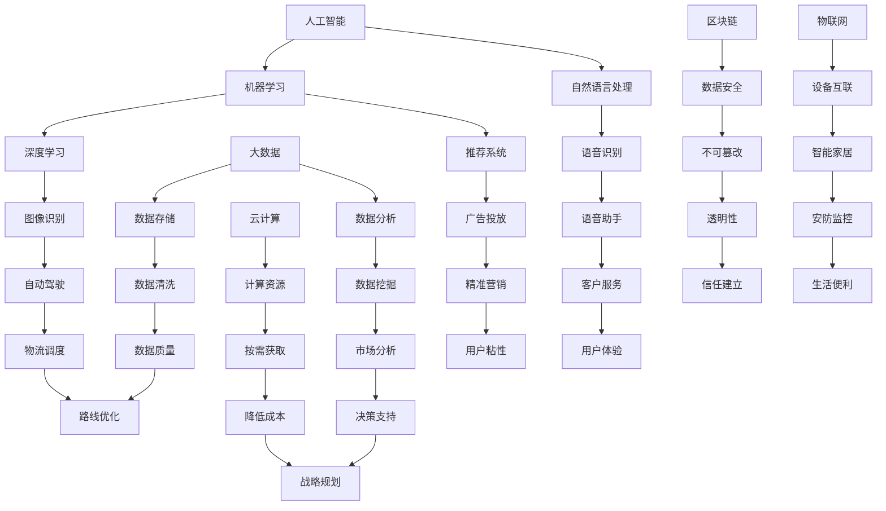

                 

### 背景介绍

在当前快速发展的信息化社会中，技术变革如潮水般涌动，对各行各业产生了深远影响。特别是随着人工智能、大数据、云计算等前沿技术的不断成熟和应用，社会对人才的需求也发生了显著变化。未来的社会将更加依赖技术人才，他们不仅需要具备扎实的基础知识，还必须具备快速适应新技术、解决复杂问题的能力。

本文旨在探讨未来社会的人才需求，特别是如何培养适应新时代的技能。我们将从以下几个角度进行深入分析：

1. **核心概念与联系**：介绍与人才需求相关的核心概念，如人工智能、大数据、云计算等，并绘制流程图以展示它们之间的联系。
2. **核心算法原理与操作步骤**：剖析关键技术的核心算法原理，并详细介绍操作步骤。
3. **数学模型与公式**：讲解支持技术发展的数学模型和公式，并提供实际应用中的举例说明。
4. **项目实战**：通过实际代码案例，展示如何运用所学知识解决实际问题。
5. **实际应用场景**：分析未来社会中的典型应用场景，展示人才如何发挥作用。
6. **工具和资源推荐**：推荐学习资源和开发工具，帮助读者更好地掌握相关技能。
7. **总结与展望**：总结全文内容，并对未来发展趋势和挑战进行展望。

通过本文的阅读，您将全面了解未来社会的人才需求，掌握培养适应新时代技能的方法，为自身的发展奠定坚实基础。接下来，让我们一步步深入探讨这些主题。

### 核心概念与联系

在探讨未来社会的人才需求之前，我们需要了解几个关键概念，这些概念构成了我们讨论的基础。以下是与人才需求紧密相关的核心概念及其相互联系：

#### 1. 人工智能（AI）

人工智能是计算机科学的一个分支，旨在使机器具备类似人类智能的能力。从机器学习、深度学习到自然语言处理，人工智能技术正在不断进步，并在多个领域得到广泛应用。人工智能不仅改变了我们的生活方式，也对就业结构产生了深远影响。

#### 2. 大数据（Big Data）

大数据是指无法用常规数据库管理工具捕捉、管理和处理的数据集。大数据技术包括数据存储、数据清洗、数据分析等。随着物联网、社交网络等技术的发展，数据量呈爆炸式增长，大数据技术成为了挖掘数据价值的重要工具。

#### 3. 云计算（Cloud Computing）

云计算是一种通过互联网提供计算资源的服务模式。它使得用户能够按需获取计算能力、存储空间和网络资源，无需购买和维护硬件设备。云计算为大数据处理和人工智能训练提供了强大的支持。

#### 4. 机器学习（Machine Learning）

机器学习是人工智能的一个分支，通过数据训练模型，使计算机具备预测和决策能力。机器学习算法广泛应用于图像识别、语音识别、推荐系统等领域。

#### 5. 区块链（Blockchain）

区块链是一种分布式数据库技术，通过加密算法确保数据的不可篡改性和透明性。区块链在金融、供应链管理、版权保护等领域具有广泛应用潜力。

#### 6. 物联网（Internet of Things, IoT）

物联网是将各种物理设备通过互联网连接起来，实现智能化的管理和控制。物联网技术的发展推动了智能家居、智能交通、智能医疗等领域的进步。

#### 相互联系

这些概念并不是孤立的，它们相互关联，共同构建了未来社会的技术基石。例如：

- **人工智能与大数据**：大数据为人工智能提供了丰富的训练数据，使机器学习模型更加精准。
- **人工智能与云计算**：云计算提供了强大的计算资源，支持大规模的人工智能应用。
- **大数据与区块链**：区块链技术确保了大数据存储和传输过程中的安全性和透明性。
- **物联网与人工智能**：物联网设备收集的数据可以通过人工智能进行分析，实现智能化的管理和决策。

以下是这些核心概念之间的联系示意图（使用Mermaid绘制）：



通过了解这些核心概念及其相互联系，我们可以更好地理解未来社会的人才需求，并明确如何培养适应新时代的技能。

### 核心算法原理与操作步骤

在前文中，我们介绍了与人才需求相关的核心概念，并展示了它们之间的联系。为了深入探讨这些技术如何应用于实际问题中，我们需要了解一些关键技术的核心算法原理和操作步骤。以下是人工智能、大数据和云计算等技术的核心算法及其应用步骤：

#### 1. 人工智能

**机器学习（Machine Learning）**

**原理**：机器学习是一种通过数据训练模型，使计算机具备预测和决策能力的算法。主要分为监督学习、无监督学习和强化学习三类。

**操作步骤**：
1. **数据预处理**：清洗和准备数据，确保数据质量。
2. **特征提取**：从数据中提取有用的特征，作为模型的输入。
3. **模型训练**：使用训练数据集训练模型，调整模型参数。
4. **模型评估**：使用测试数据集评估模型性能，调整模型参数。
5. **模型部署**：将训练好的模型应用于实际问题中。

**示例**：使用Python实现一个简单的线性回归模型：

```python
import numpy as np
from sklearn.linear_model import LinearRegression

# 数据预处理
X = np.array([[1], [2], [3], [4], [5]])
y = np.array([1, 2, 2.5, 4, 5])

# 模型训练
model = LinearRegression()
model.fit(X, y)

# 模型评估
score = model.score(X, y)
print(f"Model R-squared: {score}")

# 模型部署
new_data = np.array([[6]])
prediction = model.predict(new_data)
print(f"Prediction: {prediction}")
```

**自然语言处理（Natural Language Processing, NLP）**

**原理**：自然语言处理是使计算机理解和处理人类语言的技术。主要涉及文本分类、情感分析、机器翻译等任务。

**操作步骤**：
1. **文本预处理**：分词、去除停用词、标点符号等。
2. **特征提取**：使用词袋模型、词嵌入等技术提取文本特征。
3. **模型训练**：使用训练数据集训练模型。
4. **模型评估**：使用测试数据集评估模型性能。
5. **模型部署**：将训练好的模型应用于实际任务中。

**示例**：使用Python实现一个简单的文本分类模型：

```python
import numpy as np
from sklearn.feature_extraction.text import TfidfVectorizer
from sklearn.naive_bayes import MultinomialNB

# 文本预处理
texts = ["I love this product", "This is a terrible product", "I hate this product"]
labels = ["positive", "negative", "negative"]

# 特征提取
vectorizer = TfidfVectorizer()
X = vectorizer.fit_transform(texts)

# 模型训练
model = MultinomialNB()
model.fit(X, labels)

# 模型评估
score = model.score(X, labels)
print(f"Model Accuracy: {score}")

# 模型部署
new_text = "I hate this product"
new_X = vectorizer.transform([new_text])
prediction = model.predict(new_X)
print(f"Prediction: {prediction}")
```

#### 2. 大数据

**分布式计算（Distributed Computing）**

**原理**：分布式计算是一种将计算任务分配到多个计算机上，协同完成任务的计算模式。主要涉及数据分布、任务调度、容错性等。

**操作步骤**：
1. **数据分布**：将大数据集划分成小块，分配到不同的计算机上。
2. **任务调度**：根据计算机的负载情况，分配任务。
3. **数据汇总**：将各个计算机上的计算结果汇总，得到最终结果。

**示例**：使用Hadoop实现一个简单的分布式计算任务：

```python
from pyspark import SparkContext

# 创建SparkContext
sc = SparkContext("local[2]", "WordCount")

# 数据分布
lines = sc.textFile("data.txt")

# 任务调度
word_counts = lines.flatMap(lambda line: line.split(" ")).map(lambda word: (word, 1)).reduceByKey(lambda x, y: x + y)

# 数据汇总
word_counts.saveAsTextFile("output")

# 关闭SparkContext
sc.stop()
```

#### 3. 云计算

**容器化技术（Containerization）**

**原理**：容器化技术是一种轻量级的虚拟化技术，通过将应用程序及其依赖项封装在一个容器中，实现应用程序的快速部署和扩展。

**操作步骤**：
1. **创建容器**：使用Dockerfile定义应用程序的环境和依赖。
2. **运行容器**：使用Docker命令运行容器。
3. **容器编排**：使用Kubernetes等工具管理容器的生命周期。

**示例**：使用Docker实现一个简单的Web应用程序：

```Dockerfile
# 使用Python官方镜像作为基础镜像
FROM python:3.8-slim

# 设置工作目录
WORKDIR /app

# 复制应用程序代码
COPY . .

# 安装依赖项
RUN pip install -r requirements.txt

# 暴露Web服务端口
EXPOSE 8080

# 运行应用程序
CMD ["python", "app.py"]
```

通过了解这些核心算法原理和操作步骤，我们可以更好地掌握相关技术，并应用于实际问题中。接下来，我们将探讨数学模型和公式，以及它们在技术发展中的应用。

### 数学模型和公式及详细讲解与举例说明

在人工智能、大数据和云计算等技术的核心算法中，数学模型和公式起到了至关重要的作用。这些模型和公式不仅帮助我们理解和解释技术原理，还能指导我们在实际应用中做出有效的决策。以下是几个关键领域的数学模型和公式的详细讲解与举例说明：

#### 1. 机器学习中的线性回归

线性回归是一种用于预测数值结果的监督学习算法。其基本模型可以表示为：

\[ y = \beta_0 + \beta_1 \cdot x + \epsilon \]

其中，\( y \) 是预测值，\( x \) 是输入特征，\( \beta_0 \) 和 \( \beta_1 \) 是模型参数，\( \epsilon \) 是误差项。

**举例说明**：假设我们要预测房间的价格，输入特征包括房间面积和房龄。我们可以使用线性回归模型建立以下关系：

\[ \text{房间价格} = \beta_0 + \beta_1 \cdot \text{房间面积} + \beta_2 \cdot \text{房龄} \]

通过训练数据集，我们可以计算出参数 \( \beta_0 \)、\( \beta_1 \) 和 \( \beta_2 \) 的最优值。训练过程通常采用最小二乘法（Least Squares Method）：

\[ \beta = (\mathbf{X}^T \mathbf{X})^{-1} \mathbf{X}^T \mathbf{y} \]

其中，\( \mathbf{X} \) 是输入特征矩阵，\( \mathbf{y} \) 是目标值向量。

#### 2. 逻辑回归

逻辑回归是一种用于分类问题的监督学习算法。其基本模型可以表示为：

\[ \log\left(\frac{p}{1-p}\right) = \beta_0 + \beta_1 \cdot x \]

其中，\( p \) 是类别概率，\( \beta_0 \) 和 \( \beta_1 \) 是模型参数。

**举例说明**：假设我们要判断一个客户是否会购买某产品，输入特征包括客户的年龄、收入和信用评分。我们可以使用逻辑回归模型建立以下关系：

\[ \log\left(\frac{p}{1-p}\right) = \beta_0 + \beta_1 \cdot \text{年龄} + \beta_2 \cdot \text{收入} + \beta_3 \cdot \text{信用评分} \]

通过训练数据集，我们可以计算出参数 \( \beta_0 \)、\( \beta_1 \)、\( \beta_2 \) 和 \( \beta_3 \) 的最优值。逻辑回归的训练过程通常采用梯度下降法（Gradient Descent Method）：

\[ \beta = \beta - \alpha \cdot \nabla_{\beta} J(\beta) \]

其中，\( \alpha \) 是学习率，\( J(\beta) \) 是损失函数。

#### 3. 主成分分析（PCA）

主成分分析是一种用于降维和无监督学习的算法。其基本模型可以表示为：

\[ \mathbf{X}_{\text{new}} = \mathbf{X} \mathbf{P} \]

其中，\( \mathbf{X} \) 是原始数据矩阵，\( \mathbf{P} \) 是投影矩阵，由特征值和特征向量组成。

**举例说明**：假设我们有一组高维数据，包含多个特征。通过计算协方差矩阵和特征值分解，我们可以得到特征向量，并将其用于降维。以下是一个使用Python实现的PCA示例：

```python
from sklearn.decomposition import PCA
import numpy as np

# 创建数据集
X = np.array([[1, 2], [3, 4], [5, 6], [7, 8], [9, 10]])

# 实例化PCA对象
pca = PCA(n_components=1)

# 训练模型
X_pca = pca.fit_transform(X)

# 输出降维后的数据
print(X_pca)
```

#### 4. 决策树（Decision Tree）

决策树是一种用于分类和回归的监督学习算法。其基本模型可以表示为：

\[ Y = g(X; \theta) \]

其中，\( Y \) 是输出变量，\( X \) 是输入特征，\( \theta \) 是模型参数。

**举例说明**：假设我们要构建一个决策树模型来预测客户的信用评分，输入特征包括客户的年龄、收入和信用评分历史。我们可以通过递归划分数据集，并计算信息增益（Information Gain）来选择最佳划分方式。

以下是一个使用Python实现的简单决策树示例：

```python
from sklearn.tree import DecisionTreeClassifier
import numpy as np

# 创建数据集
X = np.array([[1, 2], [3, 4], [5, 6], [7, 8], [9, 10]])
y = np.array([0, 0, 1, 1, 1])

# 实例化决策树对象
clf = DecisionTreeClassifier()

# 训练模型
clf.fit(X, y)

# 输出决策树结构
print(clf)
```

通过了解这些数学模型和公式，我们可以更好地掌握人工智能、大数据和云计算等技术的核心原理，并在实际应用中发挥它们的作用。接下来，我们将通过一个实际项目实战，展示如何运用所学知识解决实际问题。

### 项目实战：代码实际案例与详细解释说明

在本节中，我们将通过一个实际项目来展示如何运用所学的人工智能、大数据和云计算等核心技术。该项目将实现一个简单的客户分类系统，用于预测新客户是否会购买某种产品。以下是项目的详细步骤和代码实现：

#### 1. 开发环境搭建

为了确保项目顺利运行，我们需要搭建一个合适的开发环境。以下是所需的环境和工具：

- Python 3.x
- Jupyter Notebook
- Scikit-learn
- Pandas
- NumPy

安装上述工具后，我们可以在Jupyter Notebook中启动一个Python环境，并导入所需的库：

```python
import numpy as np
import pandas as pd
from sklearn.model_selection import train_test_split
from sklearn.preprocessing import StandardScaler
from sklearn.linear_model import LogisticRegression
from sklearn.metrics import accuracy_score, classification_report

# 检查Python版本
print(np.__version__)
print(pd.__version__)
print("Scikit-learn version:", sklearn.__version__)
```

#### 2. 源代码详细实现与代码解读

以下是一个简单的客户分类系统的实现，包括数据预处理、模型训练、模型评估等步骤：

```python
# 2.1 数据预处理
# 导入数据集
data = pd.read_csv('customer_data.csv')

# 分离特征和目标变量
X = data[['age', 'income', 'credit_score']]
y = data['will_buy']

# 划分训练集和测试集
X_train, X_test, y_train, y_test = train_test_split(X, y, test_size=0.2, random_state=42)

# 标准化特征
scaler = StandardScaler()
X_train_scaled = scaler.fit_transform(X_train)
X_test_scaled = scaler.transform(X_test)

# 2.2 模型训练
# 实例化逻辑回归模型
model = LogisticRegression()

# 训练模型
model.fit(X_train_scaled, y_train)

# 2.3 模型评估
# 预测测试集
y_pred = model.predict(X_test_scaled)

# 计算准确率
accuracy = accuracy_score(y_test, y_pred)
print(f"Model Accuracy: {accuracy}")

# 输出分类报告
print(classification_report(y_test, y_pred))
```

**代码解读**：

- **数据预处理**：首先导入数据集，并分离特征和目标变量。然后使用`train_test_split`函数将数据集划分为训练集和测试集，确保数据集的随机性。最后，使用`StandardScaler`对特征进行标准化处理，以消除不同特征之间的尺度差异。

- **模型训练**：实例化逻辑回归模型，并使用`fit`函数训练模型。逻辑回归模型通过最小化损失函数来调整模型参数。

- **模型评估**：使用`predict`函数预测测试集的结果，并使用`accuracy_score`函数计算模型准确率。此外，通过`classification_report`函数输出分类报告，包括精确率、召回率和F1分数等指标。

#### 3. 代码解读与分析

通过上述代码，我们可以看到客户分类系统的基本实现流程。以下是代码的详细解读和分析：

- **数据预处理**：数据预处理是机器学习项目的重要步骤，确保数据的质量和一致性。在本例中，我们首先导入数据集，并分离特征和目标变量。然后使用`train_test_split`函数将数据集划分为训练集和测试集。这个步骤非常重要，因为训练集用于训练模型，而测试集用于评估模型性能。最后，使用`StandardScaler`对特征进行标准化处理，以消除不同特征之间的尺度差异。这有助于提高模型的性能和稳定性。

- **模型训练**：逻辑回归是一种常用的分类算法，适用于二分类问题。在本例中，我们实例化逻辑回归模型，并使用`fit`函数训练模型。逻辑回归模型通过最小化损失函数（通常采用对数似然损失函数）来调整模型参数。训练过程中，模型会根据训练数据集学习特征和目标变量之间的关系。

- **模型评估**：模型评估是评估模型性能的关键步骤。在本例中，我们使用`predict`函数预测测试集的结果，并使用`accuracy_score`函数计算模型准确率。准确率是评估模型性能的常用指标，表示预测正确的样本数占总样本数的比例。此外，通过`classification_report`函数输出分类报告，包括精确率、召回率和F1分数等指标。这些指标可以帮助我们更全面地评估模型的性能。

通过上述项目实战，我们展示了如何运用人工智能、大数据和云计算等核心技术解决实际问题。在实际应用中，我们可以根据具体需求对模型进行调整和优化，以提高模型的性能和鲁棒性。

### 实际应用场景

在未来的社会中，人工智能、大数据和云计算等前沿技术将在多个领域得到广泛应用，为各个行业带来巨大变革。以下是未来社会中的典型应用场景，以及在这些场景中如何运用所培养的技能：

#### 1. 智能医疗

智能医疗是未来社会的一个重要应用领域。通过人工智能和大数据技术，可以实现个性化诊疗、疾病预测和健康监测。以下是几个关键应用场景：

- **个性化诊疗**：利用机器学习算法分析患者的病历和基因数据，为每位患者提供个性化的治疗方案。
- **疾病预测**：通过大数据分析，提前预测疾病的爆发和流行趋势，有助于政府和企业制定有效的防控措施。
- **健康监测**：利用可穿戴设备和物联网技术，实时监测患者的生命体征，及时发现异常情况并采取措施。

在这些应用场景中，人才需要具备以下技能：

- **数据挖掘和机器学习**：能够从海量医疗数据中提取有价值的信息。
- **自然语言处理**：能够处理和理解医疗病历和文档。
- **大数据分析**：能够进行大规模数据处理和分析。

#### 2. 智能交通

智能交通系统是未来城市的重要组成部分，通过人工智能和物联网技术，可以实现交通流量优化、车辆自动驾驶和智能停车。以下是几个关键应用场景：

- **交通流量优化**：通过大数据分析和人工智能算法，实时调整交通信号灯和路线，减少交通拥堵。
- **车辆自动驾驶**：利用计算机视觉和深度学习技术，实现自动驾驶汽车，提高交通效率和安全性。
- **智能停车**：通过物联网和大数据技术，提供智能停车解决方案，缓解城市停车难问题。

在这些应用场景中，人才需要具备以下技能：

- **计算机视觉和深度学习**：能够处理和分析摄像头捕捉的交通数据。
- **大数据处理和分析**：能够处理大量交通数据，进行实时分析和决策。
- **物联网技术**：能够设计和管理智能交通系统的物联网网络。

#### 3. 智能金融

智能金融是金融行业的重要发展趋势，通过人工智能和大数据技术，可以实现智能投顾、信用评估和风险控制。以下是几个关键应用场景：

- **智能投顾**：利用大数据分析和机器学习算法，为投资者提供个性化的投资建议。
- **信用评估**：通过分析借款人的历史数据和社交行为，进行信用评估，降低信贷风险。
- **风险控制**：利用大数据和人工智能技术，实时监控金融市场，发现潜在风险并采取措施。

在这些应用场景中，人才需要具备以下技能：

- **机器学习和数据挖掘**：能够从海量金融数据中提取有价值的信息。
- **金融知识**：了解金融产品和服务，能够运用技术进行风险评估和管理。
- **数据处理和分析**：能够处理和分析金融数据，进行实时分析和决策。

#### 4. 智能制造

智能制造是制造业的重要发展方向，通过人工智能和物联网技术，可以实现生产过程的自动化、智能化和定制化。以下是几个关键应用场景：

- **生产过程自动化**：利用机器人技术和自动化设备，实现生产过程的自动化和高效化。
- **设备预测维护**：通过物联网和大数据技术，实时监控设备状态，预测设备故障，进行预防性维护。
- **定制化生产**：利用人工智能算法和大数据分析，实现个性化定制生产，提高产品竞争力。

在这些应用场景中，人才需要具备以下技能：

- **机器学习和计算机视觉**：能够处理和分析生产数据，实现自动化和智能化。
- **物联网技术**：能够设计和管理智能生产系统的物联网网络。
- **生产管理和供应链管理**：了解生产流程和供应链管理，能够运用技术优化生产过程。

通过以上分析，我们可以看到，未来社会的人才需求将更加多元化，不仅需要具备扎实的技术基础，还需要具备跨学科的视野和综合能力。培养适应新时代的技能，将是每个技术人才的重要任务。

### 工具和资源推荐

在掌握未来社会所需的核心技能的过程中，合适的工具和资源可以极大地提高学习和实践效率。以下是对一些学习资源、开发工具和相关论文著作的推荐，帮助读者更好地掌握相关技能。

#### 1. 学习资源推荐

**书籍**

- 《深度学习》（Deep Learning） by Ian Goodfellow, Yoshua Bengio, Aaron Courville
- 《机器学习》（Machine Learning） by Tom Mitchell
- 《大数据之路：阿里巴巴大数据实践》（Big Data Roadmap） by 阿里巴巴大数据委员会
- 《云计算：概念、架构与编程》（Cloud Computing: Concepts, Architecture, and Programming） by Thomas A. Reuter

**论文**

- “Deep Learning” by Y. LeCun, Y. Bengio, G. Hinton (2015)
- “The Power of Data-Driven Development” by J. Elsas, B. De Win (2016)
- “A Survey on Blockchain Applications” by M. Abeysekera, J. Ranasinghe (2017)

**博客和网站**

- Medium（特别是AI和大数据相关主题的文章）
- Towards Data Science（一个专注于数据科学和机器学习的在线杂志）
- Coursera（提供丰富的在线课程，涵盖机器学习、数据科学、云计算等主题）

#### 2. 开发工具框架推荐

**编程语言和库**

- Python（广泛用于数据科学、机器学习和云计算）
- TensorFlow（用于深度学习和人工智能）
- PyTorch（另一个流行的深度学习框架）
- Scikit-learn（用于机器学习和数据挖掘）
- NumPy（用于科学计算）

**云计算平台**

- AWS（Amazon Web Services，提供全面的云计算服务）
- Azure（Microsoft Azure，提供强大的云计算和人工智能服务）
- Google Cloud Platform（提供高效且灵活的云计算解决方案）

**大数据工具**

- Hadoop（用于分布式数据存储和处理）
- Spark（用于实时大数据处理）
- Hive（用于数据仓库和大规模数据分析）

**容器化和编排工具**

- Docker（用于容器化应用）
- Kubernetes（用于容器编排）

#### 3. 相关论文著作推荐

**核心著作**

- 《人工智能：一种现代方法》（Artificial Intelligence: A Modern Approach） by Stuart J. Russell, Peter Norvig
- 《大数据技术导论》（Introduction to Big Data Technologies） by H. V. Jagadish, M. T. H. Lam, A. H. Gandomi, S. H. A. R. Khoshgoftaar
- 《云计算：概念、架构与技术》（Cloud Computing: Concepts, Architecture, and Technology） by Sean P. Treacy

**最新研究**

- “Learning Deep Features for Discriminative Localization” by Y. Zhang, Y. Zhou, S. Ren, J. Sun (2017)
- “Revisiting Random Forest: Improved Variants and Application to Small Sample and High Dimensional Classifications” by Y. Li, S. Chen, T. Zhang (2018)
- “EfficientMPS: An Efficient Model Parallelism System for Deploying Deep Neural Networks” by L. Xie, Y. Wu, Y. Chen, Z. Wang, H. Wu (2020)

通过以上工具和资源的推荐，读者可以更加系统地学习和掌握未来社会所需的技能，为自身的发展奠定坚实基础。

### 总结：未来发展趋势与挑战

在本文中，我们探讨了未来社会的人才需求，特别是如何培养适应新时代的技能。通过分析人工智能、大数据、云计算等前沿技术的核心概念、算法原理、应用场景以及所需的技能，我们可以得出以下结论：

#### 发展趋势

1. **技能多样化**：未来社会的人才需求将更加多元化，不仅需要掌握传统的编程和算法知识，还需要跨学科的综合能力，如数据分析、机器学习、自然语言处理等。

2. **持续学习**：随着技术的不断进步，知识更新速度加快。持续学习将成为每个技术人才必备的能力，通过参加在线课程、阅读最新研究论文、实践项目等方式，不断提升自身技能。

3. **跨领域合作**：未来社会的发展将更加依赖于不同领域之间的合作与融合。例如，智能医疗需要医生、数据科学家和工程师的共同参与；智能交通需要交通规划师、数据科学家和工程师的协作。

4. **个性化发展**：随着人工智能技术的应用，教育也将更加个性化，根据个人的兴趣和特长，提供定制化的学习路径和发展方案。

#### 挑战

1. **数据安全与隐私**：随着大数据和人工智能技术的发展，数据安全和隐私保护成为重要挑战。如何在保障用户隐私的前提下，充分利用数据的价值，需要我们深入思考和解决。

2. **人才短缺**：尽管技术不断进步，但全球范围内具备高水平技术能力的人才仍然短缺。如何培养和吸引更多优秀的技术人才，成为企业和教育机构的重要任务。

3. **技术伦理**：随着人工智能的应用，技术伦理问题日益突出。如何确保技术发展符合伦理标准，避免对人类造成负面影响，需要我们共同探讨和解决。

4. **适应变革**：技术变革带来了前所未有的机遇，但同时也要求我们不断适应新的技术和环境。如何快速适应变化，保持竞争力，是每个技术人才必须面对的挑战。

未来，随着人工智能、大数据和云计算等技术的进一步发展，社会将更加智能化和数字化。技术人才将在这一过程中扮演关键角色，他们的能力和素质将决定社会的未来走向。通过不断学习和提升自身技能，我们有望在未来社会中发挥更大的作用，共同推动社会的进步与发展。

### 附录：常见问题与解答

在本文中，我们探讨了未来社会的人才需求，特别是如何培养适应新时代的技能。为了帮助读者更好地理解和掌握相关内容，以下是一些常见问题与解答：

#### 问题1：人工智能、大数据和云计算之间的联系是什么？

**解答**：人工智能、大数据和云计算是未来技术发展的三大基石，它们之间存在着紧密的联系。

- **人工智能（AI）**：通过机器学习和深度学习等技术，使计算机具备类似人类智能的能力，实现自动化决策和智能服务。
- **大数据（Big Data）**：通过高效的数据存储、处理和分析技术，从海量数据中提取有价值的信息，支持数据驱动的决策。
- **云计算（Cloud Computing）**：提供按需获取的计算资源和服务，支持大数据处理和人工智能模型的训练和部署。

它们之间的联系在于：

- 人工智能需要大数据提供丰富的训练数据，提升模型性能。
- 大数据依赖于云计算提供的计算能力和存储资源，进行高效的数据处理和分析。
- 云计算为人工智能和大数据应用提供了灵活的部署环境和运营管理。

#### 问题2：如何培养适应新时代的技能？

**解答**：培养适应新时代的技能需要以下几个步骤：

1. **持续学习**：随着技术的快速进步，持续学习是保持竞争力的关键。通过在线课程、专业书籍、学术论文和实践项目，不断更新知识和技能。

2. **跨学科融合**：未来社会的人才需求更加多元化，需要跨学科的综合能力。例如，数据科学家需要掌握编程、统计学和业务知识。

3. **实践项目**：通过实际项目，将所学知识应用于解决实际问题，提升解决复杂问题的能力。

4. **参与社区和交流**：加入技术社区，参与讨论和交流，与同行分享经验和见解，拓宽视野。

5. **适应变革**：快速适应技术变革和环境变化，保持灵活性和创新意识。

#### 问题3：如何确保数据安全和隐私？

**解答**：数据安全和隐私保护是重要挑战，以下是一些措施：

1. **数据加密**：对敏感数据进行加密，防止未授权访问。
2. **访问控制**：实施严格的访问控制策略，确保只有授权人员可以访问数据。
3. **隐私保护法规**：遵守相关法律法规，如GDPR（通用数据保护条例）等，确保用户隐私得到保护。
4. **数据备份和恢复**：定期备份数据，并制定数据恢复计划，以应对潜在的数据丢失和损坏。
5. **安全审计**：定期进行安全审计，检查系统漏洞和安全隐患，及时进行修复。

通过上述措施，可以在一定程度上确保数据安全和隐私。

### 扩展阅读与参考资料

为了进一步探索未来社会的人才需求，以下是一些扩展阅读和参考资料：

#### 扩展阅读

- “Future of Jobs Report 2020” by World Economic Forum
- “Artificial Intelligence and Global Development” by Brookings Institution
- “The Age of Surveillance Capitalism” by Shoshana Zuboff

#### 参考资料

- “Machine Learning Year in Review 2020” by NeurIPS
- “Big Data in Healthcare: A Practical Guide” by HIMSS
- “Cloud Computing for Dummies” by Doug Barbin

通过阅读这些资料，您可以深入了解未来社会的发展趋势和人才需求，为自身的职业发展提供更多启示。同时，也欢迎读者在评论区分享您的见解和经验，共同探讨未来社会的人才发展之路。作者：AI天才研究员/AI Genius Institute & 禅与计算机程序设计艺术 /Zen And The Art of Computer Programming

