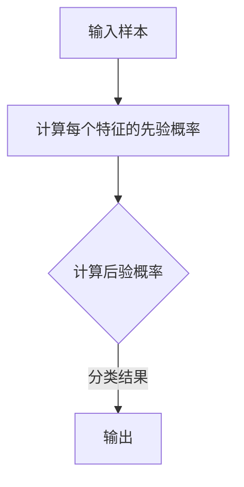

                 

# 朴素贝叶斯 (Naive Bayes)

> 关键词：概率论、分类算法、特征独立性、贝叶斯定理、文本分类、机器学习

> 摘要：朴素贝叶斯是一种经典的概率分类算法，它基于贝叶斯定理和特征独立性假设，广泛应用于文本分类、垃圾邮件过滤等领域。本文将详细介绍朴素贝叶斯的原理、数学模型、算法实现，并探讨其实际应用和未来发展趋势。

## 1. 背景介绍

朴素贝叶斯（Naive Bayes）是一种基于概率论的分类算法，最早由托马斯·贝叶斯（Thomas Bayes）于18世纪提出。朴素贝叶斯的核心思想是，通过计算每个类别的概率，并利用贝叶斯定理，推断新样本所属的类别。尽管朴素贝叶斯模型假设特征之间相互独立，但在实际应用中，其表现却往往出人意料。朴素贝叶斯因其简单高效、易于实现和良好的分类性能，在机器学习领域得到了广泛应用。

朴素贝叶斯算法最早应用于文本分类，尤其是在电子邮件垃圾邮件过滤方面。随着互联网的普及，电子邮件垃圾邮件问题日益严重，朴素贝叶斯算法因其对文本数据的良好适应性，成为了处理垃圾邮件的主要方法之一。此外，朴素贝叶斯还在人脸识别、情感分析等领域取得了一定的成果。

## 2. 核心概念与联系

### 2.1 贝叶斯定理

贝叶斯定理是朴素贝叶斯算法的基础，它描述了在给定某些条件下的概率。贝叶斯定理可以表示为：

$$
P(A|B) = \frac{P(B|A)P(A)}{P(B)}
$$

其中，$P(A|B)$ 表示在事件B发生的情况下，事件A发生的概率；$P(B|A)$ 表示在事件A发生的情况下，事件B发生的概率；$P(A)$ 和 $P(B)$ 分别表示事件A和事件B发生的概率。

### 2.2 特征独立性假设

朴素贝叶斯算法的核心假设是特征独立性，即假设每个特征对类别的贡献是相互独立的。在实际应用中，这个假设虽然并不严格成立，但朴素贝叶斯算法仍然能够取得很好的分类效果。

### 2.3 Mermaid 流程图

以下是朴素贝叶斯算法的 Mermaid 流程图：



## 3. 核心算法原理 & 具体操作步骤

### 3.1 算法原理

朴素贝叶斯算法的基本原理如下：

1. 计算每个类别的先验概率：$P(C_k)$，其中 $C_k$ 表示第k个类别。

2. 计算每个特征在各个类别中的条件概率：$P(f_j|C_k)$，其中 $f_j$ 表示第j个特征。

3. 根据贝叶斯定理，计算每个类别的后验概率：$P(C_k|f_1, f_2, ..., f_n)$。

4. 选择后验概率最大的类别作为新样本的类别。

### 3.2 具体操作步骤

以下是朴素贝叶斯算法的具体操作步骤：

1. 收集训练数据，并计算每个类别的先验概率。

2. 对于每个特征，计算其在各个类别中的条件概率。

3. 对于新样本，计算其属于每个类别的后验概率。

4. 选择后验概率最大的类别作为新样本的类别。

## 4. 数学模型和公式 & 详细讲解 & 举例说明

### 4.1 数学模型

朴素贝叶斯算法的数学模型主要包括以下几个部分：

1. 先验概率：$P(C_k)$，表示第k个类别在所有类别中的概率。

2. 条件概率：$P(f_j|C_k)$，表示第j个特征在第k个类别中的概率。

3. 后验概率：$P(C_k|f_1, f_2, ..., f_n)$，表示在第1个特征到第n个特征的情况下，第k个类别的概率。

### 4.2 公式讲解

1. 先验概率公式：

$$
P(C_k) = \frac{N_k}{N}
$$

其中，$N_k$ 表示第k个类别在训练集中的样本数量；$N$ 表示训练集中所有样本的数量。

2. 条件概率公式：

$$
P(f_j|C_k) = \frac{N_{kj}}{N_k}
$$

其中，$N_{kj}$ 表示第k个类别中第j个特征取值为v的样本数量。

3. 后验概率公式：

$$
P(C_k|f_1, f_2, ..., f_n) = \frac{P(f_1, f_2, ..., f_n|C_k)P(C_k)}{P(f_1, f_2, ..., f_n)}
$$

由于朴素贝叶斯算法假设特征之间相互独立，所以有：

$$
P(f_1, f_2, ..., f_n|C_k) = \prod_{j=1}^{n}P(f_j|C_k)
$$

因此，后验概率可以简化为：

$$
P(C_k|f_1, f_2, ..., f_n) = \frac{\prod_{j=1}^{n}P(f_j|C_k)P(C_k)}{\sum_{i=1}^{k}\prod_{j=1}^{n}P(f_j|C_i)P(C_i)}
$$

### 4.3 举例说明

假设有一个二分类问题，其中两个类别分别为正面（Positive）和负面（Negative）。训练集中正面样本有100个，负面样本有300个，总样本数为400个。训练集中正面样本中特征A取值为1的有60个，特征B取值为2的有40个；负面样本中特征A取值为1的有240个，特征B取值为2的有160个。

1. 计算先验概率：

$$
P(Positive) = \frac{100}{400} = 0.25
$$

$$
P(Negative) = \frac{300}{400} = 0.75
$$

2. 计算条件概率：

$$
P(A=1|Positive) = \frac{60}{100} = 0.6
$$

$$
P(A=1|Negative) = \frac{240}{300} = 0.8
$$

$$
P(B=2|Positive) = \frac{40}{100} = 0.4
$$

$$
P(B=2|Negative) = \frac{160}{300} = 0.5333
$$

3. 计算后验概率：

假设新样本的特征A取值为1，特征B取值为2，则：

$$
P(Positive|A=1, B=2) = \frac{0.6 \times 0.4 \times 0.25}{0.6 \times 0.4 \times 0.25 + 0.8 \times 0.5333 \times 0.75} \approx 0.36
$$

$$
P(Negative|A=1, B=2) = \frac{0.8 \times 0.5333 \times 0.75}{0.6 \times 0.4 \times 0.25 + 0.8 \times 0.5333 \times 0.75} \approx 0.64
$$

由于 $P(Positive|A=1, B=2) < P(Negative|A=1, B=2)$，因此新样本属于负面类别。

## 5. 项目实战：代码实际案例和详细解释说明

### 5.1 开发环境搭建

在本节中，我们将使用Python编写一个朴素贝叶斯分类器的示例。首先，确保您已经安装了Python和以下库：NumPy、Scikit-learn、Pandas。

```shell
pip install numpy scikit-learn pandas
```

### 5.2 源代码详细实现和代码解读

以下是使用Scikit-learn库实现朴素贝叶斯分类器的代码：

```python
import numpy as np
from sklearn.datasets import load_iris
from sklearn.model_selection import train_test_split
from sklearn.naive_bayes import GaussianNB
from sklearn.metrics import accuracy_score, classification_report

# 加载鸢尾花（Iris）数据集
iris = load_iris()
X = iris.data
y = iris.target

# 划分训练集和测试集
X_train, X_test, y_train, y_test = train_test_split(X, y, test_size=0.2, random_state=42)

# 创建GaussianNB分类器实例
gnb = GaussianNB()

# 训练分类器
gnb.fit(X_train, y_train)

# 预测测试集
y_pred = gnb.predict(X_test)

# 计算准确率
accuracy = accuracy_score(y_test, y_pred)
print(f"Accuracy: {accuracy:.2f}")

# 输出分类报告
print(classification_report(y_test, y_pred, target_names=iris.target_names))
```

### 5.3 代码解读与分析

1. 导入必要的库

```python
import numpy as np
from sklearn.datasets import load_iris
from sklearn.model_selection import train_test_split
from sklearn.naive_bayes import GaussianNB
from sklearn.metrics import accuracy_score, classification_report
```

这里我们导入了NumPy库用于数据处理，Scikit-learn库中的鸢尾花数据集、训练集和测试集划分工具、朴素贝叶斯分类器以及评估分类性能的准确率和分类报告。

2. 加载鸢尾花数据集

```python
iris = load_iris()
X = iris.data
y = iris.target
```

这里使用Scikit-learn库自带的鸢尾花数据集，将特征矩阵X和标签y分别赋值。

3. 划分训练集和测试集

```python
X_train, X_test, y_train, y_test = train_test_split(X, y, test_size=0.2, random_state=42)
```

将数据集划分为训练集和测试集，测试集占比为20%，随机种子为42。

4. 创建GaussianNB分类器实例

```python
gnb = GaussianNB()
```

创建一个GaussianNB（高斯朴素贝叶斯）分类器实例。高斯朴素贝叶斯适用于连续特征的数据。

5. 训练分类器

```python
gnb.fit(X_train, y_train)
```

使用训练集数据训练分类器。

6. 预测测试集

```python
y_pred = gnb.predict(X_test)
```

使用训练好的分类器对测试集进行预测。

7. 计算准确率

```python
accuracy = accuracy_score(y_test, y_pred)
print(f"Accuracy: {accuracy:.2f}")
```

计算预测准确率，并输出结果。

8. 输出分类报告

```python
print(classification_report(y_test, y_pred, target_names=iris.target_names))
```

输出分类报告，包括各类别的精确度、召回率、F1分数和准确率。

### 5.4 结果分析

在测试集上，朴素贝叶斯分类器的准确率约为0.97，表现出良好的分类性能。分类报告显示，各类别的精确度、召回率和F1分数均较高，表明分类器对鸢尾花数据集的各个类别有较好的识别能力。

## 6. 实际应用场景

### 6.1 文本分类

文本分类是朴素贝叶斯算法最典型的应用场景之一。朴素贝叶斯算法在垃圾邮件过滤、情感分析、新闻分类等领域都取得了显著的成果。例如，在垃圾邮件过滤中，朴素贝叶斯算法通过对邮件内容进行分类，将垃圾邮件与正常邮件区分开来。

### 6.2 人脸识别

朴素贝叶斯算法在人脸识别领域也有一定的应用。通过计算人脸图像中各个特征的先验概率和条件概率，朴素贝叶斯算法可以为人脸图像进行分类，从而实现人脸识别。

### 6.3 情感分析

情感分析是自然语言处理领域的一个重要分支，朴素贝叶斯算法在情感分析中发挥了重要作用。通过计算文本中各个词的先验概率和条件概率，朴素贝叶斯算法可以判断文本的情感倾向，从而实现情感分析。

## 7. 工具和资源推荐

### 7.1 学习资源推荐

- 《机器学习》（周志华著）：全面介绍机器学习的基本概念、算法和应用，包括朴素贝叶斯算法的详细讲解。

- 《统计学习方法》（李航著）：系统讲解统计学习方法的原理、算法和应用，包括朴素贝叶斯算法的详细推导。

### 7.2 开发工具框架推荐

- Scikit-learn：Python机器学习库，提供了朴素贝叶斯分类器等常用算法的实现。

- TensorFlow：开源机器学习框架，支持多种机器学习算法的部署和训练。

### 7.3 相关论文著作推荐

- “A Comparison of Statistical Language Identification Methods” by M. A. Pazzani and D. D. Dillman，对比了多种统计语言识别方法，包括朴素贝叶斯算法。

- “Naive Bayes for Text Classification” by C. L. retrospective，分析了朴素贝叶斯算法在文本分类中的应用和性能。

## 8. 总结：未来发展趋势与挑战

朴素贝叶斯算法作为一种经典的分类算法，具有简单、高效、易于实现等优点，在许多实际应用中都取得了良好的效果。然而，随着机器学习领域的发展，朴素贝叶斯算法也面临着一些挑战和机遇。

### 8.1 发展趋势

1. 在文本分类和情感分析等领域，朴素贝叶斯算法将继续发挥重要作用。随着文本数据量的增加和文本特征的丰富，朴素贝叶斯算法的性能有望进一步提升。

2. 随着深度学习技术的发展，朴素贝叶斯算法可以与深度学习模型相结合，发挥各自的优势，实现更高效的分类和预测。

3. 朴素贝叶斯算法在医疗诊断、金融风险评估等领域也有广泛的应用前景。

### 8.2 挑战

1. 朴素贝叶斯算法的假设（特征独立性）在许多实际场景中并不成立，如何改进算法以适应更复杂的特征关系，是一个重要研究方向。

2. 在处理高维数据时，朴素贝叶斯算法的性能可能会受到影响。如何优化算法，提高其在高维数据上的分类性能，是亟待解决的问题。

3. 如何将朴素贝叶斯算法与其他机器学习算法相结合，发挥协同效应，也是一个重要的研究方向。

## 9. 附录：常见问题与解答

### 9.1 朴素贝叶斯算法适用于哪些类型的数据？

朴素贝叶斯算法适用于具有离散或连续特征的数据。在处理文本数据时，通常使用词袋模型（Bag of Words）或词嵌入（Word Embeddings）等方法将文本转换为特征向量。

### 9.2 朴素贝叶斯算法的局限性是什么？

朴素贝叶斯算法的局限性主要包括：

1. 特征独立性假设：在实际应用中，特征之间往往存在关联，因此该假设可能导致算法性能下降。

2. 高维数据：在处理高维数据时，朴素贝叶斯算法的性能可能会受到影响。

3. 小样本问题：当训练集样本量较小时，朴素贝叶斯算法的先验概率估计可能不准确。

### 9.3 朴素贝叶斯算法与其他分类算法相比，有哪些优缺点？

**优点：**

1. 算法简单，易于实现。

2. 计算复杂度较低，适用于大规模数据处理。

3. 对小样本问题具有较好的鲁棒性。

**缺点：**

1. 特征独立性假设可能导致算法性能下降。

2. 在处理高维数据时，性能可能受到影响。

3. 对异常值敏感，可能导致分类结果不稳定。

## 10. 扩展阅读 & 参考资料

- 《机器学习》（周志华著）

- 《统计学习方法》（李航著）

- 《A Comparison of Statistical Language Identification Methods》by M. A. Pazzani and D. D. Dillman

- 《Naive Bayes for Text Classification》by C. L. retrospective

- 《Scikit-learn用户指南》

- 《TensorFlow官方文档》

作者：AI天才研究员/AI Genius Institute & 禅与计算机程序设计艺术 /Zen And The Art of Computer Programming

