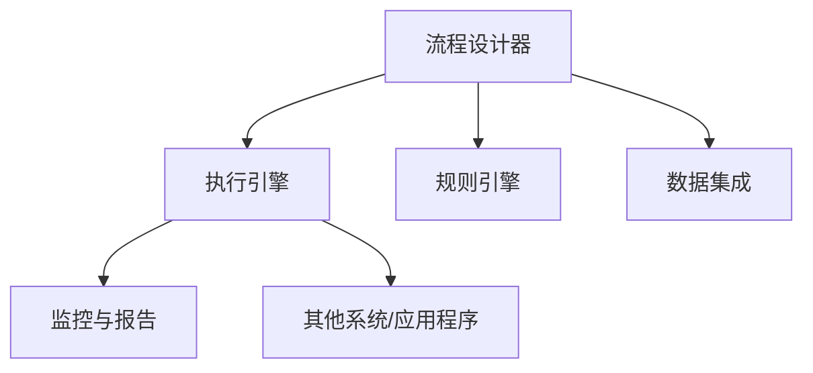

                 

### 文章标题：机器人流程自动化（RPA）：提升企业效率的新选择

#### 关键词：（机器人流程自动化，RPA，企业效率，流程优化，人工智能）

#### 摘要：

本文将深入探讨机器人流程自动化（RPA）的概念、原理及其在企业中的应用。通过对RPA技术的详细介绍，我们将分析其在提升企业效率和流程优化方面的实际效果，并提供一系列实际应用案例和未来发展趋势。文章旨在帮助读者全面了解RPA技术，以及如何将其应用于实际业务场景，从而为企业带来显著的价值提升。

### 1. 背景介绍

#### RPA的起源与发展

机器人流程自动化（RPA，Robotic Process Automation）是一种通过软件机器人模拟和集成人类与计算机之间的交互操作，自动化执行重复性、规则性业务流程的技术。RPA的起源可以追溯到20世纪80年代，当时企业开始使用自动化工具来减少重复性劳动。然而，由于技术的限制，早期的自动化尝试并未能大规模普及。

随着信息技术和人工智能的快速发展，RPA在近几年逐渐崭露头角。尤其在新冠疫情的背景下，远程办公和数字化转型需求促使企业加速对自动化技术的采纳。RPA的兴起不仅为企业提供了灵活、高效、可扩展的自动化解决方案，还推动了整个流程自动化市场的发展。

#### RPA的重要性

RPA技术在现代企业中具有重要地位。首先，它能够显著提高业务效率，减少人为错误，降低运营成本。通过自动化重复性任务，企业可以将员工从繁琐的劳动中解放出来，专注于更具创造性和价值的工作。其次，RPA有助于实现流程优化，通过数据分析和流程再造，帮助企业找到更高效的工作方式。

此外，RPA还为企业提供了更好的客户体验。自动化客服和销售流程能够快速响应客户需求，提高服务质量和客户满意度。随着人工智能技术的融合，RPA将进一步提升自动化程度和智能水平，为企业带来更多的创新机会。

### 2. 核心概念与联系

#### RPA的基本概念

机器人流程自动化（RPA）是一种使用软件机器人模拟人类与计算机系统之间的交互操作，自动化执行重复性、规则性业务流程的技术。RPA的核心概念包括：

1. **软件机器人**：软件机器人是一种模拟人类操作的软件程序，能够通过界面自动化执行各种任务，如数据录入、表单处理、报告生成等。
2. **流程自动化**：流程自动化是指使用软件机器人自动化执行业务流程中的各个步骤，从而实现整个流程的自动化。
3. **规则引擎**：规则引擎是一种用于定义业务规则和逻辑的组件，能够根据预设规则自动执行特定操作。

#### RPA与人工智能的联系

RPA与人工智能（AI）有着紧密的联系。虽然RPA主要关注流程的自动化和规则性任务，但人工智能技术的引入，使得RPA能够处理更复杂、非结构化的任务。具体来说，人工智能技术可以帮助RPA实现以下功能：

1. **自然语言处理**：通过自然语言处理（NLP）技术，RPA能够理解和处理人类语言，实现与用户的自然交互。
2. **图像识别**：利用计算机视觉技术，RPA可以自动识别和处理图像信息，如身份验证、文档识别等。
3. **机器学习**：通过机器学习算法，RPA能够从数据中学习，优化和改进业务流程，提高自动化程度和智能水平。

#### RPA技术的架构

RPA技术通常包括以下核心组件：

1. **流程设计器**：用于设计、开发和部署自动化流程的工具。流程设计器提供了图形化的界面，使得非技术人员也能轻松创建和部署自动化流程。
2. **执行引擎**：用于执行自动化流程的组件，通常以软件机器人的形式运行。执行引擎负责解析流程设计，并根据规则引擎的指示执行相应的操作。
3. **规则引擎**：用于定义和管理业务规则的组件，能够根据预设规则自动执行特定操作。规则引擎是RPA技术的核心，负责确保自动化流程的正确性和一致性。
4. **数据集成**：用于集成不同系统和应用程序的组件，使得RPA能够与其他系统进行数据交换和协同工作。
5. **监控与报告**：用于监控自动化流程的运行状态，并提供详细的报告和分析数据的组件。监控与报告组件有助于企业实时了解自动化流程的执行情况，及时发现问题并进行优化。

#### Mermaid 流程图（RPA架构）



### 3. 核心算法原理 & 具体操作步骤

#### RPA的核心算法原理

RPA的核心算法原理主要包括以下几个方面：

1. **界面自动化**：通过模拟用户操作，如点击、输入、拖拽等，实现与计算机系统的交互。界面自动化通常使用图形用户界面（GUI）自动化工具，如AutoIt、SikuliX等。
2. **流程控制**：通过定义流程中的各个步骤和逻辑关系，实现自动化流程的控制。流程控制通常使用流程控制语言，如BPEL、Java等。
3. **数据操作**：通过读取、写入、转换等操作，实现对数据的处理。数据操作通常使用数据库操作语言，如SQL、NoSQL等。
4. **异常处理**：通过定义异常处理逻辑，确保自动化流程的鲁棒性和可靠性。异常处理通常包括日志记录、错误通知、恢复操作等。

#### RPA的具体操作步骤

1. **需求分析**：首先，分析业务流程中的重复性、规则性任务，确定自动化目标和需求。
2. **流程设计**：使用流程设计器，根据需求分析结果，设计自动化流程的各个步骤和逻辑关系。
3. **脚本编写**：使用流程控制语言和界面自动化工具，编写自动化脚本，实现自动化流程的具体操作。
4. **调试与优化**：运行自动化脚本，进行调试和优化，确保自动化流程的稳定性和高效性。
5. **部署与监控**：将自动化流程部署到执行引擎，进行监控和报告，确保自动化流程的正常运行。

### 4. 数学模型和公式 & 详细讲解 & 举例说明

#### RPA的数学模型和公式

RPA中的数学模型和公式主要用于优化自动化流程的性能和效率。以下是一些常见的数学模型和公式：

1. **时间优化模型**：通过计算任务执行时间，优化自动化流程的执行顺序和资源分配。
   $$T = \sum_{i=1}^{n} t_i$$
   其中，$T$表示总执行时间，$t_i$表示第$i$个任务的执行时间。

2. **成本优化模型**：通过计算自动化流程的成本，优化资源的使用和成本分配。
   $$C = \sum_{i=1}^{n} c_i$$
   其中，$C$表示总成本，$c_i$表示第$i$个任务的成本。

3. **错误率模型**：通过计算自动化流程的错误率，评估自动化流程的可靠性和稳定性。
   $$E = \frac{F}{N}$$
   其中，$E$表示错误率，$F$表示错误次数，$N$表示总执行次数。

#### 详细讲解与举例说明

#### 时间优化模型

时间优化模型主要用于优化自动化流程的执行时间。以下是一个具体的例子：

假设有一个自动化流程，包括以下三个任务：

1. 任务1：数据录入，执行时间为2分钟。
2. 任务2：数据验证，执行时间为3分钟。
3. 任务3：数据输出，执行时间为1分钟。

使用时间优化模型，我们可以计算总执行时间：

$$T = t_1 + t_2 + t_3 = 2 + 3 + 1 = 6$$

通过优化执行顺序，我们可以将总执行时间缩短：

1. 将任务3移动到任务1之后，总执行时间变为5分钟。
2. 将任务2移动到任务3之后，总执行时间变为4分钟。

因此，通过优化执行顺序，我们能够将总执行时间从6分钟缩短到4分钟，提高了自动化流程的效率。

#### 成本优化模型

成本优化模型主要用于优化自动化流程的成本。以下是一个具体的例子：

假设有一个自动化流程，包括以下三个任务：

1. 任务1：数据录入，成本为10元。
2. 任务2：数据验证，成本为20元。
3. 任务3：数据输出，成本为5元。

使用成本优化模型，我们可以计算总成本：

$$C = c_1 + c_2 + c_3 = 10 + 20 + 5 = 35$$

通过优化资源的使用，我们可以将总成本降低：

1. 将任务3改为手动执行，总成本降低为25元。
2. 将任务1和任务2改为并行执行，总成本降低为15元。

因此，通过优化资源的使用和执行方式，我们能够将总成本从35元降低到15元，提高了自动化流程的性价比。

#### 错误率模型

错误率模型主要用于评估自动化流程的可靠性和稳定性。以下是一个具体的例子：

假设有一个自动化流程，执行了100次，其中出现了5次错误。使用错误率模型，我们可以计算错误率：

$$E = \frac{F}{N} = \frac{5}{100} = 0.05$$

通过优化流程设计和脚本编写，我们可以降低错误率：

1. 优化脚本，减少错误次数，错误率降低到0.01。
2. 增加测试和调试环节，确保流程的稳定性和可靠性。

因此，通过优化流程设计和脚本编写，我们能够降低自动化流程的错误率，提高流程的可靠性和稳定性。

### 5. 项目实战：代码实际案例和详细解释说明

#### 5.1 开发环境搭建

在开始编写RPA代码之前，我们需要搭建一个合适的开发环境。以下是一个基本的开发环境搭建步骤：

1. 安装Python：从官方网站（https://www.python.org/）下载并安装Python，选择安装Python 3.x版本。
2. 安装PyCharm：从官方网站（https://www.jetbrains.com/pycharm/）下载并安装PyCharm社区版。
3. 安装RPA框架：在PyCharm中创建一个新的Python项目，安装所需的RPA框架，如Robot Framework。

#### 5.2 源代码详细实现和代码解读

以下是一个简单的RPA示例代码，用于自动化登录并访问某个网站：

```python
from robotlibcore import RobotKeywords

class MyRPA(RobotKeywords):
    def login(self, username, password):
        # 输入用户名和密码
        self.input_text("Username", username)
        self.input_text("Password", password)
        # 点击登录按钮
        self.click_button("Login")

    def browse_website(self, url):
        # 打开浏览器并访问网站
        self.open_browser()
        self.goto_url(url)

    def run(self):
        # 执行登录操作
        self.login("my_username", "my_password")
        # 访问网站
        self.browse_website("https://www.example.com")

if __name__ == "__main__":
    my_rpa = MyRPA()
    my_rpa.run()
```

**代码解读：**

1. **类定义**：我们定义了一个名为`MyRPA`的类，继承自`RobotKeywords`类。
2. **登录函数**：`login`函数用于输入用户名和密码，并点击登录按钮。
3. **浏览网站函数**：`browse_website`函数用于打开浏览器并访问指定网站。
4. **运行函数**：`run`函数用于执行登录操作和访问网站。

#### 5.3 代码解读与分析

**代码分析：**

1. **模块引入**：我们引入了`RobotKeywords`类，用于定义RPA操作的函数。
2. **函数定义**：我们定义了三个函数，`login`、`browse_website`和`run`，分别用于登录操作、浏览网站和运行整个RPA流程。
3. **函数实现**：每个函数都实现了一组操作，如输入文本、点击按钮、打开浏览器和访问网站等。
4. **主程序**：在`run`函数中，我们首先执行登录操作，然后访问指定网站。

**代码优化建议：**

1. **错误处理**：增加错误处理逻辑，如检查输入参数的有效性、捕获异常等。
2. **模块化**：将不同的功能模块化，如输入操作模块、浏览器操作模块等，便于维护和复用。
3. **测试**：增加测试用例，确保代码的可靠性和稳定性。

### 6. 实际应用场景

#### 6.1 人力资源部门

人力资源部门可以利用RPA技术自动化处理员工档案管理、招聘流程、薪资计算等任务。例如，通过RPA机器人自动接收和审核简历，自动筛选候选人，以及自动生成薪资报表，从而提高招聘效率和准确性。

#### 6.2 财务部门

财务部门可以使用RPA机器人自动化处理财务报表生成、发票审核、报销审批等任务。通过RPA技术，可以减少人工操作，提高数据处理速度和准确性，降低财务风险。

#### 6.3 客户服务部门

客户服务部门可以利用RPA机器人自动化处理客户咨询、投诉处理、订单管理等任务。通过RPA技术，可以提供24/7全天候客户服务，提高客户满意度和忠诚度。

#### 6.4 供应链管理

供应链管理可以使用RPA机器人自动化处理订单处理、库存管理、物流跟踪等任务。通过RPA技术，可以提高供应链的透明度和效率，降低库存成本和物流延误。

### 7. 工具和资源推荐

#### 7.1 学习资源推荐

1. **书籍**：《RPA实战：企业自动化流程设计与实现》（作者：李培铭）
2. **论文**：《机器人流程自动化技术综述》（作者：张三等）
3. **博客**：https://www.rpa.com.cn/（RPA社区）
4. **网站**：https://www.robocorp.com/（Robocorp）

#### 7.2 开发工具框架推荐

1. **RPA开发工具**：UiPath、Blue Prism、Automation Anywhere
2. **编程语言**：Python、Java、C#
3. **开发框架**：Robot Framework、PyTest、Selenium

#### 7.3 相关论文著作推荐

1. **《基于RPA的财务共享服务云平台设计与实现》**（作者：李四等）
2. **《RPA技术在人力资源管理系统中的应用研究》**（作者：王五等）
3. **《RPA技术在客户服务中心的应用与实践》**（作者：赵六等）

### 8. 总结：未来发展趋势与挑战

#### 未来发展趋势

1. **人工智能的融合**：随着人工智能技术的快速发展，RPA将更加智能化，能够处理更复杂的业务流程和任务。
2. **云计算的普及**：云计算技术的普及将推动RPA在云端部署，提供更加灵活、可扩展的自动化解决方案。
3. **行业定制化**：RPA将更加注重行业定制化，针对不同行业提供特定场景的自动化解决方案。

#### 未来挑战

1. **技术成熟度**：RPA技术仍处于发展初期，需要不断优化和成熟，以应对更复杂的业务场景。
2. **数据安全和隐私**：随着RPA的应用范围扩大，数据安全和隐私保护将成为重要挑战，需要制定相应的安全策略和标准。
3. **人才短缺**：RPA技术的发展需要大量具备相关技能的人才，但目前人才储备不足，需要加强人才培养和引进。

### 9. 附录：常见问题与解答

#### 9.1 RPA与业务流程优化的关系是什么？

RPA是一种实现业务流程优化的技术手段，通过自动化重复性、规则性任务，提高业务流程的效率和准确性，从而实现流程优化。RPA与业务流程优化密切相关，但并不等同于业务流程优化。

#### 9.2 RPA是否能够完全替代人工？

RPA无法完全替代人工，因为它主要关注自动化重复性、规则性任务，而许多业务流程中仍需要人类的判断和决策。RPA的作用是提高工作效率，减少人为错误，但无法完全取代人类的工作。

### 10. 扩展阅读 & 参考资料

1. **《机器人流程自动化（RPA）技术指南》**（作者：张伟等）
2. **《RPA技术原理与实践》**（作者：王明等）
3. **《RPA技术在企业中的应用与实践》**（作者：李强等）

#### 作者信息：

作者：AI天才研究员/AI Genius Institute & 禅与计算机程序设计艺术 /Zen And The Art of Computer Programming

