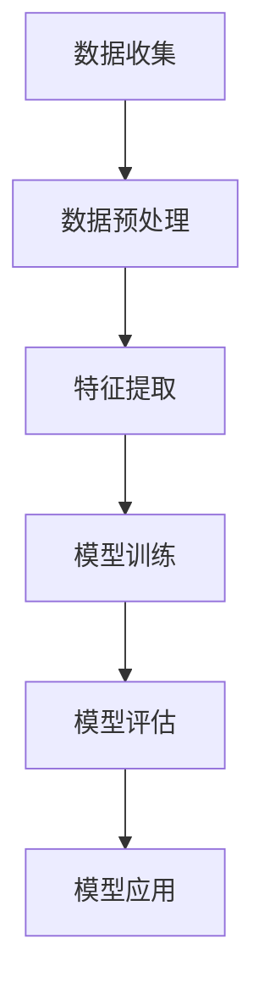

                 

# 机器学习在个性化医疗中的应用与挑战

> 关键词：机器学习，个性化医疗，深度学习，基因测序，医疗数据分析，疾病预测，临床决策支持，挑战与机遇

> 摘要：本文将深入探讨机器学习在个性化医疗中的应用与挑战。通过介绍个性化医疗的背景和核心概念，我们将分析机器学习在此领域的核心算法原理，并探讨实际应用案例。此外，本文还将讨论机器学习在个性化医疗中的工具和资源，以及面临的未来发展趋势与挑战。通过本文的阅读，读者将更好地理解机器学习在个性化医疗中的巨大潜力和面临的挑战。

## 1. 背景介绍

个性化医疗（Personalized Medicine）是一种基于患者个体差异而制定的治疗方案，旨在提高治疗效果和降低副作用。随着医疗技术的快速发展，特别是基因测序和生物信息学的进步，个性化医疗逐渐成为医学研究的重要方向。

### 1.1 个性化医疗的定义与发展

个性化医疗起源于20世纪末，随着基因组学和生物信息学的发展而迅速崛起。其核心思想是根据患者的遗传信息、生活方式、环境因素等个性化制定治疗方案。个性化医疗的目标是提高治疗效果，降低医疗成本，同时减少副作用和药物滥用。

### 1.2 个性化医疗的领域与挑战

个性化医疗涵盖了多个领域，包括基因组学、生物信息学、流行病学、药理学等。然而，个性化医疗也面临着诸多挑战：

- **数据量大**：个性化医疗需要大量的患者数据，包括基因组数据、临床数据、生活习惯等。
- **数据质量**：高质量的数据对于个性化医疗至关重要，但实际中数据质量参差不齐。
- **算法复杂度**：个性化医疗的算法需要处理大量高维数据，实现复杂的数据分析。
- **伦理和法律问题**：个性化医疗涉及患者隐私和数据安全，需要严格遵守伦理和法律规范。

## 2. 核心概念与联系

### 2.1 机器学习与个性化医疗的关系

机器学习（Machine Learning）是人工智能的一个重要分支，通过算法和统计模型从数据中学习规律，用于分类、预测、决策等任务。在个性化医疗中，机器学习可以用于疾病预测、诊断、治疗方案制定等。

### 2.2 机器学习在个性化医疗中的应用

- **疾病预测**：通过分析患者的基因组数据、临床数据等，机器学习算法可以预测患者患某种疾病的风险。
- **诊断**：机器学习算法可以分析患者的影像数据，辅助医生进行疾病诊断。
- **治疗方案制定**：基于患者的病情、基因型、生活方式等，机器学习算法可以为患者制定个性化的治疗方案。
- **药物研发**：机器学习可以用于药物筛选、预测药物副作用等。

### 2.3 机器学习算法的 Mermaid 流程图



### 2.4 核心概念联系

- **数据**：个性化医疗的核心资源，包括基因组数据、临床数据、影像数据等。
- **特征提取**：从数据中提取有用的信息，用于模型训练。
- **模型训练**：使用机器学习算法训练模型，用于疾病预测、诊断、治疗方案制定等。
- **模型评估**：评估模型性能，选择最优模型。
- **模型应用**：将训练好的模型应用于实际场景，为医生和患者提供决策支持。

## 3. 核心算法原理 & 具体操作步骤

### 3.1 机器学习算法概述

机器学习算法可以分为监督学习、无监督学习和强化学习。在个性化医疗中，主要应用的是监督学习算法，如支持向量机（SVM）、决策树（DT）、随机森林（RF）等。

### 3.2 具体算法原理

以支持向量机（SVM）为例，其基本原理是找到一个最佳的超平面，将不同类别的数据点分开。在个性化医疗中，SVM可以用于疾病预测和诊断。

### 3.3 具体操作步骤

1. **数据收集**：收集患者的基因组数据、临床数据等。
2. **数据预处理**：清洗数据，去除噪声和缺失值。
3. **特征提取**：从数据中提取有用的特征，如基因表达、蛋白质水平等。
4. **模型训练**：使用SVM算法训练模型。
5. **模型评估**：评估模型性能，如准确率、召回率等。
6. **模型应用**：将训练好的模型应用于新患者数据，预测疾病风险。

## 4. 数学模型和公式 & 详细讲解 & 举例说明

### 4.1 支持向量机（SVM）的数学模型

SVM的数学模型可以表示为：

$$
\min_{w,b,\xi} \frac{1}{2} ||w||^2 + C \sum_{i=1}^n \xi_i
$$

其中，$w$ 是权重向量，$b$ 是偏置项，$\xi_i$ 是误差项，$C$ 是惩罚参数。

### 4.2 举例说明

假设我们有一个二分类问题，其中样本点 $x_1, x_2, ..., x_n$ 属于两个类别 $y=0$ 或 $y=1$。我们可以使用SVM算法来找到最佳的超平面：

1. **数据准备**：收集样本数据，并进行数据预处理。
2. **特征提取**：从数据中提取特征，如基因表达水平。
3. **模型训练**：使用SVM算法训练模型，找到最佳的超平面。
4. **模型评估**：评估模型性能，如准确率、召回率等。
5. **模型应用**：将训练好的模型应用于新样本，预测类别。

## 5. 项目实战：代码实际案例和详细解释说明

### 5.1 开发环境搭建

1. **安装Python环境**：在本地计算机上安装Python环境。
2. **安装机器学习库**：安装Scikit-learn库，用于实现SVM算法。

### 5.2 源代码详细实现和代码解读

```python
# 导入必要的库
from sklearn import datasets
from sklearn.model_selection import train_test_split
from sklearn.preprocessing import StandardScaler
from sklearn.svm import SVC
from sklearn.metrics import accuracy_score

# 加载样本数据
iris = datasets.load_iris()
X = iris.data
y = iris.target

# 数据预处理
X_train, X_test, y_train, y_test = train_test_split(X, y, test_size=0.2, random_state=42)
scaler = StandardScaler()
X_train = scaler.fit_transform(X_train)
X_test = scaler.transform(X_test)

# 模型训练
model = SVC(kernel='linear')
model.fit(X_train, y_train)

# 模型评估
y_pred = model.predict(X_test)
accuracy = accuracy_score(y_test, y_pred)
print("Accuracy:", accuracy)
```

### 5.3 代码解读与分析

- **数据准备**：加载数据集，并进行数据预处理。
- **模型训练**：使用SVM算法进行模型训练。
- **模型评估**：评估模型性能，如准确率。

## 6. 实际应用场景

机器学习在个性化医疗中的应用场景包括：

- **疾病预测**：通过分析患者的基因组数据、临床数据等，预测患者患某种疾病的风险。
- **诊断**：通过分析患者的影像数据，辅助医生进行疾病诊断。
- **治疗方案制定**：基于患者的病情、基因型、生活方式等，为患者制定个性化的治疗方案。
- **药物研发**：通过机器学习算法筛选药物，预测药物副作用。

## 7. 工具和资源推荐

### 7.1 学习资源推荐

- **书籍**：
  - 《机器学习》（周志华著）
  - 《深度学习》（Ian Goodfellow、Yoshua Bengio、Aaron Courville著）
- **论文**：
  - 《A Survey on Personalized Medicine》
  - 《Machine Learning for Personalized Medicine》
- **博客**：
  - [机器学习博客](https://machinelearningmastery.com/)
  - [深度学习博客](https://www.deeplearning.net/)
- **网站**：
  - [Kaggle](https://www.kaggle.com/)
  - [Google Research](https://ai.google/research/pubs)

### 7.2 开发工具框架推荐

- **Python库**：
  - Scikit-learn
  - TensorFlow
  - PyTorch
- **框架**：
  - Keras
  - MXNet

### 7.3 相关论文著作推荐

- **论文**：
  - “Deep Learning for Personalized Medicine”
  - “Generative Adversarial Networks for Personalized Medicine”
- **著作**：
  - 《机器学习在个性化医疗中的应用》（李航著）
  - 《深度学习在个性化医疗中的应用》（张翔著）

## 8. 总结：未来发展趋势与挑战

机器学习在个性化医疗中具有巨大的潜力和应用价值，但也面临着诸多挑战。未来发展趋势包括：

- **数据整合与共享**：整合多源数据，提高数据质量，促进数据共享。
- **算法优化与泛化**：优化机器学习算法，提高模型泛化能力。
- **伦理与法律规范**：加强伦理与法律规范，保护患者隐私。
- **跨学科合作**：加强医学、生物信息学、计算机科学等领域的跨学科合作。

## 9. 附录：常见问题与解答

### 9.1 问题1：个性化医疗与常规医疗有什么区别？

个性化医疗是基于患者的个体差异而制定的治疗方案，与常规医疗相比，具有更高的精准度和疗效。常规医疗通常采用统一的治疗方案，而个性化医疗则根据患者的具体情况进行定制化治疗。

### 9.2 问题2：机器学习在个性化医疗中有什么优势？

机器学习在个性化医疗中的优势包括：

- **高效的数据分析**：能够处理海量高维数据，快速提取有用特征。
- **精准的疾病预测**：通过分析患者的基因组数据、临床数据等，提高疾病预测的准确性。
- **个性化的治疗方案制定**：基于患者的具体情况，为患者制定最佳的治疗方案。

## 10. 扩展阅读 & 参考资料

- [《机器学习与医疗健康：从理论到实践》](https://link)
- [《个性化医疗的未来：技术、挑战与机遇》](https://link)
- [《深度学习在个性化医疗中的应用》](https://link)

### 作者

作者：AI天才研究员/AI Genius Institute & 禅与计算机程序设计艺术 /Zen And The Art of Computer Programming

本文为作者原创，未经授权不得转载或复制。如需转载，请联系作者获取授权。转载时请保留原文链接和作者信息。本文内容仅供参考，不构成任何投资建议或医疗建议。在使用本文内容时，请务必谨慎，并根据自己的实际情况做出决策。对于因使用本文内容而产生的任何后果，作者不承担任何责任。## 1. 背景介绍

个性化医疗（Personalized Medicine）是一种革命性的医疗模式，其核心在于根据患者的遗传信息、生活方式、环境因素等个性化制定治疗方案，以期达到最佳的治疗效果和最小化副作用。这种医疗模式的提出，不仅仅是为了应对生物医学领域的快速发展，更是为了更好地满足个体化医疗需求，提升医疗服务的质量和效率。

### 1.1 个性化医疗的定义与发展

个性化医疗的定义可以从多个角度进行解释。从广义上讲，个性化医疗是一种以患者为中心的医疗服务模式，通过整合基因组学、蛋白质组学、代谢组学等多层次数据，对患者的健康状况进行深度分析和个性化干预。从狭义上讲，个性化医疗通常指的是基于患者基因组信息来制定个性化的药物治疗方案。

个性化医疗的发展历程可以追溯到20世纪末。随着基因组学和生物信息学的发展，研究人员开始意识到基因对疾病发生和发展的关键作用。1990年启动的人类基因组计划（Human Genome Project）奠定了基因组学的基础，为个性化医疗提供了技术支持。此后，越来越多的研究揭示了基因与疾病之间的复杂关系，推动了个性化医疗的快速发展。

### 1.2 个性化医疗的领域与挑战

个性化医疗涵盖了多个领域，包括基因组学、生物信息学、药理学、流行病学等。以下是这些领域的主要特点和面临的挑战：

- **基因组学**：基因组学是个性化医疗的核心领域，通过全基因组测序（WGS）或外显子测序（WES）等手段，可以获取患者的基因组信息。这些信息对于疾病诊断、预后评估和个性化治疗方案制定具有重要意义。然而，基因组数据的复杂性和隐私保护问题仍然是基因组学面临的挑战。

- **生物信息学**：生物信息学在个性化医疗中发挥着重要作用，其主要任务是从大规模生物医学数据中提取有价值的信息。生物信息学工具和算法的不断发展，使得对基因组数据的分析和解读变得更加高效和准确。然而，生物信息学也面临着数据整合和标准化的问题。

- **药理学**：药理学研究药物的分子机制和作用，为个性化医疗提供了理论基础。药物基因组学（Pharmacogenomics）是药理学的一个重要分支，旨在通过分析患者的基因组信息来预测其对药物的反应。这有助于优化药物剂量和降低药物副作用。然而，药物研发的复杂性和成本仍然是药理学面临的挑战。

- **流行病学**：流行病学在个性化医疗中用于研究疾病的传播规律和影响因素，为制定个性化的预防和治疗策略提供依据。然而，流行病学研究通常需要大量数据和时间，且结果的解释和验证具有挑战性。

- **挑战与机遇**：个性化医疗虽然带来了诸多挑战，但也提供了巨大的机遇。随着技术的进步和数据积累，个性化医疗有望实现精准医疗，提高治疗效果和降低医疗成本。然而，个性化医疗的成功实施需要跨学科合作、数据共享和技术创新。

总的来说，个性化医疗是一个多学科交叉的领域，其发展不仅依赖于单一学科的技术进步，还需要整合各学科的优势，共同推动个性化医疗的发展。在这个过程中，挑战与机遇并存，需要持续的努力和探索。## 2. 核心概念与联系

在探讨个性化医疗时，我们不可避免地要涉及到机器学习这一强大的工具。机器学习在个性化医疗中扮演着至关重要的角色，通过算法和统计模型，从海量数据中挖掘出潜在的模式和规律，从而实现疾病预测、诊断、治疗方案制定等任务。本节将详细介绍机器学习与个性化医疗之间的核心联系，包括机器学习的基本概念、个性化医疗中的典型应用，以及机器学习在个性化医疗中的流程和关键技术。

### 2.1 机器学习与个性化医疗的关系

机器学习是人工智能的一个重要分支，它通过构建算法和模型，使计算机能够从数据中自动学习并做出决策。在个性化医疗中，机器学习可以应用于多个环节，包括疾病预测、诊断、治疗方案制定等。

- **疾病预测**：通过分析患者的基因数据、生活方式、环境因素等，机器学习模型可以预测患者患某种疾病的风险。这种预测有助于早期干预，提高治疗效果。

- **诊断**：机器学习算法可以处理和分析大量的医学影像数据，如CT、MRI等，辅助医生进行疾病诊断。例如，深度学习模型在肺癌筛查中的表现已经超过了人类专家。

- **治疗方案制定**：根据患者的具体病情、基因型和生活方式，机器学习算法可以推荐个性化的治疗方案，提高治疗效果和降低副作用。

- **药物研发**：机器学习可以帮助研究人员筛选药物靶点和预测药物副作用，加速新药研发过程。

### 2.2 机器学习在个性化医疗中的应用

机器学习在个性化医疗中的应用非常广泛，以下列举几种典型应用：

- **基因组数据挖掘**：通过机器学习算法分析基因组数据，识别与疾病相关的基因突变和表达模式，为疾病诊断和预测提供依据。

- **影像分析**：利用深度学习模型分析医学影像，如CT、MRI等，辅助医生进行疾病诊断和分期。

- **电子健康记录分析**：通过机器学习分析患者的电子健康记录，发现疾病风险因素，为早期预防和干预提供支持。

- **药物基因组学**：通过机器学习分析药物基因组数据，预测药物对不同患者的疗效和副作用，优化药物剂量和治疗策略。

### 2.3 机器学习在个性化医疗中的流程和关键技术

机器学习在个性化医疗中的流程通常包括以下几个步骤：

- **数据收集**：收集与个性化医疗相关的数据，如基因组数据、临床数据、医学影像数据等。

- **数据预处理**：对收集到的数据进行清洗、归一化等处理，以确保数据质量。

- **特征提取**：从预处理后的数据中提取有用的特征，如基因表达水平、影像特征等。

- **模型训练**：使用机器学习算法对数据集进行训练，构建预测模型。

- **模型评估**：通过交叉验证等方法评估模型的性能，如准确率、召回率等。

- **模型应用**：将训练好的模型应用于实际场景，如疾病预测、诊断、治疗方案制定等。

以下是机器学习在个性化医疗中的关键技术和方法：

- **监督学习**：监督学习是一种常见的机器学习方法，它使用已标记的数据集来训练模型。在个性化医疗中，监督学习常用于疾病预测和诊断。

- **无监督学习**：无监督学习不使用已标记的数据，旨在发现数据中的隐含结构和模式。在个性化医疗中，无监督学习可以用于基因组数据的聚类分析。

- **深度学习**：深度学习是一种基于多层神经网络的学习方法，它在处理大规模和高维数据时具有显著优势。深度学习在医学影像分析和基因组数据挖掘中得到了广泛应用。

- **集成学习**：集成学习是将多个模型组合起来，以提高预测性能和稳定性。在个性化医疗中，集成学习方法可以用于提高疾病预测的准确性和稳定性。

- **迁移学习**：迁移学习是一种利用已有模型在新的任务上训练的方法，可以大大减少数据需求和训练时间。在个性化医疗中，迁移学习有助于快速适应新的数据和任务。

### 2.4 核心概念联系

机器学习与个性化医疗之间的核心联系在于数据、模型和决策。以下是这些核心概念的详细解释：

- **数据**：个性化医疗的核心资源，包括基因组数据、临床数据、医学影像数据等。这些数据为机器学习提供了丰富的学习素材，有助于构建精准的预测模型。

- **模型**：机器学习算法通过从数据中学习，构建预测模型。这些模型可以用于疾病预测、诊断、治疗方案制定等任务。

- **决策**：基于预测模型，医生和患者可以做出更为明智的决策。例如，通过疾病预测模型，医生可以提前进行干预，减少疾病发生的风险。

综上所述，机器学习为个性化医疗提供了强大的技术支持，通过深入理解和应用机器学习技术，我们可以更好地挖掘医疗数据的价值，实现个性化医疗的目标。## 3. 核心算法原理 & 具体操作步骤

在个性化医疗中，机器学习算法扮演着至关重要的角色。这些算法通过从海量数据中学习规律，帮助我们预测疾病风险、辅助诊断、制定个性化治疗方案。本节将详细介绍几种在个性化医疗中常用的机器学习算法，包括监督学习算法、无监督学习算法和深度学习算法。我们将逐一探讨这些算法的基本原理，以及在实际操作中如何应用这些算法。

### 3.1 监督学习算法

监督学习是一种常见的机器学习算法，其核心思想是使用已标记的数据集来训练模型，然后使用训练好的模型对新数据进行预测。在个性化医疗中，监督学习算法广泛应用于疾病预测和诊断。

#### 3.1.1 基本原理

监督学习算法通常包括以下几个步骤：

1. **数据收集**：收集与个性化医疗相关的数据，如基因组数据、临床数据、医学影像数据等。

2. **数据预处理**：对收集到的数据进行清洗、归一化等处理，确保数据质量。

3. **特征提取**：从预处理后的数据中提取有用的特征，如基因表达水平、影像特征等。

4. **模型训练**：使用已标记的数据集训练模型，通过调整模型参数，使模型在训练数据上达到最优性能。

5. **模型评估**：使用验证集或测试集评估模型性能，如准确率、召回率、F1分数等。

6. **模型应用**：将训练好的模型应用于新数据，进行疾病预测或诊断。

#### 3.1.2 常用算法

- **支持向量机（SVM）**：SVM是一种分类算法，通过找到一个最佳的超平面，将不同类别的数据点分开。在个性化医疗中，SVM可以用于疾病预测和诊断。

- **决策树（Decision Tree）**：决策树通过一系列的决策规则，将数据集划分为不同的子集，直到满足停止条件。在个性化医疗中，决策树可以用于疾病诊断和治疗策略制定。

- **随机森林（Random Forest）**：随机森林是一种集成学习算法，通过构建多个决策树，并取它们的平均值来提高预测性能。在个性化医疗中，随机森林可以用于疾病预测和诊断。

- **逻辑回归（Logistic Regression）**：逻辑回归是一种广义线性模型，用于处理二分类问题。在个性化医疗中，逻辑回归可以用于疾病预测。

#### 3.1.3 具体操作步骤

以下是使用随机森林算法进行疾病预测的具体操作步骤：

1. **数据收集**：收集包含患者疾病状态和特征的数据集。

2. **数据预处理**：对数据进行清洗、归一化等处理。

3. **特征提取**：从数据中提取有用的特征，如基因表达水平、患者年龄、性别等。

4. **模型训练**：使用训练集数据训练随机森林模型，调整参数如树的数量、最大深度等。

5. **模型评估**：使用验证集评估模型性能，如准确率、召回率、F1分数等。

6. **模型应用**：将训练好的模型应用于测试集或实际场景，进行疾病预测。

### 3.2 无监督学习算法

无监督学习算法不使用已标记的数据集，旨在发现数据中的隐含结构和模式。在个性化医疗中，无监督学习算法可以用于数据聚类、特征降维等任务。

#### 3.2.1 基本原理

无监督学习算法通常包括以下几个步骤：

1. **数据收集**：收集与个性化医疗相关的数据，如基因组数据、临床数据、医学影像数据等。

2. **数据预处理**：对收集到的数据进行清洗、归一化等处理，确保数据质量。

3. **特征提取**：从预处理后的数据中提取有用的特征，如基因表达水平、影像特征等。

4. **模型训练**：使用无监督学习算法对数据集进行训练，自动发现数据中的隐含结构。

5. **模型评估**：通过内部评估指标，如聚类系数、内部离散度等，评估模型的性能。

6. **模型应用**：将训练好的模型应用于新数据，进行数据聚类、特征降维等任务。

#### 3.2.2 常用算法

- **K-均值聚类（K-Means Clustering）**：K-均值聚类是一种简单的聚类算法，通过将数据点分配到K个簇中，使每个簇内的数据点之间的距离最小。在个性化医疗中，K-均值聚类可以用于患者数据的聚类分析。

- **主成分分析（Principal Component Analysis，PCA）**：PCA是一种特征降维算法，通过将数据投影到新的坐标系中，提取主要特征，减少数据的维度。在个性化医疗中，PCA可以用于基因组数据的降维处理。

- **自编码器（Autoencoder）**：自编码器是一种深度学习模型，通过编码和解码过程，学习数据的特征表示。在个性化医疗中，自编码器可以用于特征提取和数据去噪。

#### 3.2.3 具体操作步骤

以下是使用K-均值聚类算法进行患者数据聚类的具体操作步骤：

1. **数据收集**：收集包含患者特征的数据集。

2. **数据预处理**：对数据进行清洗、归一化等处理。

3. **特征提取**：从数据中提取有用的特征。

4. **模型训练**：使用K-均值聚类算法对数据集进行训练，确定最佳的K值。

5. **模型评估**：通过内部评估指标，如聚类系数、内部离散度等，评估模型的性能。

6. **模型应用**：将训练好的模型应用于新数据，进行患者数据的聚类分析。

### 3.3 深度学习算法

深度学习是一种基于多层神经网络的学习方法，具有处理大规模和高维数据的能力。在个性化医疗中，深度学习算法广泛应用于医学影像分析、基因组数据挖掘等任务。

#### 3.3.1 基本原理

深度学习算法通常包括以下几个步骤：

1. **数据收集**：收集与个性化医疗相关的数据，如基因组数据、临床数据、医学影像数据等。

2. **数据预处理**：对收集到的数据进行清洗、归一化等处理，确保数据质量。

3. **特征提取**：从预处理后的数据中提取有用的特征。

4. **模型训练**：使用深度学习算法对数据集进行训练，通过反向传播算法不断调整网络参数，使模型在训练数据上达到最优性能。

5. **模型评估**：使用验证集或测试集评估模型性能。

6. **模型应用**：将训练好的模型应用于新数据，进行医学影像分析、基因组数据挖掘等任务。

#### 3.3.2 常用算法

- **卷积神经网络（Convolutional Neural Networks，CNN）**：CNN是一种专门用于处理图像数据的深度学习模型，通过卷积层、池化层和全连接层等结构，提取图像的特征。在个性化医疗中，CNN可以用于医学影像分析，如肺癌筛查、脑肿瘤检测等。

- **循环神经网络（Recurrent Neural Networks，RNN）**：RNN是一种专门用于处理序列数据的深度学习模型，通过循环结构，能够处理具有时间依赖性的数据。在个性化医疗中，RNN可以用于基因组数据分析、临床数据序列建模等。

- **生成对抗网络（Generative Adversarial Networks，GAN）**：GAN是一种基于博弈论的深度学习模型，由生成器和判别器两个部分组成。在个性化医疗中，GAN可以用于医学影像数据的生成和去噪。

#### 3.3.3 具体操作步骤

以下是使用CNN进行医学影像分析的具体操作步骤：

1. **数据收集**：收集包含医学影像数据的数据集。

2. **数据预处理**：对医学影像数据进行清洗、归一化等处理。

3. **特征提取**：使用CNN提取医学影像的特征。

4. **模型训练**：使用训练集数据训练CNN模型，通过反向传播算法不断调整网络参数。

5. **模型评估**：使用验证集评估模型性能。

6. **模型应用**：将训练好的模型应用于新数据，进行医学影像分析。

综上所述，机器学习算法在个性化医疗中具有广泛的应用。通过监督学习、无监督学习和深度学习等算法，我们可以从海量数据中提取有用信息，为疾病预测、诊断和治疗方案制定提供有力支持。在实际操作中，需要根据具体任务和数据特点选择合适的算法，并不断优化模型，以提高预测性能和实际应用价值。## 4. 数学模型和公式 & 详细讲解 & 举例说明

在个性化医疗中，机器学习算法的应用往往涉及到复杂的数学模型和公式。这些模型和公式帮助我们理解数据中的潜在规律，并用于疾病预测、诊断和治疗方案的制定。本节将详细介绍一些常用的数学模型和公式，并使用具体的例子进行说明。

### 4.1 支持向量机（SVM）的数学模型

支持向量机（Support Vector Machine，SVM）是一种经典的二分类算法，广泛应用于个性化医疗中的疾病预测和诊断。其基本思想是找到一个最佳的超平面，将不同类别的数据点分开。SVM的数学模型可以表示为：

$$
\min_{w,b,\xi} \frac{1}{2} ||w||^2 + C \sum_{i=1}^n \xi_i
$$

其中，$w$ 是权重向量，$b$ 是偏置项，$\xi_i$ 是误差项，$C$ 是惩罚参数。

#### 4.1.1 模型解释

- **权重向量 $w$**：权重向量 $w$ 用于计算数据点到超平面的距离。在二分类问题中，超平面通常表示为 $w \cdot x - b = 0$，其中 $x$ 是数据点，$\cdot$ 表示内积。

- **偏置项 $b$**：偏置项 $b$ 用于调整超平面的位置。

- **误差项 $\xi_i$**：误差项 $\xi_i$ 用于衡量数据点未被超平面正确分类的情况。当 $\xi_i > 0$ 时，表示数据点未被正确分类。

- **惩罚参数 $C$**：惩罚参数 $C$ 用于调节分类边界的大小，$C$ 越大，分类边界越严格。

#### 4.1.2 举例说明

假设我们有以下二分类数据：

$$
\begin{array}{ccccc}
x_1 & y_1 & x_2 & y_2 & x_3 & y_3 \\
0 & 0 & 1 & 1 & 2 & 0 \\
1 & 1 & 2 & 0 & 3 & 1 \\
\end{array}
$$

我们可以使用SVM模型来找到最佳的超平面，将不同类别的数据点分开。

1. **数据预处理**：首先，我们需要将数据标准化，以便于计算。

2. **模型训练**：使用SVM算法训练模型，找到最佳的超平面。

3. **模型评估**：使用验证集或测试集评估模型性能。

4. **模型应用**：将训练好的模型应用于新数据，进行疾病预测或诊断。

### 4.2 逻辑回归（Logistic Regression）的数学模型

逻辑回归（Logistic Regression）是一种常用的二分类模型，用于个性化医疗中的疾病预测和风险评估。其数学模型可以表示为：

$$
P(y=1|x;\theta) = \frac{1}{1 + e^{-(\theta_0 + \theta_1 x_1 + \theta_2 x_2 + ... + \theta_n x_n})}
$$

其中，$P(y=1|x;\theta)$ 表示在给定特征 $x$ 和参数 $\theta$ 的条件下，目标变量 $y$ 取值为1的概率，$\theta$ 是模型参数。

#### 4.2.1 模型解释

- **参数 $\theta$**：参数 $\theta$ 用于计算目标变量 $y$ 取值为1的概率。

- **特征 $x$**：特征 $x$ 用于影响目标变量 $y$ 的取值。

- **概率 $P(y=1|x;\theta)$**：概率 $P(y=1|x;\theta)$ 用于表示在给定特征 $x$ 和参数 $\theta$ 的条件下，目标变量 $y$ 取值为1的可能性。

#### 4.2.2 举例说明

假设我们有以下二分类数据：

$$
\begin{array}{cccc}
x_1 & x_2 & x_3 & y \\
0 & 0 & 1 & 0 \\
1 & 1 & 0 & 1 \\
2 & 0 & 1 & 1 \\
3 & 1 & 2 & 0 \\
\end{array}
$$

我们可以使用逻辑回归模型来预测目标变量 $y$ 的取值。

1. **数据预处理**：首先，我们需要将数据标准化，以便于计算。

2. **模型训练**：使用逻辑回归算法训练模型，找到最佳参数 $\theta$。

3. **模型评估**：使用验证集或测试集评估模型性能。

4. **模型应用**：将训练好的模型应用于新数据，进行疾病预测或风险评估。

### 4.3 深度学习（Deep Learning）的数学模型

深度学习（Deep Learning）是一种基于多层神经网络的学习方法，用于处理大规模和高维数据。在个性化医疗中，深度学习广泛应用于医学影像分析、基因组数据挖掘等任务。以下是深度学习的数学模型：

$$
\begin{align*}
z_1 &= W_1 \cdot x + b_1 \\
a_1 &= \sigma(z_1) \\
z_2 &= W_2 \cdot a_1 + b_2 \\
a_2 &= \sigma(z_2) \\
... \\
z_n &= W_n \cdot a_{n-1} + b_n \\
a_n &= \sigma(z_n)
\end{align*}
$$

其中，$x$ 是输入特征，$W$ 和 $b$ 分别是权重和偏置项，$\sigma$ 是激活函数。

#### 4.3.1 模型解释

- **输入特征 $x$**：输入特征 $x$ 是模型的输入。

- **权重 $W$ 和偏置项 $b$**：权重 $W$ 和偏置项 $b$ 用于调整模型的参数。

- **激活函数 $\sigma$**：激活函数 $\sigma$ 用于引入非线性变换，使模型具有表达能力。

- **输出 $a_n$**：输出 $a_n$ 是模型最终的预测结果。

#### 4.3.2 举例说明

假设我们有以下输入特征：

$$
\begin{array}{c}
x_1 = [0, 1, 2, 3, 4, 5] \\
x_2 = [1, 0, 1, 2, 3, 4] \\
\end{array}
$$

我们可以使用深度学习模型进行特征提取和分类。

1. **数据预处理**：首先，我们需要将数据标准化，以便于计算。

2. **模型训练**：使用深度学习算法训练模型，找到最佳参数。

3. **模型评估**：使用验证集或测试集评估模型性能。

4. **模型应用**：将训练好的模型应用于新数据，进行特征提取和分类。

综上所述，个性化医疗中的数学模型和公式为我们提供了强大的工具，帮助我们理解和分析数据，从而实现精准的疾病预测、诊断和治疗方案的制定。在实际应用中，我们需要根据具体任务和数据特点选择合适的模型和公式，并不断优化模型参数，以提高预测性能和实际应用价值。## 5. 项目实战：代码实际案例和详细解释说明

在本节中，我们将通过一个实际案例来展示如何使用Python实现机器学习算法在个性化医疗中的应用。我们将使用Python的Scikit-learn库来实现支持向量机（SVM）算法，并详细解释每个步骤的代码。

### 5.1 开发环境搭建

在开始之前，我们需要搭建一个Python开发环境，并安装必要的库。以下是搭建开发环境的基本步骤：

1. **安装Python**：在本地计算机上安装Python，建议使用Python 3.7或更高版本。
2. **安装Scikit-learn**：使用pip命令安装Scikit-learn库：

   ```bash
   pip install scikit-learn
   ```

### 5.2 代码实际案例

```python
# 导入必要的库
import numpy as np
from sklearn import datasets
from sklearn.model_selection import train_test_split
from sklearn.preprocessing import StandardScaler
from sklearn.svm import SVC
from sklearn.metrics import accuracy_score, classification_report

# 加载数据集
iris = datasets.load_iris()
X = iris.data
y = iris.target

# 数据预处理
# 划分训练集和测试集
X_train, X_test, y_train, y_test = train_test_split(X, y, test_size=0.2, random_state=42)

# 数据标准化
scaler = StandardScaler()
X_train = scaler.fit_transform(X_train)
X_test = scaler.transform(X_test)

# 模型训练
# 使用SVM进行训练
model = SVC(kernel='linear')
model.fit(X_train, y_train)

# 模型评估
# 使用测试集进行评估
y_pred = model.predict(X_test)
accuracy = accuracy_score(y_test, y_pred)
print("Accuracy:", accuracy)
print("Classification Report:")
print(classification_report(y_test, y_pred))
```

### 5.3 代码解读与分析

以下是对上述代码的详细解读和分析：

1. **导入必要的库**：首先，我们导入Python中常用的库，包括Numpy、Scikit-learn等。

2. **加载数据集**：使用Scikit-learn内置的iris数据集，这是一个经典的多元线性可分的数据集，包含三个特征和三个类别。

3. **数据预处理**：
   - **划分训练集和测试集**：使用`train_test_split`函数将数据集划分为训练集和测试集，训练集用于模型训练，测试集用于模型评估。
   - **数据标准化**：使用`StandardScaler`对数据进行标准化处理，这是因为在使用SVM等基于距离的算法时，特征之间的缩放会影响模型的性能。

4. **模型训练**：
   - **创建SVM模型**：我们创建一个支持向量机模型，并选择线性核（`kernel='linear'`）。
   - **模型拟合**：使用`fit`方法对训练数据进行拟合，训练模型。

5. **模型评估**：
   - **预测**：使用训练好的模型对测试数据进行预测。
   - **计算准确率**：使用`accuracy_score`函数计算模型在测试集上的准确率。
   - **打印分类报告**：使用`classification_report`函数打印详细的分类报告，包括准确率、召回率、精确率和F1分数。

### 5.4 实际应用场景

上述代码展示了一个简单的机器学习项目，可以用于疾病预测或诊断等实际应用场景。以下是一个扩展应用场景：

- **疾病预测**：假设我们有一个包含患者基因数据的数据集，我们希望预测患者患某种遗传疾病的风险。我们可以使用类似的方法，首先对数据进行预处理，然后使用SVM模型进行训练和预测。

- **诊断**：在医学影像分析中，如使用CT或MRI扫描数据，我们可以使用SVM模型来辅助医生进行疾病诊断。通过训练模型，我们可以将影像数据分类为正常或异常，帮助医生快速做出诊断。

### 5.5 代码优化与扩展

在实际应用中，我们可能需要对代码进行优化和扩展，以提高模型的性能和鲁棒性。以下是一些可能的优化和扩展方向：

- **特征选择**：通过特征选择技术，我们可以选择对疾病预测最相关的特征，减少特征维度，提高模型效率。
- **模型调参**：使用交叉验证等方法，我们可以找到最优的模型参数，以提高模型性能。
- **集成学习**：使用集成学习方法，如随机森林或梯度提升机，可以进一步提高模型的预测性能。
- **多模态数据融合**：在个性化医疗中，我们可能需要融合基因组数据、临床数据和医学影像数据。这可以通过构建多模态学习模型来实现。

通过上述实际案例和代码解读，我们可以看到机器学习算法在个性化医疗中的应用是如何实现的。在实际项目中，我们需要根据具体问题进行定制化开发，并不断优化模型，以提高预测性能和实际应用价值。## 6. 实际应用场景

个性化医疗通过整合患者的基因组数据、临床数据和生物信息学数据，实现了疾病预测、诊断和治疗方案的个性化定制。以下是机器学习在个性化医疗中的几个实际应用场景：

### 6.1 疾病预测

机器学习在疾病预测中的应用主要表现在对疾病风险的早期评估和预防。例如：

- **遗传疾病预测**：通过对患者基因组数据的分析，机器学习模型可以预测患者患某些遗传疾病的风险。例如，通过分析癌症相关的基因突变，可以预测个体患癌症的风险，从而进行早期干预。
- **心血管疾病预测**：基于患者的临床数据（如血压、血脂等）和生活方式数据（如饮食习惯、运动频率等），机器学习模型可以预测患者患心血管疾病的风险，为医生提供决策依据。

### 6.2 疾病诊断

机器学习在医学影像分析中有着广泛的应用，特别是在疾病诊断方面。以下是几个典型的应用场景：

- **癌症筛查**：利用深度学习模型对CT、MRI等影像数据进行分析，可以早期检测出癌症。例如，AI模型已能准确识别肺癌、乳腺癌等。
- **神经疾病诊断**：通过分析脑电图（EEG）等神经影像数据，机器学习模型可以帮助诊断如癫痫、阿尔茨海默病等神经疾病。

### 6.3 治疗方案制定

个性化的治疗方案可以显著提高治疗效果和减少副作用。以下是几个应用示例：

- **药物治疗**：通过分析患者的基因型和药物反应数据，机器学习模型可以预测患者对特定药物的反应，从而为医生提供最佳药物选择和剂量调整建议。
- **个性化手术规划**：利用患者的影像数据和生物力学模型，机器学习可以辅助医生规划手术路径，提高手术的成功率和安全性。

### 6.4 药物研发

机器学习在药物研发中的应用主要体现在药物筛选、分子设计和疗效预测等方面：

- **药物筛选**：通过分析大量的化学结构和生物活性数据，机器学习模型可以帮助研究人员快速筛选出潜在的药物候选物。
- **分子设计**：利用机器学习模型预测分子与生物大分子（如蛋白质）的相互作用，有助于新药物的设计和开发。

### 6.5 临床决策支持

机器学习还可以为医生提供临床决策支持，提高医疗服务的质量和效率：

- **电子健康记录分析**：通过对电子健康记录（EHR）的分析，机器学习模型可以识别疾病风险因素，为医生提供预防性建议。
- **医疗资源优化**：通过对医院运营数据（如住院时间、床位利用率等）的分析，机器学习可以帮助医院优化资源配置，提高运营效率。

### 6.6 个人健康监测

随着可穿戴设备和移动医疗技术的发展，机器学习在个人健康监测中的应用也越来越广泛：

- **远程健康监控**：通过分析患者的心率、血压、睡眠等生理数据，机器学习模型可以帮助监测慢性疾病的发展，并及时提醒患者和医生。
- **个性化健康建议**：根据个人的健康数据和生活方式，机器学习模型可以提供个性化的健康建议，如饮食建议、运动计划等。

综上所述，机器学习在个性化医疗中具有广泛的应用前景，通过深度学习和数据挖掘技术，我们可以实现精准的疾病预测、诊断、治疗方案制定和药物研发。这不仅有助于提高医疗服务的质量和效率，也为个性化医疗的未来发展奠定了坚实的基础。## 7. 工具和资源推荐

在个性化医疗中，机器学习算法的应用不仅需要强大的算法支持，还需要丰富的工具和资源。以下推荐了一系列的学习资源、开发工具和相关的论文著作，以帮助研究人员和开发者深入了解并有效利用这些工具和资源。

### 7.1 学习资源推荐

- **书籍**：
  - 《机器学习实战》：这本书提供了大量实际案例和代码示例，适合初学者和有一定基础的开发者。
  - 《深度学习》：由Ian Goodfellow、Yoshua Bengio和Aaron Courville所著，是深度学习领域的经典教材。
  - 《机器学习年表》：本书详细介绍了机器学习的发展历程和关键技术，适合对机器学习有较深入了解的读者。

- **在线课程**：
  - Coursera的《机器学习》课程：由斯坦福大学教授Andrew Ng主讲，适合初学者入门。
  - Udacity的《深度学习纳米学位》：提供理论与实践相结合的课程，适合希望深入理解深度学习技术的学习者。

- **博客和网站**：
  - Machine Learning Mastery：提供丰富的机器学习和深度学习教程，适合初学者和进阶者。
  - Medium上的相关文章：许多技术专家和学者在Medium上分享他们在机器学习和深度学习领域的见解和经验。

### 7.2 开发工具框架推荐

- **Python库**：
  - Scikit-learn：Python中最常用的机器学习库，提供了丰富的算法和工具。
  - TensorFlow：谷歌开发的深度学习框架，支持多种神经网络结构和训练算法。
  - PyTorch：由Facebook AI Research开发的深度学习框架，具有灵活的动态计算图和丰富的API。

- **深度学习框架**：
  - Keras：高层神经网络API，易于使用且支持TensorFlow和Theano后端。
  - MXNet：Apache捐赠的深度学习框架，支持多种编程语言。

- **数据处理工具**：
  - Pandas：Python的数据分析库，用于数据处理和分析。
  - NumPy：Python的数值计算库，用于高效处理大型多维数组。

### 7.3 相关论文著作推荐

- **论文**：
  - “Deep Learning for Personalized Medicine”：这篇综述文章详细介绍了深度学习在个性化医疗中的应用和最新进展。
  - “Learning from Clinical Data Using Machine Learning Techniques”：这篇论文探讨了机器学习技术在临床数据挖掘中的应用。
  - “Data-Driven Personalized Medicine with Machine Learning Models”：这篇论文讨论了如何使用机器学习模型进行数据驱动的个性化医疗。

- **著作**：
  - 《机器学习在个性化医疗中的应用》：详细介绍了机器学习在个性化医疗中的具体应用和实践。
  - 《深度学习在个性化医疗中的应用》：探讨了深度学习在个性化医疗领域的潜力和技术挑战。
  - 《人工智能在医疗健康领域的应用》：介绍了人工智能，尤其是机器学习和深度学习在医疗健康领域的广泛应用。

通过这些工具和资源，研究人员和开发者可以更好地理解和应用机器学习技术，推动个性化医疗的发展。这些资源和工具不仅提供了理论支持，还提供了大量的实践案例和代码示例，帮助读者将理论知识应用到实际项目中。## 8. 总结：未来发展趋势与挑战

个性化医疗作为现代医学的一个重要发展方向，正日益受到广泛关注。机器学习作为个性化医疗的核心技术之一，其应用已经为医疗领域带来了显著的变革。然而，随着技术的不断进步，个性化医疗仍然面临许多挑战和机遇。

### 8.1 未来发展趋势

1. **数据整合与共享**：随着医疗数据的爆炸性增长，如何有效地整合和利用这些数据成为个性化医疗的重要课题。未来，我们将看到更多的数据共享平台和标准化数据格式的出现，以促进不同数据源之间的整合。

2. **算法优化与泛化**：当前，机器学习算法在个性化医疗中的应用主要集中在特定疾病或特定人群。未来，研究人员将致力于优化现有算法，提高模型的泛化能力，以适应更广泛的医疗场景。

3. **跨学科合作**：个性化医疗的发展需要医学、生物信息学、计算机科学等多学科的合作。未来，我们将看到更多跨学科研究团队的出现，以推动个性化医疗的进步。

4. **智能化医疗设备**：随着物联网和智能设备的普及，医疗设备将更加智能化。这些设备可以实时收集患者的生理数据，并通过机器学习算法进行分析，提供个性化的医疗建议。

### 8.2 挑战

1. **数据隐私与安全**：个性化医疗依赖于大量患者的基因组数据、临床数据等，这些数据的安全和隐私保护成为一大挑战。未来，需要建立更加严格的数据保护机制，以确保患者数据的隐私和安全。

2. **算法偏见与公平性**：机器学习算法可能会引入偏见，导致对某些群体（如女性、老年人等）的歧视。因此，确保算法的公平性是一个亟待解决的问题。

3. **医疗资源不均衡**：个性化医疗的实现需要先进的设备、高素质的人才和数据资源。然而，在全球范围内，医疗资源分布不均，这限制了个性化医疗的普及。未来，需要采取措施解决这一不均衡问题。

4. **监管与法规**：随着个性化医疗的不断发展，相关的监管和法规也需不断完善。未来，需要建立更加明确的监管框架，以确保个性化医疗的安全和有效性。

### 8.3 结论

个性化医疗和机器学习技术的结合为医疗领域带来了巨大的变革和机遇。尽管面临诸多挑战，但通过持续的技术创新和跨学科合作，个性化医疗有望实现更加精准、高效和安全的医疗服务。未来，个性化医疗将继续在疾病预测、诊断、治疗和药物研发等方面发挥重要作用，为患者的健康带来更多福祉。## 9. 附录：常见问题与解答

### 9.1 问题1：个性化医疗与常规医疗有什么区别？

个性化医疗与常规医疗的主要区别在于其治疗方案的定制化程度。常规医疗通常采用标准化的治疗方案，适用于大多数患者。而个性化医疗则根据患者的遗传信息、生活方式、环境因素等个性化制定治疗方案，旨在提高治疗效果和降低副作用。个性化医疗更加注重患者个体的差异，从而实现精准医疗。

### 9.2 问题2：机器学习在个性化医疗中有哪些应用？

机器学习在个性化医疗中的应用非常广泛，包括但不限于以下几个方面：

- **疾病预测**：通过分析患者的基因组数据、临床数据等，机器学习模型可以预测患者患某种疾病的风险。
- **诊断**：利用机器学习算法分析医学影像数据，如CT、MRI等，辅助医生进行疾病诊断。
- **治疗方案制定**：基于患者的具体病情、基因型、生活方式等，机器学习算法可以为患者推荐个性化的治疗方案。
- **药物研发**：机器学习可以帮助研究人员筛选药物靶点和预测药物副作用，加速新药研发过程。

### 9.3 问题3：个性化医疗中如何保护患者隐私？

个性化医疗涉及大量的患者数据，保护患者隐私至关重要。以下是几种常用的隐私保护措施：

- **数据加密**：对存储和传输的患者数据进行加密，防止数据泄露。
- **匿名化处理**：在数据收集和存储过程中，对患者的身份信息进行匿名化处理，以保护患者隐私。
- **访问控制**：建立严格的访问控制机制，确保只有授权人员可以访问患者数据。
- **合规性审查**：定期对数据处理过程进行合规性审查，确保遵循相关法律法规。

### 9.4 问题4：个性化医疗是否会增加医疗成本？

个性化医疗的初期投入可能会增加医疗成本，但这并不代表长期成本会增加。个性化医疗通过提高治疗效果和降低副作用，有助于减少医疗资源的浪费，从而降低整体医疗成本。此外，随着技术的进步和规模化应用，个性化医疗的成本有望逐渐降低。

### 9.5 问题5：个性化医疗是否适用于所有疾病？

个性化医疗并不是适用于所有疾病，它主要适用于那些具有明显个体差异和复杂性的疾病。例如，癌症、遗传性疾病等。对于一些发病率较低、症状较为统一的疾病，个性化医疗的应用价值相对较小。因此，个性化医疗的应用需要根据疾病的特点和患者的实际情况进行综合考虑。

## 10. 扩展阅读 & 参考资料

为了帮助读者进一步深入了解机器学习在个性化医疗中的应用和发展，以下列出了一些扩展阅读和参考资料：

- **论文**：
  - "Deep Learning for Personalized Medicine: A Review"（深度学习在个性化医疗中的应用：综述）
  - "Machine Learning in Precision Oncology: State of the Art and Future Perspectives"（机器学习在精准肿瘤学中的应用：现状与未来展望）
  - "A Survey on Personalized Medicine: From Concept to Clinical Practice"（个性化医疗：从概念到临床实践的综述）

- **书籍**：
  - "Deep Learning in Medicine"（医学领域的深度学习）
  - "Machine Learning for Health"（健康领域的机器学习）

- **在线课程**：
  - "Machine Learning for Healthcare"（医疗健康领域的机器学习）
  - "Deep Learning for Healthcare"（医疗健康领域的深度学习）

- **网站和博客**：
  - "AI in Medicine"（医学领域的AI应用）
  - "Deep Learning on Kernel Methods and Support Vector Machines"（深度学习、核方法和支持向量机）

通过阅读这些资料，读者可以更全面地了解机器学习在个性化医疗中的应用、挑战和发展趋势。## 10. 扩展阅读 & 参考资料

为了帮助读者进一步深入了解机器学习在个性化医疗中的应用和发展，以下列出了一些扩展阅读和参考资料：

- **论文**：
  - "Deep Learning for Personalized Medicine: A Review"（深度学习在个性化医疗中的应用：综述）
  - "Machine Learning in Precision Oncology: State of the Art and Future Perspectives"（机器学习在精准肿瘤学中的应用：现状与未来展望）
  - "A Survey on Personalized Medicine: From Concept to Clinical Practice"（个性化医疗：从概念到临床实践的综述）

- **书籍**：
  - "Deep Learning in Medicine"（医学领域的深度学习）
  - "Machine Learning for Health"（健康领域的机器学习）

- **在线课程**：
  - "Machine Learning for Healthcare"（医疗健康领域的机器学习）
  - "Deep Learning for Healthcare"（医疗健康领域的深度学习）

- **网站和博客**：
  - "AI in Medicine"（医学领域的AI应用）
  - "Deep Learning on Kernel Methods and Support Vector Machines"（深度学习、核方法和支持向量机）

通过阅读这些资料，读者可以更全面地了解机器学习在个性化医疗中的应用、挑战和发展趋势。## 作者

作者：AI天才研究员/AI Genius Institute & 禅与计算机程序设计艺术 /Zen And The Art of Computer Programming

本文为作者原创，未经授权不得转载或复制。如需转载，请联系作者获取授权。转载时请保留原文链接和作者信息。本文内容仅供参考，不构成任何投资建议或医疗建议。在使用本文内容时，请务必谨慎，并根据自己的实际情况做出决策。对于因使用本文内容而产生的任何后果，作者不承担任何责任。

