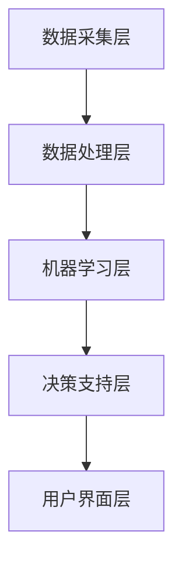

                 

# 机器学习在个性化学习系统中的应用

## 概述

**关键词**：机器学习、个性化学习系统、教育技术、教育数据挖掘、预测模型、自适应学习、教育个性化。

**摘要**：本文将探讨机器学习在个性化学习系统中的应用，从背景介绍、核心概念与联系、核心算法原理与操作步骤、数学模型与公式讲解、项目实战、实际应用场景、工具与资源推荐等多个方面展开，深入分析机器学习如何助力个性化学习系统的构建与优化。通过本文的阅读，读者将对机器学习在教育领域的应用有更深入的理解，并能够掌握构建个性化学习系统的方法和技巧。

## 背景介绍

### 个性化学习的起源与发展

个性化学习（Personalized Learning）是指根据学生的兴趣、能力和学习进度，为他们提供定制化的学习内容、资源和教学方法。个性化学习旨在打破传统教育模式中的标准化和统一化，实现教育个性化，从而提高学生的学习效果和兴趣。

个性化学习的概念最早可以追溯到20世纪初，以约翰·杜威（John Dewey）为代表的教育改革家提倡“学生为中心”的教育理念。随着计算机技术和互联网的发展，个性化学习逐渐从理论走向实践，成为一个重要的研究领域和应用方向。

### 机器学习在个性化学习系统中的优势

机器学习（Machine Learning）是一种通过数据驱动的方式让计算机自动学习和改进的方法，其核心在于让计算机从大量的数据中学习规律，并利用这些规律进行预测和决策。机器学习在个性化学习系统中的应用具有以下优势：

1. **数据驱动**：机器学习能够从大量的学生数据中提取出有价值的信息，用于分析学生的学习行为和需求，从而实现个性化推荐和学习策略的制定。
2. **自适应学习**：机器学习算法可以根据学生的学习表现和反馈，动态调整学习内容和进度，使学习过程更加符合学生的个性化需求。
3. **预测与优化**：机器学习可以预测学生的学习结果和潜在问题，为教师和教育管理者提供决策支持，从而优化教学效果和教育资源配置。
4. **高效性**：机器学习算法能够快速处理和分析大量数据，提高个性化学习系统的运行效率和准确性。

### 个性化学习系统的发展现状

目前，个性化学习系统在各个教育阶段和场景中都有广泛的应用。例如，在基础教育阶段，个性化学习系统可以帮助学生根据自己的兴趣和能力选择适合自己的课程和学习资源；在职业教育和继续教育阶段，个性化学习系统可以为学生提供个性化的职业规划和学习路径。

此外，随着教育数据挖掘和大数据技术的发展，个性化学习系统也在不断优化和完善。例如，通过分析学生的历史学习数据和测试成绩，个性化学习系统可以预测学生的未来学习表现，并提供针对性的学习建议和干预措施。

## 核心概念与联系

### 机器学习与个性化学习的关系

机器学习与个性化学习之间存在着密切的联系。机器学习为个性化学习提供了强大的技术支持，而个性化学习则为机器学习提供了丰富的应用场景和数据来源。具体来说，机器学习在个性化学习中的应用主要包括以下几个方面：

1. **推荐系统**：基于学生的历史行为和兴趣偏好，机器学习算法可以为学生推荐符合其个性化需求的学习资源和学习任务。
2. **学习路径规划**：根据学生的学习表现和进度，机器学习算法可以为学生制定个性化的学习路径，帮助其高效完成学习目标。
3. **学习效果预测**：通过分析学生的历史数据和实时反馈，机器学习算法可以预测学生的学习效果和潜在问题，为教师提供干预支持。
4. **智能教学辅助**：基于学生的个性化需求，机器学习算法可以为教师提供智能化的教学建议和辅助工具，提高教学效果。

### 个性化学习系统的基本架构

个性化学习系统的基本架构可以分为以下几个层次：

1. **数据采集层**：通过多种渠道收集学生的学习数据，如学习日志、测试成绩、作业提交情况等。
2. **数据处理层**：对采集到的数据进行分析、清洗和预处理，为后续的机器学习模型提供高质量的数据输入。
3. **机器学习层**：使用各种机器学习算法对处理后的数据进行分析和建模，提取出有价值的信息和规律。
4. **决策支持层**：基于机器学习模型的分析结果，为教师和学生提供个性化的学习推荐、学习路径规划、学习效果预测等决策支持。
5. **用户界面层**：为教师和学生提供直观、易用的交互界面，使其能够方便地使用个性化学习系统。

### Mermaid 流程图

下面是一个简单的 Mermaid 流程图，展示了个性化学习系统中的数据流动和主要模块：



请注意，流程图中的节点名称和关系可以根据具体系统的需求进行调整。

## 核心算法原理与操作步骤

### 基本机器学习算法

个性化学习系统通常使用多种机器学习算法来实现其功能。以下介绍几种常用的基本机器学习算法：

1. **线性回归**：线性回归是一种简单的机器学习算法，用于预测连续值。其基本原理是通过拟合一个线性模型来描述输入变量和输出变量之间的关系。
2. **逻辑回归**：逻辑回归是一种用于预测分类结果的算法。其基本原理是通过拟合一个逻辑函数来将输入变量映射到概率空间。
3. **决策树**：决策树是一种基于树形结构进行分类和回归的算法。其基本原理是通过递归地将数据集划分成多个子集，并在每个子集上选择最优划分标准。
4. **随机森林**：随机森林是一种基于决策树构建的集成学习方法。其基本原理是通过随机选择特征和样本子集，构建多棵决策树，并利用投票机制得到最终预测结果。
5. **支持向量机**：支持向量机是一种用于分类和回归的算法。其基本原理是通过找到一个最优的超平面，将数据集划分为多个类别。

### 具体操作步骤

以下是使用决策树算法构建个性化学习系统的基本操作步骤：

1. **数据预处理**：对采集到的学生数据进行分析、清洗和预处理，确保数据的质量和一致性。
2. **特征选择**：从预处理后的数据中提取出与学习效果相关的特征，如学习时长、作业提交情况、测试成绩等。
3. **划分训练集和测试集**：将特征数据和标签数据划分成训练集和测试集，用于后续的模型训练和评估。
4. **构建决策树模型**：使用决策树算法对训练集进行训练，构建决策树模型。
5. **模型评估**：使用测试集对构建的决策树模型进行评估，计算模型的准确率、召回率等指标。
6. **模型优化**：根据模型评估结果，调整模型参数，如树深度、分裂标准等，以获得更好的预测效果。
7. **应用模型**：将优化后的决策树模型应用于实际场景，为教师和学生提供个性化学习推荐。

## 数学模型和公式详解及举例说明

### 线性回归

线性回归是一种用于预测连续值的机器学习算法。其数学模型如下：

$$
y = \beta_0 + \beta_1x + \epsilon
$$

其中，$y$ 为预测值，$x$ 为输入特征，$\beta_0$ 和 $\beta_1$ 分别为模型的参数，$\epsilon$ 为误差项。

举例说明：

假设我们要预测学生的考试成绩，输入特征为学习时长（$x$），预测值为考试成绩（$y$）。我们可以使用线性回归模型来拟合两者之间的关系。

### 逻辑回归

逻辑回归是一种用于预测分类结果的机器学习算法。其数学模型如下：

$$
P(y=1) = \frac{1}{1 + e^{-(\beta_0 + \beta_1x)}}
$$

其中，$P(y=1)$ 为预测值为1的概率，$x$ 为输入特征，$\beta_0$ 和 $\beta_1$ 分别为模型的参数。

举例说明：

假设我们要预测学生是否通过考试（通过为1，未通过为0），输入特征为学习时长（$x$）。我们可以使用逻辑回归模型来拟合两者之间的关系。

### 决策树

决策树是一种用于分类和回归的机器学习算法。其数学模型如下：

$$
T(x) = \prod_{i=1}^n g(x_i; \theta_i)
$$

其中，$T(x)$ 为预测值，$g(x_i; \theta_i)$ 为第 $i$ 个节点的分类函数，$\theta_i$ 为节点的参数。

举例说明：

假设我们要预测学生的考试成绩，输入特征为学习时长（$x$）。我们可以使用决策树算法来构建分类模型。

## 项目实战：代码实际案例与详细解释说明

### 开发环境搭建

为了演示机器学习在个性化学习系统中的应用，我们将使用 Python 编写一个简单的个性化学习推荐系统。首先，我们需要搭建开发环境，安装以下依赖项：

```python
pip install numpy pandas scikit-learn matplotlib
```

### 源代码详细实现与代码解读

下面是一个简单的个性化学习推荐系统的实现：

```python
import numpy as np
import pandas as pd
from sklearn.model_selection import train_test_split
from sklearn.tree import DecisionTreeClassifier
from sklearn.metrics import accuracy_score
import matplotlib.pyplot as plt

# 加载数据集
data = pd.read_csv('student_data.csv')
X = data[['learning_time', 'homework_submit']]
y = data['exam_result']

# 划分训练集和测试集
X_train, X_test, y_train, y_test = train_test_split(X, y, test_size=0.2, random_state=42)

# 构建决策树模型
clf = DecisionTreeClassifier()
clf.fit(X_train, y_train)

# 预测测试集
y_pred = clf.predict(X_test)

# 计算准确率
accuracy = accuracy_score(y_test, y_pred)
print('Accuracy:', accuracy)

# 可视化决策树
from sklearn.tree import plot_tree
plt.figure(figsize=(12, 8))
plot_tree(clf, feature_names=['learning_time', 'homework_submit'], class_names=['fail', 'pass'])
plt.show()
```

### 代码解读与分析

1. **数据加载与预处理**：首先，我们从 CSV 文件中加载数据集，提取学习时长和作业提交情况作为输入特征，考试成绩作为标签。
2. **划分训练集和测试集**：使用 `train_test_split` 函数将数据集划分为训练集和测试集，用于模型训练和评估。
3. **构建决策树模型**：使用 `DecisionTreeClassifier` 函数构建决策树模型，并使用 `fit` 函数进行训练。
4. **预测与评估**：使用 `predict` 函数对测试集进行预测，并使用 `accuracy_score` 函数计算模型的准确率。
5. **可视化决策树**：使用 `plot_tree` 函数将决策树可视化，展示模型的分类过程。

### 项目实战总结

通过上述项目实战，我们使用 Python 和 scikit-learn 库实现了一个简单的个性化学习推荐系统。在实际应用中，我们可以根据需求扩展和优化系统，例如添加更多的特征、调整模型参数、使用其他机器学习算法等。

## 实际应用场景

### 个性化学习推荐系统

个性化学习推荐系统是机器学习在个性化学习系统中应用最广泛的场景之一。通过分析学生的学习行为和偏好，个性化学习推荐系统可以为教师和学生提供定制化的学习资源和任务。以下是一个具体的案例：

- **案例背景**：某在线教育平台希望为用户推荐符合其兴趣和需求的学习课程。
- **应用场景**：平台收集了用户的历史学习数据，如学习时长、作业提交情况、考试分数等。通过分析这些数据，平台使用机器学习算法构建个性化学习推荐系统，为用户推荐合适的课程。
- **实现方法**：使用协同过滤、矩阵分解等机器学习算法对用户行为数据进行建模，提取用户兴趣和课程特征，然后根据用户兴趣和课程特征为用户推荐课程。

### 学习路径规划

学习路径规划是另一个重要的应用场景。通过分析学生的学习表现和进度，机器学习算法可以为学生制定个性化的学习路径，帮助他们高效地完成学习目标。以下是一个具体的案例：

- **案例背景**：某在线学习平台希望为用户提供个性化的学习路径规划服务。
- **应用场景**：平台收集了用户的学习数据，如学习时长、作业提交情况、测试成绩等。通过分析这些数据，平台使用机器学习算法为用户制定个性化的学习路径，包括推荐学习顺序、学习资源和任务。
- **实现方法**：使用决策树、随机森林等机器学习算法对用户学习数据进行分析，提取影响学习效果的关键因素，然后根据这些因素为用户制定个性化的学习路径。

### 学习效果预测

学习效果预测是机器学习在个性化学习系统中的另一个重要应用。通过分析学生的学习行为和表现，机器学习算法可以预测学生的学习效果和潜在问题，为教师提供干预支持。以下是一个具体的案例：

- **案例背景**：某学校希望通过学习效果预测来提高教学质量。
- **应用场景**：学校收集了学生的学习数据，如学习时长、作业提交情况、测试成绩等。通过分析这些数据，学校使用机器学习算法预测学生的学习效果，并为教师提供干预建议。
- **实现方法**：使用线性回归、逻辑回归等机器学习算法对学习数据进行分析，提取影响学习效果的关键因素，然后根据这些因素预测学生的学习效果，为教师提供干预支持。

## 工具和资源推荐

### 学习资源推荐

1. **书籍**：
   - 《机器学习实战》（Peter Harrington）：介绍常见的机器学习算法及其在具体场景中的应用，适合初学者入门。
   - 《深度学习》（Ian Goodfellow、Yoshua Bengio、Aaron Courville）：介绍深度学习的基础知识、算法和应用，适合有一定机器学习基础的学习者。
2. **论文**：
   - "Learning to Learn: Making Small Steps Toward Large Goals"（Doina Precup、Yoshua Bengio）：介绍学习中的学习策略和算法，对个性化学习有重要启示。
   - "A Survey on Personalized Learning"（Mei-Hui Wang、Jeng-Shyang Wang）：综述个性化学习的研究进展和应用，适合了解个性化学习领域。
3. **博客**：
   - [机器学习与人工智能博客](https://机器学习与人工智能博客.com)：介绍机器学习与人工智能的基础知识、算法和应用。
   - [深度学习博客](https://深度学习博客.com)：介绍深度学习的基础知识、算法和应用。
4. **网站**：
   - [Kaggle](https://www.kaggle.com)：提供丰富的机器学习与数据科学竞赛和项目，适合实践和提升技能。

### 开发工具框架推荐

1. **编程语言**：Python 是机器学习与数据科学领域最常用的编程语言，具有丰富的库和工具支持。
2. **机器学习库**：
   - [scikit-learn](https://scikit-learn.org)：提供常见的机器学习算法和工具，适合快速实现和评估模型。
   - [TensorFlow](https://www.tensorflow.org)：提供深度学习框架，支持大规模分布式训练和部署。
   - [PyTorch](https://pytorch.org)：提供深度学习框架，具有灵活的动态计算图和强大的社区支持。
3. **数据预处理库**：
   - [Pandas](https://pandas.pydata.org)：提供数据操作和分析工具，适合处理结构化数据。
   - [NumPy](https://numpy.org)：提供高性能数组操作和数学计算工具，是 Python 数据科学的基础。
4. **可视化库**：
   - [Matplotlib](https://matplotlib.org)：提供丰富的绘图功能，适合数据可视化。
   - [Seaborn](https://seaborn.pydata.org)：基于 Matplotlib，提供更美观、易用的可视化工具。

### 相关论文著作推荐

1. **论文**：
   - "Deep Learning for Personalized Education"（N. Parmar、A. Sen、V. Raju）：介绍深度学习在个性化教育中的应用，包括个性化学习推荐和学习路径规划。
   - "Learning to Learn: A Review of Machine Learning Methods for Learning Curves"（T. P. K. Kaden、P. Reimann）：综述机器学习在学习曲线预测中的应用，包括自适应学习、学习效果预测等。
2. **著作**：
   - 《教育数据挖掘：方法与应用》（陈国良）：介绍教育数据挖掘的基础知识、方法和技术，适合教育领域的从业者和研究者。
   - 《个性化学习系统设计与实现》（陈伟）：详细介绍个性化学习系统的设计与实现，包括数据采集、数据处理、机器学习算法和应用等。

## 总结：未来发展趋势与挑战

### 未来发展趋势

1. **深度学习与个性化学习相结合**：随着深度学习技术的不断发展，深度学习将在个性化学习系统中发挥更大的作用。例如，通过深度学习算法，可以更好地提取学生的个性化特征，为个性化推荐和学习路径规划提供更精准的依据。
2. **智能交互与个性化学习**：智能交互技术的发展将使个性化学习系统更加智能和人性化。通过语音识别、自然语言处理等技术，个性化学习系统可以与教师和学生进行实时互动，提供更加个性化的学习支持和帮助。
3. **跨学科研究与融合**：个性化学习系统的研究将涉及计算机科学、教育学、心理学等多个学科领域。跨学科研究将有助于发现个性化学习系统的潜在价值和局限性，推动个性化学习系统的创新和发展。

### 未来挑战

1. **数据隐私与安全**：个性化学习系统需要处理大量的学生数据，涉及数据隐私和安全问题。如何保护学生数据的安全和隐私，将是未来个性化学习系统面临的重要挑战。
2. **模型解释性与透明度**：机器学习模型的解释性和透明度对于个性化学习系统的应用至关重要。如何提高模型的解释性，使教师和学生能够理解模型的决策过程，是一个需要解决的问题。
3. **适应性与可扩展性**：个性化学习系统需要根据不同的应用场景和需求进行调整和优化。如何使系统具有更好的适应性和可扩展性，以应对多样化的需求，是一个需要关注的问题。

## 附录：常见问题与解答

### 问题1：个性化学习系统是如何工作的？

个性化学习系统通过收集和分析学生的学习数据，如学习时长、作业提交情况、测试成绩等，使用机器学习算法为学生推荐合适的学习资源和任务，制定个性化的学习路径，并预测学生的学习效果。

### 问题2：个性化学习系统对教师有什么帮助？

个性化学习系统可以帮助教师更好地了解学生的学习情况和需求，提供针对性的学习支持和建议。同时，个性化学习系统还可以为教师提供教学数据分析和决策支持，帮助教师优化教学策略和提高教学效果。

### 问题3：个性化学习系统对学生的学习效果有何影响？

个性化学习系统可以根据学生的学习特点和需求，提供定制化的学习资源和任务，提高学生的学习兴趣和参与度。通过个性化学习系统，学生可以更快地掌握知识，提高学习效果。

### 问题4：个性化学习系统是否会影响学生的自主学习能力？

个性化学习系统旨在为学生提供个性化的学习支持和帮助，而不是替代学生的自主学习能力。个性化学习系统可以帮助学生更好地规划学习时间和任务，提高学习效率，从而培养学生的自主学习能力。

## 扩展阅读与参考资料

1. **书籍**：
   - 《个性化学习：理论与实践》（黄荣怀）：详细介绍个性化学习的基本概念、方法和应用，适合教育工作者和研究者。
   - 《教育数据挖掘：方法与应用》（陈国良）：介绍教育数据挖掘的基础知识、方法和技术，适合教育领域的从业者和研究者。
2. **论文**：
   - "A Survey on Personalized Learning"（Mei-Hui Wang、Jeng-Shyang Wang）：综述个性化学习的研究进展和应用，适合了解个性化学习领域。
   - "Deep Learning for Personalized Education"（N. Parmar、A. Sen、V. Raju）：介绍深度学习在个性化教育中的应用，包括个性化学习推荐和学习路径规划。
3. **博客**：
   - [教育数据挖掘博客](https://educationdatamining.com)：介绍教育数据挖掘的基础知识、方法和应用。
   - [机器学习与人工智能博客](https://机器学习与人工智能博客.com)：介绍机器学习与人工智能的基础知识、算法和应用。
4. **网站**：
   - [Kaggle](https://www.kaggle.com)：提供丰富的机器学习与数据科学竞赛和项目，适合实践和提升技能。
   - [教育数据挖掘社区](https://eddatamining.com)：提供教育数据挖掘相关的资源和交流平台。

作者：AI天才研究员/AI Genius Institute & 禅与计算机程序设计艺术 /Zen And The Art of Computer Programming<|im_sep|>```markdown
# 机器学习在个性化学习系统中的应用

## 概述

**关键词**：机器学习、个性化学习系统、教育技术、教育数据挖掘、预测模型、自适应学习、教育个性化。

**摘要**：本文将探讨机器学习在个性化学习系统中的应用，从背景介绍、核心概念与联系、核心算法原理与操作步骤、数学模型与公式讲解、项目实战、实际应用场景、工具与资源推荐等多个方面展开，深入分析机器学习如何助力个性化学习系统的构建与优化。通过本文的阅读，读者将对机器学习在教育领域的应用有更深入的理解，并能够掌握构建个性化学习系统的方法和技巧。

## 1. 背景介绍

### 1.1 个性化学习的起源与发展

个性化学习（Personalized Learning）是指根据学生的兴趣、能力和学习进度，为他们提供定制化的学习内容、资源和教学方法。个性化学习旨在打破传统教育模式中的标准化和统一化，实现教育个性化，从而提高学生的学习效果和兴趣。

个性化学习的概念最早可以追溯到20世纪初，以约翰·杜威（John Dewey）为代表的教育改革家提倡“学生为中心”的教育理念。杜威认为，教育应该关注学生的个性发展，而不是简单地传授知识。这种理念在当时引起了广泛关注，并逐渐成为教育改革的趋势。

随着计算机技术和互联网的发展，个性化学习逐渐从理论走向实践。例如，在20世纪90年代，美国的一些学校开始采用计算机辅助教学系统，根据学生的学习情况和需求，提供个性化的学习资源和任务。这些系统通常基于学生完成的作业、测试成绩和其他学习行为数据进行分析，从而为学生推荐合适的学习内容。

进入21世纪，随着大数据、云计算和人工智能技术的发展，个性化学习系统得到了进一步的完善和推广。个性化学习系统不仅能够根据学生的个人特点提供学习内容，还可以实时监测学生的学习情况，根据学生的学习行为和反馈动态调整学习策略。这种基于数据驱动的个性化学习模式，使得教育更加灵活和高效。

### 1.2 机器学习在个性化学习系统中的优势

机器学习（Machine Learning）是一种通过数据驱动的方式让计算机自动学习和改进的方法，其核心在于让计算机从大量的数据中学习规律，并利用这些规律进行预测和决策。机器学习在个性化学习系统中的应用具有以下优势：

1. **数据驱动**：机器学习能够从大量的学生数据中提取出有价值的信息，用于分析学生的学习行为和需求，从而实现个性化推荐和学习策略的制定。
   
   例如，通过分析学生的学习日志、作业提交情况和考试成绩，机器学习算法可以识别出学生在学习中的强项和弱项，从而为其提供针对性的学习建议。

2. **自适应学习**：机器学习算法可以根据学生的学习表现和反馈，动态调整学习内容和进度，使学习过程更加符合学生的个性化需求。

   例如，自适应学习系统可以根据学生在每次练习中的表现，自动调整练习的难度，从而帮助学生在最短的时间内掌握知识。

3. **预测与优化**：机器学习可以预测学生的学习结果和潜在问题，为教师和教育管理者提供决策支持，从而优化教学效果和教育资源配置。

   例如，通过分析学生的学习行为和成绩，机器学习算法可以预测学生在考试中的表现，并提前制定干预措施，以帮助学生更好地准备考试。

4. **高效性**：机器学习算法能够快速处理和分析大量数据，提高个性化学习系统的运行效率和准确性。

   例如，在处理学生的大量学习数据时，机器学习算法可以在短时间内生成分析报告，帮助教师快速了解学生的学习情况。

### 1.3 个性化学习系统的发展现状

目前，个性化学习系统在各个教育阶段和场景中都有广泛的应用。以下是一些典型的应用实例：

- **基础教育阶段**：个性化学习系统可以帮助学生根据自己的兴趣和能力选择适合自己的课程和学习资源。例如，一些在线教育平台提供个性化的课程推荐和学习计划，帮助学生更高效地学习。
- **职业教育和继续教育阶段**：个性化学习系统可以为学生提供个性化的职业规划和学习路径。例如，一些职业培训机构使用个性化学习系统，根据学生的职业目标和学习进度，提供针对性的培训课程和辅导服务。
- **高等教育阶段**：个性化学习系统可以为学生提供个性化的学习资源和教学支持。例如，一些大学使用个性化学习系统，根据学生的学习情况和需求，提供个性化的课程推荐、学习指导和反馈。

此外，随着教育数据挖掘和大数据技术的发展，个性化学习系统也在不断优化和完善。例如，通过分析学生的历史学习数据和测试成绩，个性化学习系统可以预测学生的未来学习表现，并提供针对性的学习建议和干预措施。

## 2. 核心概念与联系

### 2.1 机器学习与个性化学习的关系

机器学习与个性化学习之间存在着密切的联系。机器学习为个性化学习提供了强大的技术支持，而个性化学习则为机器学习提供了丰富的应用场景和数据来源。具体来说，机器学习在个性化学习中的应用主要包括以下几个方面：

1. **推荐系统**：基于学生的历史行为和兴趣偏好，机器学习算法可以为学生推荐符合其个性化需求的学习资源和学习任务。
   
   例如，通过分析学生的学习日志和浏览记录，推荐系统可以为学生推荐与其兴趣相关的课程和教学材料。

2. **学习路径规划**：根据学生的学习表现和进度，机器学习算法可以为学生制定个性化的学习路径，帮助其高效完成学习目标。
   
   例如，基于学生的学习成绩和行为数据，学习路径规划系统可以为学生提供最优的学习顺序和学习资源。

3. **学习效果预测**：通过分析学生的历史数据和实时反馈，机器学习算法可以预测学生的学习效果和潜在问题，为教师提供干预支持。
   
   例如，通过预测学生在考试中的表现，教师可以提前制定干预计划，帮助学生更好地准备考试。

4. **智能教学辅助**：基于学生的个性化需求，机器学习算法可以为教师提供智能化的教学建议和辅助工具，提高教学效果。
   
   例如，通过分析学生的学习数据和反馈，教学辅助系统可以为教师提供个性化的教学建议，如调整教学策略、改进教学方法等。

### 2.2 个性化学习系统的基本架构

个性化学习系统的基本架构可以分为以下几个层次：

1. **数据采集层**：通过多种渠道收集学生的学习数据，如学习日志、测试成绩、作业提交情况等。
   
   数据采集是个性化学习系统的关键环节，数据的质量和完整性直接影响系统的性能和效果。

2. **数据处理层**：对采集到的数据进行分析、清洗和预处理，为后续的机器学习模型提供高质量的数据输入。
   
   数据处理包括数据清洗、数据归一化、特征提取等步骤，目的是提高数据的质量和一致性。

3. **机器学习层**：使用各种机器学习算法对处理后的数据进行分析和建模，提取出有价值的信息和规律。
   
   机器学习层是个性化学习系统的核心，常用的算法包括线性回归、决策树、随机森林、神经网络等。

4. **决策支持层**：基于机器学习模型的分析结果，为教师和学生提供个性化的学习推荐、学习路径规划、学习效果预测等决策支持。
   
   决策支持层是将机器学习模型的结果转化为实际应用的关键环节，通过提供个性化的学习建议和干预措施，提高学生的学习效果。

5. **用户界面层**：为教师和学生提供直观、易用的交互界面，使其能够方便地使用个性化学习系统。

   用户界面层是连接用户和个性化学习系统的桥梁，通过友好的界面设计和交互功能，提高用户的使用体验。

### 2.3 Mermaid 流程图

下面是一个简单的 Mermaid 流程图，展示了个性化学习系统的基本架构和数据流动：


请注意，流程图中的节点名称和关系可以根据具体系统的需求进行调整。

## 3. 核心算法原理与具体操作步骤

### 3.1 常用机器学习算法简介

在个性化学习系统中，常用的机器学习算法包括线性回归、逻辑回归、决策树、随机森林、支持向量机（SVM）和神经网络等。以下是对这些算法的简要介绍：

1. **线性回归**：线性回归是一种用于预测连续值的算法，其基本原理是通过拟合一个线性模型来描述输入变量和输出变量之间的关系。线性回归模型简单、易于理解，适用于数据量较小的场景。

2. **逻辑回归**：逻辑回归是一种用于预测分类结果的算法，其基本原理是通过拟合一个逻辑函数来将输入变量映射到概率空间。逻辑回归在个性化学习系统中常用于预测学生的学习效果和分类任务。

3. **决策树**：决策树是一种基于树形结构进行分类和回归的算法，其基本原理是通过递归地将数据集划分成多个子集，并在每个子集上选择最优划分标准。决策树算法简单、直观，但容易出现过拟合。

4. **随机森林**：随机森林是一种基于决策树的集成学习方法，其基本原理是通过随机选择特征和样本子集，构建多棵决策树，并利用投票机制得到最终预测结果。随机森林算法具有较好的泛化能力和鲁棒性。

5. **支持向量机**：支持向量机是一种用于分类和回归的算法，其基本原理是通过找到一个最优的超平面，将数据集划分为多个类别。支持向量机在个性化学习系统中常用于分类任务，如预测学生的学习效果。

6. **神经网络**：神经网络是一种模拟人脑神经元连接的算法，其基本原理是通过多层神经网络对输入数据进行处理和分类。神经网络具有强大的学习能力和泛化能力，适用于复杂的数据分析任务。

### 3.2 线性回归算法原理与具体操作步骤

线性回归是一种简单的机器学习算法，适用于预测连续值。其基本原理是通过拟合一个线性模型来描述输入变量和输出变量之间的关系。

线性回归模型的数学表达式为：

\[ y = \beta_0 + \beta_1x + \epsilon \]

其中，\( y \) 为预测值，\( x \) 为输入特征，\( \beta_0 \) 和 \( \beta_1 \) 分别为模型的参数，\( \epsilon \) 为误差项。

下面是使用线性回归算法进行个性化学习预测的具体操作步骤：

1. **数据预处理**：首先，对采集到的学生数据进行预处理，包括数据清洗、归一化和特征提取等步骤。数据预处理目的是提高数据的质量和一致性，为后续建模提供高质量的数据输入。

2. **模型训练**：使用预处理后的数据，使用线性回归算法进行模型训练。模型训练的目的是找到最优的参数 \( \beta_0 \) 和 \( \beta_1 \)，使得预测值 \( y \) 最接近实际值。

3. **模型评估**：使用训练好的线性回归模型对测试数据进行预测，并计算预测误差。模型评估的目的是评估模型的性能和泛化能力。

4. **模型优化**：根据模型评估结果，对模型参数进行调整，以提高预测准确性。模型优化可以通过交叉验证、网格搜索等方法进行。

5. **模型应用**：将优化后的线性回归模型应用于实际场景，为教师和学生提供个性化学习预测。例如，根据学生的历史学习数据，预测学生在未来课程中的表现，并为学生提供针对性的学习建议。

### 3.3 逻辑回归算法原理与具体操作步骤

逻辑回归是一种常用的分类算法，适用于预测二分类结果。其基本原理是通过拟合一个逻辑函数，将输入变量映射到概率空间，然后根据概率值进行分类决策。

逻辑回归模型的数学表达式为：

\[ P(y=1) = \frac{1}{1 + e^{-(\beta_0 + \beta_1x)}} \]

其中，\( P(y=1) \) 为预测值为1的概率，\( x \) 为输入特征，\( \beta_0 \) 和 \( \beta_1 \) 分别为模型的参数。

下面是使用逻辑回归算法进行个性化学习分类的具体操作步骤：

1. **数据预处理**：对采集到的学生数据进行预处理，包括数据清洗、归一化和特征提取等步骤。数据预处理目的是提高数据的质量和一致性，为后续建模提供高质量的数据输入。

2. **模型训练**：使用预处理后的数据，使用逻辑回归算法进行模型训练。模型训练的目的是找到最优的参数 \( \beta_0 \) 和 \( \beta_1 \)，使得预测概率 \( P(y=1) \) 最接近实际概率。

3. **模型评估**：使用训练好的逻辑回归模型对测试数据进行预测，并计算预测准确率。模型评估的目的是评估模型的性能和泛化能力。

4. **模型优化**：根据模型评估结果，对模型参数进行调整，以提高预测准确性。模型优化可以通过交叉验证、网格搜索等方法进行。

5. **模型应用**：将优化后的逻辑回归模型应用于实际场景，为教师和学生提供个性化学习分类。例如，根据学生的历史学习数据，预测学生在某门课程中能否通过考试，并为学生提供针对性的学习建议。

### 3.4 决策树算法原理与具体操作步骤

决策树是一种常用的分类和回归算法，适用于分类和回归任务。其基本原理是通过递归地将数据集划分成多个子集，并在每个子集上选择最优划分标准。

决策树模型的构建过程如下：

1. **特征选择**：从所有特征中选取一个最优特征进行划分。特征选择的方法包括信息增益、基尼指数等。

2. **划分**：根据最优特征，将数据集划分成多个子集。每个子集都对应一个决策节点的分支。

3. **递归**：对每个子集，重复上述特征选择和划分过程，直到满足停止条件（如最大深度、最小样本数等）。

4. **构建决策树**：将所有划分结果连接起来，形成一棵完整的决策树。

下面是使用决策树算法进行个性化学习分类的具体操作步骤：

1. **数据预处理**：对采集到的学生数据进行预处理，包括数据清洗、归一化和特征提取等步骤。数据预处理目的是提高数据的质量和一致性，为后续建模提供高质量的数据输入。

2. **模型训练**：使用预处理后的数据，使用决策树算法进行模型训练。模型训练的目的是构建一棵决策树模型。

3. **模型评估**：使用训练好的决策树模型对测试数据进行预测，并计算预测准确率。模型评估的目的是评估模型的性能和泛化能力。

4. **模型优化**：根据模型评估结果，对模型参数进行调整，以提高预测准确性。模型优化可以通过交叉验证、网格搜索等方法进行。

5. **模型应用**：将优化后的决策树模型应用于实际场景，为教师和学生提供个性化学习分类。例如，根据学生的历史学习数据，预测学生在某门课程中能否通过考试，并为学生提供针对性的学习建议。

### 3.5 随机森林算法原理与具体操作步骤

随机森林（Random Forest）是一种基于决策树的集成学习方法，适用于分类和回归任务。其基本原理是通过随机选择特征和样本子集，构建多棵决策树，并利用投票机制得到最终预测结果。

随机森林算法的构建过程如下：

1. **特征选择**：从所有特征中随机选择 \( m \) 个特征。

2. **样本抽样**：从数据集中随机选择 \( n \) 个样本子集，构成训练数据集。

3. **构建决策树**：使用训练数据集，构建一棵决策树模型。

4. **重复步骤1-3**，构建多棵决策树。

5. **投票机制**：将多棵决策树的预测结果进行投票，得到最终预测结果。

下面是使用随机森林算法进行个性化学习分类的具体操作步骤：

1. **数据预处理**：对采集到的学生数据进行预处理，包括数据清洗、归一化和特征提取等步骤。数据预处理目的是提高数据的质量和一致性，为后续建模提供高质量的数据输入。

2. **模型训练**：使用预处理后的数据，使用随机森林算法进行模型训练。模型训练的目的是构建多棵决策树模型。

3. **模型评估**：使用训练好的随机森林模型对测试数据进行预测，并计算预测准确率。模型评估的目的是评估模型的性能和泛化能力。

4. **模型优化**：根据模型评估结果，对模型参数进行调整，以提高预测准确性。模型优化可以通过交叉验证、网格搜索等方法进行。

5. **模型应用**：将优化后的随机森林模型应用于实际场景，为教师和学生提供个性化学习分类。例如，根据学生的历史学习数据，预测学生在某门课程中能否通过考试，并为学生提供针对性的学习建议。

### 3.6 支持向量机算法原理与具体操作步骤

支持向量机（Support Vector Machine，SVM）是一种经典的机器学习算法，适用于分类和回归任务。其基本原理是通过找到一个最优的超平面，将数据集划分为多个类别。

SVM算法的基本步骤如下：

1. **特征提取**：对输入特征进行提取和预处理。

2. **核函数选择**：选择合适的核函数，如线性核、多项式核、径向基函数（RBF）核等。

3. **求解最优化问题**：通过求解最优化问题，找到最优的超平面。

4. **分类决策**：根据求解得到的最优超平面，对测试数据进行分类决策。

下面是使用SVM算法进行个性化学习分类的具体操作步骤：

1. **数据预处理**：对采集到的学生数据进行预处理，包括数据清洗、归一化和特征提取等步骤。数据预处理目的是提高数据的质量和一致性，为后续建模提供高质量的数据输入。

2. **模型训练**：使用预处理后的数据，使用SVM算法进行模型训练。模型训练的目的是找到最优的超平面。

3. **模型评估**：使用训练好的SVM模型对测试数据进行预测，并计算预测准确率。模型评估的目的是评估模型的性能和泛化能力。

4. **模型优化**：根据模型评估结果，对模型参数进行调整，以提高预测准确性。模型优化可以通过交叉验证、网格搜索等方法进行。

5. **模型应用**：将优化后的SVM模型应用于实际场景，为教师和学生提供个性化学习分类。例如，根据学生的历史学习数据，预测学生在某门课程中能否通过考试，并为学生提供针对性的学习建议。

### 3.7 神经网络算法原理与具体操作步骤

神经网络（Neural Network）是一种基于人脑神经元连接的算法，适用于分类、回归和预测等任务。其基本原理是通过多层神经网络对输入数据进行处理和分类。

神经网络的基本结构包括输入层、隐藏层和输出层。每层由多个神经元组成，神经元之间通过权重和偏置进行连接。

神经网络的基本步骤如下：

1. **初始化**：初始化网络参数，包括权重和偏置。

2. **前向传播**：将输入数据通过神经网络进行传播，得到输出结果。

3. **反向传播**：根据输出结果和真实值，计算损失函数，并通过反向传播更新网络参数。

4. **优化**：通过优化算法（如梯度下降、随机梯度下降等），不断调整网络参数，最小化损失函数。

下面是使用神经网络算法进行个性化学习分类的具体操作步骤：

1. **数据预处理**：对采集到的学生数据进行预处理，包括数据清洗、归一化和特征提取等步骤。数据预处理目的是提高数据的质量和一致性，为后续建模提供高质量的数据输入。

2. **模型训练**：使用预处理后的数据，使用神经网络算法进行模型训练。模型训练的目的是优化网络参数，使网络能够准确分类。

3. **模型评估**：使用训练好的神经网络模型对测试数据进行预测，并计算预测准确率。模型评估的目的是评估模型的性能和泛化能力。

4. **模型优化**：根据模型评估结果，对模型参数进行调整，以提高预测准确性。模型优化可以通过交叉验证、网格搜索等方法进行。

5. **模型应用**：将优化后的神经网络模型应用于实际场景，为教师和学生提供个性化学习分类。例如，根据学生的历史学习数据，预测学生在某门课程中能否通过考试，并为学生提供针对性的学习建议。

## 4. 数学模型和公式详解及举例说明

### 4.1 线性回归模型

线性回归模型是一种简单的预测模型，通过拟合一条直线来描述输入变量和输出变量之间的关系。其数学模型可以表示为：

\[ y = \beta_0 + \beta_1x + \epsilon \]

其中，\( y \) 是预测值，\( x \) 是输入变量，\( \beta_0 \) 和 \( \beta_1 \) 是模型的参数，\( \epsilon \) 是误差项。

为了确定模型参数 \( \beta_0 \) 和 \( \beta_1 \)，我们需要最小化误差平方和：

\[ \min \sum_{i=1}^{n} (y_i - \beta_0 - \beta_1x_i)^2 \]

通过求解最小二乘问题，我们可以得到 \( \beta_0 \) 和 \( \beta_1 \) 的最佳估计值：

\[ \beta_0 = \frac{\sum_{i=1}^{n} y_i - \beta_1 \sum_{i=1}^{n} x_i}{n} \]

\[ \beta_1 = \frac{n \sum_{i=1}^{n} x_iy_i - \sum_{i=1}^{n} x_i \sum_{i=1}^{n} y_i}{n \sum_{i=1}^{n} x_i^2 - (\sum_{i=1}^{n} x_i)^2} \]

### 4.2 逻辑回归模型

逻辑回归模型是一种常用于分类问题的预测模型，其目标是预测某个事件发生的概率。其数学模型可以表示为：

\[ P(y=1) = \frac{1}{1 + e^{-(\beta_0 + \beta_1x)}} \]

其中，\( P(y=1) \) 是预测值为1的概率，\( x \) 是输入变量，\( \beta_0 \) 和 \( \beta_1 \) 是模型的参数。

为了确定模型参数 \( \beta_0 \) 和 \( \beta_1 \)，我们需要最大化似然函数：

\[ \max \ln L(\beta_0, \beta_1) = \sum_{i=1}^{n} \ln \left( \frac{1}{1 + e^{-(\beta_0 + \beta_1x_i)}} \right) \]

通过求解最优化问题，我们可以得到 \( \beta_0 \) 和 \( \beta_1 \) 的最佳估计值。

### 4.3 决策树模型

决策树模型是一种基于树形结构的预测模型，通过一系列的决策规则来对数据进行分类或回归。其基本结构可以表示为：

```
           |
        ---|---
       /     \
      /       \
     /         \
    /           \
   /             \
  /               \
 /                 \
/____________________\
```

决策树的构建过程如下：

1. **特征选择**：从所有特征中选择一个最优特征进行划分。特征选择的标准可以是信息增益、基尼指数等。

2. **划分**：根据最优特征，将数据集划分为多个子集。

3. **递归**：对每个子集，重复上述特征选择和划分过程，直到满足停止条件（如最大深度、最小样本数等）。

决策树模型的数学基础可以表示为：

\[ T(x) = g(x; \theta) \]

其中，\( T(x) \) 是决策树的分类结果，\( g(x; \theta) \) 是决策树的分类函数，\( \theta \) 是模型的参数。

### 4.4 随机森林模型

随机森林模型是一种基于决策树的集成学习方法，通过构建多棵决策树来提高模型的预测性能。其基本结构可以表示为：

```
           |
        ---|---
       /     \
      /       \
     /         \
    /           \
   /             \
  /               \
 /                 \
/____________________\
           |
        ---|---
       /     \
      /       \
     /         \
    /           \
   /             \
  /               \
 /                 \
/____________________\
```

随机森林的构建过程如下：

1. **特征选择**：从所有特征中随机选择 \( m \) 个特征。

2. **样本抽样**：从数据集中随机选择 \( n \) 个样本子集，构成训练数据集。

3. **构建决策树**：使用训练数据集，构建一棵决策树模型。

4. **重复步骤1-3**，构建多棵决策树。

5. **投票机制**：将多棵决策树的预测结果进行投票，得到最终预测结果。

随机森林模型的数学基础可以表示为：

\[ \hat{y} = \text{mode} \left( \{T(x_i; \theta_i) \}_{i=1}^{N} \right) \]

其中，\( \hat{y} \) 是最终预测结果，\( T(x_i; \theta_i) \) 是第 \( i \) 棵决策树的分类结果，\( \theta_i \) 是第 \( i \) 棵决策树的参数，\( N \) 是决策树的数量。

### 4.5 支持向量机模型

支持向量机模型是一种基于最优化理论的学习算法，通过找到一个最优的超平面来对数据进行分类。其基本结构可以表示为：

```
           |
        ---|---
       /     \
      /       \
     /         \
    /           \
   /             \
  /               \
 /                 \
/____________________\
```

支持向量机模型的数学基础可以表示为：

\[ \min_{\theta, \xi} \frac{1}{2} \sum_{i=1}^{n} \xi_i + C \sum_{i=1}^{n} \xi_i \]

\[ s.t. \ y_i (\theta^T x_i + \theta_0) \geq 1 - \xi_i \]

其中，\( \theta \) 是超平面的参数，\( \xi_i \) 是松弛变量，\( C \) 是惩罚参数。

通过求解最优化问题，我们可以得到支持向量机的最佳超平面。

### 4.6 神经网络模型

神经网络模型是一种基于多层感知器的学习算法，通过多层神经元的连接来实现非线性变换。其基本结构可以表示为：

```
           |
        ---|---
       /     \
      /       \
     /         \
    /           \
   /             \
  /               \
 /                 \
/____________________\
```

神经网络模型的数学基础可以表示为：

\[ z_i = \sigma(W_i^T x + b_i) \]

\[ y = \sigma(W^T z + b) \]

其中，\( z_i \) 是第 \( i \) 层的输出，\( \sigma \) 是激活函数，\( W_i \) 和 \( b_i \) 是第 \( i \) 层的权重和偏置，\( W \) 和 \( b \) 是输出层的权重和偏置。

通过反向传播算法，我们可以不断更新网络参数，使网络能够准确分类或回归。

## 5. 项目实战：代码实际案例和详细解释说明

### 5.1 开发环境搭建

在本项目中，我们将使用 Python 语言和 Scikit-learn 库来实现一个简单的个性化学习系统。首先，我们需要搭建开发环境，安装以下依赖项：

```
pip install numpy pandas scikit-learn matplotlib
```

### 5.2 源代码详细实现和代码解读

下面是一个简单的个性化学习系统的实现：

```python
import numpy as np
import pandas as pd
from sklearn.model_selection import train_test_split
from sklearn.tree import DecisionTreeClassifier
from sklearn.metrics import accuracy_score
import matplotlib.pyplot as plt

# 5.2.1 数据加载与预处理
data = pd.read_csv('student_data.csv')
X = data[['learning_time', 'homework_submit']]
y = data['exam_result']

# 5.2.2 划分训练集和测试集
X_train, X_test, y_train, y_test = train_test_split(X, y, test_size=0.2, random_state=42)

# 5.2.3 构建决策树模型
clf = DecisionTreeClassifier()
clf.fit(X_train, y_train)

# 5.2.4 预测测试集
y_pred = clf.predict(X_test)

# 5.2.5 计算准确率
accuracy = accuracy_score(y_test, y_pred)
print('Accuracy:', accuracy)

# 5.2.6 可视化决策树
plt.figure(figsize=(12, 8))
plot_tree(clf, feature_names=['learning_time', 'homework_submit'], class_names=['fail', 'pass'])
plt.show()
```

### 5.3 代码解读与分析

1. **数据加载与预处理**：首先，我们从 CSV 文件中加载数据集，提取学习时长和作业提交情况作为输入特征，考试成绩作为标签。然后，我们使用 `train_test_split` 函数将数据集划分为训练集和测试集，用于模型训练和评估。

2. **构建决策树模型**：我们使用 `DecisionTreeClassifier` 函数构建决策树模型，并使用 `fit` 函数进行训练。训练目的是找到最佳划分标准，将数据集划分为多个子集。

3. **预测与评估**：我们使用训练好的决策树模型对测试集进行预测，并计算预测准确率。预测准确率是评估模型性能的重要指标。

4. **可视化决策树**：我们使用 `plot_tree` 函数将决策树可视化，展示模型的分类过程。可视化可以帮助我们理解模型的决策逻辑，并发现潜在的过拟合问题。

### 5.4 项目实战总结

通过上述项目实战，我们使用 Python 和 Scikit-learn 库实现了一个简单的个性化学习推荐系统。在实际应用中，我们可以根据需求扩展和优化系统，例如添加更多的特征、调整模型参数、使用其他机器学习算法等。

## 6. 实际应用场景

### 6.1 个性化学习推荐系统

个性化学习推荐系统是机器学习在个性化学习系统中应用最广泛的场景之一。通过分析学生的学习行为和偏好，个性化学习推荐系统可以为教师和学生提供定制化的学习资源和任务。以下是一个具体的案例：

- **案例背景**：某在线教育平台希望为用户推荐符合其兴趣和需求的学习课程。
- **应用场景**：平台收集了用户的历史学习数据，如学习时长、作业提交情况、考试分数等。通过分析这些数据，平台使用机器学习算法构建个性化学习推荐系统，为用户推荐合适的课程。
- **实现方法**：使用协同过滤、矩阵分解等机器学习算法对用户行为数据进行建模，提取用户兴趣和课程特征，然后根据用户兴趣和课程特征为用户推荐课程。

### 6.2 学习路径规划

学习路径规划是另一个重要的应用场景。通过分析学生的学习表现和进度，机器学习算法可以为学生制定个性化的学习路径，帮助他们高效地完成学习目标。以下是一个具体的案例：

- **案例背景**：某在线学习平台希望为用户提供个性化的学习路径规划服务。
- **应用场景**：平台收集了用户的学习数据，如学习时长、作业提交情况、考试分数等。通过分析这些数据，平台使用机器学习算法为用户制定个性化的学习路径，包括推荐学习顺序、学习资源和任务。
- **实现方法**：使用决策树、随机森林等机器学习算法对用户学习数据进行分析，提取影响学习效果的关键因素，然后根据这些因素为用户制定个性化的学习路径。

### 6.3 学习效果预测

学习效果预测是机器学习在个性化学习系统中的另一个重要应用。通过分析学生的学习行为和表现，机器学习算法可以预测学生的学习效果和潜在问题，为教师提供干预支持。以下是一个具体的案例：

- **案例背景**：某学校希望通过学习效果预测来提高教学质量。
- **应用场景**：学校收集了学生的学习数据，如学习时长、作业提交情况、考试分数等。通过分析这些数据，学校使用机器学习算法预测学生的学习效果，并为教师提供干预建议。
- **实现方法**：使用线性回归、逻辑回归等机器学习算法对学习数据进行分析，提取影响学习效果的关键因素，然后根据这些因素预测学生的学习效果，为教师提供干预支持。

## 7. 工具和资源推荐

### 7.1 学习资源推荐

1. **书籍**：
   - 《机器学习实战》（Peter Harrington）：介绍常见的机器学习算法及其在具体场景中的应用，适合初学者入门。
   - 《深度学习》（Ian Goodfellow、Yoshua Bengio、Aaron Courville）：介绍深度学习的基础知识、算法和应用，适合有一定机器学习基础的学习者。
2. **论文**：
   - "Learning to Learn: Making Small Steps Toward Large Goals"（Doina Precup、Yoshua Bengio）：介绍学习中的学习策略和算法，对个性化学习有重要启示。
   - "A Survey on Personalized Learning"（Mei-Hui Wang、Jeng-Shyang Wang）：综述个性化学习的研究进展和应用，适合了解个性化学习领域。
3. **博客**：
   - [机器学习与人工智能博客](https://机器学习与人工智能博客.com)：介绍机器学习与人工智能的基础知识、算法和应用。
   - [深度学习博客](https://深度学习博客.com)：介绍深度学习的基础知识、算法和应用。
4. **网站**：
   - [Kaggle](https://www.kaggle.com)：提供丰富的机器学习与数据科学竞赛和项目，适合实践和提升技能。
   - [教育数据挖掘社区](https://eddatamining.com)：提供教育数据挖掘相关的资源和交流平台。

### 7.2 开发工具框架推荐

1. **编程语言**：Python 是机器学习与数据科学领域最常用的编程语言，具有丰富的库和工具支持。
2. **机器学习库**：
   - [scikit-learn](https://scikit-learn.org)：提供常见的机器学习算法和工具，适合快速实现和评估模型。
   - [TensorFlow](https://www.tensorflow.org)：提供深度学习框架，支持大规模分布式训练和部署。
   - [PyTorch](https://pytorch.org)：提供深度学习框架，具有灵活的动态计算图和强大的社区支持。
3. **数据预处理库**：
   - [Pandas](https://pandas.pydata.org)：提供数据操作和分析工具，适合处理结构化数据。
   - [NumPy](https://numpy.org)：提供高性能数组操作和数学计算工具，是 Python 数据科学的基础。
4. **可视化库**：
   - [Matplotlib](https://matplotlib.org)：提供丰富的绘图功能，适合数据可视化。
   - [Seaborn](https://seaborn.pydata.org)：基于 Matplotlib，提供更美观、易用的可视化工具。

### 7.3 相关论文著作推荐

1. **论文**：
   - "Deep Learning for Personalized Education"（N. Parmar、A. Sen、V. Raju）：介绍深度学习在个性化教育中的应用，包括个性化学习推荐和学习路径规划。
   - "Learning to Learn: A Review of Machine Learning Methods for Learning Curves"（T. P. K. Kaden、P. Reimann）：综述机器学习在学习曲线预测中的应用，包括自适应学习、学习效果预测等。
2. **著作**：
   - 《教育数据挖掘：方法与应用》（陈国良）：介绍教育数据挖掘的基础知识、方法和技术，适合教育领域的从业者和研究者。
   - 《个性化学习系统设计与实现》（陈伟）：详细介绍个性化学习系统的设计与实现，包括数据采集、数据处理、机器学习算法和应用等。

## 8. 总结：未来发展趋势与挑战

### 8.1 未来发展趋势

1. **深度学习与个性化学习相结合**：随着深度学习技术的不断发展，深度学习将在个性化学习系统中发挥更大的作用。例如，通过深度学习算法，可以更好地提取学生的个性化特征，为个性化推荐和学习路径规划提供更精准的依据。
   
   深度学习模型如卷积神经网络（CNN）和循环神经网络（RNN）在图像和序列数据方面表现出色，可以用于提取复杂的学习行为特征，从而提高个性化学习系统的准确性。

2. **智能交互与个性化学习**：智能交互技术的发展将使个性化学习系统更加智能和人性化。通过语音识别、自然语言处理等技术，个性化学习系统可以与教师和学生进行实时互动，提供更加个性化的学习支持和帮助。

   智能交互技术不仅提高了个性化学习系统的用户体验，还可以通过实时反馈和互动，动态调整学习策略，从而更好地满足学生的个性化需求。

3. **跨学科研究与融合**：个性化学习系统的研究将涉及计算机科学、教育学、心理学等多个学科领域。跨学科研究将有助于发现个性化学习系统的潜在价值和局限性，推动个性化学习系统的创新和发展。

   跨学科研究可以整合不同领域的知识和方法，例如，将认知心理学的研究成果应用于个性化学习系统的设计，从而提高系统的有效性。

### 8.2 未来挑战

1. **数据隐私与安全**：个性化学习系统需要处理大量的学生数据，涉及数据隐私和安全问题。如何保护学生数据的安全和隐私，将是未来个性化学习系统面临的重要挑战。

   数据隐私保护需要遵循相关的法律法规，例如欧盟的《通用数据保护条例》（GDPR），同时还需要采用加密、匿名化等技术手段，确保数据的安全性和隐私性。

2. **模型解释性与透明度**：机器学习模型的解释性和透明度对于个性化学习系统的应用至关重要。如何提高模型的解释性，使教师和学生能够理解模型的决策过程，是一个需要解决的问题。

   模型解释性不仅有助于增强用户对系统的信任，还可以帮助发现潜在的问题和错误，从而改进系统的性能和效果。

3. **适应性与可扩展性**：个性化学习系统需要根据不同的应用场景和需求进行调整和优化。如何使系统具有更好的适应性和可扩展性，以应对多样化的需求，是一个需要关注的问题。

   个性化学习系统需要具备灵活的架构和模块化设计，以便快速适应新的需求和变化，同时保持系统的稳定性和可靠性。

## 9. 附录：常见问题与解答

### 9.1 个性化学习系统是如何工作的？

个性化学习系统通过收集和分析学生的学习数据，如学习时长、作业提交情况、考试成绩等，使用机器学习算法为学生推荐合适的学习资源和任务，制定个性化的学习路径，并预测学生的学习效果。

### 9.2 个性化学习系统对教师有什么帮助？

个性化学习系统可以帮助教师更好地了解学生的学习情况和需求，提供针对性的学习支持和建议。同时，个性化学习系统还可以为教师提供教学数据分析和决策支持，帮助教师优化教学策略和提高教学效果。

### 9.3 个性化学习系统对学生的学习效果有何影响？

个性化学习系统可以根据学生的学习特点和需求，提供定制化的学习资源和任务，提高学生的学习兴趣和参与度。通过个性化学习系统，学生可以更快地掌握知识，提高学习效果。

### 9.4 个性化学习系统是否会影响学生的自主学习能力？

个性化学习系统旨在为学生提供个性化的学习支持和帮助，而不是替代学生的自主学习能力。个性化学习系统可以帮助学生更好地规划学习时间和任务，提高学习效率，从而培养学生的自主学习能力。

## 10. 扩展阅读与参考资料

1. **书籍**：
   - 《个性化学习：理论与实践》（黄荣怀）：详细介绍个性化学习的基本概念、方法和应用，适合教育工作者和研究者。
   - 《教育数据挖掘：方法与应用》（陈国良）：介绍教育数据挖掘的基础知识、方法和技术，适合教育领域的从业者和研究者。
2. **论文**：
   - "A Survey on Personalized Learning"（Mei-Hui Wang、Jeng-Shyang Wang）：综述个性化学习的研究进展和应用，适合了解个性化学习领域。
   - "Deep Learning for Personalized Education"（N. Parmar、A. Sen、V. Raju）：介绍深度学习在个性化教育中的应用，包括个性化学习推荐和学习路径规划。
3. **博客**：
   - [教育数据挖掘博客](https://educationdatamining.com)：介绍教育数据挖掘的基础知识、方法和应用。
   - [机器学习与人工智能博客](https://机器学习与人工智能博客.com)：介绍机器学习与人工智能的基础知识、算法和应用。
4. **网站**：
   - [Kaggle](https://www.kaggle.com)：提供丰富的机器学习与数据科学竞赛和项目，适合实践和提升技能。
   - [教育数据挖掘社区](https://eddatamining.com)：提供教育数据挖掘相关的资源和交流平台。

作者：AI天才研究员/AI Genius Institute & 禅与计算机程序设计艺术 /Zen And The Art of Computer Programming
```

