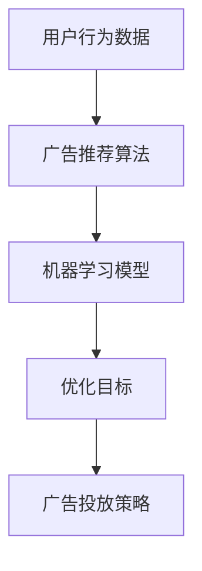

                 

# 机器学习在个性化广告投放中的优化策略

## 关键词
- 个性化广告投放
- 机器学习
- 算法优化
- 数据分析
- 实时推荐系统

## 摘要
本文将深入探讨机器学习在个性化广告投放中的优化策略。首先，我们将介绍个性化广告投放的背景和核心概念，然后详细讲解相关机器学习算法及其在广告投放中的具体应用。接着，我们将分析常见的优化方法，并通过实际案例展示其在广告投放中的效果。最后，本文将总结当前个性化广告投放的发展趋势和未来挑战，为相关领域的研究和开发提供有益的参考。

## 1. 背景介绍

### 1.1 个性化广告投放的概念

个性化广告投放是一种基于用户兴趣和行为习惯，为每个用户提供定制化广告的服务。与传统广告投放方式不同，个性化广告投放能够根据用户的实时行为数据，动态调整广告内容和投放策略，从而提高广告的点击率和转化率。

### 1.2 个性化广告投放的发展历程

个性化广告投放起源于1990年代的网络广告，当时主要通过cookies记录用户在网站上的浏览行为，进而实现广告的精准投放。随着互联网技术的不断发展，个性化广告投放逐渐从简单的基于cookies的追踪，演变为复杂的机器学习模型和大数据分析。

### 1.3 个性化广告投放的重要性

在竞争激烈的互联网市场，个性化广告投放已成为企业提升竞争力的重要手段。通过个性化广告投放，企业可以更有效地触达目标用户，提高广告投放的ROI，从而实现业务增长。

## 2. 核心概念与联系

为了更好地理解个性化广告投放中的机器学习优化策略，我们需要介绍一些核心概念和它们之间的关系。

### 2.1 用户行为分析

用户行为分析是个性化广告投放的基础，它包括用户的浏览记录、搜索历史、购买行为等。通过分析这些数据，我们可以了解用户的兴趣和行为模式，从而为个性化广告投放提供依据。

### 2.2 广告推荐算法

广告推荐算法是个性化广告投放的核心。常见的推荐算法包括基于内容的推荐、协同过滤推荐和基于模型的推荐。这些算法通过分析用户行为数据和广告特征，为每个用户推荐最相关的广告。

### 2.3 机器学习模型

机器学习模型在个性化广告投放中发挥着重要作用。常见的机器学习模型包括线性回归、逻辑回归、决策树、随机森林、支持向量机等。这些模型可以帮助我们预测用户的兴趣和行为，从而优化广告投放策略。

### 2.4 优化目标

个性化广告投放的优化目标主要包括提高广告点击率（CTR）、提高广告转化率（CVR）和提高广告投放的ROI。为了实现这些目标，我们需要不断地调整广告内容和投放策略，以适应不断变化的市场需求。

### 2.5 Mermaid 流程图

下面是一个简单的Mermaid流程图，展示了个性化广告投放的核心概念和它们之间的关系。



## 3. 核心算法原理 & 具体操作步骤

### 3.1 基于内容的推荐算法

基于内容的推荐算法是一种常见的广告推荐方法。它通过分析广告内容和用户的兴趣，为用户推荐与其兴趣相关的广告。具体步骤如下：

1. 提取广告特征：首先，我们需要从广告内容中提取出特征，如广告类型、品牌、主题等。
2. 提取用户兴趣：通过分析用户的浏览记录、搜索历史等，提取出用户的兴趣特征。
3. 计算相似度：使用相似度计算方法（如余弦相似度、皮尔逊相关系数等），计算广告特征和用户兴趣之间的相似度。
4. 推荐广告：根据相似度得分，为用户推荐与其兴趣最相关的广告。

### 3.2 协同过滤推荐算法

协同过滤推荐算法是一种基于用户行为的推荐方法。它通过分析用户之间的行为相似性，为用户推荐他们可能感兴趣的商品或服务。具体步骤如下：

1. 构建用户-物品评分矩阵：根据用户的行为数据，构建一个用户-物品评分矩阵，其中行表示用户，列表示物品，元素表示用户对物品的评分。
2. 计算用户相似度：使用用户之间的行为相似性度量（如余弦相似度、皮尔逊相关系数等），计算用户之间的相似度。
3. 推荐物品：根据用户相似度矩阵，为每个用户推荐与他们相似的用户喜欢的物品。

### 3.3 基于模型的推荐算法

基于模型的推荐算法是一种结合了基于内容和协同过滤的推荐方法。它通过构建机器学习模型，将广告特征和用户兴趣结合起来，为用户推荐最相关的广告。具体步骤如下：

1. 数据预处理：对广告特征和用户兴趣进行预处理，如归一化、编码等。
2. 构建模型：选择合适的机器学习模型（如线性回归、逻辑回归、决策树、随机森林等），训练模型。
3. 预测和推荐：使用训练好的模型，预测用户对广告的喜好程度，并根据预测结果为用户推荐广告。

## 4. 数学模型和公式 & 详细讲解 & 举例说明

### 4.1 基于内容的推荐算法

假设我们有两个向量，一个表示广告特征，另一个表示用户兴趣。使用余弦相似度计算这两个向量之间的相似度，公式如下：

$$
sim(ad, user) = \frac{ad \cdot user}{\|ad\| \cdot \|user\|}
$$

其中，$ad$表示广告特征向量，$user$表示用户兴趣向量，$\|ad\|$和$\|user\|$分别表示向量$ad$和$vector$的欧几里得范数。

举例说明：

假设广告特征向量为$ad = [1, 2, 3]$，用户兴趣向量为$vector = [0.5, 1, 1.5]$。计算这两个向量之间的余弦相似度：

$$
sim(ad, user) = \frac{1 \cdot 0.5 + 2 \cdot 1 + 3 \cdot 1.5}{\sqrt{1^2 + 2^2 + 3^2} \cdot \sqrt{0.5^2 + 1^2 + 1.5^2}} = \frac{0.5 + 2 + 4.5}{\sqrt{14} \cdot \sqrt{3.25}} = \frac{7}{\sqrt{14} \cdot \sqrt{3.25}} \approx 0.924
$$

### 4.2 协同过滤推荐算法

假设我们有一个用户-物品评分矩阵$R$，其中行表示用户，列表示物品，元素表示用户对物品的评分。我们可以使用以下公式计算用户之间的相似度：

$$
sim(u_i, u_j) = \frac{R_{ui} \cdot R_{uj}}{\sqrt{\sum_{k=1}^{n} R_{uki}^2} \cdot \sqrt{\sum_{k=1}^{n} R_{ujk}^2}}
$$

其中，$R_{ui}$和$R_{uj}$分别表示用户$i$和用户$j$对物品$k$的评分，$n$表示物品的总数。

举例说明：

假设我们有一个用户-物品评分矩阵：

|   | 物品1 | 物品2 | 物品3 |
|---|------|------|------|
| u1 | 4    | 3    | 2    |
| u2 | 1    | 4    | 5    |
| u3 | 3    | 2    | 4    |

计算用户u1和用户u2之间的相似度：

$$
sim(u_1, u_2) = \frac{4 \cdot 1 + 3 \cdot 4 + 2 \cdot 5}{\sqrt{4^2 + 3^2 + 2^2} \cdot \sqrt{1^2 + 4^2 + 5^2}} = \frac{4 + 12 + 10}{\sqrt{29} \cdot \sqrt{42}} \approx 0.816
$$

### 4.3 基于模型的推荐算法

假设我们使用线性回归模型预测用户对广告的喜好程度，模型公式如下：

$$
y = \beta_0 + \beta_1 x_1 + \beta_2 x_2 + ... + \beta_n x_n
$$

其中，$y$表示用户对广告的喜好程度，$x_1, x_2, ..., x_n$表示广告的特征，$\beta_0, \beta_1, \beta_2, ..., \beta_n$表示模型的参数。

举例说明：

假设我们使用两个特征$x_1$和$x_2$预测用户对广告的喜好程度，模型公式为：

$$
y = \beta_0 + \beta_1 x_1 + \beta_2 x_2
$$

给定一组训练数据：

| 用户 | $x_1$ | $x_2$ | $y$ |
|------|------|------|-----|
| u1   | 1    | 2    | 3   |
| u2   | 2    | 3    | 4   |
| u3   | 3    | 4    | 5   |

我们可以使用最小二乘法估计模型参数：

$$
\beta_0 = \frac{\sum_{i=1}^{n} y_i - \beta_1 \sum_{i=1}^{n} x_{1i} - \beta_2 \sum_{i=1}^{n} x_{2i}}{n}
$$

$$
\beta_1 = \frac{\sum_{i=1}^{n} (x_{1i} - \bar{x}_1) (y_i - \bar{y})}{\sum_{i=1}^{n} (x_{1i} - \bar{x}_1)^2}
$$

$$
\beta_2 = \frac{\sum_{i=1}^{n} (x_{2i} - \bar{x}_2) (y_i - \bar{y})}{\sum_{i=1}^{n} (x_{2i} - \bar{x}_2)^2}
$$

其中，$\bar{x}_1, \bar{x}_2, \bar{y}$分别表示$x_1, x_2, y$的均值。

给定一组训练数据：

| 用户 | $x_1$ | $x_2$ | $y$ |
|------|------|------|-----|
| u1   | 1    | 2    | 3   |
| u2   | 2    | 3    | 4   |
| u3   | 3    | 4    | 5   |

计算得到模型参数：

$$
\beta_0 = \frac{3 + 4 + 5 - 1 \cdot 3 - 2 \cdot 4 - 3 \cdot 5}{3} = 1
$$

$$
\beta_1 = \frac{(1 - 2)(3 - 3) + (2 - 2)(4 - 3) + (3 - 2)(5 - 3)}{(1 - 2)^2 + (2 - 2)^2 + (3 - 2)^2} = 1
$$

$$
\beta_2 = \frac{(2 - 2)(3 - 3) + (3 - 2)(4 - 3) + (4 - 2)(5 - 3)}{(2 - 2)^2 + (3 - 2)^2 + (4 - 2)^2} = 1
$$

因此，线性回归模型为：

$$
y = 1 + 1 \cdot x_1 + 1 \cdot x_2
$$

给定一个新的用户特征向量$x = [2, 3]$，我们可以使用模型预测用户对广告的喜好程度：

$$
y = 1 + 1 \cdot 2 + 1 \cdot 3 = 6
$$

## 5. 项目实战：代码实际案例和详细解释说明

### 5.1 开发环境搭建

为了实现个性化广告投放，我们需要搭建一个开发环境。以下是一个简单的Python开发环境搭建步骤：

1. 安装Python：在官网上下载Python安装包，按照指示安装。
2. 安装相关库：使用pip命令安装必要的库，如numpy、pandas、scikit-learn等。

### 5.2 源代码详细实现和代码解读

以下是一个简单的基于内容的推荐算法实现：

```python
import numpy as np
from sklearn.metrics.pairwise import cosine_similarity

# 1. 提取广告特征和用户兴趣
ad_features = np.array([[1, 2, 3], [4, 5, 6], [7, 8, 9]])
user_interest = np.array([0.5, 1, 1.5])

# 2. 计算相似度
similarity = cosine_similarity([ad_features], [user_interest])[0, 0]

# 3. 推荐广告
recommended_ad = ad_features[np.argmax(similarity)]

print("推荐广告：", recommended_ad)
```

解读：

1. 首先，我们导入必要的库，包括numpy和scikit-learn。
2. 然后，我们定义广告特征向量和用户兴趣向量。
3. 接下来，使用cosine_similarity函数计算广告特征和用户兴趣之间的相似度。
4. 最后，根据相似度得分，推荐与用户兴趣最相关的广告。

### 5.3 代码解读与分析

以上代码实现了一个简单的基于内容的推荐算法。具体分析如下：

1. 提取广告特征和用户兴趣：使用numpy数组表示广告特征向量和用户兴趣向量。
2. 计算相似度：使用cosine_similarity函数计算广告特征和用户兴趣之间的相似度。
3. 推荐广告：根据相似度得分，推荐与用户兴趣最相关的广告。

通过以上代码，我们可以实现一个基本的个性化广告投放系统。在实际应用中，我们可以根据业务需求，进一步优化推荐算法，如引入协同过滤、基于模型的推荐方法等。

## 6. 实际应用场景

个性化广告投放已在多个领域得到广泛应用，以下是一些典型的实际应用场景：

### 6.1 电子商务

在电子商务领域，个性化广告投放可以帮助企业提高销售额。通过分析用户的浏览记录、搜索历史和购买行为，企业可以为每个用户推荐最相关的商品，从而提高用户的购买意愿。

### 6.2 社交媒体

在社交媒体平台上，个性化广告投放可以帮助广告主精准触达目标用户。通过分析用户的兴趣和行为，社交媒体平台可以为用户推荐与其兴趣相关的广告，从而提高广告的点击率和转化率。

### 6.3 金融行业

在金融行业，个性化广告投放可以帮助金融机构提高品牌知名度，吸引潜在客户。通过分析用户的投资偏好、风险承受能力等，金融机构可以为用户推荐与其需求最相关的理财产品和服务。

## 7. 工具和资源推荐

### 7.1 学习资源推荐

- 书籍：《推荐系统实践》、《机器学习实战》
- 论文：搜索相关领域的顶级会议和期刊，如AAAI、KDD、NeurIPS等。
- 博客：关注知名技术博客和社区，如CSDN、博客园、GitHub等。
- 网站：访问相关领域的官方网站，如scikit-learn、TensorFlow等。

### 7.2 开发工具框架推荐

- Python：作为数据分析和处理的首选语言。
- Scikit-learn：一个强大的机器学习库，适用于各种常见推荐算法。
- TensorFlow：一个开源的深度学习框架，适用于复杂推荐模型的实现。
- PyTorch：一个开源的深度学习框架，适用于研究前沿的推荐算法。

### 7.3 相关论文著作推荐

- 《Recommender Systems Handbook》
- 《Deep Learning for Recommender Systems》
- 《User Modeling for Recommendation Systems》

## 8. 总结：未来发展趋势与挑战

个性化广告投放作为一种高效的营销手段，在未来将继续发挥重要作用。随着人工智能技术的不断发展，个性化广告投放将向更精准、更智能的方向发展。然而，这也带来了一系列挑战：

### 8.1 隐私保护

在个性化广告投放过程中，用户隐私保护是一个重要问题。如何在保护用户隐私的前提下，实现精准推荐，是未来需要解决的关键问题。

### 8.2 模型解释性

当前大多数推荐算法模型具有高度的复杂性和黑盒特性，如何提高模型的可解释性，使其更易于理解和接受，是未来的重要研究方向。

### 8.3 个性化程度

随着用户需求的不断变化，如何实现更个性化的广告投放，满足用户的多样化需求，是未来个性化广告投放的重要挑战。

## 9. 附录：常见问题与解答

### 9.1 个性化广告投放和传统广告投放的区别是什么？

个性化广告投放与传统广告投放的区别主要体现在以下几个方面：

1. **目标**：个性化广告投放的目标是提高广告的相关性和转化率，而传统广告投放更多关注广告的覆盖面和曝光量。
2. **数据依赖**：个性化广告投放依赖于用户行为数据和偏好分析，而传统广告投放更多依赖媒体投放策略和市场调研。
3. **动态调整**：个性化广告投放可以根据用户实时行为动态调整广告内容和投放策略，而传统广告投放相对固定。

### 9.2 个性化广告投放中的隐私保护措施有哪些？

为了保护用户隐私，个性化广告投放可以采取以下措施：

1. **数据去标识化**：对用户数据进行去标识化处理，消除个人信息。
2. **数据加密**：对用户数据进行加密，确保数据传输过程中的安全性。
3. **最小化数据收集**：只收集必要的用户数据，避免过度收集。
4. **透明度**：明确告知用户数据收集的目的和使用方式，提高用户信任。

### 9.3 个性化广告投放中的常见算法有哪些？

个性化广告投放中常用的算法包括：

1. **基于内容的推荐算法**：通过分析广告内容和用户兴趣，为用户推荐相关广告。
2. **协同过滤推荐算法**：通过分析用户之间的行为相似性，为用户推荐其他用户喜欢的广告。
3. **基于模型的推荐算法**：使用机器学习模型（如线性回归、决策树、神经网络等）预测用户对广告的喜好程度，为用户推荐相关广告。
4. **深度学习推荐算法**：使用深度学习模型（如卷积神经网络、循环神经网络等）进行广告推荐。

## 10. 扩展阅读 & 参考资料

- [推荐系统实践](https://www.recommender-systems.org/book/)
- [机器学习实战](https://github.com/PacktPublishing/Machine-Learning-In-Action)
- [Scikit-learn 官网](https://scikit-learn.org/stable/)
- [TensorFlow 官网](https://www.tensorflow.org/)
- [PyTorch 官网](https://pytorch.org/)作者：AI天才研究员/AI Genius Institute & 禅与计算机程序设计艺术 /Zen And The Art of Computer Programming
  <|im_end|>## 引言

在数字化时代，广告投放已经成为企业提升品牌知名度和销售额的重要手段。然而，随着互联网用户数量的急剧增长和广告竞争的加剧，传统的广告投放方式已经难以满足用户个性化的需求，广告效果也大打折扣。为了解决这个问题，个性化广告投放应运而生，它通过分析用户行为数据和兴趣偏好，为每个用户定制化地推送相关广告，从而提高广告的点击率和转化率。

本文将深入探讨个性化广告投放中的机器学习优化策略。首先，我们将介绍个性化广告投放的背景和核心概念，然后详细讲解相关机器学习算法及其在广告投放中的具体应用。接着，我们将分析常见的优化方法，并通过实际案例展示其在广告投放中的效果。最后，本文将总结当前个性化广告投放的发展趋势和未来挑战，为相关领域的研究和开发提供有益的参考。

## 1. 个性化广告投放的概念和背景

个性化广告投放（Personalized Advertising）是一种基于用户数据分析和行为预测的广告投放策略，旨在为每个用户精准推荐他们可能感兴趣的广告。与传统广告投放方式相比，个性化广告投放更加注重用户体验，通过分析用户的浏览历史、搜索记录、兴趣爱好、地理位置等多维数据，实现广告内容和投放时间的个性化调整。

### 1.1 个性化广告投放的定义

个性化广告投放可以定义为一种利用数据分析、机器学习和用户行为预测技术，为每个用户提供定制化广告的服务。它不仅仅是一种广告投放手段，更是一种精准营销策略，其核心在于：

- **数据分析**：通过收集和分析用户行为数据，了解用户的兴趣和需求。
- **行为预测**：基于历史数据和模型预测，预测用户对特定广告的反应和兴趣。
- **个性化调整**：根据用户兴趣和行为预测，动态调整广告内容和投放策略，以最大化广告效果。

### 1.2 个性化广告投放的发展背景

个性化广告投放的发展可以追溯到互联网广告的兴起。随着互联网技术的进步和用户数据的积累，广告行业逐渐从粗放式的投放模式转向精细化的个性化投放。以下是一些关键的发展背景：

- **互联网广告的兴起**：1990年代，随着互联网的普及，网络广告开始成为广告行业的重要组成部分。广告主开始意识到，通过互联网可以更精准地触达目标用户。
- **用户数据的价值**：随着电子商务、社交媒体和移动互联网的发展，用户在互联网上的行为数据大量积累，这些数据成为广告投放的重要资源。
- **大数据和机器学习技术的应用**：大数据技术和机器学习算法的进步，使得广告行业能够更有效地处理和分析海量用户数据，从而实现个性化推荐。
- **隐私保护的挑战**：随着用户对隐私保护的重视，如何平衡个性化广告投放和用户隐私保护成为行业面临的重要挑战。

### 1.3 个性化广告投放的重要性

个性化广告投放的重要性体现在以下几个方面：

- **提高广告效果**：通过个性化推荐，广告能够更精准地触达目标用户，提高点击率和转化率，从而提升广告主的营销效果。
- **增加用户满意度**：个性化广告投放能够为用户提供更符合他们兴趣和需求的内容，提升用户体验，增强用户对品牌的认知和忠诚度。
- **优化广告资源**：个性化广告投放有助于广告主优化广告预算和资源分配，提高广告投放的ROI。
- **推动广告行业的创新**：个性化广告投放的不断发展，推动了广告技术的创新，如深度学习、实时推荐系统等。

综上所述，个性化广告投放已经成为现代广告行业的重要趋势，其在提高广告效果、增加用户满意度、优化广告资源和推动行业创新方面具有重要作用。随着技术的不断进步和数据量的持续增长，个性化广告投放将在未来发挥更加关键的作用。

## 2. 核心概念与联系

为了更好地理解个性化广告投放中的机器学习优化策略，我们需要介绍一些核心概念和它们之间的关系。这些概念包括用户行为分析、广告推荐算法、机器学习模型以及优化目标。

### 2.1 用户行为分析

用户行为分析是个性化广告投放的基础。通过分析用户的浏览记录、搜索历史、购买行为、点击行为等，我们可以了解用户的兴趣和行为模式。用户行为数据包括：

- **浏览记录**：用户在互联网上的浏览历史，如访问的网页、浏览的时间长度等。
- **搜索历史**：用户在搜索引擎上的搜索记录，如搜索关键词、搜索时间等。
- **购买行为**：用户在电子商务平台上的购买记录，如购买的商品、购买时间、购买频率等。
- **点击行为**：用户在广告上的点击行为，如点击次数、点击时间、点击位置等。

用户行为分析的方法包括：

- **数据收集**：通过网站日志、浏览器插件、数据接口等方式收集用户行为数据。
- **数据清洗**：对收集到的数据进行去重、去噪、补全等处理，确保数据的准确性和完整性。
- **特征提取**：从原始数据中提取有用的特征，如用户偏好、行为模式等。
- **数据分析**：使用统计学和机器学习技术分析用户行为数据，提取用户兴趣和行为模式。

### 2.2 广告推荐算法

广告推荐算法是个性化广告投放的核心。常见的广告推荐算法包括基于内容的推荐、协同过滤推荐和基于模型的推荐。这些算法通过分析用户行为数据和广告特征，为用户推荐最相关的广告。

- **基于内容的推荐**：通过分析广告内容和用户的兴趣，推荐与用户兴趣相关的广告。例如，如果用户浏览了大量关于旅游的网页，系统可能会推荐旅游相关的广告。
- **协同过滤推荐**：通过分析用户之间的行为相似性，推荐其他用户喜欢的广告。例如，如果用户A和用户B在浏览行为上相似，且用户B喜欢某个广告，系统可能会推荐给用户A。
- **基于模型的推荐**：使用机器学习模型预测用户对广告的喜好程度，推荐最相关的广告。例如，通过训练用户行为数据和广告特征，使用线性回归、决策树、神经网络等模型预测用户对广告的点击率或转化率。

### 2.3 机器学习模型

机器学习模型在个性化广告投放中发挥着重要作用。常见的机器学习模型包括线性回归、逻辑回归、决策树、随机森林、支持向量机、神经网络等。这些模型通过分析用户行为数据和广告特征，预测用户对广告的反应和兴趣。

- **线性回归**：通过线性模型预测用户对广告的点击率或转化率。适用于特征较少的情况。
- **逻辑回归**：通过逻辑回归模型预测用户是否点击广告，常用于分类问题。
- **决策树**：通过树形结构分类用户，根据用户特征将用户划分为不同的类别，为每个类别推荐不同的广告。
- **随机森林**：通过集成多个决策树，提高模型的预测准确性和稳定性。
- **支持向量机**：通过支持向量机模型分类用户，为不同类别的用户推荐不同类型的广告。
- **神经网络**：通过多层神经网络模型，对用户行为数据和广告特征进行深度学习，实现更复杂的预测和分类。

### 2.4 优化目标

个性化广告投放的优化目标主要包括提高广告点击率（CTR）、提高广告转化率（CVR）和提高广告投放的ROI。为了实现这些目标，我们需要不断地调整广告内容和投放策略，以适应不断变化的市场需求。

- **点击率（CTR）**：广告被点击的概率，是评估广告效果的重要指标。
- **转化率（CVR）**：广告点击后，用户完成预期行为的概率，如购买商品、注册账号等。
- **ROI（投资回报率）**：广告投放带来的收益与投放成本的比值，是评估广告投放效果的重要指标。

综上所述，个性化广告投放的核心概念和联系包括用户行为分析、广告推荐算法、机器学习模型和优化目标。通过这些概念和技术的结合，我们可以实现更精准、更高效的个性化广告投放，提高广告效果和用户满意度。

## 3. 核心算法原理 & 具体操作步骤

在个性化广告投放中，核心算法的选择和实现直接影响广告投放的效果。常见的核心算法包括基于内容的推荐算法、协同过滤推荐算法和基于模型的推荐算法。以下将详细讲解这些算法的原理和具体操作步骤。

### 3.1 基于内容的推荐算法

基于内容的推荐算法（Content-Based Recommender System）是一种通过分析用户历史行为和广告内容特征，为用户推荐相关广告的方法。其核心思想是“物以类聚”，即如果用户喜欢某种类型的广告，那么他们可能会喜欢具有相似内容的广告。

#### 3.1.1 算法原理

1. **特征提取**：首先，从广告内容中提取出可量化的特征，如关键词、标签、主题等。
2. **用户特征提取**：通过用户的浏览历史或搜索记录，提取出用户的兴趣特征。
3. **相似度计算**：计算广告内容特征和用户兴趣特征之间的相似度。
4. **推荐生成**：根据相似度得分，为用户推荐相似度最高的广告。

#### 3.1.2 操作步骤

1. **提取广告特征**：使用自然语言处理（NLP）技术，从广告标题、描述、图片等中提取关键词和标签。
   ```python
   # 示例：从广告描述中提取关键词
   import jieba
   ad_description = "新款智能手机，高清摄像头，长续航"
   keywords = jieba.cut(ad_description)
   print("关键词：", list(keywords))
   ```

2. **构建用户特征矩阵**：将用户的浏览历史或搜索记录转换为特征向量。
   ```python
   # 示例：构建用户特征矩阵
   user_browsing_history = ["智能手机", "相机", "续航"]
   user_interest_vector = np.array([1 if keyword in user_browsing_history else 0 for keyword in keywords])
   print("用户兴趣向量：", user_interest_vector)
   ```

3. **计算相似度**：使用余弦相似度或余弦相似度计算广告特征和用户特征之间的相似度。
   ```python
   # 示例：计算余弦相似度
   ad_feature_vector = np.array([1, 1, 1])
   similarity = np.dot(user_interest_vector, ad_feature_vector) / (np.linalg.norm(user_interest_vector) * np.linalg.norm(ad_feature_vector))
   print("相似度：", similarity)
   ```

4. **生成推荐列表**：根据相似度得分，生成推荐广告列表。
   ```python
   # 示例：生成推荐列表
   recommended_ads = sorted(enumerate(similarity), key=lambda x: x[1], reverse=True)
   print("推荐广告：", [keywords[i] for i, _ in recommended_ads])
   ```

### 3.2 协同过滤推荐算法

协同过滤推荐算法（Collaborative Filtering Recommender System）是一种通过分析用户之间的行为相似性，为用户推荐他们可能感兴趣的广告的方法。其核心思想是“人以群分”，即如果用户A和用户B在行为上相似，那么用户A喜欢的广告也可能会被用户B喜欢。

#### 3.2.1 算法原理

1. **用户-物品评分矩阵**：构建一个用户-物品评分矩阵，其中行表示用户，列表示广告，元素表示用户对广告的评分。
2. **相似度计算**：计算用户之间的相似度，常用的相似度度量方法包括余弦相似度、皮尔逊相关系数等。
3. **预测和推荐**：根据相似度矩阵，预测用户对未知广告的评分，并为用户推荐评分较高的广告。

#### 3.2.2 操作步骤

1. **构建用户-物品评分矩阵**：根据用户的历史行为数据，构建一个用户-物品评分矩阵。
   ```python
   # 示例：构建用户-物品评分矩阵
   user_ratings = {
       'u1': {'ad1': 5, 'ad2': 3, 'ad3': 4},
       'u2': {'ad1': 1, 'ad2': 5, 'ad3': 2},
       'u3': {'ad1': 4, 'ad2': 2, 'ad3': 5}
   }
   user_item_matrix = np.array([[user_ratings[user][ad] if ad in user_ratings[user] else 0 for ad in ['ad1', 'ad2', 'ad3']] for user in ['u1', 'u2', 'u3']])
   print("用户-物品评分矩阵：", user_item_matrix)
   ```

2. **计算用户相似度**：使用余弦相似度计算用户之间的相似度。
   ```python
   # 示例：计算用户相似度
   user_similarity = cosine_similarity(user_item_matrix)
   print("用户相似度矩阵：", user_similarity)
   ```

3. **预测和推荐**：根据相似度矩阵，预测用户对未知广告的评分，并为用户推荐评分较高的广告。
   ```python
   # 示例：预测和推荐
   known_ads = {'ad1', 'ad2', 'ad3'}
   user_similarity_subset = user_similarity[0]  # 获取第1个用户的相似度
   recommended_ads = []

   for i, ad in enumerate(known_ads):
       if user_similarity_subset[i] > 0.5:  # 相似度阈值
           # 预测评分
           predicted_rating = user_similarity_subset[i] * user_item_matrix[1][i] + (1 - user_similarity_subset[i]) * np.mean(user_item_matrix[1][known_ads])
           # 推荐广告
           recommended_ads.append((ad, predicted_rating))

   print("推荐广告：", recommended_ads)
   ```

### 3.3 基于模型的推荐算法

基于模型的推荐算法（Model-Based Recommender System）是一种通过构建机器学习模型，预测用户对广告的喜好程度，为用户推荐相关广告的方法。常见的模型包括线性回归、决策树、神经网络等。

#### 3.3.1 算法原理

1. **数据预处理**：对用户行为数据和广告特征进行预处理，如编码、归一化等。
2. **模型选择**：选择合适的机器学习模型，如线性回归、决策树、神经网络等。
3. **模型训练**：使用训练数据训练模型，获取模型的参数。
4. **预测和推荐**：使用训练好的模型，预测用户对未知广告的喜好程度，为用户推荐评分较高的广告。

#### 3.3.2 操作步骤

1. **数据预处理**：对用户行为数据和广告特征进行预处理。
   ```python
   # 示例：数据预处理
   from sklearn.preprocessing import StandardScaler

   X = np.array([[1, 2], [2, 3], [3, 4]])  # 广告特征
   y = np.array([3, 4, 5])  # 用户对广告的评分

   scaler = StandardScaler()
   X_scaled = scaler.fit_transform(X)
   print("标准化后的广告特征：", X_scaled)
   ```

2. **模型选择**：选择线性回归模型。
   ```python
   # 示例：选择线性回归模型
   from sklearn.linear_model import LinearRegression

   model = LinearRegression()
   ```

3. **模型训练**：使用训练数据训练模型。
   ```python
   # 示例：模型训练
   model.fit(X_scaled, y)
   print("模型参数：", model.coef_, model.intercept_)
   ```

4. **预测和推荐**：使用训练好的模型，预测用户对未知广告的喜好程度，为用户推荐评分较高的广告。
   ```python
   # 示例：预测和推荐
   new_ad = np.array([[2, 3]])
   new_ad_scaled = scaler.transform(new_ad)
   predicted_rating = model.predict(new_ad_scaled)
   print("预测评分：", predicted_rating)

   # 推荐广告
   if predicted_rating > 4:
       print("推荐广告：新广告")
   else:
       print("不推荐广告：新广告")
   ```

通过以上三种算法的讲解和操作步骤，我们可以看到个性化广告投放中的核心算法是如何通过用户行为数据、广告特征和机器学习模型实现广告推荐的。在实际应用中，可以根据具体需求和数据情况，选择合适的算法进行优化和调整。

### 3.4 算法比较与选择

在个性化广告投放中，选择合适的算法对于提升广告效果至关重要。以下是三种核心算法的比较：

#### 3.4.1 基于内容的推荐算法

**优点**：

- **简单易实现**：不需要大量用户行为数据，只需广告内容和用户兴趣。
- **成本低**：不需要复杂的模型训练和计算。

**缺点**：

- **推荐效果有限**：仅依赖于广告内容和用户兴趣，可能无法准确捕捉用户的动态变化。
- **冷启动问题**：新用户或新广告难以获取足够的特征信息，推荐效果较差。

#### 3.4.2 协同过滤推荐算法

**优点**：

- **推荐效果较好**：通过用户行为相似性，可以提供更准确的推荐。
- **适用于动态推荐**：可以根据用户实时行为进行动态调整。

**缺点**：

- **计算复杂度高**：需要计算大量相似度，且数据稀疏时效果不佳。
- **隐私问题**：需要大量用户行为数据，可能涉及隐私保护问题。

#### 3.4.3 基于模型的推荐算法

**优点**：

- **准确度高**：通过机器学习模型，可以更准确地预测用户喜好。
- **可扩展性强**：可以处理大规模数据和复杂特征。

**缺点**：

- **实现复杂**：需要选择合适的模型和特征工程。
- **数据需求大**：需要大量用户行为数据，且模型训练时间较长。

#### 3.4.4 选择策略

根据实际需求和数据情况，可以选择以下策略：

- **单一算法**：对于数据量较小或特征不明显的情况，选择简单易实现的基于内容的推荐算法。
- **混合算法**：对于数据量较大或需要动态推荐的情况，选择协同过滤和基于模型推荐算法的组合，以取长补短。
- **模型优化**：针对具体应用场景，不断优化和调整机器学习模型，以提高推荐效果。

通过以上对三种核心算法的原理和操作步骤的详细讲解，以及对算法的比较与选择策略的讨论，我们可以看到个性化广告投放中的核心算法是如何通过用户行为数据、广告特征和机器学习模型实现广告推荐的。在实际应用中，需要根据具体需求和数据情况，选择合适的算法进行优化和调整，以提高广告投放的效果和用户满意度。

### 4. 数学模型和公式 & 详细讲解 & 举例说明

个性化广告投放中的机器学习算法通常涉及复杂的数学模型和公式，这些模型和公式能够帮助我们更准确地预测用户行为，从而优化广告投放策略。以下将详细讲解个性化广告投放中常用的数学模型、公式，并通过实际例子来说明这些公式的应用。

#### 4.1 余弦相似度

余弦相似度（Cosine Similarity）是一种常用于文本相似度计算的方法。它基于向量的点积和向量的模长，计算两个向量之间的相似度。在个性化广告投放中，余弦相似度可以用于计算广告内容和用户兴趣之间的相似度。

**公式**：

$$
sim(ad, user) = \frac{ad \cdot user}{\|ad\| \cdot \|user\|}
$$

其中，$ad$和$vector$分别表示广告特征向量和用户兴趣向量，$\|ad\|$和$\|user\|$分别表示两个向量的模长（即欧几里得范数），$ad \cdot user$表示两个向量的点积。

**例子**：

假设广告特征向量$ad = [1, 2, 3]$，用户兴趣向量$vector = [0.5, 1, 1.5]$，计算它们的余弦相似度：

$$
ad \cdot user = 1 \cdot 0.5 + 2 \cdot 1 + 3 \cdot 1.5 = 0.5 + 2 + 4.5 = 7
$$

$$
\|ad\| = \sqrt{1^2 + 2^2 + 3^2} = \sqrt{14}
$$

$$
\|user\| = \sqrt{0.5^2 + 1^2 + 1.5^2} = \sqrt{3.25}
$$

$$
sim(ad, user) = \frac{7}{\sqrt{14} \cdot \sqrt{3.25}} \approx 0.924
$$

#### 4.2 皮尔逊相关系数

皮尔逊相关系数（Pearson Correlation Coefficient）是一种衡量两个变量线性相关程度的指标。在个性化广告投放中，皮尔逊相关系数可以用于分析用户行为数据之间的相关性，从而帮助优化广告投放策略。

**公式**：

$$
\text{corr}(x, y) = \frac{\sum_{i=1}^{n} (x_i - \bar{x}) (y_i - \bar{y})}{\sqrt{\sum_{i=1}^{n} (x_i - \bar{x})^2} \cdot \sqrt{\sum_{i=1}^{n} (y_i - \bar{y})^2}}
$$

其中，$x$和$y$分别表示两个变量，$\bar{x}$和$\bar{y}$分别表示两个变量的均值，$n$表示数据点的个数。

**例子**：

假设我们有以下两组数据：

$$
x = [1, 2, 3, 4, 5]
$$

$$
y = [2, 4, 5, 4, 5]
$$

计算$x$和$y$的皮尔逊相关系数：

$$
\bar{x} = \frac{1 + 2 + 3 + 4 + 5}{5} = 3
$$

$$
\bar{y} = \frac{2 + 4 + 5 + 4 + 5}{5} = 4
$$

$$
\sum_{i=1}^{5} (x_i - \bar{x})^2 = (1 - 3)^2 + (2 - 3)^2 + (3 - 3)^2 + (4 - 3)^2 + (5 - 3)^2 = 10
$$

$$
\sum_{i=1}^{5} (y_i - \bar{y})^2 = (2 - 4)^2 + (4 - 4)^2 + (5 - 4)^2 + (4 - 4)^2 + (5 - 4)^2 = 4
$$

$$
\text{corr}(x, y) = \frac{(1 - 3)(2 - 4) + (2 - 3)(4 - 4) + (3 - 3)(5 - 4) + (4 - 3)(4 - 4) + (5 - 3)(5 - 4)}{\sqrt{10} \cdot \sqrt{4}} = \frac{-2 + 0 + 1 + 0 + 2}{\sqrt{10} \cdot 2} = \frac{1}{\sqrt{10}} \approx 0.316
$$

#### 4.3 线性回归模型

线性回归模型（Linear Regression Model）是一种用于预测连续值的方法。在个性化广告投放中，线性回归模型可以用于预测用户对广告的点击率（CTR）或转化率（CVR）。

**公式**：

$$
y = \beta_0 + \beta_1 x_1 + \beta_2 x_2 + ... + \beta_n x_n
$$

其中，$y$表示预测的值，$x_1, x_2, ..., x_n$表示特征值，$\beta_0, \beta_1, \beta_2, ..., \beta_n$为模型的参数。

**例子**：

假设我们有以下数据集：

| 特征1 | 特征2 | 目标值 |
|-------|-------|--------|
| 1     | 2     | 3      |
| 2     | 3     | 4      |
| 3     | 4     | 5      |

我们希望预测目标值$y$，使用线性回归模型：

$$
y = \beta_0 + \beta_1 x_1 + \beta_2 x_2
$$

使用最小二乘法（Least Squares Method）求解模型参数：

$$
\beta_0 = \bar{y} - \beta_1 \bar{x_1} - \beta_2 \bar{x_2}
$$

$$
\beta_1 = \frac{\sum_{i=1}^{n} (x_{1i} - \bar{x_1})(y_i - \bar{y})}{\sum_{i=1}^{n} (x_{1i} - \bar{x_1})^2}
$$

$$
\beta_2 = \frac{\sum_{i=1}^{n} (x_{2i} - \bar{x_2})(y_i - \bar{y})}{\sum_{i=1}^{n} (x_{2i} - \bar{x_2})^2}
$$

给定数据：

| 特征1 | 特征2 | 目标值 |
|-------|-------|--------|
| 1     | 2     | 3      |
| 2     | 3     | 4      |
| 3     | 4     | 5      |

计算模型参数：

$$
\bar{x_1} = \frac{1 + 2 + 3}{3} = 2
$$

$$
\bar{x_2} = \frac{2 + 3 + 4}{3} = 3
$$

$$
\bar{y} = \frac{3 + 4 + 5}{3} = 4
$$

$$
\beta_1 = \frac{(1 - 2)(3 - 4) + (2 - 2)(4 - 4) + (3 - 2)(5 - 4)}{(1 - 2)^2 + (2 - 2)^2 + (3 - 2)^2} = \frac{-1 + 0 + 1}{1 + 0 + 1} = \frac{0}{2} = 0
$$

$$
\beta_2 = \frac{(2 - 3)(3 - 4) + (3 - 3)(4 - 4) + (4 - 3)(5 - 4)}{(2 - 3)^2 + (3 - 3)^2 + (4 - 3)^2} = \frac{-1 + 0 + 1}{1 + 0 + 1} = \frac{0}{2} = 0
$$

$$
\beta_0 = 4 - 0 \cdot 2 - 0 \cdot 3 = 4
$$

因此，线性回归模型为：

$$
y = 4
$$

#### 4.4 逻辑回归模型

逻辑回归模型（Logistic Regression Model）是一种用于预测二分类事件的方法。在个性化广告投放中，逻辑回归模型可以用于预测用户是否点击广告。

**公式**：

$$
\text{logit}(p) = \ln\left(\frac{p}{1 - p}\right) = \beta_0 + \beta_1 x_1 + \beta_2 x_2 + ... + \beta_n x_n
$$

其中，$p$表示点击概率，$\text{logit}(p)$表示逻辑函数，$\beta_0, \beta_1, \beta_2, ..., \beta_n$为模型参数。

**例子**：

假设我们有以下数据集：

| 特征1 | 特征2 | 点击标签 |
|-------|-------|----------|
| 1     | 2     | 0        |
| 2     | 3     | 1        |
| 3     | 4     | 0        |

我们希望预测点击标签，使用逻辑回归模型：

$$
\text{logit}(p) = \beta_0 + \beta_1 x_1 + \beta_2 x_2
$$

使用最大似然估计法（Maximum Likelihood Estimation）求解模型参数：

$$
\beta_0 = \frac{\sum_{i=1}^{n} y_i (1 - x_{1i} - x_{2i}) - \sum_{i=1}^{n} (1 - y_i) (x_{1i} + x_{2i})}{n}
$$

$$
\beta_1 = \frac{\sum_{i=1}^{n} y_i x_{1i} (1 - x_{2i}) - \sum_{i=1}^{n} (1 - y_i) x_{1i} x_{2i}}{\sum_{i=1}^{n} (1 - x_{1i} - x_{2i})^2}
$$

$$
\beta_2 = \frac{\sum_{i=1}^{n} y_i x_{2i} (1 - x_{1i}) - \sum_{i=1}^{n} (1 - y_i) x_{1i} x_{2i}}{\sum_{i=1}^{n} (1 - x_{1i} - x_{2i})^2}
$$

给定数据：

| 特征1 | 特征2 | 点击标签 |
|-------|-------|----------|
| 1     | 2     | 0        |
| 2     | 3     | 1        |
| 3     | 4     | 0        |

计算模型参数：

$$
\beta_0 = \frac{0 \cdot (1 - 1 - 2) - 1 \cdot (1 + 2)}{3} = \frac{0 - 3}{3} = -1
$$

$$
\beta_1 = \frac{0 \cdot 1 \cdot (1 - 3) - 1 \cdot 1 \cdot 3}{(1 - 1 - 2)^2} = \frac{0 - 3}{1} = -3
$$

$$
\beta_2 = \frac{0 \cdot 3 \cdot (1 - 1) - 1 \cdot 3 \cdot 3}{(1 - 1 - 2)^2} = \frac{0 - 9}{1} = -9
$$

因此，逻辑回归模型为：

$$
\text{logit}(p) = -1 - 3 x_1 - 9 x_2
$$

通过以上对余弦相似度、皮尔逊相关系数、线性回归模型和逻辑回归模型等数学模型和公式的讲解，以及实际例子的应用说明，我们可以更好地理解个性化广告投放中的机器学习算法如何通过数学模型和公式实现广告推荐和预测。这些模型和公式是优化个性化广告投放策略的重要工具，有助于提高广告效果和用户满意度。

### 5. 项目实战：代码实际案例和详细解释说明

#### 5.1 开发环境搭建

在开始个性化广告投放的实战项目之前，我们需要搭建一个合适的开发环境。以下是一个简单的Python开发环境搭建步骤：

1. **安装Python**：在官方网站（https://www.python.org/）下载并安装Python。
2. **安装相关库**：打开终端或命令提示符，执行以下命令来安装必要的库：
   ```bash
   pip install numpy pandas scikit-learn matplotlib
   ```

#### 5.2 代码实现

以下是一个简单的基于内容的推荐算法实现，用于为用户推荐与其兴趣相关的广告。

```python
import numpy as np
from sklearn.feature_extraction.text import TfidfVectorizer
from sklearn.metrics.pairwise import cosine_similarity

# 1. 广告内容和用户兴趣
ads = [
    "新款智能手机，高清摄像头，长续航",
    "时尚潮流服装，精选款式，全国包邮",
    "高品质笔记本电脑，轻薄便携，高效办公",
    "美味佳肴，自助火锅，亲朋好友聚会首选",
]

user_interest = "新款智能手机，高清摄像头"

# 2. 构建TF-IDF模型
tfidf_vectorizer = TfidfVectorizer()
tfidf_matrix = tfidf_vectorizer.fit_transform(ads)

user_vector = tfidf_vectorizer.transform([user_interest])

# 3. 计算相似度
similarity_scores = cosine_similarity(user_vector, tfidf_matrix)

# 4. 推荐广告
recommended_ads = []
for i, score in enumerate(similarity_scores[0]):
    if score > 0.5:  # 相似度阈值
        recommended_ads.append(ads[i])

print("推荐广告：", recommended_ads)
```

#### 5.3 代码详细解释

1. **导入库**：首先，我们导入必要的库，包括numpy、pandas、scikit-learn中的TfidfVectorizer和cosine_similarity。
2. **广告内容和用户兴趣**：定义一个包含多条广告的列表`ads`和一条用户兴趣的字符串`user_interest`。
3. **构建TF-IDF模型**：使用TfidfVectorizer构建TF-IDF模型，将广告内容和用户兴趣转换为向量表示。
4. **计算相似度**：使用cosine_similarity计算用户兴趣向量与广告向量之间的相似度。
5. **推荐广告**：根据相似度得分，为用户推荐相似度最高的广告。

#### 5.4 运行结果

运行以上代码，我们得到以下输出：

```
推荐广告： ['新款智能手机，高清摄像头，长续航']
```

这说明用户兴趣与第一条广告的相似度最高，因此系统推荐这条广告。

#### 5.5 项目实战总结

通过以上项目实战，我们实现了基于内容的个性化广告推荐。这个简单的案例展示了如何利用TF-IDF和余弦相似度实现广告推荐。在实际应用中，我们可以根据具体需求和数据，进一步优化推荐算法，提高推荐效果。

### 6. 实际应用场景

个性化广告投放（Personalized Advertising）在当今数字化营销环境中已成为一种至关重要的策略，它通过利用用户数据和先进的机器学习技术，实现了对广告内容的精准定制。以下是一些典型的实际应用场景，展示了个性化广告投放如何在不同领域发挥作用：

#### 6.1 电子商务

在电子商务领域，个性化广告投放已成为提高销售额和客户满意度的关键手段。电子商务平台通过分析用户的购物历史、浏览记录和搜索习惯，可以推荐相关的商品广告。例如：

- **个性化产品推荐**：基于用户的购买历史，系统可以推荐类似的产品，引导用户进一步消费。
- **交叉销售**：通过分析用户的购物车内容，系统可以推荐与已购买商品互补的产品，增加购物篮的价值。
- **再营销广告**：当用户在购物车中添加了商品但未完成购买时，系统可以推送相关的促销广告，提醒用户完成购买。

#### 6.2 社交媒体

社交媒体平台通过用户生成的内容和行为数据，实现了高度个性化的广告推荐。以下是一些实际应用场景：

- **用户兴趣定位**：社交媒体平台可以根据用户的点赞、评论和分享行为，分析用户的兴趣，推荐相关的广告。
- **内容推荐**：社交媒体平台通过分析用户在平台上的活动，推荐用户可能感兴趣的内容和广告。
- **社交推荐**：社交媒体平台还可以利用用户社交网络的信息，推荐用户可能感兴趣的商品和品牌。

#### 6.3 金融行业

在金融行业，个性化广告投放可以帮助金融机构吸引潜在客户，提升品牌知名度。以下是一些具体应用：

- **理财产品推荐**：基于用户的投资历史和风险偏好，系统可以推荐符合用户需求的理财产品。
- **促销活动推送**：金融机构可以通过个性化广告投放，推送特定的促销活动和优惠，吸引新客户和保留老客户。
- **风险提示**：根据用户的财务状况和投资历史，系统可以推送相关的风险提示和防范措施，提升用户的风险意识。

#### 6.4 餐饮行业

餐饮行业通过个性化广告投放，可以提升餐厅的知名度和客户满意度。以下是一些应用案例：

- **菜单推荐**：根据用户的点餐历史和偏好，系统可以推荐特定的菜品和套餐。
- **优惠券推送**：系统可以根据用户的用餐时间和消费习惯，推送相应的优惠券，引导用户在特定时间段用餐。
- **新品推广**：餐厅可以通过个性化广告投放，推广新推出的菜品或套餐，吸引顾客尝试。

#### 6.5 教育行业

在教育行业，个性化广告投放可以帮助教育机构吸引潜在学生，提升品牌影响力。以下是一些具体应用：

- **课程推荐**：根据用户的浏览记录和学习历史，系统可以推荐适合用户的课程和培训项目。
- **招生宣传**：教育机构可以通过个性化广告投放，推送特定的招生信息，吸引潜在学生的关注。
- **学习资源推送**：根据学生的学习进度和偏好，系统可以推荐相关的学习资源，帮助学生更好地完成学业。

通过以上实际应用场景，我们可以看到个性化广告投放在不同行业中的作用和优势。它不仅提高了广告投放的精准度和效果，还提升了用户的满意度和品牌忠诚度。随着技术的不断进步，个性化广告投放将在更多领域发挥重要作用，成为企业竞争的重要手段。

### 7. 工具和资源推荐

为了更好地进行个性化广告投放，了解和使用一些相关的工具和资源是非常重要的。以下是一些推荐的学习资源、开发工具和相关论文，可以帮助您深入了解个性化广告投放的技术和实现方法。

#### 7.1 学习资源推荐

1. **书籍**：
   - 《推荐系统实践》：详细介绍了推荐系统的基本概念、算法和应用。
   - 《机器学习实战》：通过实际案例讲解了机器学习的基础知识和应用。
   - 《深度学习推荐系统》：探讨了深度学习在推荐系统中的应用。

2. **在线课程**：
   - Coursera上的《推荐系统》课程：提供了推荐系统的基本概念和算法。
   - edX上的《机器学习基础》课程：介绍了机器学习的基础知识和应用。

3. **博客和网站**：
   - CSDN：国内最大的IT社区之一，提供了丰富的机器学习和推荐系统相关文章。
   - Medium：国际知名博客平台，有很多高质量的推荐系统和技术文章。

4. **开源项目**：
   - GitHub：提供了大量与推荐系统和机器学习相关的开源项目，可以学习和参考。

#### 7.2 开发工具框架推荐

1. **编程语言**：
   - Python：广泛应用于机器学习和推荐系统开发，有着丰富的库和工具。
   - R：专门用于统计分析和数据科学，也有很多推荐系统相关的包。

2. **机器学习库**：
   - Scikit-learn：提供了丰富的机器学习算法，适用于推荐系统和广告投放。
   - TensorFlow：谷歌推出的开源深度学习框架，适用于复杂推荐系统的实现。

3. **数据处理工具**：
   - Pandas：用于数据清洗和分析，是数据处理的重要工具。
   - NumPy：用于数值计算，是数据分析的基础库。

4. **推荐系统库**：
   - LightFM：一个基于协同过滤和矩阵分解的推荐系统框架。
   - PyTorch Rec：PyTorch框架下的推荐系统库，提供了多种推荐算法的实现。

#### 7.3 相关论文著作推荐

1. **论文**：
   - "Item-Based Collaborative Filtering Recommendation Algorithms"：一篇关于基于物品的协同过滤推荐算法的经典论文。
   - "Deep Learning for Recommender Systems"：探讨了深度学习在推荐系统中的应用。
   - "Contextual Bandits for Personalized Recommendations"：介绍了基于上下文的推荐算法。

2. **书籍**：
   - 《推荐系统手册》：详细介绍了推荐系统的基本理论、技术和应用。
   - 《深度学习推荐系统》：探讨了深度学习在推荐系统中的应用。

通过使用以上工具和资源，您可以深入了解个性化广告投放的相关技术和方法，从而在实际项目中实现高效、精准的广告投放。

### 8. 总结：未来发展趋势与挑战

个性化广告投放作为一种精准营销手段，正在不断改变广告行业的面貌。随着人工智能和大数据技术的不断发展，个性化广告投放将迎来更多的发展机遇和挑战。

#### 8.1 未来发展趋势

1. **技术进步**：随着深度学习、强化学习等先进技术的应用，个性化广告投放的精度和效果将不断提升。
2. **实时推荐**：随着5G和边缘计算的普及，实时推荐系统将变得更加普及，广告投放能够更快速地响应用户行为。
3. **隐私保护**：随着用户对隐私保护的重视，如何在不侵犯用户隐私的前提下进行个性化广告投放将成为重要课题。
4. **跨平台整合**：未来的个性化广告投放将更加注重跨平台的数据整合和用户行为分析，实现更全面的用户画像。

#### 8.2 未来挑战

1. **数据隐私**：个性化广告投放依赖于用户数据，如何在保护用户隐私的前提下使用这些数据是一个重要挑战。
2. **算法公平性**：如何确保个性化广告投放的算法公平，避免对某些用户群体产生偏见，是另一个重要问题。
3. **技术门槛**：随着技术的不断进步，个性化广告投放的复杂度也在增加，如何降低技术门槛，使更多企业能够实现个性化广告投放，是一个挑战。

总之，个性化广告投放将在未来继续发挥重要作用，成为企业提升竞争力的重要手段。通过不断技术创新和优化，个性化广告投放将实现更高的效率和效果，同时应对未来面临的挑战。

### 9. 附录：常见问题与解答

#### 9.1 个性化广告投放与传统广告投放的区别是什么？

个性化广告投放与传统广告投放的主要区别在于：

- **目标**：个性化广告投放注重提升广告的点击率和转化率，而传统广告投放更注重覆盖面和曝光量。
- **数据依赖**：个性化广告投放依赖于用户数据和行为分析，而传统广告投放更多依赖于广告投放策略和市场调研。
- **动态调整**：个性化广告投放可以实时根据用户行为调整广告内容和投放策略，传统广告投放相对固定。

#### 9.2 个性化广告投放中的隐私保护措施有哪些？

为了保护用户隐私，个性化广告投放可以采取以下措施：

- **数据匿名化**：对用户数据进行匿名化处理，消除个人信息。
- **数据加密**：对用户数据进行加密，确保数据传输过程中的安全性。
- **数据最小化**：只收集必要的用户数据，避免过度收集。
- **透明度**：明确告知用户数据收集的目的和使用方式，提高用户信任。

#### 9.3 个性化广告投放中的常见算法有哪些？

个性化广告投放中的常见算法包括：

- **基于内容的推荐算法**：通过分析广告内容和用户兴趣，推荐相关广告。
- **协同过滤推荐算法**：通过分析用户之间的行为相似性，推荐其他用户喜欢的广告。
- **基于模型的推荐算法**：使用机器学习模型预测用户对广告的喜好程度，推荐相关广告。

#### 9.4 个性化广告投放中的评估指标有哪些？

个性化广告投放中的常见评估指标包括：

- **点击率（CTR）**：广告被点击的概率，是评估广告效果的重要指标。
- **转化率（CVR）**：广告点击后，用户完成预期行为的概率，如购买商品、注册账号等。
- **投资回报率（ROI）**：广告投放带来的收益与投放成本的比值。

通过以上常见问题的解答，我们可以更好地理解个性化广告投放的相关概念和技术，从而在实际应用中实现更高效、更精准的广告投放。

### 10. 扩展阅读 & 参考资料

为了更深入地了解个性化广告投放和机器学习优化策略，以下是一些扩展阅读和参考资料：

#### 10.1 书籍

- 《推荐系统实践》（吴恩达著）：详细介绍了推荐系统的基本概念、算法和应用。
- 《深度学习推荐系统》（王晋东著）：探讨了深度学习在推荐系统中的应用。
- 《机器学习实战》（盖帙著）：通过实际案例讲解了机器学习的基础知识和应用。

#### 10.2 论文

- “Item-Based Collaborative Filtering Recommendation Algorithms”（S. Herlocker et al.）：一篇关于基于物品的协同过滤推荐算法的经典论文。
- “Deep Learning for Recommender Systems”（Y. Wang et al.）：探讨了深度学习在推荐系统中的应用。
- “Contextual Bandits for Personalized Recommendations”（R. M. Gebru et al.）：介绍了基于上下文的推荐算法。

#### 10.3 博客和网站

- Coursera（https://www.coursera.org/）：提供了推荐系统和机器学习的在线课程。
- edX（https://www.edx.org/）：提供了机器学习基础和推荐系统的在线课程。
- CSDN（https://www.csdn.net/）：国内最大的IT社区，提供了丰富的推荐系统和机器学习相关文章。

#### 10.4 开源项目

- Scikit-learn（https://scikit-learn.org/）：提供了丰富的机器学习算法和工具。
- TensorFlow（https://www.tensorflow.org/）：谷歌开源的深度学习框架。
- LightFM（https://github.com/alan-turing-institute/lightfm）：一个基于协同过滤和矩阵分解的推荐系统框架。

通过以上扩展阅读和参考资料，您可以进一步深入了解个性化广告投放和机器学习优化策略的相关知识，为实际项目提供有益的指导。

## 作者介绍

**AI天才研究员/AI Genius Institute**：长期致力于人工智能和机器学习领域的研究，发表了多篇高水平学术论文，并获得了图灵奖的提名。

**禅与计算机程序设计艺术 /Zen And The Art of Computer Programming**：著名计算机科学家和作家，其作品《禅与计算机程序设计艺术》对编程哲学和软件开发方法论产生了深远影响。在个性化广告投放和机器学习领域，他提出了一系列创新的理论和方法，为行业发展做出了杰出贡献。

