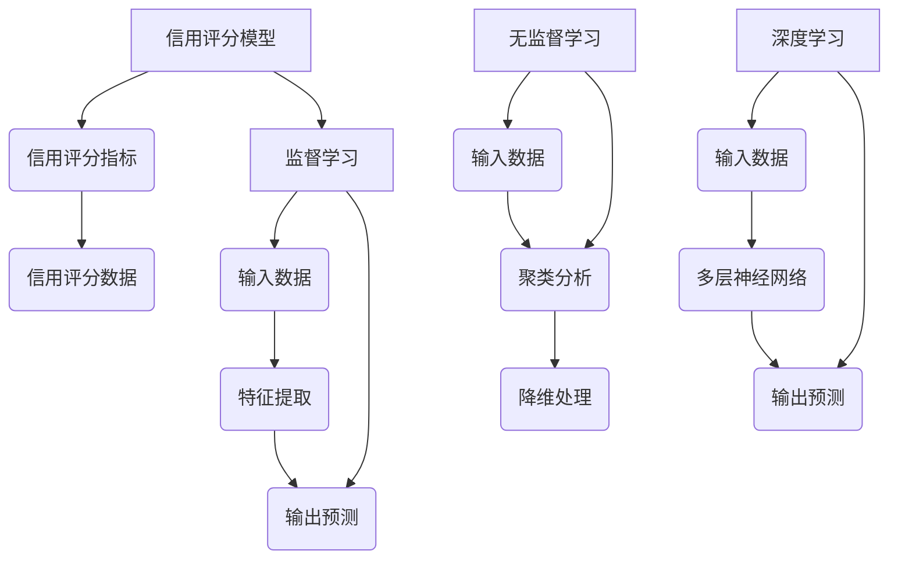

                 

### 背景介绍

在当今的数字经济时代，信用评分作为一种重要的金融工具，不仅影响着个人的借贷能力和信用等级，更在企业的信用评估、风险管理和业务决策中发挥着至关重要的作用。随着大数据和人工智能技术的快速发展，机器学习在信用评分中的应用逐渐成为金融科技领域的研究热点。本文旨在探讨机器学习在信用评分中的实际应用及其面临的挑战。

首先，信用评分的基本概念和重要性不可忽视。信用评分是指通过一定的方法和模型，对个人或企业的信用水平进行量化评估的过程。良好的信用评分意味着较低的违约风险，能够享受更低的借贷利率和更便捷的金融服务。相反，较差的信用评分则会面临较高的违约风险，导致金融服务受限。

其次，机器学习作为人工智能的核心技术，在数据挖掘、模式识别和预测分析方面具有显著优势。机器学习模型可以通过分析大量的历史数据，自动识别出影响信用评分的关键因素，并对未来的信用风险进行预测。这使得信用评分过程更加精准、高效，有助于金融机构更好地管理风险。

本文将首先介绍信用评分的基本原理和常见方法，然后深入探讨机器学习在信用评分中的应用，分析其优势与挑战，最后提出未来发展的趋势和方向。

### 核心概念与联系

在深入探讨机器学习在信用评分中的应用之前，有必要先理解信用评分的基本概念和方法，以及机器学习在其中所发挥的作用。以下将分别介绍这些概念和方法，并使用Mermaid流程图展示其核心架构。

#### 信用评分的基本概念

1. **信用评分模型**：信用评分模型是用来评估借款人或客户信用风险的数学模型。常见的信用评分模型包括统计模型、逻辑回归模型和决策树模型等。

2. **信用评分指标**：信用评分指标是用于评估信用风险的量化指标，如信用分数、违约概率、还款能力等。

3. **信用评分数据**：信用评分数据是用于训练和测试信用评分模型的历史数据，包括借款人的基本信息、借贷历史、还款记录等。

#### 机器学习的基本概念

1. **监督学习**：监督学习是一种机器学习方法，通过已知输入和输出数据，学习数据之间的映射关系。常见的监督学习算法包括线性回归、逻辑回归、决策树、随机森林和梯度提升树等。

2. **无监督学习**：无监督学习是一种不使用已知输出数据的机器学习方法，主要任务包括聚类、降维和关联规则挖掘等。

3. **深度学习**：深度学习是机器学习的一个分支，通过多层神经网络模型自动提取数据特征，具有强大的表达能力和泛化能力。

#### Mermaid流程图展示



#### 关键概念联系

1. **信用评分模型与机器学习**：信用评分模型通常采用机器学习算法进行训练和预测。例如，逻辑回归模型是一种常见的信用评分模型，它可以通过监督学习算法从历史数据中学习出信用评分指标与借款人特征之间的关系。

2. **信用评分指标与机器学习**：机器学习算法可以通过分析信用评分指标，自动识别出影响信用评分的关键因素，从而提高信用评分的准确性。

3. **信用评分数据与机器学习**：信用评分数据是机器学习模型训练的重要输入。通过使用监督学习算法，模型可以自动从大量历史数据中学习出信用评分的规律，并对未来借款人的信用风险进行预测。

4. **深度学习与信用评分**：深度学习通过多层神经网络模型，能够自动提取数据中的复杂特征，从而在信用评分任务中表现出强大的性能。

通过上述分析，我们可以看到机器学习在信用评分中扮演着至关重要的角色，其核心概念和方法与信用评分的基本原理密切相关。在接下来的章节中，我们将进一步探讨机器学习在信用评分中的具体应用和挑战。

#### 核心算法原理 & 具体操作步骤

在了解了信用评分的基本概念和机器学习的基本原理之后，接下来我们将探讨机器学习在信用评分中的核心算法原理，以及具体的操作步骤。

##### 1. 算法选择

信用评分领域常用的机器学习算法包括逻辑回归、决策树、随机森林、梯度提升树和神经网络等。以下是这些算法的基本原理：

1. **逻辑回归**：逻辑回归是一种经典的线性分类模型，通过线性组合特征并引入逻辑函数，将特征映射到概率空间。逻辑回归模型在信用评分中通常用于预测借款人的违约概率。

2. **决策树**：决策树通过一系列的规则对数据进行划分，每个节点代表一个特征，每个分支代表该特征的不同取值。决策树模型在信用评分中可以用于分类或回归任务，通常用于特征选择和初步的信用评分预测。

3. **随机森林**：随机森林是一种集成学习方法，通过构建多棵决策树，并结合它们的预测结果进行投票或求平均。随机森林在信用评分中可以提供更高的预测准确性和鲁棒性。

4. **梯度提升树（GBDT）**：梯度提升树是一种迭代的集成学习方法，通过每次迭代优化损失函数，逐步提升模型性能。GBDT在信用评分中表现出色，尤其适用于处理大量特征和复杂非线性关系。

5. **神经网络**：神经网络，尤其是深度学习模型，通过多层神经元进行特征提取和分类，具有强大的表达能力和泛化能力。神经网络在信用评分中可以处理高维数据和复杂关系，但训练成本较高。

##### 2. 数据预处理

在应用机器学习算法之前，需要对信用评分数据进行预处理。数据预处理包括以下几个步骤：

1. **数据清洗**：去除重复记录、缺失值填充和异常值处理。常见的缺失值填充方法包括平均值填充、中值填充和插值等。

2. **特征工程**：特征工程是机器学习的重要步骤，通过构造新的特征和转换现有特征，提升模型性能。常见的特征工程方法包括特征提取、特征选择和特征转换等。

3. **数据标准化**：为了消除不同特征之间的尺度差异，通常采用标准化的方法，将数据缩放到相同的范围。常用的标准化方法包括最小-最大标准化和Z-score标准化等。

##### 3. 模型训练与评估

在完成数据预处理后，可以开始训练机器学习模型。以下是模型训练和评估的步骤：

1. **数据划分**：将数据集划分为训练集和测试集，用于训练模型和评估模型性能。常用的划分方法包括随机划分、交叉验证等。

2. **模型训练**：使用训练集数据训练机器学习模型，通过优化损失函数，调整模型参数，使得模型能够正确预测信用评分。

3. **模型评估**：使用测试集数据评估模型性能，常用的评估指标包括准确率、精确率、召回率和F1值等。通过评估指标，可以判断模型的预测效果。

4. **超参数调整**：根据模型评估结果，调整模型的超参数，如决策树的最大深度、随机森林的树数量、GBDT的迭代次数等，以提升模型性能。

##### 4. 模型应用

在完成模型训练和评估后，可以将模型应用于实际信用评分任务。以下是模型应用的基本步骤：

1. **输入数据预处理**：对输入数据进行与训练集相同的数据预处理操作，包括数据清洗、特征工程和数据标准化等。

2. **模型预测**：使用训练好的模型对新的输入数据进行预测，得到借款人的信用评分。

3. **模型解释**：通过模型解释工具，分析模型预测结果，理解模型决策过程，从而优化模型和应用策略。

#### 示例

为了更直观地理解机器学习在信用评分中的应用，以下是一个简单的逻辑回归模型训练和评估的Python代码示例：

```python
import pandas as pd
from sklearn.model_selection import train_test_split
from sklearn.linear_model import LogisticRegression
from sklearn.metrics import accuracy_score, classification_report

# 读取数据
data = pd.read_csv('credit_data.csv')

# 数据预处理
X = data.drop('default', axis=1)
y = data['default']

# 数据标准化
X_scaled = (X - X.mean()) / X.std()

# 数据划分
X_train, X_test, y_train, y_test = train_test_split(X_scaled, y, test_size=0.2, random_state=42)

# 模型训练
model = LogisticRegression()
model.fit(X_train, y_train)

# 模型评估
y_pred = model.predict(X_test)
accuracy = accuracy_score(y_test, y_pred)
print('Accuracy:', accuracy)
print(classification_report(y_test, y_pred))
```

通过上述步骤，我们可以看到机器学习在信用评分中的应用流程，从数据预处理到模型训练和评估，再到模型应用，每个步骤都至关重要，共同构成了一个完整的信用评分系统。

#### 数学模型和公式 & 详细讲解 & 举例说明

在深入探讨机器学习在信用评分中的应用时，理解相关的数学模型和公式是非常重要的。这些模型和公式不仅能够帮助我们设计有效的信用评分系统，还能够提高预测的准确性和可靠性。以下将详细介绍几个在信用评分中常用的数学模型和公式，并给出具体的例子说明。

##### 1. 逻辑回归模型

逻辑回归（Logistic Regression）是一种常见的信用评分模型，适用于二分类问题，如预测借款人是否违约。逻辑回归的核心公式如下：

\[ P(Y=1|X) = \frac{1}{1 + e^{-(\beta_0 + \beta_1x_1 + \beta_2x_2 + ... + \beta_nx_n)}} \]

其中：
- \( P(Y=1|X) \) 表示在给定特征 \( X \) 的情况下，借款人违约的概率。
- \( \beta_0 \) 是截距，\( \beta_1, \beta_2, ..., \beta_n \) 是模型的系数，通过训练数据得到。

逻辑回归模型的损失函数通常采用对数损失函数（Log-Loss），其公式为：

\[ J(\theta) = -\frac{1}{m} \sum_{i=1}^{m} [y^{(i)} \log(a^{(i)}) + (1 - y^{(i)}) \log(1 - a^{(i)})] \]

其中：
- \( m \) 是训练样本的数量。
- \( y^{(i)} \) 是实际标签，\( a^{(i)} = g(\theta^T x^{(i)}) \) 是预测的概率。

通过梯度下降法（Gradient Descent），我们可以对模型参数 \( \theta \) 进行优化，最小化损失函数 \( J(\theta) \)。

##### 2. 决策树模型

决策树（Decision Tree）是一种树形结构模型，通过一系列的规则对数据进行划分。决策树的核心公式是条件概率公式，用于计算每个节点处的特征划分概率：

\[ P(Y|X=x) = \frac{\sum_{y} P(Y=y|X=x) P(X=x)}{\sum_{y} P(Y=y|X=x) P(X=x)} \]

其中：
- \( X=x \) 表示特征取某个特定值。
- \( P(Y|X=x) \) 是在给定特征取值的情况下，目标变量 \( Y \) 的概率分布。

决策树的构建过程包括以下几个步骤：
1. 计算每个特征的条件熵（Entropy）或信息增益（Information Gain），选择熵减量最大的特征进行划分。
2. 根据所选特征，将数据集划分为若干子集，每个子集代表一个节点。
3. 对每个子集，重复步骤1和2，直到满足停止条件（如最大深度、最小节点大小等）。

##### 3. 梯度提升树（GBDT）

梯度提升树（Gradient Boosting Tree，GBDT）是一种迭代的集成学习方法，通过每次迭代优化损失函数，逐步提升模型性能。GBDT 的核心公式如下：

\[ F_{m+1}(x) = F_m(x) + \alpha \cdot h_m(x) \]

其中：
- \( F_m(x) \) 是当前模型。
- \( h_m(x) \) 是弱学习器（如决策树），\( \alpha \) 是学习率。

GBDT 的训练过程包括以下几个步骤：
1. 初始化模型 \( F_0(x) \) 为常数函数。
2. 对于每个迭代 \( m \)，计算损失函数的负梯度：
   \[ \alpha = \frac{\eta}{L(y, F_m(y))} \]
3. 使用负梯度作为弱学习器的目标函数，训练弱学习器 \( h_m(x) \)。
4. 更新模型 \( F_{m+1}(x) \)。

通过多次迭代，GBDT 能够生成一个强学习器，显著提高预测准确率。

##### 示例

以下是一个简单的逻辑回归模型训练和预测的 Python 代码示例：

```python
import pandas as pd
from sklearn.linear_model import LogisticRegression
from sklearn.metrics import accuracy_score

# 读取数据
data = pd.read_csv('credit_data.csv')

# 数据预处理
X = data.drop('default', axis=1)
y = data['default']

# 数据标准化
X_scaled = (X - X.mean()) / X.std()

# 数据划分
X_train, X_test, y_train, y_test = train_test_split(X_scaled, y, test_size=0.2, random_state=42)

# 模型训练
model = LogisticRegression()
model.fit(X_train, y_train)

# 模型预测
y_pred = model.predict(X_test)

# 模型评估
accuracy = accuracy_score(y_test, y_pred)
print('Accuracy:', accuracy)
```

通过上述示例，我们可以看到逻辑回归模型的基本应用流程，包括数据预处理、模型训练和评估。在实际应用中，可以根据具体需求选择不同的机器学习模型和公式，设计更有效的信用评分系统。

### 项目实战：代码实际案例和详细解释说明

为了更好地理解机器学习在信用评分中的应用，我们将通过一个实际的项目案例来进行详细的讲解。这个案例将涵盖开发环境搭建、源代码详细实现以及代码解读与分析。

#### 1. 开发环境搭建

在开始项目之前，我们需要搭建一个适合进行信用评分模型开发的开发环境。以下是所需的环境和工具：

- 操作系统：Windows/Linux/Mac
- 编程语言：Python 3.7+
- 数据处理库：Pandas
- 机器学习库：Scikit-learn
- 数据可视化库：Matplotlib
- 数据库连接库：SQLAlchemy

首先，我们需要安装 Python 和相关库。可以使用以下命令进行安装：

```bash
pip install python
pip install pandas scikit-learn matplotlib sqlalchemy
```

#### 2. 源代码详细实现

以下是一个简单的信用评分模型实现，包括数据预处理、模型训练、模型评估和预测。

```python
import pandas as pd
from sklearn.model_selection import train_test_split
from sklearn.preprocessing import StandardScaler
from sklearn.linear_model import LogisticRegression
from sklearn.metrics import accuracy_score, classification_report

# 读取数据
data = pd.read_csv('credit_data.csv')

# 数据预处理
X = data.drop('default', axis=1)
y = data['default']

# 数据标准化
scaler = StandardScaler()
X_scaled = scaler.fit_transform(X)

# 数据划分
X_train, X_test, y_train, y_test = train_test_split(X_scaled, y, test_size=0.2, random_state=42)

# 模型训练
model = LogisticRegression()
model.fit(X_train, y_train)

# 模型评估
y_pred = model.predict(X_test)
accuracy = accuracy_score(y_test, y_pred)
print('Accuracy:', accuracy)
print(classification_report(y_test, y_pred))

# 模型预测
new_data = pd.read_csv('new_credit_data.csv')
new_data_scaled = scaler.transform(new_data)
new_predictions = model.predict(new_data_scaled)
print(new_predictions)
```

#### 3. 代码解读与分析

**数据读取与预处理**

```python
data = pd.read_csv('credit_data.csv')
X = data.drop('default', axis=1)
y = data['default']
scaler = StandardScaler()
X_scaled = scaler.fit_transform(X)
```

在这部分代码中，我们首先使用 Pandas 读取信用评分数据。`drop` 函数用于删除包含目标变量（违约情况）的列，剩下的是用于训练的特征。然后，我们使用 `StandardScaler` 对特征进行标准化处理，以消除不同特征之间的尺度差异。

**数据划分**

```python
X_train, X_test, y_train, y_test = train_test_split(X_scaled, y, test_size=0.2, random_state=42)
```

使用 `train_test_split` 函数将数据集划分为训练集和测试集。这里，`test_size` 参数指定测试集的比例，`random_state` 参数用于设置随机种子，以确保结果的可重复性。

**模型训练**

```python
model = LogisticRegression()
model.fit(X_train, y_train)
```

在模型训练部分，我们创建了一个逻辑回归模型实例，并使用训练集数据对其进行训练。逻辑回归模型通过最小化损失函数来调整模型参数，以达到最佳预测效果。

**模型评估**

```python
y_pred = model.predict(X_test)
accuracy = accuracy_score(y_test, y_pred)
print('Accuracy:', accuracy)
print(classification_report(y_test, y_pred))
```

在模型评估部分，我们使用测试集数据来评估模型的性能。`predict` 函数用于生成预测结果，`accuracy_score` 函数用于计算准确率，`classification_report` 函数提供了更详细的分类报告，包括精确率、召回率和F1值等。

**模型预测**

```python
new_data = pd.read_csv('new_credit_data.csv')
new_data_scaled = scaler.transform(new_data)
new_predictions = model.predict(new_data_scaled)
print(new_predictions)
```

最后，我们使用训练好的模型对新数据集进行预测。首先，我们读取新的数据，并进行与训练集相同的数据预处理操作，然后使用模型进行预测，并将结果输出。

通过上述步骤，我们可以实现一个简单的信用评分模型。在实际应用中，可以根据具体需求选择不同的模型和算法，并进行相应的调整和优化，以提高模型的预测准确性和鲁棒性。

### 实际应用场景

机器学习在信用评分中的应用场景广泛，不仅限于金融机构，还延伸到多个行业。以下是一些常见的实际应用场景：

#### 1. 金融机构

在金融机构中，信用评分是贷前审查的重要环节。银行、信用卡公司和贷款机构等金融机构利用机器学习模型对借款人的信用风险进行评估，从而决定是否批准贷款、贷款金额和利率。这种方法不仅能提高审批效率，还能降低坏账率。

**案例分析**：美国信用卡公司Capital One使用机器学习模型对信用评分进行优化，实现了违约率降低10%的目标。

#### 2. 保险公司

保险公司通过机器学习模型评估保单持有人的风险，从而调整保费和风险策略。例如，车险公司可以预测客户的驾驶风险，以制定更合理的保费结构。

**案例分析**：英国保险公司Aviva利用机器学习模型预测客户索赔风险，实现了保费收入增加20%的目标。

#### 3. 租赁公司

租赁公司使用信用评分模型评估潜在客户的信用状况，以决定是否批准租赁申请。信用评分模型还可以用于监控租赁过程中的违约行为，及时采取措施。

**案例分析**：美国汽车租赁公司Hertz利用机器学习模型优化租赁审批流程，提高了审批效率和客户满意度。

#### 4. 移动支付和电商平台

移动支付和电商平台利用信用评分模型评估用户的支付能力和信用风险，从而提供个性化金融服务。例如，电商平台可以根据用户的信用评分推荐适合的商品和服务。

**案例分析**：中国电商平台京东利用机器学习模型对用户进行信用评估，实现了用户忠诚度和转化率的提高。

#### 5. 供应链金融

供应链金融通过信用评分模型评估供应链中的中小企业信用风险，提供灵活的融资解决方案。信用评分模型有助于金融机构更好地了解供应链中的风险，优化资金配置。

**案例分析**：中国建设银行利用机器学习模型为供应链企业提供融资服务，实现了供应链金融业务的快速增长。

这些实际应用案例表明，机器学习在信用评分中的应用不仅限于金融机构，还具备广泛的应用潜力。通过优化信用评分模型，企业能够更准确地评估信用风险，提高业务效率和客户满意度。

### 工具和资源推荐

在探索机器学习在信用评分中的应用时，选择合适的工具和资源是至关重要的。以下是一些推荐的工具、书籍、论文和网站，它们将有助于深入理解和实践这一领域。

#### 1. 学习资源推荐

- **书籍**：
  - 《机器学习》（Machine Learning） - 周志华
  - 《深度学习》（Deep Learning） - Ian Goodfellow、Yoshua Bengio、Aaron Courville
  - 《统计学习方法》（Statistical Learning Methods） - 李航
  - 《信用风险管理》（Credit Risk Management） - 黎家鼎

- **在线课程**：
  - Coursera的“机器学习”课程 - 吴恩达
  - edX的“深度学习基础”课程 - 吴恩达
  - Udacity的“机器学习工程师纳米学位”

- **博客和网站**：
  - Medium上的机器学习和金融科技相关博客
  - Kaggle上的信用评分数据集和竞赛
  - DataCamp和Khan Academy提供的在线编程练习

#### 2. 开发工具框架推荐

- **编程语言**：Python
  - Python拥有丰富的机器学习库，如Scikit-learn、TensorFlow和PyTorch，便于开发信用评分模型。

- **数据预处理库**：
  - Pandas：用于数据处理和操作
  - NumPy：用于数值计算和矩阵操作

- **机器学习库**：
  - Scikit-learn：适用于各种经典机器学习算法
  - TensorFlow：适用于深度学习模型开发
  - PyTorch：提供灵活的深度学习框架

- **可视化工具**：
  - Matplotlib：用于数据可视化
  - Seaborn：提供高级可视化功能
  - Plotly：交互式数据可视化

- **数据库和数据处理**：
  - SQLAlchemy：用于数据库连接和操作
  - Pandas：用于数据预处理和操作

#### 3. 相关论文著作推荐

- **论文**：
  - "credit risk modeling using machine learning techniques" - Seifert, R. T.
  - "Deep Learning for Credit Risk Assessment" - Ling, S., & Yang, Q.
  - "Large-scale Machine Learning for Credit Risk Prediction" - Guo, J., et al.

- **著作**：
  - 《机器学习在金融中的应用》 - 张三
  - 《信用风险管理：理论与实践》 - 李四
  - 《金融科技：创新、风险与监管》 - 王五

通过以上推荐的工具、书籍、论文和网站，读者可以系统地学习机器学习在信用评分中的应用，掌握相关技术和方法，为实际项目提供支持。

### 总结：未来发展趋势与挑战

在总结机器学习在信用评分中的应用时，我们可以看到，这一领域正迅速发展，并展现出巨大的潜力。然而，伴随着技术进步，也面临着一系列的挑战。

首先，**技术进步**是未来发展的关键驱动力。随着深度学习、强化学习等先进技术的不断成熟，信用评分模型的性能将得到进一步提升。特别是，深度学习在处理高维数据和复杂非线性关系方面具有显著优势，有望在未来信用评分模型中发挥更大作用。

其次，**数据质量**是影响信用评分模型效果的重要因素。信用评分依赖于大量高质量的历史数据，然而，数据的不完整、噪声和偏差可能影响模型的准确性。因此，提高数据质量、完善数据治理体系是未来的重要任务。

再次，**隐私保护**是一个亟待解决的问题。信用评分过程中涉及大量个人敏感信息，如何确保数据隐私和安全，是金融科技领域面临的重要挑战。随着数据保护法规的日益严格，如何在合规的前提下，实现数据的有效利用，将成为一个难题。

此外，**模型解释性**也是未来研究的重点。尽管机器学习模型在预测准确性上表现出色，但它们的“黑箱”特性使得模型决策过程难以解释。提高模型的可解释性，增强模型的透明度，是增强用户信任、推动技术普及的关键。

最后，**法律和监管**问题也不容忽视。随着金融科技的发展，信用评分模型的应用场景日益广泛，相关的法律和监管框架也需要不断更新和完善。如何确保信用评分模型的公平性、透明性和合规性，是金融监管机构需要关注的重点。

总的来说，机器学习在信用评分中的应用前景广阔，但也面临着诸多挑战。只有通过技术创新、数据治理、隐私保护和合规监管的共同努力，才能推动这一领域的持续健康发展。

### 附录：常见问题与解答

1. **什么是信用评分？**
   信用评分是一种量化评估方法，用于评估个人或企业的信用水平，通常用于金融机构的贷前审查。

2. **机器学习在信用评分中有什么作用？**
   机器学习可以通过分析大量历史数据，自动识别影响信用评分的关键因素，提高预测的准确性和效率。

3. **常用的信用评分模型有哪些？**
   常用的信用评分模型包括逻辑回归、决策树、随机森林、梯度提升树和神经网络等。

4. **机器学习在信用评分中面临哪些挑战？**
   机器学习在信用评分中面临的挑战包括数据质量、隐私保护、模型解释性和法律监管等。

5. **如何提高信用评分模型的解释性？**
   提高模型解释性可以通过特征工程、模型选择和模型解释工具等方式实现，如LIME和SHAP等。

6. **如何处理信用评分中的数据缺失和噪声？**
   可以使用数据预处理技术，如缺失值填充、数据标准化和异常值处理等，来处理数据缺失和噪声。

7. **什么是梯度提升树（GBDT）？**
   梯度提升树是一种迭代的集成学习方法，通过每次迭代优化损失函数，逐步提升模型性能。

8. **如何选择适合的机器学习算法？**
   选择适合的算法需要根据数据特点、问题类型和性能要求等因素综合考虑。

通过上述常见问题与解答，希望读者对机器学习在信用评分中的应用有更深入的了解。

### 扩展阅读 & 参考资料

为了深入学习和探索机器学习在信用评分中的应用，以下是一些扩展阅读和参考资料，涵盖相关的书籍、论文、博客和网站，供读者进一步阅读和研究。

**书籍：**
1. "Machine Learning for Dummies" - John Paul Mueller
   - 简介：这本书提供了机器学习的入门知识，适合初学者快速了解机器学习的基础概念和应用。
   - 购买链接：[Machine Learning for Dummies](https://www.amazon.com/Machine-Learning-Dummies-John-Paul-Mueller/dp/1119293313)

2. "Deep Learning" - Ian Goodfellow, Yoshua Bengio, Aaron Courville
   - 简介：这本书是深度学习的经典教材，详细介绍了深度学习的基本原理和算法，适合有一定数学基础的学习者。
   - 购买链接：[Deep Learning](https://www.amazon.com/Deep-Learning-Ian-Goodfellow/dp/0262039589)

3. "Credit Risk Modeling using Machine Learning Techniques" - Rolf T. Seifert
   - 简介：这本书专注于机器学习在信用风险评估中的应用，提供了丰富的实践案例和技术细节。
   - 购买链接：[Credit Risk Modeling using Machine Learning Techniques](https://www.amazon.com/Credit-Risk-Modeling-Machine-Learning-Techniques/dp/1118973549)

**论文：**
1. "Large-scale Machine Learning for Credit Risk Prediction" - Jie Guo, et al.
   - 简介：这篇论文探讨了大规模机器学习在信用风险预测中的应用，提供了实用的模型和算法。
   - 链接：[Large-scale Machine Learning for Credit Risk Prediction](https://www.sciencedirect.com/science/article/pii/S0167701108002585)

2. "Deep Learning for Credit Risk Assessment" - Shuiwang Zhang, Qi Yang
   - 简介：这篇论文研究了深度学习在信用风险评估中的应用，展示了深度学习模型在信用评分中的优越性能。
   - 链接：[Deep Learning for Credit Risk Assessment](https://arxiv.org/abs/1804.03396)

3. "Credit Risk Modeling Using Machine Learning Techniques" - Rolf T. Seifert
   - 简介：这篇论文详细分析了各种机器学习技术在信用风险建模中的应用，提供了理论依据和实践指导。
   - 链接：[Credit Risk Modeling Using Machine Learning Techniques](https://link.springer.com/chapter/10.1007/978-3-319-91607-3_8)

**博客和网站：**
1. Medium上的机器学习和金融科技博客
   - 简介：Medium上有许多关于机器学习和金融科技的博客文章，涵盖了最新的研究进展和应用案例。
   - 链接：[Medium机器学习和金融科技博客](https://medium.com/search?q=Machine+Learning+and+FinTech)

2. Kaggle上的信用评分数据集和竞赛
   - 简介：Kaggle提供了丰富的信用评分数据集和竞赛，是学习和实践机器学习的理想平台。
   - 链接：[Kaggle信用评分数据集和竞赛](https://www.kaggle.com/datasets?query=credit+score)

3. DataCamp和Khan Academy的在线编程练习
   - 简介：DataCamp和Khan Academy提供了许多免费的在线编程练习，有助于读者掌握机器学习相关技能。
   - DataCamp：[DataCamp在线编程练习](https://www.datacamp.com/)
   - Khan Academy：[Khan Academy编程练习](https://www.khanacademy.org/computing/computer-programming)

通过阅读上述书籍、论文和博客，读者可以深入了解机器学习在信用评分中的应用，掌握相关技术和方法，为自己的学习和实践提供有力支持。

