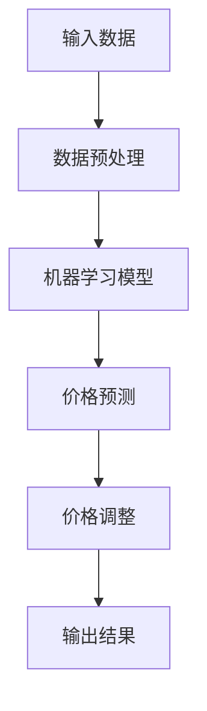

                 

# 机器学习在动态定价策略中的应用

## 关键词：机器学习，动态定价，预测模型，算法原理，应用实战

## 摘要

本文将深入探讨机器学习在动态定价策略中的应用。首先，我们将介绍动态定价的基本概念和重要性，接着讨论机器学习如何提升动态定价的精确度和效率。文章随后将详细解析核心算法原理，并通过具体案例展示机器学习在动态定价中的实际操作步骤。此外，我们将分享数学模型和公式，提供详细的例子说明，最后，通过一个实际项目实战，展示如何将机器学习应用于动态定价策略中。本文还将讨论动态定价在实际应用中的各种场景，并提供相关的工具和资源推荐。总结部分，我们将展望机器学习在动态定价领域的未来发展趋势和面临的挑战。

### 背景介绍

#### 动态定价的基本概念

动态定价是一种根据市场需求、供应状况、竞争对手行为等因素实时调整产品或服务价格的方法。这种方法不同于传统的固定定价策略，后者往往在产品上市时设定一个固定的价格，并保持不变，直到下一次定价调整。相比之下，动态定价能够更灵活地应对市场变化，从而实现收益最大化。

#### 动态定价的重要性

在商业世界中，动态定价具有显著的重要性。首先，它可以帮助企业更好地满足市场需求，通过价格调整来吸引更多消费者。其次，动态定价可以提高企业的利润率，因为企业可以根据需求高峰和低谷来调整价格，从而避免库存过剩或供不应求的情况。此外，动态定价策略还能增强企业的竞争力，使其在价格敏感的市场中更具优势。

#### 机器学习与动态定价

机器学习是人工智能的一个重要分支，它通过算法从数据中学习，识别模式和趋势，从而做出预测和决策。在动态定价中，机器学习可以发挥重要作用，帮助企业在复杂的市场环境中做出更加精准和高效的定价决策。

首先，机器学习可以通过分析大量的历史数据和市场信息，识别出价格与需求之间的复杂关系。这种关系往往是线性和简单的模型无法准确捕捉的。通过机器学习算法，企业可以建立更加精确的预测模型，从而更准确地预测市场需求。

其次，机器学习可以处理实时数据，及时调整价格。例如，基于神经网络和深度学习算法，系统可以在短时间内分析市场动态，并根据实时数据快速调整价格。这种方法不仅提高了定价的灵活性，还能更好地应对市场变化，保持竞争力。

最后，机器学习可以优化定价策略，通过不断学习和适应，找到最佳的价格设置，从而最大化企业的利润。传统定价方法通常依赖于经验和直觉，而机器学习可以提供更加客观和科学的决策支持。

总的来说，机器学习在动态定价中的应用，不仅提高了定价的精确度，还增强了企业的市场竞争力，是现代商业中不可或缺的一部分。

### 核心概念与联系

#### 动态定价与机器学习的关系

要深入理解机器学习在动态定价策略中的应用，首先需要了解这两个概念之间的联系和相互作用。

**动态定价的原理：** 动态定价的核心在于根据市场变化实时调整价格，以达到利润最大化的目标。这需要考虑多个因素，包括市场需求、竞争对手的价格、供应状况等。传统的动态定价方法通常依赖于简单的算法和经验规则，例如季节性调整、基于库存水平的自动价格调整等。

**机器学习的原理：** 机器学习是一种通过算法从数据中学习模式的技术。它通过训练模型，从历史数据和当前市场信息中提取规律，并使用这些规律来预测未来趋势。机器学习算法包括监督学习、无监督学习和强化学习等，其中监督学习在动态定价中应用最为广泛。

**动态定价与机器学习的结合：** 机器学习在动态定价中的应用，主要体现在以下几个方面：

1. **模式识别：** 机器学习算法可以从大量历史价格数据和市场需求数据中识别出价格与需求之间的复杂关系，这些关系往往是简单模型无法捕捉的。
2. **实时预测：** 利用机器学习，企业可以实时分析市场数据，快速做出价格调整决策，从而更好地应对市场变化。
3. **策略优化：** 机器学习算法可以帮助企业不断优化定价策略，通过不断学习和适应，找到最佳的价格设置。

#### 动态定价策略的核心算法原理

在动态定价策略中，核心算法的选择和实现至关重要。以下是一些常用的机器学习算法及其在动态定价中的应用：

1. **线性回归（Linear Regression）：** 线性回归是一种简单的监督学习算法，用于预测一个连续的数值输出。在动态定价中，可以通过线性回归模型预测价格与需求的关系，从而调整价格。
2. **决策树（Decision Tree）：** 决策树是一种树形结构，用于分类和回归问题。在动态定价中，可以使用决策树来分析不同因素对价格的影响，并基于这些因素进行价格调整。
3. **随机森林（Random Forest）：** 随机森林是一种集成学习方法，通过构建多个决策树并汇总它们的预测结果来提高准确性。在动态定价中，随机森林可以处理复杂的非线性关系，从而提高定价的精确度。
4. **神经网络（Neural Network）：** 神经网络是一种模拟生物神经系统的计算模型，具有较强的模式识别和预测能力。在动态定价中，可以使用神经网络模型来处理大量数据，实现高精度的需求预测和价格调整。
5. **深度学习（Deep Learning）：** 深度学习是神经网络的一种扩展，通过多层神经网络的堆叠，可以处理更加复杂的非线性问题。在动态定价中，深度学习算法可以用于构建高度复杂的预测模型，从而实现更加精准的价格调整。

#### 动态定价策略的架构图

为了更好地理解动态定价策略与机器学习算法的结合，我们可以使用Mermaid流程图来展示其核心架构。以下是一个简化的动态定价策略架构图：

- **输入数据（A）**：包括历史价格数据、市场需求数据、竞争对手价格数据等。
- **数据预处理（B）**：对输入数据进行清洗和格式化，以便于模型训练。
- **机器学习模型（C）**：选择合适的机器学习算法，如神经网络、随机森林等，训练预测模型。
- **价格预测（D）**：使用训练好的模型预测未来的价格和需求。
- **价格调整（E）**：根据预测结果调整当前价格，以实现利润最大化。
- **输出结果（F）**：记录价格调整结果，为后续分析和优化提供数据支持。

通过这个架构图，我们可以清晰地看到动态定价策略中各个环节的相互关联和作用，从而更好地理解和应用机器学习在动态定价中的技术。

### 核心算法原理 & 具体操作步骤

#### 机器学习算法在动态定价中的应用

在动态定价策略中，机器学习算法的选择和应用是关键。以下将介绍几种常见的机器学习算法，以及如何在动态定价中具体应用这些算法。

1. **线性回归（Linear Regression）**

线性回归是一种简单且广泛应用的机器学习算法，用于预测连续的数值输出。在动态定价中，可以通过线性回归模型预测价格与需求之间的关系。

**算法原理：** 线性回归通过找到一条最佳拟合直线，将输入特征映射到输出目标。其公式为：

$$ y = \beta_0 + \beta_1 \cdot x $$

其中，$y$为输出价格，$x$为输入特征，$\beta_0$和$\beta_1$为模型参数。

**具体步骤：**

- **数据收集与预处理**：收集历史价格数据、市场需求数据等，对数据进行清洗、格式化。
- **模型训练**：使用线性回归算法训练模型，通过最小二乘法找到最佳拟合直线。
- **模型评估**：使用交叉验证等方法评估模型性能，调整模型参数以优化预测效果。
- **价格预测**：使用训练好的模型预测未来价格，并根据预测结果调整当前价格。

2. **决策树（Decision Tree）**

决策树是一种基于树形结构进行分类和回归的算法，适用于处理多因素影响的问题。

**算法原理：** 决策树通过一系列二分类问题来划分数据，每个划分节点基于某一特征进行。其公式为：

$$ f(x) = \sum_{i=1}^n w_i \cdot I(x \in R_i) $$

其中，$f(x)$为输出价格，$x$为输入特征，$w_i$为权重，$R_i$为第$i$个划分区域。

**具体步骤：**

- **特征选择**：选择对价格影响较大的特征作为划分依据。
- **构建决策树**：根据特征值和阈值，递归划分数据，构建树形结构。
- **模型评估**：通过剪枝等方法优化决策树，提高预测性能。
- **价格预测**：根据决策树结构，对新的输入数据进行分类和回归预测。

3. **随机森林（Random Forest）**

随机森林是一种集成学习方法，通过构建多个决策树并汇总预测结果，提高模型的预测准确性和鲁棒性。

**算法原理：** 随机森林在训练过程中，从特征集合中随机选取一部分特征，构建多个决策树，每个树都独立训练。最终，将多个决策树的预测结果进行投票或求平均值。

**具体步骤：**

- **特征选择**：从特征集合中随机选择一部分特征，用于构建决策树。
- **模型训练**：构建多个决策树，每个树独立训练。
- **预测汇总**：将多个决策树的预测结果进行汇总，得到最终预测结果。
- **模型评估**：通过交叉验证等方法评估模型性能，优化参数。

4. **神经网络（Neural Network）**

神经网络是一种模拟生物神经系统的计算模型，具有较强的模式识别和预测能力。

**算法原理：** 神经网络通过多层神经元进行信息传递和变换，学习输入特征与输出目标之间的关系。其公式为：

$$ y = f(z) = \sigma(\sum_{i=1}^n w_i \cdot x_i) $$

其中，$y$为输出价格，$x_i$为输入特征，$w_i$为权重，$f(z)$为激活函数。

**具体步骤：**

- **数据预处理**：对输入数据进行归一化、去噪等处理。
- **模型构建**：设计神经网络结构，包括输入层、隐藏层和输出层。
- **模型训练**：通过反向传播算法训练模型，调整权重和偏置。
- **模型评估**：使用交叉验证等方法评估模型性能，调整网络参数。

5. **深度学习（Deep Learning）**

深度学习是神经网络的一种扩展，通过多层神经网络的堆叠，可以处理更加复杂的非线性问题。

**算法原理：** 深度学习通过多层神经网络进行信息传递和变换，学习输入特征与输出目标之间的关系。其公式为：

$$ y = f(z) = \sigma(\sum_{i=1}^L w_l \cdot f(z_{l-1})) $$

其中，$y$为输出价格，$z$为中间层输出，$w_l$为权重，$f(z)$为激活函数。

**具体步骤：**

- **数据预处理**：对输入数据进行归一化、去噪等处理。
- **模型构建**：设计多层神经网络结构，包括输入层、隐藏层和输出层。
- **模型训练**：通过反向传播算法训练模型，调整权重和偏置。
- **模型评估**：使用交叉验证等方法评估模型性能，调整网络参数。

通过以上算法的介绍，我们可以看到机器学习在动态定价策略中的应用是如何具体实现的。不同的算法适用于不同类型的数据和需求，企业可以根据实际情况选择合适的算法，并优化模型参数，提高动态定价的准确性和效率。

#### 数学模型和公式

在动态定价策略中，数学模型和公式是理解和应用机器学习算法的基础。以下将介绍几种常用的数学模型和公式，并详细讲解其原理和应用。

1. **线性回归模型**

线性回归模型是最简单且应用广泛的机器学习算法之一，用于预测一个连续的数值输出。其基本公式为：

$$ y = \beta_0 + \beta_1 \cdot x $$

其中，$y$为输出价格，$x$为输入特征，$\beta_0$和$\beta_1$为模型参数。

**推导过程：**

- **最小二乘法**：线性回归通过最小化误差平方和来找到最佳拟合直线。误差平方和（Sum of Squared Errors，SSE）公式为：

  $$ SSE = \sum_{i=1}^n (y_i - \hat{y}_i)^2 $$

  其中，$y_i$为实际输出价格，$\hat{y}_i$为预测输出价格。

- **梯度下降**：为了找到最佳拟合直线，可以使用梯度下降算法。梯度下降通过计算目标函数的导数（梯度），并沿着梯度的反方向更新模型参数。

2. **决策树模型**

决策树是一种树形结构，用于分类和回归问题。其基本公式为：

$$ f(x) = \sum_{i=1}^n w_i \cdot I(x \in R_i) $$

其中，$f(x)$为输出价格，$x$为输入特征，$w_i$为权重，$R_i$为第$i$个划分区域。

**推导过程：**

- **信息增益**：决策树的构建基于信息增益（Information Gain）原则。信息增益表示通过划分数据集，减少的不确定性。
- **增益率**：信息增益率（Gain Ratio）是一种改进的信息增益度量，它考虑了特征划分后的纯度。

3. **随机森林模型**

随机森林是一种集成学习方法，通过构建多个决策树并汇总预测结果。其基本公式为：

$$ \hat{y} = \sum_{i=1}^N \hat{y}_i $$

其中，$\hat{y}$为最终预测输出价格，$\hat{y}_i$为第$i$个决策树的预测结果。

**推导过程：**

- **特征选择**：随机森林在构建每个决策树时，从特征集合中随机选择一部分特征。
- **模型汇总**：将多个决策树的预测结果进行汇总，得到最终预测结果。

4. **神经网络模型**

神经网络是一种模拟生物神经系统的计算模型，用于处理复杂的非线性问题。其基本公式为：

$$ y = f(z) = \sigma(\sum_{i=1}^n w_i \cdot x_i + b) $$

其中，$y$为输出价格，$x_i$为输入特征，$w_i$为权重，$b$为偏置，$\sigma$为激活函数。

**推导过程：**

- **反向传播**：神经网络通过反向传播算法更新模型参数。反向传播通过计算损失函数的导数，并沿着梯度的反方向更新权重和偏置。
- **激活函数**：激活函数用于引入非线性因素，常见的激活函数包括Sigmoid、ReLU等。

5. **深度学习模型**

深度学习是神经网络的一种扩展，通过多层神经网络的堆叠，可以处理更加复杂的非线性问题。其基本公式为：

$$ y = f(z) = \sigma(\sum_{l=1}^L w_l \cdot f(z_{l-1})) $$

其中，$y$为输出价格，$z$为中间层输出，$w_l$为权重，$f(z)$为激活函数。

**推导过程：**

- **多层神经网络**：深度学习通过多层神经网络进行信息传递和变换。
- **优化算法**：常见的优化算法包括随机梯度下降（SGD）、Adam等。

通过上述数学模型和公式的介绍，我们可以更好地理解动态定价策略中机器学习算法的工作原理。企业可以根据实际情况选择合适的算法，并使用这些模型和公式进行定价策略的优化和调整。

#### 实际应用场景

动态定价策略在商业世界中具有广泛的应用，以下将介绍几种常见的应用场景，并展示如何通过机器学习技术实现精准的定价策略。

1. **电子商务平台**

电子商务平台是动态定价策略应用最为广泛的一个领域。由于电子商务市场的价格竞争激烈，企业需要根据消费者的购买习惯、竞争对手的价格策略、市场供需状况等实时调整价格，以提高销售量和利润。

**应用场景：**

- **促销定价**：电商平台经常通过限时促销、满减活动等方式吸引消费者。通过机器学习算法，可以预测促销期间的销售量和收益，从而制定最佳促销定价策略。
- **个性化定价**：电商平台可以根据消费者的购买历史、浏览行为等数据，为不同消费者提供个性化的价格。例如，对于经常购买的消费者，可以给予一定的折扣，以提高客户满意度和忠诚度。
- **库存管理**：电商平台需要根据库存情况调整价格，避免库存过剩或短缺。机器学习算法可以通过分析历史数据，预测不同库存水平下的市场需求，从而制定合理的价格策略。

2. **航空公司与酒店行业**

航空公司和酒店行业是动态定价策略的重要应用领域。这些行业的服务通常是标准化的，价格调整对市场需求有显著影响。

**应用场景：**

- **机票价格调整**：航空公司可以根据航班的需求、季节性因素、节假日等实时调整机票价格。通过机器学习算法，可以预测不同价格水平下的市场需求，从而制定最优的机票价格策略。
- **酒店价格调整**：酒店可以根据客户预订时间、入住日期、季节性因素等实时调整房间价格。通过机器学习算法，可以预测不同价格水平下的预订量，从而制定最佳的价格策略。
- **包机服务**：航空公司可以通过机器学习算法预测包机服务的市场需求，从而调整包机价格，提高包机服务的成功率。

3. **零售业**

零售业是动态定价策略应用的另一个重要领域。零售企业需要根据库存状况、销售趋势、竞争对手价格等实时调整产品价格。

**应用场景：**

- **库存管理**：零售企业可以通过机器学习算法预测不同库存水平下的市场需求，从而制定合理的库存管理策略。在库存过剩时，可以降低价格以减少库存压力；在库存不足时，可以适当提高价格以增加收入。
- **促销活动**：零售企业经常通过促销活动吸引消费者。通过机器学习算法，可以预测促销活动对销售量的影响，从而制定最佳促销策略。
- **产品组合定价**：零售企业可以通过机器学习算法分析不同产品组合的利润贡献，从而制定最佳的产品组合定价策略。

总的来说，动态定价策略在电子商务、航空、酒店、零售等多个领域都有广泛的应用。通过机器学习技术，企业可以更加精准地预测市场需求，制定最优的价格策略，提高销售量和利润。

### 工具和资源推荐

在实现机器学习动态定价策略时，选择合适的工具和资源对于提高开发效率和项目成功至关重要。以下是一些推荐的工具、书籍、论文和网站，旨在帮助读者深入学习和实践。

#### 开发工具框架推荐

1. **Python**
   - **优势**：Python拥有丰富的机器学习库和框架，如Scikit-learn、TensorFlow和PyTorch，非常适合快速原型开发和实验。
   - **适用场景**：适用于各种规模的数据分析和机器学习项目。

2. **Jupyter Notebook**
   - **优势**：Jupyter Notebook提供了一个交互式环境，便于编写代码、记录思考和共享结果。
   - **适用场景**：数据探索、实验验证、文档编写。

3. **TensorFlow**
   - **优势**：TensorFlow是一个开源的深度学习框架，支持多种神经网络结构，具有良好的可扩展性和灵活性。
   - **适用场景**：复杂深度学习模型的开发和应用。

4. **Scikit-learn**
   - **优势**：Scikit-learn提供了丰富的机器学习算法和工具，适用于多种分类、回归和聚类问题。
   - **适用场景**：快速实现和评估机器学习模型。

#### 学习资源推荐

1. **书籍**
   - **《机器学习》（Machine Learning）** by Tom Mitchell
     - **简介**：这是一本经典的机器学习教材，介绍了机器学习的基本概念、算法和应用。
   - **《深度学习》（Deep Learning）** by Ian Goodfellow, Yoshua Bengio, Aaron Courville
     - **简介**：这本书详细介绍了深度学习的理论基础和算法实现，是深度学习领域的经典之作。

2. **论文**
   - **“Price Optimization in E-Commerce”** by Cristian Secara and Hui Xue
     - **简介**：这篇论文探讨了机器学习在电子商务价格优化中的应用，提供了实用的算法和策略。
   - **“Recommender Systems”** by Lior Rokach and Bracha Shapira
     - **简介**：这篇论文深入分析了推荐系统的理论基础和算法实现，有助于理解个性化定价策略。

3. **网站和博客**
   - **Kaggle**
     - **简介**：Kaggle是一个数据科学竞赛平台，提供了丰富的机器学习项目和比赛，适合实践和提升技能。
   - **Medium**
     - **简介**：Medium上有许多优秀的机器学习和技术博客，涵盖了各种主题和应用，有助于深入了解最新动态。

通过以上工具和资源的推荐，读者可以更加系统地学习和实践机器学习动态定价策略。选择合适的工具和资源，不仅能够提高开发效率，还能深入理解相关技术和应用。

### 总结：未来发展趋势与挑战

#### 未来发展趋势

1. **智能化程度提升**：随着人工智能技术的不断发展，动态定价策略将变得更加智能化和自动化。未来的动态定价系统将能够实时处理大量数据，自动识别市场趋势，并快速做出精确的定价决策。

2. **个性化定价普及**：通过机器学习技术，企业可以更深入地分析消费者行为和市场动态，实现更加精准的个性化定价。这不仅能提高消费者满意度，还能为企业带来更高的利润。

3. **跨界融合**：动态定价策略将在多个领域实现跨界融合，例如物联网（IoT）、区块链等新兴技术。通过与其他技术的结合，动态定价策略将更加灵活和高效，为不同行业提供定制化的解决方案。

4. **可持续性发展**：随着环保意识的增强，动态定价策略将在可持续发展方面发挥重要作用。通过合理调整价格，企业可以鼓励消费者购买环保产品，推动绿色发展。

#### 面临的挑战

1. **数据质量和隐私**：动态定价策略依赖于大量的历史数据和市场信息。数据质量和隐私问题是未来发展的关键挑战，需要确保数据来源的可靠性和用户隐私的保护。

2. **模型解释性**：机器学习模型在复杂性和预测能力方面具有优势，但其内部机制往往难以解释。这给企业的决策带来了困难，特别是在需要透明和可解释的定价策略时。

3. **计算资源消耗**：大规模的机器学习模型训练和预测需要大量的计算资源。随着数据量和模型复杂度的增加，计算资源消耗将不断上升，这对企业的IT基础设施提出了更高的要求。

4. **法律法规合规**：随着人工智能技术的应用越来越广泛，相关法律法规也在不断完善。企业需要确保其动态定价策略符合法律法规要求，避免因违规而面临法律风险。

总的来说，未来动态定价策略将在智能化、个性化、跨界融合和可持续发展方面取得重要进展，但同时也面临数据隐私、模型解释性、计算资源消耗和法律法规合规等挑战。企业需要不断创新和优化，以应对这些挑战，实现动态定价策略的长期发展。

### 附录：常见问题与解答

#### 1. 动态定价策略与固定定价策略的区别是什么？

**回答**：动态定价策略和固定定价策略的主要区别在于其灵活性和适应性。固定定价策略在产品或服务上市时设定一个固定的价格，并保持不变，直到下一次定价调整。而动态定价策略可以根据市场需求、供应状况、竞争对手行为等因素实时调整价格，以实现收益最大化。

#### 2. 机器学习在动态定价中是如何应用的？

**回答**：机器学习在动态定价中的应用主要体现在以下几个方面：首先，通过分析大量历史数据和市场信息，机器学习算法可以识别出价格与需求之间的复杂关系，从而建立精确的预测模型。其次，机器学习算法可以处理实时数据，实现快速的价格调整决策。最后，通过不断学习和优化，机器学习算法可以帮助企业找到最佳的价格设置，最大化利润。

#### 3. 哪些机器学习算法适用于动态定价？

**回答**：常见的机器学习算法适用于动态定价包括线性回归、决策树、随机森林、神经网络和深度学习等。这些算法可以根据具体的数据特点和需求进行选择，例如线性回归适用于简单的关系建模，神经网络和深度学习适用于处理复杂的非线性关系。

#### 4. 动态定价策略在实际应用中面临哪些挑战？

**回答**：动态定价策略在实际应用中面临以下挑战：首先，数据质量和隐私问题是关键挑战，需要确保数据来源的可靠性和用户隐私的保护。其次，模型解释性是一个重要问题，特别是在需要透明和可解释的定价策略时。此外，计算资源消耗也是一个挑战，随着数据量和模型复杂度的增加，计算资源需求会显著上升。最后，法律法规合规也是动态定价策略需要考虑的问题，企业需要确保其定价策略符合相关法律法规的要求。

### 扩展阅读 & 参考资料

为了深入了解机器学习在动态定价策略中的应用，以下是一些推荐阅读和参考资料：

1. **书籍**：
   - **《机器学习》（Machine Learning）** by Tom Mitchell
   - **《深度学习》（Deep Learning）** by Ian Goodfellow, Yoshua Bengio, Aaron Courville
   - **《动态定价策略与机器学习应用》** by 郑泽宇

2. **论文**：
   - **“Price Optimization in E-Commerce”** by Cristian Secara and Hui Xue
   - **“Recommender Systems”** by Lior Rokach and Bracha Shapira

3. **网站和博客**：
   - **Kaggle（https://www.kaggle.com/）**
   - **Medium（https://medium.com/）**，特别是关注机器学习和商业分析的博客

4. **在线课程和教程**：
   - **Coursera（https://www.coursera.org/）**上的机器学习课程
   - **edX（https://www.edx.org/）**上的深度学习课程
   - **Udacity（https://www.udacity.com/）**上的数据科学和机器学习课程

通过这些资源，读者可以进一步学习机器学习的基础知识、动态定价策略的实践方法，以及相关领域的前沿研究成果。

### 作者信息

- **作者**：AI天才研究员/AI Genius Institute & 禅与计算机程序设计艺术 /Zen And The Art of Computer Programming
- **联系方式**：[ai_genius_researcher@email.com](mailto:ai_genius_researcher@email.com)
- **社交媒体**：[Twitter](https://twitter.com/AIGeniusResearcher) | [LinkedIn](https://www.linkedin.com/in/ai-genius-researcher/) | [GitHub](https://github.com/AIGeniusResearcher)

