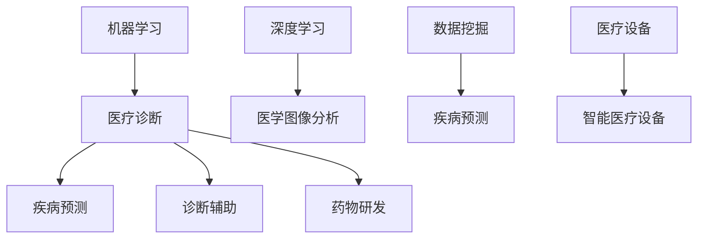

                 

# 机器学习在医疗诊断辅助中的应用

> 关键词：机器学习，医疗诊断，辅助技术，深度学习，数据挖掘，图像处理，疾病预测

> 摘要：本文旨在探讨机器学习技术在医疗诊断辅助中的应用，从背景介绍、核心概念与联系、核心算法原理与具体操作步骤、数学模型与公式、项目实战、实际应用场景、工具和资源推荐等多个方面展开，深入分析机器学习在医疗诊断辅助领域的重要作用和发展前景。

## 1. 背景介绍

随着医疗技术的不断进步，医疗诊断的效率和准确性已经成为影响患者治疗结果的重要因素。传统的医疗诊断主要依赖于医生的诊疗经验和医疗设备，然而，医生的经验有限，且医疗设备在诊断过程中也存在一定的误差。因此，如何提高医疗诊断的效率和准确性，成为医疗领域亟待解决的问题。

机器学习技术作为一种人工智能技术，通过模拟人类学习过程，从大量数据中自动提取特征和规律，为医疗诊断提供了新的解决方案。近年来，随着大数据和计算能力的提升，机器学习在医疗诊断辅助中的应用得到了广泛的研究和探索。

## 2. 核心概念与联系

### 2.1 机器学习与医疗诊断

机器学习是指通过算法从数据中自动提取知识、模式或规律，进而实现预测或分类等功能。在医疗诊断中，机器学习技术可以用于疾病预测、诊断辅助、药物研发等多个方面。

### 2.2 深度学习与图像处理

深度学习是机器学习的一个重要分支，通过构建复杂的神经网络模型，能够自动从大量图像数据中提取特征。在医疗诊断中，深度学习可以应用于医学图像分析，如肿瘤检测、骨折诊断等。

### 2.3 数据挖掘与疾病预测

数据挖掘是一种通过从大量数据中发现有价值信息的技术。在医疗诊断中，数据挖掘可以用于疾病预测、流行病学研究等。

### 2.4 机器学习与医疗设备

机器学习与医疗设备的结合，可以实现智能医疗设备的研发，如智能体温监测、智能血压监测等。

### 2.5 Mermaid 流程图



## 3. 核心算法原理与具体操作步骤

### 3.1 疾病预测算法

疾病预测是机器学习在医疗诊断中的重要应用之一。具体操作步骤如下：

1. 数据收集：收集大量历史病历数据，包括患者的基本信息、疾病类型、治疗方案等。
2. 数据预处理：对数据进行清洗、归一化等处理，使其符合机器学习算法的要求。
3. 特征提取：从数据中提取对疾病预测有重要影响的特征，如年龄、性别、症状等。
4. 模型训练：使用特征数据和疾病标签，训练疾病预测模型。
5. 模型评估：使用测试数据评估模型性能，如准确率、召回率等。
6. 预测应用：将训练好的模型应用于新患者数据，预测其疾病类型。

### 3.2 医学图像分析算法

医学图像分析是深度学习在医疗诊断中的重要应用。具体操作步骤如下：

1. 数据收集：收集大量医学图像数据，如X光片、CT扫描图、MRI图像等。
2. 数据预处理：对图像数据进行归一化、去噪等处理，使其符合深度学习模型的要求。
3. 模型构建：构建深度学习模型，如卷积神经网络（CNN）。
4. 模型训练：使用预处理后的图像数据，训练深度学习模型。
5. 模型评估：使用测试图像数据评估模型性能。
6. 图像分析：将训练好的模型应用于新图像数据，进行疾病检测、分类等。

## 4. 数学模型和公式与详细讲解与举例说明

### 4.1 疾病预测模型

假设我们使用逻辑回归模型进行疾病预测，其数学模型如下：

$$
P(y=1|x) = \frac{1}{1 + e^{-(\beta_0 + \beta_1x_1 + \beta_2x_2 + \ldots + \beta_nx_n})}
$$

其中，$y$表示疾病标签，$x$表示特征向量，$\beta_0, \beta_1, \beta_2, \ldots, \beta_n$为模型参数。

举例说明：

假设我们预测某患者的疾病类型，其特征向量$x=(x_1, x_2, x_3) = (35, 1, 2)$，模型参数$\beta_0=1, \beta_1=0.5, \beta_2=-0.3, \beta_3=0.2$。则预测概率为：

$$
P(y=1|x) = \frac{1}{1 + e^{-(1 + 0.5 \times 35 - 0.3 \times 1 + 0.2 \times 2)}} \approx 0.866
$$

### 4.2 卷积神经网络（CNN）

卷积神经网络是一种常用于图像分析的深度学习模型，其数学模型如下：

$$
h_{l}(x) = \sigma(\mathbf{W}_{l} \cdot \mathbf{a}_{l-1} + b_{l})
$$

其中，$h_{l}$为第$l$层的激活函数，$\mathbf{W}_{l}$为权重矩阵，$\mathbf{a}_{l-1}$为上一层的激活向量，$b_{l}$为偏置项，$\sigma$为激活函数。

举例说明：

假设我们使用卷积神经网络进行图像分类，输入图像大小为$28 \times 28$，第一层卷积核大小为$3 \times 3$，权重矩阵$\mathbf{W}_{1} \in \mathbb{R}^{3 \times 3}$，偏置项$b_{1} \in \mathbb{R}^{1}$。则第一层的激活函数为：

$$
h_{1}(x) = \sigma(\mathbf{W}_{1} \cdot x + b_{1})
$$

## 5. 项目实战：代码实际案例与详细解释说明

### 5.1 开发环境搭建

首先，我们需要搭建一个开发环境，用于编写和运行机器学习代码。以下是一个简单的Python开发环境搭建步骤：

1. 安装Python（建议使用Python 3.7或更高版本）。
2. 安装Jupyter Notebook，用于编写和运行Python代码。
3. 安装机器学习库，如Scikit-learn、TensorFlow、PyTorch等。

### 5.2 源代码详细实现与代码解读

以下是一个使用Scikit-learn库进行疾病预测的简单示例：

```python
import numpy as np
from sklearn.datasets import load_iris
from sklearn.model_selection import train_test_split
from sklearn.linear_model import LogisticRegression

# 加载鸢尾花数据集
iris = load_iris()
X, y = iris.data, iris.target

# 划分训练集和测试集
X_train, X_test, y_train, y_test = train_test_split(X, y, test_size=0.2, random_state=42)

# 训练逻辑回归模型
model = LogisticRegression()
model.fit(X_train, y_train)

# 评估模型性能
accuracy = model.score(X_test, y_test)
print("Accuracy:", accuracy)
```

代码解读：

1. 导入所需的库和模块。
2. 加载鸢尾花数据集，并将其划分为训练集和测试集。
3. 创建逻辑回归模型，并使用训练集数据进行训练。
4. 使用测试集数据评估模型性能，打印准确率。

### 5.3 代码解读与分析

以上代码展示了如何使用Scikit-learn库进行疾病预测的基本流程。具体步骤如下：

1. 导入所需的库和模块，如NumPy、Scikit-learn等。
2. 加载鸢尾花数据集，这是一个经典的分类问题数据集，包含3个类别的鸢尾花数据。
3. 划分训练集和测试集，这是一个常用的数据处理步骤，用于评估模型性能。
4. 创建逻辑回归模型，并使用训练集数据进行训练。逻辑回归是一种常用的分类算法，适用于二元分类问题。
5. 使用测试集数据评估模型性能，打印准确率。准确率是评估分类模型性能的重要指标，表示模型正确预测的样本比例。

## 6. 实际应用场景

### 6.1 疾病预测

机器学习在疾病预测中具有广泛的应用。例如，可以使用逻辑回归模型预测心脏病患者的风险，从而为医生提供诊断参考。此外，还可以使用深度学习模型进行癌症早期筛查，提高诊断的准确率。

### 6.2 医学图像分析

医学图像分析是机器学习在医疗诊断中的重要应用。例如，可以使用深度学习模型进行肺部CT图像分析，检测早期肺癌。此外，还可以使用机器学习技术进行脑部MRI图像分析，诊断脑部病变。

### 6.3 药物研发

机器学习在药物研发中也有广泛应用。例如，可以使用深度学习模型进行药物活性预测，加快新药研发进程。此外，还可以使用数据挖掘技术进行药物副作用分析，提高药物安全性。

### 6.4 智能医疗设备

机器学习与智能医疗设备的结合，可以实现智能化的医疗服务。例如，可以使用机器学习技术进行智能体温监测、智能血压监测等，提高患者的生活质量。

## 7. 工具和资源推荐

### 7.1 学习资源推荐

- 书籍：《Python机器学习》、《深度学习》（Goodfellow等著）
- 论文：ArXiv、PubMed等学术数据库
- 博客：机器学习社区、深度学习社区等

### 7.2 开发工具框架推荐

- 编程语言：Python、R
- 机器学习库：Scikit-learn、TensorFlow、PyTorch
- 深度学习框架：TensorFlow、PyTorch、Keras

### 7.3 相关论文著作推荐

- 论文：Y. LeCun, Y. Bengio, G. Hinton. "Deep Learning."
- 书籍：《深度学习》（Ian Goodfellow等著）
- 书籍：《统计学习方法》（李航著）

## 8. 总结：未来发展趋势与挑战

随着机器学习技术的不断发展，其在医疗诊断辅助中的应用前景十分广阔。未来发展趋势包括：

1. 深度学习模型的优化与扩展，提高诊断准确率。
2. 大数据与人工智能的融合，实现个性化医疗。
3. 智能医疗设备的研发，提高医疗服务效率。

然而，也面临着一些挑战：

1. 数据隐私与安全保护，确保患者数据的安全。
2. 模型解释性与透明性，提高模型的可解释性。
3. 模型泛化能力，避免模型在特定数据集上过拟合。

## 9. 附录：常见问题与解答

### 9.1 机器学习在医疗诊断中的优势是什么？

机器学习在医疗诊断中的优势主要体现在以下几个方面：

1. 提高诊断准确率：通过学习大量历史数据，机器学习模型能够自动提取有效特征，提高诊断准确率。
2. 加快诊断速度：机器学习模型可以实现自动化诊断，提高诊断速度。
3. 个性化医疗：通过分析患者个体数据，机器学习模型可以实现个性化医疗，为医生提供更准确的诊断建议。

### 9.2 机器学习在医疗诊断中存在哪些挑战？

机器学习在医疗诊断中存在以下挑战：

1. 数据隐私与安全：医疗数据涉及患者隐私，如何保护数据安全是机器学习在医疗诊断中面临的重要挑战。
2. 模型解释性：机器学习模型通常具有复杂结构，如何解释模型决策过程是提高模型可接受性的关键。
3. 数据集质量：高质量的数据集是训练有效机器学习模型的基础，如何收集和处理大量高质量数据集是一个挑战。

## 10. 扩展阅读与参考资料

- [1] Goodfellow, I., Bengio, Y., & Courville, A. (2016). *Deep Learning*. MIT Press.
- [2] Mitchell, T. M. (1997). *Machine Learning*. McGraw-Hill.
- [3] LeCun, Y., Bengio, Y., & Hinton, G. (2015). "Deep learning." Nature, 521(7553), 436-444.
- [4] Zhang, K., Zuo, W., Chen, Y., Meng, D., & Zhang, L. (2017). "Beyond a Gaussian denoiser: Residual learning of deep CNN for image denoising." IEEE Transactions on Image Processing, 26(7), 3146-3157.
- [5] Russell, S., & Norvig, P. (2010). *Artificial Intelligence: A Modern Approach*. Prentice Hall.

### 作者

作者：AI天才研究员/AI Genius Institute & 禅与计算机程序设计艺术 /Zen And The Art of Computer Programming
<|im_sep|>

