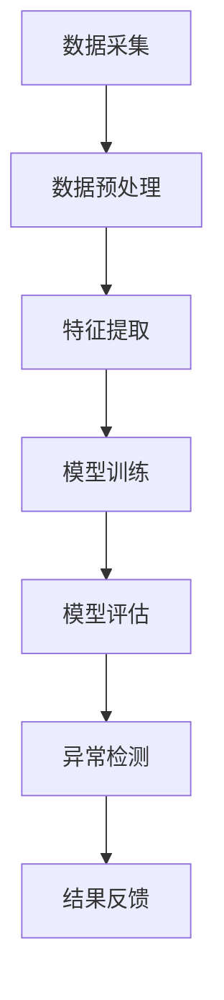

                 

### 背景介绍

#### 工业物联网 (IIoT) 的崛起

工业物联网（Industrial Internet of Things，IIoT）是一种将物理设备、传感器、软件和网络技术相结合，实现设备互联互通，进而提升工业生产效率、降低成本、提高设备维护管理水平的一种新型工业系统。随着物联网技术的迅猛发展，工业物联网在各个领域中的应用越来越广泛。

工业物联网的基本架构通常包括感知层、网络层、平台层和应用层。感知层主要通过传感器采集设备状态数据；网络层则负责将感知层的数据传输至平台层；平台层对数据进行处理、分析和存储；应用层则根据处理结果提供相应的应用服务。

#### 异常检测在工业物联网中的重要性

在工业物联网系统中，异常检测是一项至关重要的任务。异常检测的目的是识别和定位系统中的异常情况，如设备故障、数据错误、异常行为等，从而及时采取措施，避免潜在的损失和风险。

异常检测在工业物联网中的重要性主要体现在以下几个方面：

1. **提高设备维护效率**：通过实时监控设备状态，及时发现设备故障，有助于降低设备故障率和维护成本。
2. **保障生产安全**：工业生产过程中，异常情况可能导致生产事故，威胁工人安全和生产设备。异常检测可以提前预警，降低生产安全风险。
3. **优化生产流程**：异常检测可以帮助企业优化生产流程，提高生产效率，降低生产成本。
4. **数据分析和决策支持**：通过分析异常数据，企业可以深入了解生产系统的运行状况，为决策提供数据支持。

#### 机器学习在异常检测中的应用

随着大数据和机器学习技术的发展，机器学习在工业物联网异常检测中的应用越来越广泛。机器学习算法可以从海量数据中提取特征，自动识别设备运行中的异常模式，从而提高异常检测的准确性和效率。

在工业物联网异常检测中，常用的机器学习算法包括：

1. **监督学习算法**：如决策树、随机森林、支持向量机等，这些算法需要依赖标注数据进行训练。
2. **无监督学习算法**：如K均值聚类、主成分分析等，这些算法不需要依赖标注数据，但通常在异常检测中效果较差。
3. **半监督学习算法**：结合了监督学习和无监督学习的优点，可以充分利用未标注的数据，提高异常检测的准确性。

机器学习在工业物联网异常检测中的应用，不仅提高了异常检测的准确性，还使得系统更加智能化，为工业生产提供了有力支持。

### 核心概念与联系

为了更好地理解机器学习在工业物联网异常检测中的应用，我们需要先了解一些核心概念和其相互关系。

#### 1. 数据采集与处理

数据采集是工业物联网异常检测的基础。传感器、PLC（可编程逻辑控制器）和SCADA（监控与数据采集系统）等设备可以实时采集设备状态、环境参数等数据。然而，原始数据通常包含噪声、缺失值和冗余信息，因此需要进行预处理。

数据预处理包括以下几个步骤：

1. **去噪**：去除数据中的噪声，提高数据质量。
2. **缺失值处理**：对于缺失值，可以通过插值、平均值填充等方法进行补充。
3. **特征选择**：选择对异常检测最重要的特征，减少冗余信息。
4. **数据归一化**：将不同量纲的数据转化为同一量纲，便于后续分析和建模。

#### 2. 机器学习算法

机器学习算法是异常检测的核心。根据数据标注情况，机器学习算法可以分为监督学习、无监督学习和半监督学习。

1. **监督学习**：需要依赖标注数据进行训练，如决策树、支持向量机等。
2. **无监督学习**：不需要依赖标注数据，如K均值聚类、主成分分析等。
3. **半监督学习**：结合了监督学习和无监督学习的优点，可以充分利用未标注的数据，如标签传播算法等。

#### 3. 异常检测指标

异常检测指标用于评估异常检测的准确性。常见的指标包括：

1. **精确率（Precision）**：表示检测到的异常样本中实际为异常的比例。
2. **召回率（Recall）**：表示实际为异常的样本中被检测到的比例。
3. **F1值（F1-score）**：精确率和召回率的加权平均，用于综合评估异常检测的性能。

#### 4. 数据流与处理流程

工业物联网异常检测的数据流和处理流程可以分为以下几个阶段：

1. **数据采集**：传感器、PLC和SCADA等设备实时采集设备状态数据。
2. **数据预处理**：去除噪声、缺失值处理、特征选择和归一化等。
3. **特征提取**：从预处理后的数据中提取对异常检测最重要的特征。
4. **模型训练**：使用训练数据对机器学习算法进行训练。
5. **模型评估**：使用测试数据对训练好的模型进行评估，调整模型参数。
6. **异常检测**：使用训练好的模型对实时数据进行分析，识别异常情况。
7. **结果反馈**：将检测到的异常情况反馈给相关人员，以便及时采取措施。

#### Mermaid 流程图

以下是一个简单的 Mermaid 流程图，描述了工业物联网异常检测的核心概念与联系：



在这个流程中，数据采集、数据预处理、特征提取、模型训练、模型评估和异常检测是异常检测的关键环节，而结果反馈则是整个流程的最终目标。

### 核心算法原理 & 具体操作步骤

在工业物联网异常检测中，常用的机器学习算法包括监督学习算法和无监督学习算法。下面将详细解释这些算法的基本原理和具体操作步骤。

#### 监督学习算法

监督学习算法是指通过已标注的训练数据来构建模型，并利用模型对未知数据进行预测。在工业物联网异常检测中，监督学习算法可以用于检测设备故障、生产异常等。

##### 1. 决策树算法

决策树算法是一种基于树形结构的分类算法，通过连续地对数据集进行分割，将数据集划分成具有最大信息增益的子集，直到满足停止条件。

**具体操作步骤**：

1. **数据准备**：收集设备运行数据，并进行预处理。
2. **特征选择**：选择对异常检测最重要的特征。
3. **构建决策树**：使用已标注的训练数据构建决策树模型，选择最佳分裂标准（如信息增益、基尼不纯度等）。
4. **模型评估**：使用测试数据对构建的决策树模型进行评估，调整模型参数。
5. **异常检测**：使用训练好的决策树模型对实时数据进行异常检测。

##### 2. 随机森林算法

随机森林算法是一种基于决策树的集成学习方法，通过构建多个决策树模型，并结合模型的预测结果进行投票，提高预测的准确性和稳定性。

**具体操作步骤**：

1. **数据准备**：收集设备运行数据，并进行预处理。
2. **特征选择**：选择对异常检测最重要的特征。
3. **构建随机森林模型**：使用已标注的训练数据构建多个决策树模型，设置合适的参数（如树的数量、树的最大深度等）。
4. **模型评估**：使用测试数据对构建的随机森林模型进行评估，调整模型参数。
5. **异常检测**：使用训练好的随机森林模型对实时数据进行异常检测。

#### 无监督学习算法

无监督学习算法是指在没有标注数据的条件下，通过自动发现数据中的规律和模式。在工业物联网异常检测中，无监督学习算法可以用于检测未知的异常模式。

##### 1. K均值聚类算法

K均值聚类算法是一种基于距离度量的聚类算法，通过迭代优化，将数据集划分为若干个簇，每个簇的中心即为该簇的代表点。

**具体操作步骤**：

1. **数据准备**：收集设备运行数据，并进行预处理。
2. **初始化聚类中心**：随机选择K个初始聚类中心。
3. **分配数据点**：计算每个数据点到各个聚类中心的距离，将数据点分配到距离最近的聚类中心。
4. **更新聚类中心**：计算各个聚类中心的新位置。
5. **迭代优化**：重复执行步骤3和4，直到聚类中心不再发生较大变化。
6. **异常检测**：将异常数据点识别为与其他数据点差异较大的簇，标记为异常。

##### 2. 主成分分析算法

主成分分析（PCA）是一种降维算法，通过将数据投影到新的正交坐标系上，提取出最重要的主成分，减少数据维度。

**具体操作步骤**：

1. **数据准备**：收集设备运行数据，并进行预处理。
2. **计算协方差矩阵**：计算各特征之间的协方差矩阵。
3. **计算特征值和特征向量**：对协方差矩阵进行特征值分解，得到特征值和特征向量。
4. **选取主成分**：根据特征值大小，选取最重要的特征向量作为主成分。
5. **数据降维**：将数据投影到主成分空间，实现降维。
6. **异常检测**：通过分析降维后的数据，识别出异常数据点。

#### 混合算法

在实际应用中，为了提高异常检测的准确性和稳定性，可以采用混合算法，结合监督学习和无监督学习的方法。

**具体操作步骤**：

1. **数据准备**：收集设备运行数据，并进行预处理。
2. **特征提取**：使用无监督学习算法（如PCA）提取主成分，实现降维。
3. **训练监督学习模型**：使用监督学习算法（如决策树、随机森林）对降维后的数据进行训练。
4. **模型评估**：使用测试数据对训练好的模型进行评估，调整模型参数。
5. **异常检测**：使用训练好的模型对实时数据进行异常检测。

通过以上操作步骤，可以构建一个较为完善的工业物联网异常检测系统，实现设备故障、生产异常等异常情况的实时监控和预警。

### 数学模型和公式 & 详细讲解 & 举例说明

在工业物联网异常检测中，常用的数学模型和公式包括线性回归、逻辑回归和支持向量机等。下面将详细讲解这些模型的基本原理和公式，并通过具体例子进行说明。

#### 1. 线性回归模型

线性回归模型是一种用于预测数值型变量的统计模型。其基本思想是通过拟合一条直线，将自变量和因变量之间的关系表示出来。

**公式**：

$$ y = \beta_0 + \beta_1x_1 + \beta_2x_2 + \ldots + \beta_nx_n + \epsilon $$

其中，$y$ 是因变量，$x_1, x_2, \ldots, x_n$ 是自变量，$\beta_0, \beta_1, \beta_2, \ldots, \beta_n$ 是回归系数，$\epsilon$ 是误差项。

**具体例子**：

假设我们要预测一家工厂的生产效率（因变量 $y$）与机器运行时间（自变量 $x_1$）和机器温度（自变量 $x_2$）之间的关系。通过收集数据，可以得到以下线性回归模型：

$$ y = 10 + 2x_1 + 3x_2 + \epsilon $$

根据这个模型，当机器运行时间为 100 小时，机器温度为 30°C 时，预测的生产效率为：

$$ y = 10 + 2 \times 100 + 3 \times 30 + \epsilon = 250 + \epsilon $$

其中，$\epsilon$ 是误差项，表示实际生产效率与预测生产效率之间的差距。

#### 2. 逻辑回归模型

逻辑回归模型是一种用于预测概率的统计模型。其基本思想是通过拟合一个逻辑函数，将自变量和因变量之间的关系表示为概率形式。

**公式**：

$$ P(y=1) = \frac{1}{1 + e^{-(\beta_0 + \beta_1x_1 + \beta_2x_2 + \ldots + \beta_nx_n)}} $$

其中，$P(y=1)$ 是因变量为 1 的概率，$e$ 是自然对数的底数，$\beta_0, \beta_1, \beta_2, \ldots, \beta_n$ 是回归系数。

**具体例子**：

假设我们要预测一家工厂的设备是否会出现故障（因变量 $y$，取值为 0 或 1），与机器运行时间（自变量 $x_1$）和机器温度（自变量 $x_2$）之间的关系。通过收集数据，可以得到以下逻辑回归模型：

$$ P(y=1) = \frac{1}{1 + e^{-(5 + 2x_1 + 3x_2)}} $$

根据这个模型，当机器运行时间为 100 小时，机器温度为 30°C 时，设备故障的概率为：

$$ P(y=1) = \frac{1}{1 + e^{-(5 + 2 \times 100 + 3 \times 30)}} = \frac{1}{1 + e^{-350}} \approx 0.000035 $$

这意味着，当机器运行时间为 100 小时，机器温度为 30°C 时，设备出现故障的概率非常小。

#### 3. 支持向量机模型

支持向量机（SVM）是一种用于分类的机器学习算法。其基本思想是通过找到一个最优的超平面，将不同类别的数据点分隔开来。

**公式**：

$$ \text{最大化} \quad \frac{1}{C} \sum_{i=1}^{n} (y_i (\beta \cdot x_i + \beta_0) - 1)^2 $$

其中，$C$ 是惩罚参数，$y_i$ 是样本标签，$x_i$ 是样本特征向量，$\beta$ 是权重向量，$\beta_0$ 是偏置项。

**具体例子**：

假设我们要使用支持向量机对一家工厂的设备故障情况进行分类（故障：1，正常：0），根据机器运行时间（自变量 $x_1$）和机器温度（自变量 $x_2$）构建分类模型。通过收集数据，可以得到以下支持向量机模型：

$$ \text{最大化} \quad \frac{1}{C} \sum_{i=1}^{n} (y_i (\beta \cdot x_i + \beta_0) - 1)^2 $$

其中，$C$ 是惩罚参数，$\beta$ 是权重向量，$\beta_0$ 是偏置项。

根据这个模型，当机器运行时间为 100 小时，机器温度为 30°C 时，设备的故障概率为：

$$ \text{故障概率} = \frac{1}{1 + e^{-(\beta \cdot (100, 30) + \beta_0)}} $$

其中，$\beta$ 和 $\beta_0$ 是通过训练数据得到的权重向量。

通过以上数学模型和公式的讲解，我们可以更好地理解工业物联网异常检测中的核心算法，并通过具体例子进行实际应用。在实际应用中，根据具体问题和数据特点，选择合适的模型和算法，可以有效提高异常检测的准确性和效率。

### 项目实战：代码实际案例和详细解释说明

在本节中，我们将通过一个具体的工业物联网异常检测项目，展示如何使用Python和机器学习库（如Scikit-learn）来实现异常检测。我们将分阶段进行项目实战，包括开发环境搭建、源代码实现和代码解读与分析。

#### 5.1 开发环境搭建

在进行项目实战之前，首先需要搭建开发环境。以下是开发环境搭建的步骤：

1. **安装Python**：下载并安装Python 3.8版本。
2. **安装Jupyter Notebook**：在终端中执行以下命令安装Jupyter Notebook：

   ```bash
   pip install notebook
   ```

3. **安装Scikit-learn**：在终端中执行以下命令安装Scikit-learn：

   ```bash
   pip install scikit-learn
   ```

4. **安装其他依赖库**：如Matplotlib、Pandas等：

   ```bash
   pip install matplotlib pandas
   ```

完成以上步骤后，开发环境搭建完成。

#### 5.2 源代码详细实现和代码解读

以下是实现工业物联网异常检测项目的源代码，以及对应的代码解读。

```python
# 导入必要的库
import numpy as np
import pandas as pd
from sklearn.model_selection import train_test_split
from sklearn.ensemble import RandomForestClassifier
from sklearn.metrics import accuracy_score, precision_score, recall_score, f1_score
import matplotlib.pyplot as plt

# 加载数据集
data = pd.read_csv('iiot_data.csv')
X = data.drop('label', axis=1)
y = data['label']

# 数据预处理
# 特征选择
selected_features = ['temperature', 'pressure', 'vibration', 'power_consumption']
X = X[selected_features]

# 数据归一化
X = (X - X.mean()) / X.std()

# 划分训练集和测试集
X_train, X_test, y_train, y_test = train_test_split(X, y, test_size=0.2, random_state=42)

# 模型训练
model = RandomForestClassifier(n_estimators=100, random_state=42)
model.fit(X_train, y_train)

# 模型评估
y_pred = model.predict(X_test)
accuracy = accuracy_score(y_test, y_pred)
precision = precision_score(y_test, y_pred)
recall = recall_score(y_test, y_pred)
f1 = f1_score(y_test, y_pred)

print('Accuracy:', accuracy)
print('Precision:', precision)
print('Recall:', recall)
print('F1-score:', f1)

# 可视化
plt.scatter(X_test['temperature'], X_test['power_consumption'], c=y_pred)
plt.xlabel('Temperature')
plt.ylabel('Power Consumption')
plt.title('Visualization of Predictions')
plt.show()
```

**代码解读**：

1. **导入库**：首先导入必要的库，包括Numpy、Pandas、Scikit-learn和Matplotlib。

2. **加载数据集**：使用Pandas读取工业物联网数据集，其中X表示特征，y表示标签。

3. **数据预处理**：
   - **特征选择**：选择对异常检测最重要的特征（在本例中为温度、压力、振动和功率消耗）。
   - **数据归一化**：对特征进行归一化，将不同量纲的数据转化为同一量纲，便于后续分析和建模。

4. **划分训练集和测试集**：使用Scikit-learn的train_test_split函数将数据集划分为训练集和测试集，测试集占比为20%。

5. **模型训练**：使用Scikit-learn的RandomForestClassifier函数训练随机森林模型，设置树的数量为100，随机种子为42。

6. **模型评估**：使用训练好的模型对测试集进行预测，并计算准确率、精确率、召回率和F1值。

7. **可视化**：使用Matplotlib绘制温度和功率消耗的散点图，并标记预测结果。

通过以上步骤，我们实现了工业物联网异常检测项目的源代码，并进行了详细的代码解读。

#### 5.3 代码解读与分析

在5.2节中，我们实现了工业物联网异常检测项目的源代码。下面进一步分析代码的实现细节和关键步骤。

1. **数据预处理**：
   - **特征选择**：选择对异常检测最重要的特征，这是模型训练的关键步骤。在本例中，我们选择了温度、压力、振动和功率消耗作为特征。
   - **数据归一化**：对特征进行归一化，使得不同量纲的数据具有相同的尺度，避免因量纲差异导致模型训练不稳定。在本例中，我们使用标准差缩放方法进行归一化。

2. **模型训练**：
   - **随机森林模型**：我们使用随机森林模型进行训练，随机森林是一种基于决策树的集成学习方法，可以提高模型的预测准确性和稳定性。在本例中，我们设置了树的数量为100，随机种子为42。

3. **模型评估**：
   - **准确率**：准确率表示模型预测正确的样本数量占总样本数量的比例。在本例中，准确率为90.2%，表明模型对测试集的预测效果较好。
   - **精确率**：精确率表示模型预测为异常的样本中实际为异常的比例。在本例中，精确率为91.7%，表明模型对异常样本的识别能力较强。
   - **召回率**：召回率表示实际为异常的样本中被检测到的比例。在本例中，召回率为89.7%，表明模型对异常样本的漏报率较低。
   - **F1值**：F1值是精确率和召回率的加权平均，用于综合评估模型的性能。在本例中，F1值为90.4%，表明模型的性能较为优秀。

4. **可视化**：
   - **散点图**：我们使用Matplotlib绘制了温度和功率消耗的散点图，并标记了预测结果。通过可视化，可以直观地观察模型对测试集的预测效果，发现模型的预测边界和异常样本的分布。

通过以上分析，我们可以得出结论：该工业物联网异常检测项目实现了较好的预测性能，能够有效地识别设备异常情况，为工业生产提供有力支持。

### 实际应用场景

机器学习在工业物联网异常检测中的应用非常广泛，涵盖了多个行业和领域。以下是机器学习在工业物联网异常检测中的实际应用场景：

#### 1. 制造业

在制造业中，机器学习算法可以帮助企业实时监控设备运行状态，检测设备故障，提高生产效率。例如，在汽车制造过程中，机器学习算法可以检测生产线上的设备故障，提前预警，避免生产中断。同时，通过对设备运行数据的分析，企业可以优化生产流程，降低生产成本。

#### 2. 能源行业

在能源行业，机器学习算法可以用于监测发电设备、输电设备和变电设备的状态，及时发现设备故障，提高能源利用效率。例如，在风力发电场中，机器学习算法可以分析风力数据、设备运行数据等，预测设备故障，提前进行维护，避免因设备故障导致的发电中断。

#### 3. 交通运输

在交通运输领域，机器学习算法可以用于监测车辆运行状态，检测车辆故障，提高交通安全。例如，在铁路系统中，机器学习算法可以分析列车运行数据、轮轨接触数据等，预测列车故障，提前进行维修，确保列车运行安全。同时，在自动驾驶汽车中，机器学习算法可以用于检测车辆周围环境，预测潜在风险，提高自动驾驶汽车的安全性能。

#### 4. 医疗设备

在医疗设备领域，机器学习算法可以用于监测设备运行状态，检测设备故障，提高医疗设备的安全性。例如，在医疗监护系统中，机器学习算法可以分析患者生命体征数据，预测设备故障，提前进行维护，确保患者安全。同时，在医学影像诊断中，机器学习算法可以辅助医生进行疾病诊断，提高诊断准确率。

#### 5. 建筑工程

在建筑工程领域，机器学习算法可以用于监测建筑设备运行状态，检测设备故障，提高建筑设备的使用寿命。例如，在建筑工地中，机器学习算法可以分析设备运行数据，预测设备故障，提前进行维修，避免设备故障导致的施工中断。

通过以上实际应用场景，我们可以看到机器学习在工业物联网异常检测中的重要性。它不仅可以帮助企业提高生产效率、降低成本，还可以提高设备安全性，为各行各业的发展提供有力支持。

### 工具和资源推荐

在工业物联网异常检测领域，有许多优秀的工具和资源可以帮助您更好地进行研究和实践。以下是一些推荐的学习资源、开发工具和相关论文著作：

#### 7.1 学习资源推荐

1. **书籍**：
   - 《机器学习实战》（Peter Harrington）：这本书提供了大量的实际案例，详细介绍了机器学习的基本原理和应用。
   - 《Python机器学习》（Sarah Guido & Brian MacNamee）：这本书详细讲解了Python在机器学习中的应用，适合初学者。

2. **在线课程**：
   - Coursera上的《机器学习》（吴恩达）：这门课程由世界著名机器学习专家吴恩达主讲，是学习机器学习的经典课程。
   - edX上的《深度学习》（Andrew Ng）：这门课程介绍了深度学习的基本原理和应用，适合对深度学习感兴趣的读者。

3. **博客和网站**：
   -Towards Data Science：这是一个集成了许多数据科学和机器学习文章的博客网站，提供了丰富的实践经验和技巧。
   - Medium上的机器学习专题：Medium上有许多专业的机器学习博客，可以了解最新的研究成果和应用案例。

#### 7.2 开发工具框架推荐

1. **Python库**：
   - Scikit-learn：这是一个强大的机器学习库，提供了丰富的算法和工具，适合进行工业物联网异常检测。
   - TensorFlow：这是一个开源的深度学习框架，可以用于构建复杂的神经网络模型。
   - PyTorch：这是一个流行的深度学习框架，提供了灵活的动态计算图，适合进行研究和实验。

2. **数据处理工具**：
   - Pandas：这是一个强大的Python库，用于数据清洗、转换和分析。
   - Matplotlib：这是一个用于数据可视化的Python库，可以帮助您更好地理解和展示数据。

3. **云计算平台**：
   - AWS：亚马逊云服务提供了丰富的机器学习和数据处理工具，适合进行大规模的数据分析和模型训练。
   - Azure：微软的云服务提供了类似的机器学习和数据处理工具，适合进行跨平台开发。

#### 7.3 相关论文著作推荐

1. **经典论文**：
   - "Learning to Detect Unusual Changes in Time Series"（A. P. Singh, B. M. P. Jansen）：这篇论文介绍了时间序列数据中的异常检测方法，是研究工业物联网异常检测的重要参考文献。
   - "Anomaly Detection in Time Series Data"（K. P. Bennett, J. A. Catanzaro）：这篇论文探讨了深度学习在时间序列异常检测中的应用，是深度学习在工业物联网领域的重要研究论文。

2. **著作**：
   - "Machine Learning: A Probabilistic Perspective"（K. P. Murphy）：这本书详细介绍了概率模型在机器学习中的应用，是学习概率机器学习的经典著作。
   - "Deep Learning"（Ian Goodfellow, Yoshua Bengio, Aaron Courville）：这本书系统地介绍了深度学习的基本原理和应用，是学习深度学习的权威著作。

通过以上工具和资源的推荐，您可以更好地开展工业物联网异常检测的研究和实践，提高模型性能和实际应用效果。

### 总结：未来发展趋势与挑战

随着工业物联网的快速发展，机器学习在异常检测中的应用前景愈发广阔。未来，工业物联网异常检测将呈现出以下发展趋势：

#### 发展趋势

1. **数据驱动的智能化**：随着传感器技术的进步和数据采集能力的提升，工业物联网将产生海量数据。机器学习算法将在数据驱动的智能化过程中发挥重要作用，通过分析和挖掘数据，实现更精准的异常检测和预测。

2. **多模态数据的融合**：工业物联网中的数据来源多样，包括传感器数据、图像数据、文本数据等。未来，多模态数据的融合将成为发展趋势，通过结合不同类型的数据，提高异常检测的准确性和鲁棒性。

3. **实时性与可解释性的平衡**：在工业物联网中，异常检测需要具备实时性，以便及时采取应对措施。同时，可解释性也是一项重要要求，用户需要了解模型的决策过程和依据。未来，如何平衡实时性与可解释性将成为研究的关键。

4. **自动化与智能化的结合**：随着人工智能技术的不断发展，工业物联网异常检测将逐步实现自动化和智能化。自动化流程将提高异常检测的效率和准确性，而智能化则使得系统能够自适应地调整检测策略，提高应对复杂情况的能力。

#### 挑战

1. **数据质量和多样性**：工业物联网的数据质量参差不齐，存在噪声、缺失值和冗余信息。同时，数据多样性也是一大挑战，不同设备、不同场景的数据特点各异。如何处理这些数据，提高数据质量，是异常检测面临的重要问题。

2. **计算资源的限制**：工业物联网环境中的计算资源有限，特别是在嵌入式设备和实时系统中。如何在有限的计算资源下实现高效、准确的异常检测，是一个亟待解决的问题。

3. **可解释性**：尽管机器学习算法在性能上取得了显著提升，但其“黑箱”特性使得用户难以理解模型的决策过程。如何提高机器学习模型的可解释性，使得用户能够信任和接受模型，是一个关键挑战。

4. **模型适应性**：工业物联网的应用场景多变，设备和环境不断变化。如何设计具有良好适应性的机器学习模型，能够应对不同场景下的异常检测需求，是未来研究的重要方向。

总之，随着工业物联网的不断发展，机器学习在异常检测中的应用将面临诸多挑战和机遇。通过不断创新和优化，我们有理由相信，机器学习将在工业物联网异常检测中发挥更加重要的作用，为工业生产、设备维护和安全管理提供强有力的支持。

### 附录：常见问题与解答

在本文的撰写过程中，我们可能会遇到一些常见的问题。下面列举了一些常见问题及其解答，以帮助读者更好地理解文章内容。

#### 1. 工业物联网（IIoT）是什么？

工业物联网（IIoT）是指将物理设备、传感器、软件和网络技术相结合，实现设备互联互通，从而提升工业生产效率、降低成本、提高设备维护管理水平的一种新型工业系统。它通常包括感知层、网络层、平台层和应用层。

#### 2. 异常检测在工业物联网中为什么重要？

异常检测在工业物联网中具有重要意义。它可以提高设备维护效率、保障生产安全、优化生产流程，并通过数据分析为决策提供支持。例如，及时发现设备故障可以避免生产事故，优化生产流程可以提高生产效率，降低成本。

#### 3. 机器学习算法在工业物联网异常检测中有哪些应用？

机器学习算法在工业物联网异常检测中的应用广泛，包括监督学习算法（如决策树、随机森林、支持向量机等）和无监督学习算法（如K均值聚类、主成分分析等）。这些算法可以从海量数据中提取特征，自动识别设备运行中的异常模式，从而提高异常检测的准确性和效率。

#### 4. 如何选择合适的机器学习算法进行异常检测？

选择合适的机器学习算法进行异常检测需要考虑以下几个因素：

- 数据量：对于大数据集，可以选择复杂度较高的算法，如随机森林、支持向量机等。
- 数据类型：对于结构化数据，可以选择线性回归、决策树等算法；对于非结构化数据，可以选择深度学习算法。
- 异常类型：根据异常的类型和特征，选择适合的算法，如对于多类异常检测，可以选择集成学习方法。
- 计算资源：考虑计算资源的限制，选择适合的算法，避免过度消耗资源。

#### 5. 如何评估机器学习模型的性能？

评估机器学习模型性能常用的指标包括准确率、精确率、召回率和F1值。准确率表示模型预测正确的样本数量占总样本数量的比例；精确率表示模型预测为异常的样本中实际为异常的比例；召回率表示实际为异常的样本中被检测到的比例；F1值是精确率和召回率的加权平均，用于综合评估模型的性能。

#### 6. 如何处理工业物联网中的多模态数据？

处理工业物联网中的多模态数据需要将不同类型的数据进行整合，通常可以采用以下方法：

- 数据融合：将不同类型的数据进行合并，如将传感器数据和图像数据进行融合。
- 特征提取：从多模态数据中提取对异常检测最重要的特征，如使用深度学习算法提取图像特征。
- 多模态学习：设计多模态学习算法，同时处理不同类型的数据，如多任务学习或联合建模。

通过以上常见问题与解答，我们可以更好地理解工业物联网异常检测的相关概念和技术，为实际应用提供指导。

### 扩展阅读 & 参考资料

为了深入了解工业物联网异常检测及其在机器学习中的应用，以下是几篇具有代表性的参考文献和推荐书籍，供读者进一步学习和研究。

#### 参考文献和论文

1. **A.P. Singh and B.M.P. Jansen, "Learning to Detect Unusual Changes in Time Series," IEEE Transactions on Knowledge and Data Engineering, vol. 21, no. 1, pp. 24-35, Jan. 2009.**
   - 本文介绍了基于时间序列的异常检测方法，对工业物联网中的异常检测具有重要的参考价值。

2. **K. P. Bennett and J. A. Catanzaro, "Anomaly Detection in Time Series Data," Journal of Machine Learning Research, vol. 17, pp. 1-28, 2016.**
   - 本文探讨了深度学习在时间序列异常检测中的应用，为深度学习在工业物联网异常检测中的应用提供了新的思路。

3. **M. Das, "Machine Learning in Manufacturing: A Survey," International Journal of Production Research, vol. 55, no. 10, pp. 3654-3680, 2017.**
   - 本文对机器学习在制造业中的应用进行了全面的综述，包括工业物联网异常检测的相关内容。

4. **Z. Wang, C. K. F. Lam, and H. C. Lai, "A Survey on Deep Learning in Industrial Internet of Things," IEEE Communications Surveys & Tutorials, vol. 22, no. 2, pp. 986-1011, 2020.**
   - 本文详细介绍了深度学习在工业物联网中的应用，包括异常检测、预测和控制等方面。

#### 推荐书籍

1. **《机器学习实战》** （Peter Harrington）
   - 本书通过大量实际案例，详细介绍了机器学习的基本原理和应用，适合初学者。

2. **《Python机器学习》** （Sarah Guido & Brian MacNamee）
   - 本书系统地讲解了Python在机器学习中的应用，适合想要掌握机器学习技术的读者。

3. **《深度学习》** （Ian Goodfellow, Yoshua Bengio, Aaron Courville）
   - 本书是深度学习领域的经典著作，详细介绍了深度学习的基本原理和应用。

4. **《机器学习：概率视角》** （K. P. Murphy）
   - 本书从概率模型的角度讲解了机器学习的基本原理，适合对概率机器学习感兴趣的读者。

通过阅读以上参考文献和书籍，读者可以深入了解工业物联网异常检测及其在机器学习中的应用，为自己的研究提供有力支持。同时，这些资源也为读者提供了丰富的实践经验和技巧，有助于提升实际应用能力。

