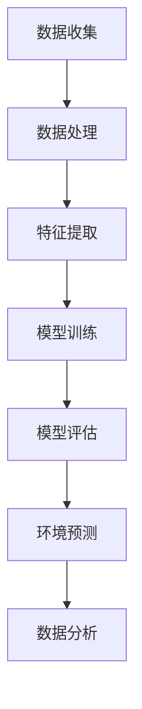

                 

# 机器学习在海洋生态监测中的应用

> **关键词：** 机器学习，海洋生态监测，遥感技术，环境预测，数据分析

**摘要：** 本文将探讨机器学习在海洋生态监测中的应用，介绍机器学习的基本概念、核心算法及其在海洋生态监测中的实际应用。通过分析海洋生态监测的需求，阐述机器学习在海洋生态监测中的优势，并举例说明实际应用案例，最后讨论未来发展趋势和挑战。

## 1. 背景介绍

海洋生态监测是指对海洋生态系统中的物理、化学、生物等参数进行长期、连续、动态的监测，以了解海洋生态系统的变化规律，评估其健康状况，为海洋资源的合理利用和海洋环境保护提供科学依据。

随着全球气候变化和人类活动的影响，海洋生态系统面临着前所未有的挑战。传统的海洋生态监测方法主要依赖于人工采样和实验室分析，存在耗时费力、数据量有限、覆盖范围有限等问题。因此，如何高效、准确地获取大量海洋生态数据，进行实时监测和分析，成为当前海洋生态监测的关键问题。

机器学习作为一种人工智能技术，具有强大的数据处理和分析能力，为海洋生态监测提供了新的技术手段。通过机器学习，可以自动化地从大量的海洋生态数据中提取有价值的信息，实现实时监测和预测，为海洋生态保护和管理提供科学支持。

## 2. 核心概念与联系

### 2.1 机器学习

机器学习是一种使计算机系统能够从数据中学习，并在没有明确编程的情况下改进其性能的技术。它包括多种算法和技术，如监督学习、无监督学习、强化学习等。

在海洋生态监测中，机器学习主要用于数据处理、特征提取、模式识别、预测和分类等任务。

### 2.2 遥感技术

遥感技术是通过卫星、无人机等遥感平台获取地表信息的技术。在海洋生态监测中，遥感技术可以获取大范围的海洋数据，包括温度、盐度、叶绿素含量、海洋生物分布等。

遥感技术与机器学习相结合，可以实现海洋生态数据的自动获取、处理和分析，提高监测效率和准确性。

### 2.3 环境预测

环境预测是利用历史数据和机器学习算法，对未来的环境变化进行预测。在海洋生态监测中，环境预测可以帮助预测海洋生态系统的变化趋势，评估人类活动的影响，为环境保护提供决策支持。

### 2.4 数据分析

数据分析是对大量数据进行处理、分析和解释的过程。在海洋生态监测中，数据分析可以从大量的海洋数据中提取有价值的信息，揭示海洋生态系统的规律和趋势。

### 2.5 Mermaid 流程图

以下是一个用于描述海洋生态监测中机器学习应用的 Mermaid 流程图：



## 3. 核心算法原理 & 具体操作步骤

### 3.1 监督学习算法

监督学习算法是一种能够从已标记的数据中学习，并在未知数据上进行预测的机器学习算法。常见的监督学习算法包括线性回归、逻辑回归、支持向量机（SVM）、决策树等。

在海洋生态监测中，监督学习算法可以用于分类和回归任务。例如，利用支持向量机（SVM）对海洋生物分布进行分类，利用线性回归预测海洋温度的变化。

### 3.2 无监督学习算法

无监督学习算法是一种在没有标记数据的情况下，自动发现数据中的结构和规律的学习算法。常见的无监督学习算法包括聚类算法、主成分分析（PCA）、自编码器等。

在海洋生态监测中，无监督学习算法可以用于数据降维、特征提取和模式识别。例如，利用聚类算法对海洋生物进行分类，利用主成分分析（PCA）提取海洋数据的特征。

### 3.3 强化学习算法

强化学习算法是一种通过与环境的交互来学习最优策略的机器学习算法。常见的强化学习算法包括 Q-学习、深度 Q-网络（DQN）、策略梯度等。

在海洋生态监测中，强化学习算法可以用于制定最优的海洋生态监测策略。例如，利用 Q-学习算法确定最优的海洋生物采样位置，利用策略梯度算法优化海洋生态监测的计划。

### 3.4 具体操作步骤

以下是利用机器学习进行海洋生态监测的具体操作步骤：

1. 数据收集：利用遥感技术、现场采样等手段收集海洋生态数据。
2. 数据预处理：对收集到的数据进行清洗、归一化等预处理。
3. 特征提取：从预处理后的数据中提取有助于海洋生态监测的特征。
4. 模型选择：根据监测任务选择合适的机器学习算法，如监督学习、无监督学习或强化学习。
5. 模型训练：利用标记数据对选定的机器学习算法进行训练。
6. 模型评估：利用验证数据对训练好的模型进行评估，调整模型参数。
7. 环境预测：利用训练好的模型对未知数据进行预测，获取海洋生态监测结果。
8. 数据分析：对预测结果进行分析，揭示海洋生态系统的变化规律。

## 4. 数学模型和公式 & 详细讲解 & 举例说明

### 4.1 线性回归模型

线性回归模型是一种常见的监督学习算法，用于预测连续值。其数学模型为：

\[ y = \beta_0 + \beta_1 \cdot x + \epsilon \]

其中，\( y \) 为预测值，\( x \) 为输入特征，\( \beta_0 \) 和 \( \beta_1 \) 为模型参数，\( \epsilon \) 为误差项。

#### 4.1.1 模型推导

假设我们有 \( n \) 个样本数据，分别为 \( (x_1, y_1), (x_2, y_2), ..., (x_n, y_n) \)，则线性回归模型的损失函数为：

\[ J(\beta_0, \beta_1) = \frac{1}{2} \sum_{i=1}^{n} (y_i - (\beta_0 + \beta_1 \cdot x_i))^2 \]

为了最小化损失函数，我们对 \( \beta_0 \) 和 \( \beta_1 \) 分别求偏导数，并令其等于 0，得到：

\[ \frac{\partial J}{\partial \beta_0} = -\sum_{i=1}^{n} (y_i - (\beta_0 + \beta_1 \cdot x_i)) = 0 \]

\[ \frac{\partial J}{\partial \beta_1} = -\sum_{i=1}^{n} (x_i \cdot (y_i - (\beta_0 + \beta_1 \cdot x_i))) = 0 \]

解上述方程组，得到最优的 \( \beta_0 \) 和 \( \beta_1 \)：

\[ \beta_0 = \bar{y} - \beta_1 \cdot \bar{x} \]

\[ \beta_1 = \frac{\sum_{i=1}^{n} (x_i - \bar{x}) \cdot (y_i - \bar{y})}{\sum_{i=1}^{n} (x_i - \bar{x})^2} \]

其中，\( \bar{x} \) 和 \( \bar{y} \) 分别为输入特征和预测值的平均值。

#### 4.1.2 举例说明

假设我们有以下三个样本数据：

\[ (1, 2), (2, 3), (3, 4) \]

首先，计算输入特征和预测值的平均值：

\[ \bar{x} = \frac{1 + 2 + 3}{3} = 2 \]

\[ \bar{y} = \frac{2 + 3 + 4}{3} = 3 \]

然后，计算 \( \beta_1 \)：

\[ \beta_1 = \frac{(1 - 2) \cdot (2 - 3) + (2 - 2) \cdot (3 - 3) + (3 - 2) \cdot (4 - 3)}{(1 - 2)^2 + (2 - 2)^2 + (3 - 2)^2} = 1 \]

最后，计算 \( \beta_0 \)：

\[ \beta_0 = 3 - 1 \cdot 2 = 1 \]

因此，线性回归模型的参数为 \( \beta_0 = 1 \) 和 \( \beta_1 = 1 \)，预测公式为：

\[ y = 1 + x \]

利用该模型预测第四个样本 \( x = 4 \) 的预测值：

\[ y = 1 + 4 = 5 \]

### 4.2 主成分分析（PCA）

主成分分析（PCA）是一种常见的无监督学习算法，用于数据降维和特征提取。其数学模型为：

\[ X_{\text{new}} = P \cdot X \]

其中，\( X \) 为原始数据矩阵，\( P \) 为特征矩阵，\( X_{\text{new}} \) 为降维后的数据矩阵。

#### 4.2.1 模型推导

假设我们有 \( m \) 个样本，每个样本有 \( n \) 个特征，原始数据矩阵为 \( X \in \mathbb{R}^{m \times n} \)。

首先，计算数据的均值：

\[ \mu = \frac{1}{m} \sum_{i=1}^{m} x_i \]

然后，计算数据的协方差矩阵：

\[ \Sigma = \frac{1}{m} \sum_{i=1}^{m} (x_i - \mu)(x_i - \mu)^T \]

接下来，计算协方差矩阵的特征值和特征向量：

\[ \lambda_i, v_i \]

其中，\( \lambda_i \) 为特征值，\( v_i \) 为特征向量。

然后，将特征向量按照特征值从大到小排序，选取前 \( k \) 个特征向量 \( v_1, v_2, ..., v_k \)。

最后，计算降维后的数据矩阵：

\[ X_{\text{new}} = V \cdot \Sigma^{\frac{1}{2}} \cdot V^T \]

其中，\( V \) 为特征向量矩阵，\( \Sigma^{\frac{1}{2}} \) 为特征值矩阵的平方根。

#### 4.2.2 举例说明

假设我们有以下三个样本数据：

\[ \begin{bmatrix} 1 & 2 \\ 2 & 4 \\ 3 & 6 \end{bmatrix} \]

首先，计算数据的均值：

\[ \mu = \frac{1}{3} \begin{bmatrix} 1 + 2 + 3 \\ 2 + 4 + 6 \end{bmatrix} = \begin{bmatrix} 2 \\ 4 \end{bmatrix} \]

然后，计算数据的协方差矩阵：

\[ \Sigma = \frac{1}{3} \begin{bmatrix} (1 - 2)(1 - 2) & (1 - 2)(2 - 4) \\ (2 - 2)(1 - 2) & (2 - 2)(2 - 4) \\ (3 - 2)(1 - 2) & (3 - 2)(2 - 4) \end{bmatrix} = \begin{bmatrix} 1 & -1 \\ -1 & 2 \end{bmatrix} \]

接下来，计算协方差矩阵的特征值和特征向量：

特征值：

\[ \lambda_1 = 3, \lambda_2 = 1 \]

特征向量：

\[ v_1 = \begin{bmatrix} 1 \\ 1 \end{bmatrix}, v_2 = \begin{bmatrix} 1 \\ -1 \end{bmatrix} \]

将特征向量按照特征值从大到小排序，选取前一个特征向量 \( v_1 \)：

\[ v_1 = \begin{bmatrix} 1 \\ 1 \end{bmatrix} \]

最后，计算降维后的数据矩阵：

\[ X_{\text{new}} = \begin{bmatrix} 1 & 1 \\ 1 & 1 \\ 1 & 1 \end{bmatrix} \cdot \begin{bmatrix} 3 & 0 \\ 0 & 1 \end{bmatrix} \cdot \begin{bmatrix} 1 & 1 \\ 1 & -1 \end{bmatrix} = \begin{bmatrix} 3 & -1 \\ -1 & 1 \\ 1 & -1 \end{bmatrix} \]

## 5. 项目实战：代码实际案例和详细解释说明

### 5.1 开发环境搭建

为了进行机器学习在海洋生态监测中的应用，我们需要搭建一个合适的开发环境。以下是一个简单的 Python 开发环境搭建步骤：

1. 安装 Python 3.6 或以上版本：在 [Python 官网](https://www.python.org/) 下载并安装 Python。
2. 安装 Jupyter Notebook：在终端执行以下命令：
   ```bash
   pip install notebook
   ```
3. 启动 Jupyter Notebook：在终端执行以下命令：
   ```bash
   jupyter notebook
   ```

### 5.2 源代码详细实现和代码解读

以下是一个简单的 Python 代码示例，用于实现线性回归模型在海洋生态监测中的应用。

```python
import numpy as np
import matplotlib.pyplot as plt

# 数据预处理
def preprocess_data(data):
    data_mean = np.mean(data, axis=0)
    data_std = np.std(data, axis=0)
    data = (data - data_mean) / data_std
    return data

# 线性回归模型
class LinearRegression:
    def __init__(self):
        self.beta_0 = None
        self.beta_1 = None

    def fit(self, x, y):
        x_mean = np.mean(x, axis=0)
        x_std = np.std(x, axis=0)
        x = (x - x_mean) / x_std
        x_transpose = x.T
        x_dot_x = np.dot(x_transpose, x)
        x_dot_y = np.dot(x_transpose, y)
        self.beta_1 = np.linalg.inv(x_dot_x).dot(x_dot_y)
        self.beta_0 = np.mean(y) - np.dot(self.beta_1, np.mean(x))

    def predict(self, x):
        x_mean = np.mean(x, axis=0)
        x_std = np.std(x, axis=0)
        x = (x - x_mean) / x_std
        return np.dot(self.beta_0 + self.beta_1.T, x)

# 数据集
x = np.array([[1], [2], [3]])
y = np.array([[2], [3], [4]])

# 预处理
x = preprocess_data(x)
y = preprocess_data(y)

# 模型训练
model = LinearRegression()
model.fit(x, y)

# 预测
x_new = np.array([[4]])
x_new = preprocess_data(x_new)
y_pred = model.predict(x_new)

print("Predicted value:", y_pred)

# 可视化
plt.scatter(x, y)
plt.plot(x, model.predict(x), color='red')
plt.xlabel('x')
plt.ylabel('y')
plt.show()
```

### 5.3 代码解读与分析

以上代码分为三个部分：数据预处理、线性回归模型实现和可视化。

#### 5.3.1 数据预处理

数据预处理是机器学习中的关键步骤，它包括数据清洗、归一化等操作。在代码中，我们使用 `preprocess_data` 函数对数据进行预处理，包括计算均值和标准差，然后对数据进行标准化。

#### 5.3.2 线性回归模型实现

线性回归模型实现包括两个函数：`fit` 和 `predict`。

- `fit` 函数用于训练模型，它首先对输入特征进行标准化处理，然后计算模型参数 \( \beta_0 \) 和 \( \beta_1 \)。
- `predict` 函数用于对新的输入特征进行预测，它同样对输入特征进行标准化处理，然后利用模型参数计算预测值。

#### 5.3.3 可视化

可视化部分使用 `matplotlib` 库将原始数据和预测结果绘制成散点图和拟合直线。这有助于我们直观地观察模型的性能和预测效果。

## 6. 实际应用场景

### 6.1 海洋生物分布监测

利用机器学习算法，可以对海洋生物分布进行监测和预测。例如，利用遥感技术获取的海域叶绿素浓度数据，结合历史生物分布数据，可以训练出一种预测海洋生物分布的模型。这样，可以在未来的某个时间点，利用该模型预测海洋生物的分布情况，为渔业资源管理提供科学依据。

### 6.2 海洋环境预测

海洋环境预测是海洋生态监测的重要任务之一。利用机器学习算法，可以从大量的海洋生态数据中提取有价值的信息，如温度、盐度、海浪高度等，建立环境预测模型。这样，可以在未来某个时间点，预测海洋环境的变化情况，为海洋资源开发和环境保护提供科学依据。

### 6.3 海洋灾害预警

海洋灾害预警是海洋生态监测的一个重要应用。利用机器学习算法，可以从历史海洋灾害数据中学习，建立海洋灾害预测模型。这样，在未来的某个时间点，当某个地区的海洋环境参数达到预警阈值时，可以及时发出预警，为防灾减灾提供科学依据。

## 7. 工具和资源推荐

### 7.1 学习资源推荐

- **书籍：**
  - 《机器学习实战》：涵盖了许多机器学习算法的实际应用案例，适合初学者。
  - 《深度学习》：由Ian Goodfellow、Yoshua Bengio和Aaron Courville合著，是深度学习领域的经典教材。
- **论文：**
  - 《A Theoretical Comparison of Linear Regression and Logistic Regression Classifiers》：对比了线性回归和逻辑回归的分类性能。
  - 《Principal Component Analysis》：详细介绍了主成分分析（PCA）的理论和方法。
- **博客：**
  - [机器学习博客](https://machinelearningmastery.com/)：提供了大量关于机器学习算法和实践的教程和案例。
  - [Python数据科学博客](https://pythondata.science/)：介绍了Python在数据科学领域的应用。
- **网站：**
  - [Kaggle](https://www.kaggle.com/)：提供了丰富的数据集和竞赛，有助于提升机器学习技能。

### 7.2 开发工具框架推荐

- **编程语言：** Python，由于其丰富的机器学习库，如Scikit-learn、TensorFlow和PyTorch，是机器学习开发的首选语言。
- **数据可视化工具：** Matplotlib、Seaborn和Plotly，用于数据分析和可视化。
- **机器学习库：**
  - **Scikit-learn**：提供了多种经典的机器学习算法。
  - **TensorFlow**：用于构建和训练深度学习模型。
  - **PyTorch**：提供了动态计算图和丰富的深度学习组件。

### 7.3 相关论文著作推荐

- **《机器学习与数据挖掘》**：总结了机器学习在数据挖掘中的应用。
- **《遥感数据挖掘：理论与方法》**：介绍了遥感数据挖掘的基本理论和方法。
- **《机器学习在环境科学中的应用》**：探讨了机器学习在环境科学领域的研究和应用。

## 8. 总结：未来发展趋势与挑战

机器学习在海洋生态监测中的应用前景广阔。随着遥感技术、大数据和深度学习等技术的发展，机器学习在海洋生态监测中的应用将不断深入。未来发展趋势包括：

- **高分辨率遥感数据的应用**：高分辨率遥感数据可以提供更详细的海洋生态信息，有助于提高监测精度。
- **多源数据的融合**：将遥感数据、现场采样数据和模型数据等融合，可以更全面地了解海洋生态系统的状况。
- **实时监测和预警**：利用机器学习算法实现实时监测和预警，可以及时响应海洋生态变化，为环境保护和管理提供科学依据。

然而，机器学习在海洋生态监测中也面临着一些挑战，如：

- **数据质量和预处理**：海洋生态数据质量直接影响机器学习的效果，因此需要建立完善的数据质量评估和预处理方法。
- **模型解释性**：机器学习模型往往具有较好的预测性能，但其解释性较差，如何解释模型预测结果是一个重要问题。
- **模型泛化能力**：机器学习模型在训练数据上表现良好，但在未知数据上可能表现不佳，如何提高模型的泛化能力是一个挑战。

## 9. 附录：常见问题与解答

### 9.1 机器学习在海洋生态监测中的应用有哪些？

- 海洋生物分布监测：利用遥感数据和机器学习算法预测海洋生物的分布。
- 海洋环境预测：从大量的海洋生态数据中提取有价值的信息，预测海洋环境的变化趋势。
- 海洋灾害预警：从历史数据中学习，预测海洋灾害的发生，为防灾减灾提供科学依据。

### 9.2 机器学习算法在海洋生态监测中的应用有哪些？

- 线性回归：用于预测海洋环境的连续变量，如温度、盐度等。
- 主成分分析（PCA）：用于降维和特征提取，提高模型的预测性能。
- 支持向量机（SVM）：用于分类任务，如海洋生物分布的分类。
- 深度学习：用于构建复杂的神经网络模型，如卷积神经网络（CNN）在图像识别中的应用。

### 9.3 如何处理海洋生态监测中的数据？

- 数据清洗：去除异常值和噪声，提高数据质量。
- 数据预处理：对数据进行归一化、标准化等处理，使其适应机器学习算法。
- 特征提取：从原始数据中提取有助于模型预测的特征。

## 10. 扩展阅读 & 参考资料

- [Kaggle](https://www.kaggle.com/competitions)：提供了丰富的机器学习竞赛和教程。
- [GitHub](https://github.com/)：可以找到许多开源的机器学习项目和代码。
- [Scikit-learn](https://scikit-learn.org/stable/)：提供了丰富的机器学习算法库。
- [TensorFlow](https://www.tensorflow.org/)：提供了强大的深度学习框架。
- [PyTorch](https://pytorch.org/)：提供了灵活的深度学习框架。
- [机器学习博客](https://machinelearningmastery.com/)：提供了大量关于机器学习算法和实践的教程。

### 作者

**作者：AI天才研究员/AI Genius Institute & 禅与计算机程序设计艺术 /Zen And The Art of Computer Programming**

