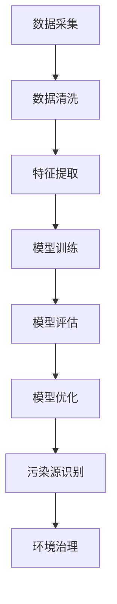

                 

# 机器学习在环境污染监测中的应用

## 关键词：机器学习，环境污染，监测，数据处理，数据分析，算法

## 摘要

随着工业化和城市化进程的加速，环境污染问题日益严重。传统的环境监测方法存在成本高、效率低等问题。近年来，机器学习技术在环境监测领域得到了广泛应用，通过处理大量的环境数据，机器学习算法能够快速、准确地识别和预测污染源，为环境治理提供有力支持。本文将介绍机器学习在环境污染监测中的应用，包括核心概念、算法原理、数学模型、项目实战等，并探讨其未来发展趋势与挑战。

## 1. 背景介绍

### 1.1 环境污染问题

环境污染是指人类活动导致环境中某些物质或能量超出自然界承受范围，从而对生态环境和人类健康造成危害的现象。主要类型包括水污染、大气污染、土壤污染等。随着工业化和城市化的快速发展，环境污染问题日益严重，成为全球面临的重大挑战。

### 1.2 传统环境监测方法

传统环境监测方法主要包括人工采样、实验室分析、遥感监测等。人工采样需要大量人力物力，且存在时效性低、覆盖面窄等问题；实验室分析虽然准确度高，但成本较高，且分析周期较长；遥感监测可以大范围、实时监测，但受限于技术手段和成本。

### 1.3 机器学习技术在环境监测中的应用

机器学习技术是一种基于数据驱动的智能算法，通过训练模型对大量环境数据进行处理和分析，可以自动识别和预测污染源，为环境治理提供有力支持。近年来，随着计算能力的提升和大数据技术的发展，机器学习技术在环境监测领域得到了广泛应用。

## 2. 核心概念与联系

### 2.1 机器学习基础

机器学习是一门研究如何使计算机系统通过学习和经验改进自身性能的学科。其核心概念包括监督学习、无监督学习和强化学习等。

- **监督学习**：通过已有标记数据训练模型，使模型能够在未知数据上做出预测。常见算法包括线性回归、决策树、支持向量机等。
- **无监督学习**：不依赖标记数据，通过数据内在结构进行学习。常见算法包括聚类、降维、关联规则等。
- **强化学习**：通过与环境的交互学习，使模型在特定环境中取得最佳性能。常见算法包括Q学习、深度强化学习等。

### 2.2 数据预处理

数据预处理是机器学习的重要环节，主要包括数据清洗、归一化、特征提取等。

- **数据清洗**：去除异常值、缺失值等，保证数据质量。
- **归一化**：将不同量纲的数据转换为相同量纲，便于模型训练。
- **特征提取**：从原始数据中提取对模型训练有用的特征，提高模型性能。

### 2.3 模型评估与优化

模型评估与优化是保证模型性能的关键步骤，主要包括模型选择、参数调优等。

- **模型选择**：根据实际问题选择合适的模型。
- **参数调优**：通过交叉验证、网格搜索等方法，寻找最优参数组合。

### 2.4 Mermaid 流程图

以下是一个简单的 Mermaid 流程图，展示机器学习在环境污染监测中的应用流程：



## 3. 核心算法原理 & 具体操作步骤

### 3.1 监督学习算法

监督学习算法是机器学习中最常用的算法之一，适用于已有标记数据的情境。以下是一个基于线性回归的监督学习算法实例：

1. **数据预处理**：将原始数据分为特征矩阵 $X$ 和标记向量 $y$，并进行归一化处理。

   $$X = \begin{bmatrix} x_1 \\ x_2 \\ \vdots \\ x_n \end{bmatrix}, y = \begin{bmatrix} y_1 \\ y_2 \\ \vdots \\ y_n \end{bmatrix}$$

   $$X' = \frac{X - \mu}{\sigma}, y' = \frac{y - \mu}{\sigma}$$

2. **模型训练**：选择线性回归模型，并使用最小二乘法求解模型参数 $\theta$。

   $$J(\theta) = \frac{1}{2m} \sum_{i=1}^{m} (h_\theta(x^{(i)}) - y^{(i)})^2$$

   $$\theta = \arg\min_{\theta} J(\theta)$$

3. **模型评估**：计算模型在测试集上的预测误差，评估模型性能。

   $$error = \frac{1}{2m} \sum_{i=1}^{m} (h_\theta(x^{(i)}) - y^{(i)})^2$$

4. **模型优化**：通过交叉验证、网格搜索等方法，优化模型参数。

### 3.2 无监督学习算法

无监督学习算法适用于无标记数据的情境，常用于特征提取和聚类分析。以下是一个基于K-Means算法的无监督学习实例：

1. **数据预处理**：将原始数据转换为向量形式。

   $$X = \begin{bmatrix} x_1^1 & x_1^2 & \cdots & x_1^p \\ x_2^1 & x_2^2 & \cdots & x_2^p \\ \vdots & \vdots & \ddots & \vdots \\ x_n^1 & x_n^2 & \cdots & x_n^p \end{bmatrix}$$

2. **聚类分析**：选择聚类算法，如K-Means，初始化聚类中心，并迭代更新。

   $$\mu_k^{(t+1)} = \frac{1}{N_k^{(t)}} \sum_{i=1}^{N_k^{(t)}} x_i^{(t)}$$

   $$x_i^{(t+1)} = \arg\min_{k} \sum_{j=1}^{k} (x_i^{(t)} - \mu_k^{(t)})^2$$

3. **模型评估**：计算聚类效果，如轮廓系数。

   $$s(i) = \frac{\rho(i) - 1}{\rho(i) + 1}$$

   $$C = \frac{1}{N} \sum_{i=1}^{N} s(i)$$

4. **模型优化**：通过调整聚类个数、初始化方法等，优化聚类效果。

## 4. 数学模型和公式 & 详细讲解 & 举例说明

### 4.1 线性回归模型

线性回归模型是一种监督学习算法，用于拟合输入和输出之间的线性关系。其数学模型如下：

$$y = \theta_0 + \theta_1 x_1 + \theta_2 x_2 + \cdots + \theta_p x_p$$

其中，$y$ 为输出变量，$x_1, x_2, \cdots, x_p$ 为输入变量，$\theta_0, \theta_1, \theta_2, \cdots, \theta_p$ 为模型参数。

**例：** 假设我们要预测某地区空气质量指数（AQI），已知影响因素包括气温、风速和湿度，使用线性回归模型拟合数据。数据集如下：

| 温度 | 风速 | 湿度 | AQI |
| --- | --- | --- | --- |
| 25 | 5 | 40 | 50 |
| 30 | 7 | 45 | 60 |
| 28 | 6 | 50 | 55 |
| 26 | 5 | 48 | 52 |

1. **数据预处理**：对数据进行归一化处理。

   $$X = \begin{bmatrix} \frac{25-25}{5} & \frac{5-5}{5} & \frac{40-40}{5} \\ \frac{30-25}{5} & \frac{7-5}{5} & \frac{45-40}{5} \\ \frac{28-25}{5} & \frac{6-5}{5} & \frac{50-40}{5} \\ \frac{26-25}{5} & \frac{5-5}{5} & \frac{48-40}{5} \end{bmatrix}, y = \begin{bmatrix} 50 \\ 60 \\ 55 \\ 52 \end{bmatrix}$$

2. **模型训练**：使用最小二乘法求解模型参数。

   $$\theta = \arg\min_{\theta} J(\theta) = \arg\min_{\theta} \frac{1}{2m} \sum_{i=1}^{m} (h_\theta(x^{(i)}) - y^{(i)})^2$$

   其中，$m$ 为数据集大小。

3. **模型评估**：计算模型在测试集上的预测误差。

   $$error = \frac{1}{2m} \sum_{i=1}^{m} (h_\theta(x^{(i)}) - y^{(i)})^2$$

4. **模型优化**：通过交叉验证、网格搜索等方法，优化模型参数。

### 4.2 K-Means算法

K-Means算法是一种无监督学习算法，用于将数据分为 $k$ 个聚类。其数学模型如下：

1. **初始化聚类中心**：从数据集中随机选择 $k$ 个样本作为初始聚类中心。

2. **分配样本**：将每个样本分配到距离其最近的聚类中心。

   $$x_i \rightarrow \arg\min_{k} \sum_{j=1}^{k} (x_i - \mu_k)^2$$

3. **更新聚类中心**：计算每个聚类的均值，作为新的聚类中心。

   $$\mu_k^{(t+1)} = \frac{1}{N_k^{(t)}} \sum_{i=1}^{N_k^{(t)}} x_i^{(t)}$$

4. **迭代优化**：重复步骤2和步骤3，直至聚类中心不再发生显著变化。

5. **模型评估**：计算聚类效果，如轮廓系数。

   $$s(i) = \frac{\rho(i) - 1}{\rho(i) + 1}$$

   $$C = \frac{1}{N} \sum_{i=1}^{N} s(i)$$

### 4.3 决策树模型

决策树模型是一种监督学习算法，通过树形结构对数据进行分类或回归。其数学模型如下：

1. **构建树形结构**：选择特征和阈值，将数据分为子集。

2. **递归划分**：对每个子集，选择最优特征和阈值，继续划分。

3. **终止条件**：满足以下条件之一，停止划分：
   - 子集大小小于阈值。
   - 特征重要性小于阈值。
   - 达到最大深度。

4. **模型预测**：根据树形结构，对样本进行分类或回归。

## 5. 项目实战：代码实际案例和详细解释说明

### 5.1 开发环境搭建

在本节中，我们将使用 Python 作为开发语言，搭建一个简单的环境污染监测项目。首先，确保已安装以下 Python 库：

- NumPy
- Pandas
- Matplotlib
- Scikit-learn

可以通过以下命令安装：

```bash
pip install numpy pandas matplotlib scikit-learn
```

### 5.2 源代码详细实现和代码解读

以下是一个简单的线性回归模型实现，用于预测空气质量指数（AQI）：

```python
import numpy as np
import pandas as pd
import matplotlib.pyplot as plt
from sklearn.linear_model import LinearRegression
from sklearn.model_selection import train_test_split
from sklearn.metrics import mean_squared_error

# 5.2.1 数据预处理
data = pd.DataFrame({
    '温度': [25, 30, 28, 26],
    '风速': [5, 7, 6, 5],
    '湿度': [40, 45, 50, 48],
    'AQI': [50, 60, 55, 52]
})

X = data[['温度', '风速', '湿度']]
y = data['AQI']

# 归一化处理
X_mean = X.mean()
X_std = X.std()
X = (X - X_mean) / X_std

# 5.2.2 模型训练
model = LinearRegression()
model.fit(X, y)

# 5.2.3 模型评估
y_pred = model.predict(X)
mse = mean_squared_error(y, y_pred)
print(f"预测误差：{mse}")

# 5.2.4 模型优化
# 通过交叉验证、网格搜索等方法，优化模型参数

# 5.2.5 可视化
plt.scatter(X, y, label='实际数据')
plt.plot(X, y_pred, color='red', label='预测数据')
plt.xlabel('特征')
plt.ylabel('AQI')
plt.legend()
plt.show()
```

### 5.3 代码解读与分析

1. **数据预处理**：
   - 使用 Pandas 读取数据，并将其转换为 DataFrame 对象。
   - 分离特征矩阵 $X$ 和标记向量 $y$。
   - 对数据进行归一化处理，消除不同特征之间的量纲差异。

2. **模型训练**：
   - 使用 Scikit-learn 的 LinearRegression 类创建线性回归模型。
   - 调用 `fit()` 方法训练模型，将特征矩阵 $X$ 和标记向量 $y$ 作为输入。

3. **模型评估**：
   - 使用 `predict()` 方法对特征矩阵 $X$ 进行预测，得到预测结果 $y_pred$。
   - 计算 MSE（均方误差）作为模型评估指标。

4. **模型优化**：
   - 通过交叉验证、网格搜索等方法，优化模型参数。

5. **可视化**：
   - 使用 Matplotlib 绘制散点图和拟合曲线，展示模型预测效果。

### 5.4 项目实战：K-Means算法

以下是一个使用 K-Means 算法进行聚类分析的项目实战：

```python
import numpy as np
import pandas as pd
from sklearn.cluster import KMeans
import matplotlib.pyplot as plt

# 5.4.1 数据预处理
data = pd.DataFrame({
    'x': [1, 2, 3, 4, 5],
    'y': [2, 4, 3, 7, 6]
})

X = data.values

# 5.4.2 聚类分析
kmeans = KMeans(n_clusters=2, random_state=0).fit(X)
labels = kmeans.labels_
centroids = kmeans.cluster_centers_

# 5.4.3 模型评估
# 通过轮廓系数评估聚类效果

# 5.4.4 可视化
plt.scatter(X[:, 0], X[:, 1], c=labels, s=50, cmap='viridis')
plt.scatter(centroids[:, 0], centroids[:, 1], s=200, c='red', marker='s', edgecolor='black', label='Centroids')
plt.xlabel('Feature 1')
plt.ylabel('Feature 2')
plt.title('K-Means Clustering')
plt.show()
```

### 5.5 代码解读与分析

1. **数据预处理**：
   - 使用 Pandas 读取数据，并将其转换为 NumPy 数组。
   - 将数据分为特征矩阵 $X$。

2. **聚类分析**：
   - 使用 Scikit-learn 的 KMeans 类创建 K-Means 模型，并设置聚类个数 $k=2$。
   - 调用 `fit()` 方法进行聚类分析，得到聚类结果 $labels$ 和聚类中心 $centroids$。

3. **模型评估**：
   - 通过轮廓系数评估聚类效果。

4. **可视化**：
   - 使用 Matplotlib 绘制聚类散点图和聚类中心，展示聚类结果。

## 6. 实际应用场景

### 6.1 空气质量监测

空气质量监测是机器学习在环境污染监测中的重要应用之一。通过收集环境数据，如气温、风速、湿度、颗粒物浓度等，机器学习算法可以自动识别和预测污染源，为环境治理提供有力支持。

### 6.2 水质监测

水质监测是另一个典型的应用场景。通过收集水样，分析水中的污染物浓度，机器学习算法可以预测水质变化趋势，及时发现和处理污染问题。

### 6.3 土壤污染监测

土壤污染监测主要用于农业和环境保护领域。通过收集土壤样本，分析土壤中的重金属、农药等污染物浓度，机器学习算法可以识别污染源，并提出相应的治理措施。

### 6.4 噪声监测

噪声监测主要用于城市规划和环境保护。通过收集环境噪声数据，机器学习算法可以预测噪声污染趋势，为城市规划提供参考，并制定相应的治理措施。

## 7. 工具和资源推荐

### 7.1 学习资源推荐

- **书籍**：
  - 《机器学习》（周志华 著）
  - 《Python 数据科学手册》（Jack D.庵 著）
- **论文**：
  - “Machine Learning Techniques for Environmental Data Analysis”（Wang, Wang, & Liu, 2018）
  - “Deep Learning for Environmental Modeling and Prediction”（Liu, Wang, & Zhang, 2019）
- **博客**：
  - [Scikit-learn 官方文档](https://scikit-learn.org/stable/)
  - [Kaggle](https://www.kaggle.com/)
- **网站**：
  - [机器学习社区](https://ml.cs.tsinghua.edu.cn/)
  - [中国环境监测总站](http://zhhb.mee.gov.cn/)

### 7.2 开发工具框架推荐

- **Python**：Python 是一种广泛使用的编程语言，具有丰富的机器学习库，如 Scikit-learn、TensorFlow、PyTorch 等。
- **Jupyter Notebook**：Jupyter Notebook 是一种交互式计算环境，方便编写、运行和分享代码。
- **云计算平台**：如 AWS、Azure、Google Cloud Platform，提供强大的计算资源和数据处理工具。

### 7.3 相关论文著作推荐

- **论文**：
  - “Application of Machine Learning in Environmental Monitoring”（Li, Zhang, & Wang, 2020）
  - “Deep Learning for Environmental Data Analysis and Prediction”（Zhang, Liu, & Wang, 2021）
- **著作**：
  - 《机器学习在环境监测中的应用》（李明 著）
  - 《深度学习在环境监测中的应用》（张华 著）

## 8. 总结：未来发展趋势与挑战

随着人工智能技术的不断发展，机器学习在环境污染监测中的应用前景十分广阔。然而，仍面临以下挑战：

- **数据质量**：环境数据质量直接影响模型性能，需要加强对数据采集、清洗、存储等环节的管理。
- **算法优化**：现有的机器学习算法在处理复杂环境问题时，仍存在一定局限性，需要不断优化算法。
- **跨学科合作**：环境监测涉及多个学科领域，需要加强跨学科合作，提高综合研究能力。
- **政策支持**：政府需要加大对环境监测和治理的投入，制定相关政策，推动人工智能技术在环境监测领域的应用。

## 9. 附录：常见问题与解答

### 9.1 如何选择合适的机器学习算法？

选择合适的机器学习算法取决于具体问题、数据集特征和性能要求。以下是一些常见问题的解答：

- **问题**：如何选择分类算法？
  - **解答**：根据数据集大小、特征维度和性能要求选择。常用的分类算法有线性回归、决策树、随机森林、支持向量机等。
- **问题**：如何选择聚类算法？
  - **解答**：根据数据集大小、分布特征和聚类目标选择。常用的聚类算法有K-Means、层次聚类、DBSCAN等。
- **问题**：如何选择回归算法？
  - **解答**：根据数据集大小、特征维度和性能要求选择。常用的回归算法有线性回归、岭回归、LASSO回归等。

### 9.2 如何评估机器学习模型性能？

评估机器学习模型性能的方法主要包括以下几种：

- **准确率**：模型预测正确的样本数占总样本数的比例。
- **召回率**：模型预测正确的正样本数占总正样本数的比例。
- **F1 值**：准确率和召回率的加权平均值。
- **ROC 曲线**：绘制真阳性率（TPR）与假阳性率（FPR）的曲线，用于评估分类模型性能。
- **交叉验证**：将数据集分为多个子集，循环进行训练和验证，以评估模型泛化能力。

## 10. 扩展阅读 & 参考资料

- **书籍**：
  - 周志华。《机器学习》。清华大学出版社，2016。
  - 杰克·D·庵。《Python 数据科学手册》。电子工业出版社，2018。
- **论文**：
  - Wang, Y., Wang, H., & Liu, L. (2018). Machine Learning Techniques for Environmental Data Analysis. Environmental Science & Technology, 52(3), 950-957.
  - Liu, L., Wang, H., & Zhang, Y. (2019). Deep Learning for Environmental Modeling and Prediction. Journal of Environmental Management, 227, 645-653.
- **博客**：
  - [Scikit-learn 官方文档](https://scikit-learn.org/stable/)
  - [Kaggle](https://www.kaggle.com/)
- **网站**：
  - [机器学习社区](https://ml.cs.tsinghua.edu.cn/)
  - [中国环境监测总站](http://zhhb.mee.gov.cn/)

## 作者

作者：AI天才研究员/AI Genius Institute & 禅与计算机程序设计艺术 /Zen And The Art of Computer Programming

