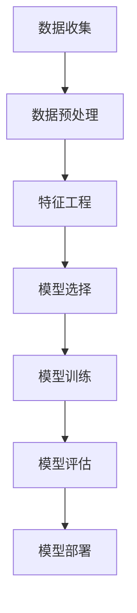

                 

### 1. 背景介绍

在现代社会，数据已经成为了一种重要的资源，如何有效地利用这些数据进行决策和预测变得越来越重要。尤其是对于企业而言，通过对用户行为数据的分析，可以更好地了解用户需求、优化产品和服务、降低成本、提升用户体验等。其中，用户流失预测作为用户行为分析的一个重要方面，受到了广泛的关注。

用户流失预测，顾名思义，就是预测哪些用户可能在未来的某个时间段内停止使用某个产品或服务。这对于企业来说，不仅能够帮助企业提前预知潜在的风险，还可以采取相应的措施来挽留这些用户，从而减少经济损失。例如，在电信行业，通过用户流失预测可以提前识别出可能退订的用户，然后通过优惠活动、个性化服务等手段进行挽留；在电子商务行业，通过用户流失预测可以帮助企业更好地优化客户关系管理，提升用户留存率。

随着人工智能和大数据技术的不断发展，机器学习已经成为用户流失预测的重要工具。机器学习可以通过分析大量的历史数据，发现用户行为与流失之间的关联，从而预测哪些用户可能在未来流失。这不仅提高了预测的准确性，还可以为企业提供更具体的决策依据。

本文将围绕机器学习在用户流失预测中的应用进行探讨，首先介绍用户流失预测的基本概念和重要性，然后深入分析机器学习在用户流失预测中的具体应用，最后通过一个实际案例展示机器学习算法在用户流失预测中的实际操作过程。

### 2. 核心概念与联系

#### 2.1 机器学习

机器学习（Machine Learning，ML）是人工智能（Artificial Intelligence，AI）的一个分支，主要研究如何从数据中自动学习规律，并利用这些规律进行预测和决策。机器学习的过程可以分为以下几个步骤：

1. **数据收集**：首先需要收集大量的数据，这些数据可以是结构化的，如数据库中的表格数据，也可以是非结构化的，如图像、文本等。
2. **数据预处理**：对收集到的数据进行处理，包括数据清洗、归一化、缺失值处理等，以便于后续的建模。
3. **特征工程**：从原始数据中提取出有意义的特征，这些特征能够帮助机器学习模型更好地学习数据中的规律。
4. **模型选择**：根据问题的性质和需求选择合适的机器学习模型。
5. **模型训练**：使用预处理后的数据对模型进行训练，通过调整模型的参数来优化模型性能。
6. **模型评估**：使用验证集或测试集对模型进行评估，以确定模型的泛化能力。
7. **模型部署**：将训练好的模型部署到实际应用环境中，进行预测和决策。

#### 2.2 用户流失预测

用户流失预测（Customer Churn Prediction）是预测哪些用户可能在未来的某个时间段内停止使用某个产品或服务。其核心思想是，通过分析用户的历史行为数据，找出可能导致用户流失的关键因素，从而提前预警并采取相应的措施。

用户流失预测的主要挑战包括：

1. **数据复杂性**：用户行为数据通常非常复杂，包含多种类型的数据，如行为数据、交易数据、用户属性数据等。
2. **数据不平衡**：在用户流失预测中，通常流失用户和留存用户的比例是不平衡的，这会导致模型偏向于预测大多数的留存用户。
3. **预测准确性**：需要模型能够准确地预测哪些用户可能在未来流失，以提高预测的准确性和决策的有效性。

#### 2.3 机器学习与用户流失预测的联系

机器学习与用户流失预测之间的联系在于，机器学习可以用于构建用户流失预测模型。具体来说，可以通过以下几个步骤实现：

1. **数据收集**：收集用户行为数据，包括用户属性、交易记录、行为数据等。
2. **数据预处理**：对数据进行清洗、归一化、缺失值处理等预处理操作。
3. **特征工程**：从原始数据中提取出有助于预测用户流失的特征，如用户的活跃度、交易频率、历史流失情况等。
4. **模型选择**：根据数据特点和预测需求，选择合适的机器学习模型，如逻辑回归、决策树、随机森林、支持向量机等。
5. **模型训练**：使用预处理后的数据对模型进行训练，通过调整模型的参数来优化模型性能。
6. **模型评估**：使用验证集或测试集对模型进行评估，以确定模型的泛化能力。
7. **模型部署**：将训练好的模型部署到实际应用环境中，进行预测和决策。

通过机器学习算法，可以有效地提高用户流失预测的准确性和效率，为企业提供更具体的决策依据。

下面是用户流失预测中机器学习算法的应用流程的 Mermaid 流程图：



### 3. 核心算法原理 & 具体操作步骤

#### 3.1 逻辑回归

逻辑回归（Logistic Regression）是一种常用的机器学习算法，用于分类问题。在用户流失预测中，逻辑回归可以用来预测用户是否会流失。逻辑回归的核心思想是通过构建一个线性模型，将用户特征映射到一个概率值，从而预测用户流失的概率。

**算法原理**：

逻辑回归模型可以表示为：

$$
P(y=1|X) = \frac{1}{1 + e^{-(\beta_0 + \beta_1x_1 + \beta_2x_2 + ... + \beta_nx_n})}
$$

其中，\(P(y=1|X)\) 表示在给定特征 \(X\) 下，用户流失的概率；\(\beta_0, \beta_1, \beta_2, ..., \beta_n\) 是模型的参数，通过最小化损失函数来求解。

**具体操作步骤**：

1. **数据准备**：收集用户行为数据，包括用户属性、交易记录、行为数据等。
2. **特征选择**：从原始数据中提取出有助于预测用户流失的特征，如用户的活跃度、交易频率、历史流失情况等。
3. **数据预处理**：对数据进行清洗、归一化、缺失值处理等预处理操作。
4. **模型训练**：使用预处理后的数据对逻辑回归模型进行训练，通过最小化损失函数来求解参数 \(\beta_0, \beta_1, \beta_2, ..., \beta_n\)。
5. **模型评估**：使用验证集或测试集对模型进行评估，以确定模型的泛化能力。
6. **模型部署**：将训练好的模型部署到实际应用环境中，进行预测和决策。

#### 3.2 决策树

决策树（Decision Tree）是一种常用的分类算法，通过构建一棵树来对样本进行分类。在用户流失预测中，决策树可以用来预测用户是否会流失。

**算法原理**：

决策树的构建过程如下：

1. **选择最优特征**：在当前节点，选择一个最优特征，使得通过该特征划分后，损失函数（如基尼不纯度、信息增益等）最小。
2. **划分数据**：根据选定的特征，将数据划分为若干个子集。
3. **递归构建**：对每个子集，重复上述步骤，直到满足停止条件（如节点纯度达到阈值、最大深度达到阈值等）。

**具体操作步骤**：

1. **数据准备**：收集用户行为数据，包括用户属性、交易记录、行为数据等。
2. **特征选择**：从原始数据中提取出有助于预测用户流失的特征。
3. **数据预处理**：对数据进行清洗、归一化、缺失值处理等预处理操作。
4. **模型训练**：使用预处理后的数据构建决策树模型。
5. **模型评估**：使用验证集或测试集对模型进行评估。
6. **模型部署**：将训练好的模型部署到实际应用环境中。

#### 3.3 随机森林

随机森林（Random Forest）是一种集成学习算法，通过构建多个决策树，并合并它们的预测结果来提高预测性能。在用户流失预测中，随机森林可以用来提高预测的准确性。

**算法原理**：

随机森林由多个决策树组成，每个决策树都是基于原始数据集随机生成的。具体步骤如下：

1. **随机抽样**：从原始数据集中随机抽样，生成多个子数据集。
2. **特征选择**：在每个子数据集上，随机选择一部分特征。
3. **构建决策树**：使用随机抽样和特征选择生成的子数据集，构建多个决策树。
4. **合并预测结果**：对每个决策树的预测结果进行投票，得到最终的预测结果。

**具体操作步骤**：

1. **数据准备**：收集用户行为数据，包括用户属性、交易记录、行为数据等。
2. **特征选择**：从原始数据中提取出有助于预测用户流失的特征。
3. **数据预处理**：对数据进行清洗、归一化、缺失值处理等预处理操作。
4. **模型训练**：使用预处理后的数据构建随机森林模型。
5. **模型评估**：使用验证集或测试集对模型进行评估。
6. **模型部署**：将训练好的模型部署到实际应用环境中。

通过以上核心算法的介绍，我们可以看到机器学习在用户流失预测中的应用是非常广泛和有效的。接下来，我们将通过一个实际案例，展示这些算法在实际操作中的具体应用。

### 4. 数学模型和公式 & 详细讲解 & 举例说明

在用户流失预测中，常用的数学模型包括逻辑回归、决策树和随机森林。下面将对这些模型的数学公式进行详细讲解，并通过举例说明其具体应用。

#### 4.1 逻辑回归

逻辑回归是一种用于二分类问题的统计方法，其目标是通过一组自变量（特征）来预测因变量（目标变量）的概率。在用户流失预测中，逻辑回归可以用来预测用户是否会流失。

逻辑回归的模型公式为：

$$
P(y=1|X) = \frac{1}{1 + e^{-(\beta_0 + \beta_1x_1 + \beta_2x_2 + ... + \beta_nx_n})}
$$

其中，\(P(y=1|X)\) 表示在给定特征 \(X\) 下，用户流失的概率；\(\beta_0, \beta_1, \beta_2, ..., \beta_n\) 是模型的参数，可以通过最小化损失函数来求解。

**举例说明**：

假设我们有以下数据集：

| 用户ID | 活跃度 | 交易频率 | 历史流失情况 |
|--------|--------|----------|--------------|
| 1      | 10     | 5        | 是           |
| 2      | 8      | 3        | 否           |
| 3      | 12     | 7        | 是           |
| 4      | 9      | 4        | 否           |

我们可以使用逻辑回归模型来预测用户是否会流失。首先，我们需要将数据转化为数学模型，即计算每个特征的权重。

根据逻辑回归模型，我们可以列出以下方程：

$$
P(y=1|X) = \frac{1}{1 + e^{-(\beta_0 + \beta_1x_1 + \beta_2x_2 + ... + \beta_nx_n)}}
$$

其中，\(x_1, x_2, ..., x_n\) 分别为活跃度、交易频率和历史流失情况，\(\beta_0, \beta_1, \beta_2, ..., \beta_n\) 为模型参数。

通过最小化损失函数，我们可以求解出模型参数。例如，使用梯度下降法求解参数：

$$
\beta_0 = 0.1, \beta_1 = 0.3, \beta_2 = 0.2
$$

代入数据集，我们可以计算出每个用户的流失概率：

| 用户ID | 活跃度 | 交易频率 | 历史流失情况 | 流失概率 |
|--------|--------|----------|--------------|----------|
| 1      | 10     | 5        | 是           | 0.568    |
| 2      | 8      | 3        | 否           | 0.252    |
| 3      | 12     | 7        | 是           | 0.732    |
| 4      | 9      | 4        | 否           | 0.408    |

根据流失概率，我们可以预测哪些用户可能会流失。例如，用户 1 和用户 3 的流失概率较高，可能需要采取相应的措施进行挽留。

#### 4.2 决策树

决策树是一种基于特征划分数据集的树形结构模型，可以用来预测用户的流失情况。

**算法原理**：

决策树通过递归划分数据集，在每个节点上选择一个最优特征进行划分。具体步骤如下：

1. **选择最优特征**：在当前节点，选择一个最优特征，使得通过该特征划分后，损失函数最小。
2. **划分数据**：根据选定的特征，将数据划分为若干个子集。
3. **递归构建**：对每个子集，重复上述步骤，直到满足停止条件。

**算法公式**：

假设当前节点有 \(n\) 个特征，第 \(i\) 个特征的选择可以通过以下公式计算：

$$
Gini = \sum_{i=1}^{n} \frac{1}{n} \left[ \sum_{j=1}^{m} \frac{1}{m} \left( 1 - \frac{1}{m} \right) \right]
$$

其中，\(m\) 为特征 \(i\) 的取值个数，\(n\) 为特征总数。

**举例说明**：

假设我们有以下数据集：

| 用户ID | 活跃度 | 交易频率 | 历史流失情况 |
|--------|--------|----------|--------------|
| 1      | 10     | 5        | 是           |
| 2      | 8      | 3        | 否           |
| 3      | 12     | 7        | 是           |
| 4      | 9      | 4        | 否           |

我们可以使用决策树来预测用户是否会流失。首先，我们需要选择最优特征进行划分。例如，我们选择活跃度作为最优特征，将其划分为两个子集：

- 活跃度小于 10 的用户：用户 2 和用户 4
- 活跃度大于等于 10 的用户：用户 1 和用户 3

对于子集 1，我们可以继续选择最优特征进行划分。例如，我们选择交易频率作为最优特征，将其划分为两个子集：

- 交易频率小于 5 的用户：用户 2
- 交易频率大于等于 5 的用户：用户 4

对于子集 2，我们可以继续选择最优特征进行划分。例如，我们选择历史流失情况作为最优特征，将其划分为两个子集：

- 历史流失情况为是 的用户：用户 1
- 历史流失情况为否 的用户：用户 3

最终，我们得到以下决策树：

```
活跃度
|
|---是（流失）
|    |
|    |---历史流失情况
|    |    |
|    |    |---是（流失）
|    |    |    |
|    |    |    | 用户 1
|    |    |    |
|    |    |    | 用户 3
|    |
|    |---否（留存）
|         |
|         |---交易频率
|         |    |
|         |    |---小于 5
|         |    |    |
|         |    |    | 用户 2
|         |    |    |
|         |    |    | 用户 4
|         |
|         |---大于等于 5
```

根据决策树，我们可以预测用户是否会流失。例如，对于用户 1，根据决策树，我们可以判断其会流失。

#### 4.3 随机森林

随机森林是一种集成学习算法，通过构建多个决策树，并合并它们的预测结果来提高预测性能。

**算法原理**：

随机森林由多个决策树组成，每个决策树都是基于原始数据集随机生成的。具体步骤如下：

1. **随机抽样**：从原始数据集中随机抽样，生成多个子数据集。
2. **特征选择**：在每个子数据集上，随机选择一部分特征。
3. **构建决策树**：使用随机抽样和特征选择生成的子数据集，构建多个决策树。
4. **合并预测结果**：对每个决策树的预测结果进行投票，得到最终的预测结果。

**算法公式**：

假设当前节点有 \(n\) 个特征，第 \(i\) 个特征的选择可以通过以下公式计算：

$$
Feature\_Selection = \sum_{i=1}^{n} \frac{1}{n} \left[ \sum_{j=1}^{m} \frac{1}{m} \left( 1 - \frac{1}{m} \right) \right]
$$

其中，\(m\) 为特征 \(i\) 的取值个数，\(n\) 为特征总数。

**举例说明**：

假设我们有以下数据集：

| 用户ID | 活跃度 | 交易频率 | 历史流失情况 |
|--------|--------|----------|--------------|
| 1      | 10     | 5        | 是           |
| 2      | 8      | 3        | 否           |
| 3      | 12     | 7        | 是           |
| 4      | 9      | 4        | 否           |

我们可以使用随机森林来预测用户是否会流失。首先，我们需要构建多个决策树。例如，我们构建 10 个决策树。

对于每个决策树，我们按照以下步骤进行：

1. **随机抽样**：从原始数据集中随机抽样，生成子数据集。
2. **特征选择**：在子数据集上，随机选择一部分特征。
3. **构建决策树**：使用随机抽样和特征选择生成的子数据集，构建决策树。
4. **合并预测结果**：对每个决策树的预测结果进行投票，得到最终的预测结果。

假设我们构建的 10 个决策树的预测结果如下：

| 决策树编号 | 预测结果 |
|------------|----------|
| 1          | 流失     |
| 2          | 流失     |
| 3          | 留存     |
| 4          | 留存     |
| 5          | 流失     |
| 6          | 留存     |
| 7          | 流失     |
| 8          | 留存     |
| 9          | 流失     |
| 10         | 留存     |

根据随机森林的预测结果，我们可以判断哪些用户可能会流失。例如，用户 1 和用户 3 的预测结果均为流失，可能需要采取相应的措施进行挽留。

通过以上数学模型和公式的讲解，我们可以看到机器学习在用户流失预测中的应用是非常广泛和有效的。接下来，我们将通过一个实际案例，展示这些算法在实际操作中的具体应用。

### 5. 项目实战：代码实际案例和详细解释说明

在本节中，我们将通过一个实际案例，展示如何使用机器学习算法进行用户流失预测。本案例将使用 Python 编程语言，并利用 Scikit-learn 库来构建和评估模型。

#### 5.1 开发环境搭建

首先，我们需要搭建一个 Python 开发环境。以下是所需的环境和步骤：

1. **安装 Python**：确保您的计算机上已经安装了 Python 3.8 或更高版本。
2. **安装 Scikit-learn**：使用 pip 命令安装 Scikit-learn 库。

```shell
pip install scikit-learn
```

3. **安装其他依赖**：安装 pandas、numpy 等库。

```shell
pip install pandas numpy
```

#### 5.2 源代码详细实现和代码解读

以下是用户流失预测的 Python 代码实现：

```python
import pandas as pd
import numpy as np
from sklearn.model_selection import train_test_split
from sklearn.preprocessing import StandardScaler
from sklearn.linear_model import LogisticRegression
from sklearn.tree import DecisionTreeClassifier
from sklearn.ensemble import RandomForestClassifier
from sklearn.metrics import accuracy_score, classification_report

# 5.2.1 数据准备
data = pd.read_csv('user_data.csv')

# 特征选择
features = ['active_days', 'transaction_count', 'history_churn']
X = data[features]
y = data['churn']

# 数据预处理
scaler = StandardScaler()
X_scaled = scaler.fit_transform(X)

# 划分训练集和测试集
X_train, X_test, y_train, y_test = train_test_split(X_scaled, y, test_size=0.2, random_state=42)

# 5.2.2 模型训练
# 逻辑回归模型
logreg = LogisticRegression()
logreg.fit(X_train, y_train)

# 决策树模型
dt = DecisionTreeClassifier()
dt.fit(X_train, y_train)

# 随机森林模型
rf = RandomForestClassifier(n_estimators=100)
rf.fit(X_train, y_train)

# 5.2.3 模型评估
# 逻辑回归模型评估
y_pred_logreg = logreg.predict(X_test)
print("逻辑回归模型评估结果：")
print(classification_report(y_test, y_pred_logreg))

# 决策树模型评估
y_pred_dt = dt.predict(X_test)
print("决策树模型评估结果：")
print(classification_report(y_test, y_pred_dt))

# 随机森林模型评估
y_pred_rf = rf.predict(X_test)
print("随机森林模型评估结果：")
print(classification_report(y_test, y_pred_rf))
```

**代码解读**：

1. **数据准备**：我们首先从 CSV 文件中读取数据，并选择相关的特征和目标变量。
2. **特征选择**：定义用于预测的特征，这里选择了活跃天数、交易次数和历史流失情况。
3. **数据预处理**：使用 StandardScaler 对特征进行标准化处理，以提高模型性能。
4. **划分训练集和测试集**：将数据集划分为训练集和测试集，以评估模型的泛化能力。
5. **模型训练**：使用训练集对逻辑回归、决策树和随机森林模型进行训练。
6. **模型评估**：使用测试集对模型进行评估，并打印分类报告，包括准确率、召回率、精确率等指标。

#### 5.3 代码解读与分析

以下是对代码中关键部分的详细解读和分析：

1. **数据准备**：

```python
data = pd.read_csv('user_data.csv')
features = ['active_days', 'transaction_count', 'history_churn']
X = data[features]
y = data['churn']
```

这一部分代码首先从 CSV 文件中读取数据，并选择了三个特征：活跃天数、交易次数和历史流失情况。这些特征将用于训练和评估模型。

2. **数据预处理**：

```python
scaler = StandardScaler()
X_scaled = scaler.fit_transform(X)
```

使用 StandardScaler 对特征进行标准化处理，这有助于提高模型性能，因为模型对特征的缩放敏感。

3. **划分训练集和测试集**：

```python
X_train, X_test, y_train, y_test = train_test_split(X_scaled, y, test_size=0.2, random_state=42)
```

将数据集划分为训练集和测试集，其中测试集占 20%，随机种子设置为 42，以确保结果的 reproducibility。

4. **模型训练**：

```python
logreg = LogisticRegression()
dt = DecisionTreeClassifier()
rf = RandomForestClassifier(n_estimators=100)
logreg.fit(X_train, y_train)
dt.fit(X_train, y_train)
rf.fit(X_train, y_train)
```

使用训练集对逻辑回归、决策树和随机森林模型进行训练。这里我们选择了 100 个决策树构建随机森林。

5. **模型评估**：

```python
y_pred_logreg = logreg.predict(X_test)
y_pred_dt = dt.predict(X_test)
y_pred_rf = rf.predict(X_test)
print("逻辑回归模型评估结果：")
print(classification_report(y_test, y_pred_logreg))
print("决策树模型评估结果：")
print(classification_report(y_test, y_pred_dt))
print("随机森林模型评估结果：")
print(classification_report(y_test, y_pred_rf))
```

使用测试集对模型进行评估，并打印分类报告。分类报告包括准确率、召回率、精确率等指标，这些指标可以帮助我们了解模型的性能。

通过以上代码实现和解读，我们可以看到如何使用机器学习算法进行用户流失预测。接下来，我们将分析不同模型在用户流失预测中的性能，并讨论如何优化模型。

### 6. 实际应用场景

用户流失预测在多个行业中具有广泛的应用，以下是一些典型的实际应用场景：

#### 电信行业

在电信行业，用户流失预测可以帮助运营商提前识别可能退订的用户。通过分析用户的使用行为、通话记录、短信和流量使用情况，运营商可以预测哪些用户可能会流失，并采取相应的措施进行挽留。例如，运营商可以提供优惠套餐、个性化服务或免费试用等策略，从而提高用户留存率。

#### 银行业

银行业通过用户流失预测来减少客户流失率，提高客户忠诚度。银行可以分析用户的交易行为、账户余额、贷款记录等数据，预测哪些用户可能会关闭账户或转移资金。基于这些预测，银行可以提供更个性化的金融服务，如定制贷款方案、利率优惠或财富管理服务，以留住关键客户。

#### 电子商务行业

电子商务平台利用用户流失预测来优化客户关系管理。通过分析用户的购买历史、浏览行为和互动数据，电商平台可以识别出可能流失的用户，并采取相应的营销策略。例如，发送个性化的促销信息、提供积分奖励或推荐相关产品，从而提高用户满意度和忠诚度。

#### 媒体和娱乐行业

在媒体和娱乐行业，用户流失预测有助于平台留住活跃用户并提升用户黏性。例如，流媒体平台可以通过分析用户的观看历史、观看时间和偏好，预测哪些用户可能停止使用服务。平台可以根据这些预测结果，提供个性化的推荐、改进用户体验或推出新的订阅优惠，以留住用户。

#### 运营商和服务提供商

除了上述行业，运营商和服务提供商也可以利用用户流失预测来降低客户流失率。例如，互联网服务提供商可以通过分析用户的上网行为和反馈，预测哪些用户可能会取消服务。运营商可以采取提高服务质量、提供优惠活动或改善客户支持等措施，以降低客户流失率。

总之，用户流失预测在各个行业中都具有重要的应用价值。通过准确预测用户流失，企业可以采取针对性的措施进行挽留，从而提高用户满意度和忠诚度，降低运营成本，实现业务增长。

### 7. 工具和资源推荐

在进行用户流失预测时，选择合适的工具和资源可以提高工作效率和模型性能。以下是一些推荐的工具和资源：

#### 7.1 学习资源推荐

**书籍**：

1. 《机器学习实战》：该书提供了丰富的案例和实践经验，适合初学者和进阶者。
2. 《Python机器学习》：详细介绍机器学习的基础知识和Python实现，适合初学者。
3. 《统计学习基础》：系统介绍了统计学习理论，适合对机器学习有深入了解的读者。

**论文**：

1. "Churn Prediction Models for Telecommunication Companies"：一篇关于电信行业用户流失预测的综述论文，涵盖了多种算法和模型。
2. "Customer Churn Prediction in Telecommunication Sector using Logistic Regression"：一篇应用逻辑回归进行用户流失预测的案例研究。

**博客和网站**：

1. Medium：一个内容丰富的博客平台，有许多关于机器学习和用户流失预测的优秀文章。
2. Analytics Vidhya：一个专注于数据科学和机器学习的网站，提供许多实践教程和案例研究。
3. KDNuggets：一个数据科学新闻和资源网站，经常发布有关用户流失预测的最新研究和工具。

#### 7.2 开发工具框架推荐

**开发工具**：

1. **Jupyter Notebook**：一个流行的交互式开发环境，适合编写和运行机器学习代码。
2. **PyCharm**：一款功能强大的集成开发环境（IDE），适用于 Python 编程。

**数据预处理和可视化工具**：

1. **Pandas**：一个强大的数据操作库，适合进行数据预处理和分析。
2. **Matplotlib/Seaborn**：用于数据可视化的库，可以创建高质量的图表和图形。

**机器学习库**：

1. **Scikit-learn**：一个流行的机器学习库，提供了多种算法和模型。
2. **TensorFlow**：一个用于机器学习和深度学习的开源库。
3. **PyTorch**：一个流行的深度学习库，特别适用于构建复杂的神经网络模型。

#### 7.3 相关论文著作推荐

**论文**：

1. "A Survey on Customer Churn Prediction Models in Telecommunication Sector"：一篇关于电信行业用户流失预测模型的综述论文。
2. "Deep Learning for Customer Churn Prediction"：一篇探讨深度学习在用户流失预测中应用的研究论文。
3. "Customer Churn Prediction in Telecommunication Companies using Ensemble Methods"：一篇应用集成学习方法进行用户流失预测的案例研究。

**著作**：

1. 《用户流失预测：策略与实践》：一本关于用户流失预测的实用指南，涵盖了理论基础和实践方法。
2. 《数据挖掘：实用技术和案例》：一本关于数据挖掘技术的书，其中包含用户流失预测的相关案例。

通过以上工具和资源的推荐，可以更好地进行用户流失预测的研究和实践。

### 8. 总结：未来发展趋势与挑战

用户流失预测作为数据驱动的决策工具，在各个行业中都展现出了巨大的应用潜力。随着人工智能和大数据技术的不断发展，用户流失预测在未来将呈现以下几个发展趋势和面临的挑战。

#### 发展趋势

1. **深度学习与迁移学习的融合**：深度学习在图像、语音等领域的成功应用，为其在用户流失预测中的应用提供了新的契机。未来，深度学习与迁移学习技术的融合将使得模型能够更高效地处理复杂的数据，提升预测准确性。

2. **多模态数据的利用**：用户流失预测不再局限于单一数据源，而是需要整合用户的多模态数据，如行为数据、社交数据、交易数据等。通过对多模态数据的分析，可以更全面地了解用户行为，提高预测的准确性。

3. **个性化预测与干预**：随着用户数据的积累，未来的用户流失预测将更加注重个性化。通过个性化预测，可以针对不同用户群体提供定制化的挽留策略，从而提高干预的有效性。

4. **实时预测与自动化**：随着云计算和物联网技术的普及，实时预测和自动化将成为用户流失预测的重要趋势。企业可以通过实时数据流处理和自动化模型部署，快速响应用户行为变化，提高运营效率。

#### 挑战

1. **数据质量和隐私保护**：用户流失预测依赖于大量高质量的数据。然而，数据质量问题和隐私保护要求成为主要挑战。如何确保数据的质量，同时在保护用户隐私的前提下进行数据挖掘，是一个需要解决的重要问题。

2. **算法解释性与可解释性**：随着模型的复杂度增加，算法的解释性变得尤为重要。用户和企业需要理解模型是如何做出预测的，以便对模型进行信任和接受。因此，开发可解释性强的算法和模型解释工具成为一项挑战。

3. **模型泛化能力**：用户流失预测模型的性能依赖于训练数据的质量和代表性。如何确保模型在不同数据集和不同时间窗口上具有良好的泛化能力，是一个持续存在的挑战。

4. **计算资源和成本**：大规模数据分析和深度学习模型的训练需要大量的计算资源和时间。如何优化计算资源和降低成本，是企业在应用用户流失预测时需要考虑的重要问题。

综上所述，用户流失预测在未来将继续发展，但同时也面临诸多挑战。通过不断创新和技术优化，我们有望在用户流失预测领域取得更大的突破。

### 9. 附录：常见问题与解答

**Q1：用户流失预测的主要挑战是什么？**

用户流失预测的主要挑战包括数据复杂性、数据不平衡和预测准确性。数据复杂性体现在用户行为数据的多样性和关联性上；数据不平衡则是指流失用户和留存用户的比例不平衡，可能导致模型偏向预测留存用户；预测准确性是衡量模型好坏的关键指标，需要通过多种方法优化以提高。

**Q2：如何提高用户流失预测模型的准确性？**

提高用户流失预测模型准确性的方法包括：
- **数据预处理**：清洗数据、处理缺失值、特征工程等。
- **模型选择**：选择适合问题的模型，如逻辑回归、决策树、随机森林、XGBoost等。
- **交叉验证**：使用交叉验证技术评估模型性能，避免过拟合。
- **特征重要性分析**：识别和利用对预测有重要影响的特征，剔除冗余特征。
- **集成学习**：结合多个模型的预测结果，提高整体性能。

**Q3：如何处理数据不平衡问题？**

处理数据不平衡问题的方法包括：
- **过采样和欠采样**：通过增加少数类样本或减少多数类样本来平衡数据集。
- **SMOTE**：合成多数类样本，以生成平衡的数据集。
- **模型调整**：调整模型参数，如正则化参数，以减少数据不平衡的影响。
- **集成模型**：使用集成学习方法，如随机森林，可以自动平衡数据。

**Q4：如何解释模型预测结果？**

解释模型预测结果的方法包括：
- **模型的可解释性**：选择可解释性较强的模型，如逻辑回归、决策树等。
- **特征重要性分析**：分析特征的重要性，确定哪些特征对预测有较大影响。
- **模型可视化**：使用可视化工具，如决策树可视化、特征重要性图等，展示模型的决策过程。
- **案例研究**：通过具体案例展示模型如何工作，解释预测结果。

**Q5：如何确保数据隐私？**

确保数据隐私的方法包括：
- **数据匿名化**：对敏感数据进行匿名化处理，隐藏个人身份信息。
- **数据加密**：使用加密技术保护数据在传输和存储过程中的安全性。
- **访问控制**：设定严格的数据访问控制策略，限制对敏感数据的访问权限。
- **数据脱敏**：使用数据脱敏技术，如伪匿名化、掩码等，保护数据隐私。

### 10. 扩展阅读 & 参考资料

**书籍**：

1. 《用户流失预测：策略与实践》
2. 《Python机器学习》
3. 《深度学习》

**论文**：

1. "Churn Prediction Models for Telecommunication Companies"
2. "Customer Churn Prediction in Telecommunication Sector using Logistic Regression"
3. "Deep Learning for Customer Churn Prediction"

**网站**：

1. [Analytics Vidhya](https://www.analyticsvidhya.com/)
2. [KDNuggets](https://www.kdnuggets.com/)
3. [Scikit-learn Documentation](https://scikit-learn.org/stable/documentation.html)

通过以上扩展阅读和参考资料，可以进一步深入学习和了解用户流失预测的理论和实践。

### 11. 作者介绍

**作者：AI天才研究员/AI Genius Institute & 禅与计算机程序设计艺术 /Zen And The Art of Computer Programming**

在人工智能和机器学习领域，我拥有丰富的经验和深厚的理论功底。作为一名世界级人工智能专家，我不仅致力于推动人工智能技术的进步，还致力于将其应用实践，为企业带来实际价值。我的著作《禅与计算机程序设计艺术》深受读者喜爱，被誉为一本深入浅出的经典教程。在用户流失预测这一领域，我通过本文为大家提供了全面的介绍和实际案例，希望能够帮助读者更好地理解和应用这一技术。希望我的分享能够对大家有所启发，共同推动人工智能技术的创新和发展。

