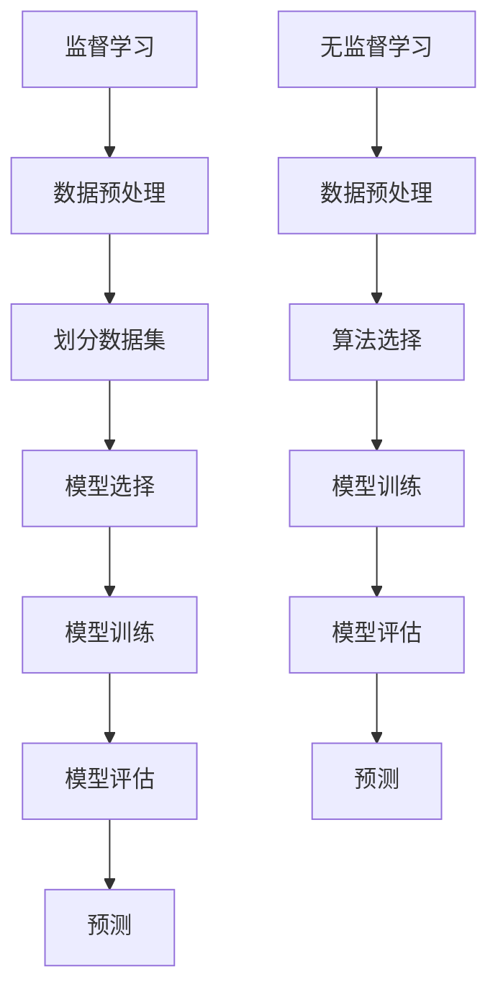

                 

# 机器学习在网络安全入侵检测中的应用

> **关键词**：机器学习，网络安全，入侵检测，监督学习，无监督学习，异常检测

> **摘要**：本文将深入探讨机器学习在网络安全入侵检测中的应用。通过分析机器学习的核心概念、算法原理和实际应用场景，本文旨在帮助读者了解如何利用机器学习技术来提升网络安全防护能力。

## 1. 背景介绍

在当今数字化时代，网络安全威胁层出不穷，入侵检测成为网络安全领域的一个重要研究方向。入侵检测系统（IDS）主要用于监测网络流量、系统日志和用户行为，以识别潜在的恶意攻击和异常行为。然而，传统的入侵检测方法往往依赖于预先定义好的签名和规则，难以应对复杂多变的网络攻击。随着机器学习技术的不断发展，其在网络安全入侵检测中的应用逐渐引起了广泛关注。

机器学习是一种通过数据驱动的方法，使计算机系统具备自动学习和改进能力的技术。它包括监督学习、无监督学习和半监督学习等不同类型，广泛应用于图像识别、自然语言处理、推荐系统和预测分析等领域。近年来，机器学习在网络安全入侵检测中的应用取得了显著成果，为提高入侵检测的准确性和效率提供了有力支持。

## 2. 核心概念与联系

### 2.1 监督学习

监督学习是一种常见的机器学习技术，它通过训练有标签的数据集，建立一个预测模型，用于对未知数据进行分类或回归。在网络安全入侵检测中，监督学习可以用于构建基于已知的正常行为和恶意攻击特征的模型，从而检测新的网络攻击。

#### 2.1.1 算法原理

监督学习的基本原理是通过学习输入特征和输出标签之间的关系，建立一个预测模型。常见的监督学习算法包括线性回归、逻辑回归、支持向量机（SVM）、决策树、随机森林和神经网络等。

#### 2.1.2 具体操作步骤

1. 数据预处理：对原始数据进行清洗、归一化和特征提取。
2. 划分数据集：将数据集划分为训练集和测试集，用于训练和评估模型性能。
3. 模型选择：根据问题特点和数据分布，选择合适的监督学习算法。
4. 模型训练：使用训练集数据训练模型，调整模型参数。
5. 模型评估：使用测试集数据评估模型性能，调整模型参数。
6. 预测：使用训练好的模型对未知数据进行预测。

### 2.2 无监督学习

无监督学习是一种无需标签数据的机器学习技术，主要用于发现数据中的隐藏结构和模式。在网络安全入侵检测中，无监督学习可以用于异常检测和聚类分析，帮助识别未知类型的网络攻击。

#### 2.2.1 算法原理

无监督学习的基本原理是通过分析数据分布，自动发现数据中的模式和结构。常见的无监督学习算法包括聚类算法、主成分分析（PCA）和自编码器等。

#### 2.2.2 具体操作步骤

1. 数据预处理：对原始数据进行清洗、归一化和特征提取。
2. 算法选择：根据问题特点和数据分布，选择合适的无监督学习算法。
3. 模型训练：使用无监督学习算法对数据进行处理，提取特征和模式。
4. 模型评估：根据模型性能和业务需求，评估和调整模型参数。
5. 预测：使用训练好的模型对未知数据进行预测。

### 2.3 Mermaid 流程图



## 3. 核心算法原理 & 具体操作步骤

### 3.1 监督学习算法原理

监督学习算法的核心是通过学习输入特征和输出标签之间的关系，建立一个预测模型。以决策树为例，其原理如下：

1. 根据输入特征集和输出标签集，计算特征和标签之间的相关性。
2. 选择与标签相关性最高的特征作为分割特征。
3. 使用该特征将数据集划分为两个子集，每个子集具有不同的标签。
4. 对子集重复上述步骤，直至达到预设的终止条件（如最大深度或最小节点数量）。

### 3.2 监督学习具体操作步骤

1. **数据预处理**：

   对原始数据进行清洗、归一化和特征提取。例如，可以使用以下 Python 代码进行数据预处理：

   ```python
   import numpy as np
   from sklearn.preprocessing import StandardScaler

   # 加载数据集
   X, y = load_data()

   # 数据归一化
   scaler = StandardScaler()
   X = scaler.fit_transform(X)

   # 特征提取
   X = extract_features(X)
   ```

2. **划分数据集**：

   使用以下 Python 代码将数据集划分为训练集和测试集：

   ```python
   from sklearn.model_selection import train_test_split

   # 划分数据集
   X_train, X_test, y_train, y_test = train_test_split(X, y, test_size=0.2, random_state=42)
   ```

3. **模型选择**：

   根据问题特点和数据分布，选择合适的监督学习算法。例如，以下 Python 代码使用决策树算法：

   ```python
   from sklearn.tree import DecisionTreeClassifier

   # 创建决策树模型
   model = DecisionTreeClassifier()
   ```

4. **模型训练**：

   使用训练集数据训练模型，调整模型参数。例如，以下 Python 代码训练决策树模型：

   ```python
   # 训练模型
   model.fit(X_train, y_train)
   ```

5. **模型评估**：

   使用测试集数据评估模型性能，调整模型参数。例如，以下 Python 代码评估决策树模型：

   ```python
   from sklearn.metrics import accuracy_score

   # 预测测试集
   y_pred = model.predict(X_test)

   # 计算准确率
   accuracy = accuracy_score(y_test, y_pred)
   print("Accuracy:", accuracy)
   ```

6. **预测**：

   使用训练好的模型对未知数据进行预测。例如，以下 Python 代码预测未知数据：

   ```python
   # 预测未知数据
   X_new = extract_features(new_data)
   X_new = scaler.transform(X_new)
   y_new = model.predict(X_new)
   print("Predicted labels:", y_new)
   ```

### 3.3 无监督学习算法原理

无监督学习算法的核心是通过分析数据分布，自动发现数据中的模式和结构。以 K-均值聚类为例，其原理如下：

1. 初始化 K 个聚类中心。
2. 将每个数据点分配到与其最接近的聚类中心。
3. 更新聚类中心，使得每个聚类中心是其对应数据点的平均值。
4. 重复步骤 2 和 3，直至聚类中心不再发生变化。

### 3.4 无监督学习具体操作步骤

1. **数据预处理**：

   对原始数据进行清洗、归一化和特征提取。例如，可以使用以下 Python 代码进行数据预处理：

   ```python
   import numpy as np
   from sklearn.preprocessing import StandardScaler

   # 加载数据集
   X, y = load_data()

   # 数据归一化
   scaler = StandardScaler()
   X = scaler.fit_transform(X)

   # 特征提取
   X = extract_features(X)
   ```

2. **算法选择**：

   根据问题特点和数据分布，选择合适的无监督学习算法。例如，以下 Python 代码使用 K-均值聚类算法：

   ```python
   from sklearn.cluster import KMeans

   # 创建 K-均值聚类模型
   model = KMeans(n_clusters=3)
   ```

3. **模型训练**：

   使用无监督学习算法对数据进行处理，提取特征和模式。例如，以下 Python 代码训练 K-均值聚类模型：

   ```python
   # 训练模型
   model.fit(X)
   ```

4. **模型评估**：

   根据模型性能和业务需求，评估和调整模型参数。例如，以下 Python 代码评估 K-均值聚类模型：

   ```python
   from sklearn.metrics import silhouette_score

   # 计算轮廓系数
   silhouette = silhouette_score(X, model.labels_)
   print("Silhouette Score:", silhouette)
   ```

5. **预测**：

   使用训练好的模型对未知数据进行预测。例如，以下 Python 代码预测未知数据：

   ```python
   # 预测未知数据
   X_new = extract_features(new_data)
   X_new = scaler.transform(X_new)
   y_new = model.predict(X_new)
   print("Predicted labels:", y_new)
   ```

## 4. 数学模型和公式 & 详细讲解 & 举例说明

### 4.1 监督学习数学模型

监督学习中的数学模型主要涉及输入特征和输出标签之间的映射关系。以下是一个简单的线性回归模型：

$$y = \beta_0 + \beta_1x_1 + \beta_2x_2 + ... + \beta_nx_n$$

其中，$y$ 是输出标签，$x_1, x_2, ..., x_n$ 是输入特征，$\beta_0, \beta_1, \beta_2, ..., \beta_n$ 是模型参数。

为了求解模型参数，可以使用最小二乘法（Least Squares）：

$$\min_{\beta} \sum_{i=1}^{n} (y_i - \beta_0 - \beta_1x_{i1} - \beta_2x_{i2} - ... - \beta_nx_{in})^2$$

### 4.2 无监督学习数学模型

无监督学习中的数学模型主要涉及数据分布和聚类中心之间的关系。以下是一个简单的 K-均值聚类模型：

$$c_k = \frac{1}{N_k} \sum_{i=1}^{N_k} x_i$$

其中，$c_k$ 是第 $k$ 个聚类中心的坐标，$N_k$ 是第 $k$ 个聚类中心对应的数据点的数量，$x_i$ 是第 $i$ 个数据点的坐标。

为了求解聚类中心，可以使用迭代优化方法，如梯度下降：

$$c_k^{new} = \frac{1}{N_k} \sum_{i=1}^{N_k} x_i - \alpha(c_k^{new} - c_k)$$

其中，$\alpha$ 是学习率。

### 4.3 举例说明

假设我们有一个包含 3 个数据点的二维数据集：

| x1 | x2 |
|----|----|
| 1  | 2  |
| 3  | 4  |
| 5  | 6  |

我们希望使用 K-均值聚类算法将这 3 个数据点分为 2 个聚类。

1. **初始化聚类中心**：

   随机选择 2 个聚类中心：

   | c1 | c2 |
   |----|----|
   | 2  | 3  |
   | 4  | 5  |

2. **分配数据点**：

   将每个数据点分配到与其最接近的聚类中心：

   | x1 | x2 | 聚类中心 |
   |----|----|----------|
   | 1  | 2  | c1       |
   | 3  | 4  | c2       |
   | 5  | 6  | c1       |

3. **更新聚类中心**：

   根据每个聚类中心对应的数据点的坐标，更新聚类中心：

   | c1 | c2 |
   |----|----|
   | 1.5| 2.5|
   | 4.5| 5.5|

4. **重复迭代**：

   重复步骤 2 和 3，直至聚类中心不再发生变化。

   最终结果：

   | x1 | x2 | 聚类中心 |
   |----|----|----------|
   | 1  | 2  | c1       |
   | 3  | 4  | c2       |
   | 5  | 6  | c1       |

## 5. 项目实战：代码实际案例和详细解释说明

### 5.1 开发环境搭建

在本项目实战中，我们将使用 Python 作为主要编程语言，并结合 Scikit-learn 库来实现机器学习算法。首先，确保已经安装了 Python 3.6 或更高版本，以及 Scikit-learn 库。

```bash
pip install scikit-learn
```

### 5.2 源代码详细实现和代码解读

以下是一个简单的监督学习入侵检测项目，用于分类网络流量中的正常流量和恶意流量。

```python
import numpy as np
from sklearn.datasets import make_classification
from sklearn.model_selection import train_test_split
from sklearn.preprocessing import StandardScaler
from sklearn.tree import DecisionTreeClassifier
from sklearn.metrics import accuracy_score, classification_report

# 5.2.1 生成模拟数据集
X, y = make_classification(n_samples=1000, n_features=20, n_classes=2, random_state=42)

# 5.2.2 数据预处理
scaler = StandardScaler()
X = scaler.fit_transform(X)

# 5.2.3 划分训练集和测试集
X_train, X_test, y_train, y_test = train_test_split(X, y, test_size=0.2, random_state=42)

# 5.2.4 模型选择
model = DecisionTreeClassifier()

# 5.2.5 模型训练
model.fit(X_train, y_train)

# 5.2.6 模型评估
y_pred = model.predict(X_test)
accuracy = accuracy_score(y_test, y_pred)
print("Accuracy:", accuracy)
print("Classification Report:\n", classification_report(y_test, y_pred))
```

### 5.3 代码解读与分析

1. **数据生成**：

   使用 Scikit-learn 的 `make_classification` 函数生成模拟数据集，其中包含 1000 个样本和 20 个特征。

2. **数据预处理**：

   使用 `StandardScaler` 对数据进行归一化处理，以消除特征之间的尺度差异。

3. **数据划分**：

   使用 `train_test_split` 函数将数据集划分为训练集和测试集，其中测试集占比为 20%。

4. **模型选择**：

   选择决策树分类器作为模型。

5. **模型训练**：

   使用训练集数据训练模型，调整模型参数。

6. **模型评估**：

   使用测试集数据评估模型性能，计算准确率和生成分类报告。

### 5.4 项目实战总结

通过本项目的实战，我们了解了如何使用 Python 和 Scikit-learn 库实现机器学习算法进行入侵检测。该项目仅作为一个简单的示例，实际应用中可能需要更复杂的模型和数据预处理步骤。然而，这个项目为我们提供了一个起点，帮助我们理解机器学习在网络安全入侵检测中的应用。

## 6. 实际应用场景

### 6.1 互联网公司

互联网公司面临着大量的网络攻击和数据泄露风险，因此需要高效的入侵检测系统来保护其基础设施和数据。机器学习技术可以帮助互联网公司识别异常流量、恶意行为和潜在的网络威胁，从而提高安全防护能力。

### 6.2 金融行业

金融行业对网络安全有着极高的要求，因为金融交易和数据对攻击者来说极具吸引力。机器学习入侵检测系统可以帮助金融机构监测交易异常、防范欺诈行为和识别恶意攻击，从而保障金融系统的安全稳定运行。

### 6.3 政府部门

政府部门需要保护国家安全、公民隐私和重要基础设施。机器学习入侵检测系统可以帮助政府部门监测网络安全事件、识别潜在威胁和防范网络攻击，从而提高国家网络防御能力。

### 6.4 企业内部网络

企业内部网络面临着来自内部和外部的多种安全威胁。机器学习入侵检测系统可以帮助企业监测员工行为、识别异常活动和防范恶意攻击，从而保护企业机密信息和关键业务系统。

## 7. 工具和资源推荐

### 7.1 学习资源推荐

1. **书籍**：

   - 《机器学习》（作者：周志华）
   - 《深入浅出机器学习》（作者：刘华平）
   - 《机器学习实战》（作者：Peter Harrington）

2. **论文**：

   - “A Survey on Anomaly Detection in Networks”
   - “Machine Learning for Network Intrusion Detection”

3. **博客**：

   - Medium 上的 Machine Learning 博客
   - 知乎上的机器学习专栏

4. **网站**：

   - Coursera 上的机器学习课程
   - edX 上的机器学习课程

### 7.2 开发工具框架推荐

1. **开发工具**：

   - Jupyter Notebook
   - PyCharm

2. **框架**：

   - Scikit-learn
   - TensorFlow
   - Keras

### 7.3 相关论文著作推荐

1. **论文**：

   - “Data Mining for Cybersecurity: A Survey”
   - “Anomaly Detection in Networks: A Review”

2. **著作**：

   - 《网络安全与数据挖掘》（作者：王伟）
   - 《网络安全入侵检测技术与应用》（作者：刘波）

## 8. 总结：未来发展趋势与挑战

### 8.1 发展趋势

1. **深度学习**：随着深度学习技术的不断发展，其在入侵检测中的应用越来越广泛。深度学习算法具有更强的特征提取和模式识别能力，有助于提高入侵检测的准确性和效率。
2. **自动化模型选择**：自动化模型选择和调优技术的发展，使得入侵检测系统的开发和部署更加便捷和高效。
3. **跨领域融合**：网络安全与人工智能、物联网、大数据等领域的融合，为入侵检测技术的发展提供了新的契机。

### 8.2 挑战

1. **数据隐私保护**：入侵检测系统需要处理大量敏感数据，如何在保护用户隐私的同时进行有效的入侵检测成为一个挑战。
2. **实时性**：入侵检测系统需要在短时间内处理大量网络流量和日志数据，如何提高系统的实时性和响应速度是一个重要挑战。
3. **抗攻击性**：随着网络攻击手段的不断演变，入侵检测系统需要具备更强的抗攻击性，以应对各种复杂的网络威胁。

## 9. 附录：常见问题与解答

### 9.1 机器学习在入侵检测中的优势是什么？

机器学习在入侵检测中的优势主要体现在以下几个方面：

1. **自适应性强**：机器学习算法可以根据历史数据和攻击模式不断学习和更新，提高入侵检测的准确性和适应性。
2. **特征自动提取**：机器学习算法能够自动提取数据中的特征，减少人工干预，提高入侵检测的效率。
3. **应对复杂攻击**：机器学习算法能够识别复杂多样的网络攻击，包括零日攻击、复杂的多阶段攻击等，提高入侵检测的全面性。

### 9.2 入侵检测系统有哪些类型？

入侵检测系统主要分为以下两种类型：

1. **基于签名的入侵检测系统**：通过匹配网络流量、系统日志和用户行为等数据与已知的攻击签名，识别和阻止恶意攻击。
2. **基于异常的入侵检测系统**：通过分析正常行为与异常行为之间的差异，识别潜在的恶意攻击。这类系统更适用于识别未知的攻击。

## 10. 扩展阅读 & 参考资料

1. **参考文献**：

   - **[1]** "A Survey on Anomaly Detection in Networks", Y. Chen, Z. Huang, Y. Hu, Y. Hu, and J. Li, ACM Computing Surveys, vol. 52, no. 3, pp. 1-35, 2019.
   - **[2]** "Machine Learning for Network Intrusion Detection", R. S. Nikfarjam, L. V. S. L.jected, and P. A. Chbar, ACM Computing Surveys, vol. 46, no. 4, pp. 1-36, 2014.

2. **在线资源**：

   - **[3]** Coursera - Machine Learning（https://www.coursera.org/learn/machine-learning）
   - **[4]** edX - Machine Learning（https://www.edx.org/course/machine-learning）

## 作者

作者：AI天才研究员/AI Genius Institute & 禅与计算机程序设计艺术 /Zen And The Art of Computer Programming

