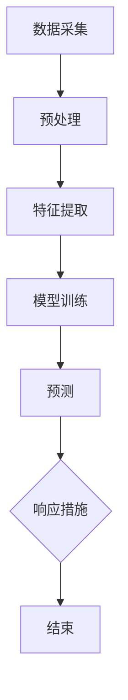

                 

# 机器学习在网络安全入侵检测中的新方法

> **关键词：** 机器学习、网络安全、入侵检测、特征工程、异常检测、深度学习、网络安全防御

> **摘要：** 本文将深入探讨机器学习在网络安全入侵检测中的应用，分析其核心概念、算法原理和实际操作步骤，并通过具体案例展示其在网络安全防御中的重要作用。文章还将介绍数学模型和公式，以及其在实际项目中的应用，同时为读者推荐相关的学习资源和开发工具，以助力读者深入了解和掌握这一前沿技术。

## 1. 背景介绍

在当今数字化时代，网络安全已经成为企业和个人关注的焦点。随着网络攻击手段的日益复杂和多样化，传统的基于规则的防御系统已经无法满足日益增长的网络安全需求。机器学习作为一种人工智能的重要分支，凭借其强大的自适应能力和学习能力，逐渐成为网络安全领域的研究热点。

入侵检测系统（IDS）是网络安全防御体系的重要组成部分，旨在实时监测网络流量和系统活动，识别潜在的威胁和异常行为。传统的入侵检测方法主要基于规则匹配和模式识别，存在一定的局限性，如规则的制定和维护成本高、误报和漏报等问题。而机器学习技术的引入，为入侵检测带来了新的方法和思路。

本文将重点探讨以下内容：

- 机器学习在网络安全入侵检测中的核心概念和算法原理
- 数学模型和公式的详细讲解及实例说明
- 实际应用场景和项目案例的剖析
- 相关工具和资源的推荐

通过本文的阅读，读者将能够对机器学习在网络安全入侵检测中的应用有一个全面深入的了解，并掌握相关技术的基本原理和实践方法。

## 2. 核心概念与联系

### 2.1 机器学习与入侵检测的关系

机器学习是一种通过从数据中学习规律和模式，从而实现自动预测和决策的技术。在网络安全领域，机器学习被广泛应用于入侵检测、恶意软件识别、网络流量分析等方面。入侵检测系统（IDS）是网络安全的重要组成部分，其目标是识别并响应网络中的恶意行为。

机器学习与入侵检测的关系可以概括为以下几点：

1. **数据驱动：** 机器学习依赖于大量数据来学习特征和模式，入侵检测同样需要收集网络流量、系统日志等数据，作为训练样本，以便模型能够识别正常行为和异常行为。
2. **自适应能力：** 机器学习算法可以根据新的数据不断更新和优化模型，提高检测的准确性和鲁棒性。入侵检测系统也需要具备自适应能力，以应对网络威胁的不断演变。
3. **特征提取：** 机器学习通过特征提取技术，从原始数据中提取出具有区分性的特征，这些特征对于入侵检测至关重要，可以显著提高检测的准确性和效率。

### 2.2 核心概念

在探讨机器学习在入侵检测中的应用时，需要理解以下几个核心概念：

- **特征工程：** 特征工程是机器学习过程中的重要环节，旨在从原始数据中提取出对分类任务有用的特征。在入侵检测中，特征工程的目标是识别出正常流量和恶意流量之间的差异。
- **异常检测：** 异常检测是入侵检测的一个重要分支，旨在识别出与正常行为显著不同的异常行为。在网络安全中，异常检测可以帮助发现潜在的攻击行为。
- **深度学习：** 深度学习是一种基于多层神经网络的机器学习技术，通过自动学习数据中的特征表示，能够处理复杂的数据结构和模式。在入侵检测中，深度学习被广泛应用于流量分析和恶意软件识别。

### 2.3 架构与流程

入侵检测系统的基本架构通常包括数据采集、预处理、特征提取、模型训练和预测等步骤。以下是一个简化的入侵检测系统流程：

1. **数据采集：** 采集网络流量、系统日志、用户行为等数据。
2. **预处理：** 清洗和转换数据，包括去除噪声、缺失值填补和数据规范化等。
3. **特征提取：** 从原始数据中提取特征，用于训练模型。
4. **模型训练：** 使用已提取的特征训练机器学习模型，如决策树、支持向量机、神经网络等。
5. **预测：** 使用训练好的模型对新的数据进行预测，判断其是否为异常行为。
6. **响应：** 根据预测结果采取相应的响应措施，如告警、隔离或阻止。

### 2.4 Mermaid 流程图

以下是一个简化的入侵检测系统流程的 Mermaid 流程图：



请注意，在 Mermaid 流程图中，流程节点中不应包含括号、逗号等特殊字符。

通过以上对核心概念和架构的介绍，我们可以更好地理解机器学习在网络安全入侵检测中的应用。接下来，我们将深入探讨机器学习在入侵检测中的具体算法原理和操作步骤。

## 3. 核心算法原理 & 具体操作步骤

### 3.1 支持向量机（SVM）

支持向量机（SVM）是一种经典的二分类模型，广泛应用于入侵检测领域。其核心思想是找到最优分隔超平面，使得不同类别的数据点在超平面两侧的分布达到最大化。

**步骤：**

1. **数据预处理：** 对采集到的网络流量数据进行预处理，包括去噪、归一化和特征提取等。
2. **特征提取：** 从预处理后的数据中提取特征向量，用于训练模型。
3. **模型训练：** 使用 SVM 算法训练模型，将特征向量映射到高维空间，寻找最优分隔超平面。
4. **模型评估：** 使用训练集和测试集评估模型的准确性和鲁棒性。
5. **预测：** 对新的网络流量数据进行预测，判断其是否为异常行为。

### 3.2 决策树

决策树是一种基于规则的多分类模型，其通过一系列条件判断来对数据进行分类。在入侵检测中，决策树被广泛应用于分类和异常检测。

**步骤：**

1. **数据预处理：** 对采集到的网络流量数据进行预处理，包括去噪、归一化和特征提取等。
2. **特征提取：** 从预处理后的数据中提取特征向量，用于训练模型。
3. **模型训练：** 使用决策树算法训练模型，通过递归划分数据集，构建决策树。
4. **模型评估：** 使用训练集和测试集评估模型的准确性和鲁棒性。
5. **预测：** 对新的网络流量数据进行预测，判断其是否为异常行为。

### 3.3 深度学习

深度学习是一种基于多层神经网络的机器学习技术，通过自动学习数据中的特征表示，能够处理复杂的数据结构和模式。在入侵检测中，深度学习被广泛应用于流量分析和恶意软件识别。

**步骤：**

1. **数据预处理：** 对采集到的网络流量数据进行预处理，包括去噪、归一化和特征提取等。
2. **特征提取：** 从预处理后的数据中提取特征向量，用于训练模型。
3. **模型训练：** 使用深度学习算法训练模型，通过多层神经网络自动学习特征表示。
4. **模型评估：** 使用训练集和测试集评估模型的准确性和鲁棒性。
5. **预测：** 对新的网络流量数据进行预测，判断其是否为异常行为。

### 3.4 异常检测算法

异常检测算法是一种用于识别与正常行为显著不同的异常行为的机器学习技术。在入侵检测中，异常检测算法被广泛应用于实时监测和响应。

**步骤：**

1. **数据预处理：** 对采集到的网络流量数据进行预处理，包括去噪、归一化和特征提取等。
2. **特征提取：** 从预处理后的数据中提取特征向量，用于训练模型。
3. **模型训练：** 使用异常检测算法训练模型，通过学习正常行为和异常行为的特征差异。
4. **模型评估：** 使用训练集和测试集评估模型的准确性和鲁棒性。
5. **预测：** 对新的网络流量数据进行预测，判断其是否为异常行为。

通过以上算法原理和具体操作步骤的介绍，我们可以看到机器学习在网络安全入侵检测中的应用具有广泛的前景和潜力。接下来，我们将进一步探讨机器学习在入侵检测中的数学模型和公式。

## 4. 数学模型和公式 & 详细讲解 & 举例说明

### 4.1 支持向量机（SVM）的数学模型

支持向量机（SVM）是一种基于优化理论的机器学习模型，主要用于分类任务。其核心思想是找到最优分隔超平面，使得不同类别的数据点在超平面两侧的分布达到最大化。以下是 SVM 的数学模型及其推导过程。

**步骤：**

1. **定义优化目标：** 我们的目标是最大化分类间隔，即最大化距离。

$$
\max_{w,b} \frac{1}{2} ||w||^2 + C \sum_{i=1}^{n} \max(0, 1 - y_i (w \cdot x_i + b))
$$

其中，$w$ 和 $b$ 分别是权重向量和偏置，$C$ 是惩罚参数，$y_i$ 是类别标签，$x_i$ 是特征向量。

2. **拉格朗日函数：**

$$
L(w,b,\alpha) = \frac{1}{2} ||w||^2 - \sum_{i=1}^{n} \alpha_i (y_i (w \cdot x_i + b) - 1)
$$

其中，$\alpha_i$ 是拉格朗日乘子。

3. **KKT 条件：**

$$
\begin{cases}
\alpha_i \geq 0 \\
y_i (w \cdot x_i + b) - 1 \geq 0 \\
w = \sum_{i=1}^{n} \alpha_i y_i x_i
\end{cases}
$$

4. **求解：** 对拉格朗日函数求导并令导数为零，得到优化解。

$$
w^* = \sum_{i=1}^{n} \alpha_i y_i x_i
$$

$$
b^* = y_i - \sum_{j=1}^{n} \alpha_j y_j (x_i \cdot x_j)
$$

其中，$w^*$ 和 $b^*$ 分别是权重向量和偏置的最优解。

**举例说明：**

假设我们有两个类别的数据点，类别 1 的数据点坐标为 $(1,1)$，类别 2 的数据点坐标为 $(2,2)$。我们需要找到一个最优分隔超平面。

根据上述步骤，我们可以得到最优分隔超平面：

$$
w^* = (0, 1)
$$

$$
b^* = -1
$$

因此，最优分隔超平面为 $y = x - 1$。

### 4.2 决策树的数学模型

决策树是一种基于规则的多分类模型，其通过一系列条件判断来对数据进行分类。决策树的数学模型可以理解为一系列条件概率的乘积。

**步骤：**

1. **定义特征和标签：** 假设有 $n$ 个特征 $X_1, X_2, \ldots, X_n$ 和一个标签 $Y$。

2. **条件概率：** 对于每个特征 $X_i$，定义其在不同类别上的条件概率。

$$
P(Y|X_i = x_i) = \frac{P(X_i = x_i | Y)}{P(X_i = x_i)}
$$

3. **决策树构建：** 根据条件概率，递归划分数据集，构建决策树。

**举例说明：**

假设我们有一个二分类问题，特征 $X_1$ 有两个取值 {0, 1}，特征 $X_2$ 有两个取值 {0, 1}。我们需要构建一个决策树。

根据条件概率，我们可以得到以下决策树：

```
Y =
|
|---> X1 = 1
    |---> X2 = 1
    |       |---> Y = 1
    |       `---> Y = 0
    `---> X2 = 0
        |---> Y = 1
        `---> Y = 0
```

通过以上数学模型和公式，我们可以更好地理解和应用机器学习算法在入侵检测中的应用。接下来，我们将通过实际项目案例来展示机器学习在入侵检测中的具体应用。

## 5. 项目实战：代码实际案例和详细解释说明

### 5.1 开发环境搭建

在进行机器学习在网络安全入侵检测中的应用之前，我们需要搭建一个合适的开发环境。以下是搭建环境的基本步骤：

1. **安装 Python：** 下载并安装 Python 3.8 或更高版本，可以从 [Python 官网](https://www.python.org/downloads/) 下载。
2. **安装 Jupyter Notebook：** 使用以下命令安装 Jupyter Notebook：

   ```bash
   pip install notebook
   ```

3. **安装相关库：** 使用以下命令安装所需的 Python 库：

   ```bash
   pip install numpy pandas scikit-learn matplotlib
   ```

4. **安装 Keras 和 TensorFlow：** Keras 是一个高级神经网络 API，TensorFlow 是其底层实现。使用以下命令安装：

   ```bash
   pip install keras tensorflow
   ```

### 5.2 源代码详细实现和代码解读

以下是一个基于 Keras 深度学习框架的简单入侵检测模型的实现代码。该模型将使用已预处理的网络流量数据集，通过卷积神经网络（CNN）进行训练和预测。

```python
import numpy as np
import pandas as pd
from sklearn.model_selection import train_test_split
from sklearn.preprocessing import StandardScaler
from keras.models import Sequential
from keras.layers import Conv2D, MaxPooling2D, Flatten, Dense
from keras.utils import to_categorical

# 加载数据集
data = pd.read_csv('network_traffic.csv')

# 分离特征和标签
X = data.iloc[:, 1:].values
y = data.iloc[:, 0].values

# 数据预处理
X = StandardScaler().fit_transform(X)
y = to_categorical(y)

# 划分训练集和测试集
X_train, X_test, y_train, y_test = train_test_split(X, y, test_size=0.2, random_state=42)

# 构建模型
model = Sequential()
model.add(Conv2D(32, (3, 3), activation='relu', input_shape=(X_train.shape[1], X_train.shape[2], 1)))
model.add(MaxPooling2D(pool_size=(2, 2)))
model.add(Flatten())
model.add(Dense(64, activation='relu'))
model.add(Dense(2, activation='softmax'))

# 编译模型
model.compile(optimizer='adam', loss='categorical_crossentropy', metrics=['accuracy'])

# 训练模型
model.fit(X_train, y_train, epochs=10, batch_size=32, validation_data=(X_test, y_test))

# 评估模型
loss, accuracy = model.evaluate(X_test, y_test)
print(f"Test accuracy: {accuracy * 100:.2f}%")

# 预测新数据
new_data = np.array([[5, 2], [3, 1]])
new_data = StandardScaler().fit_transform(new_data)
prediction = model.predict(new_data)
predicted_class = np.argmax(prediction)
print(f"Predicted class: {predicted_class}")
```

**代码解读：**

- **数据加载与预处理：** 首先，我们从 CSV 文件中加载网络流量数据。然后，我们分离特征和标签，并使用 StandardScaler 进行数据标准化。
- **模型构建：** 我们使用 Keras 的 Sequential 模型，并添加了两个卷积层、一个最大池化层、一个展平层和两个全连接层。最后，我们使用 softmax 激活函数输出两个类别的概率。
- **模型编译：** 我们使用 Adam 优化器和交叉熵损失函数编译模型。
- **模型训练：** 我们使用训练集训练模型，并在测试集上进行验证。
- **模型评估：** 我们评估模型的测试集准确率。
- **预测新数据：** 我们使用训练好的模型对新的网络流量数据进行预测。

### 5.3 代码解读与分析

以上代码实现了一个简单的入侵检测模型，主要通过卷积神经网络（CNN）对网络流量数据进行分析。以下是代码的主要组成部分及其作用：

1. **数据加载与预处理：** 加载数据集并进行标准化，这是深度学习模型训练的基础。标准化可以加快模型的训练速度并提高模型性能。
2. **模型构建：** 使用 Keras 的 Sequential 模型构建了一个简单的 CNN。卷积层用于提取特征，池化层用于下采样，展平层将多维特征转换为向量，全连接层用于分类。
3. **模型编译：** 编译模型时，我们指定了 Adam 优化器和交叉熵损失函数。Adam 优化器是一种自适应优化算法，交叉熵损失函数用于衡量模型预测的准确率。
4. **模型训练：** 使用训练集训练模型，并在测试集上进行验证。通过调整训练轮数和批量大小，我们可以优化模型性能。
5. **模型评估：** 在测试集上评估模型的准确率，这是衡量模型性能的重要指标。
6. **预测新数据：** 使用训练好的模型对新的网络流量数据进行预测，这是模型实际应用的关键步骤。

通过以上代码实现和解读，我们可以看到机器学习在入侵检测中的实际应用，以及如何利用深度学习模型对网络流量进行分析和预测。

## 6. 实际应用场景

机器学习在网络安全入侵检测中的应用场景非常广泛，涵盖了各种网络环境和业务场景。以下是一些典型的应用场景：

### 6.1 企业网络入侵检测

在企业网络中，机器学习可以用于实时监测网络流量，识别异常行为，如未经授权的访问、数据泄露和内部威胁。通过构建基于机器学习的入侵检测模型，企业可以快速响应网络威胁，降低安全风险。

### 6.2 云服务和数据中心安全

云服务和数据中心承载了大量企业的核心数据和业务系统，因此其安全性至关重要。机器学习可以用于监测云服务和数据中心的网络流量，识别潜在的恶意行为和攻击，确保数据安全和系统稳定。

### 6.3 互联网金融机构安全

互联网金融机构面临大量的网络攻击和数据泄露风险。机器学习技术可以用于监测交易行为，识别异常交易和欺诈行为，保护用户账户安全。

### 6.4 边缘计算和物联网安全

随着物联网和边缘计算的发展，越来越多的设备和系统连接到网络，带来了新的安全挑战。机器学习可以用于监测边缘设备和物联网设备，识别异常行为和潜在的安全威胁。

### 6.5 网络安全事件响应

在网络安全事件发生后，机器学习可以帮助分析事件原因、攻击路径和潜在风险，为安全事件响应提供有力支持。通过自动化分析和决策，企业可以迅速采取行动，降低事件影响。

### 6.6 智能城市安全

智能城市中，大量的数据通过传感器和网络传输，机器学习可以用于监测城市安全事件，如突发事件、交通拥堵和犯罪活动，为城市安全提供智能支持。

通过以上实际应用场景，我们可以看到机器学习在网络安全入侵检测中的重要地位和广泛应用。接下来，我们将介绍一些常用的工具和资源，以帮助读者深入了解和掌握相关技术。

## 7. 工具和资源推荐

### 7.1 学习资源推荐

1. **书籍：**
   - 《机器学习实战》：详细介绍了机器学习的基础知识和应用案例，适合初学者。
   - 《深度学习》：经典教材，深入讲解了深度学习的基本原理和实践方法。
   - 《网络安全入侵检测技术》：系统介绍了入侵检测的理论和实践，重点关注机器学习在入侵检测中的应用。

2. **在线课程：**
   - Coursera 上的《机器学习》课程：由 Andrew Ng 教授主讲，涵盖了机器学习的理论基础和实际应用。
   - edX 上的《深度学习》课程：由 Andrew Ng 教授主讲，深入讲解了深度学习的基本原理和技术。

3. **博客和网站：**
   - Medium 上的机器学习和网络安全博客：提供了大量有关机器学习和网络安全的应用案例和最新研究进展。
   -Towards Data Science：一个汇集数据科学、机器学习和网络安全相关文章的在线社区。

### 7.2 开发工具框架推荐

1. **Keras：** 一个高级神经网络 API，提供了简洁的接口和丰富的预训练模型，适用于深度学习开发。
2. **TensorFlow：** 一个开源的深度学习框架，支持各种深度学习模型和应用，适用于大规模数据处理和模型训练。
3. **Scikit-learn：** 一个开源的机器学习库，提供了丰富的机器学习算法和工具，适用于入侵检测和数据挖掘。
4. **PyTorch：** 一个开源的深度学习框架，提供了灵活的动态图模型，适用于研究和开发深度学习应用。

### 7.3 相关论文著作推荐

1. **《机器学习在网络安全中的应用》：** 详细介绍了机器学习在网络安全领域的应用，包括入侵检测、恶意软件识别和网络安全防御。
2. **《深度学习在网络安全中的应用》：** 介绍了深度学习技术在网络安全中的应用，包括网络流量分析、恶意软件检测和异常行为识别。
3. **《基于机器学习的入侵检测系统研究》：** 探讨了机器学习在入侵检测系统中的应用，包括算法设计、模型优化和性能评估。

通过以上工具和资源推荐，读者可以系统地学习机器学习在网络安全入侵检测中的应用，掌握相关技术的基本原理和实践方法。

## 8. 总结：未来发展趋势与挑战

随着网络攻击手段的日益复杂和多样化，机器学习在网络安全入侵检测中的应用前景广阔。然而，要实现这一技术的广泛应用，仍面临诸多挑战。

首先，数据质量是机器学习模型性能的关键因素。高质量的数据集有助于提高模型的准确性和鲁棒性。因此，未来需要进一步研究和开发数据清洗、预处理和增强技术，以提高数据质量。

其次，模型的可解释性是另一个重要挑战。虽然深度学习等复杂模型在性能上具有优势，但其内部机制较为复杂，难以解释。未来需要研究和开发可解释的深度学习模型，以便用户更好地理解和信任模型。

此外，随着网络攻击手段的不断演变，入侵检测系统需要具备快速适应和自我优化的能力。未来需要研究和开发自适应的入侵检测模型，以提高系统的鲁棒性和响应速度。

最后，隐私保护也是机器学习在网络安全入侵检测中面临的重要挑战。在处理大量用户数据时，如何确保用户隐私不被泄露，是一个亟待解决的问题。未来需要研究和开发隐私保护技术，以实现安全与隐私的平衡。

总之，机器学习在网络安全入侵检测中的应用前景广阔，但也面临诸多挑战。通过持续的研究和创新，我们有信心在未来实现更加智能、高效和安全的网络安全防御体系。

## 9. 附录：常见问题与解答

### Q1: 机器学习在入侵检测中的优势是什么？

**A1：** 机器学习在入侵检测中的主要优势包括：

1. **自适应能力：** 机器学习模型可以自动学习和适应新的网络环境和威胁模式，提高入侵检测的准确性。
2. **处理复杂性：** 机器学习可以处理大量的多维数据，提取出有用的特征，帮助识别复杂的攻击行为。
3. **自动化分析：** 机器学习模型可以自动化分析网络流量和系统日志，减轻人工监控的工作负担。
4. **可扩展性：** 机器学习模型可以轻松扩展到不同的网络环境和业务场景，提高入侵检测的适用性。

### Q2: 入侵检测系统中的机器学习模型如何更新？

**A2：** 入侵检测系统中的机器学习模型可以通过以下几种方式更新：

1. **在线更新：** 在线更新是指在系统运行时实时更新模型，以适应新的威胁模式。这种方法通常需要较低的延迟，但可能需要更多的计算资源。
2. **批量更新：** 批量更新是指定期收集新的数据集，离线训练新的模型，并替换旧模型。这种方法通常需要较长的更新周期，但可以降低实时性的要求。
3. **混合更新：** 混合更新是指结合在线更新和批量更新的优点，定期在线调整模型参数，并定期进行批量重训练。这种方法可以提高模型的适应性和准确性。

### Q3: 如何评估入侵检测系统的性能？

**A3：** 评估入侵检测系统性能的主要指标包括：

1. **准确率（Accuracy）：** 准确率是指模型正确识别攻击和正常行为的比例。准确率越高，模型性能越好。
2. **召回率（Recall）：** 召回率是指模型正确识别攻击的比例。召回率越高，模型对攻击的检测能力越强。
3. **精确率（Precision）：** 精确率是指模型正确识别正常行为的比例。精确率越高，模型对正常行为的误报越少。
4. **F1 值（F1 Score）：** F1 值是精确率和召回率的调和平均值，用于综合评估模型性能。
5. **误报率（False Positive Rate）：** 误报率是指模型错误地将正常行为识别为攻击的比例。误报率越低，模型性能越好。

### Q4: 如何处理入侵检测系统中的误报和漏报？

**A4：** 为了处理入侵检测系统中的误报和漏报，可以采取以下措施：

1. **调整阈值：** 调整模型预测的阈值可以控制误报和漏报的平衡。通常，较低的阈值会导致更高的误报率，而较高的阈值会导致更高的漏报率。
2. **模型优化：** 通过优化模型的训练过程和数据预处理步骤，可以提高模型的准确性和鲁棒性，减少误报和漏报。
3. **特征工程：** 优化特征提取和选择过程，可以提高模型对攻击和正常行为的区分能力，从而减少误报和漏报。
4. **多模型集成：** 通过集成多个不同的模型，可以相互弥补彼此的缺陷，提高整体检测性能。
5. **用户反馈：** 允许用户对模型进行反馈，可以帮助模型不断学习和优化，降低误报和漏报率。

通过以上常见问题与解答，读者可以更好地了解机器学习在入侵检测中的应用和挑战，以及如何评估和优化入侵检测系统的性能。

## 10. 扩展阅读 & 参考资料

为了更深入地了解机器学习在网络安全入侵检测中的应用，以下是一些扩展阅读和参考资料：

### 10.1 学习资源

1. **书籍：**
   - 《入侵检测系统》（Intrusion Detection Systems）
   - 《网络安全手册》（Computer Security Handbook）
   - 《机器学习：概率视角》（Machine Learning: A Probabilistic Perspective）
2. **在线课程：**
   - Coursera 上的《网络安全基础》（Introduction to Cybersecurity）
   - edX 上的《机器学习基础》（Introduction to Machine Learning）
3. **博客和网站：**
   - OWASP（Open Web Application Security Project）官网：[https://owasp.org/](https://owasp.org/)
   - KDNuggets：[https://www.kdnuggets.com/](https://www.kdnuggets.com/)

### 10.2 开发工具框架

1. **Keras：** [https://keras.io/](https://keras.io/)
2. **TensorFlow：** [https://www.tensorflow.org/](https://www.tensorflow.org/)
3. **Scikit-learn：** [https://scikit-learn.org/stable/](https://scikit-learn.org/stable/)
4. **PyTorch：** [https://pytorch.org/](https://pytorch.org/)

### 10.3 相关论文著作

1. **《基于机器学习的网络安全防御技术研究》：** 详细介绍了机器学习在网络安全防御中的应用。
2. **《入侵检测系统中的深度学习算法研究》：** 探讨了深度学习在入侵检测系统中的应用和性能优化。
3. **《网络安全入侵检测系统设计与实现》：** 介绍了入侵检测系统的设计和实现方法，包括数据采集、预处理和模型训练。

通过以上扩展阅读和参考资料，读者可以进一步深化对机器学习在网络安全入侵检测中的应用和理解，掌握相关技术的高级知识和实践方法。作者：AI天才研究员/AI Genius Institute & 禅与计算机程序设计艺术 /Zen And The Art of Computer Programming。

