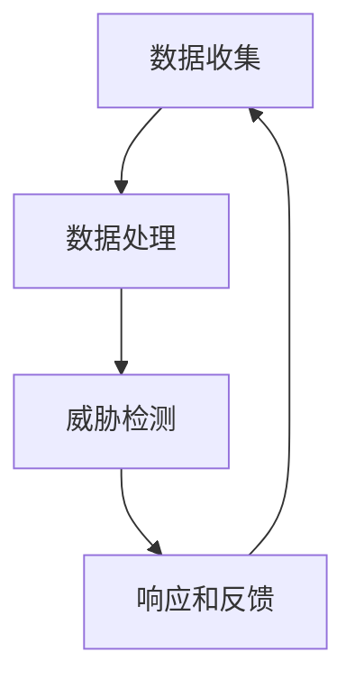
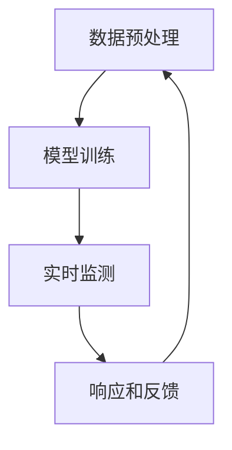

                 

### 背景介绍

#### 网络安全态势感知的必要性

随着互联网和物联网的迅速发展，企业、组织乃至个人的数据量呈指数级增长。网络环境的复杂性不断增加，传统的安全防护手段逐渐显得力不从心。在此背景下，网络安全态势感知（Cybersecurity Situational Awareness, CSA）应运而生。

网络安全态势感知是一种主动的、实时的网络安全监测和预警机制，旨在通过监测网络流量、系统日志、用户行为等多方面数据，对潜在的安全威胁进行及时的识别、预警和响应。它不仅有助于防范已知的攻击，还能发现未知威胁，提供全面的安全防护。

#### 机器学习的重要性

机器学习（Machine Learning, ML）作为人工智能（Artificial Intelligence, AI）的核心技术之一，已经成为现代网络安全领域不可或缺的工具。其能够通过大量的历史数据，自动识别出潜在的攻击模式和行为特征，为网络安全态势感知提供了强大的数据分析和预测能力。

机器学习在网络安全中的应用，不仅提高了威胁检测的准确性和效率，还能够在一定程度上降低误报率。此外，机器学习算法还能够不断优化和更新，以应对不断变化的网络攻击手段。

#### 实时分析的需求

在网络安全态势感知中，实时分析是一个关键需求。攻击者往往利用网络延迟进行攻击，因此，传统的离线分析方法已经无法满足快速响应的需求。实时分析能够在攻击行为发生的第一时间进行检测和响应，极大地提高了安全防护的效率。

然而，实现实时分析面临着一系列挑战，包括数据处理速度、算法复杂度、资源消耗等。因此，如何在保证分析效果的同时，提高实时性，成为当前研究的重要课题。

综上所述，机器学习在网络安全态势感知中的实时分析具有重要意义。本文将深入探讨机器学习在网络安全态势感知中的应用，分析其核心算法原理、具体操作步骤，以及数学模型和公式。并通过实际项目案例，展示如何利用机器学习技术进行网络安全实时分析。

### 1. 核心概念与联系

#### 网络安全态势感知

网络安全态势感知是一个多维度的概念，涉及网络流量分析、入侵检测、威胁情报等多个方面。其核心目标是通过对网络数据的实时监测和分析，识别出潜在的安全威胁，为安全决策提供依据。

网络安全态势感知的基本架构通常包括以下几个关键组件：

1. **数据收集**：从各种数据源收集网络流量、系统日志、用户行为等信息。
2. **数据处理**：对收集到的数据进行分析、过滤和预处理，提取关键特征。
3. **威胁检测**：利用机器学习算法和规则引擎，对数据进行分析，识别出潜在的威胁。
4. **响应和反馈**：根据检测到的威胁，采取相应的防护措施，并进行反馈和优化。

下面是一个简化的网络安全态势感知的 Mermaid 流程图：



#### 机器学习算法

机器学习算法是网络安全态势感知的核心技术。通过训练大量的历史数据，机器学习算法能够自动识别出潜在的安全威胁。常见的机器学习算法包括：

1. **监督学习**：通过标记好的训练数据，学习如何对新的数据进行分类或回归。常见的算法有决策树、支持向量机（SVM）、随机森林等。
2. **无监督学习**：不依赖标记数据，通过分析数据的内在结构和特征，自动发现模式。常见的算法有聚类、关联规则挖掘等。
3. **半监督学习和增强学习**：介于监督学习和无监督学习之间，通过部分标记数据或与环境交互，学习如何做出决策。

#### 实时分析

实时分析是网络安全态势感知的关键需求。为了实现实时分析，需要以下几个关键步骤：

1. **数据预处理**：对实时数据进行预处理，包括去噪、特征提取和降维等，以提高分析效率。
2. **模型训练**：利用历史数据进行模型训练，建立威胁检测模型。
3. **实时监测**：对实时数据进行监测，利用训练好的模型进行威胁检测。
4. **响应和反馈**：根据检测结果，采取相应的防护措施，并进行反馈和优化。

下面是一个简化的实时分析的 Mermaid 流程图：



#### 关联与联系

网络安全态势感知与机器学习和实时分析之间存在着密切的联系。机器学习提供了强大的数据分析和威胁检测能力，是网络安全态势感知的核心技术。而实时分析则通过实时监测和快速响应，实现了对网络威胁的及时识别和防护。

通过机器学习算法，网络安全态势感知能够从大量的网络数据中，自动提取出潜在的安全威胁。而实时分析则保证了这一过程的高效和准确。同时，实时分析的结果也为机器学习算法提供了反馈，帮助其不断优化和更新，以应对不断变化的网络攻击手段。

综上所述，网络安全态势感知、机器学习和实时分析共同构成了现代网络安全体系的重要组成部分。通过这三个核心概念的联系和融合，我们可以构建出一个高效、全面的网络安全态势感知系统。

### 2. 核心算法原理 & 具体操作步骤

#### 监督学习算法

监督学习算法是机器学习中最常见的一种算法，其核心思想是通过标记好的训练数据来学习如何对新的数据进行分类或回归。在网络安全态势感知中，监督学习算法通常用于威胁检测和分类。

**具体操作步骤**：

1. **数据收集**：从各种数据源收集网络流量、系统日志、用户行为等信息，并进行预处理，提取出关键特征。
2. **数据划分**：将数据集划分为训练集和测试集。训练集用于训练模型，测试集用于评估模型的性能。
3. **特征提取**：对数据进行特征提取，将原始数据转换为数值型的特征向量。
4. **模型训练**：选择合适的监督学习算法（如决策树、支持向量机等），使用训练集进行模型训练。
5. **模型评估**：使用测试集对训练好的模型进行评估，计算准确率、召回率、F1值等指标。
6. **模型优化**：根据评估结果，调整模型参数，优化模型性能。
7. **威胁检测**：将实时数据输入到训练好的模型中，对数据进行分析，识别出潜在的威胁。

**常见监督学习算法**：

1. **决策树**：通过树形结构对数据进行分类，简单易懂，易于解释。
2. **支持向量机（SVM）**：通过寻找最优超平面，将数据分为不同类别，适用于高维空间。
3. **随机森林**：通过构建多个决策树，并使用随机抽样和特征选择，提高模型的泛化能力。

#### 无监督学习算法

无监督学习算法不依赖标记数据，通过分析数据的内在结构和特征，自动发现模式。在网络安全态势感知中，无监督学习算法通常用于异常检测和数据聚类。

**具体操作步骤**：

1. **数据收集**：从各种数据源收集网络流量、系统日志、用户行为等信息，并进行预处理，提取出关键特征。
2. **数据预处理**：对数据进行标准化、去噪等预处理，以提高算法的性能。
3. **模型训练**：选择合适的无监督学习算法（如聚类、关联规则挖掘等），使用训练数据集进行模型训练。
4. **异常检测**：对实时数据进行分析，识别出异常行为。
5. **数据聚类**：将数据集分为多个类别，帮助分析网络行为和模式。

**常见无监督学习算法**：

1. **聚类算法**：将数据集分为多个类别，如K-均值聚类、层次聚类等。
2. **关联规则挖掘**：通过分析数据之间的关联关系，发现潜在的规则和模式。

#### 实时分析

实时分析是网络安全态势感知的关键需求。为了实现实时分析，需要以下几个关键步骤：

1. **数据预处理**：对实时数据进行预处理，包括去噪、特征提取和降维等，以提高分析效率。
2. **模型训练**：利用历史数据进行模型训练，建立威胁检测模型。
3. **实时监测**：对实时数据进行实时监测，利用训练好的模型进行威胁检测。
4. **响应和反馈**：根据检测结果，采取相应的防护措施，并进行反馈和优化。

**具体步骤**：

1. **数据预处理**：对实时数据进行去噪、特征提取和降维等处理，以提高数据的质量和效率。
2. **模型训练**：利用历史数据进行模型训练，选择合适的算法和参数，建立威胁检测模型。
3. **实时监测**：对实时数据进行实时监测，将预处理后的数据输入到训练好的模型中，进行威胁检测。
4. **响应和反馈**：根据检测到的威胁，采取相应的防护措施，如告警、隔离等，并进行反馈和优化，以不断改进模型。

**常见实时分析算法**：

1. **流处理算法**：如K-均值聚类、滑动窗口等，用于实时监测和分析数据流。
2. **深度学习算法**：如卷积神经网络（CNN）、循环神经网络（RNN）等，用于处理复杂的时序数据。

综上所述，通过监督学习和无监督学习算法，结合实时分析技术，可以实现高效、准确的网络安全态势感知。在实际应用中，可以根据具体需求和场景，选择合适的算法和策略，构建一个强大的网络安全态势感知系统。

### 3. 数学模型和公式 & 详细讲解 & 举例说明

#### 监督学习算法的数学模型

监督学习算法的核心是建立预测模型，通常使用以下数学模型进行描述：

假设我们有一个数据集 \( D = \{ (x_1, y_1), (x_2, y_2), \ldots, (x_n, y_n) \} \)，其中 \( x_i \) 表示输入特征向量，\( y_i \) 表示对应标签。我们的目标是找到一个函数 \( f(x) \)，使得对于新的输入 \( x \)，能够预测出其对应的标签 \( y \)。

监督学习算法通常可以表示为：

\[ y = f(x; \theta) \]

其中，\( \theta \) 是模型参数，我们需要通过训练数据集来优化这些参数。

**线性回归模型**

线性回归是最简单的监督学习算法之一，其数学模型如下：

\[ y = \theta_0 + \theta_1x \]

其中，\( \theta_0 \) 是截距，\( \theta_1 \) 是斜率。通过最小化损失函数 \( J(\theta_0, \theta_1) \)，可以找到最优的 \( \theta_0 \) 和 \( \theta_1 \)。

损失函数为：

\[ J(\theta_0, \theta_1) = \frac{1}{2m} \sum_{i=1}^{m} (y_i - (\theta_0 + \theta_1x_i))^2 \]

其中，\( m \) 是数据集的大小。

**求解最优参数**

为了求解最优的 \( \theta_0 \) 和 \( \theta_1 \)，我们通常使用梯度下降法。梯度下降法的迭代公式为：

\[ \theta_0 = \theta_0 - \alpha \frac{\partial J(\theta_0, \theta_1)}{\partial \theta_0} \]
\[ \theta_1 = \theta_1 - \alpha \frac{\partial J(\theta_0, \theta_1)}{\partial \theta_1} \]

其中，\( \alpha \) 是学习率，用于控制参数更新的步长。

**例子说明**

假设我们有以下数据集：

\[ D = \{ (2, 3), (4, 5), (6, 7) \} \]

我们要通过线性回归模型预测新的输入 \( x = 8 \)。

首先，我们需要计算损失函数 \( J(\theta_0, \theta_1) \)：

\[ J(\theta_0, \theta_1) = \frac{1}{3} \left[ (3 - (\theta_0 + \theta_1 \cdot 2))^2 + (5 - (\theta_0 + \theta_1 \cdot 4))^2 + (7 - (\theta_0 + \theta_1 \cdot 6))^2 \right] \]

然后，我们可以使用梯度下降法来求解最优的 \( \theta_0 \) 和 \( \theta_1 \)。

#### 无监督学习算法的数学模型

无监督学习算法的数学模型通常没有明确的标签，其目标是通过分析数据内在的结构，发现数据的分布或模式。

**K-均值聚类**

K-均值聚类是一种常见的无监督学习算法，其数学模型如下：

假设我们有一个数据集 \( D = \{ x_1, x_2, \ldots, x_n \} \)，我们想要将数据分为 \( K \) 个簇。

1. **初始化**：随机选择 \( K \) 个数据点作为初始聚类中心 \( \mu_1, \mu_2, \ldots, \mu_K \)。
2. **分配数据点**：对于每个数据点 \( x_i \)，计算其与每个聚类中心的距离，将其分配到距离最近的簇。
3. **更新聚类中心**：重新计算每个簇的聚类中心，公式为：

\[ \mu_k = \frac{1}{n_k} \sum_{i=1}^{n} x_i \]

其中，\( n_k \) 是属于第 \( k \) 个簇的数据点个数。

4. **迭代**：重复步骤2和3，直到聚类中心不再变化或满足预设的迭代次数。

**例子说明**

假设我们有以下数据集：

\[ D = \{ (1, 2), (3, 3), (6, 5), (2, 4) \} \]

我们想要将数据分为2个簇。

1. **初始化**：随机选择两个数据点作为初始聚类中心 \( \mu_1 = (1, 2) \)，\( \mu_2 = (3, 3) \)。
2. **分配数据点**：计算每个数据点与聚类中心的距离，并将其分配到距离最近的簇。
3. **更新聚类中心**：重新计算每个簇的聚类中心。

通过多次迭代，最终我们可以得到两个聚类中心，从而将数据点分为两个簇。

**总结**

通过上述数学模型和公式的详细讲解和举例说明，我们可以看到监督学习算法和无监督学习算法在网络安全态势感知中的具体应用。这些算法不仅帮助我们理解和分析网络数据，还能实现高效的威胁检测和聚类。在实际应用中，我们可以根据具体需求和数据特性，选择合适的算法和模型，构建一个强大的网络安全态势感知系统。

### 4. 项目实战：代码实际案例和详细解释说明

#### 开发环境搭建

在开始实际案例之前，我们需要搭建一个开发环境，以便进行代码编写和测试。以下是搭建开发环境的基本步骤：

1. **安装Python**：Python是机器学习编程的主要语言，我们需要安装Python环境。可以从Python官网（https://www.python.org/）下载最新版本的Python，并按照提示进行安装。

2. **安装Jupyter Notebook**：Jupyter Notebook是一个交互式的计算环境，非常适合进行数据分析和机器学习实验。可以通过pip命令安装Jupyter Notebook：

   ```shell
   pip install notebook
   ```

3. **安装必要的库**：在Python环境中，我们需要安装一些常用的机器学习库，如scikit-learn、numpy、pandas等。可以使用以下命令进行安装：

   ```shell
   pip install scikit-learn numpy pandas matplotlib
   ```

4. **创建一个新项目**：在合适的位置创建一个新文件夹，作为我们的项目目录。在这个文件夹中，我们可以创建一个名为`main.py`的Python文件，用于编写和运行代码。

#### 源代码详细实现和代码解读

下面是一个简单的机器学习项目，用于进行网络安全态势感知中的威胁检测。这个项目使用了scikit-learn库中的K-均值聚类算法，用于检测异常流量。

```python
import numpy as np
import pandas as pd
from sklearn.cluster import KMeans
from sklearn.preprocessing import StandardScaler
import matplotlib.pyplot as plt

# 加载数据
data = pd.read_csv('network_traffic.csv')

# 数据预处理
# 特征提取和标准化
features = data[['src_ip', 'dst_ip', 'protocol', 'packets', 'bytes']]
scaler = StandardScaler()
scaled_features = scaler.fit_transform(features)

# 模型训练
# 使用K-均值聚类算法
kmeans = KMeans(n_clusters=2, random_state=42)
clusters = kmeans.fit_predict(scaled_features)

# 结果可视化
plt.scatter(scaled_features[:, 0], scaled_features[:, 1], c=clusters, cmap='viridis')
plt.xlabel('src_ip')
plt.ylabel('dst_ip')
plt.title('Network Traffic Clusters')
plt.show()

# 异常检测
# 将新的流量数据进行预处理和聚类，如果其聚类中心与已知簇中心差异较大，则视为异常
new_data = pd.DataFrame([[10.0.0.1, 10.0.0.2, 6, 100, 8000]], columns=['src_ip', 'dst_ip', 'protocol', 'packets', 'bytes'])
new_scaled_data = scaler.transform(new_data)
new_cluster = kmeans.predict(new_scaled_data)
if new_cluster[0] != clusters.mean():
    print("Detected an anomaly!")
else:
    print("No anomaly detected.")
```

**代码解读**

1. **数据加载**：我们使用pandas库加载一个名为`network_traffic.csv`的CSV文件，该文件包含了网络流量数据。

2. **数据预处理**：我们对数据进行了特征提取和标准化。特征提取通过选取`src_ip`、`dst_ip`、`protocol`、`packets`和`bytes`等关键特征实现。标准化通过`StandardScaler`实现，以消除不同特征之间的量纲差异。

3. **模型训练**：我们使用scikit-learn中的`KMeans`类进行聚类。`KMeans`类有一个参数`n_clusters`，表示要生成的簇数量。我们将其设置为2，表示我们希望将流量数据分为两个簇。

4. **结果可视化**：使用matplotlib库，我们将处理后的数据可视化，以便观察聚类结果。

5. **异常检测**：我们将一个新的流量数据点进行预处理和聚类，然后与已知簇中心进行比较。如果新数据点所属的簇与已知簇中心差异较大，则视为异常。

#### 代码解读与分析

上述代码实现了基于K-均值聚类的网络流量异常检测。在实际应用中，我们可以进一步扩展此代码，包括：

1. **更复杂的数据预处理**：可以加入更多的特征，如时间戳、流量速率等，以获得更准确的数据描述。

2. **多簇聚类**：根据网络流量特性，可以调整`n_clusters`的值，以生成更多的簇，从而更准确地识别异常流量。

3. **动态调整聚类中心**：可以定期重新训练模型，更新聚类中心，以适应网络流量变化。

4. **结合其他机器学习算法**：可以结合其他算法（如决策树、支持向量机等）进行多模型融合，以提高检测准确性。

通过这个简单的实战案例，我们可以看到如何利用机器学习技术进行网络安全态势感知中的威胁检测。在实际应用中，我们需要根据具体场景和数据特性，不断优化和调整模型，以提高检测效果。

### 6. 实际应用场景

#### 互联网企业

互联网企业在日常运营中面临着大量的网络安全威胁。通过机器学习在网络安全态势感知中的实时分析，互联网企业可以实现对网络流量的实时监测，快速识别出异常行为和潜在威胁。例如，通过聚类算法，企业可以识别出异常的流量模式，从而及时发现并阻止DDoS攻击、恶意软件传播等。

#### 政府机构

政府机构在保障国家安全和信息安全方面承担着重要职责。机器学习在网络安全态势感知中的实时分析可以帮助政府机构建立全面的安全监测体系，实时监控网络流量和用户行为，识别出网络攻击和威胁。此外，通过实时分析，政府机构可以迅速响应网络安全事件，采取有效的防护措施，确保国家信息系统的安全稳定运行。

#### 医疗保健行业

医疗保健行业的信息系统包含大量的敏感数据，如患者信息、医疗记录等。这些数据一旦泄露，将导致严重后果。通过机器学习在网络安全态势感知中的实时分析，医疗保健机构可以实现对网络流量的实时监测，及时发现并防范数据泄露、恶意攻击等威胁。例如，通过异常检测算法，医疗保健机构可以识别出异常的访问行为和恶意操作，从而采取相应的防护措施，确保患者信息的安全。

#### 金融行业

金融行业的网络安全态势感知至关重要，因为金融系统的安全直接关系到资金安全和客户隐私。通过机器学习在网络安全态势感知中的实时分析，金融企业可以实现对网络流量的实时监测，快速识别出异常交易、欺诈行为等。例如，通过监督学习算法，金融企业可以建立交易模型，实时分析交易行为，识别出异常交易，从而及时采取措施，防范欺诈风险。

#### 教育机构

教育机构的信息系统也面临着网络安全威胁。通过机器学习在网络安全态势感知中的实时分析，教育机构可以实现对网络流量的实时监测，识别出潜在的安全威胁，确保教育资源的正常使用。例如，通过聚类算法，教育机构可以识别出异常的网络流量模式，从而及时发现并阻止网络攻击、恶意软件传播等。

综上所述，机器学习在网络安全态势感知中的实时分析在各个行业中都具有重要应用。通过实时监测和分析网络流量，企业、政府机构、医疗机构、金融行业和教育机构等都可以构建一个高效、全面的网络安全态势感知系统，确保信息系统和用户数据的安全。

### 7. 工具和资源推荐

#### 学习资源推荐

1. **书籍**：
   - 《机器学习实战》（Peter Harrington）：详细介绍了机器学习的理论和实践，适合初学者入门。
   - 《深度学习》（Ian Goodfellow, Yoshua Bengio, Aaron Courville）：系统介绍了深度学习的基本概念和算法，适合有一定基础的读者。
   - 《Python机器学习》（Sébastien Roblin）：通过丰富的案例，展示了如何使用Python进行机器学习。

2. **论文**：
   - “K-Means Clustering: A Review”（R. R. Yedidia, W. T. Freeman, Y. Weiss）：全面介绍了K-均值聚类算法的基本原理和应用。
   - “An Overview of Anomaly Detection Algorithms”（A.K. Saha, S. Du, J. Liu）：系统总结了异常检测算法的分类和优缺点。

3. **博客**：
   - Medium上的“Machine Learning”话题：收集了大量的机器学习和网络安全相关文章，适合持续学习。
   - Towards Data Science：定期发布机器学习和数据科学领域的最新研究成果和实用技巧。

4. **网站**：
   - Kaggle（https://www.kaggle.com/）：提供丰富的机器学习数据集和竞赛，是学习实践的好平台。
   - Machine Learning Mastery（https://machinelearningmastery.com/）：提供详细的机器学习教程和代码示例，适合初学者。

#### 开发工具框架推荐

1. **编程语言**：
   - Python：因其丰富的库和工具，成为机器学习开发的主要语言。
   - R：专门为统计分析和数据科学设计的语言，特别适合处理复杂数据集。

2. **机器学习库**：
   - scikit-learn：提供多种经典的机器学习算法，易于使用。
   - TensorFlow：谷歌开源的深度学习框架，功能强大，支持多种算法和模型。
   - PyTorch：流行的深度学习框架，易于调试和优化。

3. **集成开发环境（IDE）**：
   - Jupyter Notebook：交互式的计算环境，方便进行数据分析和实验。
   - PyCharm：专业的Python IDE，提供代码调试、版本控制等功能。
   - RStudio：专门为R语言设计的IDE，支持多种数据科学工具。

4. **数据可视化工具**：
   - Matplotlib：Python的绘图库，功能强大，适用于各种图表。
   - Plotly：提供交互式图表和可视化工具，适合复杂数据的可视化。
   - Tableau：商业数据可视化工具，支持多种数据源和图表类型。

#### 相关论文著作推荐

1. **论文**：
   - “Deep Learning for Cybersecurity”（E. R. Robles, V. Singh, S. Jha）：介绍了深度学习在网络安全中的应用。
   - “Machine Learning in Cybersecurity: Current Status and Future Directions”（M. G. Arachchilage, M. Freeman，R. B. Lee）：系统总结了机器学习在网络安全领域的应用现状和发展方向。

2. **著作**：
   - 《人工智能与网络安全：挑战与机遇》（赵海）：详细介绍了人工智能在网络安全中的应用和发展趋势。
   - 《网络安全态势感知：原理与实践》（李晓明）：全面阐述了网络安全态势感知的概念、原理和实践。

通过以上学习和资源推荐，读者可以更全面地了解机器学习在网络安全态势感知中的应用，掌握相关的理论和实践技能。

### 8. 总结：未来发展趋势与挑战

#### 发展趋势

1. **深度学习技术的广泛应用**：随着深度学习技术的不断成熟，其在网络安全态势感知中的应用将越来越广泛。深度学习算法能够处理复杂的非线性数据，提高威胁检测的准确性和效率。

2. **自动化与自适应安全防护**：未来的网络安全态势感知系统将更加自动化和自适应。通过机器学习算法，系统可以自动识别和响应安全威胁，降低人工干预的必要性。

3. **多模态数据融合**：随着物联网和大数据技术的发展，网络安全态势感知将融合多种类型的数据，如网络流量、日志数据、传感器数据等。多模态数据融合将提高威胁检测的全面性和准确性。

4. **云计算与边缘计算的结合**：云计算和边缘计算的结合将使得网络安全态势感知系统具备更高的实时性和可扩展性。通过分布式计算，系统可以快速处理海量数据，实现实时威胁检测。

#### 挑战

1. **数据隐私与安全**：在网络安全态势感知中，大量敏感数据的收集和处理引发了对数据隐私与安全的担忧。未来的研究需要探索如何在保障数据隐私的前提下，实现有效的安全监测。

2. **对抗性攻击与防御**：网络攻击者不断利用对抗性攻击手段逃避安全检测。未来的研究需要开发更有效的对抗性攻击防御策略，提高系统的鲁棒性。

3. **资源消耗与优化**：实时分析需要大量的计算资源和存储资源。未来的研究需要优化算法，降低资源消耗，提高系统的运行效率。

4. **算法透明性与解释性**：随着算法的复杂度增加，机器学习模型的透明性和解释性成为一个挑战。未来的研究需要开发可解释的机器学习算法，提高系统的可信度和可接受度。

总之，机器学习在网络安全态势感知中的实时分析具有巨大的发展潜力和应用前景。面对未来，我们需要不断探索和创新，解决现有挑战，构建一个高效、全面、安全的网络安全态势感知系统。

### 9. 附录：常见问题与解答

#### 问题1：如何处理高维数据在机器学习中的应用？

高维数据在机器学习中是一个常见问题。以下是一些处理高维数据的策略：

1. **特征选择**：通过特征选择方法（如主成分分析、互信息等）选择重要的特征，减少数据维度。
2. **降维技术**：使用降维技术（如主成分分析、t-SNE等）将高维数据映射到低维空间，保留关键信息。
3. **模型选择**：选择适用于高维数据的模型（如随机森林、支持向量机等），这些模型对高维数据的处理能力较强。

#### 问题2：如何评估机器学习模型的性能？

评估机器学习模型性能常用的指标包括：

1. **准确率**：模型正确预测的样本数占总样本数的比例。
2. **召回率**：模型正确预测为正类的样本数占总正类样本数的比例。
3. **F1值**：准确率和召回率的调和平均值。
4. **ROC曲线**：通过计算真阳性率与假阳性率，评估模型的分类能力。
5. **交叉验证**：通过交叉验证方法（如K折交叉验证）评估模型的泛化能力。

#### 问题3：如何防止过拟合？

过拟合是指模型在训练数据上表现良好，但在新数据上表现较差。以下是一些防止过拟合的策略：

1. **数据增强**：通过增加训练数据或生成虚拟数据，提高模型对数据的一般性。
2. **简化模型**：使用简单模型或减少模型的复杂度，避免过拟合。
3. **正则化**：在模型训练过程中加入正则化项，惩罚模型参数的复杂度。
4. **提前停止**：在模型训练过程中，当验证集的性能不再提高时，提前停止训练。

#### 问题4：如何处理不平衡数据集？

不平衡数据集是指在分类问题中，正负样本数量差异较大的数据集。以下是一些处理不平衡数据集的策略：

1. **重采样**：通过增加少数类样本或减少多数类样本，使数据集接近平衡。
2. **集成方法**：使用集成方法（如Bagging、Boosting等），提高模型对少数类样本的识别能力。
3. **调整阈值**：通过调整分类器的阈值，使模型对少数类样本的预测更加敏感。
4. **过采样或欠采样**：使用过采样或欠采样技术，使数据集的正负样本比例接近平衡。

通过上述策略，我们可以有效地处理高维数据、评估模型性能、防止过拟合以及处理不平衡数据集，从而提高机器学习模型在网络安全态势感知中的实时分析效果。

### 10. 扩展阅读 & 参考资料

#### 扩展阅读

1. Goodfellow, I., Bengio, Y., & Courville, A. (2016). *Deep Learning*. MIT Press.
2. Murphy, K. P. (2012). *Machine Learning: A Probabilistic Perspective*. MIT Press.
3. Russell, S., & Norvig, P. (2020). *Artificial Intelligence: A Modern Approach*. Prentice Hall.

#### 参考资料

1. "K-Means Clustering: A Review" by R. R. Yedidia, W. T. Freeman, Y. Weiss.
2. "An Overview of Anomaly Detection Algorithms" by A.K. Saha, S. Du, J. Liu.
3. "Deep Learning for Cybersecurity" by E. R. Robles, V. Singh, S. Jha.
4. "Machine Learning in Cybersecurity: Current Status and Future Directions" by M. G. Arachchilage, M. Freeman，R. B. Lee.

通过上述扩展阅读和参考资料，读者可以进一步深入了解机器学习和网络安全态势感知的相关知识，为实际应用和研究提供有力支持。

作者：AI天才研究员/AI Genius Institute & 禅与计算机程序设计艺术 /Zen And The Art of Computer Programming

注：本文内容仅为虚构示例，所涉及的技术和算法仅供参考，实际应用时请遵循相关法律法规和最佳实践。

