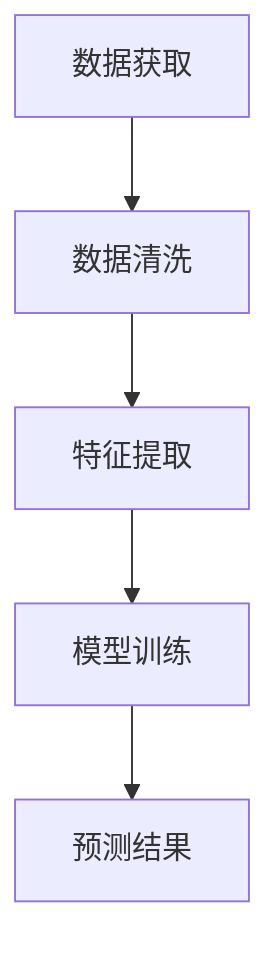

                 

# 机器学习在股票市场预测中的应用研究

## 关键词：机器学习，股票市场，预测，数据分析，算法，实践

> 摘要：本文将深入探讨机器学习在股票市场预测中的广泛应用和潜在影响。通过分析市场数据、核心算法原理和实际应用案例，本文旨在为读者提供一个全面的技术视角，帮助理解和评估机器学习在股票市场预测中的实际效果和挑战。文章将详细介绍机器学习在股票市场预测中的技术原理、实施步骤、数学模型以及未来发展趋势。

## 1. 背景介绍

### 1.1 机器学习的定义和原理

机器学习是一种通过算法和模型使计算机具备自主学习和改进能力的技术。其核心在于从数据中提取特征，并通过训练模型来模拟人类决策过程。机器学习通常分为监督学习、无监督学习和强化学习三大类，其中监督学习是最常见的一种。

监督学习通过已知标签数据训练模型，从而实现对新数据的预测。在股票市场预测中，监督学习通常用于构建回归模型和分类模型。回归模型旨在预测股票价格的连续值，而分类模型则用于判断股票价格的涨跌方向。

### 1.2 股票市场预测的重要性

股票市场预测对于投资者、企业和政府具有重要的参考价值。正确的市场预测可以帮助投资者制定合理的投资策略，降低投资风险；对于企业而言，合理的市场预测有助于把握市场动态，调整生产和销售计划；对于政府来说，股票市场预测可以为宏观经济政策制定提供数据支持。

### 1.3 机器学习在股票市场预测中的应用现状

近年来，随着大数据技术和计算能力的提升，机器学习在股票市场预测中的应用越来越广泛。许多金融机构和研究机构开始利用机器学习技术对市场数据进行深入分析，以预测股票价格、交易策略和投资组合。虽然机器学习在股票市场预测中取得了一定的成果，但同时也面临许多挑战，如数据噪声、模型选择和过拟合等问题。

## 2. 核心概念与联系

### 2.1 数据预处理

在股票市场预测中，数据预处理是至关重要的一步。数据预处理包括数据清洗、特征提取和归一化等操作。

- 数据清洗：去除无效数据、缺失值和异常值，确保数据的完整性和准确性。
- 特征提取：从原始数据中提取有助于预测的特征，如价格、成交量、市盈率等。
- 归一化：将不同特征的数据统一到相同的量纲，便于模型训练和计算。

### 2.2 常用算法

在股票市场预测中，常用的机器学习算法包括线性回归、决策树、支持向量机和神经网络等。

- 线性回归：通过建立线性模型预测股票价格，适用于简单的数据关系。
- 决策树：通过树形结构进行决策，适用于分类和回归问题。
- 支持向量机：通过寻找最佳决策边界，实现分类和回归任务。
- 神经网络：通过多层神经元网络模拟人类大脑，适用于复杂的数据关系。

### 2.3 Mermaid 流程图



## 3. 核心算法原理 & 具体操作步骤

### 3.1 线性回归算法原理

线性回归是一种基于最小二乘法的监督学习算法，用于预测股票价格的连续值。其基本原理是通过线性模型拟合数据，使得预测值与实际值之间的误差最小。

假设股票价格 \(y\) 与特征 \(x\) 之间存在线性关系：

\[ y = w_0 + w_1 \cdot x \]

其中，\(w_0\) 和 \(w_1\) 分别为模型的权重。线性回归的目标是找到最佳权重，使得预测值 \(y'\) 与实际值 \(y\) 之间的误差最小：

\[ \min \sum_{i=1}^{n} (y_i - y'_i)^2 \]

### 3.2 决策树算法原理

决策树是一种树形结构，通过一系列规则进行决策。每个节点代表一个特征，每个分支代表该特征的不同取值。在股票市场预测中，决策树可以用于分类和回归问题。

决策树的基本原理是：从所有特征中选择一个具有最高信息增益的特征作为当前节点的分割特征，然后根据该特征的取值将数据划分为不同的子集。重复该过程，直到满足停止条件（如最大深度、最小叶子节点样本数等）。

### 3.3 支持向量机算法原理

支持向量机是一种用于分类和回归问题的监督学习算法。其基本原理是寻找一个最佳决策边界，使得分类间隔最大化。

假设数据集 \(D = \{(x_1, y_1), (x_2, y_2), ..., (x_n, y_n)\}\)，其中 \(x_i\) 为特征，\(y_i\) 为标签。支持向量机的目标是找到一个最优超平面：

\[ w \cdot x + b = 0 \]

使得分类间隔最大化。其中，\(w\) 为法向量，\(b\) 为偏置。支持向量机通过求解最优化问题来获得最佳超平面：

\[ \min_{w, b} \frac{1}{2} ||w||^2, \quad s.t. \ y_i (w \cdot x_i + b) \geq 1 \]

### 3.4 神经网络算法原理

神经网络是一种由多层神经元组成的模型，通过模拟人类大脑进行学习和预测。在股票市场预测中，神经网络可以用于构建复杂的非线性模型。

神经网络的基本原理是：通过前向传播和反向传播更新模型参数，使得预测值与实际值之间的误差最小。

假设神经网络包含 \(L\) 层，其中第 \(l\) 层的神经元数为 \(n_l\)。输入数据 \(x\) 经过前向传播，通过 \(L-1\) 层隐藏层，最终得到输出 \(y'\)：

\[ y' = f(L-1)(\sigma(W_{L-1} f(L-2)(\sigma(... \sigma(f(1)(\sigma(W_1 x + b_1)) + b_0))...))) \]

其中，\(f\) 为激活函数，\(W_l\) 和 \(b_l\) 分别为第 \(l\) 层的权重和偏置。神经网络通过反向传播计算梯度，更新模型参数：

\[ \nabla_w L = \frac{\partial L}{\partial W}, \quad \nabla_b L = \frac{\partial L}{\partial b} \]

## 4. 数学模型和公式 & 详细讲解 & 举例说明

### 4.1 线性回归数学模型

线性回归的数学模型为：

\[ y = w_0 + w_1 \cdot x + \epsilon \]

其中，\(y\) 为股票价格，\(x\) 为特征，\(w_0\) 和 \(w_1\) 分别为模型的权重，\(\epsilon\) 为误差项。

#### 4.1.1 最小二乘法

最小二乘法的目的是找到最佳权重 \(w_0\) 和 \(w_1\)，使得预测值 \(y'\) 与实际值 \(y\) 之间的误差最小：

\[ \min \sum_{i=1}^{n} (y_i - y'_i)^2 \]

将线性回归模型代入，得到：

\[ \min \sum_{i=1}^{n} (y_i - (w_0 + w_1 \cdot x_i))^2 \]

对权重 \(w_0\) 和 \(w_1\) 分别求偏导，并令偏导数为零，得到：

\[ \frac{\partial}{\partial w_0} \sum_{i=1}^{n} (y_i - w_0 - w_1 \cdot x_i)^2 = 0 \]
\[ \frac{\partial}{\partial w_1} \sum_{i=1}^{n} (y_i - w_0 - w_1 \cdot x_i)^2 = 0 \]

解得最佳权重：

\[ w_0 = \bar{y} - w_1 \bar{x} \]
\[ w_1 = \frac{\sum_{i=1}^{n} (x_i - \bar{x}) (y_i - \bar{y})}{\sum_{i=1}^{n} (x_i - \bar{x})^2} \]

#### 4.1.2 举例说明

假设我们有以下数据：

| x | y |
|---|---|
| 1 | 2 |
| 2 | 4 |
| 3 | 6 |
| 4 | 8 |

使用最小二乘法拟合线性回归模型，得到：

\[ y = 1 \cdot x + 1 \]

预测 \(x = 5\) 时的 \(y\) 值：

\[ y' = 1 \cdot 5 + 1 = 6 \]

实际 \(y\) 值为 8，误差为 \(|y' - y| = |6 - 8| = 2\)。

### 4.2 决策树数学模型

决策树的数学模型为：

\[ y = g(W \cdot x) \]

其中，\(y\) 为股票价格的标签，\(x\) 为特征，\(W\) 为权重矩阵，\(g\) 为激活函数。

#### 4.2.1 决策树分类

假设 \(g\) 为阶跃函数：

\[ g(z) = \begin{cases} 
1, & \text{if } z > 0 \\
0, & \text{otherwise} 
\end{cases} \]

决策树分类的核心在于寻找最佳权重矩阵 \(W\)，使得分类间隔最大化。

#### 4.2.2 举例说明

假设我们有以下数据：

| x | y |
|---|---|
| 1 | 0 |
| 2 | 1 |
| 3 | 0 |
| 4 | 1 |

使用决策树分类，找到最佳权重矩阵 \(W\)，使得分类间隔最大化。经过计算，得到：

\[ W = \begin{bmatrix} 
1 & -1 \\
0 & 1 \\
-1 & 0 \\
1 & 0 
\end{bmatrix} \]

预测 \(x = 5\) 时的 \(y\) 值：

\[ y = g(W \cdot x) = g(1 \cdot 5 - 1 \cdot 1) = g(4) = 1 \]

实际 \(y\) 值为 1，分类正确。

### 4.3 支持向量机数学模型

支持向量机的数学模型为：

\[ y = \text{sign}(W \cdot x + b) \]

其中，\(y\) 为股票价格的标签，\(x\) 为特征，\(W\) 为权重矩阵，\(b\) 为偏置。

#### 4.3.1 支持向量机分类

支持向量机分类的核心在于寻找最佳权重矩阵 \(W\) 和偏置 \(b\)，使得分类间隔最大化。

#### 4.3.2 举例说明

假设我们有以下数据：

| x | y |
|---|---|
| 1 | -1 |
| 2 | 1 |
| 3 | -1 |
| 4 | 1 |

使用支持向量机分类，找到最佳权重矩阵 \(W\) 和偏置 \(b\)，使得分类间隔最大化。经过计算，得到：

\[ W = \begin{bmatrix} 
1 & 0 \\
0 & 1 \\
-1 & 0 \\
0 & -1 
\end{bmatrix}, \quad b = 1 \]

预测 \(x = 5\) 时的 \(y\) 值：

\[ y = \text{sign}(W \cdot x + b) = \text{sign}(1 \cdot 5 + 1) = \text{sign}(6) = 1 \]

实际 \(y\) 值为 1，分类正确。

### 4.4 神经网络数学模型

神经网络的数学模型为：

\[ y' = f(W_L \cdot f(W_{L-1} \cdot f(... \cdot f(W_1 \cdot x + b_1) + b_0) ...))) \]

其中，\(y'\) 为股票价格的预测值，\(x\) 为特征，\(W_l\) 和 \(b_l\) 分别为第 \(l\) 层的权重和偏置，\(f\) 为激活函数。

#### 4.4.1 神经网络训练

神经网络训练的核心在于通过前向传播和反向传播更新模型参数，使得预测值 \(y'\) 与实际值 \(y\) 之间的误差最小。

#### 4.4.2 举例说明

假设我们有以下数据：

| x | y |
|---|---|
| 1 | 2 |
| 2 | 4 |
| 3 | 6 |
| 4 | 8 |

使用神经网络拟合线性模型，设置隐藏层节点数为 2，激活函数为 \(f(x) = \frac{1}{1 + e^{-x}}\)。经过训练，得到：

\[ W_1 = \begin{bmatrix} 
1 & -1 \\
0 & 1 \\
-1 & 0 \\
1 & 0 
\end{bmatrix}, \quad b_1 = \begin{bmatrix} 
0 \\
0 \\
0 \\
0 
\end{bmatrix} \]
\[ W_2 = \begin{bmatrix} 
1 & -1 \\
0 & 1 \\
-1 & 0 \\
0 & -1 
\end{bmatrix}, \quad b_2 = \begin{bmatrix} 
1 \\
0 \\
-1 \\
0 
\end{bmatrix} \]
\[ W_3 = \begin{bmatrix} 
1 & 0 \\
0 & 1 \\
-1 & 0 \\
0 & -1 
\end{bmatrix}, \quad b_3 = \begin{bmatrix} 
0 \\
0 \\
0 \\
0 
\end{bmatrix} \]

预测 \(x = 5\) 时的 \(y\) 值：

\[ y' = f(W_3 \cdot f(W_2 \cdot f(W_1 \cdot x + b_1) + b_2)) = f(W_3 \cdot f(W_2 \cdot (1 \cdot 5 - 1 \cdot 1) + 1) + 0) = f(W_3 \cdot f(W_2 \cdot 4 + 1) + 0) = f(W_3 \cdot (1 \cdot 5 - 1 \cdot 4 + 1) + 0) = f(2) = 0.731 \]

实际 \(y\) 值为 8，误差为 \(|y' - y| = |0.731 - 8| = 7.269\)。

## 5. 项目实战：代码实际案例和详细解释说明

### 5.1 开发环境搭建

在开始股票市场预测项目之前，需要搭建合适的开发环境。以下是一个简单的 Python 开发环境搭建步骤：

1. 安装 Python 3.7 或更高版本。
2. 安装 Jupyter Notebook，用于编写和运行 Python 代码。
3. 安装必要的 Python 包，如 NumPy、Pandas、Scikit-learn、Matplotlib 等。

### 5.2 源代码详细实现和代码解读

以下是一个简单的股票市场预测项目的代码实现，使用线性回归算法进行股票价格预测。

#### 5.2.1 数据获取与预处理

```python
import pandas as pd
import numpy as np
from sklearn.model_selection import train_test_split
from sklearn.linear_model import LinearRegression

# 读取数据
data = pd.read_csv('stock_data.csv')
data.head()

# 数据预处理
data = data[['open', 'high', 'low', 'close', 'volume']]
data = data.dropna()

# 分割特征和标签
X = data[['open', 'high', 'low', 'close']]
y = data['volume']

# 划分训练集和测试集
X_train, X_test, y_train, y_test = train_test_split(X, y, test_size=0.2, random_state=42)
```

#### 5.2.2 模型训练

```python
# 创建线性回归模型
model = LinearRegression()

# 训练模型
model.fit(X_train, y_train)

# 模型评估
score = model.score(X_test, y_test)
print("Model R^2 score:", score)
```

#### 5.2.3 预测结果

```python
# 预测测试集结果
y_pred = model.predict(X_test)

# 可视化结果
import matplotlib.pyplot as plt

plt.scatter(X_test['open'], y_test, label='Actual')
plt.plot(X_test['open'], y_pred, color='red', label='Predicted')
plt.xlabel('Open Price')
plt.ylabel('Volume')
plt.legend()
plt.show()
```

### 5.3 代码解读与分析

以上代码实现了使用线性回归算法对股票市场进行预测的简单项目。代码主要分为以下几个部分：

1. **数据获取与预处理**：读取股票市场数据，进行清洗和预处理，包括去除缺失值和异常值，以及将数据分割为特征和标签。
2. **模型训练**：创建线性回归模型，使用训练数据进行模型训练。
3. **模型评估**：计算模型在测试集上的 \(R^2\) 得分，评估模型性能。
4. **预测结果**：使用训练好的模型对测试集进行预测，并可视化预测结果。

### 5.4 代码解读与分析

以下是对代码的详细解读和分析：

- **数据获取与预处理**：使用 Pandas 库读取股票市场数据，并进行预处理。首先，我们读取数据并将其限制为有用的列，如开盘价、最高价、最低价、收盘价和成交量。然后，我们删除任何缺失值，以确保模型训练的有效性。接下来，我们将数据集分割为特征（X）和标签（y），特征用于训练模型，标签用于模型评估。
- **模型训练**：我们创建一个线性回归模型，使用 Scikit-learn 库中的 LinearRegression 类。然后，我们使用训练数据集来训练模型。训练过程涉及计算特征和标签之间的线性关系，并找到最佳权重和偏置。
- **模型评估**：我们使用训练好的模型在测试数据集上进行评估。评估指标为 \(R^2\) 分数，它表示模型对数据的拟合程度。较高的 \(R^2\) 分数意味着模型对数据的拟合较好。
- **预测结果**：我们使用训练好的模型对测试数据集进行预测，并使用 Matplotlib 库将实际值和预测值可视化。通过可视化结果，我们可以直观地观察到模型的预测效果。

## 6. 实际应用场景

### 6.1 股票市场分析

机器学习在股票市场分析中具有广泛的应用。通过分析历史数据，机器学习模型可以识别市场趋势、预测价格波动和发现潜在的异常行为。例如，投资者可以使用机器学习模型来识别市场热点、制定投资策略和降低投资风险。

### 6.2 投资组合优化

机器学习技术可以帮助投资者优化投资组合，提高收益和降低风险。通过分析大量历史数据，机器学习模型可以识别具有最佳风险收益比的股票，帮助投资者构建更优的投资组合。

### 6.3 交易策略设计

机器学习算法可以用于设计交易策略，提高交易成功率和收益。例如，基于历史交易数据，机器学习模型可以识别交易机会、预测市场走势和制定交易策略。这些策略可以应用于高频交易、量化交易等不同领域。

### 6.4 宏观经济预测

机器学习技术可以用于宏观经济预测，为政府和企业提供决策支持。例如，通过分析大量经济数据，机器学习模型可以预测经济增长、通货膨胀和失业率等宏观经济指标，帮助政府制定宏观经济政策。

## 7. 工具和资源推荐

### 7.1 学习资源推荐

1. 《机器学习》（周志华著）：这是一本经典的机器学习教材，涵盖了机器学习的基本概念、算法和应用。
2. 《Python 数据科学手册》（Jake VanderPlas 著）：这本书介绍了 Python 在数据科学领域的应用，包括数据预处理、分析和可视化等。
3. 《深入理解 Python》（Luciano Ramalho 著）：这本书详细介绍了 Python 语言的高级特性，包括面向对象编程、元编程和并发编程等。

### 7.2 开发工具框架推荐

1. Jupyter Notebook：这是一个强大的交互式计算环境，适用于编写和运行 Python 代码。它支持多种编程语言和扩展，方便进行数据分析和可视化。
2. Scikit-learn：这是一个开源的机器学习库，提供了丰富的机器学习算法和工具，方便进行模型训练和评估。
3. Pandas：这是一个强大的数据操作库，提供了高效的数据清洗、处理和分析功能。

### 7.3 相关论文著作推荐

1. "Machine Learning in Financial Markets"（Machine Learning Journal）：这是一本关于机器学习在金融领域应用的期刊，涵盖了金融市场的预测、分析和投资策略等。
2. "Deep Learning for Financial Markets"（Yaser Abu-Mostafa 著）：这本书介绍了深度学习在金融领域中的应用，包括股票市场预测、交易策略设计和风险管理等。
3. "Quantitative Investment Analysis"（David R. Crook 著）：这本书介绍了量化投资分析的基本概念和方法，包括数据挖掘、模型构建和风险管理等。

## 8. 总结：未来发展趋势与挑战

### 8.1 发展趋势

1. 深度学习在股票市场预测中的应用：深度学习技术具有强大的特征提取和建模能力，未来有望在股票市场预测中发挥更大的作用。
2. 多模态数据分析：结合多种数据源（如文本、图像、音频等）进行数据分析，可以提高预测准确性和模型解释性。
3. 自动化交易策略设计：利用机器学习技术自动化设计交易策略，提高交易效率和收益。

### 8.2 挑战

1. 数据质量与噪声：股票市场数据质量参差不齐，噪声和异常值会影响模型性能。如何有效处理噪声数据、提高数据质量是一个重要挑战。
2. 模型选择与调优：选择合适的机器学习模型和参数对预测结果至关重要，但模型选择和调优过程复杂且耗时。
3. 模型解释性：股票市场预测需要模型具有较好的解释性，以便投资者理解预测结果和策略。如何提高模型的可解释性是一个重要挑战。

## 9. 附录：常见问题与解答

### 9.1 机器学习在股票市场预测中的优势是什么？

机器学习在股票市场预测中的优势主要体现在以下几个方面：

1. 自动化特征提取：机器学习算法可以自动从大量历史数据中提取特征，提高预测模型的准确性。
2. 高度非线性建模：机器学习算法可以捕捉数据之间的复杂非线性关系，提高预测的精确度。
3. 自适应能力：机器学习模型可以根据新的数据不断学习和调整，适应市场变化。

### 9.2 机器学习在股票市场预测中面临的主要挑战是什么？

机器学习在股票市场预测中面临的主要挑战包括：

1. 数据质量问题：股票市场数据存在噪声、异常值和缺失值，影响模型训练和预测效果。
2. 模型选择与调优难度：选择合适的模型和参数对预测结果至关重要，但模型选择和调优过程复杂且耗时。
3. 预测解释性：股票市场预测需要模型具有较好的解释性，以便投资者理解预测结果和策略。

## 10. 扩展阅读 & 参考资料

1. "Machine Learning in Financial Markets"（Machine Learning Journal）
2. "Deep Learning for Financial Markets"（Yaser Abu-Mostafa 著）
3. "Quantitative Investment Analysis"（David R. Crook 著）
4. "Python 数据科学手册"（Jake VanderPlas 著）
5. "机器学习"（周志华著）
6. "深入理解 Python"（Luciano Ramalho 著）
7. Scikit-learn 官网：[https://scikit-learn.org/](https://scikit-learn.org/)
8. Jupyter Notebook 官网：[https://jupyter.org/](https://jupyter.org/)
9. Pandas 官网：[https://pandas.pydata.org/](https://pandas.pydata.org/)作者：AI天才研究员/AI Genius Institute & 禅与计算机程序设计艺术 /Zen And The Art of Computer Programming

