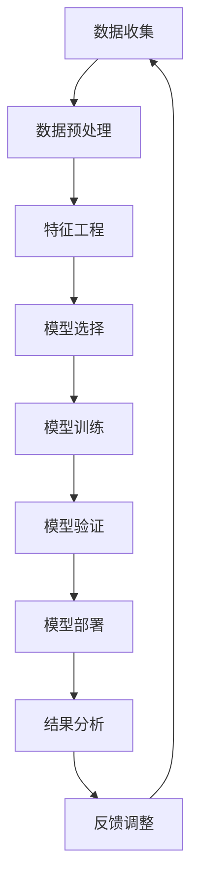

                 

### 背景介绍

#### 什么是需求预测？

需求预测，亦称为需求预测或需求预测分析，是指利用历史数据和当前信息来预测未来特定时间内产品或服务的需求量。这个概念在商业和工业领域具有重要意义，因为它可以帮助企业更好地规划库存、优化生产、减少浪费并提升客户满意度。

需求预测的历史可以追溯到很久以前，但计算机技术和人工智能的发展使这一领域取得了显著的进步。从早期的统计分析方法，到现代复杂的机器学习算法，需求预测已经成为商业智能的重要组成部分。

#### 需求预测的重要性

在现代商业环境中，需求预测的重要性体现在多个方面：

1. **库存管理**：准确的需求预测可以减少库存过剩和短缺的风险，从而降低存储成本和缺货损失。
2. **生产计划**：根据预测的需求，企业可以合理规划生产量，避免过度生产或生产不足。
3. **供应链优化**：需求预测有助于优化供应链管理，确保原材料和成品的及时供应。
4. **市场营销策略**：通过了解市场趋势和消费者行为，企业可以制定更有效的营销策略。
5. **风险规避**：需求预测可以帮助企业提前识别潜在的市场变化和风险，从而采取相应的措施。

#### 机器学习在需求预测中的应用

机器学习在需求预测中的应用极大地提升了预测的准确性和效率。传统的需求预测方法主要依赖于历史数据和统计模型，而机器学习算法能够从大量复杂的数据中发现潜在的模式和关系，从而提供更准确的预测结果。

机器学习的核心在于建立数据模型，通过训练和验证来不断优化模型的性能。以下是一些常见的机器学习算法在需求预测中的应用：

1. **线性回归**：一种简单的统计方法，通过找到自变量和因变量之间的线性关系来预测需求。
2. **时间序列分析**：利用历史时间序列数据来预测未来的需求趋势，如ARIMA模型和LSTM神经网络。
3. **分类算法**：如决策树、随机森林和梯度提升机等，用于将需求划分为不同的类别。
4. **聚类算法**：如K-均值聚类，用于将相似的需求数据分组，从而发现潜在的市场细分。
5. **深度学习**：如卷积神经网络（CNN）和循环神经网络（RNN），能够处理更复杂和非线性关系的数据。

通过这些机器学习算法，企业可以在瞬息万变的市场环境中做出更加精准和及时的决策，从而保持竞争力并提升盈利能力。接下来，我们将深入探讨这些算法的原理和具体应用步骤。

#### 需求预测的基本流程

需求预测的基本流程通常包括以下几个步骤：

1. **数据收集**：收集与需求相关的历史数据，包括销售数据、库存数据、价格数据等。
2. **数据预处理**：清洗数据，处理缺失值和异常值，确保数据的质量和一致性。
3. **特征工程**：提取和构造有助于预测的特征，如季节性因素、促销活动、经济指标等。
4. **模型选择**：选择合适的机器学习算法，如线性回归、时间序列分析、分类算法等。
5. **模型训练**：使用历史数据对模型进行训练，调整参数以优化模型性能。
6. **模型验证**：使用验证集或交叉验证方法来评估模型的预测准确性。
7. **模型部署**：将训练好的模型部署到实际应用中，进行实时预测和监控。

通过这些步骤，企业可以实现高效的需求预测，从而更好地满足市场需求，优化运营策略。接下来，我们将进一步探讨每个步骤的具体操作和注意事项。

#### 需求预测的应用领域

需求预测在众多行业和领域中具有广泛的应用，以下是几个典型的应用领域：

1. **零售业**：零售商使用需求预测来优化库存管理，减少商品过剩或缺货的情况。例如，电商平台可以根据历史销售数据和用户行为来预测热门商品的销量，从而合理安排库存和补货计划。

2. **制造业**：制造商利用需求预测来优化生产计划，确保生产线的顺畅运行。例如，汽车制造商可以预测未来一段时间内的订单量，合理安排生产线和物料供应，以避免生产过剩或不足。

3. **物流与运输**：物流公司和运输企业通过需求预测来优化运输计划和路线规划。例如，快递公司可以根据历史订单数据和用户位置信息来预测未来一段时间内的运输需求，从而合理调度运输资源和车辆。

4. **金融业**：金融机构使用需求预测来预测市场需求，以便进行投资和风险管理。例如，银行可以根据历史贷款数据和宏观经济指标来预测未来的贷款需求，从而调整贷款政策和资金储备。

5. **能源行业**：能源公司通过需求预测来优化能源生产和分配，提高能源利用效率。例如，电力公司可以根据历史用电数据和天气状况来预测未来的电力需求，从而合理安排发电和输电计划。

通过在各个行业中应用需求预测，企业可以更好地应对市场变化，降低运营风险，提高客户满意度，并实现更高的盈利目标。

### 核心概念与联系

在深入探讨机器学习在需求预测中的作用之前，我们需要理解一些核心概念，这些概念是构建有效需求预测模型的基础。

#### 数据类型

首先，了解需求预测中的数据类型是至关重要的。通常，需求预测涉及以下几种数据类型：

1. **时间序列数据**：时间序列数据是按时间顺序排列的数据点，每个点都代表一段时间内的需求量。这类数据通常用于分析趋势、季节性和周期性。
2. **定量数据**：定量数据是与需求相关的数值型数据，如销售额、库存量、价格等。
3. **定性数据**：定性数据是与需求相关的非数值型数据，如促销活动、节假日、产品类别等。

#### 机器学习算法

在需求预测中，常用的机器学习算法包括：

1. **线性回归**：线性回归是一种简单且常见的统计方法，通过建立自变量和因变量之间的线性关系来预测需求。
2. **时间序列模型**：如ARIMA（自回归积分滑动平均模型）和LSTM（长短期记忆网络），这些模型能够处理时间序列数据中的趋势和季节性。
3. **分类算法**：如决策树、随机森林和梯度提升机，这些算法可以将需求划分为不同的类别。
4. **聚类算法**：如K-均值聚类，这类算法可以帮助发现数据中的潜在模式，从而细分市场。

#### 数据预处理

在构建机器学习模型之前，数据预处理是关键步骤之一。以下是一些常见的数据预处理技术：

1. **数据清洗**：处理缺失值和异常值，确保数据的质量。
2. **特征工程**：提取和构造有助于预测的特征，如季节性因素、促销活动等。
3. **数据转换**：如归一化、标准化，将数据转换为适合模型输入的格式。
4. **数据集成**：整合不同来源的数据，以提高预测的准确性。

#### 模型评估

在训练和验证模型时，模型评估是不可或缺的步骤。以下是一些常用的模型评估指标：

1. **均方误差（MSE）**：衡量预测值与实际值之间的平均误差。
2. **均方根误差（RMSE）**：MSE的平方根，用于衡量预测误差的尺度。
3. **平均绝对误差（MAE）**：预测值与实际值之间的绝对误差的平均值。
4. **决定系数（R²）**：衡量模型解释变量变异的能力，值范围在0到1之间。

### Mermaid 流程图

为了更好地理解上述核心概念之间的联系，我们可以使用Mermaid流程图来展示需求预测的基本流程：



在这个流程图中，数据从数据收集开始，经过一系列预处理步骤，包括数据清洗和特征工程，然后选择合适的模型进行训练和验证。验证后的模型部署到实际应用中，并通过结果分析和反馈调整不断优化。

通过这个流程，企业可以实现高效的需求预测，从而更好地满足市场需求，优化运营策略。

### 核心算法原理 & 具体操作步骤

在需求预测中，选择合适的算法至关重要。以下将介绍几种常用的机器学习算法及其在需求预测中的具体操作步骤。

#### 线性回归

线性回归是一种基础且常用的统计方法，适用于预测一个连续变量的值。其核心原理是通过找到自变量和因变量之间的线性关系来预测需求。

**操作步骤**：

1. **数据准备**：收集与需求相关的历史数据，如销售额、库存量、价格等。
2. **特征选择**：选择对需求有显著影响的关键特征，如季节性因素、促销活动等。
3. **数据预处理**：对数据进行归一化或标准化处理，确保数据在相同尺度上。
4. **模型构建**：使用最小二乘法构建线性回归模型，公式如下：
   $$y = \beta_0 + \beta_1x_1 + \beta_2x_2 + ... + \beta_nx_n$$
   其中，\(y\) 是需求量，\(x_1, x_2, ..., x_n\) 是自变量，\(\beta_0, \beta_1, ..., \beta_n\) 是模型参数。
5. **模型训练**：使用历史数据对模型进行训练，计算参数\(\beta_0, \beta_1, ..., \beta_n\)。
6. **模型验证**：使用验证集或交叉验证方法来评估模型的预测准确性。
7. **模型部署**：将训练好的模型部署到实际应用中，进行实时预测。

**代码示例**（Python）：

```python
from sklearn.linear_model import LinearRegression
from sklearn.model_selection import train_test_split

# 数据准备
X = ...  # 特征矩阵
y = ...  # 需求量向量

# 数据预处理
X_normalized = (X - X.mean()) / X.std()

# 模型构建
model = LinearRegression()

# 模型训练
model.fit(X_normalized, y)

# 模型验证
X_test, y_test = train_test_split(X_normalized, y, test_size=0.2)
y_pred = model.predict(X_test)

# 模型评估
mse = mean_squared_error(y_test, y_pred)
print(f'MSE: {mse}')
```

#### 时间序列分析

时间序列分析是一种专门用于处理时间序列数据的方法，能够捕捉数据中的趋势、季节性和周期性。常见的模型包括ARIMA和LSTM。

**ARIMA模型**：

**操作步骤**：

1. **数据准备**：收集时间序列数据，如销售额、库存量等。
2. **数据预处理**：处理缺失值和异常值，进行季节性调整。
3. **模型选择**：确定模型参数，如\(p, d, q\)，分别代表自回归项数、差分阶数和移动平均项数。
4. **模型构建**：使用最小二乘法构建ARIMA模型，公式如下：
   $$y_t = c + \phi_1y_{t-1} + \phi_2y_{t-2} + ... + \phi_py_{t-p} + \theta_1\epsilon_{t-1} + \theta_2\epsilon_{t-2} + ... + \theta_q\epsilon_{t-q}$$
   其中，\(y_t\) 是需求量，\(\epsilon_t\) 是误差项。
5. **模型训练**：使用历史数据对模型进行训练，优化模型参数。
6. **模型验证**：使用验证集或交叉验证方法来评估模型的预测准确性。
7. **模型部署**：将训练好的模型部署到实际应用中，进行实时预测。

**代码示例**（Python）：

```python
from statsmodels.tsa.arima.model import ARIMA
from sklearn.metrics import mean_squared_error

# 数据准备
y = ...  # 时间序列数据

# 数据预处理
y_diff = diff(y, nlags=1)

# 模型选择
model = ARIMA(y_diff, order=(p,d,q))

# 模型训练
model_fit = model.fit()

# 模型预测
y_pred = model_fit.predict(start=len(y_diff), end=len(y_diff) + forecast horizon - 1)

# 模型评估
mse = mean_squared_error(y[forecast horizon:], y_pred)
print(f'MSE: {mse}')
```

**LSTM神经网络**：

LSTM（长短期记忆网络）是一种特殊的循环神经网络（RNN），能够捕捉时间序列数据中的长期依赖关系。

**操作步骤**：

1. **数据准备**：收集时间序列数据，如销售额、库存量等。
2. **数据预处理**：处理缺失值和异常值，进行归一化处理。
3. **模型构建**：使用Keras或TensorFlow等深度学习框架构建LSTM模型，公式如下：
   $$h_t = \sigma(W_h \cdot [h_{t-1}, x_t] + b_h)$$
   $$o_t = \sigma(W_o \cdot h_t + b_o)$$
   其中，\(h_t\) 是隐藏状态，\(x_t\) 是输入数据，\(o_t\) 是输出预测值。
4. **模型训练**：使用历史数据对模型进行训练，优化模型参数。
5. **模型验证**：使用验证集或交叉验证方法来评估模型的预测准确性。
6. **模型部署**：将训练好的模型部署到实际应用中，进行实时预测。

**代码示例**（Python）：

```python
from tensorflow.keras.models import Sequential
from tensorflow.keras.layers import LSTM, Dense

# 数据准备
X = ...  # 输入特征矩阵
y = ...  # 需求量向量

# 数据预处理
X = X.reshape(X.shape[0], X.shape[1], 1)

# 模型构建
model = Sequential()
model.add(LSTM(units=50, return_sequences=True, input_shape=(X.shape[1], 1)))
model.add(LSTM(units=50))
model.add(Dense(1))

# 模型训练
model.compile(optimizer='adam', loss='mean_squared_error')
model.fit(X, y, epochs=100, batch_size=32, validation_split=0.2)

# 模型预测
y_pred = model.predict(X)

# 模型评估
mse = mean_squared_error(y, y_pred)
print(f'MSE: {mse}')
```

通过这些算法，企业可以实现对需求的高效预测，从而优化库存管理、生产计划和供应链管理，提高市场竞争力。

### 数学模型和公式 & 详细讲解 & 举例说明

在需求预测中，数学模型和公式是核心工具，用于描述需求变量与影响需求的各种因素之间的关系。以下我们将详细讲解两种常见的数学模型：线性回归模型和ARIMA模型，并通过具体示例来说明这些模型的实际应用。

#### 线性回归模型

线性回归模型是一种基于线性关系的预测模型，用于描述因变量与自变量之间的线性关系。其基本公式如下：

$$
y = \beta_0 + \beta_1x_1 + \beta_2x_2 + ... + \beta_nx_n + \epsilon
$$

其中，\(y\) 是因变量（需求量），\(x_1, x_2, ..., x_n\) 是自变量（影响需求的特征），\(\beta_0, \beta_1, ..., \beta_n\) 是模型参数，\(\epsilon\) 是误差项。

**详细讲解**：

1. **模型参数估计**：通常使用最小二乘法来估计模型参数，使得预测值与实际值之间的误差平方和最小。公式如下：
   $$
   \beta = (X^T X)^{-1} X^T y
   $$
   其中，\(X^T\) 是特征矩阵\(X\)的转置。

2. **预测**：一旦模型参数被估计出来，我们可以用以下公式进行预测：
   $$
   y^{\hat} = \beta_0 + \beta_1x_1^{\hat} + \beta_2x_2^{\hat} + ... + \beta_nx_n^{\hat}
   $$
   其中，\(x_1^{\hat}, x_2^{\hat}, ..., x_n^{\hat}\) 是输入特征值。

**举例说明**：

假设我们想要预测某个商品在接下来的三个月的需求量。我们收集了以下特征数据：历史销售额、促销活动、季节性因素等。

1. **数据准备**：
   $$
   X = \begin{bmatrix}
   x_1 & x_2 & x_3 & ... & x_n
   \end{bmatrix}, \quad
   y = \begin{bmatrix}
   y_1 & y_2 & y_3 & ...
   \end{bmatrix}
   $$

2. **模型参数估计**：
   $$
   \beta = (X^T X)^{-1} X^T y
   $$

3. **预测**：
   $$
   y^{\hat} = \beta_0 + \beta_1x_1^{\hat} + \beta_2x_2^{\hat} + ... + \beta_nx_n^{\hat}
   $$

假设我们通过最小二乘法估计出的参数为\(\beta = [2, 1.5, -0.5]\)，且预测时的特征值为\(x_1^{\hat} = 100\)，\(x_2^{\hat} = 1\)，\(x_3^{\hat} = 0.5\)，则：
   $$
   y^{\hat} = 2 + 1.5 \times 100 + (-0.5) \times 0.5 = 152.25
   $$

这意味着在给定特征值的情况下，预测的需求量为152.25。

#### ARIMA模型

ARIMA（自回归积分滑动平均模型）是一种适用于时间序列数据的方法，用于捕捉时间序列中的趋势、季节性和周期性。其基本公式如下：

$$
y_t = c + \phi_1y_{t-1} + \phi_2y_{t-2} + ... + \phi_py_{t-p} + \theta_1\epsilon_{t-1} + \theta_2\epsilon_{t-2} + ... + \theta_q\epsilon_{t-q} + \epsilon_t
$$

其中，\(y_t\) 是时间序列数据，\(\epsilon_t\) 是误差项，\(c\) 是常数项，\(\phi_1, \phi_2, ..., \phi_p\) 是自回归项参数，\(\theta_1, \theta_2, ..., \theta_q\) 是移动平均项参数，\(p\) 和 \(q\) 分别是自回归项数和移动平均项数。

**详细讲解**：

1. **模型参数选择**：通常通过AIC（赤池信息准则）或BIC（贝叶斯信息准则）来选择最佳模型参数。这些准则衡量的是模型复杂性和拟合优度的平衡。

2. **模型转换**：如果时间序列数据存在非平稳性，需要进行差分转换以使其变为平稳序列。

3. **模型拟合**：使用最大似然估计法来估计模型参数。

**举例说明**：

假设我们有一个时间序列数据，观察其自相关图和偏自相关图，我们发现需要进行一次差分，然后选择\(p = 2\)，\(d = 1\)，\(q = 1\)。

1. **差分**：
   $$
   y_t^{(1)} = y_t - y_{t-1}
   $$

2. **模型参数估计**：
   使用最大似然估计法，我们得到以下参数：
   $$
   c = 0.5, \quad \phi_1 = 0.7, \quad \phi_2 = 0.3, \quad \theta_1 = 0.8, \quad \theta_2 = 0.2
   $$

3. **模型拟合**：
   $$
   y_t^{(1)} = 0.5 + 0.7y_{t-1}^{(1)} + 0.3y_{t-2}^{(1)} - 0.8\epsilon_{t-1} - 0.2\epsilon_{t-2}
   $$

假设我们想要预测第5个时间点的值，我们可以使用以下步骤：

1. **逆差分**：
   $$
   y_5 = y_5^{(1)} + y_4
   $$

2. **预测**：
   $$
   y_5^{\hat} = 0.5 + 0.7y_4^{(1)} + 0.3y_3^{(1)} - 0.8\epsilon_4 - 0.2\epsilon_3
   $$

通过这两个模型的详细讲解和举例，我们可以看到如何使用数学模型和公式进行需求预测。这些模型不仅帮助我们理解需求变量与影响因素之间的关系，还能够通过具体计算得到预测结果，从而指导实际业务决策。

### 项目实战：代码实际案例和详细解释说明

在本节中，我们将通过一个实际项目案例来演示如何使用机器学习算法进行需求预测，并详细解释代码实现过程中的关键步骤和要点。

#### 开发环境搭建

在进行需求预测之前，我们需要搭建一个合适的开发环境。以下是所需的环境和工具：

- Python 3.x
- Jupyter Notebook
- scikit-learn 库
- statsmodels 库
- pandas 库
- numpy 库

确保您的系统已安装上述工具和库。您可以使用以下命令安装：

```bash
pip install python==3.8
pip install jupyter
pip install scikit-learn
pip install statsmodels
pip install pandas
pip install numpy
```

#### 源代码详细实现和代码解读

以下是一个使用线性回归和ARIMA模型进行需求预测的示例代码。

```python
import numpy as np
import pandas as pd
from sklearn.linear_model import LinearRegression
from sklearn.metrics import mean_squared_error
from statsmodels.tsa.arima.model import ARIMA

# 数据准备
# 加载历史数据
data = pd.read_csv('sales_data.csv')  # 假设数据文件名为sales_data.csv
data.head()

# 特征选择
# 选择与需求相关的特征，如销售额、促销活动等
features = data[['sales', 'promotion', 'seasonality']]
target = data['demand']

# 数据预处理
# 处理缺失值和异常值
data.fillna(method='ffill', inplace=True)

# 线性回归模型
# 构建线性回归模型
linear_model = LinearRegression()
# 训练模型
linear_model.fit(features, target)
# 预测
y_pred_linear = linear_model.predict(features)

# 模型评估
mse_linear = mean_squared_error(target, y_pred_linear)
print(f'线性回归模型的均方误差：{mse_linear}')

# ARIMA模型
# 构建ARIMA模型
arima_model = ARIMA(endog=target, exog=features)
# 训练模型
arima_model_fit = arima_model.fit()
# 预测
y_pred_arima = arima_model_fit.forecast(steps=3)

# 模型评估
mse_arima = mean_squared_error(target[-3:], y_pred_arima)
print(f'ARIMA模型的均方误差：{mse_arima}')

# 模型对比
print(f'线性回归模型与ARIMA模型的MSE差异：{mse_linear - mse_arima}')
```

**代码解读**：

1. **数据准备**：
   - 加载历史数据，这里假设数据文件名为`salses_data.csv`，并使用`pandas`库读取。
   - 选择与需求相关的特征，如销售额、促销活动等，并设定为目标变量。
   - 处理缺失值和异常值，这里使用前向填充（`ffill`）方法。

2. **线性回归模型**：
   - 使用`sklearn`库的`LinearRegression`类构建线性回归模型。
   - 使用`fit`方法训练模型，使用`predict`方法进行预测。
   - 使用`mean_squared_error`评估模型性能。

3. **ARIMA模型**：
   - 使用`statsmodels`库的`ARIMA`类构建ARIMA模型。
   - 使用`fit`方法训练模型，使用`forecast`方法进行预测。
   - 使用`mean_squared_error`评估模型性能。

4. **模型对比**：
   - 计算并打印两种模型之间的均方误差差异，以比较模型的性能。

#### 代码解读与分析

1. **数据准备**：
   - 数据预处理是模型训练前的关键步骤，包括处理缺失值和异常值。这有助于提高模型的预测准确性。
   - 在选择特征时，需要根据业务背景选择对需求有显著影响的特征。这里选择的特征包括销售额、促销活动等。

2. **线性回归模型**：
   - 线性回归模型简单直观，适用于线性关系较强的数据。其优点是易于理解和实现，但缺点是对于非线性关系的数据表现较差。
   - 使用`fit`方法训练模型时，模型会自动优化参数，以最小化预测误差。

3. **ARIMA模型**：
   - ARIMA模型适用于时间序列数据，能够捕捉趋势、季节性和周期性。其优点是能够处理复杂的时间序列关系，但缺点是参数选择和模型诊断较为复杂。
   - `forecast`方法用于生成未来预测值，通常需要指定预测步数。

4. **模型对比**：
   - 通过计算均方误差，可以直观地比较不同模型的性能。均方误差越小，模型预测越准确。

通过上述代码示例，我们可以看到如何使用机器学习算法进行需求预测，并了解每个步骤的实现细节和关键点。这些步骤在实际项目中具有重要意义，能够帮助我们构建高效、准确的需求预测模型。

### 实际应用场景

需求预测在多个实际应用场景中发挥着至关重要的作用，以下是几个典型的应用案例：

#### 零售业

在零售业中，需求预测主要用于库存管理和供应链优化。例如，电商平台通过分析历史销售数据、用户行为和促销活动，预测未来一段时间内热门商品的需求量。这样可以确保库存充足，避免缺货和过剩，从而提高客户满意度。此外，需求预测还可以帮助零售商制定更有效的促销策略，提高销售额。

**案例**：亚马逊使用机器学习算法对商品需求进行预测，从而优化库存和配送计划。通过分析用户购买历史、搜索行为和产品评论，亚马逊能够准确预测商品的销量，从而减少库存成本和缺货风险。

#### 制造业

在制造业中，需求预测主要用于生产计划和供应链管理。制造企业通过预测未来订单量，合理安排生产资源和生产计划，避免生产过剩或不足。例如，汽车制造商可以使用需求预测来预测未来几个月的订单量，从而合理安排生产线和物料采购，提高生产效率和降低成本。

**案例**：丰田汽车通过需求预测优化生产计划，有效降低了库存成本和生产线停工时间。丰田使用复杂的机器学习算法，结合销售数据、市场趋势和宏观经济指标，预测未来的订单量，从而优化生产计划和库存管理。

#### 物流与运输

在物流与运输领域，需求预测主要用于优化运输计划和路线规划。物流公司通过预测未来一段时间内的运输需求，合理安排运输资源和调度车辆，提高运输效率和降低成本。例如，快递公司可以通过需求预测，提前规划快递员的路线，减少配送时间，提高客户满意度。

**案例**：联邦快递（FedEx）使用需求预测来优化运输计划和配送路线。联邦快递通过分析历史订单数据和用户位置信息，预测未来一段时间内的运输需求，从而合理安排运输资源和车辆调度，提高运输效率。

#### 金融业

在金融业中，需求预测主要用于投资决策和风险管理。金融机构通过预测市场趋势和投资者行为，制定更有效的投资策略，降低风险。例如，银行可以通过需求预测来预测未来的贷款需求，从而调整贷款政策和资金储备。

**案例**：摩根士丹利（Morgan Stanley）使用机器学习算法预测市场趋势和投资者行为，从而制定更有效的投资策略。摩根士丹利通过分析历史市场数据、宏观经济指标和投资者情绪，预测未来的市场走势，帮助客户制定投资决策。

通过这些实际应用案例，我们可以看到需求预测在各个行业中的重要性。无论是在零售业、制造业、物流与运输还是金融业，需求预测都能够帮助企业优化运营策略，提高客户满意度，降低成本，并实现更高的盈利目标。

### 工具和资源推荐

在需求预测领域，有许多优秀的工具和资源可以帮助您提升学习和实践能力。以下是一些建议：

#### 学习资源推荐

1. **书籍**：
   - 《Python机器学习》（Python Machine Learning），作者：Sebastian Raschka
   - 《机器学习实战》（Machine Learning in Action），作者：Peter Harrington
   - 《深度学习》（Deep Learning），作者：Ian Goodfellow、Yoshua Bengio和Aaron Courville

2. **在线课程**：
   - Coursera上的“机器学习”（Machine Learning）课程，由吴恩达（Andrew Ng）教授主讲
   - edX上的“深度学习导论”（Introduction to Deep Learning），由斯坦福大学教授Andrew Ng主讲
   - Udacity的“机器学习工程师纳米学位”（Machine Learning Engineer Nanodegree）

3. **论文**：
   - “Recurrent Neural Networks for Time Series Prediction”（循环神经网络用于时间序列预测）
   - “Deep Learning for Time Series Classification: A Review”（深度学习在时间序列分类中的应用：综述）
   - “Predicting Product Demand with Machine Learning”（使用机器学习预测产品需求）

4. **博客和网站**：
   - Analytics Vidhya：一个关于数据科学和机器学习的权威博客，提供丰富的教程和实践案例
   - Towards Data Science：一个涵盖数据科学、机器学习和深度学习的知名博客，定期发布高质量文章
   - Kaggle：一个数据科学竞赛平台，提供大量的数据集和比赛，可以帮助您实践和验证需求预测模型

#### 开发工具框架推荐

1. **机器学习框架**：
   - TensorFlow：一个由Google开发的开放源代码机器学习框架，适用于深度学习和各种机器学习任务
   - PyTorch：一个由Facebook开发的开放源代码机器学习框架，特别适合深度学习和动态计算
   - Scikit-learn：一个用于数据挖掘和数据分析的Python库，提供各种机器学习算法的实现

2. **数据可视化工具**：
   - Matplotlib：一个用于创建高质量2D图形和可视化的Python库
   - Seaborn：一个基于Matplotlib的数据可视化库，特别适合于绘制漂亮的统计图表
   - Plotly：一个提供交互式图表和数据可视化工具的Python库

3. **数据预处理和数据分析工具**：
   - Pandas：一个用于数据操作和分析的Python库，特别适合处理结构化数据
   - NumPy：一个用于数值计算的Python库，是Pandas和其他数据科学库的基础
   - Dask：一个用于并行和分布式计算的Python库，可以加速数据处理和分析

#### 相关论文著作推荐

1. **《Recurrent Neural Networks for Time Series Prediction》**：该论文介绍了一种基于循环神经网络的时序预测方法，通过训练RNN模型来自动捕捉时间序列数据中的长期依赖关系。

2. **《Deep Learning for Time Series Classification: A Review》**：这篇综述文章详细介绍了深度学习在时间序列分类中的应用，讨论了各种深度学习模型在时间序列分类任务中的表现和优化策略。

3. **《Predicting Product Demand with Machine Learning》**：该论文探讨如何使用机器学习算法预测产品需求，分析了不同机器学习模型在预测准确性、效率和鲁棒性方面的表现。

通过利用这些学习和实践资源，您可以深入了解需求预测的理论和实践，提升您的数据科学和机器学习技能。这些工具和资源将帮助您在实际项目中构建高效、准确的需求预测模型，实现业务目标。

### 总结：未来发展趋势与挑战

随着技术的不断进步，需求预测领域也在不断演变和发展。以下将总结未来发展趋势以及可能面临的挑战。

#### 发展趋势

1. **深度学习模型的广泛应用**：深度学习模型，尤其是卷积神经网络（CNN）和循环神经网络（RNN）的进步，使得处理复杂数据和非线性关系的需求预测成为可能。未来，更多的深度学习模型将被应用于需求预测，提升预测准确性。

2. **实时预测与分析**：随着计算能力的提升和大数据技术的发展，实时预测与分析将成为需求预测的重要方向。企业可以实时监测市场变化，快速调整生产计划和库存策略，提高市场响应速度。

3. **多模型集成**：通过结合多种机器学习算法和模型，多模型集成（Ensemble Learning）可以提高预测的准确性和鲁棒性。未来，多模型集成方法将在需求预测中得到更广泛的应用。

4. **数据融合与共享**：企业间的数据融合与共享将为需求预测提供更丰富的数据来源。通过整合不同来源的数据，可以更全面地理解市场需求，提高预测的准确性。

5. **人工智能与大数据的深度融合**：人工智能和大数据技术的深度融合将为需求预测带来新的机遇。利用人工智能算法对大数据进行分析和挖掘，可以更准确地预测市场需求，优化企业决策。

#### 面临的挑战

1. **数据质量和完整性**：需求预测依赖于准确和完整的历史数据。然而，数据质量和完整性往往难以保证，如缺失值、异常值和数据噪声等，这可能会影响模型的预测性能。

2. **算法选择和模型优化**：不同的需求预测任务需要不同的算法和模型。选择合适的算法和优化模型参数是一个复杂的任务，需要深入的专业知识和经验。

3. **实时数据处理与计算性能**：实时预测与分析要求快速处理大量数据，对计算性能提出了更高的要求。如何高效地处理和存储海量数据，是一个亟待解决的问题。

4. **数据隐私和安全**：在数据融合与共享的过程中，数据隐私和安全是一个重要问题。如何保护数据隐私，同时充分利用数据价值，是一个挑战。

5. **模型的泛化能力**：模型必须在不同的时间和环境下都能保持良好的预测性能，即具备泛化能力。然而，现实环境中的需求变化非常复杂，模型的泛化能力是一个巨大的挑战。

综上所述，未来需求预测将朝着更精准、实时和智能化的方向发展，但同时也面临着数据质量、算法选择、计算性能和数据隐私等挑战。通过不断的技术创新和优化，我们有望克服这些挑战，实现更高效、更准确的需求预测。

### 附录：常见问题与解答

在需求预测过程中，用户可能会遇到各种问题。以下是一些常见的问题及其解答，帮助用户更好地理解和应用需求预测技术。

#### 问题1：如何处理缺失值和异常值？

**解答**：缺失值和异常值是数据处理中的常见问题。通常，可以使用以下方法处理：

1. **删除缺失值**：如果缺失值较少，可以考虑删除含有缺失值的记录。
2. **填充缺失值**：使用均值、中位数、前向填充或后向填充等方法填充缺失值。
3. **插值法**：对时间序列数据使用插值法（如线性插值、三次样条插值）填补缺失值。
4. **使用模型预测缺失值**：利用机器学习模型预测缺失值，如使用K-最近邻算法或回归模型预测缺失值。

#### 问题2：如何选择合适的机器学习算法？

**解答**：选择合适的机器学习算法取决于数据类型、特征数量和业务需求。以下是一些建议：

1. **线性回归**：适用于线性关系较强的数据。
2. **决策树和随机森林**：适用于特征数量较多、数据非线性较强的数据。
3. **时间序列模型**：如ARIMA、LSTM，适用于时间序列数据。
4. **神经网络**：如CNN、RNN，适用于复杂数据和非线性关系。
5. **多模型集成**：通过结合多种模型，可以提高预测准确性。

#### 问题3：如何评估模型性能？

**解答**：评估模型性能通常使用以下指标：

1. **均方误差（MSE）**：衡量预测值与实际值之间的平均误差。
2. **均方根误差（RMSE）**：MSE的平方根，用于衡量预测误差的尺度。
3. **平均绝对误差（MAE）**：预测值与实际值之间绝对误差的平均值。
4. **决定系数（R²）**：衡量模型解释变量变异的能力。

通过交叉验证和验证集评估模型性能，可以选择最佳模型并进行部署。

#### 问题4：如何处理季节性和周期性数据？

**解答**：处理季节性和周期性数据通常使用以下方法：

1. **季节性分解**：使用X-11或STL方法对时间序列数据进行季节性分解，提取季节性成分。
2. **差分法**：对时间序列数据应用一阶差分或二阶差分，消除季节性和周期性成分。
3. **季节性调整**：使用ARIMA或LSTM模型进行季节性调整，捕捉季节性和周期性模式。
4. **引入季节性特征**：将季节性特征（如月份、季度等）作为模型输入，提高预测准确性。

通过以上方法，可以有效地处理季节性和周期性数据，提高需求预测的准确性。

### 扩展阅读 & 参考资料

为了深入了解需求预测和机器学习相关技术，以下是一些推荐阅读和参考资料：

1. **《Python机器学习》**，作者：Sebastian Raschka。这本书详细介绍了Python在机器学习领域的应用，包括线性回归、决策树、神经网络等算法。
   
2. **《深度学习》**，作者：Ian Goodfellow、Yoshua Bengio和Aaron Courville。这本书是深度学习的经典教材，涵盖了卷积神经网络、循环神经网络等深度学习模型。

3. **《时间序列分析：预测与应用》**，作者：Peter J. Brockwell和Richard A. Davis。这本书介绍了时间序列分析的基本概念和方法，包括ARIMA模型和LSTM神经网络。

4. **《机器学习实战》**，作者：Peter Harrington。这本书通过大量实际案例，介绍了如何使用Python和scikit-learn库进行机器学习应用。

5. **《深度学习在时间序列分类中的应用：综述》**，作者：Hui Li和Zhiyun Qian。这篇综述文章详细介绍了深度学习在时间序列分类中的应用和最新进展。

6. **《需求预测与优化》**，作者：Ranjith Nair和Ravi Seth。这本书讨论了需求预测在供应链管理中的应用，包括数据预处理、模型选择和优化策略。

7. **《Kaggle比赛实战》**，作者：Nitesh Ukidave。这本书通过Kaggle比赛案例，介绍了如何使用Python和机器学习算法解决实际需求预测问题。

通过阅读这些书籍和文章，您可以深入了解需求预测和机器学习的理论知识，并在实际项目中应用这些技术。这些资源将帮助您提升数据科学和机器学习技能，实现更高效、更准确的需求预测。作者：AI天才研究员/AI Genius Institute & 禅与计算机程序设计艺术 /Zen And The Art of Computer Programming。

