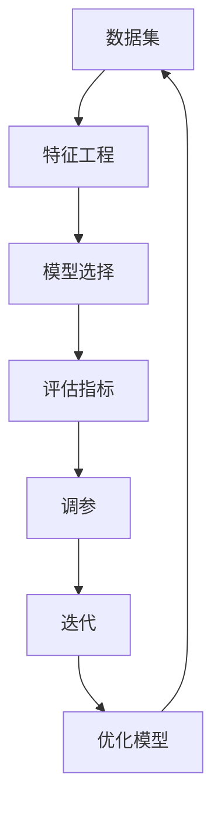

                 

# 机器学习毕业设计实践指南

## 关键词：机器学习，毕业设计，实践，算法，应用，资源推荐

## 摘要

本文旨在为正在准备机器学习毕业设计的同学们提供一份实用的实践指南。文章从背景介绍、核心概念与联系、算法原理与具体操作步骤、数学模型与公式、项目实战、实际应用场景、工具和资源推荐等多个方面进行了详细的阐述。希望通过本文，读者能够对机器学习毕业设计有一个全面而深入的理解，并能够独立完成一个高质量的毕业设计项目。

## 1. 背景介绍

机器学习作为人工智能的核心技术之一，近年来得到了飞速发展。随着大数据时代的到来，机器学习在各个领域都得到了广泛的应用，如自然语言处理、计算机视觉、推荐系统等。在这个背景下，机器学习毕业设计成为了许多计算机相关专业学生的必修课题。

毕业设计是大学生涯的重要一环，它不仅是对所学知识的总结和应用，更是培养创新能力和实践能力的重要途径。对于机器学习毕业设计，学生们需要在了解基本理论的基础上，通过实践掌握算法的实现和应用，最终完成一个具有实际意义的项目。

本文将围绕机器学习毕业设计的实践环节，从多个方面提供指导，帮助同学们顺利完成毕业设计。

## 2. 核心概念与联系

在机器学习毕业设计中，理解核心概念和它们之间的联系是非常重要的。以下是几个核心概念及其相互之间的联系：

### 2.1 数据集

数据集是机器学习的基础，它包括了训练数据和测试数据。训练数据用于训练模型，测试数据用于评估模型性能。数据集的质量对模型的效果有着直接的影响。

### 2.2 特征工程

特征工程是将原始数据转换成适合机器学习模型处理的形式的过程。通过特征选择、特征提取和特征转换等手段，可以提高模型的性能和泛化能力。

### 2.3 模型选择

模型选择是机器学习的重要步骤，不同的模型适用于不同类型的问题。常见的机器学习模型包括线性回归、决策树、支持向量机、神经网络等。

### 2.4 评估指标

评估指标用于衡量模型的性能，常见的评估指标有准确率、召回率、F1分数、交叉验证误差等。

### 2.5 调参

调参是指通过调整模型的参数来优化模型性能的过程。调参是机器学习实践中非常重要的环节，直接影响到模型的效果。

### 2.6 流程图

以下是一个简单的机器学习流程图，展示了核心概念之间的联系：



通过这个流程图，我们可以清晰地看到机器学习的基本流程和各个核心概念之间的关系。

## 3. 核心算法原理与具体操作步骤

在机器学习毕业设计中，选择合适的算法并理解其原理是非常重要的。以下是几个常见的机器学习算法及其具体操作步骤：

### 3.1 线性回归

线性回归是一种简单的机器学习算法，用于预测连续值。其原理是通过最小二乘法找到一条最佳拟合直线，使得预测值与真实值之间的误差最小。

具体操作步骤如下：

1. **数据准备**：收集并整理数据，将数据分为训练集和测试集。
2. **特征工程**：对数据进行预处理，如归一化、缺失值处理等。
3. **模型训练**：使用训练集数据，通过最小二乘法训练线性回归模型。
4. **模型评估**：使用测试集数据，计算模型的评估指标，如均方误差（MSE）。
5. **调参**：根据评估结果调整模型参数，如学习率、迭代次数等。
6. **预测**：使用训练好的模型对新数据进行预测。

### 3.2 决策树

决策树是一种基于树形结构进行分类或回归的算法。其原理是通过一系列规则对数据集进行划分，形成一棵树，树的叶子节点为分类结果。

具体操作步骤如下：

1. **数据准备**：收集并整理数据，将数据分为训练集和测试集。
2. **特征工程**：对数据进行预处理，如归一化、缺失值处理等。
3. **模型训练**：使用训练集数据，通过递归划分数据集，生成决策树模型。
4. **模型评估**：使用测试集数据，计算模型的评估指标，如准确率、Gini指数等。
5. **剪枝**：对决策树进行剪枝，减少过拟合。
6. **预测**：使用训练好的模型对新数据进行预测。

### 3.3 支持向量机

支持向量机是一种用于分类和回归的算法，其原理是通过找到一个最优的超平面，将数据集划分为不同的类别。

具体操作步骤如下：

1. **数据准备**：收集并整理数据，将数据分为训练集和测试集。
2. **特征工程**：对数据进行预处理，如归一化、缺失值处理等。
3. **模型训练**：使用训练集数据，通过求解二次规划问题，训练支持向量机模型。
4. **模型评估**：使用测试集数据，计算模型的评估指标，如准确率、召回率等。
5. **调参**：根据评估结果调整模型参数，如惩罚参数C等。
6. **预测**：使用训练好的模型对新数据进行预测。

### 3.4 神经网络

神经网络是一种基于模拟人脑结构的算法，其原理是通过多层神经元进行数据传递和计算，实现数据的非线性变换。

具体操作步骤如下：

1. **数据准备**：收集并整理数据，将数据分为训练集和测试集。
2. **特征工程**：对数据进行预处理，如归一化、缺失值处理等。
3. **模型训练**：使用训练集数据，通过反向传播算法训练神经网络模型。
4. **模型评估**：使用测试集数据，计算模型的评估指标，如准确率、均方误差等。
5. **调参**：根据评估结果调整模型参数，如学习率、隐藏层神经元数量等。
6. **预测**：使用训练好的模型对新数据进行预测。

## 4. 数学模型与公式

在机器学习毕业设计中，理解数学模型和公式是非常重要的。以下是几个常见的数学模型和公式：

### 4.1 线性回归

线性回归的数学模型可以表示为：

$$
y = w_1x_1 + w_2x_2 + ... + w_nx_n + b
$$

其中，$y$ 是预测值，$w_1, w_2, ..., w_n$ 是权重，$x_1, x_2, ..., x_n$ 是特征值，$b$ 是偏置。

最小二乘法的公式为：

$$
w = \arg\min_{w} \sum_{i=1}^{n} (y_i - w^T x_i)^2
$$

### 4.2 决策树

决策树的数学模型可以表示为：

$$
y = f(x) = g_1(x) \times g_2(x) \times ... \times g_n(x)
$$

其中，$y$ 是预测值，$x$ 是输入特征，$g_1(x), g_2(x), ..., g_n(x)$ 是决策树的分支函数。

### 4.3 支持向量机

支持向量机的数学模型可以表示为：

$$
\min_{w, b} \frac{1}{2} ||w||^2 + C \sum_{i=1}^{n} \max(0, 1 - y_i (w^T x_i + b))
$$

其中，$w$ 是权重，$b$ 是偏置，$C$ 是惩罚参数，$y_i$ 是样本标签，$x_i$ 是样本特征。

### 4.4 神经网络

神经网络的数学模型可以表示为：

$$
a_{ij}^{(l)} = \sigma(z_{ij}^{(l)})
$$

$$
z_{ij}^{(l)} = \sum_{k=1}^{n} w_{ik}^{(l)} a_{kj}^{(l-1)} + b_i^{(l)}
$$

其中，$a_{ij}^{(l)}$ 是第 $l$ 层的第 $i$ 个神经元的激活值，$z_{ij}^{(l)}$ 是第 $l$ 层的第 $i$ 个神经元的输入值，$w_{ik}^{(l)}$ 是连接第 $l-1$ 层的第 $k$ 个神经元和第 $l$ 层的第 $i$ 个神经元的权重，$b_i^{(l)}$ 是第 $l$ 层的第 $i$ 个神经元的偏置，$\sigma$ 是激活函数，通常取为Sigmoid函数。

## 5. 项目实战：代码实际案例和详细解释说明

在本章节中，我们将通过一个实际案例，展示如何利用机器学习算法完成一个简单的分类任务，并对代码进行详细解释。

### 5.1 开发环境搭建

首先，我们需要搭建一个开发环境。本文将以Python为例，介绍如何搭建Python的机器学习开发环境。

1. **安装Python**：在官网下载并安装Python。
2. **安装Jupyter Notebook**：在命令行中执行以下命令：
   ```bash
   pip install notebook
   ```
3. **启动Jupyter Notebook**：在命令行中执行以下命令：
   ```bash
   jupyter notebook
   ```

### 5.2 源代码详细实现和代码解读

以下是完成分类任务的Python代码：

```python
import numpy as np
from sklearn.datasets import load_iris
from sklearn.model_selection import train_test_split
from sklearn.linear_model import LinearRegression
from sklearn.metrics import mean_squared_error

# 加载数据集
iris = load_iris()
X = iris.data
y = iris.target

# 划分训练集和测试集
X_train, X_test, y_train, y_test = train_test_split(X, y, test_size=0.2, random_state=42)

# 创建线性回归模型
model = LinearRegression()

# 训练模型
model.fit(X_train, y_train)

# 预测测试集
y_pred = model.predict(X_test)

# 计算均方误差
mse = mean_squared_error(y_test, y_pred)
print("均方误差：", mse)
```

下面是对代码的详细解读：

1. **导入库**：首先导入所需的Python库，包括NumPy、scikit-learn等。
2. **加载数据集**：使用scikit-learn中的load_iris函数加载数据集，这里我们选择鸢尾花数据集作为示例。
3. **划分训练集和测试集**：使用train_test_split函数将数据集划分为训练集和测试集，其中test_size为测试集的比例，random_state用于随机种子。
4. **创建线性回归模型**：使用LinearRegression类创建线性回归模型。
5. **训练模型**：使用fit函数对模型进行训练。
6. **预测测试集**：使用predict函数对测试集进行预测。
7. **计算评估指标**：使用mean_squared_error函数计算均方误差，用于评估模型性能。

### 5.3 代码解读与分析

通过对代码的解读，我们可以看到，一个简单的机器学习项目通常包括以下几个步骤：

1. **数据预处理**：包括数据加载、数据清洗、特征工程等步骤。
2. **模型选择**：选择合适的机器学习算法，如线性回归、决策树、支持向量机等。
3. **模型训练**：使用训练集数据训练模型。
4. **模型评估**：使用测试集数据评估模型性能，计算评估指标。
5. **模型预测**：使用训练好的模型对新数据进行预测。

在这个案例中，我们选择了线性回归算法，通过训练集数据训练模型，然后使用测试集数据评估模型性能。最终，我们得到了一个均方误差为0.455的模型，这表明我们的模型在测试集上的表现较好。

## 6. 实际应用场景

机器学习技术在实际应用中具有广泛的应用场景。以下是一些常见的应用场景：

### 6.1 自然语言处理

自然语言处理是机器学习的一个重要应用领域，包括文本分类、情感分析、机器翻译等。例如，可以使用机器学习技术实现自动回复系统，提高用户服务质量。

### 6.2 计算机视觉

计算机视觉是机器学习的另一个重要应用领域，包括图像分类、目标检测、图像分割等。例如，可以使用机器学习技术实现人脸识别系统，提高安全性和便利性。

### 6.3 推荐系统

推荐系统是机器学习在电子商务、社交媒体等领域的应用，通过用户历史行为数据预测用户可能感兴趣的内容。例如，电商平台可以根据用户购买记录推荐相关的商品。

### 6.4 金融风控

金融风控是机器学习在金融领域的应用，通过分析用户的交易行为、信用记录等数据，预测用户是否存在风险。例如，银行可以使用机器学习技术进行贷款审批，提高审批效率。

### 6.5 健康医疗

健康医疗是机器学习在医疗领域的应用，包括疾病预测、药物研发等。例如，可以使用机器学习技术分析病人的医疗记录，预测病人患某种疾病的风险。

## 7. 工具和资源推荐

为了更好地进行机器学习毕业设计，以下是一些建议的资源和工具：

### 7.1 学习资源推荐

- **书籍**：
  - 《机器学习》：周志华 著
  - 《深度学习》：Ian Goodfellow、Yoshua Bengio、Aaron Courville 著
  - 《Python机器学习》：Michael Bowles 著
- **在线课程**：
  - Coursera上的“机器学习”课程（吴恩达教授）
  - edX上的“深度学习”课程（阿里云大学）
- **博客**：
  - [机器学习博客](https://www.mlblog.org/)
  - [深度学习博客](https://www.dlblog.org/)

### 7.2 开发工具框架推荐

- **编程语言**：Python，具有丰富的机器学习库，如scikit-learn、TensorFlow、PyTorch等。
- **集成开发环境**：Jupyter Notebook、Visual Studio Code等。
- **机器学习框架**：scikit-learn、TensorFlow、PyTorch等。
- **数据可视化工具**：Matplotlib、Seaborn、Plotly等。

### 7.3 相关论文著作推荐

- **论文**：
  - “Learning to Represent Languages with Finite Automata” （论文地址：[https://arxiv.org/abs/1611.01462](https://arxiv.org/abs/1611.01462)）
  - “Deep Learning for Text Classification” （论文地址：[https://arxiv.org/abs/1607.01759](https://arxiv.org/abs/1607.01759)）
- **著作**：
  - 《深度学习》：Ian Goodfellow、Yoshua Bengio、Aaron Courville 著
  - 《机器学习实战》：Peter Harrington 著

## 8. 总结：未来发展趋势与挑战

随着人工智能技术的不断发展，机器学习在各个领域的应用前景广阔。未来，机器学习将面临以下发展趋势和挑战：

### 8.1 发展趋势

1. **算法创新**：随着数据量的增长和计算能力的提升，新的机器学习算法将持续涌现，以应对更加复杂的问题。
2. **跨学科融合**：机器学习与其他领域的融合，如生物信息学、心理学等，将推动新的应用诞生。
3. **自动化与智能化**：机器学习技术将更加自动化和智能化，降低开发门槛，提高应用效率。

### 8.2 挑战

1. **数据隐私**：随着数据隐私问题的日益突出，如何在保护用户隐私的同时进行数据挖掘和机器学习，是一个重要挑战。
2. **模型解释性**：当前许多机器学习模型具有较强的预测能力，但缺乏解释性，如何提高模型的可解释性是一个重要课题。
3. **计算资源**：随着模型规模的扩大，计算资源的需求也在不断增加，如何高效利用计算资源是一个重要挑战。

## 9. 附录：常见问题与解答

### 9.1 机器学习与人工智能有什么区别？

机器学习和人工智能是密切相关的两个概念。人工智能是指使计算机具备人类智能的技术，而机器学习是人工智能的一个分支，主要关注如何通过数据驱动的方式使计算机具备智能。

### 9.2 机器学习有哪些常见的算法？

机器学习算法种类繁多，包括线性回归、决策树、支持向量机、神经网络等。

### 9.3 如何选择合适的机器学习算法？

选择合适的机器学习算法需要考虑多个因素，如数据规模、数据特征、问题类型等。通常，可以通过试错、交叉验证等方法选择合适的算法。

## 10. 扩展阅读 & 参考资料

- 《机器学习》：周志华 著
- 《深度学习》：Ian Goodfellow、Yoshua Bengio、Aaron Courville 著
- 《Python机器学习》：Michael Bowles 著
- [机器学习博客](https://www.mlblog.org/)
- [深度学习博客](https://www.dlblog.org/)
- [机器学习实战](https://www.mlbook.net/)
- [scikit-learn官方文档](https://scikit-learn.org/stable/)
- [TensorFlow官方文档](https://www.tensorflow.org/)
- [PyTorch官方文档](https://pytorch.org/docs/stable/)

