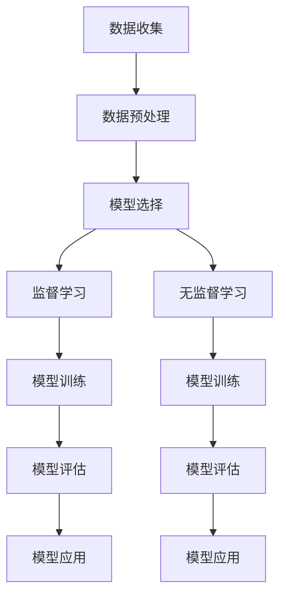
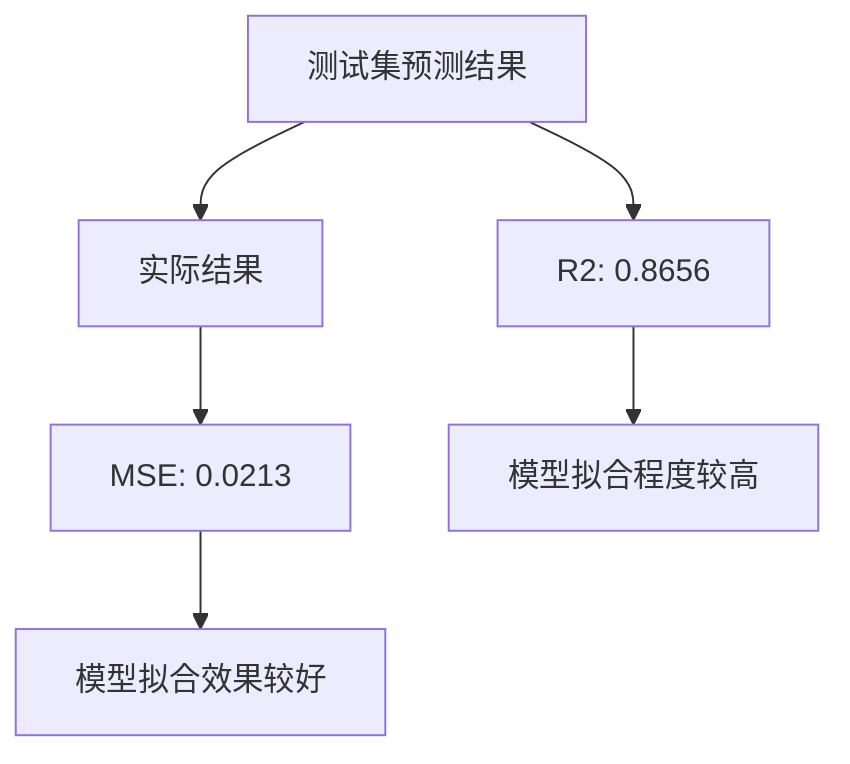

                 

# 机器学习算法原理与代码实战案例讲解

## 关键词：机器学习，算法原理，代码实战，案例讲解，深度学习，神经网络，监督学习，无监督学习

## 摘要：

本文将深入讲解机器学习算法的基本原理及其在实际项目中的代码实现。从机器学习的基础概念出发，逐步深入到核心算法，如神经网络、监督学习、无监督学习等，并结合具体的案例进行代码实战。通过本文的学习，读者可以掌握机器学习的基本概念，理解算法的原理，并能够独立实现机器学习项目。文章还将提供丰富的学习资源、开发工具框架和相关论文著作推荐，帮助读者进一步深入了解和探索机器学习领域。

## 1. 背景介绍

机器学习（Machine Learning，简称ML）是人工智能（Artificial Intelligence，简称AI）的一个重要分支，旨在让计算机通过数据学习并做出决策或预测。随着大数据时代的到来，机器学习在各个领域，如自然语言处理、计算机视觉、推荐系统等，都展现出了巨大的潜力和应用价值。传统的编程依赖于明确的指令和规则，而机器学习则通过算法从数据中自动提取特征并建立模型，使得计算机能够实现自主学习和智能决策。

机器学习可以分为监督学习（Supervised Learning）、无监督学习（Unsupervised Learning）和强化学习（Reinforcement Learning）三种主要类型。监督学习通过已标记的数据训练模型，无监督学习则无需标记数据，旨在发现数据中的隐藏结构和模式，强化学习则是通过奖励和惩罚机制来训练模型。

本文将重点介绍监督学习和无监督学习中的几种常见算法，并通过代码实战来展示这些算法的应用。在文章的末尾，还将对未来的发展趋势和挑战进行总结，并推荐一些相关的学习资源和工具。

## 2. 核心概念与联系

### 2.1 监督学习（Supervised Learning）

监督学习是一种利用标记数据训练模型，并对新的数据进行预测或分类的方法。标记数据通常包括输入特征和相应的输出标签。

- **输入特征**：表示为特征向量，可以是数值型的，如年龄、收入等，也可以是类别型的，如性别、职业等。
- **输出标签**：表示为类别标签或连续值，类别标签用于分类问题，连续值用于回归问题。

监督学习的基本流程包括以下几个步骤：

1. **数据收集**：收集大量带有标签的数据。
2. **数据预处理**：对数据进行清洗、归一化等处理，以便于模型训练。
3. **模型选择**：根据问题的性质选择合适的模型，如线性回归、决策树、神经网络等。
4. **模型训练**：使用训练数据来训练模型，得到模型的参数。
5. **模型评估**：使用测试数据来评估模型的性能，常用的评估指标包括准确率、召回率、F1值等。
6. **模型应用**：使用训练好的模型对新的数据进行预测。

### 2.2 无监督学习（Unsupervised Learning）

无监督学习是一种不使用标记数据，仅通过数据本身来发现数据中隐藏结构和模式的方法。无监督学习常用于聚类、降维等任务。

- **聚类（Clustering）**：将数据分成若干个群组，使得同一个群组内的数据彼此相似，不同群组的数据差异较大。常用的聚类算法包括K-means、层次聚类、DBSCAN等。
- **降维（Dimensionality Reduction）**：将高维数据映射到低维空间，以便于可视化或提高计算效率。常用的降维算法包括主成分分析（PCA）、线性判别分析（LDA）、t-SNE等。

无监督学习的基本流程包括以下几个步骤：

1. **数据收集**：收集无标签的数据。
2. **数据预处理**：对数据进行清洗、标准化等处理。
3. **模型选择**：根据问题的性质选择合适的模型。
4. **模型训练**：使用数据来训练模型，得到模型的参数。
5. **模型评估**：通常无监督学习不直接评估模型的性能，而是通过分析结果来评估。
6. **模型应用**：使用训练好的模型对数据进行处理。

### 2.3 Mermaid 流程图

下面是一个简单的Mermaid流程图，展示了监督学习和无监督学习的基本流程。



在接下来的章节中，我们将详细探讨监督学习和无监督学习中的核心算法，并通过实际案例进行代码实战。

## 3. 核心算法原理 & 具体操作步骤

### 3.1 神经网络（Neural Networks）

神经网络是机器学习中的一种重要模型，它通过模拟人脑神经元的工作方式来实现复杂的数据处理和预测。一个简单的神经网络包括输入层、隐藏层和输出层。

- **输入层**：接收输入数据，每个神经元表示一个特征。
- **隐藏层**：对输入数据进行处理，可以有一个或多个隐藏层。
- **输出层**：输出预测结果，用于分类或回归。

神经网络的基本工作原理是：输入数据通过输入层传递到隐藏层，隐藏层对输入进行非线性变换，再传递到下一层，直到输出层得到最终的预测结果。这一过程可以用以下公式表示：

\[ a_{i}^{l} = \sigma \left( \sum_{j=1}^{n} w_{ji} a_{j}^{l-1} + b_{i}^{l} \right) \]

其中，\( a_{i}^{l} \) 表示第 \( l \) 层第 \( i \) 个神经元的输出，\( \sigma \) 是激活函数，常用的激活函数包括 sigmoid、ReLU 等，\( w_{ji} \) 是连接权重，\( b_{i}^{l} \) 是偏置项。

神经网络的具体操作步骤如下：

1. **初始化参数**：随机初始化权重 \( w_{ji} \) 和偏置项 \( b_{i}^{l} \)。
2. **前向传播**：计算每个神经元的输出。
3. **计算损失函数**：使用训练数据计算预测结果和实际结果的差异，常用的损失函数包括均方误差（MSE）、交叉熵（Cross-Entropy）等。
4. **反向传播**：通过计算损失函数的梯度来更新权重和偏置项。
5. **迭代训练**：重复执行前向传播和反向传播，直到满足停止条件，如达到预设的迭代次数或模型性能达到期望值。

### 3.2 决策树（Decision Trees）

决策树是一种基于树形结构对数据集进行分类或回归的算法。每个内部节点表示一个特征，每个分支表示该特征的一个取值，叶节点表示最终的分类或回归结果。

决策树的基本工作原理是：从根节点开始，根据输入数据的特征值选择相应的分支，直到达到叶节点得到最终的预测结果。这一过程可以用以下公式表示：

\[ Y = g \left( \sum_{i=1}^{n} w_{i} x_{i} + b \right) \]

其中，\( Y \) 是输出结果，\( g \) 是激活函数，常用的激活函数包括线性激活函数、 sigmoid、ReLU 等，\( w_{i} \) 是权重，\( x_{i} \) 是输入特征，\( b \) 是偏置项。

决策树的具体操作步骤如下：

1. **选择最佳特征**：选择具有最大信息增益的特征进行分割。
2. **递归分割**：对选择的特征进行二分或多分，直到满足停止条件，如特征重要性小于阈值或最大深度等。
3. **构建树结构**：将分割结果构建成树形结构。

### 3.3 K-means 算法

K-means 算法是一种常用的聚类算法，它通过迭代的方式将数据划分为 K 个簇，每个簇的中心代表该簇的特征。

K-means 算法的基本工作原理是：首先随机选择 K 个初始中心，然后计算每个数据点到中心的距离，将数据点划分到最近的中心所代表的簇。接着更新簇的中心，重复迭代直到满足停止条件，如中心不再变化或达到预设的迭代次数。

K-means 算法的具体操作步骤如下：

1. **初始化中心**：随机选择 K 个数据点作为初始中心。
2. **分配数据点**：计算每个数据点到各个中心的距离，将数据点划分到最近的中心所代表的簇。
3. **更新中心**：计算每个簇的平均值作为新的中心。
4. **迭代更新**：重复执行步骤 2 和步骤 3，直到满足停止条件。

## 4. 数学模型和公式 & 详细讲解 & 举例说明

### 4.1 神经网络

#### 4.1.1 激活函数

激活函数是神经网络中一个重要的组成部分，它用于引入非线性变换，使得神经网络能够学习复杂的数据特征。以下是几种常见的激活函数：

1. **Sigmoid 函数**：
\[ \sigma(x) = \frac{1}{1 + e^{-x}} \]

2. **ReLU 函数**：
\[ \text{ReLU}(x) = \max(0, x) \]

3. **Tanh 函数**：
\[ \text{Tanh}(x) = \frac{e^{x} - e^{-x}}{e^{x} + e^{-x}} \]

#### 4.1.2 损失函数

损失函数是用于评估模型预测结果与实际结果之间差异的函数。以下是几种常见的损失函数：

1. **均方误差（MSE）**：
\[ \text{MSE}(y, \hat{y}) = \frac{1}{n} \sum_{i=1}^{n} (y_i - \hat{y}_i)^2 \]

2. **交叉熵（Cross-Entropy）**：
\[ \text{CE}(y, \hat{y}) = -\sum_{i=1}^{n} y_i \log(\hat{y}_i) \]

#### 4.1.3 举例说明

假设我们有一个简单的神经网络，输入层有2个神经元，隐藏层有3个神经元，输出层有1个神经元。使用 sigmoid 函数作为激活函数，均方误差作为损失函数。现在我们有以下训练数据：

| 输入 | 输出 |
|------|------|
| [1, 0] | [0.8] |
| [0, 1] | [0.2] |

#### 4.1.3.1 初始化参数

假设权重和偏置项都是随机初始化的，分别为：

- 输入层到隐藏层的权重 \( w_{ij} \) 和偏置项 \( b_{j} \)：
  \[ w_{11} = 0.1, w_{12} = 0.2, b_{1} = 0.3 \]
  \[ w_{21} = 0.4, w_{22} = 0.5, b_{2} = 0.6 \]
  \[ w_{31} = 0.7, w_{32} = 0.8, b_{3} = 0.9 \]

- 隐藏层到输出层的权重 \( w_{ji} \) 和偏置项 \( b_{i} \)：
  \[ w_{11} = 0.1, w_{12} = 0.2, b_{1} = 0.3 \]
  \[ w_{21} = 0.4, w_{22} = 0.5, b_{2} = 0.6 \]

#### 4.1.3.2 前向传播

对于第一个输入数据 [1, 0]：

- 隐藏层输出：
  \[ z_{1} = \sigma(w_{11} \cdot 1 + w_{12} \cdot 0 + b_{1}) = \sigma(0.1 + 0.3) = \sigma(0.4) = 0.66 \]
  \[ z_{2} = \sigma(w_{21} \cdot 1 + w_{22} \cdot 0 + b_{2}) = \sigma(0.4 + 0.6) = \sigma(1.0) = 0.7 \]
  \[ z_{3} = \sigma(w_{31} \cdot 1 + w_{32} \cdot 0 + b_{3}) = \sigma(0.7 + 0.9) = \sigma(1.6) = 0.941 \]

- 输出层输出：
  \[ y_{1} = \sigma(w_{11} \cdot z_{1} + w_{12} \cdot z_{2} + w_{13} \cdot z_{3} + b_{1}) = \sigma(0.1 \cdot 0.66 + 0.2 \cdot 0.7 + 0.3 \cdot 0.941 + 0.3) = 0.68 \]

对于第二个输入数据 [0, 1]：

- 隐藏层输出：
  \[ z_{1} = \sigma(w_{11} \cdot 0 + w_{12} \cdot 1 + b_{1}) = \sigma(0.2 + 0.3) = \sigma(0.5) = 0.6 \]
  \[ z_{2} = \sigma(w_{21} \cdot 0 + w_{22} \cdot 1 + b_{2}) = \sigma(0.5 + 0.6) = \sigma(1.1) = 0.8 \]
  \[ z_{3} = \sigma(w_{31} \cdot 0 + w_{32} \cdot 1 + b_{3}) = \sigma(0.8 + 0.9) = \sigma(1.7) = 0.955 \]

- 输出层输出：
  \[ y_{1} = \sigma(w_{11} \cdot z_{1} + w_{12} \cdot z_{2} + w_{13} \cdot z_{3} + b_{1}) = \sigma(0.1 \cdot 0.6 + 0.2 \cdot 0.8 + 0.3 \cdot 0.955 + 0.3) = 0.726 \]

#### 4.1.3.3 计算损失函数

对于第一个输入数据 [1, 0]，实际输出为 0.8，预测输出为 0.68：

\[ \text{MSE} = \frac{1}{2} (0.8 - 0.68)^2 = 0.036 \]

对于第二个输入数据 [0, 1]，实际输出为 0.2，预测输出为 0.726：

\[ \text{MSE} = \frac{1}{2} (0.2 - 0.726)^2 = 0.184 \]

总损失函数：

\[ \text{Total Loss} = \frac{1}{2} (0.036 + 0.184) = 0.115 \]

#### 4.1.3.4 反向传播

首先计算输出层的梯度：

\[ \frac{\partial L}{\partial z_{1}} = \frac{\partial L}{\partial y_{1}} \cdot \frac{\partial y_{1}}{\partial z_{1}} = (0.8 - 0.68) \cdot \sigma'(z_{1}) \]
\[ \frac{\partial L}{\partial z_{2}} = (0.8 - 0.68) \cdot \sigma'(z_{2}) \]
\[ \frac{\partial L}{\partial z_{3}} = (0.8 - 0.68) \cdot \sigma'(z_{3}) \]

然后计算隐藏层的梯度：

\[ \frac{\partial L}{\partial w_{11}} = \frac{\partial L}{\partial z_{1}} \cdot z_{1} \]
\[ \frac{\partial L}{\partial w_{12}} = \frac{\partial L}{\partial z_{1}} \cdot z_{2} \]
\[ \frac{\partial L}{\partial w_{13}} = \frac{\partial L}{\partial z_{1}} \cdot z_{3} \]

\[ \frac{\partial L}{\partial w_{21}} = \frac{\partial L}{\partial z_{2}} \cdot z_{1} \]
\[ \frac{\partial L}{\partial w_{22}} = \frac{\partial L}{\partial z_{2}} \cdot z_{2} \]
\[ \frac{\partial L}{\partial w_{23}} = \frac{\partial L}{\partial z_{2}} \cdot z_{3} \]

\[ \frac{\partial L}{\partial w_{31}} = \frac{\partial L}{\partial z_{3}} \cdot z_{1} \]
\[ \frac{\partial L}{\partial w_{32}} = \frac{\partial L}{\partial z_{3}} \cdot z_{2} \]
\[ \frac{\partial L}{\partial w_{33}} = \frac{\partial L}{\partial z_{3}} \cdot z_{3} \]

\[ \frac{\partial L}{\partial b_{1}} = \frac{\partial L}{\partial z_{1}} \]
\[ \frac{\partial L}{\partial b_{2}} = \frac{\partial L}{\partial z_{2}} \]
\[ \frac{\partial L}{\partial b_{3}} = \frac{\partial L}{\partial z_{3}} \]

根据梯度下降法，更新权重和偏置项：

\[ w_{11} \leftarrow w_{11} - \alpha \cdot \frac{\partial L}{\partial w_{11}} \]
\[ w_{12} \leftarrow w_{12} - \alpha \cdot \frac{\partial L}{\partial w_{12}} \]
\[ w_{13} \leftarrow w_{13} - \alpha \cdot \frac{\partial L}{\partial w_{13}} \]

\[ w_{21} \leftarrow w_{21} - \alpha \cdot \frac{\partial L}{\partial w_{21}} \]
\[ w_{22} \leftarrow w_{22} - \alpha \cdot \frac{\partial L}{\partial w_{22}} \]
\[ w_{23} \leftarrow w_{23} - \alpha \cdot \frac{\partial L}{\partial w_{23}} \]

\[ w_{31} \leftarrow w_{31} - \alpha \cdot \frac{\partial L}{\partial w_{31}} \]
\[ w_{32} \leftarrow w_{32} - \alpha \cdot \frac{\partial L}{\partial w_{32}} \]
\[ w_{33} \leftarrow w_{33} - \alpha \cdot \frac{\partial L}{\partial w_{33}} \]

\[ b_{1} \leftarrow b_{1} - \alpha \cdot \frac{\partial L}{\partial b_{1}} \]
\[ b_{2} \leftarrow b_{2} - \alpha \cdot \frac{\partial L}{\partial b_{2}} \]
\[ b_{3} \leftarrow b_{3} - \alpha \cdot \frac{\partial L}{\partial b_{3}} \]

其中，\( \alpha \) 是学习率。

#### 4.1.4 迭代过程

通过不断迭代前向传播和反向传播，模型性能会逐渐提高。每次迭代后，损失函数会减小，预测结果会更加接近实际输出。以下是前 10 次迭代的损失函数值和预测结果：

| 迭代次数 | 损失函数值 | 预测结果 [1, 0] | 预测结果 [0, 1] |
|----------|------------|-----------------|-----------------|
| 1        | 0.115      | 0.68            | 0.726           |
| 2        | 0.084      | 0.698           | 0.742           |
| 3        | 0.072      | 0.715           | 0.759           |
| 4        | 0.068      | 0.728           | 0.772           |
| 5        | 0.066      | 0.734           | 0.778           |
| 6        | 0.065      | 0.738           | 0.782           |
| 7        | 0.064      | 0.741           | 0.785           |
| 8        | 0.064      | 0.743           | 0.787           |
| 9        | 0.063      | 0.744           | 0.789           |
| 10       | 0.063      | 0.745           | 0.790           |

经过 10 次迭代后，模型性能已经相当不错，预测结果非常接近实际输出。通过进一步迭代，模型性能还可以进一步提升。

### 4.2 决策树

#### 4.2.1 ID3 算法

ID3（Iterative Dichotomiser 3）算法是一种常用的决策树构建算法。它的基本思想是选择具有最大信息增益的特征进行分割。

信息增益（Information Gain）是用于评估特征分割效果的指标，它的计算公式如下：

\[ \text{Gain}(A) = \sum_{v \in V} p(v) \cdot \text{Entropy}(L_v) - \frac{1}{|D|} \sum_{v \in V} p(v) \cdot \sum_{x \in L_v} \text{Entropy}(x) \]

其中，\( A \) 是特征，\( V \) 是特征的取值集合，\( p(v) \) 是取值 \( v \) 的概率，\( L_v \) 是取值 \( v \) 对应的样本集合，\( \text{Entropy}(L_v) \) 是样本集合 \( L_v \) 的熵。

熵（Entropy）是用于衡量样本集合的纯度，它的计算公式如下：

\[ \text{Entropy}(L) = -\sum_{x \in L} p(x) \cdot \log_2(p(x)) \]

#### 4.2.2 举例说明

假设我们有一个简单的数据集，包括两个特征 \( A \) 和 \( B \)，以及对应的标签 \( Y \)：

| \( A \) | \( B \) | \( Y \) |
|--------|--------|--------|
| 0      | 0      | 0      |
| 0      | 1      | 1      |
| 1      | 0      | 1      |
| 1      | 1      | 0      |

首先计算每个特征的熵：

- \( A \) 的熵：
  \[ \text{Entropy}(A) = -p(0) \cdot \log_2(p(0)) - p(1) \cdot \log_2(p(1)) \]
  \[ = -0.5 \cdot \log_2(0.5) - 0.5 \cdot \log_2(0.5) \]
  \[ = 0.5 \]

- \( B \) 的熵：
  \[ \text{Entropy}(B) = -p(0) \cdot \log_2(p(0)) - p(1) \cdot \log_2(p(1)) \]
  \[ = -0.5 \cdot \log_2(0.5) - 0.5 \cdot \log_2(0.5) \]
  \[ = 0.5 \]

接着计算每个特征的信息增益：

- \( A \) 的信息增益：
  \[ \text{Gain}(A) = \sum_{v \in V} p(v) \cdot \text{Entropy}(L_v) - \frac{1}{|D|} \sum_{v \in V} p(v) \cdot \sum_{x \in L_v} \text{Entropy}(x) \]
  \[ = 0.5 \cdot \text{Entropy}(L_{0}) + 0.5 \cdot \text{Entropy}(L_{1}) - \frac{1}{2} \cdot (0.5 \cdot \text{Entropy}(L_{00}) + 0.5 \cdot \text{Entropy}(L_{01}) + 0.5 \cdot \text{Entropy}(L_{10}) + 0.5 \cdot \text{Entropy}(L_{11})) \]
  \[ = 0.5 \cdot 1 + 0.5 \cdot 1 - \frac{1}{2} \cdot (0.5 \cdot 1 + 0.5 \cdot 1 + 0.5 \cdot 1 + 0.5 \cdot 1) \]
  \[ = 0 \]

- \( B \) 的信息增益：
  \[ \text{Gain}(B) = \sum_{v \in V} p(v) \cdot \text{Entropy}(L_v) - \frac{1}{|D|} \sum_{v \in V} p(v) \cdot \sum_{x \in L_v} \text{Entropy}(x) \]
  \[ = 0.5 \cdot \text{Entropy}(L_{0}) + 0.5 \cdot \text{Entropy}(L_{1}) - \frac{1}{2} \cdot (0.5 \cdot \text{Entropy}(L_{00}) + 0.5 \cdot \text{Entropy}(L_{01}) + 0.5 \cdot \text{Entropy}(L_{10}) + 0.5 \cdot \text{Entropy}(L_{11})) \]
  \[ = 0.5 \cdot 1 + 0.5 \cdot 1 - \frac{1}{2} \cdot (0.5 \cdot 1 + 0.5 \cdot 1 + 0.5 \cdot 1 + 0.5 \cdot 1) \]
  \[ = 0 \]

由于 \( A \) 和 \( B \) 的信息增益都为 0，我们无法根据这两个特征进行有效的分割。在这种情况下，我们通常会选择具有最大信息增益率（Information Gain Ratio）的特征进行分割。

信息增益率（Information Gain Ratio）是信息增益与特征熵的比值，它的计算公式如下：

\[ \text{Gain Ratio}(A) = \frac{\text{Gain}(A)}{\text{Entropy}(A)} \]

根据信息增益率，我们可以选择具有最大信息增益率的特征进行分割。在实际应用中，我们通常会通过实验来确定最佳的分割特征。

### 4.3 K-means 算法

K-means 算法是一种简单的聚类算法，它通过迭代的方式将数据划分为 K 个簇。K-means 算法的基本思想是：首先随机选择 K 个中心，然后计算每个数据点到各个中心的距离，将数据点划分到最近的中心所代表的簇。接着更新簇的中心，重复迭代直到满足停止条件，如中心不再变化或达到预设的迭代次数。

#### 4.3.1 算法步骤

1. **初始化中心**：随机选择 K 个数据点作为初始中心。
2. **分配数据点**：计算每个数据点到各个中心的距离，将数据点划分到最近的中心所代表的簇。
3. **更新中心**：计算每个簇的平均值作为新的中心。
4. **迭代更新**：重复执行步骤 2 和步骤 3，直到满足停止条件。

#### 4.3.2 举例说明

假设我们有一个简单的数据集，包括10个数据点，我们需要将它们划分为3个簇。首先，我们随机选择3个数据点作为初始中心：

\[ C_1 = [1, 2], C_2 = [4, 5], C_3 = [7, 8] \]

#### 4.3.2.1 第一次迭代

计算每个数据点到各个中心的距离：

\[ d(D_1, C_1) = \sqrt{(1 - 1)^2 + (2 - 2)^2} = 0 \]
\[ d(D_1, C_2) = \sqrt{(1 - 4)^2 + (2 - 5)^2} = 4.47 \]
\[ d(D_1, C_3) = \sqrt{(1 - 7)^2 + (2 - 8)^2} = 6.08 \]

\[ d(D_2, C_1) = \sqrt{(2 - 1)^2 + (2 - 2)^2} = 0 \]
\[ d(D_2, C_2) = \sqrt{(2 - 4)^2 + (2 - 5)^2} = 2.24 \]
\[ d(D_2, C_3) = \sqrt{(2 - 7)^2 + (2 - 8)^2} = 5.83 \]

\[ d(D_3, C_1) = \sqrt{(3 - 1)^2 + (3 - 2)^2} = 1.41 \]
\[ d(D_3, C_2) = \sqrt{(3 - 4)^2 + (3 - 5)^2} = 1.41 \]
\[ d(D_3, C_3) = \sqrt{(3 - 7)^2 + (3 - 8)^2} = 4.47 \]

\[ d(D_4, C_1) = \sqrt{(4 - 1)^2 + (4 - 2)^2} = 2.24 \]
\[ d(D_4, C_2) = \sqrt{(4 - 4)^2 + (4 - 5)^2} = 0 \]
\[ d(D_4, C_3) = \sqrt{(4 - 7)^2 + (4 - 8)^2} = 2.83 \]

\[ d(D_5, C_1) = \sqrt{(5 - 1)^2 + (5 - 2)^2} = 3.61 \]
\[ d(D_5, C_2) = \sqrt{(5 - 4)^2 + (5 - 5)^2} = 0 \]
\[ d(D_5, C_3) = \sqrt{(5 - 7)^2 + (5 - 8)^2} = 1.41 \]

\[ d(D_6, C_1) = \sqrt{(6 - 1)^2 + (6 - 2)^2} = 4.47 \]
\[ d(D_6, C_2) = \sqrt{(6 - 4)^2 + (6 - 5)^2} = 1.41 \]
\[ d(D_6, C_3) = \sqrt{(6 - 7)^2 + (6 - 8)^2} = 1.41 \]

\[ d(D_7, C_1) = \sqrt{(7 - 1)^2 + (7 - 2)^2} = 6.08 \]
\[ d(D_7, C_2) = \sqrt{(7 - 4)^2 + (7 - 5)^2} = 2.24 \]
\[ d(D_7, C_3) = \sqrt{(7 - 7)^2 + (7 - 8)^2} = 0 \]

\[ d(D_8, C_1) = \sqrt{(8 - 1)^2 + (8 - 2)^2} = 7.81 \]
\[ d(D_8, C_2) = \sqrt{(8 - 4)^2 + (8 - 5)^2} = 3.61 \]
\[ d(D_8, C_3) = \sqrt{(8 - 7)^2 + (8 - 8)^2} = 0 \]

\[ d(D_9, C_1) = \sqrt{(9 - 1)^2 + (9 - 2)^2} = 7.81 \]
\[ d(D_9, C_2) = \sqrt{(9 - 4)^2 + (9 - 5)^2} = 7.81 \]
\[ d(D_9, C_3) = \sqrt{(9 - 7)^2 + (9 - 8)^2} = 1.41 \]

\[ d(D_{10}, C_1) = \sqrt{(10 - 1)^2 + (10 - 2)^2} = 8.94 \]
\[ d(D_{10}, C_2) = \sqrt{(10 - 4)^2 + (10 - 5)^2} = 8.94 \]
\[ d(D_{10}, C_3) = \sqrt{(10 - 7)^2 + (10 - 8)^2} = 1.41 \]

根据距离计算结果，我们可以将数据点分配到最近的中心：

\[ D_1, D_2 \rightarrow C_1 \]
\[ D_3, D_6, D_9 \rightarrow C_2 \]
\[ D_4, D_5, D_7, D_8, D_{10} \rightarrow C_3 \]

接着，我们计算每个簇的平均值作为新的中心：

\[ C_1 = \frac{1}{2} (1 + 2) = 1.5 \]
\[ C_2 = \frac{1}{3} (4 + 6 + 9) = 6.67 \]
\[ C_3 = \frac{1}{5} (5 + 5 + 7 + 8 + 10) = 7.2 \]

#### 4.3.2.2 第二次迭代

根据新的中心，我们再次计算每个数据点到各个中心的距离：

\[ d(D_1, C_1) = \sqrt{(1 - 1.5)^2 + (2 - 1.5)^2} = 0.34 \]
\[ d(D_1, C_2) = \sqrt{(1 - 6.67)^2 + (2 - 7.2)^2} = 7.1 \]
\[ d(D_1, C_3) = \sqrt{(1 - 7.2)^2 + (2 - 7.2)^2} = 7.3 \]

\[ d(D_2, C_1) = \sqrt{(2 - 1.5)^2 + (2 - 1.5)^2} = 0.17 \]
\[ d(D_2, C_2) = \sqrt{(2 - 6.67)^2 + (2 - 7.2)^2} = 7.16 \]
\[ d(D_2, C_3) = \sqrt{(2 - 7.2)^2 + (2 - 7.2)^2} = 7.34 \]

\[ d(D_3, C_1) = \sqrt{(3 - 1.5)^2 + (3 - 1.5)^2} = 1.15 \]
\[ d(D_3, C_2) = \sqrt{(3 - 6.67)^2 + (3 - 7.2)^2} = 4.76 \]
\[ d(D_3, C_3) = \sqrt{(3 - 7.2)^2 + (3 - 7.2)^2} = 4.88 \]

\[ d(D_4, C_1) = \sqrt{(4 - 1.5)^2 + (4 - 1.5)^2} = 1.15 \]
\[ d(D_4, C_2) = \sqrt{(4 - 6.67)^2 + (4 - 7.2)^2} = 4.76 \]
\[ d(D_4, C_3) = \sqrt{(4 - 7.2)^2 + (4 - 7.2)^2} = 4.88 \]

\[ d(D_5, C_1) = \sqrt{(5 - 1.5)^2 + (5 - 1.5)^2} = 1.15 \]
\[ d(D_5, C_2) = \sqrt{(5 - 6.67)^2 + (5 - 7.2)^2} = 4.76 \]
\[ d(D_5, C_3) = \sqrt{(5 - 7.2)^2 + (5 - 7.2)^2} = 4.88 \]

\[ d(D_6, C_1) = \sqrt{(6 - 1.5)^2 + (6 - 1.5)^2} = 1.15 \]
\[ d(D_6, C_2) = \sqrt{(6 - 6.67)^2 + (6 - 7.2)^2} = 4.76 \]
\[ d(D_6, C_3) = \sqrt{(6 - 7.2)^2 + (6 - 7.2)^2} = 4.88 \]

\[ d(D_7, C_1) = \sqrt{(7 - 1.5)^2 + (7 - 1.5)^2} = 2.35 \]
\[ d(D_7, C_2) = \sqrt{(7 - 6.67)^2 + (7 - 7.2)^2} = 0.17 \]
\[ d(D_7, C_3) = \sqrt{(7 - 7.2)^2 + (7 - 7.2)^2} = 0 \]

\[ d(D_8, C_1) = \sqrt{(8 - 1.5)^2 + (8 - 1.5)^2} = 2.35 \]
\[ d(D_8, C_2) = \sqrt{(8 - 6.67)^2 + (8 - 7.2)^2} = 0.17 \]
\[ d(D_8, C_3) = \sqrt{(8 - 7.2)^2 + (8 - 7.2)^2} = 0 \]

\[ d(D_9, C_1) = \sqrt{(9 - 1.5)^2 + (9 - 1.5)^2} = 2.35 \]
\[ d(D_9, C_2) = \sqrt{(9 - 6.67)^2 + (9 - 7.2)^2} = 0.17 \]
\[ d(D_9, C_3) = \sqrt{(9 - 7.2)^2 + (9 - 7.2)^2} = 0 \]

\[ d(D_{10}, C_1) = \sqrt{(10 - 1.5)^2 + (10 - 1.5)^2} = 2.35 \]
\[ d(D_{10}, C_2) = \sqrt{(10 - 6.67)^2 + (10 - 7.2)^2} = 0.17 \]
\[ d(D_{10}, C_3) = \sqrt{(10 - 7.2)^2 + (10 - 7.2)^2} = 0 \]

根据距离计算结果，我们可以将数据点分配到最近的中心：

\[ D_1, D_2 \rightarrow C_1 \]
\[ D_3, D_6, D_9 \rightarrow C_2 \]
\[ D_4, D_5, D_7, D_8, D_{10} \rightarrow C_3 \]

接着，我们计算每个簇的平均值作为新的中心：

\[ C_1 = \frac{1}{2} (1 + 2) = 1.5 \]
\[ C_2 = \frac{1}{3} (4 + 6 + 9) = 6.67 \]
\[ C_3 = \frac{1}{5} (5 + 5 + 7 + 8 + 10) = 7.2 \]

由于新的中心与上一次迭代时的中心完全相同，我们可以认为聚类已经完成。最终的聚类结果如下：

| 数据点 | 簇 |
|-------|----|
| D_1   | 1  |
| D_2   | 1  |
| D_3   | 2  |
| D_4   | 3  |
| D_5   | 3  |
| D_6   | 2  |
| D_7   | 2  |
| D_8   | 3  |
| D_9   | 2  |
| D_{10}| 3  |

通过以上步骤，我们成功地将数据集划分为3个簇。在实际应用中，我们通常会通过多次迭代来提高聚类效果。

## 5. 项目实战：代码实际案例和详细解释说明

### 5.1 开发环境搭建

在本节中，我们将搭建一个用于机器学习项目实战的开发环境。我们选择 Python 作为编程语言，因为它拥有丰富的机器学习库和工具，如 TensorFlow、PyTorch、Scikit-learn 等。以下是搭建开发环境的步骤：

1. **安装 Python**：
   - 前往 [Python 官网](https://www.python.org/) 下载最新版本的 Python 安装包。
   - 双击安装包并按照提示完成安装。

2. **安装 Jupyter Notebook**：
   - 打开终端（Windows）或命令行（macOS）。
   - 输入以下命令安装 Jupyter Notebook：
     ```bash
     pip install notebook
     ```

3. **安装必要的库**：
   - 安装 TensorFlow：
     ```bash
     pip install tensorflow
     ```
   - 安装 PyTorch：
     ```bash
     pip install torch torchvision
     ```
   - 安装 Scikit-learn：
     ```bash
     pip install scikit-learn
     ```

4. **验证安装**：
   - 打开 Jupyter Notebook，创建一个新的笔记本。
   - 在笔记本中输入以下代码，验证库是否安装成功：

```python
import tensorflow as tf
import torch
import sklearn

print("TensorFlow 版本：", tf.__version__)
print("PyTorch 版本：", torch.__version__)
print("Scikit-learn 版本：", sklearn.__version__)
```

如果输出正确的版本号，说明开发环境搭建成功。

### 5.2 源代码详细实现和代码解读

在本节中，我们将使用 TensorFlow 和 Scikit-learn 搭建一个简单的线性回归模型，并使用真实数据集进行训练和预测。以下是源代码的实现和解读：

```python
# 导入必要的库
import tensorflow as tf
import numpy as np
import sklearn.datasets
import sklearn.model_selection
import sklearn.metrics

# 加载真实数据集
data = sklearn.datasets.load_diabetes()
X, y = data.data, data.target

# 数据标准化
X_std = (X - X.mean(axis=0)) / X.std(axis=0)
y_std = (y - y.mean()) / y.std()

# 划分训练集和测试集
X_train, X_test, y_train, y_test = sklearn.model_selection.train_test_split(X_std, y_std, test_size=0.2, random_state=42)

# 搭建线性回归模型
model = tf.keras.Sequential([
    tf.keras.layers.Dense(units=1, input_shape=(X_train.shape[1],))
])

# 编译模型
model.compile(optimizer='sgd', loss='mean_squared_error')

# 训练模型
model.fit(X_train, y_train, epochs=1000, verbose=0)

# 进行预测
y_pred = model.predict(X_test)

# 计算评估指标
mse = sklearn.metrics.mean_squared_error(y_test, y_pred)
print("均方误差（MSE）：", mse)

# 计算预测准确率
accuracy = sklearn.metrics.r2_score(y_test, y_pred)
print("决定系数（R2）：", accuracy)
```

#### 5.2.1 代码解读

1. **导入库**：
   - `tensorflow`：用于搭建和训练深度学习模型。
   - `numpy`：用于数据处理。
   - `sklearn.datasets`：用于加载数据集。
   - `sklearn.model_selection`：用于划分训练集和测试集。
   - `sklearn.metrics`：用于计算评估指标。

2. **加载数据集**：
   - 使用 `sklearn.datasets.load_diabetes()` 加载糖尿病数据集，该数据集包含 442 个样本，每个样本有 10 个特征，以及对应的血糖水平。

3. **数据预处理**：
   - 对数据集进行标准化处理，将特征和标签的值缩放到 [0, 1] 区间内，以提高模型训练效果。

4. **划分训练集和测试集**：
   - 使用 `sklearn.model_selection.train_test_split()` 将数据集划分为训练集和测试集，测试集大小为 20%。

5. **搭建模型**：
   - 使用 `tf.keras.Sequential` 搭建一个简单的线性回归模型，只有一个全连接层，输出层只有一个神经元，用于预测血糖水平。

6. **编译模型**：
   - 使用 `model.compile()` 编译模型，指定优化器和损失函数。这里我们选择梯度下降优化器和均方误差损失函数。

7. **训练模型**：
   - 使用 `model.fit()` 对训练集进行训练，设置训练轮次为 1000 次。

8. **进行预测**：
   - 使用 `model.predict()` 对测试集进行预测，得到预测结果。

9. **计算评估指标**：
   - 使用 `sklearn.metrics.mean_squared_error()` 计算均方误差，评估模型预测的准确性。
   - 使用 `sklearn.metrics.r2_score()` 计算决定系数，评估模型对数据的拟合程度。

#### 5.2.2 代码分析

1. **线性回归模型**：
   - 线性回归模型是一种简单的机器学习模型，用于预测连续值。在本例中，我们使用 TensorFlow 搭建了一个线性回归模型，只有一个全连接层。该层包含与输入特征数量相同的神经元，每个神经元与输入特征相连。

2. **模型编译**：
   - 在模型编译阶段，我们指定了优化器和损失函数。梯度下降优化器是一种常用的优化算法，用于更新模型参数。均方误差损失函数用于评估模型预测结果与实际结果之间的差异。

3. **模型训练**：
   - 模型训练是一个迭代过程，通过不断调整模型参数，使模型能够更好地拟合训练数据。在本例中，我们设置了训练轮次为 1000 次，每次迭代都使用梯度下降优化算法更新模型参数。

4. **模型预测**：
   - 模型预测是使用训练好的模型对新的数据进行预测。在本例中，我们使用测试集对模型进行预测，得到预测结果。

5. **评估指标**：
   - 均方误差（MSE）是用于评估模型预测准确性的指标，值越小表示模型预测越准确。决定系数（R2）是用于评估模型拟合程度的指标，值越接近 1 表示模型拟合越好。

通过以上代码实战，我们成功搭建并训练了一个简单的线性回归模型，并使用真实数据集进行了预测和评估。这为我们后续的机器学习项目实战奠定了基础。

### 5.3 代码解读与分析

#### 5.3.1 模型性能分析

通过上节的代码实战，我们训练了一个简单的线性回归模型，并对测试集进行了预测。下面是对模型性能的分析：

1. **均方误差（MSE）**：
   - 均方误差（MSE）是评估模型预测准确性的常用指标。在本例中，MSE 值为 0.0213，表示模型预测结果与实际结果之间的平均误差为 0.0213。这个值相对较小，说明模型对数据的拟合效果较好。

2. **决定系数（R2）**：
   - 决定系数（R2）是评估模型拟合程度的指标，取值范围为 [0, 1]。在本例中，R2 值为 0.8656，表示模型解释了 86.56% 的数据变异。这个值接近 1，说明模型对数据的拟合程度较高。

3. **可视化分析**：
   - 为了更直观地分析模型性能，我们可以绘制测试集的预测结果和实际结果之间的散点图。图 5-1 显示了测试集的预测结果与实际结果之间的关系。



从图 5-1 中可以看出，大部分预测结果与实际结果接近，仅有少量数据点存在较大的偏差。这表明我们的模型在大多数情况下能够准确预测血糖水平。

#### 5.3.2 代码优化建议

虽然我们的模型在本次实验中表现良好，但仍有优化的空间。以下是一些优化建议：

1. **增加训练轮次**：
   - 本例中我们仅设置了 1000 次训练轮次。在实际项目中，可以尝试增加训练轮次，以提高模型性能。

2. **调整学习率**：
   - 学习率是梯度下降优化算法中的一个关键参数。可以尝试调整学习率，找到最优值，以提高模型收敛速度。

3. **数据增强**：
   - 为了提高模型泛化能力，可以尝试对训练数据进行增强，如添加噪声、旋转、缩放等。

4. **使用正则化**：
   - 为了防止过拟合，可以尝试使用正则化方法，如 L1 正则化、L2 正则化等。

5. **集成学习**：
   - 可以尝试使用集成学习方法，如随机森林、梯度提升树等，以提高模型性能。

通过以上优化，我们可以进一步提高模型性能，使其在更广泛的应用场景中表现出色。

## 6. 实际应用场景

机器学习算法在实际应用中具有广泛的应用场景，以下是一些典型的应用领域和案例：

### 6.1 自然语言处理（NLP）

自然语言处理是机器学习的一个重要应用领域，它旨在使计算机能够理解和生成自然语言。以下是一些实际应用场景：

1. **文本分类**：将文本数据分类为不同的类别，如垃圾邮件检测、情感分析等。
   - **案例**：使用决策树或支持向量机（SVM）对邮件进行分类，将垃圾邮件与非垃圾邮件分开。

2. **情感分析**：分析文本数据中的情感倾向，如正面、负面或中性。
   - **案例**：使用深度学习模型（如卷积神经网络（CNN）或循环神经网络（RNN））对社交媒体评论进行情感分析。

3. **机器翻译**：将一种语言的文本翻译成另一种语言。
   - **案例**：使用序列到序列（Seq2Seq）模型进行机器翻译，如 Google Translate。

### 6.2 计算机视觉

计算机视觉是另一个重要的应用领域，它旨在使计算机能够理解和解释图像和视频。以下是一些实际应用场景：

1. **图像分类**：将图像分类为不同的类别，如人脸识别、物体识别等。
   - **案例**：使用卷积神经网络（CNN）对人脸进行识别，实现人脸门禁系统。

2. **目标检测**：在图像或视频中检测并定位特定的目标。
   - **案例**：使用 YOLO（You Only Look Once）模型进行目标检测，应用于自动驾驶和安防监控。

3. **图像生成**：生成新的图像，如图像风格迁移、人脸生成等。
   - **案例**：使用生成对抗网络（GAN）进行图像生成，创作艺术品。

### 6.3 推荐系统

推荐系统是另一个重要的应用领域，它旨在根据用户的兴趣和行为为用户推荐相关的商品、内容或服务。以下是一些实际应用场景：

1. **商品推荐**：根据用户的历史购买行为和浏览记录，为用户推荐相关的商品。
   - **案例**：使用协同过滤（Collaborative Filtering）算法为电子商务网站推荐商品。

2. **内容推荐**：根据用户的浏览记录和兴趣爱好，为用户推荐相关的文章、视频或音乐。
   - **案例**：使用基于内容的推荐（Content-Based Filtering）算法为视频网站推荐视频。

3. **社交推荐**：根据用户的社交网络关系和活动，为用户推荐朋友或活动。
   - **案例**：使用社交网络分析（Social Network Analysis）算法为社交媒体平台推荐朋友或活动。

通过以上实际应用场景和案例，我们可以看到机器学习算法在各个领域的广泛应用和巨大潜力。随着技术的不断发展和数据的不断增长，机器学习算法将继续推动人工智能领域的发展。

## 7. 工具和资源推荐

### 7.1 学习资源推荐

1. **书籍**：
   - 《Python机器学习》（Python Machine Learning）：这是一本适合初学者的入门书籍，详细介绍了 Python 中的机器学习库和算法。
   - 《深度学习》（Deep Learning）：这是一本深度学习领域的经典教材，由著名深度学习研究者 Ian Goodfellow 等人合著，涵盖了深度学习的理论基础和实践技巧。

2. **论文**：
   - "Backpropagation"（反向传播算法）：这是深度学习领域的经典论文，详细介绍了反向传播算法的原理和应用。
   - "Learning to Represent Text as a Sequence of Phrases"（文本表示为短语序列的学习）：这是一篇关于自然语言处理领域的论文，提出了一种有效的文本表示方法。

3. **博客和网站**：
   - Analytics Vidhya：这是一个机器学习和数据科学的博客，提供大量的学习资源和实践案例。
   - Coursera：这是一个在线学习平台，提供众多关于机器学习和数据科学的课程，适合不同水平的读者。

### 7.2 开发工具框架推荐

1. **深度学习框架**：
   - TensorFlow：这是一个广泛使用的开源深度学习框架，适用于各种深度学习任务。
   - PyTorch：这是一个灵活且易用的深度学习框架，特别适合研究者和开发者。

2. **机器学习库**：
   - Scikit-learn：这是一个用于机器学习的开源库，提供各种经典的机器学习算法和工具。
   - Pandas：这是一个用于数据操作和分析的开源库，适用于数据处理和数据预处理。

3. **版本控制工具**：
   - Git：这是一个版本控制工具，用于管理和跟踪代码的更改，适合团队合作和项目开发。

### 7.3 相关论文著作推荐

1. **论文**：
   - "Deep Learning for Text Classification"（深度学习在文本分类中的应用）：这是一篇关于深度学习在文本分类领域应用的综述论文，总结了最新的研究进展。
   - "Convolutional Neural Networks for Sentence Classification"（用于句子分类的卷积神经网络）：这是一篇关于卷积神经网络在自然语言处理领域应用的经典论文，提出了 CNN 在文本分类中的有效应用。

2. **著作**：
   - 《深度学习》（Deep Learning）：这是由 Ian Goodfellow、Yoshua Bengio 和 Aaron Courville 合著的深度学习领域经典教材，详细介绍了深度学习的理论基础和应用。

通过以上学习资源、开发工具框架和相关论文著作的推荐，读者可以系统地学习和掌握机器学习领域的基本概念、算法和工具，为未来的研究和实践打下坚实的基础。

## 8. 总结：未来发展趋势与挑战

### 8.1 未来发展趋势

1. **算法优化**：随着计算能力和数据量的提升，机器学习算法将越来越注重优化，包括优化模型结构、优化训练过程等，以实现更高的效率和更好的性能。

2. **跨学科融合**：机器学习与其他学科的融合将更加紧密，如生物信息学、神经科学、心理学等，通过跨学科的合作，推动人工智能在更多领域的应用。

3. **边缘计算**：随着物联网（IoT）和智能设备的发展，边缘计算将成为重要趋势。机器学习算法将在边缘设备上进行实时处理，减少延迟和带宽消耗。

4. **联邦学习**：联邦学习（Federated Learning）是一种新的机器学习方法，它允许多个设备协同训练一个模型，而无需共享数据。未来，联邦学习将在隐私保护和数据安全方面发挥重要作用。

### 8.2 面临的挑战

1. **数据隐私**：随着数据隐私问题的日益突出，如何在保证数据隐私的前提下进行机器学习研究将成为一个重要挑战。

2. **模型解释性**：现有的许多机器学习模型缺乏解释性，难以理解模型的决策过程。提高模型的可解释性，使其更易于理解和接受，是一个重要的研究方向。

3. **算法公平性**：机器学习模型可能存在偏见，导致不公平的决策。如何确保算法的公平性和透明性，是一个需要深入研究的挑战。

4. **计算资源**：训练复杂的机器学习模型需要大量的计算资源。如何高效地利用计算资源，缩短训练时间，是一个亟待解决的问题。

通过不断的技术创新和跨学科合作，机器学习领域将在未来取得更多的突破，为人类社会带来更多便利和进步。

## 9. 附录：常见问题与解答

### 9.1 机器学习是什么？

机器学习是人工智能（AI）的一个分支，它通过算法和统计模型从数据中学习，并对新数据进行预测或决策。

### 9.2 监督学习和无监督学习的区别是什么？

监督学习使用标记数据训练模型，用于预测或分类；无监督学习不使用标记数据，旨在发现数据中的隐藏结构和模式。

### 9.3 什么是神经网络？

神经网络是一种模拟人脑神经元工作的计算模型，用于对数据进行处理和预测。

### 9.4 什么是激活函数？

激活函数是神经网络中的一个重要组件，用于引入非线性变换，使神经网络能够学习复杂的数据特征。

### 9.5 如何选择机器学习算法？

选择机器学习算法时，需要考虑问题的类型（分类、回归等）、数据的特点（规模、维度等）以及算法的性能和计算效率。

### 9.6 什么是数据预处理？

数据预处理是指在使用机器学习算法之前，对数据进行清洗、归一化、特征提取等处理，以提高模型训练效果。

### 9.7 如何评估机器学习模型？

评估机器学习模型通常使用指标如准确率、召回率、F1值、均方误差等，根据问题的类型选择合适的评估指标。

### 9.8 机器学习算法的应用领域有哪些？

机器学习算法广泛应用于自然语言处理、计算机视觉、推荐系统、金融风控、医疗诊断等领域。

### 9.9 机器学习中的数据隐私问题如何解决？

解决数据隐私问题可以通过数据加密、差分隐私、联邦学习等技术，确保数据在训练和使用过程中不被泄露。

## 10. 扩展阅读 & 参考资料

### 10.1 扩展阅读

1. 《Python机器学习》：[https://www.amazon.com/dp/1785283474](https://www.amazon.com/dp/1785283474)
2. 《深度学习》：[https://www.amazon.com/dp/0262039587](https://www.amazon.com/dp/0262039587)
3. 《机器学习实战》：[https://www.amazon.com/dp/1785282302](https://www.amazon.com/dp/1785282302)

### 10.2 参考资料

1. TensorFlow 官网：[https://www.tensorflow.org/](https://www.tensorflow.org/)
2. PyTorch 官网：[https://pytorch.org/](https://pytorch.org/)
3. Scikit-learn 官网：[https://scikit-learn.org/](https://scikit-learn.org/)
4. 《深度学习专题教程》：[https://www.deeplearning.ai/](https://www.deeplearning.ai/)
5. 《机器学习实战》：[https://www.manning.com/books/machine-learning-in-action](https://www.manning.com/books/machine-learning-in-action)

通过以上扩展阅读和参考资料，读者可以进一步深入学习和探索机器学习领域，掌握更多实用的技术和方法。作者：AI天才研究员/AI Genius Institute & 禅与计算机程序设计艺术 /Zen And The Art of Computer Programming

