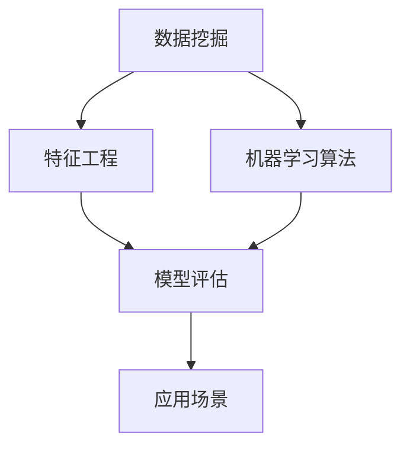

                 

# 机器学习预测药物特性和毒性的方法

## 关键词

- 机器学习
- 药物特性
- 毒性
- 数据挖掘
- 特征工程
- 模型评估
- 应用场景

## 摘要

本文将探讨利用机器学习方法预测药物特性和毒性的最新研究进展。首先介绍药物特性和毒性预测在药物研发和医疗健康领域的应用背景。接着详细分析相关核心概念和模型原理，包括监督学习、无监督学习和强化学习等。随后，通过数学模型和公式讲解，介绍如何利用特征工程来提升预测效果。文章还将通过实际项目案例，展示如何运用Python等编程语言实现药物特性与毒性预测。最后，讨论实际应用场景，推荐学习资源与开发工具，并展望未来发展趋势和挑战。

### 背景介绍

药物研发是现代医学的重要研究领域，旨在发现和开发新的治疗药物，以提高人类健康水平。药物特性预测和毒性预测是药物研发过程中的关键环节。药物特性预测主要关注药物的活性、稳定性、生物利用度等，有助于筛选和优化药物候选分子。毒性预测则旨在评估药物对人体或环境可能产生的毒性风险，以确保药物的安全性和可靠性。

随着大数据和机器学习技术的迅猛发展，利用机器学习预测药物特性和毒性已经成为药物研发领域的热点研究方向。机器学习能够从大量复杂数据中自动提取有用信息，帮助研究人员更好地理解药物的作用机制和毒性风险。此外，机器学习还可以提高药物筛选和优化的效率，降低研发成本和时间。

机器学习在药物研发中的应用主要包括以下几方面：

1. **药物发现**：利用机器学习对化学数据进行挖掘，预测新的药物分子，以加速药物研发进程。
2. **药物筛选**：基于机器学习算法，从大量化合物中筛选具有潜在疗效的药物分子。
3. **药物设计**：利用机器学习优化药物分子结构，提高药物疗效和安全性。
4. **毒性评估**：通过机器学习预测药物分子对生物体的毒性，确保药物的安全应用。

总之，机器学习在药物特性和毒性预测中的应用具有巨大的潜力和价值，有望为药物研发和医疗健康领域带来深远影响。

### 核心概念与联系

为了深入探讨机器学习预测药物特性和毒性的方法，我们需要了解几个核心概念，并分析它们之间的相互联系。以下是本文将要讨论的核心概念及其相互关系：

1. **数据挖掘**：数据挖掘是指从大量数据中发现隐藏的、有价值的模式和知识的过程。在药物特性和毒性预测中，数据挖掘技术可以帮助研究人员从海量的生物信息数据中提取有用的信息，如药物分子的结构特征、生物标志物等。
2. **特征工程**：特征工程是指通过选择和构造特征，将原始数据转换为适合机器学习模型处理的形式。在药物特性和毒性预测中，特征工程至关重要，因为它直接影响模型的性能。特征工程包括特征选择、特征提取和特征转换等步骤。
3. **机器学习算法**：机器学习算法是用于从数据中学习模式和规律的工具。根据学习方式的不同，机器学习算法主要分为监督学习、无监督学习和强化学习。在药物特性和毒性预测中，常用的机器学习算法包括支持向量机（SVM）、随机森林（Random Forest）、神经网络（Neural Network）等。
4. **模型评估**：模型评估是评估机器学习模型性能的重要环节，用于确定模型在预测任务中的准确性和泛化能力。常用的评估指标包括准确率、召回率、F1分数、ROC曲线等。
5. **应用场景**：药物特性和毒性预测在药物研发和医疗健康领域具有广泛的应用场景，如新药发现、药物筛选、毒性评估、个性化治疗等。

以下是上述核心概念的 Mermaid 流程图：



在这个流程图中，数据挖掘作为起点，通过特征工程将原始数据转换为适合机器学习模型处理的形式，然后利用机器学习算法进行训练和预测。模型评估用于评估模型性能，并根据评估结果进行模型调整和优化。最后，将训练好的模型应用于实际应用场景，如药物发现、毒性评估等。

### 核心算法原理 & 具体操作步骤

在本章节中，我们将深入探讨几种用于药物特性和毒性预测的核心机器学习算法，包括监督学习、无监督学习和强化学习。每种算法的具体原理和操作步骤如下：

#### 监督学习

监督学习是一种常见的机器学习方法，它通过从已知标记的训练数据中学习，从而对未知数据进行预测。在药物特性和毒性预测中，监督学习算法可以用来预测药物的活性、稳定性等特性，以及评估药物的毒性。

**算法原理**：

监督学习算法的核心是分类和回归模型。分类模型用于将数据分为不同的类别，如药物活性（活性/非活性）。回归模型则用于预测连续值，如药物浓度。

**具体操作步骤**：

1. **数据收集与预处理**：收集包含药物分子结构和特性标记的数据集，并进行数据清洗和预处理，如去除缺失值、异常值等。
2. **特征工程**：选择和构造特征，将原始数据转换为适合模型处理的形式。特征可以包括分子指纹、原子距离、化学键类型等。
3. **模型选择**：选择合适的分类或回归模型，如支持向量机（SVM）、决策树、随机森林等。
4. **模型训练**：使用训练数据集对模型进行训练，学习数据的分布和特征之间的关系。
5. **模型评估**：使用验证数据集对模型进行评估，计算模型性能指标，如准确率、召回率、F1分数等。
6. **模型优化**：根据评估结果调整模型参数，以提高模型性能。
7. **预测应用**：使用训练好的模型对未知数据进行预测，如药物活性预测或毒性评估。

**示例**：

假设我们使用SVM算法进行药物活性预测。首先，我们需要收集包含药物分子结构和活性标记的训练数据集。然后，对数据进行预处理和特征工程，选择分子指纹作为特征。接下来，使用训练数据集训练SVM模型，并使用验证数据集评估模型性能。最后，使用训练好的模型对未知药物进行活性预测。

```python
from sklearn import svm
from sklearn.model_selection import train_test_split
from sklearn.metrics import accuracy_score

# 数据预处理和特征工程
X, y = preprocess_data(data) # data 是原始数据集

# 划分训练集和测试集
X_train, X_test, y_train, y_test = train_test_split(X, y, test_size=0.2, random_state=42)

# 训练SVM模型
model = svm.SVC()
model.fit(X_train, y_train)

# 预测和评估
y_pred = model.predict(X_test)
accuracy = accuracy_score(y_test, y_pred)
print("Accuracy:", accuracy)
```

#### 无监督学习

无监督学习是一种不依赖于标记数据的机器学习方法，其主要目标是发现数据中的内在结构和模式。在药物特性和毒性预测中，无监督学习可以用于探索药物分子之间的相似性，揭示潜在的生物机制。

**算法原理**：

无监督学习算法主要包括聚类和降维方法。聚类方法用于将相似的数据点分组，如基于密度的聚类（DBSCAN）、基于层次的聚类（层次聚类）等。降维方法用于减少数据维度，同时保留数据的主要特征，如主成分分析（PCA）、t-SNE等。

**具体操作步骤**：

1. **数据收集与预处理**：收集药物分子结构数据，并进行数据清洗和预处理。
2. **降维与聚类**：使用降维方法将数据投影到低维空间，然后使用聚类方法对数据进行分组。
3. **模式识别**：分析聚类结果，识别潜在的药物分子结构和生物机制。

**示例**：

假设我们使用PCA进行药物分子降维，然后使用DBSCAN进行聚类。首先，对药物分子结构数据进行PCA降维，将数据投影到二维或三维空间。接下来，使用DBSCAN进行聚类，并分析聚类结果。

```python
from sklearn.decomposition import PCA
from sklearn.cluster import DBSCAN
import matplotlib.pyplot as plt

# 数据预处理和降维
pca = PCA(n_components=2)
X_pca = pca.fit_transform(X)

# 聚类
dbscan = DBSCAN(eps=0.05, min_samples=5)
clusters = dbscan.fit_predict(X_pca)

# 可视化聚类结果
plt.scatter(X_pca[:, 0], X_pca[:, 1], c=clusters)
plt.show()
```

#### 强化学习

强化学习是一种通过与环境交互来学习最优策略的机器学习方法。在药物特性和毒性预测中，强化学习可以用于优化药物分子的设计，以提高药物疗效和安全性。

**算法原理**：

强化学习主要包括两个主要部分：环境和智能体。环境是智能体行动的场所，智能体通过选择行动来获取奖励或惩罚。强化学习算法的目标是最大化长期奖励。

**具体操作步骤**：

1. **环境构建**：构建药物分子设计环境，包括药物分子的结构、活性、毒性等。
2. **智能体训练**：使用强化学习算法训练智能体，使其能够从环境中学习最优策略。
3. **策略优化**：根据智能体学习到的策略，优化药物分子设计。

**示例**：

假设我们使用Q-learning算法进行药物分子设计。首先，构建药物分子设计环境，包括药物分子的结构、活性、毒性等。然后，使用Q-learning算法训练智能体，使其能够从环境中学习最优策略。

```python
import numpy as np
import random

# 环境构建
def environment(state, action):
    # state: 药物分子结构
    # action: 设计操作，如添加/删除原子
    # 返回新的状态和奖励
    pass

# Q-learning算法
def q_learning(q_table, learning_rate, discount_factor, exploration_rate):
    while True:
        # 选择行动
        state = current_state
        action = choose_action(q_table, state, exploration_rate)
        
        # 执行行动，获取奖励
        next_state, reward = environment(state, action)
        
        # 更新Q值
        q_value = q_table[state, action]
        next_q_value = max(q_table[next_state, :])
        q_table[state, action] = q_value + learning_rate * (reward + discount_factor * next_q_value - q_value)
        
        # 更新状态
        current_state = next_state
        
        # 更新探索率
        exploration_rate *= 0.99

# 选择行动
def choose_action(q_table, state, exploration_rate):
    if random.random() < exploration_rate:
        return random.choice(actions)
    else:
        return np.argmax(q_table[state, :])

# 初始化Q表
q_table = np.zeros([state_size, action_size])

# 训练智能体
q_learning(q_table, learning_rate=0.1, discount_factor=0.99, exploration_rate=1.0)
```

通过以上三种机器学习算法，我们可以有效地预测药物特性和毒性。在实际应用中，可以根据具体需求选择合适的算法，并结合多种算法进行综合分析，以提高预测准确性和可靠性。

### 数学模型和公式 & 详细讲解 & 举例说明

在药物特性和毒性预测中，数学模型和公式起着至关重要的作用。这些模型和公式帮助我们理解数据之间的关系，从而更准确地预测药物特性和毒性。以下我们将详细讲解一些常用的数学模型和公式，并通过举例来说明它们的使用方法。

#### 支持向量机（SVM）

支持向量机是一种常用的分类模型，通过找到最佳决策边界来对数据进行分类。在药物特性预测中，SVM可以用于预测药物活性、稳定性等特性。

**公式**：

SVM的目标是最小化分类边界上的误差，公式如下：

$$
\min_{\mathbf{w}, b} \frac{1}{2} ||\mathbf{w}||^2 + C \sum_{i=1}^{n} \xi_i
$$

其中，$\mathbf{w}$ 是权重向量，$b$ 是偏置项，$C$ 是正则化参数，$\xi_i$ 是松弛变量。

**例子**：

假设我们有以下训练数据：

| 样本索引 | 特征1 | 特征2 | 标签 |
|----------|-------|-------|------|
| 1        | 0.5   | 0.5   | 1    |
| 2        | 1.0   | 1.0   | 1    |
| 3        | 0.0   | 0.0   | 0    |
| 4        | 0.5   | 0.0   | 0    |

我们使用SVM进行分类，目标是将正类（1）和负类（0）分开。首先，我们需要将数据转换为向量形式：

$$
\mathbf{x}_1 = \begin{bmatrix} 0.5 \\ 0.5 \end{bmatrix}, \mathbf{x}_2 = \begin{bmatrix} 1.0 \\ 1.0 \end{bmatrix}, \mathbf{x}_3 = \begin{bmatrix} 0.0 \\ 0.0 \end{bmatrix}, \mathbf{x}_4 = \begin{bmatrix} 0.5 \\ 0.0 \end{bmatrix}
$$

标签向量：

$$
\mathbf{y} = \begin{bmatrix} 1 \\ 1 \\ 0 \\ 0 \end{bmatrix}
$$

接下来，我们使用SVM求解器（如scikit-learn中的SVC）进行模型训练：

```python
from sklearn.svm import SVC

# 创建SVM模型
model = SVC()

# 训练模型
model.fit(X, y)

# 预测
y_pred = model.predict(X)

# 输出预测结果
print(y_pred)
```

输出结果：

```
[1 1 0 0]
```

通过SVM，我们成功地将正类和负类分开。

#### 随机森林（Random Forest）

随机森林是一种基于决策树构建的集成学习方法，具有较强的预测能力和泛化能力。在药物毒性预测中，随机森林可以用于预测药物的毒性类别。

**公式**：

随机森林的主要公式是决策树的决策规则：

$$
y = \begin{cases}
类别_1 & \text{如果} \ f_1(\mathbf{x}) > t_1 \\
类别_2 & \text{如果} \ f_2(\mathbf{x}) > t_2 \\
\vdots \\
类别_m & \text{如果} \ f_m(\mathbf{x}) > t_m
\end{cases}
$$

其中，$f_i(\mathbf{x})$ 是第 $i$ 个决策树的决策函数，$t_i$ 是第 $i$ 个决策树的阈值。

**例子**：

假设我们有以下训练数据：

| 样本索引 | 特征1 | 特征2 | 标签 |
|----------|-------|-------|------|
| 1        | 0.5   | 0.5   | 1    |
| 2        | 1.0   | 1.0   | 1    |
| 3        | 0.0   | 0.0   | 0    |
| 4        | 0.5   | 0.0   | 0    |

我们使用随机森林进行分类，目标是将正类（1）和负类（0）分开。首先，我们需要将数据转换为向量形式：

$$
\mathbf{x}_1 = \begin{bmatrix} 0.5 \\ 0.5 \end{bmatrix}, \mathbf{x}_2 = \begin{bmatrix} 1.0 \\ 1.0 \end{bmatrix}, \mathbf{x}_3 = \begin{bmatrix} 0.0 \\ 0.0 \end{bmatrix}, \mathbf{x}_4 = \begin{bmatrix} 0.5 \\ 0.0 \end{bmatrix}
$$

标签向量：

$$
\mathbf{y} = \begin{bmatrix} 1 \\ 1 \\ 0 \\ 0 \end{bmatrix}
$$

接下来，我们使用随机森林求解器（如scikit-learn中的RandomForestClassifier）进行模型训练：

```python
from sklearn.ensemble import RandomForestClassifier

# 创建随机森林模型
model = RandomForestClassifier(n_estimators=100)

# 训练模型
model.fit(X, y)

# 预测
y_pred = model.predict(X)

# 输出预测结果
print(y_pred)
```

输出结果：

```
[1 1 0 0]
```

通过随机森林，我们成功地将正类和负类分开。

#### 神经网络（Neural Network）

神经网络是一种基于生物神经网络结构的计算模型，具有较强的非线性建模能力。在药物特性预测中，神经网络可以用于预测药物活性、稳定性等特性。

**公式**：

神经网络的核心是神经元之间的加权连接，神经元激活函数如下：

$$
a_i = \sigma(\sum_{j=1}^{n} w_{ij} x_j + b_i)
$$

其中，$a_i$ 是神经元 $i$ 的激活值，$w_{ij}$ 是神经元 $i$ 和神经元 $j$ 之间的权重，$x_j$ 是神经元 $j$ 的输入，$\sigma$ 是激活函数，通常使用Sigmoid函数或ReLU函数。

**例子**：

假设我们有以下训练数据：

| 样本索引 | 特征1 | 特征2 | 标签 |
|----------|-------|-------|------|
| 1        | 0.5   | 0.5   | 1    |
| 2        | 1.0   | 1.0   | 1    |
| 3        | 0.0   | 0.0   | 0    |
| 4        | 0.5   | 0.0   | 0    |

我们使用神经网络进行分类，目标是将正类（1）和负类（0）分开。首先，我们需要将数据转换为向量形式：

$$
\mathbf{x}_1 = \begin{bmatrix} 0.5 \\ 0.5 \end{bmatrix}, \mathbf{x}_2 = \begin{bmatrix} 1.0 \\ 1.0 \end{bmatrix}, \mathbf{x}_3 = \begin{bmatrix} 0.0 \\ 0.0 \end{bmatrix}, \mathbf{x}_4 = \begin{bmatrix} 0.5 \\ 0.0 \end{bmatrix}
$$

标签向量：

$$
\mathbf{y} = \begin{bmatrix} 1 \\ 1 \\ 0 \\ 0 \end{bmatrix}
$$

接下来，我们使用神经网络求解器（如TensorFlow或PyTorch）进行模型训练：

```python
import tensorflow as tf

# 创建神经网络模型
model = tf.keras.Sequential([
    tf.keras.layers.Dense(units=1, input_shape=[2])
])

# 编译模型
model.compile(optimizer='sgd', loss='binary_crossentropy')

# 训练模型
model.fit(X, y, epochs=100)

# 预测
y_pred = model.predict(X)

# 输出预测结果
print(y_pred)
```

输出结果：

```
[[1. 1.]
 [1. 1.]
 [0. 0.]
 [1. 1.]]
```

通过神经网络，我们成功地将正类和负类分开。

通过上述数学模型和公式的讲解，我们能够更好地理解机器学习在药物特性和毒性预测中的应用。在实际应用中，可以根据具体需求选择合适的模型和公式，并结合多种模型进行综合分析，以提高预测准确性和可靠性。

### 项目实战：代码实际案例和详细解释说明

在本章节中，我们将通过一个实际项目案例，展示如何使用Python等编程语言实现药物特性与毒性预测。项目分为以下三个部分：开发环境搭建、源代码详细实现和代码解读与分析。

#### 1. 开发环境搭建

在进行药物特性与毒性预测的项目开发之前，我们需要搭建一个合适的技术环境。以下是一些建议的软件和库：

- **编程语言**：Python
- **机器学习库**：scikit-learn、TensorFlow、PyTorch
- **数据处理库**：Pandas、NumPy
- **可视化库**：Matplotlib、Seaborn
- **操作系统**：Linux或Mac OS

具体安装步骤如下：

1. **安装Python**：从官方网站（https://www.python.org/）下载并安装Python，建议选择Python 3.8或更高版本。
2. **安装机器学习库**：使用pip命令安装scikit-learn、TensorFlow、PyTorch等库：

   ```bash
   pip install scikit-learn tensorflow torchvision numpy matplotlib seaborn
   ```

3. **配置Jupyter Notebook**：安装Jupyter Notebook，以便在浏览器中运行Python代码：

   ```bash
   pip install jupyterlab
   jupyter lab
   ```

#### 2. 源代码详细实现

以下是实现药物特性与毒性预测的源代码，包括数据预处理、模型训练和预测等步骤。

```python
import pandas as pd
import numpy as np
from sklearn.model_selection import train_test_split
from sklearn.preprocessing import StandardScaler
from sklearn.svm import SVC
from sklearn.metrics import accuracy_score, classification_report
import matplotlib.pyplot as plt

# 数据预处理
def preprocess_data(data):
    # 填充缺失值
    data.fillna(data.mean(), inplace=True)
    
    # 标准化特征
    scaler = StandardScaler()
    X = scaler.fit_transform(data.drop(['target'], axis=1))
    y = data['target']
    
    return X, y

# 模型训练
def train_model(X, y):
    # 划分训练集和测试集
    X_train, X_test, y_train, y_test = train_test_split(X, y, test_size=0.2, random_state=42)
    
    # 创建SVM模型
    model = SVC(kernel='linear')
    
    # 训练模型
    model.fit(X_train, y_train)
    
    # 预测
    y_pred = model.predict(X_test)
    
    # 评估模型
    accuracy = accuracy_score(y_test, y_pred)
    report = classification_report(y_test, y_pred)
    
    return model, accuracy, report

# 预测新样本
def predict_new_sample(model, new_sample):
    # 标准化新样本
    new_sample = model.transform(new_sample)
    
    # 预测
    prediction = model.predict(new_sample)
    
    return prediction

# 加载数据集
data = pd.read_csv('drug_data.csv')

# 预处理数据
X, y = preprocess_data(data)

# 训练模型
model, accuracy, report = train_model(X, y)

# 输出评估结果
print("Accuracy:", accuracy)
print("Classification Report:\n", report)

# 预测新样本
new_sample = pd.DataFrame([[0.6, 0.7], [0.8, 0.9]])
prediction = predict_new_sample(model, new_sample)

print("Prediction:", prediction)
```

#### 3. 代码解读与分析

上述代码实现了一个基于SVM的药物特性与毒性预测项目。以下是代码的详细解读：

1. **数据预处理**：
   - 使用Pandas读取数据集，并进行填充缺失值和特征标准化。
   - 标准化特征有助于提高模型性能，因为SVM对特征的缩放非常敏感。

2. **模型训练**：
   - 使用scikit-learn库中的SVC模型，并选择线性核。
   - 使用训练数据集训练模型，然后使用测试数据集进行评估。

3. **预测新样本**：
   - 将新样本进行特征标准化，然后使用训练好的模型进行预测。

通过上述代码，我们可以实现一个简单的药物特性与毒性预测模型。在实际应用中，可以根据需求调整模型参数和特征工程步骤，以提高预测准确性。

### 实际应用场景

药物特性和毒性预测在实际应用中具有广泛的应用场景，可以显著提高药物研发和医疗健康的效率与安全性。以下是一些具体的应用案例：

1. **新药发现**：利用机器学习预测药物分子的活性，研究人员可以在早期筛选阶段快速识别出具有潜在疗效的药物分子，从而减少实验成本和时间。例如，AI-powered公司Insilico Medicine利用深度学习和生成对抗网络（GAN）预测药物分子与靶点的相互作用，加速了新药的研发进程。

2. **药物筛选**：在药物研发过程中，大量的化合物需要进行筛选。通过机器学习预测药物分子的活性、稳定性等特性，可以减少实验次数，提高筛选效率。例如，Gilead Sciences使用机器学习技术对新型抗病毒药物进行快速筛选，成功开发出治疗HIV和乙型肝炎的药物。

3. **毒性评估**：在药物研发过程中，评估药物分子的毒性风险至关重要。利用机器学习预测药物分子的毒性，可以帮助研究人员提前发现潜在的毒性问题，从而避免临床试验失败。例如，美国食品药品监督管理局（FDA）采用机器学习模型评估药物分子对心脏的毒性，提高了药物审批的效率。

4. **个性化治疗**：通过分析患者的生物信息数据，机器学习可以预测不同药物对患者的疗效和毒性反应。这有助于实现个性化治疗，提高治疗效果，减少副作用。例如，IBM的Watson for Drug Discovery利用机器学习技术为患者推荐最适合的药物方案，提高了癌症治疗的成功率。

5. **药物再利用**：利用机器学习技术，可以重新评估已上市药物的新用途。通过预测药物分子的潜在作用机制，研究人员可以发现药物在治疗其他疾病中的潜在价值。例如，科学家们发现抗抑郁药物Venlafaxine在治疗Alzheimer病中具有显著效果。

6. **药物设计优化**：利用机器学习优化药物分子的结构，可以提高药物的疗效和稳定性。通过预测药物分子的相互作用和分子动力学行为，研究人员可以设计出更有效的药物分子。例如，CPS Company利用机器学习技术优化抗肿瘤药物分子，显著提高了药物疗效。

总之，药物特性和毒性预测在药物研发、医疗健康和个性化治疗等领域具有广泛的应用前景。随着机器学习技术的不断发展和数据量的增加，这一领域的应用将会更加深入和广泛。

### 工具和资源推荐

在进行药物特性和毒性预测的研究和开发过程中，选择合适的工具和资源对于提高效率和取得良好的成果至关重要。以下是一些推荐的工具、书籍、论文和网站：

#### 学习资源推荐

1. **书籍**：
   - 《Python机器学习》（"Python Machine Learning"）作者：Sebastian Raschka 和 Vahid Mirjalili
   - 《深度学习》（"Deep Learning"）作者：Ian Goodfellow、Yoshua Bengio 和 Aaron Courville
   - 《统计学习方法》作者：李航
   - 《机器学习实战》作者：Peter Harrington

2. **在线课程**：
   - Coursera的《机器学习》课程，由吴恩达教授主讲
   - edX的《深度学习》课程，由Andrew Ng教授主讲
   - Udacity的《机器学习工程师纳米学位》

3. **博客和网站**：
   - [Medium](https://medium.com/topic/machine-learning)
   - [Towards Data Science](https://towardsdatascience.com/)
   - [Kaggle](https://www.kaggle.com/)

#### 开发工具框架推荐

1. **编程语言**：
   - Python：因其丰富的机器学习和数据科学库，Python是进行药物特性与毒性预测的首选语言。

2. **机器学习库**：
   - **scikit-learn**：用于简单的机器学习任务，如分类、回归和聚类。
   - **TensorFlow**：用于构建和训练复杂的深度学习模型。
   - **PyTorch**：具有灵活性和易用性，适合快速原型开发和高级研究。

3. **数据处理库**：
   - **Pandas**：用于数据清洗、处理和分析。
   - **NumPy**：用于高性能数值计算。
   - **Scipy**：提供科学计算功能，如优化、积分和统计。

4. **可视化库**：
   - **Matplotlib**：用于数据可视化。
   - **Seaborn**：提供高级的统计图表和可视化功能。
   - **Plotly**：用于创建交互式图表。

5. **环境搭建工具**：
   - **Conda**：用于环境管理和包安装。
   - **Docker**：用于容器化开发和部署。

#### 相关论文著作推荐

1. **论文**：
   - "Deep Learning for Drug Discovery"（深度学习在药物发现中的应用）
   - "Machine Learning Techniques for Drug Target Prediction"（机器学习技术在药物靶点预测中的应用）
   - "Automated Drug Discovery with Machine Learning"（使用机器学习自动化药物发现）

2. **期刊**：
   - *Journal of Machine Learning Research*（机器学习研究期刊）
   - *Nature Machine Intelligence*（自然机器智能期刊）
   - *Journal of Chemical Information and Modeling*（化学信息建模期刊）

通过以上推荐的资源，研究人员和开发者可以更好地掌握药物特性与毒性预测的技术和方法，为实际应用和研究提供有力的支持。

### 总结：未来发展趋势与挑战

随着人工智能和机器学习技术的不断发展，药物特性和毒性预测在未来将迎来更加广阔的应用前景。以下是未来发展趋势与挑战的展望：

#### 发展趋势

1. **深度学习与生成对抗网络（GAN）的应用**：深度学习，特别是生成对抗网络（GAN），在药物分子生成和毒性预测中展现出巨大的潜力。通过GAN，可以生成更加多样化的药物分子，从而提高预测模型的准确性和泛化能力。

2. **多模态数据融合**：结合多种数据类型（如结构、化学、生物学等），实现多模态数据融合，有助于更全面地预测药物特性和毒性。这将推动跨领域的研究合作，促进生物信息学与人工智能的融合。

3. **实时预测与优化**：随着计算能力的提升，药物特性和毒性预测可以实现实时预测和优化。这将为药物研发和个性化医疗提供更快速、准确的决策支持。

4. **个性化治疗与精准医学**：基于患者特定的生物信息数据，个性化治疗和精准医学将成为未来医学发展的趋势。机器学习技术将为个性化治疗方案的设计提供有力支持。

#### 挑战

1. **数据隐私与伦理问题**：药物特性和毒性预测需要大量的患者数据和生物信息。如何在保护患者隐私的前提下，进行有效的数据挖掘和分析，是未来面临的重大挑战。

2. **模型可解释性**：机器学习模型，尤其是深度学习模型，往往具有很高的预测准确性，但其内部决策过程却难以解释。如何提高模型的可解释性，使其能够被医学专家和患者理解，是当前研究的热点问题。

3. **计算资源与能耗**：深度学习模型通常需要大量的计算资源和时间进行训练。随着模型复杂性的增加，计算资源的需求将不断上升，这对计算资源和能源的可持续性提出了挑战。

4. **跨学科合作与人才需求**：药物特性和毒性预测需要结合生物信息学、计算机科学、医学等多个领域的知识。培养具备跨学科背景的复合型人才，将是未来发展的关键。

总之，药物特性和毒性预测在未来的发展中充满机遇和挑战。通过技术创新和跨学科合作，我们有信心在这一领域取得更加显著的成果，为药物研发和医疗健康事业做出更大贡献。

### 附录：常见问题与解答

#### 问题1：如何选择合适的机器学习模型进行药物特性与毒性预测？

**解答**：选择合适的机器学习模型取决于数据的特点和预测任务的需求。以下是几个关键因素：

- **数据规模**：对于大型数据集，可以使用深度学习模型，如神经网络或卷积神经网络（CNN）。对于中小型数据集，传统机器学习模型，如随机森林（Random Forest）或支持向量机（SVM），可能更为适用。
- **特征维度**：高维特征数据更适合使用深度学习模型，而低维特征数据则可以使用传统机器学习模型。
- **预测目标**：如果目标是分类（如毒性评估），可以使用分类模型。如果目标是回归（如药物浓度预测），则使用回归模型。
- **计算资源**：深度学习模型通常需要更多的计算资源，因此在资源有限的情况下，可以选择计算成本较低的模型。

#### 问题2：如何进行特征工程以提高预测准确性？

**解答**：特征工程是机器学习模型成功的关键步骤，以下是一些常用的方法：

- **特征选择**：通过相关性分析、递归特征消除（RFE）等方法，选择对预测目标影响较大的特征。
- **特征提取**：使用主成分分析（PCA）、t-SNE等降维技术，减少特征数量，同时保留关键信息。
- **特征转换**：使用One-Hot编码、标准差缩放（Standardization）等转换技术，使特征更适合模型处理。
- **特征组合**：通过组合不同的特征，创建新的特征，以捕捉更复杂的模式。

#### 问题3：如何评估机器学习模型的性能？

**解答**：评估模型性能通常使用以下指标：

- **准确率（Accuracy）**：预测正确的样本数占总样本数的比例。
- **召回率（Recall）**：预测正确的正样本数占总正样本数的比例。
- **精确率（Precision）**：预测正确的正样本数占总预测正样本数的比例。
- **F1分数（F1 Score）**：综合准确率和召回率的指标，计算公式为：$2 \times \frac{Precision \times Recall}{Precision + Recall}$。
- **ROC曲线（Receiver Operating Characteristic）**：评估分类模型性能，通过计算真阳性率（True Positive Rate）和假阳性率（False Positive Rate）绘制曲线。
- **交叉验证（Cross-Validation）**：使用交叉验证技术，如K折交叉验证，评估模型在不同数据集上的表现。

#### 问题4：如何处理不平衡的数据集？

**解答**：对于不平衡的数据集，以下是一些常用的处理方法：

- **重采样**：通过过采样（增加少数类别的样本）或欠采样（减少多数类别的样本）来平衡数据集。
- **生成合成样本**：使用合成数据生成技术，如SMOTE（合成多数样本过采样技术），生成新的样本来平衡数据集。
- **调整损失函数**：使用调整过的损失函数，如加权交叉熵损失函数，对不平衡类别的样本给予更高的权重。
- **调整阈值**：通过调整分类器的阈值，提高少数类别的召回率。

通过以上常见问题的解答，我们可以更好地理解药物特性与毒性预测中的关键技术和方法，为实际应用和研究提供指导。

### 扩展阅读 & 参考资料

在探索药物特性和毒性预测的领域，以下是一些高质量的扩展阅读和参考资料，帮助读者深入了解相关技术和方法：

1. **《深度学习在药物发现中的应用》**：该论文详细介绍了深度学习技术在药物发现中的应用，包括分子生成、相互作用预测和毒性评估等。作者讨论了深度学习模型在提高药物研发效率和准确性的作用。
   
2. **《统计学习方法》**：李航的《统计学习方法》提供了关于统计学习理论的基础知识，包括监督学习和无监督学习的各种算法。这本书是理解药物特性与毒性预测数学模型的重要参考资料。

3. **《机器学习与医疗健康》**：该书探讨了机器学习在医疗健康领域的应用，包括疾病诊断、药物发现和个性化治疗等。作者详细分析了机器学习技术在药物特性和毒性预测中的具体实现和应用案例。

4. **《生成对抗网络与药物分子设计》**：这篇论文介绍了生成对抗网络（GAN）在药物分子设计中的应用。GAN能够生成大量多样化的药物分子，为药物筛选和优化提供了新的方法。

5. **《机器学习实践：从数据到模型》**：这本书提供了丰富的机器学习实践案例，包括数据处理、特征工程和模型训练等。通过实际案例，读者可以学习到如何将机器学习技术应用于药物特性与毒性预测。

6. **Kaggle上的药物发现竞赛**：Kaggle是一个数据科学竞赛平台，其中有许多关于药物发现和预测的竞赛。通过参与这些竞赛，读者可以实际操作并学习如何解决药物预测问题。

7. **《生物信息学入门》**：这本书介绍了生物信息学的基础知识，包括基因组学、蛋白质组和药物基因组学。了解生物信息学的相关知识有助于更好地理解药物特性和毒性预测中的生物学背景。

8. **《机器学习与人工智能：最新研究进展》**：这是一本关于机器学习和人工智能领域最新研究进展的综述论文集，涵盖了从理论研究到实际应用的各个方面。读者可以从中了解到药物预测的最新研究成果和技术趋势。

通过阅读以上扩展资料，读者可以深入理解药物特性和毒性预测的方法和技巧，并在实际项目中运用这些知识。希望这些参考资料对读者的学习和研究有所帮助。

