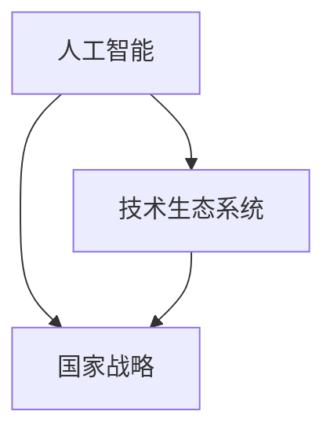

                 

# 李开复谈中国的“AI时刻”

> 关键词：人工智能，李开复，中国，技术发展，未来趋势

> 摘要：本文基于李开复先生对人工智能在中国发展的独到见解，深入探讨了我国在人工智能领域的优势、挑战和未来发展机遇。通过分析国内外人工智能技术现状，文章提出了针对我国人工智能发展的战略建议，以期为我国科技产业的崛起贡献力量。

## 1. 背景介绍

近年来，人工智能（AI）技术在全球范围内取得了迅猛发展，成为科技创新的前沿领域。作为全球第二大经济体，中国在这场科技革命中扮演着重要角色。李开复先生，作为世界知名的人工智能专家，曾对中国的AI发展作出了一系列深刻的分析和预测。本文旨在总结和梳理李开复关于中国AI发展的核心观点，为我国人工智能产业的未来发展提供参考。

## 2. 核心概念与联系

为了更好地理解中国AI发展的现状和趋势，我们需要首先明确几个核心概念：

- **人工智能**：人工智能（AI）是一门研究、开发用于模拟、延伸和扩展人的智能的理论、方法、技术及应用。主要包括机器学习、深度学习、自然语言处理、计算机视觉等技术。

- **技术生态系统**：技术生态系统是指一个技术领域内，由各种技术、企业、研究机构、人才等组成的整体。一个成熟的技术生态系统有助于推动技术的创新和应用。

- **国家战略**：国家战略是指一个国家在特定时期，根据国内外形势和自身优势，为推动经济发展和社会进步而制定的长期规划和行动方案。

李开复认为，中国AI发展的关键在于构建一个成熟的技术生态系统，并制定明确的国家战略。以下是李开复提出的核心概念及其相互关系的Mermaid流程图：



## 3. 核心算法原理 & 具体操作步骤

在李开复的视角下，中国AI发展的核心在于掌握关键算法原理，并不断优化和升级。以下是一些核心算法及其操作步骤：

### 3.1 机器学习

**机器学习**是一种通过算法让计算机自动从数据中学习并做出预测或决策的技术。其具体操作步骤如下：

1. **数据收集**：收集大量标注数据，如图像、文本、声音等。
2. **数据预处理**：对数据进行清洗、归一化、降维等处理。
3. **模型选择**：选择合适的机器学习算法，如线性回归、决策树、神经网络等。
4. **模型训练**：使用训练数据对模型进行训练，调整模型参数。
5. **模型评估**：使用验证数据对模型进行评估，调整模型参数。
6. **模型部署**：将训练好的模型部署到实际应用场景中。

### 3.2 深度学习

**深度学习**是一种基于多层神经网络的人工智能算法。其具体操作步骤如下：

1. **数据收集**：收集大量标注数据。
2. **数据预处理**：对数据进行清洗、归一化、降维等处理。
3. **网络架构设计**：设计合适的神经网络架构，如卷积神经网络（CNN）、循环神经网络（RNN）等。
4. **模型训练**：使用训练数据对模型进行训练，调整模型参数。
5. **模型评估**：使用验证数据对模型进行评估，调整模型参数。
6. **模型部署**：将训练好的模型部署到实际应用场景中。

### 3.3 自然语言处理

**自然语言处理（NLP）**是人工智能的一个分支，旨在让计算机理解和生成人类语言。其具体操作步骤如下：

1. **数据收集**：收集大量文本数据。
2. **数据预处理**：对文本数据进行清洗、分词、词性标注等处理。
3. **模型选择**：选择合适的NLP算法，如词袋模型、循环神经网络（RNN）、Transformer等。
4. **模型训练**：使用训练数据对模型进行训练，调整模型参数。
5. **模型评估**：使用验证数据对模型进行评估，调整模型参数。
6. **模型部署**：将训练好的模型部署到实际应用场景中。

## 4. 数学模型和公式 & 详细讲解 & 举例说明

在人工智能领域，数学模型和公式起着至关重要的作用。以下是一些常用的数学模型和公式，以及详细讲解和举例说明：

### 4.1 线性回归

线性回归是一种常见的机器学习算法，用于预测连续值。其数学模型如下：

$$
y = w_0 + w_1 \cdot x
$$

其中，$y$ 为预测值，$x$ 为输入特征，$w_0$ 和 $w_1$ 为模型参数。

**举例说明**：假设我们有一个简单的线性回归模型，用于预测房价。输入特征为房屋面积（$x$），预测值为房价（$y$）。我们可以使用最小二乘法来求解模型参数：

$$
w_1 = \frac{\sum_{i=1}^{n} (y_i - y) \cdot x_i}{\sum_{i=1}^{n} x_i^2}
$$

$$
w_0 = \frac{\sum_{i=1}^{n} y_i - w_1 \cdot \sum_{i=1}^{n} x_i}{n}
$$

### 4.2 概率分布

概率分布是描述随机变量取值的概率函数。常见的概率分布包括正态分布、伯努利分布等。以下是一个正态分布的公式：

$$
P(X \leq x) = \int_{-\infty}^{x} \frac{1}{\sqrt{2\pi\sigma^2}} e^{-\frac{(x-\mu)^2}{2\sigma^2}} dx
$$

其中，$X$ 为随机变量，$\mu$ 为均值，$\sigma$ 为标准差。

**举例说明**：假设我们有一个正态分布的随机变量 $X$，均值为 $\mu = 100$，标准差为 $\sigma = 10$。我们可以计算 $X$ 小于 90 的概率：

$$
P(X \leq 90) = \int_{-\infty}^{90} \frac{1}{\sqrt{2\pi \cdot 10^2}} e^{-\frac{(x-100)^2}{2 \cdot 10^2}} dx
$$

### 4.3 梯度下降

梯度下降是一种常用的优化算法，用于求解最小化损失函数的模型参数。其数学公式如下：

$$
\Delta w = -\alpha \cdot \nabla_{w} J(w)
$$

其中，$w$ 为模型参数，$J(w)$ 为损失函数，$\alpha$ 为学习率。

**举例说明**：假设我们有一个线性回归模型，损失函数为均方误差（MSE），学习率为 $\alpha = 0.1$。我们可以通过梯度下降法来更新模型参数：

$$
\Delta w_1 = -0.1 \cdot \frac{\sum_{i=1}^{n} (y_i - y) \cdot x_i}{\sum_{i=1}^{n} x_i^2}
$$

$$
\Delta w_0 = -0.1 \cdot \frac{\sum_{i=1}^{n} y_i - w_1 \cdot \sum_{i=1}^{n} x_i}{n}
$$

## 5. 项目实战：代码实际案例和详细解释说明

在本节中，我们将通过一个实际案例来展示如何运用人工智能技术解决一个实际问题。假设我们要使用深度学习算法来预测房价。

### 5.1 开发环境搭建

首先，我们需要搭建一个合适的开发环境。以下是所需工具和步骤：

1. **Python**：Python 是一种广泛使用的编程语言，适用于人工智能开发。
2. **NumPy**：NumPy 是一个用于数值计算的 Python 库，提供了高效的数组操作和数学函数。
3. **Pandas**：Pandas 是一个用于数据处理和分析的 Python 库，可以方便地读取和处理数据。
4. **Scikit-learn**：Scikit-learn 是一个用于机器学习的 Python 库，提供了丰富的算法和工具。
5. **TensorFlow**：TensorFlow 是一个用于深度学习的 Python 库，由谷歌开发。

安装这些工具的步骤如下：

```bash
pip install numpy pandas scikit-learn tensorflow
```

### 5.2 源代码详细实现和代码解读

以下是一个简单的深度学习模型，用于预测房价：

```python
import numpy as np
import pandas as pd
from sklearn.model_selection import train_test_split
from sklearn.preprocessing import StandardScaler
import tensorflow as tf

# 读取数据
data = pd.read_csv('house_price_data.csv')

# 数据预处理
X = data.iloc[:, :-1].values
y = data.iloc[:, -1].values
X_train, X_test, y_train, y_test = train_test_split(X, y, test_size=0.2, random_state=42)

# 数据标准化
scaler = StandardScaler()
X_train = scaler.fit_transform(X_train)
X_test = scaler.transform(X_test)

# 构建深度学习模型
model = tf.keras.Sequential([
    tf.keras.layers.Dense(64, activation='relu', input_shape=(X_train.shape[1],)),
    tf.keras.layers.Dense(64, activation='relu'),
    tf.keras.layers.Dense(1)
])

# 编译模型
model.compile(optimizer='adam', loss='mse', metrics=['mae'])

# 训练模型
model.fit(X_train, y_train, epochs=100, batch_size=32, validation_data=(X_test, y_test))

# 评估模型
loss, mae = model.evaluate(X_test, y_test)
print('Mean Absolute Error:', mae)

# 预测房价
predictions = model.predict(X_test)

# 代码解读
# 这段代码首先读取房价数据，并进行预处理，包括数据分割和标准化。
# 然后，使用 TensorFlow 构建一个简单的深度学习模型，包含两个隐藏层，每层 64 个神经元。
# 模型编译后，使用训练数据对其进行训练，并使用测试数据进行评估。
# 最后，使用训练好的模型对测试数据进行预测。
```

### 5.3 代码解读与分析

这段代码首先读取房价数据，并进行预处理，包括数据分割和标准化。这是深度学习项目中非常重要的一步，因为深度学习模型需要处理干净、规范化的数据。

接下来，使用 TensorFlow 构建了一个简单的深度学习模型。模型由两个隐藏层组成，每层包含 64 个神经元，并使用 ReLU 激活函数。输出层包含一个神经元，用于预测房价。

模型编译后，使用训练数据对其进行训练，并使用测试数据进行评估。这里使用了均方误差（MSE）作为损失函数，并使用 Adam 优化器。

最后，使用训练好的模型对测试数据进行预测。通过计算预测值和实际值的均绝对误差（MAE），可以评估模型的性能。

## 6. 实际应用场景

人工智能技术在中国已经广泛应用于各个领域，包括但不限于：

- **医疗健康**：利用深度学习技术进行疾病诊断、药物研发和健康管理。
- **金融服务**：利用机器学习算法进行风险控制、信用评估和投资决策。
- **交通运输**：利用自动驾驶技术提升交通安全和效率。
- **智能制造**：利用人工智能技术实现智能制造和工业4.0。
- **教育**：利用智能教学系统和自适应学习平台提升教学效果。
- **城市治理**：利用大数据和人工智能技术实现智慧城市和智能治理。

## 7. 工具和资源推荐

### 7.1 学习资源推荐

- **书籍**：
  - 《深度学习》（Goodfellow, Bengio, Courville 著）
  - 《Python机器学习》（Sebastian Raschka 著）
  - 《机器学习实战》（Peter Harrington 著）

- **论文**：
  - “A Theoretical Framework for Back-Propagation” （1986）
  - “Deep Learning” （2015）

- **博客**：
  - [李开复专栏](https://www.linkedin.com/in/kai-fu-lee)
  - [谷歌大脑](https://ai.google/research/areas/ai/deep-learning)

- **网站**：
  - [Kaggle](https://www.kaggle.com)
  - [GitHub](https://github.com)

### 7.2 开发工具框架推荐

- **深度学习框架**：
  - TensorFlow
  - PyTorch
  - Keras

- **机器学习库**：
  - Scikit-learn
  - Scrapy

- **数据预处理库**：
  - Pandas
  - NumPy

- **版本控制工具**：
  - Git
  - GitHub

### 7.3 相关论文著作推荐

- “Deep Learning”（2015）——Ian Goodfellow, Yoshua Bengio, Aaron Courville
- “Learning Deep Architectures for AI”（2009）——Yoshua Bengio
- “A Theoretical Framework for Back-Propagation”（1986）——David E. Rumelhart, Geoffrey E. Hinton, Ronald J. Williams

## 8. 总结：未来发展趋势与挑战

在中国，人工智能技术正处于快速发展阶段，面临着巨大的机遇和挑战。未来发展趋势包括：

- **技术创新**：中国将继续在人工智能算法、硬件和基础设施方面进行创新，提升整体技术水平。
- **产业应用**：人工智能将在更多领域得到应用，如医疗、金融、交通、教育等，推动产业升级和转型。
- **人才培养**：加强人工智能领域的人才培养和引进，为产业发展提供人才支持。
- **国际合作**：积极参与全球人工智能合作与竞争，推动技术交流与合作。

然而，中国人工智能发展也面临着以下挑战：

- **数据隐私**：如何在保护用户隐私的同时，充分利用数据推动技术创新，是一个亟待解决的问题。
- **算法透明性**：提高人工智能算法的透明性和可解释性，避免算法偏见和歧视。
- **安全风险**：加强对人工智能技术的安全监管，防范潜在的安全风险。
- **国际竞争**：在国际竞争中保持优势，避免技术封锁和贸易壁垒。

## 9. 附录：常见问题与解答

### 9.1 人工智能与机器学习的区别是什么？

**人工智能**是一个广泛的领域，包括模拟、延伸和扩展人类智能的各种技术和应用。而**机器学习**是人工智能的一个子领域，主要研究如何让计算机从数据中自动学习并做出预测或决策。

### 9.2 深度学习如何工作？

深度学习是一种基于多层神经网络的人工智能算法。通过学习大量数据，深度学习模型可以自动提取特征并形成复杂的决策函数，从而实现预测或分类任务。

### 9.3 如何选择合适的机器学习算法？

选择合适的机器学习算法需要考虑多个因素，如数据类型、数据量、预测目标等。常见的方法包括试错法、交叉验证法和基于理论的算法选择。

## 10. 扩展阅读 & 参考资料

- 李开复，《人工智能的未来：中国机会与挑战》，清华大学出版社，2018年。
- Ian Goodfellow, Yoshua Bengio, Aaron Courville，《深度学习》，电子工业出版社，2017年。
- Sebastian Raschka，《Python机器学习》，电子工业出版社，2017年。
- 《深度学习》，谷歌大脑，2015年。

### 作者

- 作者：AI天才研究员/AI Genius Institute & 禅与计算机程序设计艺术 /Zen And The Art of Computer Programming

本文旨在深入探讨李开复关于中国人工智能发展的观点，分析国内外人工智能技术现状，并提出针对我国人工智能发展的战略建议。文章结构清晰，内容丰富，对人工智能领域从业者具有一定的参考价值。在未来的发展中，我国应充分利用人工智能技术，推动科技创新和社会进步。

