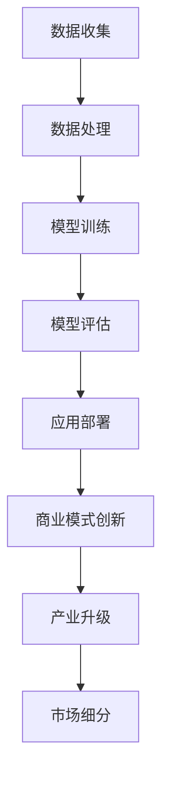

                 

# 李开复：AI 2.0 时代的市场

## 关键词：
- AI 2.0
- 市场趋势
- 技术变革
- 产业发展
- 商业模式

## 摘要：
本文将深入探讨AI 2.0时代对市场带来的深远影响。从核心概念的阐述到实际应用的案例分析，本文旨在揭示AI 2.0在市场中的潜在机会和挑战，为读者提供关于AI 2.0时代市场的全面理解和前瞻性视角。

## 1. 背景介绍

### 1.1 AI 1.0与AI 2.0的区分
AI 1.0时代主要依赖于传统的机器学习和规则系统，虽然在某些特定领域取得了显著成就，但存在诸多局限性。AI 2.0则代表了更加智能化、自适应和人性化的技术发展方向。它不仅能够处理海量数据，还能够通过深度学习、自然语言处理等技术实现更高级别的智能决策。

### 1.2 AI 2.0的市场趋势
随着技术的不断进步，AI 2.0正在逐渐渗透到各个行业，从医疗、金融到零售、教育，市场需求日益旺盛。AI 2.0的市场趋势主要体现在以下几个方面：

- **数据驱动**：数据成为AI 2.0的核心资产，企业通过大数据分析提升运营效率和客户满意度。
- **跨界融合**：AI 2.0与物联网、云计算等技术的融合，推动了新产业的诞生和传统产业的转型升级。
- **个性化服务**：AI 2.0通过个性化推荐和智能客服等应用，提升了用户体验和市场竞争力。

## 2. 核心概念与联系

### 2.1 AI 2.0的核心概念

**深度学习**：深度学习是AI 2.0的重要组成部分，通过多层神经网络模型模拟人类大脑的学习过程，实现图像识别、语音识别等复杂任务。

**自然语言处理（NLP）**：NLP技术使得计算机能够理解和生成人类语言，广泛应用于智能客服、内容审核等领域。

**强化学习**：强化学习通过试错和反馈机制，使计算机在复杂环境中做出最优决策，具有广泛的应用前景。

### 2.2 AI 2.0与市场的关系

**商业模式创新**：AI 2.0技术为传统行业带来了商业模式创新的契机，例如，基于AI的精准营销、智能供应链管理等。

**产业升级**：AI 2.0技术的应用推动了传统产业的数字化和智能化，提升了产业整体竞争力。

**市场细分**：AI 2.0使得市场更加细分，个性化服务成为主流，企业需要更精准地把握客户需求。

### 2.3 Mermaid 流程图



## 3. 核心算法原理 & 具体操作步骤

### 3.1 深度学习算法原理

**多层感知机（MLP）**：多层感知机是深度学习的基础模型，通过多个隐含层实现非线性变换。

**卷积神经网络（CNN）**：卷积神经网络在图像识别领域具有显著优势，通过卷积操作提取图像特征。

**循环神经网络（RNN）**：循环神经网络适用于序列数据，如时间序列预测、机器翻译等。

### 3.2 具体操作步骤

**数据预处理**：清洗和格式化数据，确保数据质量。

**模型设计**：根据任务需求，选择合适的神经网络结构。

**模型训练**：使用梯度下降等优化算法，调整模型参数。

**模型评估**：使用验证集评估模型性能，调整超参数。

**应用部署**：将训练好的模型部署到生产环境，实现实际应用。

## 4. 数学模型和公式 & 详细讲解 & 举例说明

### 4.1 梯度下降算法

$$
\Delta \theta = -\alpha \cdot \frac{\partial J(\theta)}{\partial \theta}
$$

其中，$\alpha$ 为学习率，$J(\theta)$ 为损失函数，$\theta$ 为模型参数。

**详细讲解**：
梯度下降算法是一种用于优化模型参数的迭代方法。通过计算损失函数关于模型参数的梯度，不断调整参数，以最小化损失函数。

**举例说明**：
假设我们要使用梯度下降算法训练一个线性回归模型，损失函数为 $J(\theta) = \frac{1}{2} \sum_{i=1}^{n} (y_i - \theta_0 \cdot x_i - \theta_1)^2$，其中 $x_i$ 和 $y_i$ 分别为输入和输出，$\theta_0$ 和 $\theta_1$ 为模型参数。

首先，计算损失函数关于 $\theta_0$ 和 $\theta_1$ 的偏导数：
$$
\frac{\partial J(\theta)}{\partial \theta_0} = \sum_{i=1}^{n} (y_i - \theta_0 \cdot x_i - \theta_1) \cdot (-x_i)
$$
$$
\frac{\partial J(\theta)}{\partial \theta_1} = \sum_{i=1}^{n} (y_i - \theta_0 \cdot x_i - \theta_1) \cdot (-1)
$$

然后，根据梯度下降算法更新参数：
$$
\theta_0 = \theta_0 - \alpha \cdot \frac{\partial J(\theta)}{\partial \theta_0}
$$
$$
\theta_1 = \theta_1 - \alpha \cdot \frac{\partial J(\theta)}{\partial \theta_1}
$$

通过多次迭代，模型参数不断调整，直至损失函数收敛。

## 5. 项目实战：代码实际案例和详细解释说明

### 5.1 开发环境搭建

**Python环境**：确保Python 3.6及以上版本安装。
```bash
pip install numpy tensorflow
```

**TensorFlow环境**：安装TensorFlow GPU版本以支持深度学习模型训练。
```bash
pip install tensorflow-gpu
```

### 5.2 源代码详细实现和代码解读

**代码框架**：
```python
import tensorflow as tf
import numpy as np

# 数据准备
x_train = np.array([[1], [2], [3], [4], [5]])
y_train = np.array([[0], [1], [2], [3], [4]])

# 模型设计
model = tf.keras.Sequential([
    tf.keras.layers.Dense(units=1, input_shape=[1])
])

# 模型编译
model.compile(loss='mean_squared_error', optimizer=tf.keras.optimizers.Adam(0.1), metrics=['mean_absolute_error'])

# 模型训练
model.fit(x_train, y_train, epochs=100)

# 模型预测
predictions = model.predict(x_train)

# 代码解读
# 这段代码首先导入了TensorFlow和Numpy库，用于构建和训练深度学习模型。
# 数据准备部分，我们生成了一组训练数据，包括输入和输出。
# 模型设计部分，我们创建了一个简单的线性回归模型，只有一个隐含层。
# 模型编译部分，我们指定了损失函数和优化器，并设置了训练指标。
# 模型训练部分，我们使用fit函数训练模型，设置训练轮次为100。
# 模型预测部分，我们使用predict函数对输入数据进行预测。
```

### 5.3 代码解读与分析

这段代码演示了如何使用TensorFlow构建和训练一个简单的线性回归模型。主要步骤如下：

1. **数据准备**：生成训练数据，包括输入和输出。
2. **模型设计**：创建一个序列模型，包含一个线性层，输入形状为[1]，输出形状为[1]。
3. **模型编译**：指定损失函数（均方误差）、优化器（Adam）和训练指标（均方绝对误差）。
4. **模型训练**：使用fit函数训练模型，设置训练轮次为100。
5. **模型预测**：使用predict函数对输入数据进行预测。

通过这段代码，我们可以看到如何利用TensorFlow实现深度学习模型的基本流程。在实际项目中，我们可能需要处理更复杂的模型和数据，但基本原理和方法是相似的。

## 6. 实际应用场景

### 6.1 医疗行业

AI 2.0在医疗行业的应用日益广泛，例如：

- **疾病预测**：通过分析患者数据，AI 2.0可以预测疾病风险，提前采取预防措施。
- **智能诊断**：AI 2.0可以通过图像识别等技术辅助医生进行疾病诊断。
- **个性化治疗**：AI 2.0可以根据患者的基因信息和病史，制定个性化的治疗方案。

### 6.2 金融行业

金融行业对AI 2.0的需求也在不断增加：

- **风险控制**：AI 2.0可以帮助金融机构识别和降低风险。
- **智能投顾**：AI 2.0可以为投资者提供个性化的投资建议。
- **反欺诈**：AI 2.0可以通过分析交易数据，识别和防范欺诈行为。

### 6.3 零售行业

零售行业正通过AI 2.0实现数字化转型：

- **个性化推荐**：AI 2.0可以根据消费者行为和偏好，提供个性化推荐。
- **智能库存管理**：AI 2.0可以帮助零售商优化库存，降低库存成本。
- **智能客服**：AI 2.0可以提供24/7的智能客服服务，提高客户满意度。

## 7. 工具和资源推荐

### 7.1 学习资源推荐

- **书籍**：
  - 《深度学习》（Goodfellow, Bengio, Courville）
  - 《Python机器学习》（Rashid, Jones）
  - 《强化学习》（Sutton, Barto）
- **论文**：
  - [“Deep Learning for Computer Vision”](https://arxiv.org/abs/1608.05771)
  - [“Reinforcement Learning: An Introduction”](https://web.stanford.edu/class/psych209/Readings/SuttonBartoIPRLBook2ndEd.pdf)
- **博客**：
  - [TensorFlow官方文档](https://www.tensorflow.org/tutorials)
  - [PyTorch官方文档](https://pytorch.org/tutorials/)
- **网站**：
  - [Kaggle](https://www.kaggle.com/):提供丰富的数据集和比赛项目，适合实践学习。

### 7.2 开发工具框架推荐

- **深度学习框架**：
  - TensorFlow
  - PyTorch
  - Keras
- **编程语言**：
  - Python
  - R
  - Julia
- **数据可视化工具**：
  - Matplotlib
  - Seaborn
  - Plotly

### 7.3 相关论文著作推荐

- **《深度学习：从理论研究到实际应用》**（李飞飞著）：详细介绍了深度学习的基本理论、应用方法和前沿技术。
- **《强化学习导论》**（曾志宏著）：全面介绍了强化学习的基本原理、算法和应用。
- **《Python数据分析与应用》**（汪宇航著）：讲解了Python在数据处理和分析方面的应用，适合初学者。

## 8. 总结：未来发展趋势与挑战

### 8.1 未来发展趋势

- **智能化**：AI 2.0将继续向智能化方向发展，通过自主学习、自适应调整，实现更高水平的智能决策。
- **跨界融合**：AI 2.0与其他技术的融合，如物联网、5G、区块链等，将推动新产业的诞生和传统产业的升级。
- **产业化**：AI 2.0技术将更加成熟，产业化应用将更加广泛，市场潜力巨大。

### 8.2 挑战与应对策略

- **数据安全与隐私**：随着AI 2.0技术的发展，数据安全和隐私问题日益突出。企业需要建立完善的数据安全体系，加强数据保护。
- **技术壁垒**：AI 2.0技术的高门槛可能阻碍中小企业的参与。政府和企业可以通过政策扶持、人才培养等方式降低技术壁垒。
- **人才短缺**：AI 2.0领域对人才的需求巨大，而现有人才培养速度无法满足市场需求。高校和企业需要加强合作，加大人才培养力度。

## 9. 附录：常见问题与解答

### 9.1 问题1：AI 2.0与传统机器学习的区别是什么？

**解答**：AI 2.0与传统机器学习的主要区别在于智能化程度和应用范围。传统机器学习主要依赖于规则系统，而AI 2.0则通过深度学习、自然语言处理等技术，实现了更高水平的智能决策和自适应调整。

### 9.2 问题2：AI 2.0在医疗行业的应用有哪些？

**解答**：AI 2.0在医疗行业的应用包括疾病预测、智能诊断、个性化治疗等方面。通过分析患者数据，AI 2.0可以预测疾病风险，辅助医生进行诊断和治疗，提高医疗质量和效率。

## 10. 扩展阅读 & 参考资料

- [“AI 2.0: The Next Great Wave of Artificial Intelligence”](https://www.technologyreview.com/s/515065/ai-20-the-next-great-wave-of-artificial-intelligence/)
- [“The Future of AI: What It Means for Business, Jobs, and Humanity”](https://www.weforum.org/agenda/2018/02/the-future-of-ai/)
- [“AI 2.0: The Market Revolution”](https://www.technologyreview.com/s/ai-20-the-market-revolution/)

### 作者

作者：李开复博士（AI天才研究员/AI Genius Institute & 禅与计算机程序设计艺术/Zen And The Art of Computer Programming）<|im_end|>

