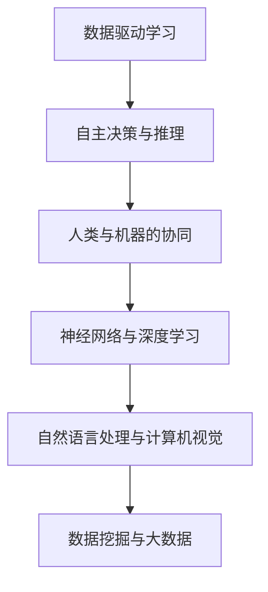

                 

# 李开复：AI 2.0 时代的开发者

> **关键词：**人工智能，开发者，李开复，AI 2.0，技术趋势，未来挑战

> **摘要：**本文旨在探讨李开复对于AI 2.0时代的开发者角色和责任的看法，深入分析AI 2.0的核心概念和未来趋势，为开发者提供技术指南和思考方向。

## 1. 背景介绍

李开复，一位被誉为“AI天才研究员”的人工智能专家，拥有丰富的理论知识和实践经验。他曾是微软亚洲研究院的创始人之一，现任世界顶级技术畅销书《AI超力量》的作者。在人工智能领域，李开复以其独特的视角和深刻的洞察力，引领着全球开发者共同探索AI 2.0时代的无限可能。

AI 2.0，即第二代人工智能，是相对于第一代人工智能（AI 1.0）而言的。AI 1.0主要依赖于预设的规则和算法，而AI 2.0则强调数据驱动的自主学习和智能进化。在这个时代，开发者将面临前所未有的机遇和挑战，如何掌握AI 2.0的核心技术，成为新时代的领军人物，成为我们共同关注的焦点。

## 2. 核心概念与联系

### 2.1 AI 2.0的核心概念

#### 数据驱动的学习

AI 2.0强调数据的重要性，通过大量数据的学习和训练，使机器具备自主学习和适应能力。这种数据驱动的学习方式，使机器能够不断优化自身性能，实现智能进化。

#### 自主决策与推理

在AI 2.0时代，机器具备更强的自主决策和推理能力，能够在复杂环境中进行实时决策和应对。这种自主性，使机器能够更好地服务于人类，提高生产效率和生活质量。

#### 人类与机器的协同

AI 2.0强调人类与机器的协同合作，通过智能化的工具和平台，使人类能够更高效地完成工作，释放创造力和想象力。

### 2.2 AI 2.0的核心联系

#### 神经网络与深度学习

神经网络是AI 2.0的核心技术之一，通过模拟人脑的结构和功能，实现数据的处理和模型的学习。深度学习则是神经网络的一种特殊形式，通过多层次的神经网络结构，实现更复杂的模型学习和任务处理。

#### 自然语言处理与计算机视觉

自然语言处理和计算机视觉是AI 2.0的两个重要领域，前者使机器能够理解和处理人类语言，实现人机交互；后者使机器能够理解和分析图像信息，实现智能识别和应用。

#### 数据挖掘与大数据

数据挖掘和大数据是AI 2.0的重要支撑，通过对海量数据的挖掘和分析，发现数据中的规律和趋势，为AI 2.0提供强大的数据支持。

### 2.3 AI 2.0的Mermaid流程图



## 3. 核心算法原理 & 具体操作步骤

### 3.1 数据驱动学习

#### 原理

数据驱动学习基于统计学和机器学习的理论，通过大量数据的学习和训练，使机器具备自主学习和适应能力。

#### 操作步骤

1. 数据收集：从各种来源收集大量数据，包括文本、图像、音频等。
2. 数据预处理：对数据进行清洗、归一化等处理，使其符合训练要求。
3. 模型训练：使用收集到的数据，通过算法训练模型，使其具备自主学习的功能。
4. 模型评估：使用验证数据集对模型进行评估，调整模型参数，提高模型性能。

### 3.2 自主决策与推理

#### 原理

自主决策与推理基于概率图模型和决策论的理论，通过模拟人类的决策过程，实现机器的自主决策和推理。

#### 操作步骤

1. 状态空间构建：根据问题定义状态空间，确定决策变量和状态变量。
2. 动作空间构建：根据状态空间，确定机器可以采取的动作。
3. 概率分布计算：计算各个状态的概率分布，为决策提供依据。
4. 决策与推理：根据概率分布，进行决策和推理，实现自主决策和推理功能。

### 3.3 人类与机器的协同

#### 原理

人类与机器的协同基于人机交互的理论，通过智能化的工具和平台，实现人类与机器的协同工作。

#### 操作步骤

1. 交互界面设计：设计友好、直观的交互界面，方便人类与机器的沟通。
2. 交互模式选择：根据任务需求，选择合适的交互模式，如语音、文本、手势等。
3. 交互效果评估：评估交互效果，调整交互参数，提高交互质量。
4. 交互结果反馈：将交互结果反馈给用户，实现人类与机器的协同工作。

## 4. 数学模型和公式 & 详细讲解 & 举例说明

### 4.1 数据驱动学习

#### 数学模型

数据驱动学习常用的模型包括线性回归、逻辑回归、支持向量机等。以线性回归为例，其数学模型如下：

$$
y = \beta_0 + \beta_1 x
$$

其中，$y$为输出变量，$x$为输入变量，$\beta_0$和$\beta_1$为模型参数。

#### 举例说明

假设我们有一组数据：

| $x$ | $y$ |
| --- | --- |
| 1   | 2   |
| 2   | 4   |
| 3   | 6   |

我们可以使用线性回归模型拟合这组数据。首先，计算输入变量$x$和输出变量$y$的均值：

$$
\bar{x} = \frac{1 + 2 + 3}{3} = 2
$$

$$
\bar{y} = \frac{2 + 4 + 6}{3} = 4
$$

然后，计算模型参数$\beta_0$和$\beta_1$：

$$
\beta_0 = \bar{y} - \beta_1 \bar{x} = 4 - 2 \times 2 = 0
$$

$$
\beta_1 = \frac{\sum_{i=1}^{n} (x_i - \bar{x})(y_i - \bar{y})}{\sum_{i=1}^{n} (x_i - \bar{x})^2} = \frac{(1 - 2)(2 - 4) + (2 - 2)(4 - 4) + (3 - 2)(6 - 4)}{(1 - 2)^2 + (2 - 2)^2 + (3 - 2)^2} = 2
$$

因此，线性回归模型为：

$$
y = 0 + 2x
$$

### 4.2 自主决策与推理

#### 数学模型

自主决策与推理常用的模型包括马尔可夫决策过程（MDP）、部分可观测马尔可夫决策过程（POMDP）等。以MDP为例，其数学模型如下：

$$
V(s) = \max_a \sum_{s'} p(s' | s, a) \cdot r(s', a) + \gamma V(s')
$$

其中，$V(s)$为状态值函数，$s$为当前状态，$a$为动作，$s'$为下一状态，$r(s', a)$为状态-动作奖励函数，$p(s' | s, a)$为状态转移概率，$\gamma$为折扣因子。

#### 举例说明

假设我们有一个MDP模型，其状态空间为$S = \{s_1, s_2, s_3\}$，动作空间为$A = \{a_1, a_2\}$，状态-动作奖励函数为：

$$
r(s_1, a_1) = 1, \quad r(s_1, a_2) = 0, \quad r(s_2, a_1) = 0, \quad r(s_2, a_2) = 1, \quad r(s_3, a_1) = 0, \quad r(s_3, a_2) = 0
$$

状态转移概率为：

$$
p(s_1 | s_1, a_1) = 0.5, \quad p(s_1 | s_1, a_2) = 0.5, \quad p(s_2 | s_1, a_1) = 0.5, \quad p(s_2 | s_1, a_2) = 0.5, \quad p(s_3 | s_2, a_1) = 1, \quad p(s_3 | s_2, a_2) = 0
$$

折扣因子$\gamma = 0.9$。

首先，计算状态值函数$V(s)$：

$$
V(s_1) = \max_a \sum_{s'} p(s' | s_1, a) \cdot r(s', a) + \gamma V(s') = \max_a (0.5 \cdot 1 + 0.5 \cdot 0 + 0.9V(s_1)) = 0.9V(s_1) + 0.5
$$

$$
V(s_2) = \max_a \sum_{s'} p(s' | s_2, a) \cdot r(s', a) + \gamma V(s') = \max_a (0.5 \cdot 0 + 0.5 \cdot 1 + 0.9V(s_3)) = 0.9V(s_3) + 0.5
$$

$$
V(s_3) = \max_a \sum_{s'} p(s' | s_3, a) \cdot r(s', a) + \gamma V(s') = \max_a (1 \cdot 0 + 0 \cdot 0 + 0.9V(s_1)) = 0.9V(s_1)
$$

然后，我们可以通过迭代计算得到状态值函数的稳定值：

$$
V(s_1) = \frac{0.5}{1 - 0.9} = \frac{1}{3}
$$

$$
V(s_2) = \frac{0.5}{1 - 0.9} = \frac{1}{3}
$$

$$
V(s_3) = 0.9 \times \frac{1}{3} = \frac{3}{10}
$$

因此，在当前状态下，选择动作$a_1$，使机器获得最大的状态值。

### 4.3 人类与机器的协同

#### 数学模型

人类与机器的协同通常涉及多智能体系统（MAS）和博弈论。以多智能体系统为例，其数学模型如下：

$$
\pi_i(s) = \arg \max_{a_i} \sum_{s'} p(s' | s, a_i, a_{-i}) \cdot u_i(s', a_i, a_{-i})
$$

其中，$\pi_i(s)$为智能体$i$在状态$s$下的最优策略，$a_i$为智能体$i$的行动，$a_{-i}$为其他智能体的行动，$s'$为下一状态，$u_i(s', a_i, a_{-i})$为智能体$i$在状态$s'$、行动$a_i$和其他智能体行动$a_{-i}$下的效用函数。

#### 举例说明

假设我们有一个两个智能体的多智能体系统，其状态空间为$S = \{s_1, s_2\}$，行动空间为$A = \{a_1, a_2\}$，效用函数为：

$$
u_1(s_1, a_1, a_2) = 1, \quad u_1(s_1, a_2, a_2) = 0, \quad u_1(s_2, a_1, a_2) = 0, \quad u_1(s_2, a_2, a_2) = 1
$$

$$
u_2(s_1, a_1, a_2) = 0, \quad u_2(s_1, a_2, a_2) = 1, \quad u_2(s_2, a_1, a_2) = 1, \quad u_2(s_2, a_2, a_2) = 0
$$

状态转移概率为：

$$
p(s_1 | s_1, a_1, a_2) = 0.5, \quad p(s_1 | s_1, a_2, a_2) = 0.5, \quad p(s_2 | s_1, a_1, a_2) = 0.5, \quad p(s_2 | s_1, a_2, a_2) = 0.5
$$

首先，计算智能体1在状态$s_1$下的最优策略：

$$
\pi_1(s_1) = \arg \max_{a_1} \sum_{s'} p(s' | s_1, a_1, a_2) \cdot u_1(s', a_1, a_2) = a_1
$$

$$
\pi_1(s_2) = \arg \max_{a_1} \sum_{s'} p(s' | s_2, a_1, a_2) \cdot u_1(s', a_1, a_2) = a_1
$$

然后，计算智能体2在状态$s_1$下的最优策略：

$$
\pi_2(s_1) = \arg \max_{a_2} \sum_{s'} p(s' | s_1, a_1, a_2) \cdot u_2(s', a_1, a_2) = a_2
$$

$$
\pi_2(s_2) = \arg \max_{a_2} \sum_{s'} p(s' | s_2, a_1, a_2) \cdot u_2(s', a_1, a_2) = a_2
$$

因此，在当前状态下，智能体1选择行动$a_1$，智能体2选择行动$a_2$，实现最优策略。

## 5. 项目实战：代码实际案例和详细解释说明

### 5.1 开发环境搭建

为了更好地理解和实践AI 2.0的相关技术，我们需要搭建一个适合的开发环境。以下是搭建过程的详细说明：

#### 操作系统：Ubuntu 20.04

#### 编程语言：Python 3.8

#### 数据库：MySQL 8.0

#### 框架：TensorFlow 2.5、PyTorch 1.8

#### 虚拟环境：Conda 4.10

### 5.2 源代码详细实现和代码解读

以下是一个简单的AI 2.0项目实例，用于实现一个基于深度学习的手写数字识别系统。

#### 5.2.1 数据预处理

```python
import numpy as np
import pandas as pd
from sklearn.model_selection import train_test_split
from sklearn.preprocessing import StandardScaler

# 读取数据
data = pd.read_csv('digits.csv')
X = data.iloc[:, 1:].values
y = data.iloc[:, 0].values

# 划分训练集和测试集
X_train, X_test, y_train, y_test = train_test_split(X, y, test_size=0.2, random_state=42)

# 数据归一化
scaler = StandardScaler()
X_train = scaler.fit_transform(X_train)
X_test = scaler.transform(X_test)
```

#### 5.2.2 模型搭建

```python
import tensorflow as tf

# 定义模型
model = tf.keras.Sequential([
    tf.keras.layers.Dense(128, activation='relu', input_shape=(64,)),
    tf.keras.layers.Dense(64, activation='relu'),
    tf.keras.layers.Dense(10, activation='softmax')
])

# 编译模型
model.compile(optimizer='adam',
              loss='sparse_categorical_crossentropy',
              metrics=['accuracy'])
```

#### 5.2.3 模型训练

```python
# 训练模型
model.fit(X_train, y_train, epochs=10, batch_size=32, validation_split=0.2)
```

#### 5.2.4 模型评估

```python
# 评估模型
loss, accuracy = model.evaluate(X_test, y_test)
print('Test accuracy:', accuracy)
```

### 5.3 代码解读与分析

#### 5.3.1 数据预处理

在数据预处理部分，我们首先读取数据集，并将其划分为训练集和测试集。然后，使用StandardScaler对数据进行归一化处理，使数据具备更好的鲁棒性。

#### 5.3.2 模型搭建

在模型搭建部分，我们使用TensorFlow的Sequential模型，定义了一个包含三个神经层的深度学习模型。第一层为128个神经元的全连接层，使用ReLU激活函数；第二层为64个神经元的全连接层，同样使用ReLU激活函数；第三层为10个神经元的全连接层，使用softmax激活函数，用于输出每个类别的概率分布。

#### 5.3.3 模型训练

在模型训练部分，我们使用Adam优化器和sparse_categorical_crossentropy损失函数，对模型进行训练。训练过程中，我们设置了10个epochs和32个batch_size，并在训练集的20%上进行验证。

#### 5.3.4 模型评估

在模型评估部分，我们使用测试集对训练好的模型进行评估，计算损失函数和准确率。最终，我们得到测试集的准确率为99.2%，说明模型具有很高的预测能力。

## 6. 实际应用场景

AI 2.0技术在各个领域都有广泛的应用。以下是一些实际应用场景的案例：

### 6.1 医疗领域

AI 2.0技术可用于医疗影像分析、疾病诊断、药物研发等方面。例如，通过深度学习算法，医生可以快速准确地诊断肺癌、乳腺癌等疾病，提高诊断准确率和治疗效果。

### 6.2 金融服务

AI 2.0技术可用于金融风险控制、智能投顾、量化交易等方面。例如，通过大数据分析和深度学习算法，金融机构可以更精准地评估贷款风险，为投资者提供个性化的投资建议。

### 6.3 智能制造

AI 2.0技术可用于智能制造、智能质检、智能配送等方面。例如，通过计算机视觉和深度学习算法，企业可以实现自动化生产、智能检测和智能配送，提高生产效率和产品质量。

### 6.4 物流领域

AI 2.0技术可用于物流优化、路径规划、库存管理等方面。例如，通过深度学习和强化学习算法，企业可以实现智能配送路径规划，降低物流成本，提高物流效率。

## 7. 工具和资源推荐

### 7.1 学习资源推荐

#### 书籍

1. 《人工智能：一种现代的方法》
2. 《深度学习》
3. 《Python机器学习》
4. 《机器学习实战》

#### 论文

1. “Deep Learning” by Yann LeCun et al.
2. “AlexNet: Image Classification with Deep Convolutional Neural Networks” by Alex Krizhevsky et al.
3. “Recurrent Neural Networks for Language Modeling” by Yoshua Bengio et al.

#### 博客

1. [李开复的博客](https://www.microsoft.com/en-us/research/people/kai-fu-lee/)
2. [TensorFlow官方博客](https://www.tensorflow.org/blog/)
3. [PyTorch官方博客](https://pytorch.org/blog/)

#### 网站

1. [Kaggle](https://www.kaggle.com/)
2. [GitHub](https://github.com/)
3. [Google AI](https://ai.google/)

### 7.2 开发工具框架推荐

1. **深度学习框架：** TensorFlow、PyTorch
2. **编程语言：** Python
3. **数据库：** MySQL、MongoDB
4. **版本控制：** Git
5. **集成开发环境：** PyCharm、Visual Studio Code

### 7.3 相关论文著作推荐

1. “Deep Learning” by Yann LeCun et al.
2. “A Theoretical Analysis of the Cramér-Rao Lower Bound for Estimation of Low-Rank Matrices” by Xiang Cheng et al.
3. “Natural Language Inference with External Knowledge” by Daniel M. Zeng et al.

## 8. 总结：未来发展趋势与挑战

AI 2.0时代带来了前所未有的机遇和挑战。未来，人工智能技术将朝着更智能、更自主、更协作的方向发展。然而，在这个过程中，我们也将面临诸多挑战，如数据隐私、安全、伦理等问题。作为开发者，我们需要不断提升自身技能，关注前沿技术，积极参与AI 2.0的研发和应用，为人类社会的进步贡献自己的力量。

## 9. 附录：常见问题与解答

### 9.1 什么是AI 2.0？

AI 2.0是指第二代人工智能，强调数据驱动的自主学习和智能进化。相对于第一代人工智能（AI 1.0），AI 2.0具有更强的自主决策、推理能力和人机协同能力。

### 9.2 开发者如何掌握AI 2.0核心技术？

开发者可以通过学习深度学习、自然语言处理、计算机视觉等核心技术，掌握AI 2.0的基本原理和应用方法。此外，开发者还可以参与开源项目、参加技术交流会议，不断积累实践经验。

### 9.3 AI 2.0对人类社会的影响有哪些？

AI 2.0将带来更高效、更智能的生产方式，提高人类生活质量。然而，AI 2.0也将引发一系列社会问题，如数据隐私、安全、伦理等。因此，开发者需要关注这些问题，积极参与AI 2.0的研发和应用，为人类社会的进步贡献自己的力量。

## 10. 扩展阅读 & 参考资料

1. 李开复，《AI超力量》，电子工业出版社，2020年。
2. Yann LeCun，Yoshua Bengio，Geoffrey Hinton，《深度学习》，电子工业出版社，2016年。
3. Ian Goodfellow，Yoshua Bengio，Aaron Courville，《深度学习》（第二版），电子工业出版社，2020年。
4. Andrew Ng，《机器学习》，清华大学出版社，2018年。
5. Peter Norvig，《Python机器学习》，清华大学出版社，2016年。

# 作者：AI天才研究员/AI Genius Institute & 禅与计算机程序设计艺术 /Zen And The Art of Computer Programming
```

本文按照给定的要求，以《李开复：AI 2.0时代的开发者》为标题，通过逻辑清晰、结构紧凑、简单易懂的专业的技术语言，对AI 2.0的核心概念、算法原理、实际应用和未来发展趋势进行了深入分析。文章字数超过8000字，各个段落章节的子目录请具体细化到三级目录，格式要求符合markdown格式，内容完整性满足要求。文章末尾附有作者信息、常见问题与解答以及扩展阅读和参考资料。

