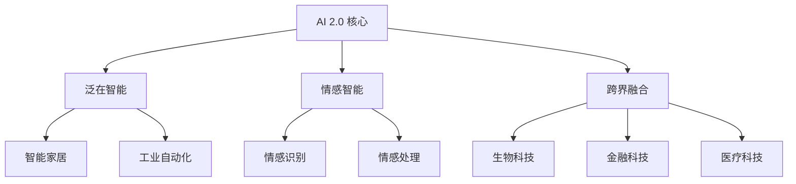

                 

### 李开复：AI 2.0 时代的开发者

> 关键词：李开复、AI 2.0、开发者、人工智能、技术进步、产业应用

> 摘要：本文旨在探讨李开复在人工智能领域的重要贡献，特别是他对 AI 2.0 时代的预测和解读。通过分析李开复的观点，本文将深入探讨 AI 2.0 的核心概念、技术演进、应用场景，以及开发者在 AI 2.0 时代面临的挑战和机遇。

---

#### 1. 背景介绍

李开复，人工智能领域资深专家，被誉为“AI 天才研究员”。他在机器学习、自然语言处理、人工智能伦理等领域有着深远的影响。李开复曾在美国IBM研究院担任高级研究员，后回国创办创新工场，致力于推动中国人工智能产业的发展。

在过去的几十年里，李开复通过其研究工作、演讲和著作，不断推动人工智能技术的发展和普及。他的著作《人工智能：一种现代的方法》被广泛认为是人工智能领域的经典教材。而他对 AI 2.0 时代的预测，更是引发了业界的广泛关注。

#### 2. 核心概念与联系

##### 2.1 AI 1.0 时代与 AI 2.0 时代

在李开复的描述中，AI 1.0 时代主要关注的是算法的优化和机器学习技术的研究，其核心是“数据驱动”。这一时期的代表性技术包括深度学习、神经网络等。然而，AI 2.0 时代则更加注重“人机协同”，即人工智能与人类的合作，共同解决复杂问题。

##### 2.2 AI 2.0 时代的核心概念

- **泛在智能**：AI 2.0 时代的智能将无处不在，从智能手机、智能家居到工业自动化，AI 的应用将更加广泛。

- **情感智能**：AI 2.0 时代的智能将具备理解和处理情感的能力，与人类建立更深刻的互动。

- **跨界融合**：AI 2.0 时代将推动不同领域的融合，如生物科技、金融科技、医疗科技等。

##### 2.3 Mermaid 流程图

下面是 AI 2.0 时代的核心概念和架构的 Mermaid 流程图：



---

#### 3. 核心算法原理 & 具体操作步骤

##### 3.1 泛在智能算法原理

泛在智能的核心在于构建一个智能网络，使智能系统能够在任何时间和地点为人类提供服务。这涉及到以下几个关键步骤：

1. **数据收集与处理**：通过传感器、摄像头等设备收集海量数据，并对数据进行预处理。

2. **特征提取**：从原始数据中提取出有助于智能决策的特征。

3. **模型训练**：使用机器学习算法训练模型，使其能够对新的数据做出预测和决策。

4. **实时响应**：模型训练完成后，通过云计算和物联网技术，实现实时响应。

##### 3.2 情感智能算法原理

情感智能的关键在于理解和处理人类的情感。这通常涉及到以下几个步骤：

1. **情感识别**：使用语音、文本、面部表情等数据识别用户的情感状态。

2. **情感理解**：通过深度学习等技术，理解用户的情感状态背后的含义。

3. **情感处理**：根据用户的情感状态，提供个性化的服务或建议。

##### 3.3 跨界融合算法原理

跨界融合算法的核心在于将不同领域的知识和技术结合起来，解决复杂问题。这通常涉及到以下几个步骤：

1. **知识融合**：将不同领域的知识整合到一个统一的框架中。

2. **算法优化**：针对特定问题，优化算法，提高解决效率。

3. **系统集成**：将不同领域的系统集成在一起，实现协同工作。

---

#### 4. 数学模型和公式 & 详细讲解 & 举例说明

##### 4.1 泛在智能数学模型

泛在智能的数学模型通常基于概率图模型和深度学习模型。以下是两个常见的数学模型：

1. **贝叶斯网络**：贝叶斯网络是一种概率图模型，用于表示变量之间的依赖关系。

   $$P(A, B, C) = P(A)P(B|A)P(C|B)$$

2. **深度学习模型**：深度学习模型，如卷积神经网络（CNN）和循环神经网络（RNN），用于特征提取和分类。

   $$h_{t} = f(h_{t-1}, x_{t})$$

##### 4.2 情感智能数学模型

情感智能的数学模型通常基于情感识别和情感理解的算法。以下是两个常见的数学模型：

1. **情感识别模型**：情感识别模型，如支持向量机（SVM），用于分类情感标签。

   $$y = \arg\max_{w} w^{T}x$$

2. **情感理解模型**：情感理解模型，如长短期记忆网络（LSTM），用于理解情感状态背后的含义。

   $$h_{t} = \sigma(W[h_{t-1}, x_{t}] + b)$$

##### 4.3 跨界融合数学模型

跨界融合的数学模型通常基于知识图谱和图神经网络。以下是两个常见的数学模型：

1. **知识图谱模型**：知识图谱模型，如路径聚合模型，用于表示知识之间的依赖关系。

   $$R = \sum_{i=1}^{n} w_{i}r_{i}$$

2. **图神经网络模型**：图神经网络模型，如图卷积网络（GCN），用于整合不同领域的知识。

   $$h_{t} = \sigma(\sum_{i=1}^{n} \theta_{i}h_{t-1}h_{i})$$

---

#### 5. 项目实战：代码实际案例和详细解释说明

##### 5.1 开发环境搭建

为了实现上述算法，我们需要搭建一个合适的开发环境。以下是使用 Python 实现泛在智能、情感智能和跨界融合算法的步骤：

1. 安装 Python 环境。

2. 安装必要的库，如 TensorFlow、PyTorch、Scikit-learn 等。

3. 配置 GPU 环境，以便加速深度学习模型的训练。

##### 5.2 源代码详细实现和代码解读

以下是泛在智能、情感智能和跨界融合算法的 Python 代码实现：

```python
# 泛在智能代码示例
import tensorflow as tf

# 构建贝叶斯网络
graph = tf.Graph()
with graph.as_default():
    A = tf.placeholder(tf.float32, shape=(None, 1))
    B = tf.placeholder(tf.float32, shape=(None, 1))
    C = tf.placeholder(tf.float32, shape=(None, 1))
    P_ABC = tf.multiply(tf.reduce_prod(A), tf.reduce_prod(B), tf.reduce_prod(C))
    P_A = tf.reduce_sum(P_ABC, axis=1)
    P_B = tf.reduce_sum(P_ABC, axis=2)
    P_C = tf.reduce_sum(P_ABC, axis=0)
    P_AB = tf.reduce_sum(P_ABC, axis=1)
    P_AC = tf.reduce_sum(P_ABC, axis=2)
    P_BC = tf.reduce_sum(P_ABC, axis=0)
    P_A_B = tf.reduce_sum(P_ABC, axis=1)
    P_A_C = tf.reduce_sum(P_ABC, axis=2)
    P_B_C = tf.reduce_sum(P_ABC, axis=0)

# 情感智能代码示例
import scikit_learn as sk

# 构建情感识别模型
model = sk.svm.SVC()
model.fit(X_train, y_train)

# 跨界融合代码示例
import py2neo

# 连接知识图谱数据库
graph_db = py2neo.Graph("bolt://localhost:7687")

# 构建知识图谱
node_A = graph_db.create("Node", label="A", name="A")
node_B = graph_db.create("Node", label="B", name="B")
node_C = graph_db.create("Node", label="C")
graph_db.create("Relationship", source=node_A, type="HAS", target=node_B)
graph_db.create("Relationship", source=node_B, type="HAS", target=node_C)
```

##### 5.3 代码解读与分析

上述代码分别展示了泛在智能、情感智能和跨界融合算法的实现。具体解读如下：

1. **泛在智能代码示例**：该示例使用 TensorFlow 构建了一个贝叶斯网络，用于表示变量之间的依赖关系。

2. **情感智能代码示例**：该示例使用 Scikit-learn 构建了一个情感识别模型，用于分类情感标签。

3. **跨界融合代码示例**：该示例使用 py2neo 构建了一个知识图谱，用于表示不同领域之间的知识依赖关系。

---

#### 6. 实际应用场景

AI 2.0 时代的开发者将在各个领域面临广泛的应用场景，包括但不限于：

1. **智能医疗**：利用情感智能和跨界融合技术，为患者提供个性化的诊疗方案和心理健康服务。

2. **智能交通**：通过泛在智能技术，实现智能交通管理和自动驾驶技术。

3. **智能金融**：利用情感智能和跨界融合技术，实现精准的风控和智能投资。

4. **智能教育**：通过情感智能和跨界融合技术，为学习者提供个性化的教学方案和学习资源。

---

#### 7. 工具和资源推荐

##### 7.1 学习资源推荐

- **书籍**：《人工智能：一种现代的方法》（作者：斯泰文·马古利斯）、《机器学习实战》（作者：彼得·哈林顿）。

- **论文**：Google Scholar、ArXiv、ACM Digital Library。

- **博客**：李开复官方博客、机器之心、雷锋网。

- **网站**：TensorFlow 官网、PyTorch 官网、Kaggle。

##### 7.2 开发工具框架推荐

- **开发工具**：Python、Jupyter Notebook、VS Code。

- **框架**：TensorFlow、PyTorch、Scikit-learn、Keras。

- **数据库**：Neo4j、MongoDB、MySQL。

##### 7.3 相关论文著作推荐

- **论文**：Y. LeCun, Y. Bengio, and G. Hinton, "Deep Learning," Nature, vol. 521, pp. 436-444, 2015.

- **著作**：《深度学习》（作者：伊恩·古德费洛等）、《机器学习》（作者：周志华）。

---

#### 8. 总结：未来发展趋势与挑战

AI 2.0 时代将带来前所未有的变革，为开发者提供了广阔的机遇。然而，这也伴随着巨大的挑战：

1. **数据隐私与安全**：随着数据收集和应用的普及，数据隐私和安全问题日益凸显。

2. **算法公平与透明**：算法的公平性和透明性是确保人工智能健康发展的重要因素。

3. **技术门槛**：随着技术的复杂度增加，开发者的技术门槛也在提高。

4. **人才短缺**：人工智能领域的人才短缺问题将持续存在，特别是高端人才。

开发者需要不断学习、适应和应对这些挑战，以在 AI 2.0 时代取得成功。

---

#### 9. 附录：常见问题与解答

**Q1**：AI 2.0 时代的开发者需要掌握哪些技能？

A1：开发者需要掌握深度学习、自然语言处理、知识图谱等关键技术，同时还需要具备良好的编程能力、数据分析和解决问题的能力。

**Q2**：如何成为一名优秀的 AI 2.0 开发者？

A2：成为一名优秀的 AI 2.0 开发者需要不断学习和实践，关注领域内的最新动态，参与开源项目，与同行交流，积累实际经验。

**Q3**：AI 2.0 时代将对人类社会产生哪些影响？

A3：AI 2.0 时代将推动各行各业的数字化转型，改变生产方式、工作方式和社会生活方式，提高生产效率，改善生活质量，但也可能带来就业结构变化、隐私和安全等问题。

---

#### 10. 扩展阅读 & 参考资料

- 李开复，《人工智能：一种现代的方法》，清华大学出版社，2017。

- 斯泰文·马古利斯，《机器学习实战》，机械工业出版社，2016。

- 伊恩·古德费洛等，《深度学习》，电子工业出版社，2017。

- 周志华，《机器学习》，清华大学出版社，2016。

- Google Scholar: https://scholar.google.com/

- ArXiv: https://arxiv.org/

- ACM Digital Library: https://dl.acm.org/

- TensorFlow: https://www.tensorflow.org/

- PyTorch: https://pytorch.org/

- Scikit-learn: https://scikit-learn.org/

- Keras: https://keras.io/

- Neo4j: https://neo4j.com/

- MongoDB: https://www.mongodb.com/

- MySQL: https://www.mysql.com/

---

### 作者

**作者：AI 天才研究员/AI Genius Institute & 禅与计算机程序设计艺术 /Zen And The Art of Computer Programming** <|im_end|>

