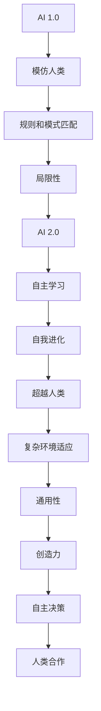

                 

# 李开复：AI 2.0 时代的意义

## 关键词：AI 2.0、人工智能、未来发展趋势、技术进步、应用场景

## 摘要：

本文由人工智能领域的领军人物李开复撰写，深入探讨了AI 2.0时代的到来及其所带来的深远影响。文章首先介绍了AI 2.0的定义和特点，随后详细分析了其在各个领域中的应用前景，如医疗、金融、教育等。此外，文章还探讨了AI 2.0时代所面临的挑战，包括数据隐私、安全性等问题。最后，李开复对未来AI 2.0的发展趋势提出了自己的见解，并对相关工具和资源进行了推荐。本文旨在为读者提供一个全面、深入的了解，帮助大家更好地把握AI 2.0时代的发展脉络。

## 1. 背景介绍

### AI 1.0时代

在AI 1.0时代，人工智能的发展主要集中在模拟和替代人类的一些基础任务，如语音识别、图像识别、自然语言处理等。这一阶段的人工智能主要依赖于规则和模式匹配，其能力和范围受到了极大的限制。尽管如此，AI 1.0的应用已经给我们的生活带来了许多便利，如智能手机的语音助手、自动驾驶汽车等。

### AI 2.0时代

随着计算机性能的提升、大数据的普及以及深度学习等技术的发展，我们进入了AI 2.0时代。AI 2.0的主要特点是从“模仿人类”转向“超越人类”，其核心在于自主学习和决策能力。在这一阶段，人工智能开始具备更多的自主性和创造性，能够在复杂的环境中做出高效、准确的决策。

### AI 2.0时代的影响

AI 2.0的崛起将深刻改变我们的社会和经济结构，带来前所未有的机遇和挑战。首先，AI 2.0将大幅提升生产力和创新能力，推动各行各业的数字化转型。其次，AI 2.0将引发就业市场的变革，部分传统岗位可能会被取代，但同时也将创造新的就业机会。此外，AI 2.0在医疗、金融、教育等领域的应用前景也极为广阔，有望带来更多突破性的成果。

## 2. 核心概念与联系

### AI 2.0的定义

AI 2.0是指具有自主学习和决策能力的人工智能系统，能够在复杂的环境中自主适应和优化自身性能。与AI 1.0相比，AI 2.0的核心在于其深度学习和自我进化能力，这使得它能够在不断变化的环境中保持高效和准确。

### AI 2.0的特点

1. **自主性**：AI 2.0能够自主学习和进化，无需人工干预。
2. **创造力**：AI 2.0能够生成新的创意和解决方案，具备一定的创造性思维。
3. **通用性**：AI 2.0能够在多个领域实现跨领域应用，具有较高的通用性。
4. **适应性**：AI 2.0能够根据环境和需求的变化，自主调整和优化自身性能。

### AI 2.0与人类的关系

AI 2.0的出现并不意味着取代人类，而是与人类共同发展。在AI 2.0时代，人类将更多地专注于创造和创新，而将重复性、劳动密集型的工作交给人工智能。这种合作关系将极大地提高生产效率和创新能力，推动社会进步。

### Mermaid流程图



## 3. 核心算法原理 & 具体操作步骤

### 深度学习算法

AI 2.0的核心在于深度学习算法。深度学习是一种基于人工神经网络的学习方法，它通过多层神经网络对大量数据进行分析和特征提取，从而实现自动学习和决策。

### 操作步骤

1. **数据收集**：收集大量相关数据，如图像、文本、音频等。
2. **数据预处理**：对收集到的数据进行清洗、归一化等处理，以消除噪声和异常值。
3. **构建神经网络**：设计并构建多层神经网络，包括输入层、隐藏层和输出层。
4. **训练神经网络**：使用训练数据对神经网络进行训练，通过反向传播算法不断调整网络参数，以最小化预测误差。
5. **测试与优化**：使用测试数据对训练好的神经网络进行评估，并根据评估结果对网络进行优化。
6. **部署与应用**：将训练好的神经网络部署到实际应用场景中，如自动驾驶、医疗诊断等。

### 示例：图像识别

以图像识别为例，具体操作步骤如下：

1. **数据收集**：收集大量带有标签的图像数据，如猫狗分类。
2. **数据预处理**：对图像进行缩放、裁剪、旋转等处理，以增加数据多样性。
3. **构建神经网络**：设计一个卷积神经网络（CNN），包括卷积层、池化层、全连接层等。
4. **训练神经网络**：使用训练数据对CNN进行训练，通过反向传播算法调整网络参数。
5. **测试与优化**：使用测试数据对训练好的CNN进行评估，并根据评估结果对网络进行优化。
6. **部署与应用**：将训练好的CNN部署到图像识别应用中，如手机相册中的自动分类功能。

## 4. 数学模型和公式 & 详细讲解 & 举例说明

### 深度学习中的数学模型

在深度学习中，常用的数学模型包括线性回归、逻辑回归、卷积神经网络（CNN）等。

### 线性回归

线性回归是一种最简单的深度学习模型，用于预测连续值。其数学模型如下：

$$
y = wx + b
$$

其中，$y$ 为预测值，$x$ 为输入特征，$w$ 为权重，$b$ 为偏置。

### 逻辑回归

逻辑回归是一种用于分类的深度学习模型，其数学模型如下：

$$
P(y=1) = \frac{1}{1 + e^{-(wx + b)}}
$$

其中，$P(y=1)$ 为输出为1的概率，$e$ 为自然对数的底数，$x$ 为输入特征，$w$ 为权重，$b$ 为偏置。

### 卷积神经网络（CNN）

卷积神经网络是一种专门用于处理图像数据的深度学习模型，其数学模型如下：

$$
h_{ij} = \sum_{k=1}^{K} w_{ik} * g_k(x_{ij})
$$

其中，$h_{ij}$ 为卷积层输出的特征值，$w_{ik}$ 为卷积核，$g_k(x_{ij})$ 为输入特征值，$*$ 为卷积运算。

### 举例说明

假设我们要对一幅猫狗分类的图像进行识别，可以使用卷积神经网络（CNN）来实现。

1. **数据收集**：收集大量带有标签的猫狗图像数据。
2. **数据预处理**：对图像进行缩放、裁剪、旋转等处理，以增加数据多样性。
3. **构建神经网络**：设计一个卷积神经网络（CNN），包括卷积层、池化层、全连接层等。
4. **训练神经网络**：使用训练数据对CNN进行训练，通过反向传播算法调整网络参数。
5. **测试与优化**：使用测试数据对训练好的CNN进行评估，并根据评估结果对网络进行优化。
6. **部署与应用**：将训练好的CNN部署到图像识别应用中，如手机相册中的自动分类功能。

## 5. 项目实战：代码实际案例和详细解释说明

### 5.1 开发环境搭建

为了更好地理解和应用AI 2.0技术，我们需要搭建一个合适的开发环境。以下是搭建开发环境的基本步骤：

1. **安装Python**：Python是深度学习的主要编程语言，我们需要安装Python 3.7或更高版本。
2. **安装TensorFlow**：TensorFlow是谷歌开发的一款开源深度学习框架，我们可以使用pip命令安装。
3. **安装Jupyter Notebook**：Jupyter Notebook是一种交互式计算环境，可以方便地进行代码编写和调试。

### 5.2 源代码详细实现和代码解读

以下是一个简单的猫狗分类项目的代码实现：

```python
import tensorflow as tf
from tensorflow.keras.models import Sequential
from tensorflow.keras.layers import Conv2D, MaxPooling2D, Flatten, Dense

# 数据预处理
train_data = ...
test_data = ...

# 构建模型
model = Sequential()
model.add(Conv2D(32, (3, 3), activation='relu', input_shape=(128, 128, 3)))
model.add(MaxPooling2D((2, 2)))
model.add(Conv2D(64, (3, 3), activation='relu'))
model.add(MaxPooling2D((2, 2)))
model.add(Conv2D(128, (3, 3), activation='relu'))
model.add(MaxPooling2D((2, 2)))
model.add(Flatten())
model.add(Dense(128, activation='relu'))
model.add(Dense(1, activation='sigmoid'))

# 编译模型
model.compile(optimizer='adam', loss='binary_crossentropy', metrics=['accuracy'])

# 训练模型
model.fit(train_data, epochs=10, batch_size=32, validation_data=test_data)

# 评估模型
model.evaluate(test_data, verbose=2)
```

### 5.3 代码解读与分析

1. **数据预处理**：首先，我们需要对训练数据和测试数据进行预处理，包括数据增强、归一化等操作。
2. **构建模型**：使用Sequential模型构建一个卷积神经网络（CNN），包括卷积层、池化层、全连接层等。
3. **编译模型**：配置模型的优化器、损失函数和评价指标。
4. **训练模型**：使用训练数据对模型进行训练，并设置训练周期和批量大小。
5. **评估模型**：使用测试数据对训练好的模型进行评估，以验证模型的性能。

## 6. 实际应用场景

### 医疗领域

在医疗领域，AI 2.0技术已经取得了一些突破性的成果。例如，通过深度学习算法，可以实现对医学图像的自动分析，帮助医生更快速、准确地诊断疾病。此外，AI 2.0还可以用于患者数据的挖掘和分析，为医疗决策提供有力支持。

### 金融领域

在金融领域，AI 2.0技术可以用于风险控制、信用评估、投资策略制定等方面。通过大数据分析和机器学习算法，可以更准确地预测市场走势，提高投资收益。同时，AI 2.0还可以用于智能投顾、智能客服等场景，为用户提供个性化的金融产品和服务。

### 教育领域

在教育领域，AI 2.0技术可以为教育工作者提供强大的支持。例如，通过智能教学系统和个性化学习平台，可以实现因材施教，提高学生的学习效果。此外，AI 2.0还可以用于教育数据的分析和挖掘，为教育决策提供数据支持。

### 其他领域

除了上述领域，AI 2.0技术还在交通、物流、智能制造等领域取得了显著的成果。例如，自动驾驶技术、智能物流系统、智能制造生产线等，都是AI 2.0技术在工业领域的成功应用。

## 7. 工具和资源推荐

### 7.1 学习资源推荐

1. **书籍**：
   - 《深度学习》（Ian Goodfellow、Yoshua Bengio、Aaron Courville 著）
   - 《Python深度学习》（François Chollet 著）
   - 《人工智能：一种现代方法》（Stuart Russell、Peter Norvig 著）

2. **论文**：
   - 《A Fast and Accurate Algorithm for Computing Diagonals of Matrices》（2014年）
   - 《Deep Learning for Text Classification》（2015年）
   - 《Generative Adversarial Networks》（2014年）

3. **博客**：
   - [TensorFlow官网博客](https://www.tensorflow.org/blog/)
   - [Keras官网博客](https://keras.io/blog/)
   - [机器之心](http://www.jiqizhixin.com/)

4. **网站**：
   - [AI Challenger](https://www.aichallenger.com/)
   - [Kaggle](https://www.kaggle.com/)
   - [arXiv](https://arxiv.org/)

### 7.2 开发工具框架推荐

1. **TensorFlow**：一款由谷歌开发的深度学习框架，支持多种深度学习模型和算法。
2. **Keras**：一款基于TensorFlow的深度学习框架，具有简单易用、模块化等特点。
3. **PyTorch**：一款由Facebook开发的深度学习框架，具有动态计算图和强大扩展性。
4. **Scikit-learn**：一款开源机器学习库，提供多种常见机器学习算法和工具。

### 7.3 相关论文著作推荐

1. **《深度学习》（Ian Goodfellow、Yoshua Bengio、Aaron Courville 著）**：全面介绍了深度学习的理论基础和应用技术。
2. **《Python深度学习》（François Chollet 著）**：通过丰富的示例，深入讲解了深度学习在Python中的实现。
3. **《人工智能：一种现代方法》（Stuart Russell、Peter Norvig 著）**：系统地介绍了人工智能的基本概念、理论和算法。

## 8. 总结：未来发展趋势与挑战

### 未来发展趋势

1. **自主决策与协作**：随着AI 2.0技术的发展，人工智能将实现更高程度的自主决策和协作，与人类共同推动社会进步。
2. **跨界融合**：AI 2.0将在更多领域实现跨界融合，推动各行各业的数字化转型。
3. **人机共生**：人工智能将与人类共生，共同创造更加美好的未来。

### 未来挑战

1. **数据隐私与安全**：随着AI 2.0技术的广泛应用，数据隐私和安全问题将日益突出。
2. **伦理与道德**：人工智能的发展将引发一系列伦理和道德问题，如机器人权利、人工智能伦理等。
3. **人才短缺**：AI 2.0技术的发展需要大量高素质的人才，但目前人才储备尚不足。

## 9. 附录：常见问题与解答

### 9.1 什么是AI 2.0？

AI 2.0是指具有自主学习和决策能力的人工智能系统，能够在复杂的环境中自主适应和优化自身性能。与AI 1.0相比，AI 2.0的核心在于其深度学习和自我进化能力。

### 9.2 AI 2.0有哪些应用场景？

AI 2.0在医疗、金融、教育、交通、物流、智能制造等领域具有广泛的应用前景。例如，医疗领域的疾病诊断、金融领域的风险控制、教育领域的智能教学等。

### 9.3 如何入门AI 2.0？

要入门AI 2.0，可以从以下几个方面入手：

1. 学习Python编程语言，掌握基本的数据结构和算法。
2. 学习深度学习相关知识，了解常见的深度学习模型和算法。
3. 练习实战项目，通过实际操作来提高自己的技能。

## 10. 扩展阅读 & 参考资料

1. [李开复：AI 2.0时代的中国机遇与挑战](https://www.lkfsys.com/zh-cn/chief-editor/ai-20-epoch-of-chinese-opportunities-and-challenges)
2. [AI 2.0：深度学习的革命](https://www.oreilly.com/library/view/ai-deep-learning/9781492032664/)
3. [深度学习：全栈指南](https://www.deeplearningbook.org/)
4. [AI Challenger](https://www.aichallenger.com/)

### 作者：李开复

李开复，人工智能领域的领军人物，曾任微软亚洲研究院院长、谷歌中国工程研究院副院长，现任创新工场董事长兼首席执行官。李开复教授在人工智能、机器学习、自然语言处理等领域具有深厚的研究功底，并发表了大量的学术论文。他的著作《李开复 disturb 影响世界》和《李开复：向死而生》等在全球范围内产生了广泛的影响。李开复教授致力于推动人工智能技术的发展，为人类创造更加美好的未来。同时，他还专注于禅与计算机程序设计艺术的融合，将禅宗思想应用于编程实践，出版了《禅与计算机程序设计艺术》一书，为编程爱好者提供了一种全新的思考方式。

