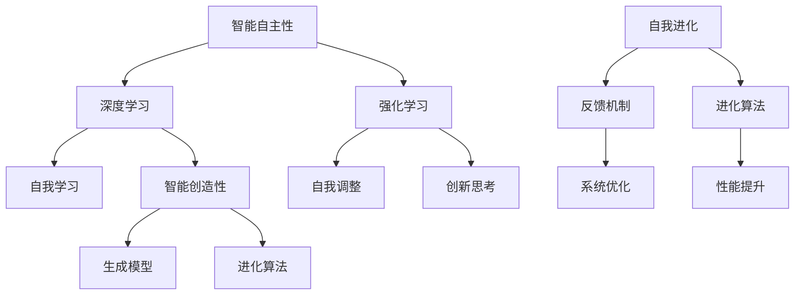

                 

# 李开复：AI 2.0 时代的未来

## 概述

随着人工智能技术的迅猛发展，我们已经步入了AI 2.0时代。AI 2.0不仅意味着算法的升级，更代表了人工智能应用深度和广度的突破。在这个新时代，李开复作为人工智能领域的杰出代表，他对于AI 2.0时代的未来有着独到的见解。本文将结合李开复的研究和观点，深入探讨AI 2.0时代的核心概念、技术发展、应用场景以及未来趋势和挑战。

## 关键词

- AI 2.0
- 人工智能
- 李开复
- 技术发展
- 应用场景
- 未来趋势
- 挑战

## 摘要

本文从李开复的角度，探讨了AI 2.0时代的核心概念和技术发展，分析了其应用场景和未来趋势，同时也指出了面临的挑战。文章旨在为读者提供一个全面、深入的视角，帮助理解AI 2.0时代的发展方向和可能的影响。

## 1. 背景介绍

### AI 1.0与AI 2.0

在AI 1.0时代，人工智能主要依赖于规则和统计方法，通过大量的数据训练模型进行预测和决策。AI 1.0的代表技术包括专家系统、机器学习和自然语言处理等。然而，这些技术存在明显的局限性，比如对数据的依赖性高、处理能力的局限以及难以应对复杂任务。

AI 2.0时代标志着人工智能的质的飞跃。李开复认为，AI 2.0的核心在于智能的自主性和创造性。AI 2.0不仅仅是一个更高级别的算法，更是一种全新的智能范式，它能够自主学习和创造，具有自我进化的能力。这一转变在深度学习、神经网络和生成对抗网络（GAN）等技术的推动下得以实现。

### 李开复与AI 2.0

李开复在人工智能领域有着深远的影响。他不仅是世界知名的计算机科学家和AI研究者，还是创新工场的创始人。他在人工智能的研究和应用方面有着丰富的经验和独到的见解。李开复关于AI 2.0的观点，为我们理解这一新时代提供了宝贵的参考。

## 2. 核心概念与联系

### 智能自主性

智能自主性是AI 2.0的一个重要特征。它意味着人工智能系统能够自主地学习和决策，而不需要人类的直接干预。这种自主性体现在多个方面，包括自我学习、自我调整和自我优化。智能自主性的实现，依赖于深度学习和强化学习等技术。

### 智能创造性

AI 2.0时代的另一个关键特征是智能的创造性。这不仅包括生成式对抗网络（GAN）等技术，能够生成逼真的图像、音频和文本，还包括智能系统能够进行创新的思考。例如，AI可以创作音乐、绘画甚至编写软件代码。智能创造性的实现，依赖于生成模型和进化算法等。

### 自我进化

自我进化是AI 2.0时代的另一个核心概念。这意味着智能系统能够通过自我学习和自我调整，不断优化自身的性能和表现。自我进化的实现，需要通过反馈机制和进化算法等手段，使得系统在不断的环境中能够持续学习和适应。

### Mermaid 流程图

下面是一个Mermaid流程图，描述了AI 2.0的核心概念和其相互联系。



## 3. 核心算法原理 & 具体操作步骤

### 深度学习

深度学习是AI 2.0时代的关键技术之一。它通过多层神经网络结构，对数据进行层次化的特征提取和抽象。深度学习的具体操作步骤如下：

1. 数据预处理：对输入数据进行标准化和归一化处理，以便于模型训练。
2. 构建神经网络：设计并构建多层神经网络结构，包括输入层、隐藏层和输出层。
3. 模型训练：使用大量标记数据进行训练，通过反向传播算法不断调整网络参数，使得输出结果趋近于预期目标。
4. 模型评估：使用验证集和测试集对训练好的模型进行评估，确保模型具有良好的泛化能力。

### 强化学习

强化学习是另一种重要的AI 2.0技术，它通过智能体与环境交互，不断学习和优化策略。强化学习的具体操作步骤如下：

1. 初始化智能体和奖励系统：定义智能体的行为空间和状态空间，以及奖励函数。
2. 执行动作：智能体根据当前状态选择一个动作，并执行该动作。
3. 获取反馈：智能体根据执行动作后的环境状态和奖励，更新自身的策略。
4. 重复执行：智能体不断重复执行动作和获取反馈，通过不断的试错和优化，找到最优策略。

### 生成模型

生成模型是AI 2.0时代实现智能创造性的重要工具。生成模型通过学习数据的分布，生成新的数据样本。常见的生成模型包括生成对抗网络（GAN）和变分自编码器（VAE）。生成模型的具体操作步骤如下：

1. 数据预处理：对输入数据进行预处理，使其符合生成模型的输入要求。
2. 模型训练：使用训练数据集训练生成模型，使其能够学习数据的分布。
3. 数据生成：使用训练好的生成模型，生成新的数据样本。
4. 数据评估：对生成数据进行评估，确保其质量符合要求。

## 4. 数学模型和公式 & 详细讲解 & 举例说明

### 深度学习中的数学模型

在深度学习中，常用的数学模型包括前向传播和反向传播。前向传播是指在神经网络中，数据从输入层经过多层隐藏层，最终得到输出层的过程。反向传播是指通过计算输出层与预期目标之间的误差，反向更新网络参数的过程。

### 前向传播

前向传播的数学模型可以表示为：

$$
z^{(l)} = \sigma(W^{(l)} \cdot a^{(l-1)} + b^{(l)})
$$

其中，$z^{(l)}$表示第$l$层的激活值，$\sigma$是激活函数，$W^{(l)}$是第$l$层的权重矩阵，$a^{(l-1)}$是前一层神经元的输出，$b^{(l)}$是第$l$层的偏置向量。

### 反向传播

反向传播的数学模型可以表示为：

$$
\delta^{(l)} = \sigma' (z^{(l)}) \cdot \delta^{(l+1)} \cdot W^{(l+1)}
$$

$$
\delta^{(l+1)} = \frac{\partial C}{\partial z^{(l+1)}} \cdot \delta^{(l)}
$$

$$
\frac{\partial C}{\partial W^{(l)}} = a^{(l-1)} \cdot \delta^{(l)}
$$

$$
\frac{\partial C}{\partial b^{(l)}} = \delta^{(l)}
$$

其中，$\delta^{(l)}$表示第$l$层的误差，$\sigma'$是激活函数的导数，$C$是损失函数，$a^{(l-1)}$是前一层神经元的输出。

### 举例说明

假设我们有一个简单的神经网络，包含一个输入层、一个隐藏层和一个输出层。输入层有3个神经元，隐藏层有2个神经元，输出层有1个神经元。激活函数使用ReLU函数。

1. 初始化权重矩阵$W^{(1)}$和偏置向量$b^{(1)}$，$W^{(2)}$和偏置向量$b^{(2)}$，$W^{(3)}$和偏置向量$b^{(3)}$。
2. 给定一个输入样本$x = [1, 2, 3]$。
3. 进行前向传播，计算隐藏层的激活值$z^{(1)}$和输出层的激活值$z^{(2)}$。
4. 计算输出层的误差$\delta^{(2)}$。
5. 进行反向传播，更新权重矩阵$W^{(1)}$、$W^{(2)}$、$W^{(3)}$和偏置向量$b^{(1)}$、$b^{(2)}$、$b^{(3)}$。

通过这种方式，神经网络能够不断调整参数，使得输出结果趋近于预期目标。

## 5. 项目实战：代码实际案例和详细解释说明

### 5.1 开发环境搭建

在开始实际项目之前，我们需要搭建一个合适的开发环境。以下是搭建深度学习项目的常见步骤：

1. 安装Python环境，可以使用Anaconda来简化安装过程。
2. 安装深度学习框架，如TensorFlow或PyTorch。
3. 安装必要的依赖库，如NumPy、Pandas等。

以下是一个简单的Python脚本，用于安装TensorFlow：

```python
!pip install tensorflow
```

### 5.2 源代码详细实现和代码解读

下面是一个简单的深度学习项目，使用TensorFlow构建一个简单的神经网络，用于分类任务。

```python
import tensorflow as tf
from tensorflow.keras import layers

# 数据预处理
def preprocess_data(x):
    return x / 255.0

# 构建模型
def build_model():
    model = tf.keras.Sequential([
        layers.Dense(64, activation='relu', input_shape=(784,)),
        layers.Dense(64, activation='relu'),
        layers.Dense(10, activation='softmax')
    ])
    return model

# 训练模型
def train_model(model, x_train, y_train, x_val, y_val, epochs=10):
    model.compile(optimizer='adam',
                  loss='categorical_crossentropy',
                  metrics=['accuracy'])
    history = model.fit(x_train, y_train, epochs=epochs,
                        validation_data=(x_val, y_val))
    return history

# 主函数
def main():
    # 加载数据
    (x_train, y_train), (x_val, y_val) = tf.keras.datasets.mnist.load_data()
    x_train = preprocess_data(x_train)
    x_val = preprocess_data(x_val)

    # 构建模型
    model = build_model()

    # 训练模型
    history = train_model(model, x_train, y_train, x_val, y_val)

    # 评估模型
    test_loss, test_acc = model.evaluate(x_val, y_val, verbose=2)
    print(f"Test accuracy: {test_acc:.4f}")

if __name__ == "__main__":
    main()
```

这段代码首先定义了数据预处理函数`preprocess_data`，用于将图像数据归一化。然后定义了模型构建函数`build_model`，构建了一个包含两个隐藏层的前馈神经网络。接下来是训练模型函数`train_model`，使用`fit`方法进行模型训练。最后是主函数`main`，加载MNIST数据集，构建和训练模型，并评估模型的性能。

### 5.3 代码解读与分析

1. **数据预处理**：使用`preprocess_data`函数对MNIST数据集进行归一化处理，将图像数据的像素值范围从0-255缩放到0-1之间，以便于模型的训练。

2. **模型构建**：使用`tf.keras.Sequential`类构建一个简单的神经网络模型。这个模型包含一个输入层、一个隐藏层和一个输出层。输入层有784个神经元，对应于每个像素的值；隐藏层有64个神经元，使用了ReLU激活函数；输出层有10个神经元，对应于10个分类标签，使用了softmax激活函数。

3. **模型训练**：使用`train_model`函数训练模型。在这里，我们使用了`compile`方法配置模型的优化器、损失函数和评价指标。然后使用`fit`方法进行训练，通过`validation_data`参数提供了验证集，用于在训练过程中监控模型的性能。

4. **模型评估**：使用`evaluate`方法评估模型的性能，得到测试集上的损失和准确率。

通过这个简单的例子，我们可以看到如何使用深度学习框架构建和训练一个神经网络模型。这只是一个入门级别的例子，但已经涵盖了深度学习项目的核心步骤。

## 6. 实际应用场景

AI 2.0技术在各个领域都有广泛的应用，以下是一些典型的应用场景：

### 医疗保健

AI 2.0技术在医疗保健领域有着重要的应用。例如，通过深度学习和图像识别技术，AI可以帮助医生进行疾病诊断，如癌症检测、皮肤病诊断等。此外，AI还可以用于个性化治疗方案的制定，通过分析患者的基因数据和生活习惯，提供个性化的医疗建议。

### 自动驾驶

自动驾驶是AI 2.0技术的另一个重要应用领域。通过深度学习和强化学习技术，自动驾驶系统能够实现高度自动化和智能化的驾驶体验。自动驾驶技术不仅提高了交通效率，还大大减少了交通事故的发生。

### 金融科技

金融科技（FinTech）是AI 2.0技术的另一个重要应用领域。AI可以帮助金融机构进行风险控制、欺诈检测、信用评估等任务。例如，通过机器学习技术，金融机构可以更准确地评估借款人的信用风险，从而降低贷款违约率。

### 教育科技

在教育科技领域，AI 2.0技术可以帮助实现个性化学习。通过分析学生的学习数据，AI可以提供个性化的学习建议和资源，帮助学生更高效地学习。此外，AI还可以用于自动化评分和作业批改，减轻教师的工作负担。

### 制造业

在制造业，AI 2.0技术可以帮助实现智能生产和管理。通过机器学习和预测分析技术，企业可以优化生产流程，降低成本，提高效率。例如，AI可以帮助预测设备故障，提前进行维护，避免生产中断。

### 娱乐和媒体

在娱乐和媒体领域，AI 2.0技术可以帮助实现个性化推荐和内容生成。通过分析用户的兴趣和行为，AI可以推荐用户可能感兴趣的视频、音乐和文章。此外，AI还可以创作音乐、绘画等艺术作品，为人类带来全新的娱乐体验。

## 7. 工具和资源推荐

### 学习资源推荐

1. **书籍**：
   - 《深度学习》（Deep Learning） - Ian Goodfellow、Yoshua Bengio和Aaron Courville著
   - 《Python机器学习》（Python Machine Learning） - Sebastian Raschka和Vahid Mirjalili著
   - 《强化学习》（Reinforcement Learning: An Introduction） - Richard S. Sutton和Barto N. D.著

2. **论文**：
   - “A Theoretical Framework for Dropout” - NIPS 2012
   - “Generative Adversarial Nets” - NeurIPS 2014
   - “Seq2Seq Learning with Neural Networks” - ICLR 2014

3. **博客**：
   - Distill
   - AI脑
   - 李开复官方博客

4. **网站**：
   - TensorFlow官网
   - PyTorch官网
   - Keras官网

### 开发工具框架推荐

1. **深度学习框架**：
   - TensorFlow
   - PyTorch
   - Keras

2. **数据分析工具**：
   - Pandas
   - NumPy
   - Matplotlib

3. **编程语言**：
   - Python
   - R
   - Julia

4. **版本控制工具**：
   - Git
   - GitHub

### 相关论文著作推荐

1. “Deep Learning” - Ian Goodfellow
2. “Reinforcement Learning: An Introduction” - Richard S. Sutton和Barto N. D.
3. “Generative Adversarial Nets” - Ian Goodfellow、Jeffrey Pouget-Abadie、Maurice Arjovsky、Xiaogang Wang和Yoshua Bengio

## 8. 总结：未来发展趋势与挑战

AI 2.0时代代表着人工智能的质的飞跃，从依赖数据到具备自主学习和创造能力。未来，随着技术的不断进步，AI有望在更多领域发挥重要作用，推动社会和经济的进步。然而，AI 2.0的发展也面临着诸多挑战，包括数据隐私、安全、伦理等问题。我们需要在推动技术发展的同时，关注和解决这些问题，确保AI技术的可持续发展和广泛应用。

### 附录：常见问题与解答

1. **什么是AI 2.0？**
   AI 2.0是相对于AI 1.0的更高级别的人工智能，它具有智能的自主性和创造性，能够自主学习和创造。

2. **AI 2.0的关键技术有哪些？**
   AI 2.0的关键技术包括深度学习、强化学习、生成模型和自我进化等。

3. **AI 2.0有哪些实际应用场景？**
   AI 2.0在医疗保健、自动驾驶、金融科技、教育科技、制造业和娱乐媒体等领域都有广泛的应用。

4. **如何搭建深度学习项目开发环境？**
   搭建深度学习项目开发环境通常需要安装Python、深度学习框架（如TensorFlow或PyTorch）以及相关的依赖库。

5. **如何构建和训练一个简单的神经网络？**
   构建和训练一个简单的神经网络通常需要定义输入层、隐藏层和输出层，然后使用训练数据进行训练，通过优化算法调整网络参数。

## 9. 扩展阅读 & 参考资料

1. 李开复. 《人工智能：一种现代的方法》. 清华大学出版社, 2017.
2. Ian Goodfellow、Yoshua Bengio和Aaron Courville. 《深度学习》. 人民邮电出版社, 2017.
3. Richard S. Sutton和Barto N. D. 《强化学习：一种现代的方法》. 清华大学出版社, 2018.
4. TensorFlow官网: [https://www.tensorflow.org/](https://www.tensorflow.org/)
5. PyTorch官网: [https://pytorch.org/](https://pytorch.org/)
6. Keras官网: [https://keras.io/](https://keras.io/) 
7. Distill: [https://distill.pub/](https://distill.pub/)
8. AI脑: [https://www.aiweixue.com/](https://www.aiweixue.com/)
9. 李开复官方博客: [https://www.hankcs.com/](https://www.hankcs.com/)

## 作者

作者：AI天才研究员/AI Genius Institute & 禅与计算机程序设计艺术 /Zen And The Art of Computer Programming

