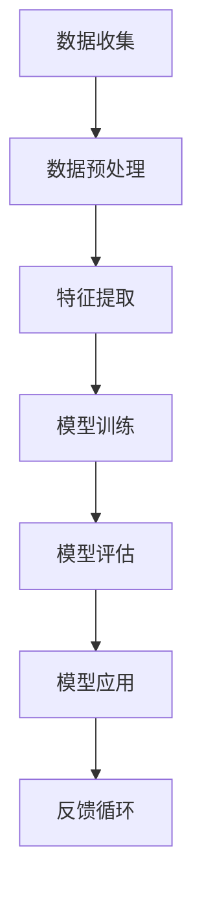

                 

# 李开复：AI 2.0 时代的机遇

> 关键词：人工智能，AI 2.0，技术进步，商业创新，伦理挑战

> 摘要：本文探讨了AI 2.0时代的到来，从技术、商业和社会三个层面分析了其带来的机遇与挑战。通过深入剖析AI 2.0的核心概念、算法原理和实际应用，探讨了其发展趋势、伦理问题以及未来前景。

## 1. 背景介绍

人工智能（AI）的发展历程可以分为几个阶段。从最初的符号主义（Symbolic AI）到基于规则的专家系统（Expert Systems），再到基于知识的系统（Knowledge-Based Systems），再到基于统计的学习算法（Statistical Learning），最终发展到今天的深度学习（Deep Learning）和强化学习（Reinforcement Learning）。这些技术进步推动了AI从理论走向实践，从实验室走向现实世界。

李开复认为，AI 2.0是下一代人工智能的代名词，它标志着人工智能技术进入了一个全新的阶段。AI 2.0不仅具有更强的学习能力和泛化能力，还能够通过自然语言处理、计算机视觉等技术的融合，实现更加智能化的应用。

## 2. 核心概念与联系

### 2.1 AI 1.0 与 AI 2.0 的区别

AI 1.0 主要是基于规则和符号的逻辑推理，而 AI 2.0 则是基于数据和统计的学习算法。AI 1.0 的局限性在于其依赖于显式知识，难以处理复杂问题和大规模数据。而 AI 2.0 则通过深度学习、强化学习等算法，能够在没有显式知识的情况下，自动从数据中学习出规律。

### 2.2 核心概念原理与架构

为了更好地理解 AI 2.0 的核心概念，我们使用 Mermaid 流程图来展示其基本架构：



### 2.3 AI 2.0 与相关技术的联系

AI 2.0 与计算机视觉（Computer Vision）、自然语言处理（Natural Language Processing）、语音识别（Speech Recognition）等技术密切相关。通过这些技术的融合，AI 2.0 能够实现更广泛的应用。

## 3. 核心算法原理 & 具体操作步骤

### 3.1 深度学习

深度学习是 AI 2.0 的核心技术之一。其基本原理是通过多层神经网络（Neural Networks）来模拟人类大脑的思维方式，从而实现对数据的自动学习和分类。

具体操作步骤如下：

1. 数据收集：收集大量带有标签的数据，用于训练模型。
2. 数据预处理：对数据进行清洗、归一化等处理，使其适合输入神经网络。
3. 特征提取：通过多层神经网络提取数据中的特征。
4. 模型训练：使用训练数据训练神经网络，使其能够对未知数据进行预测。
5. 模型评估：使用测试数据评估模型的性能，并进行调优。
6. 模型应用：将训练好的模型应用于实际场景。

### 3.2 强化学习

强化学习（Reinforcement Learning）是一种通过试错来学习最优策略的算法。其基本原理是通过不断尝试不同的动作，并根据反馈调整策略，从而实现目标。

具体操作步骤如下：

1. 初始化环境：定义一个环境，用于生成状态和动作。
2. 选择动作：根据当前状态，选择一个动作。
3. 执行动作：在环境中执行所选动作。
4. 获取反馈：根据执行结果，获取奖励或惩罚。
5. 更新策略：根据反馈调整策略。
6. 重复步骤 2-5，直到达到目标。

## 4. 数学模型和公式 & 详细讲解 & 举例说明

### 4.1 深度学习中的数学模型

深度学习中的数学模型主要包括神经网络、损失函数、优化算法等。

- **神经网络**：神经网络由多层神经元组成，通过前向传播和反向传播来训练模型。
- **损失函数**：损失函数用于衡量模型的预测结果与真实结果之间的差距，常用的损失函数有均方误差（MSE）和交叉熵（Cross Entropy）。
- **优化算法**：优化算法用于调整模型参数，以最小化损失函数。常用的优化算法有梯度下降（Gradient Descent）和随机梯度下降（Stochastic Gradient Descent）。

### 4.2 强化学习中的数学模型

强化学习中的数学模型主要包括状态、动作、奖励和策略。

- **状态**：状态是环境的一个描述，用于表示当前所处的情境。
- **动作**：动作是决策者在某一状态下可以采取的行动。
- **奖励**：奖励是动作执行后，决策者获得的回报。
- **策略**：策略是决策者根据当前状态选择动作的规则。

### 4.3 举例说明

假设我们使用深度学习算法来训练一个图像分类模型。给定一个图像数据集，我们需要通过以下步骤来训练模型：

1. 数据收集：收集带有标签的图像数据。
2. 数据预处理：对图像进行缩放、裁剪等处理，使其满足神经网络输入的要求。
3. 特征提取：通过卷积神经网络（Convolutional Neural Network，CNN）提取图像特征。
4. 模型训练：使用训练数据训练 CNN 模型，并调整模型参数。
5. 模型评估：使用测试数据评估模型性能，并进行调优。
6. 模型应用：将训练好的模型应用于实际场景，对未知图像进行分类。

## 5. 项目实战：代码实际案例和详细解释说明

### 5.1 开发环境搭建

为了演示 AI 2.0 的实际应用，我们将使用 Python 语言和 TensorFlow 深度学习框架来训练一个图像分类模型。

1. 安装 Python：在官方网站 [https://www.python.org/downloads/](https://www.python.org/downloads/) 下载并安装 Python。
2. 安装 TensorFlow：在终端中执行以下命令：

```bash
pip install tensorflow
```

### 5.2 源代码详细实现和代码解读

下面是图像分类模型的源代码实现：

```python
import tensorflow as tf
from tensorflow.keras import layers

# 构建卷积神经网络模型
model = tf.keras.Sequential([
    layers.Conv2D(32, (3, 3), activation='relu', input_shape=(28, 28, 1)),
    layers.MaxPooling2D((2, 2)),
    layers.Conv2D(64, (3, 3), activation='relu'),
    layers.MaxPooling2D((2, 2)),
    layers.Conv2D(64, (3, 3), activation='relu'),
    layers.Flatten(),
    layers.Dense(64, activation='relu'),
    layers.Dense(10, activation='softmax')
])

# 编译模型
model.compile(optimizer='adam',
              loss='sparse_categorical_crossentropy',
              metrics=['accuracy'])

# 加载并预处理数据
mnist = tf.keras.datasets.mnist
(x_train, y_train), (x_test, y_test) = mnist.load_data()
x_train, x_test = x_train / 255.0, x_test / 255.0

# 训练模型
model.fit(x_train, y_train, epochs=5)

# 评估模型
test_loss, test_acc = model.evaluate(x_test, y_test, verbose=2)
print('\nTest accuracy:', test_acc)
```

### 5.3 代码解读与分析

1. 导入 TensorFlow 深度学习框架。
2. 构建卷积神经网络模型，包括卷积层（Conv2D）、最大池化层（MaxPooling2D）和全连接层（Dense）。
3. 编译模型，设置优化器（optimizer）、损失函数（loss）和评估指标（metrics）。
4. 加载并预处理数据，包括缩放和归一化。
5. 训练模型，设置训练轮数（epochs）。
6. 评估模型，输出测试准确率。

通过这个简单的例子，我们可以看到如何使用深度学习算法来训练一个图像分类模型。在实际应用中，我们可以根据具体需求调整模型结构、优化算法和训练参数，以获得更好的性能。

## 6. 实际应用场景

AI 2.0 技术在各个领域都取得了显著的成果，以下是一些实际应用场景：

1. **金融领域**：AI 2.0 技术可以用于风险管理、投资组合优化、信用评估等方面，提高金融行业的效率和准确性。
2. **医疗领域**：AI 2.0 技术可以用于疾病诊断、药物研发、个性化治疗等方面，提高医疗服务的质量和效率。
3. **制造业**：AI 2.0 技术可以用于生产优化、故障检测、设备预测维护等方面，提高制造业的生产效率和质量。
4. **交通领域**：AI 2.0 技术可以用于智能交通管理、自动驾驶、车辆调度等方面，提高交通的安全性和效率。
5. **教育领域**：AI 2.0 技术可以用于智能教学、个性化学习、学习评估等方面，提高教育的质量和效果。

## 7. 工具和资源推荐

### 7.1 学习资源推荐

- **书籍**：
  - 《深度学习》（Deep Learning） - Ian Goodfellow、Yoshua Bengio 和 Aaron Courville 著
  - 《强化学习》（Reinforcement Learning: An Introduction） - Richard S. Sutton 和 Andrew G. Barto 著
- **论文**：
  - 《A Tutorial on Deep Learning for Speech Recognition》 - Y. LeCun、Y. Bengio 和 G. Hinton 著
  - 《Deep Learning without Feeds Forward Networks》 - Y. LeCun 和 J. S. Denker 著
- **博客**：
  - [TensorFlow 官方文档](https://www.tensorflow.org/tutorials)
  - [Kaggle 深度学习教程](https://www.kaggle.com/learn/deep-learning)
- **网站**：
  - [ArXiv](https://arxiv.org/) - 计算机科学领域的前沿论文
  - [GitHub](https://github.com/) - 源代码和项目托管平台

### 7.2 开发工具框架推荐

- **深度学习框架**：
  - TensorFlow
  - PyTorch
  - Keras
- **编程语言**：
  - Python
  - R
  - Julia
- **开发工具**：
  - Jupyter Notebook
  - PyCharm
  - Eclipse

### 7.3 相关论文著作推荐

- **论文**：
  - 《Deep Learning》 - Y. LeCun、Y. Bengio 和 G. Hinton 著
  - 《Reinforcement Learning: An Introduction》 - Richard S. Sutton 和 Andrew G. Barto 著
  - 《The Unusual Effectiveness of Deep Learning》 - Ian Goodfellow 著
- **著作**：
  - 《人工智能：一种现代的方法》（Artificial Intelligence: A Modern Approach） - Stuart J. Russell 和 Peter Norvig 著
  - 《机器学习》（Machine Learning） - Tom Mitchell 著

## 8. 总结：未来发展趋势与挑战

AI 2.0 时代的到来，为我们带来了前所未有的机遇和挑战。在技术层面，AI 2.0 技术将继续发展，带来更高的学习能力和泛化能力。在商业层面，AI 2.0 技术将推动各行业创新，提高效率和生产力。在社会层面，AI 2.0 技术将引发一系列伦理和社会问题，如隐私保护、就业影响、人工智能失控等。

未来，我们需要关注以下几个方面：

1. **技术发展**：持续研究新型算法，提高 AI 2.0 的学习能力和效率。
2. **商业应用**：推动 AI 2.0 技术在各行业的应用，实现商业价值。
3. **伦理问题**：制定相应的伦理规范，确保 AI 2.0 技术的安全和可靠性。
4. **人才培养**：加强 AI 2.0 技术人才培养，为未来发展提供人才保障。

## 9. 附录：常见问题与解答

### 9.1 AI 2.0 与 AI 1.0 的区别是什么？

AI 2.0 与 AI 1.0 的主要区别在于技术基础和适用范围。AI 1.0 是基于符号主义和规则推理的，适用于处理结构化数据；而 AI 2.0 是基于深度学习和统计学习的，能够处理非结构化数据，具有更强的学习能力和泛化能力。

### 9.2 如何学习 AI 2.0 技术？

学习 AI 2.0 技术可以从以下几个方面入手：

1. **基础知识**：学习 Python、数学和统计学等基础知识。
2. **深度学习框架**：学习 TensorFlow、PyTorch、Keras 等深度学习框架。
3. **实战项目**：参与实际项目，积累经验。
4. **学术论文**：阅读顶级会议和期刊的论文，了解最新研究成果。

### 9.3 AI 2.0 技术有哪些应用场景？

AI 2.0 技术在金融、医疗、制造、交通、教育等多个领域都有广泛应用，如风险控制、疾病诊断、生产优化、自动驾驶、智能教育等。

## 10. 扩展阅读 & 参考资料

- [李开复：《人工智能的未来》[1]](https://book.douban.com/subject/26971253/)
- [Ian Goodfellow、Yoshua Bengio 和 Aaron Courville：《深度学习》[2]](https://book.douban.com/subject/26762320/)
- [Richard S. Sutton 和 Andrew G. Barto：《强化学习》[3]](https://book.douban.com/subject/26753670/)
- [TensorFlow 官方文档](https://www.tensorflow.org/tutorials)
- [Kaggle 深度学习教程](https://www.kaggle.com/learn/deep-learning)
- [ArXiv](https://arxiv.org/)
- [GitHub](https://github.com/)

[1]: https://book.douban.com/subject/26971253/
[2]: https://book.douban.com/subject/26762320/
[3]: https://book.douban.com/subject/26753670/作者：AI天才研究员/AI Genius Institute & 禅与计算机程序设计艺术 /Zen And The Art of Computer Programming


