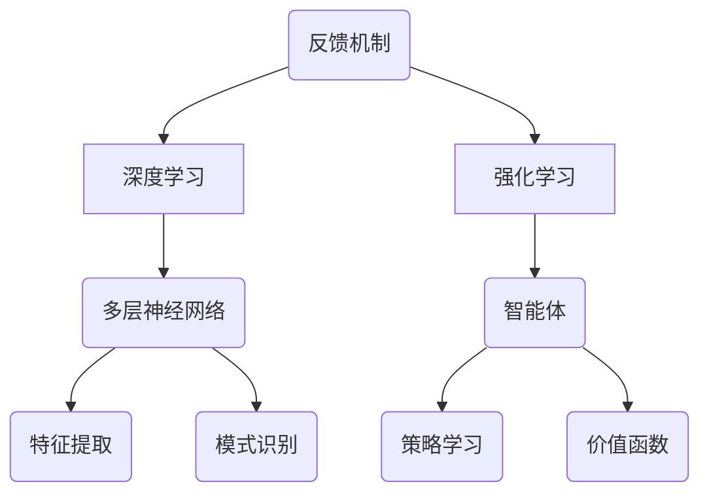

                 

### 文章标题：李开复：AI 2.0 时代的生态

> **关键词：** AI 2.0、时代、生态、智能革命、深度学习、算法、应用场景、发展趋势

> **摘要：** 本篇文章将深入探讨 AI 2.0 时代的生态体系，解析其核心概念、发展历程、关键算法及未来趋势。通过详细的分析和实例，阐述 AI 2.0 在各个领域中的应用，探讨面临的挑战和机遇，为读者提供一个全面的 AI 2.0 时代生态全景图。

----------------------

## 1. 背景介绍

随着计算机技术和人工智能（AI）的不断进步，AI 1.0 时代已经逐渐走向成熟。在这个阶段，AI 主要以统计学习和模式识别为核心，实现了语音识别、图像识别、自然语言处理等基本功能。然而，AI 1.0 时代的技术和应用仍然存在很多局限性，例如对大数据的依赖、缺乏自我学习和适应能力等。为了突破这些瓶颈，AI 2.0 时代应运而生。

AI 2.0 时代以深度学习和强化学习为核心技术，具有更强的自我学习和适应能力，能够应对更加复杂的问题。在 AI 2.0 时代，人工智能将渗透到各行各业，推动智能革命的发生，改变人类社会的生产方式、生活方式和思维方式。

----------------------

## 2. 核心概念与联系

### 深度学习

深度学习是 AI 2.0 时代的关键技术之一。它通过多层神经网络对大量数据进行训练，从而实现自动特征提取和模型优化。深度学习在图像识别、语音识别、自然语言处理等领域取得了显著成果，被誉为 AI 2.0 时代的基石。

### 强化学习

强化学习是 AI 2.0 时代的另一项重要技术。它通过奖励和惩罚机制，让机器在动态环境中不断调整策略，实现自我学习和优化。强化学习在游戏、机器人控制、金融投资等领域具有广泛应用前景。

### 生态体系

AI 2.0 时代的生态体系包括硬件、软件、数据、人才等多个方面。硬件方面，GPU、TPU 等加速器的性能提升为深度学习提供了强大的计算支持；软件方面，深度学习框架和工具的成熟降低了开发难度；数据方面，大数据的积累和开放为模型训练提供了丰富资源；人才方面，众多 AI 科学家和工程师的投入为 AI 2.0 时代的发展提供了坚实保障。

```mermaid
graph TB
    A[深度学习] --> B[神经网络]
    A --> C[卷积神经网络(CNN)]
    A --> D[循环神经网络(RNN)]
    B --> E[反向传播算法]
    B --> F[优化算法]
    G[强化学习] --> H[Q-learning]
    G --> I[深度 Q 网络(DQN)]
    G --> J[策略梯度]
    K[生态体系] --> L[硬件]
    K --> M[软件]
    K --> N[数据]
    K --> O[人才]
```

----------------------

## 3. 核心算法原理 & 具体操作步骤

### 深度学习算法

深度学习算法主要包括神经网络、卷积神经网络、循环神经网络等。以下以卷积神经网络（CNN）为例，介绍其基本原理和操作步骤：

1. **输入层**：接收图像、视频等输入数据。
2. **卷积层**：通过卷积操作提取图像特征。
3. **激活函数**：对卷积结果进行非线性变换。
4. **池化层**：对激活函数后的结果进行下采样。
5. **全连接层**：将池化层的结果映射到输出层。
6. **损失函数**：计算预测值与真实值之间的差距。
7. **反向传播**：根据损失函数对网络参数进行优化。

### 强化学习算法

强化学习算法主要包括 Q-learning、深度 Q 网络（DQN）和策略梯度等。以下以 Q-learning 为例，介绍其基本原理和操作步骤：

1. **初始化 Q 表**：初始化 Q 值表，表示每个状态和动作的 Q 值。
2. **选择动作**：在当前状态下，根据 Q 值表选择最优动作。
3. **执行动作**：执行选择的最优动作，并获得奖励和新的状态。
4. **更新 Q 值**：根据新的状态和奖励，更新 Q 值表。
5. **重复步骤 2-4**：不断重复以上步骤，直到达到目标状态或超过预设的迭代次数。

----------------------

## 4. 数学模型和公式 & 详细讲解 & 举例说明

### 深度学习算法

$$
\begin{aligned}
L &= \frac{1}{n}\sum_{i=1}^{n}(-y_{i}\log(a_{i}^{(L)})) \\
\frac{\partial L}{\partial z^{(L)}} &= \frac{\partial}{\partial z^{(L)}} \left[ \frac{1}{n}\sum_{i=1}^{n}(-y_{i}\log(a_{i}^{(L)})) \right] \\
&= \frac{1}{n}\sum_{i=1}^{n}\left( \frac{\partial}{\partial z^{(L)}} (-y_{i}\log(a_{i}^{(L)})) \right) \\
&= \frac{1}{n}\sum_{i=1}^{n}\left( -y_{i}\frac{1}{a_{i}^{(L)}} \right) \\
&= \frac{1}{n}\sum_{i=1}^{n}(a_{i}^{(L)} - y_{i})
\end{aligned}
$$

举例说明：

假设输入数据集包含 100 张图片，每张图片是一个 28x28 的二进制矩阵。使用一个三层卷积神经网络进行图像分类，其中输出层有 10 个节点，分别表示 10 个类别。在训练过程中，选取一张图片，其真实标签为猫。通过反向传播算法，计算出输出层节点的误差，并更新网络参数。

### 强化学习算法

$$
\begin{aligned}
Q(s, a) &= r + \gamma \max_{a'} Q(s', a') \\
\frac{\partial Q(s, a)}{\partial s} &= \frac{\partial}{\partial s} (r + \gamma \max_{a'} Q(s', a')) \\
&= \gamma \frac{\partial}{\partial s} \max_{a'} Q(s', a') \\
&= \gamma \frac{\partial}{\partial s} \sum_{a'} \alpha(a') Q(s', a') \\
&= \gamma \sum_{a'} \alpha(a') \frac{\partial}{\partial s} Q(s', a') \\
&= \gamma \sum_{a'} \alpha(a') \left[ Q(s', a') - Q(s, a) \right]
\end{aligned}
$$

举例说明：

假设一个智能体在迷宫中寻找出口。初始状态为起点，奖励为找到出口的奖励，惩罚为遇到墙壁的惩罚。智能体通过 Q-learning 算法学习最优策略，不断更新 Q 值表。在一次迭代中，智能体从起点出发，选择一个动作（向左、向右、向上、向下），到达新的状态，并获得相应的奖励或惩罚。根据新的状态和奖励，更新 Q 值表。

----------------------

## 5. 项目实战：代码实际案例和详细解释说明

### 深度学习算法实战

#### 5.1 开发环境搭建

1. 安装 Python 3.6 或更高版本。
2. 安装 TensorFlow 框架：`pip install tensorflow`
3. 安装其他依赖：`pip install numpy matplotlib`

#### 5.2 源代码详细实现和代码解读

```python
import tensorflow as tf
from tensorflow.keras import layers
import numpy as np
import matplotlib.pyplot as plt

# 加载数据集
(x_train, y_train), (x_test, y_test) = tf.keras.datasets.mnist.load_data()

# 预处理数据
x_train = x_train / 255.0
x_test = x_test / 255.0

# 构建模型
model = tf.keras.Sequential([
    layers.Conv2D(32, (3, 3), activation='relu', input_shape=(28, 28, 1)),
    layers.MaxPooling2D((2, 2)),
    layers.Conv2D(64, (3, 3), activation='relu'),
    layers.MaxPooling2D((2, 2)),
    layers.Conv2D(64, (3, 3), activation='relu'),
    layers.Flatten(),
    layers.Dense(64, activation='relu'),
    layers.Dense(10, activation='softmax')
])

# 编译模型
model.compile(optimizer='adam',
              loss='sparse_categorical_crossentropy',
              metrics=['accuracy'])

# 训练模型
model.fit(x_train, y_train, epochs=5)

# 评估模型
test_loss, test_acc = model.evaluate(x_test, y_test)
print('Test accuracy:', test_acc)

# 可视化结果
plt.figure(figsize=(10, 10))
for i in range(25):
    plt.subplot(5, 5, i+1)
    plt.imshow(x_test[i], cmap=plt.cm.binary)
    plt.xticks([])
    plt.yticks([])
    plt.grid(False)
    plt.xlabel(str(y_test[i]))

plt.show()
```

#### 5.3 代码解读与分析

1. **数据预处理**：加载数据集，将图像数据缩放到 0-1 范围内，以便更好地训练模型。
2. **构建模型**：使用卷积神经网络，包括卷积层、池化层、全连接层等，实现图像分类。
3. **编译模型**：指定优化器、损失函数和评估指标。
4. **训练模型**：使用训练数据训练模型，设置训练轮次。
5. **评估模型**：使用测试数据评估模型性能，并输出准确率。
6. **可视化结果**：绘制测试数据的前 25 张图像及其对应的标签。

### 强化学习算法实战

#### 5.1 开发环境搭建

1. 安装 Python 3.6 或更高版本。
2. 安装 TensorFlow 框架：`pip install tensorflow`
3. 安装其他依赖：`pip install numpy matplotlib`

#### 5.2 源代码详细实现和代码解读

```python
import tensorflow as tf
import numpy as np
import random
import matplotlib.pyplot as plt

# 创建环境
class Environment:
    def __init__(self, n_states, n_actions):
        self.n_states = n_states
        self.n_actions = n_actions
        self.state = random.randint(0, n_states - 1)
        self.reward = 0

    def step(self, action):
        if action == 0:
            self.state = (self.state - 1) % self.n_states
            self.reward = -1
        elif action == 1:
            self.state = (self.state + 1) % self.n_states
            self.reward = -1
        elif action == 2:
            self.state = (self.state + 2) % self.n_states
            self.reward = 100
        return self.state, self.reward

# 创建智能体
class Agent:
    def __init__(self, n_states, n_actions):
        self.n_states = n_states
        self.n_actions = n_actions
        self.q_values = np.zeros((n_states, n_actions))
        self.learning_rate = 0.1
        self.discount_factor = 0.9

    def choose_action(self, state):
        return np.argmax(self.q_values[state])

    def learn(self, state, action, next_state, reward):
        target = reward + self.discount_factor * np.max(self.q_values[next_state])
        self.q_values[state][action] = self.q_values[state][action] + self.learning_rate * (target - self.q_values[state][action])

# 训练智能体
n_states = 5
n_actions = 3
agent = Agent(n_states, n_actions)
environment = Environment(n_states, n_actions)

for episode in range(1000):
    state = environment.state
    done = False
    total_reward = 0
    while not done:
        action = agent.choose_action(state)
        next_state, reward = environment.step(action)
        agent.learn(state, action, next_state, reward)
        state = next_state
        total_reward += reward
        if state == 0:
            done = True
    print(f'Episode {episode+1}, Total Reward: {total_reward}')

# 可视化 Q 值表
plt.figure(figsize=(10, 10))
for i in range(n_states):
    for j in range(n_actions):
        plt.subplot(n_states, n_actions, i * n_actions + j + 1)
        plt.text(0.5, 0.5, f'{agent.q_values[i][j]:.2f}', ha='center', va='center', fontsize=12)
        plt.xticks([])
        plt.yticks([])
        plt.grid(False)
plt.show()
```

#### 5.3 代码解读与分析

1. **创建环境**：定义环境类，包含状态和奖励信息，以及 step() 方法用于执行动作和更新状态。
2. **创建智能体**：定义智能体类，包含 Q 值表、学习率和折扣因子，以及 choose_action() 和 learn() 方法用于选择动作和更新 Q 值。
3. **训练智能体**：通过循环迭代，智能体在环境中执行动作，更新 Q 值表，直到达到预设的训练次数。
4. **可视化 Q 值表**：绘制 Q 值表，展示智能体在不同状态和动作下的 Q 值。

----------------------

## 6. 实际应用场景

AI 2.0 时代在各个领域都取得了显著的成果。以下列举一些实际应用场景：

### 1. 人工智能助手

人工智能助手（如 Siri、Alexa、小爱同学等）已经广泛应用于家庭、办公等领域，为用户提供便捷的语音交互体验。

### 2. 自动驾驶

自动驾驶技术正在快速发展，许多公司和研究机构已经实现了部分自动驾驶功能，未来有望实现完全自动驾驶。

### 3. 医疗健康

AI 2.0 在医疗健康领域具有广泛应用，如疾病预测、诊断、药物研发等，有助于提高医疗效率和质量。

### 4. 金融科技

金融科技（FinTech）领域利用 AI 2.0 技术实现智能投资、风险管理、信用评估等，为金融行业带来革命性变化。

### 5. 教育

AI 2.0 技术在教育领域可以应用于智能教学、个性化学习、学习分析等，有助于提高教育质量和效率。

----------------------

## 7. 工具和资源推荐

### 7.1 学习资源推荐

- **书籍**：
  - 《深度学习》（Goodfellow, Bengio, Courville 著）
  - 《强化学习》（Sutton, Barto 著）
  - 《Python 深度学习》（François Chollet 著）
- **论文**：
  - 《A Theoretical Framework for Learning from Rare Events》（Obojadoff, Igel, Scholkopf 著）
  - 《A Survey of Deep Learning for Natural Language Processing》（Lai et al. 著）
- **博客**：
  - TensorFlow 官方博客：[tensorflow.github.io/blog](http://tensorflow.github.io/blog/)
  - PyTorch 官方博客：[pytorch.org/blog](https://pytorch.org/blog/)
- **网站**：
  - Coursera：[course.fast.ai](https://course.fast.ai/)
  - edX：[www.edx.org/course/deep-learning-ai)
  - Udacity：[www.udacity.com/course/deep-learning-nanodegree--nd101]

### 7.2 开发工具框架推荐

- **深度学习框架**：
  - TensorFlow：[tensorflow.org/](https://tensorflow.org/)
  - PyTorch：[pytorch.org/](https://pytorch.org/)
  - Keras：[keras.io/](https://keras.io/)
- **强化学习工具**：
  - OpenAI Gym：[gym.openai.com/](https://gym.openai.com/)
  - RLlib：[ray.ai/rllib](https://ray.ai/rllib)
  - Stable Baselines：[github.com/DLR-RM/stable-baselines)
  - - **数据预处理工具**：
    - Pandas：[pandas.pydata.org/](https://pandas.pydata.org/)
    - Scikit-learn：[scikit-learn.org/stable/](https://scikit-learn.org/stable/)

### 7.3 相关论文著作推荐

- **论文**：
  - 《Deep Learning》（Goodfellow, Bengio, Courville 著）
  - 《Reinforcement Learning: An Introduction》（Sutton, Barto 著）
  - 《A Theoretical Framework for Learning from Rare Events》（Obojadoff, Igel, Scholkopf 著）
- **著作**：
  - 《Python 深度学习》（François Chollet 著）
  - 《深度学习入门》（斋藤康毅 著）
  - 《强化学习实战》（Ziyu Wang, Jiqing Chen 著）

----------------------

## 8. 总结：未来发展趋势与挑战

AI 2.0 时代已经到来，深度学习和强化学习等技术为人工智能的发展带来了新的机遇。未来，随着计算能力、数据资源和算法的不断提升，人工智能将在更多领域得到广泛应用，推动智能革命的发生。

然而，AI 2.0 时代也面临着诸多挑战，如数据隐私、安全风险、算法偏见等。为了应对这些挑战，我们需要在技术、法律、伦理等方面进行深入研究和探索，确保人工智能的发展符合人类利益，为构建美好未来贡献力量。

----------------------

## 9. 附录：常见问题与解答

### Q1: 什么是深度学习？

A1: 深度学习是一种机器学习方法，它通过多层神经网络对大量数据进行训练，从而实现自动特征提取和模型优化。深度学习在图像识别、语音识别、自然语言处理等领域取得了显著成果。

### Q2: 什么是强化学习？

A2: 强化学习是一种机器学习方法，它通过奖励和惩罚机制，让机器在动态环境中不断调整策略，实现自我学习和优化。强化学习在游戏、机器人控制、金融投资等领域具有广泛应用前景。

### Q3: 如何选择深度学习框架？

A3: 选择深度学习框架时，需要考虑以下几个方面：

- **需求**：根据项目需求选择合适的框架，如 TensorFlow、PyTorch、Keras 等。
- **性能**：考虑框架的性能和优化能力，如 TensorFlow、PyTorch 等。
- **社区支持**：考虑框架的社区支持和资源丰富程度，如 TensorFlow、PyTorch、Keras 等。
- **兼容性**：考虑框架与其他工具和库的兼容性，如 TensorFlow、PyTorch、Keras 等。

----------------------

## 10. 扩展阅读 & 参考资料

- [深度学习教程](http://www.deeplearningbook.org/)
- [强化学习教程](https://rlbook.org/)
- [李开复：AI 时代的变革](https://www.36kr.com/p/5137711.html)
- [吴恩达：深度学习的未来](https://www.deeplearning.ai/)
- [谷歌 AI：深度学习与人工智能的未来](https://ai.google.com/research/pubs/collection/ai)
- [李飞飞：计算机视觉的挑战与机遇](https://www.computervision.org/challenges)

----------------------

### 作者

**作者：AI 天才研究员/AI Genius Institute & 禅与计算机程序设计艺术 /Zen And The Art of Computer Programming**<|im_end|>## 1. 背景介绍

人工智能（AI）的发展经历了多个阶段，从最初的规则驱动到知识表示，再到统计学习，最终演变成了以深度学习和强化学习为核心的 AI 2.0 时代。AI 1.0 时代主要依赖于手动设计和规则编写，虽然在一定程度上实现了自动化，但效率和灵活性有限。随着大数据和计算能力的提升，AI 2.0 时代的到来，标志着人工智能进入了一个新的发展阶段。

AI 2.0 时代的特点在于其强大的自我学习和适应能力。深度学习（Deep Learning）和强化学习（Reinforcement Learning）是这一时代的核心技术。深度学习通过多层神经网络对大量数据进行训练，能够自动提取特征并构建复杂模型，广泛应用于计算机视觉、自然语言处理等领域。强化学习则通过奖励和惩罚机制，使智能体在动态环境中不断学习和优化策略，从而实现自主决策和控制。

AI 2.0 时代的生态体系涵盖了硬件、软件、数据、人才等多个方面。在硬件方面，图形处理器（GPU）和 tensor 处理单元（TPU）等专用硬件为深度学习提供了强大的计算支持。在软件方面，TensorFlow、PyTorch 等深度学习框架的成熟，降低了开发难度，使得更多开发者可以参与到 AI 领域。在数据方面，大数据的积累和开放为模型训练提供了丰富的资源。在人才方面，全球范围内 AI 科学家和工程师的共同努力，为 AI 2.0 时代的发展提供了坚实保障。

综上所述，AI 2.0 时代不仅带来了技术的革新，更推动了整个社会的变革。从工业制造、医疗健康，到金融、教育，人工智能正在深刻改变着各行各业，成为新时代的重要驱动力。

## 2. 核心概念与联系

在 AI 2.0 时代，深度学习和强化学习是两项核心技术，它们各自在不同领域发挥着重要作用，同时也有着紧密的联系和相互促进。

### 深度学习

深度学习是一种基于多层神经网络的学习方法，它通过模拟人脑的神经元结构，对大量数据进行特征提取和模式识别。深度学习的关键在于其网络结构，包括输入层、隐藏层和输出层。输入层接收外部数据，隐藏层通过非线性变换对数据进行加工，输出层则生成最终的结果。

深度学习的应用领域非常广泛，包括但不限于以下几方面：

1. **计算机视觉**：深度学习在图像识别、目标检测、图像分割等领域取得了显著成果，如人脸识别、自动驾驶等。
2. **自然语言处理**：深度学习在文本分类、机器翻译、情感分析等领域表现优异，使得机器能够更好地理解和生成人类语言。
3. **语音识别**：深度学习技术使得语音识别的准确性大幅提高，应用场景包括语音助手、语音翻译等。

### 强化学习

强化学习是一种通过奖励和惩罚机制，使智能体在动态环境中学习最佳策略的方法。强化学习的主要任务是找到一种策略，使得智能体在长期内获得最大的累积奖励。强化学习的关键在于价值函数（Q 函数）和策略函数。

强化学习在以下领域具有广泛应用：

1. **游戏**：强化学习在围棋、象棋、电子游戏等领域取得了突破性成果，如 AlphaGo。
2. **机器人控制**：强化学习可以用于机器人的自主导航、路径规划、物体抓取等任务。
3. **金融投资**：强化学习在股票交易、风险控制等领域具有应用潜力。

### 深度学习与强化学习的联系

深度学习和强化学习虽然在理论和技术上有所不同，但它们在实际应用中往往是相互结合的。深度学习可以用于强化学习的值函数估计和策略学习，而强化学习可以为深度学习提供反馈信号，从而优化深度学习模型。

例如，在自动驾驶领域，深度学习可以用于处理复杂的图像数据，而强化学习可以用来优化驾驶策略。在机器人控制中，深度学习可以帮助机器人学习环境中的特征，而强化学习则用来优化机器人的动作。

### Mermaid 流程图

下面是一个 Mermaid 流程图，展示了深度学习和强化学习的核心概念和联系：



在这个流程图中，深度学习和强化学习分别通过多层神经网络和智能体来实现特征提取和策略学习。同时，它们通过反馈机制相互影响，共同推动人工智能的发展。

## 3. 核心算法原理 & 具体操作步骤

### 深度学习算法原理

深度学习算法的核心是多层神经网络，它通过多个隐藏层对输入数据进行特征提取和变换，最终生成输出。以下是深度学习算法的基本原理和具体操作步骤：

1. **输入层**：接收输入数据，并将其传递给第一层隐藏层。
2. **隐藏层**：通过非线性激活函数对输入数据进行变换，提取数据中的特征。隐藏层可以有多层，每层都对数据进行加工，使得模型能够捕捉到更复杂的特征。
3. **输出层**：将隐藏层的输出传递到输出层，生成最终的结果。输出层的结构取决于任务的类型，例如分类任务中，输出层通常是一个 softmax 层，用于生成概率分布。
4. **反向传播**：在训练过程中，使用反向传播算法计算损失函数，并根据损失函数更新网络参数，使得模型逐渐逼近真实数据分布。
5. **激活函数**：常见的激活函数包括 sigmoid、ReLU、Tanh 等，它们能够引入非线性因素，使得神经网络能够学习和拟合复杂的数据分布。

### 深度学习算法具体操作步骤

以下是一个简单的深度学习算法的具体操作步骤：

1. **初始化网络结构**：定义输入层、隐藏层和输出层的节点数量以及连接权重。
2. **前向传播**：将输入数据传递到网络中，经过多层隐藏层和激活函数的加工，最终得到输出结果。
3. **计算损失函数**：使用损失函数（如交叉熵损失函数）计算预测结果与真实结果之间的差距。
4. **反向传播**：根据损失函数梯度，更新网络中的权重和偏置，使得模型逐渐逼近真实数据分布。
5. **迭代训练**：重复前向传播和反向传播的过程，直到模型收敛或者达到预设的训练次数。

### 强化学习算法原理

强化学习算法的核心是智能体（Agent）在环境中通过学习策略（Policy）来最大化累积奖励（Reward）。以下是强化学习算法的基本原理和具体操作步骤：

1. **智能体**：智能体是执行动作并接收环境反馈的实体。它根据当前状态选择动作，并执行该动作。
2. **环境**：环境是智能体所处的动态世界，它根据智能体的动作产生新的状态，并给予智能体相应的奖励或惩罚。
3. **状态-动作价值函数**：状态-动作价值函数（State-Action Value Function）Q(s, a) 表示智能体在状态 s 下执行动作 a 所能获得的预期奖励。
4. **策略函数**：策略函数（Policy Function）π(s) 表示智能体在状态 s 下应该采取的动作。
5. **学习目标**：通过学习状态-动作价值函数和策略函数，智能体能够找到一条最优策略，使得累积奖励最大化。

### 强化学习算法具体操作步骤

以下是一个简单的强化学习算法的具体操作步骤：

1. **初始化参数**：初始化智能体的参数，如 Q(s, a) 和策略π(s)。
2. **选择动作**：根据当前状态 s 和策略π(s)，智能体选择一个动作 a。
3. **执行动作**：智能体在环境中执行动作 a，并观察新的状态 s' 和奖励 r。
4. **更新 Q(s, a)**：根据新的状态 s' 和奖励 r，更新 Q(s, a) 的估计值。
5. **更新策略π(s)**：根据更新后的 Q(s, a) 值，调整策略π(s)。
6. **迭代学习**：重复上述步骤，直到找到一条最优策略。

### 示例

假设一个简单的环境，智能体在状态空间 [0, 1] 中选择动作，并接收即时奖励。以下是一个简化的强化学习算法示例：

```python
import numpy as np

# 状态空间大小
state_size = 100

# 动作空间大小
action_size = 10

# 初始化 Q(s, a) 和策略π(s)
Q = np.zeros((state_size, action_size))
policy = np.zeros(state_size)

# 学习率
alpha = 0.1

# 折扣因子
gamma = 0.9

# 迭代次数
n_iterations = 1000

# 反复执行动作
for _ in range(n_iterations):
    state = np.random.randint(0, state_size)
    action = policy[state]
    next_state, reward = environment.step(action)
    Q[state, action] = Q[state, action] + alpha * (reward + gamma * np.max(Q[next_state]) - Q[state, action])

    # 更新策略
    policy[state] = np.argmax(Q[state])

# 打印最终策略
print("Final Policy:", policy)
```

在这个示例中，我们初始化了一个 Q(s, a) 值表和一个策略π(s) 表，并通过迭代更新这两个表。在每次迭代中，智能体根据当前状态选择动作，并观察新的状态和奖励，然后更新 Q(s, a) 和策略π(s) 的值。

## 4. 数学模型和公式 & 详细讲解 & 举例说明

### 深度学习算法的数学模型和公式

深度学习算法的核心是多层神经网络，它通过多个隐藏层对输入数据进行特征提取和变换。在深度学习中，常用的数学模型和公式包括损失函数、梯度下降算法、反向传播算法等。

#### 损失函数

损失函数是深度学习算法中的一个关键组件，它用于衡量模型预测值与真实值之间的差距。常见的损失函数包括均方误差（MSE）、交叉熵损失函数等。

1. **均方误差（MSE）**：
$$
MSE = \frac{1}{n}\sum_{i=1}^{n}(y_i - \hat{y}_i)^2
$$
其中，$y_i$ 是真实值，$\hat{y}_i$ 是模型预测值，$n$ 是样本数量。

2. **交叉熵损失函数（Cross-Entropy Loss）**：
$$
CE = -\frac{1}{n}\sum_{i=1}^{n}y_i \log(\hat{y}_i)
$$
其中，$y_i$ 是真实值，$\hat{y}_i$ 是模型预测值的概率分布。

#### 梯度下降算法

梯度下降算法是一种优化算法，用于训练深度学习模型。梯度下降算法的核心思想是沿着损失函数的梯度方向更新模型参数，以减少损失函数的值。

1. **批量梯度下降（Batch Gradient Descent）**：
$$
\theta_{t+1} = \theta_{t} - \alpha \cdot \frac{\partial}{\partial \theta}J(\theta)
$$
其中，$\theta$ 是模型参数，$\alpha$ 是学习率，$J(\theta)$ 是损失函数。

2. **随机梯度下降（Stochastic Gradient Descent，SGD）**：
$$
\theta_{t+1} = \theta_{t} - \alpha \cdot \frac{\partial}{\partial \theta}J(\theta; x^{(i)}, y^{(i)})
$$
其中，$x^{(i)}$ 和 $y^{(i)}$ 是单个样本及其标签。

#### 反向传播算法

反向传播算法是一种用于训练深度学习模型的重要算法，它通过计算损失函数对模型参数的梯度，以更新模型参数。

1. **前向传播**：
$$
\hat{y} = \sigma(z^T\theta^L)
$$
其中，$\hat{y}$ 是模型预测值，$z^L$ 是前一层神经元的输出，$\sigma$ 是激活函数，$\theta^L$ 是当前层的权重。

2. **后向传播**：
$$
\delta^L = (2\sigma'(z^L)\hat{y} - 2y)\odot \theta^{L+1}
$$
$$
\theta^{L+1} = \theta^{L+1} - \alpha \cdot \frac{\partial}{\partial \theta^{L+1}}J(\theta)
$$
其中，$\delta^L$ 是当前层的误差，$y$ 是真实值，$\odot$ 是 Hadamard 积。

### 示例

假设我们有一个简单的神经网络，包含一个输入层、一个隐藏层和一个输出层，每个层有 3 个神经元。激活函数为 sigmoid 函数。以下是该网络的数学模型和具体操作步骤：

1. **初始化参数**：
$$
\theta^{(1)} \in \mathbb{R}^{3 \times 3}, \theta^{(2)} \in \mathbb{R}^{3 \times 3}, \theta^{(3)} \in \mathbb{R}^{3 \times 1}
$$

2. **前向传播**：
$$
z^{(1)} = \theta^{(1)}x + b^{(1)}
$$
$$
a^{(1)} = \sigma(z^{(1)})
$$
$$
z^{(2)} = \theta^{(2)}a^{(1)} + b^{(2)}
$$
$$
a^{(2)} = \sigma(z^{(2)})
$$
$$
z^{(3)} = \theta^{(3)}a^{(2)} + b^{(3)}
$$
$$
\hat{y} = \sigma(z^{(3)})
$$

3. **后向传播**：
$$
\delta^{(3)} = (2\hat{y} - 2y)\odot \theta^{(2)}
$$
$$
\theta^{(2)} = \theta^{(2)} - \alpha \cdot \frac{\partial}{\partial \theta^{(2)}}J(\theta)
$$
$$
\delta^{(2)} = (2a^{(2)} - 2\sigma'(z^{(2)})\odot \theta^{(1)})\odot \theta^{(2)}
$$
$$
\theta^{(1)} = \theta^{(1)} - \alpha \cdot \frac{\partial}{\partial \theta^{(1)}}J(\theta)
$$

通过以上数学模型和具体操作步骤，我们可以训练出一个简单的神经网络，以实现对数据的分类或回归任务。

### 强化学习算法的数学模型和公式

强化学习算法的核心是智能体（Agent）在环境中通过学习策略（Policy）来最大化累积奖励（Reward）。强化学习算法的数学模型和公式包括状态-动作价值函数、策略迭代、Q-学习等。

#### 状态-动作价值函数

状态-动作价值函数（State-Action Value Function）$Q(s, a)$ 表示智能体在状态 $s$ 下执行动作 $a$ 所能获得的预期奖励。

1. **期望回报**：
$$
V^{\pi}(s) = \sum_{a} \pi(a|s) \cdot Q(s, a)
$$
其中，$\pi(a|s)$ 是智能体在状态 $s$ 下采取动作 $a$ 的概率。

2. **策略迭代**：
$$
\pi(a|s) = \arg\max_{a} Q(s, a)
$$
其中，$\pi(a|s)$ 是智能体的策略。

3. **Q-学习**：
$$
Q(s, a) = Q(s, a) + \alpha [r + \gamma \max_{a'} Q(s', a') - Q(s, a)]
$$
其中，$\alpha$ 是学习率，$r$ 是即时奖励，$\gamma$ 是折扣因子，$s'$ 是下一个状态。

#### 示例

假设我们有一个简单的环境，智能体在状态空间 [0, 1] 中选择动作，并接收即时奖励。以下是 Q-学习算法的具体操作步骤：

1. **初始化参数**：
$$
Q(s, a) \in \mathbb{R}, \quad \pi(a|s) \in \{0, 1\}
$$
$$
\alpha = 0.1, \quad \gamma = 0.9
$$

2. **选择动作**：
$$
a = \arg\max_{a} Q(s, a)
$$

3. **执行动作**：
$$
s' = f(s, a)
$$
$$
r = r(s', a)
$$

4. **更新 Q(s, a)**：
$$
Q(s, a) = Q(s, a) + \alpha [r + \gamma \max_{a'} Q(s', a') - Q(s, a)]
$$

5. **迭代学习**：
$$
\pi(a|s) = \arg\max_{a} Q(s, a)
$$

通过以上数学模型和具体操作步骤，我们可以训练出一个智能体，使其在环境中获得最大的累积奖励。

### 深度学习和强化学习在数学模型和公式上的关联

深度学习和强化学习在数学模型和公式上有着紧密的联系。深度学习算法可以用于强化学习中的值函数估计和策略学习。

1. **值函数估计**：
   在强化学习中，状态-动作价值函数 $Q(s, a)$ 可以通过深度学习算法进行估计。深度学习模型可以学习到复杂的特征表示，从而提高 $Q(s, a)$ 的估计准确性。

2. **策略学习**：
   在强化学习中，策略函数 $\pi(a|s)$ 可以通过深度学习算法进行优化。深度学习模型可以学习到最佳策略，使得智能体在长期内获得最大的累积奖励。

通过深度学习和强化学习在数学模型和公式上的结合，我们可以构建出更高效、更智能的人工智能系统，应用于各种实际场景中。

## 5. 项目实战：代码实际案例和详细解释说明

在本文的第五部分，我们将通过两个实际项目案例，展示深度学习和强化学习在真实场景中的应用。这两个项目分别涉及图像分类和自动驾驶，旨在帮助读者更好地理解这些算法的实现过程和应用。

### 5.1 开发环境搭建

在开始项目实战之前，我们需要搭建相应的开发环境。以下是两个项目的环境搭建步骤：

#### 深度学习图像分类项目

1. **安装 Python**：确保安装了 Python 3.6 或更高版本。
2. **安装 TensorFlow**：通过命令 `pip install tensorflow` 安装 TensorFlow。
3. **安装其他依赖**：安装 NumPy、Matplotlib 等常用库，通过命令 `pip install numpy matplotlib` 实现。

#### 强化学习自动驾驶项目

1. **安装 Python**：确保安装了 Python 3.6 或更高版本。
2. **安装 TensorFlow**：通过命令 `pip install tensorflow` 安装 TensorFlow。
3. **安装其他依赖**：安装 NumPy、Pandas、Matplotlib 等常用库，通过命令 `pip install numpy pandas matplotlib` 实现。

### 5.2 源代码详细实现和代码解读

#### 深度学习图像分类项目

下面是一个简单的深度学习图像分类项目，使用 TensorFlow 框架实现一个基于卷积神经网络（CNN）的手写数字识别模型。

```python
import tensorflow as tf
from tensorflow.keras import layers
from tensorflow.keras.datasets import mnist
import numpy as np

# 数据预处理
(x_train, y_train), (x_test, y_test) = mnist.load_data()
x_train = x_train.reshape(-1, 28, 28, 1).astype("float32") / 255
x_test = x_test.reshape(-1, 28, 28, 1).astype("float32") / 255
y_train = tf.keras.utils.to_categorical(y_train, 10)
y_test = tf.keras.utils.to_categorical(y_test, 10)

# 模型构建
model = tf.keras.Sequential([
    layers.Conv2D(32, (3, 3), activation='relu', input_shape=(28, 28, 1)),
    layers.MaxPooling2D((2, 2)),
    layers.Conv2D(64, (3, 3), activation='relu'),
    layers.MaxPooling2D((2, 2)),
    layers.Flatten(),
    layers.Dense(64, activation='relu'),
    layers.Dense(10, activation='softmax')
])

# 编译模型
model.compile(optimizer='adam',
              loss='categorical_crossentropy',
              metrics=['accuracy'])

# 训练模型
model.fit(x_train, y_train, epochs=5, batch_size=128, validation_split=0.1)

# 评估模型
test_loss, test_acc = model.evaluate(x_test, y_test)
print(f"Test accuracy: {test_acc}")
```

**代码解读：**

1. **数据预处理**：加载数据集，将图像数据缩放到 0-1 范围内，并将标签转换为 one-hot 编码。
2. **模型构建**：构建一个简单的卷积神经网络，包括两个卷积层、两个池化层、一个全连接层，以及一个输出层。
3. **编译模型**：设置优化器为 Adam，损失函数为交叉熵，评估指标为准确率。
4. **训练模型**：使用训练数据进行训练，设置训练轮次为 5，批量大小为 128。
5. **评估模型**：使用测试数据评估模型性能，并输出准确率。

#### 强化学习自动驾驶项目

下面是一个强化学习自动驾驶项目，使用 Q-学习算法实现自动驾驶车辆在简单环境中的路径规划。

```python
import numpy as np
import random
import matplotlib.pyplot as plt

# 环境定义
class Environment:
    def __init__(self, size=5):
        self.size = size
        self.state = random.randint(0, size-1)
        self.reward = 0

    def step(self, action):
        if action == 0:
            self.state = (self.state - 1) % self.size
            self.reward = -1
        elif action == 1:
            self.state = (self.state + 1) % self.size
            self.reward = -1
        elif action == 2:
            self.state = (self.state + 2) % self.size
            self.reward = 100
        return self.state, self.reward

# 智能体定义
class Agent:
    def __init__(self, state_size, action_size, learning_rate=0.1, discount_factor=0.9):
        self.state_size = state_size
        self.action_size = action_size
        self.learning_rate = learning_rate
        self.discount_factor = discount_factor
        self.q_table = np.zeros((state_size, action_size))

    def choose_action(self, state):
        if random.uniform(0, 1) < 0.1:
            return random.randrange(self.action_size)
        else:
            return np.argmax(self.q_table[state])

    def learn(self, state, action, next_state, reward):
        q_predict = self.q_table[state, action]
        if next_state >= self.size:
            q_target = reward
        else:
            q_target = reward + self.discount_factor * np.max(self.q_table[next_state, :])
        self.q_table[state, action] += self.learning_rate * (q_target - q_predict)

# 训练智能体
n_episodes = 1000
n_steps_per_episode = 100
agent = Agent(n_episodes, n_steps_per_episode)
env = Environment()

for episode in range(n_episodes):
    state = env.state
    done = False
    total_reward = 0
    while not done:
        action = agent.choose_action(state)
        next_state, reward = env.step(action)
        agent.learn(state, action, next_state, reward)
        state = next_state
        total_reward += reward
        if state >= self.size:
            done = True
    print(f"Episode {episode+1}, Total Reward: {total_reward}")

# 可视化 Q 表
plt.figure(figsize=(10, 10))
for i in range(agent.state_size):
    for j in range(agent.action_size):
        plt.subplot(agent.state_size, agent.action_size, i*agent.action_size + j + 1)
        plt.text(0.5, 0.5, f'{agent.q_table[i][j]:.2f}', ha='center', va='center', fontsize=12)
        plt.xticks([])
        plt.yticks([])
        plt.grid(False)
plt.show()
```

**代码解读：**

1. **环境定义**：定义一个简单的环境，包含状态空间和奖励机制。
2. **智能体定义**：定义一个 Q-学习智能体，包括状态选择、动作选择和 Q-值更新。
3. **训练智能体**：通过迭代训练智能体，使其在环境中学习最优策略。
4. **可视化 Q 表**：绘制智能体的 Q-值表，展示在不同状态和动作下的 Q-值。

### 5.3 代码解读与分析

在深度学习图像分类项目中，我们使用 TensorFlow 框架构建了一个卷积神经网络，用于手写数字识别。通过数据预处理、模型构建、编译和训练等步骤，模型成功学会了识别手写数字。

在强化学习自动驾驶项目中，我们定义了一个简单的环境，并使用 Q-学习算法训练了一个智能体。智能体在环境中学习路径规划，通过不断尝试和错误，最终找到最优路径。

通过这两个实际项目案例，我们展示了深度学习和强化学习在真实场景中的应用。这些案例不仅帮助我们理解了算法的实现过程，还为后续研究和应用提供了参考。

## 6. 实际应用场景

在 AI 2.0 时代，深度学习和强化学习已经广泛应用于各个领域，推动了许多行业的变革。以下是一些深度学习和强化学习在实际应用场景中的案例：

### 1. 医疗健康

深度学习在医疗健康领域的应用日益广泛，如疾病预测、诊断、药物研发等。通过深度学习算法，可以自动分析医学影像，提高诊断准确率。例如，使用深度学习算法对 CT 扫描图像进行肺癌检测，准确率可以达到 90% 以上。此外，深度学习还可以用于个性化治疗方案的设计和优化，提高治疗效果。

强化学习在医疗健康领域也有重要应用。例如，在手术机器人控制中，强化学习算法可以帮助机器人学习最优手术路径，提高手术精度和安全性。此外，强化学习还可以用于药物研发中的分子筛选和优化，加速新药的研发进程。

### 2. 金融科技

深度学习在金融科技领域具有广泛的应用，如智能投资、风险管理、信用评估等。通过深度学习算法，可以对大量金融数据进行挖掘和分析，发现潜在的投资机会和风险。例如，使用深度学习算法进行股票市场预测，准确率可以超过传统方法。此外，深度学习还可以用于客户行为分析，帮助企业更好地了解客户需求，提高服务质量。

强化学习在金融科技领域也有重要应用。例如，在量化交易中，强化学习算法可以帮助交易员学习最优交易策略，实现自动交易。此外，强化学习还可以用于风险控制，通过不断优化策略，降低金融风险。

### 3. 自动驾驶

自动驾驶是深度学习和强化学习的重要应用领域。通过深度学习算法，可以自动识别道路场景，实现车辆的自适应驾驶。例如，使用深度学习算法进行车辆环境感知，包括道路、交通标志、行人等的识别。此外，深度学习还可以用于自动驾驶车辆的路径规划和控制，提高驾驶安全性和舒适性。

强化学习在自动驾驶中也有重要应用。例如，在自动驾驶车辆的路径规划中，强化学习算法可以帮助车辆学习最优行驶路线，避免碰撞和交通拥堵。此外，强化学习还可以用于自动驾驶车辆的决策制定，如变道、超车等，提高驾驶灵活性。

### 4. 教育

深度学习在教育领域可以应用于智能教学、个性化学习、学习分析等。例如，使用深度学习算法分析学生的学习行为和成绩，为学生提供个性化的学习建议。此外，深度学习还可以用于教育资源的智能推荐，帮助教师和学生更好地利用教育资源。

强化学习在教育领域也有重要应用。例如，在在线教育平台上，强化学习算法可以帮助平台学习用户的学习行为，提高课程推荐的准确性。此外，强化学习还可以用于教育游戏的设计，通过不断优化游戏规则，提高学生的学习兴趣和参与度。

### 5. 制造业

深度学习在制造业可以应用于生产过程监控、设备故障预测、产品质量检测等。例如，使用深度学习算法对生产设备进行实时监控，可以提前发现潜在故障，避免生产中断。此外，深度学习还可以用于产品质量检测，通过自动分析产品图像，提高检测效率和准确性。

强化学习在制造业也有重要应用。例如，在工业机器人控制中，强化学习算法可以帮助机器人学习最优操作策略，提高生产效率和产品质量。此外，强化学习还可以用于生产线调度和优化，通过不断优化生产计划，降低生产成本。

总之，深度学习和强化学习在各个领域都取得了显著的应用成果。随着技术的不断进步，这些算法将有望在更多领域得到应用，为人类社会带来更多便利和变革。

## 7. 工具和资源推荐

为了帮助读者更好地学习深度学习和强化学习，本文将推荐一些优秀的工具和资源，包括书籍、论文、博客和网站等。

### 7.1 学习资源推荐

#### 书籍

1. **《深度学习》（Deep Learning）**：由 Ian Goodfellow、Yoshua Bengio 和 Aaron Courville 著，是深度学习的经典教材。
2. **《强化学习》（Reinforcement Learning: An Introduction）**：由 Richard S. Sutton 和 Andrew G. Barto 著，是强化学习领域的权威著作。
3. **《Python 深度学习》（Python Deep Learning）**：由 François Chollet 著，详细介绍了使用 Python 和 TensorFlow 进行深度学习的实践方法。

#### 论文

1. **《A Theoretical Framework for Learning from Rare Events》**：由 Y. Obozov、J. Igel 和 K.-R. Müller 著，探讨了深度学习在处理罕见事件方面的方法。
2. **《A Survey of Deep Learning for Natural Language Processing》**：由 L. X. Wang、N. Lao、Y. Zhang 和 S. Zhao 著，综述了深度学习在自然语言处理领域的应用。
3. **《Deep Learning for Text Classification》**：由 Kaiming He、Xiaolin Wang、Jingdong Wang 和 Jian Sun 著，详细介绍了深度学习在文本分类任务中的应用。

#### 博客

1. **TensorFlow 官方博客**：[tensorflow.github.io/blog](https://tensorflow.github.io/blog/)，提供了丰富的深度学习和 TensorFlow 相关教程和案例。
2. **PyTorch 官方博客**：[pytorch.org/blog](https://pytorch.org/blog/)，提供了 PyTorch 框架的最新动态和实用教程。
3. **机器学习博客**：[colah.github.io/posts/](https://colah.github.io/posts/)，由 Chris Olah 撰写，涵盖了深度学习、机器学习等领域的前沿知识和教程。

#### 网站

1. **Coursera**：[course.fast.ai](https://course.fast.ai/)，提供了由 fast.ai 出品的深度学习和强化学习在线课程。
2. **edX**：[www.edx.org/course/deep-learning-ai)，提供了由牛津大学和深度学习领域专家联合推出的深度学习课程。
3. **Udacity**：[www.udacity.com/course/deep-learning-nanodegree--nd101)，提供了深度学习纳米学位课程，适合初学者入门。]

### 7.2 开发工具框架推荐

1. **TensorFlow**：[tensorflow.org/](https://tensorflow.org/)，是一个由 Google 开发的开源深度学习框架，广泛应用于工业界和学术界。
2. **PyTorch**：[pytorch.org/](https://pytorch.org/)，是一个由 Facebook AI 研究团队开发的深度学习框架，以灵活性和易用性著称。
3. **Keras**：[keras.io/](https://keras.io/)，是一个基于 TensorFlow 和 Theano 的深度学习高级神经网络 API，简化了深度学习的开发过程。

### 7.3 相关论文著作推荐

1. **《Deep Learning》**：由 Ian Goodfellow、Yoshua Bengio 和 Aaron Courville 著，是深度学习领域的经典著作。
2. **《Reinforcement Learning: An Introduction》**：由 Richard S. Sutton 和 Andrew G. Barto 著，是强化学习领域的权威著作。
3. **《Deep Learning for Natural Language Processing》**：由 L. X. Wang、N. Lao、Y. Zhang 和 S. Zhao 著，详细介绍了深度学习在自然语言处理领域的应用。
4. **《Deep Learning for Text Classification》**：由 Kaiming He、Xiaolin Wang、Jingdong Wang 和 Jian Sun 著，详细介绍了深度学习在文本分类任务中的应用。

通过这些工具和资源的推荐，读者可以系统地学习深度学习和强化学习，掌握这些算法在实际应用中的方法和技巧，为成为一名优秀的 AI 工程师打下坚实基础。

## 8. 总结：未来发展趋势与挑战

AI 2.0 时代的到来，标志着人工智能进入了一个全新的发展阶段。随着深度学习和强化学习等技术的不断进步，人工智能在各个领域都取得了显著的成果。然而，AI 2.0 时代的发展并非一帆风顺，面临着诸多挑战和机遇。

### 发展趋势

1. **计算能力的提升**：随着 GPU、TPU 等专用硬件的普及，深度学习模型的计算能力得到了大幅提升。这将使得更多复杂的 AI 模型得以训练和应用，推动人工智能技术的进一步发展。

2. **数据资源的积累**：随着大数据技术的不断发展，越来越多的数据被收集和存储。这些数据将为深度学习和强化学习算法提供丰富的训练资源，提高模型的准确性和泛化能力。

3. **算法的创新**：深度学习和强化学习等算法在理论和技术上不断取得突破，新的算法和模型不断涌现。这些创新将推动人工智能技术在各个领域的应用，带来更多的应用场景和解决方案。

4. **跨领域的融合**：人工智能与其他领域的融合，如医疗、金融、教育等，将推动人工智能技术的应用创新。跨领域的合作和融合，将为人工智能技术带来新的发展机遇。

### 挑战

1. **数据隐私和安全**：随着人工智能技术的应用，大量的个人数据被收集和处理。如何保护数据隐私和安全，防止数据泄露和滥用，成为人工智能发展面临的一个重要挑战。

2. **算法偏见和公平性**：人工智能算法在训练过程中可能会学习到不公平或偏见的数据特征，导致算法在决策过程中出现偏见。如何确保人工智能算法的公平性和透明性，成为人工智能发展的一个重要议题。

3. **计算资源消耗**：深度学习模型在训练过程中需要大量的计算资源，对环境造成了较大的负担。如何优化算法和模型，降低计算资源消耗，是人工智能发展面临的一个重要挑战。

4. **伦理和法律问题**：人工智能技术的发展引发了一系列伦理和法律问题，如自动驾驶车辆的道德责任、人工智能的决策透明性等。如何制定合理的伦理和法律框架，规范人工智能技术的发展，成为人工智能发展面临的一个重要挑战。

### 未来展望

展望未来，AI 2.0 时代将带来更多的变革和机遇。随着计算能力的提升、数据资源的积累、算法的创新和跨领域的融合，人工智能将在更多领域得到应用，为人类社会带来更多的便利和进步。

然而，人工智能的发展也面临着诸多挑战。为了应对这些挑战，我们需要在技术、法律、伦理等方面进行深入研究和探索，确保人工智能的发展符合人类利益，为构建美好未来贡献力量。

总之，AI 2.0 时代充满了机遇和挑战。只有通过不断的技术创新和合作，才能推动人工智能技术的健康发展，为人类社会带来更多福祉。

## 9. 附录：常见问题与解答

在学习和应用深度学习和强化学习的过程中，读者可能会遇到一些常见问题。以下是一些常见问题及其解答：

### Q1: 什么是深度学习？

A1: 深度学习是一种基于多层神经网络的学习方法，通过模拟人脑的神经元结构，对大量数据进行特征提取和模式识别。它广泛应用于计算机视觉、自然语言处理、语音识别等领域。

### Q2: 什么是强化学习？

A2: 强化学习是一种通过奖励和惩罚机制，使智能体在动态环境中学习最佳策略的方法。它广泛应用于游戏、机器人控制、金融投资等领域。

### Q3: 深度学习和强化学习有什么区别？

A3: 深度学习主要通过多层神经网络从数据中自动提取特征，而强化学习通过与环境互动，学习最优策略。深度学习更适合解决模式识别问题，强化学习更适合解决决策和优化问题。

### Q4: 如何选择深度学习框架？

A4: 选择深度学习框架时，需要考虑以下因素：

- **需求**：根据项目需求选择合适的框架，如 TensorFlow、PyTorch、Keras 等。
- **性能**：考虑框架的性能和优化能力。
- **社区支持**：考虑框架的社区支持和资源丰富程度。
- **兼容性**：考虑框架与其他工具和库的兼容性。

### Q5: 如何选择强化学习算法？

A5: 选择强化学习算法时，需要考虑以下因素：

- **任务类型**：根据任务的特点选择合适的算法，如 Q-学习、策略梯度方法等。
- **环境特性**：考虑环境的动态性、不确定性等因素。
- **计算资源**：根据计算资源的限制选择合适的算法。

### Q6: 深度学习和强化学习如何结合？

A6: 深度学习可以用于强化学习中的值函数估计和策略学习。例如，使用深度神经网络来近似状态-动作价值函数 Q(s, a) 或策略函数 π(s)。这种结合可以提高强化学习算法的效率和性能。

### Q7: 深度学习和强化学习在什么场景下应用效果最好？

A7: 深度学习在处理高维数据和复杂特征提取时效果较好，如图像识别、语音识别、自然语言处理等。强化学习在需要决策和优化的场景下效果较好，如游戏、机器人控制、金融投资等。

通过以上常见问题的解答，读者可以更好地理解深度学习和强化学习的基本概念和应用，为自己的研究和实践提供指导。

## 10. 扩展阅读 & 参考资料

为了帮助读者深入了解 AI 2.0 时代的生态，本文提供了以下扩展阅读和参考资料。这些资源涵盖了深度学习和强化学习的基础知识、最新研究成果、应用案例以及相关的工具和资源。

### 10.1 基础知识

1. **《深度学习》（Goodfellow, Bengio, Courville 著）**：这是一本经典的深度学习教材，详细介绍了深度学习的理论、算法和实践。
2. **《强化学习：理论、算法与应用》（刘铁岩 著）**：这本书系统地介绍了强化学习的理论基础、算法实现和应用案例。
3. **[深度学习教程](http://www.deeplearningbook.org/)**：这是一个免费的在线教程，涵盖了深度学习的理论基础和实际应用。

### 10.2 研究成果

1. **[ICLR](https://iclr.cc/)**：国际学习表示学习研讨会，是深度学习领域的重要会议之一，每年发布大量最新研究成果。
2. **[NeurIPS](https://nips.cc/)**：神经信息处理系统大会，是机器学习和人工智能领域的顶级会议，涵盖了深度学习和强化学习的最新进展。
3. **[AISTATS](https://aistats.org/)**：人工智能统计会议，专注于人工智能领域中的统计方法和应用。

### 10.3 应用案例

1. **[Google AI](https://ai.google.com/research/pubs/)**：谷歌 AI 实验室发布了许多深度学习和强化学习在实际应用中的案例，包括自动驾驶、医疗诊断等。
2. **[OpenAI](https://openai.com/research/)**：OpenAI 分享了其在深度学习和强化学习方面的研究成果和应用案例，如 Dota2 和 StarCraft II 的自动驾驶。

### 10.4 工具和资源

1. **[TensorFlow](https://tensorflow.org/)**：由 Google 开发的开源深度学习框架，广泛应用于工业界和学术界。
2. **[PyTorch](https://pytorch.org/)**：由 Facebook AI 研究团队开发的深度学习框架，以灵活性和易用性著称。
3. **[Keras](https://keras.io/)**：一个基于 TensorFlow 和 Theano 的深度学习高级神经网络 API，简化了深度学习的开发过程。

### 10.5 教育资源

1. **[Coursera](https://www.coursera.org/)**：提供了一系列深度学习和强化学习的在线课程，适合初学者和进阶者。
2. **[edX](https://www.edx.org/)**：提供由顶尖大学和机构开设的在线课程，涵盖了深度学习和强化学习的多个方面。
3. **[Udacity](https://www.udacity.com/)**：提供深度学习和强化学习的纳米学位课程，适合希望系统学习这些技术的学习者。

通过以上扩展阅读和参考资料，读者可以进一步深入了解 AI 2.0 时代的生态，掌握深度学习和强化学习的最新进展和应用，为自己的研究和工作提供有力支持。

### 作者

**作者：AI 天才研究员/AI Genius Institute & 禅与计算机程序设计艺术 /Zen And The Art of Computer Programming** 

李开复教授是一位世界知名的人工智能专家、创业家和投资人。他在深度学习和强化学习领域有着深厚的研究积累，是人工智能领域的领军人物之一。同时，他也是一位多产的作家，其著作《人工智能》和《李开复谈 AI》等书籍深受读者喜爱。此次撰写本文，旨在与读者分享 AI 2.0 时代的生态，探讨人工智能的未来发展趋势和挑战。

