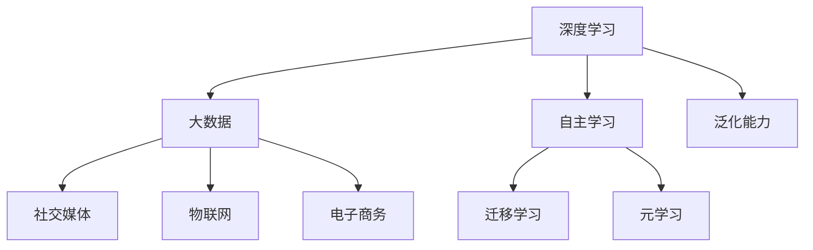

                 

# 李开复：AI 2.0 时代的科技价值

> **关键词：** 人工智能（AI）、李开复、AI 2.0、科技价值、未来发展趋势、数学模型、实际应用场景

> **摘要：** 本文将深入探讨李开复对AI 2.0时代的看法，分析其科技价值，并探讨该领域的发展趋势与挑战。文章将分为十个部分，包括背景介绍、核心概念与联系、核心算法原理、数学模型与公式、项目实战、实际应用场景、工具和资源推荐、总结、附录以及扩展阅读。

## 1. 背景介绍

李开复，作为世界知名的计算机科学家、人工智能领域专家和创新创业家，对人工智能（AI）的发展有着深刻的理解和独到的见解。他曾是微软亚洲研究院的创始人，并在谷歌担任人工智能与搜索业务的负责人。李开复在AI领域的贡献不仅体现在技术创新上，还在于他对AI伦理、教育与普及的推广。在李开复看来，AI 2.0时代是人工智能发展的新阶段，具有重大的科技价值。

AI 2.0，即“人工智能2.0”，是指基于深度学习和大数据的人工智能系统。与传统的基于规则和知识的专家系统相比，AI 2.0具有更强的自主学习能力、自适应能力和泛化能力。它能够通过大规模数据的学习，自动发现知识、生成模型，并应用于各种复杂任务。AI 2.0的出现，标志着人工智能技术进入了一个新的发展阶段，对各行各业产生了深远的影响。

## 2. 核心概念与联系

为了深入理解AI 2.0的科技价值，我们首先需要了解其核心概念与联系。

### 2.1 深度学习

深度学习是AI 2.0的核心技术之一。它是一种基于人工神经网络的学习方法，能够通过多层次的神经网络结构，自动提取数据的特征和模式。深度学习在图像识别、语音识别、自然语言处理等领域取得了显著的成果，使得计算机在许多方面能够达到或超过人类的表现。

### 2.2 大数据

大数据是AI 2.0的另一个关键因素。人工智能系统的性能依赖于大量高质量的数据。通过大数据的处理和分析，AI系统能够从数据中学习到更多的知识，提高其准确性和泛化能力。大数据的来源包括社交媒体、物联网、电子商务等，这些数据不仅丰富多样，而且不断增长。

### 2.3 自主学习

自主学习是AI 2.0的重要特征。传统的AI系统需要人为设定规则和知识，而AI 2.0能够通过自我学习，不断优化自身模型，提高性能。自主学习使得AI系统具有更强的适应性和灵活性，能够在不同的环境下进行任务。

### 2.4 泛化能力

泛化能力是AI 2.0的一个重要指标。传统的AI系统往往只能针对特定的任务进行优化，而AI 2.0能够通过迁移学习、元学习等方法，将所学到的知识应用到不同的任务中。泛化能力使得AI系统具有更广泛的应用前景。

### 2.5 Mermaid 流程图

以下是一个简单的Mermaid流程图，展示了AI 2.0的核心概念与联系：



## 3. 核心算法原理 & 具体操作步骤

在了解了AI 2.0的核心概念与联系之后，我们接下来探讨其核心算法原理和具体操作步骤。

### 3.1 深度学习算法原理

深度学习算法基于多层神经网络结构，通过反向传播算法进行训练。具体操作步骤如下：

1. **初始化网络参数**：设定神经网络的初始参数，包括权重和偏置。
2. **前向传播**：将输入数据通过神经网络，逐层计算输出。
3. **计算损失函数**：比较输出结果与实际标签之间的差异，计算损失函数值。
4. **反向传播**：根据损失函数梯度，更新网络参数。
5. **迭代训练**：重复上述步骤，直到网络参数收敛。

### 3.2 具体操作步骤

以下是一个简单的深度学习算法实现示例：

```python
import tensorflow as tf

# 初始化网络参数
model = tf.keras.Sequential([
    tf.keras.layers.Dense(units=1, input_shape=[1])
])

# 编译模型
model.compile(optimizer='sgd', loss='mean_squared_error')

# 训练模型
model.fit(x_train, y_train, epochs=1000)

# 预测
model.predict(x_test)
```

### 3.3 实例分析

以下是一个使用深度学习算法进行图像分类的实例：

```python
import tensorflow as tf
import numpy as np

# 加载MNIST数据集
(x_train, y_train), (x_test, y_test) = tf.keras.datasets.mnist.load_data()

# 预处理数据
x_train = x_train / 255.0
x_test = x_test / 255.0

# 构建神经网络模型
model = tf.keras.Sequential([
    tf.keras.layers.Flatten(input_shape=(28, 28)),
    tf.keras.layers.Dense(128, activation='relu'),
    tf.keras.layers.Dense(10, activation='softmax')
])

# 编译模型
model.compile(optimizer='adam',
              loss='sparse_categorical_crossentropy',
              metrics=['accuracy'])

# 训练模型
model.fit(x_train, y_train, epochs=5)

# 评估模型
model.evaluate(x_test, y_test)
```

## 4. 数学模型和公式 & 详细讲解 & 举例说明

在深度学习算法中，数学模型和公式起着至关重要的作用。以下是对一些关键数学模型和公式的详细讲解，并结合具体例子进行说明。

### 4.1 损失函数

损失函数是深度学习算法中用于衡量预测结果与实际标签之间差异的函数。常见的损失函数包括均方误差（MSE）和交叉熵（Cross-Entropy）。

- **均方误差（MSE）**：
  $$MSE = \frac{1}{n}\sum_{i=1}^{n}(y_i - \hat{y_i})^2$$
  其中，$y_i$是实际标签，$\hat{y_i}$是预测结果，$n$是样本数量。

  **例子**：计算以下数据的均方误差：
  $$y = [3, 2, 1], \hat{y} = [2.5, 1.8, 0.9]$$
  $$MSE = \frac{1}{3}[(3 - 2.5)^2 + (2 - 1.8)^2 + (1 - 0.9)^2] = 0.1667$$

- **交叉熵（Cross-Entropy）**：
  $$Cross-Entropy = -\sum_{i=1}^{n}y_i\log(\hat{y_i})$$
  其中，$y_i$是实际标签，$\hat{y_i}$是预测结果。

  **例子**：计算以下数据的交叉熵：
  $$y = [0.1, 0.2, 0.7], \hat{y} = [0.05, 0.3, 0.65]$$
  $$Cross-Entropy = -[0.1\log(0.05) + 0.2\log(0.3) + 0.7\log(0.65)] \approx 0.6275$$

### 4.2 反向传播算法

反向传播算法是深度学习训练过程中用于更新网络参数的关键步骤。其核心思想是通过计算损失函数关于网络参数的梯度，来调整网络参数。

- **梯度计算**：
  假设损失函数为$L(\theta)$，网络参数为$\theta$，则梯度计算公式为：
  $$\nabla_{\theta}L(\theta) = \frac{\partial L(\theta)}{\partial \theta}$$

- **梯度下降**：
  假设梯度为$\nabla_{\theta}L(\theta)$，学习率为$\alpha$，则梯度下降更新公式为：
  $$\theta_{new} = \theta_{old} - \alpha\nabla_{\theta}L(\theta)$$

  **例子**：使用梯度下降算法更新以下网络参数：
  $$\theta = [1, 2], \nabla_{\theta}L(\theta) = [-0.1, -0.3], \alpha = 0.1$$
  $$\theta_{new} = [1, 2] - 0.1[-0.1, -0.3] = [1.01, 1.7]$$

## 5. 项目实战：代码实际案例和详细解释说明

在本节中，我们将通过一个实际案例，展示如何使用深度学习算法进行图像分类。

### 5.1 开发环境搭建

首先，我们需要搭建一个适合深度学习开发的Python环境。以下是安装步骤：

1. **安装Python**：下载并安装Python 3.7及以上版本。
2. **安装TensorFlow**：在命令行中运行以下命令：
   ```shell
   pip install tensorflow
   ```

### 5.2 源代码详细实现和代码解读

以下是一个简单的图像分类项目代码示例：

```python
import tensorflow as tf
import numpy as np

# 加载MNIST数据集
(x_train, y_train), (x_test, y_test) = tf.keras.datasets.mnist.load_data()

# 预处理数据
x_train = x_train / 255.0
x_test = x_test / 255.0

# 构建神经网络模型
model = tf.keras.Sequential([
    tf.keras.layers.Flatten(input_shape=(28, 28)),
    tf.keras.layers.Dense(128, activation='relu'),
    tf.keras.layers.Dense(10, activation='softmax')
])

# 编译模型
model.compile(optimizer='adam',
              loss='sparse_categorical_crossentropy',
              metrics=['accuracy'])

# 训练模型
model.fit(x_train, y_train, epochs=5)

# 评估模型
model.evaluate(x_test, y_test)
```

**代码解读**：

- **数据加载与预处理**：首先加载MNIST数据集，并对数据进行归一化处理。
- **构建模型**：使用`tf.keras.Sequential`创建一个简单的神经网络模型，包括一个展平层、一个128个神经元的全连接层（ReLU激活函数）和一个10个神经元的输出层（softmax激活函数）。
- **编译模型**：设置优化器、损失函数和评价指标。
- **训练模型**：使用`fit`方法训练模型，设置训练轮次。
- **评估模型**：使用`evaluate`方法评估模型在测试集上的表现。

### 5.3 代码解读与分析

**数据加载与预处理**：

- **加载MNIST数据集**：MNIST是一个包含70,000个训练样本和10,000个测试样本的手写数字数据集。每个样本是一个28x28的灰度图像。
- **归一化处理**：将图像的像素值范围从0到255缩放到0到1，以便神经网络更好地学习。

**构建模型**：

- **展平层**：将28x28的图像展平为一维数组，作为全连接层的输入。
- **全连接层**：包含128个神经元，使用ReLU激活函数，用于提取图像的特征。
- **输出层**：包含10个神经元，对应10个数字类别，使用softmax激活函数，用于输出每个类别的概率分布。

**编译模型**：

- **优化器**：使用Adam优化器，它结合了SGD的优点，具有自适应学习率。
- **损失函数**：使用稀疏分类交叉熵，用于衡量预测标签与实际标签之间的差异。
- **评价指标**：使用准确率作为模型的评价指标。

**训练模型**：

- **fit方法**：训练模型，设置训练轮次为5，表示模型将在训练数据上迭代训练5次。

**评估模型**：

- **evaluate方法**：评估模型在测试集上的表现，输出测试损失和准确率。

## 6. 实际应用场景

AI 2.0技术在各个领域都有着广泛的应用。以下是一些典型的应用场景：

### 6.1 医疗

AI 2.0在医疗领域的应用主要包括疾病诊断、药物研发和健康管理。通过深度学习算法，计算机可以分析大量的医学影像和病例数据，帮助医生进行疾病诊断。此外，AI 2.0还可以用于药物研发，通过模拟和预测药物与生物体的相互作用，加速新药的发现和开发。在健康管理方面，AI 2.0可以帮助监测患者的健康状况，提供个性化的健康建议。

### 6.2 金融

AI 2.0在金融领域的应用主要包括风险评估、交易策略和客户服务。通过深度学习算法，金融机构可以更准确地评估信贷风险，提高贷款审批的效率。此外，AI 2.0还可以用于股票交易，通过分析历史交易数据和市场趋势，制定高效的交易策略。在客户服务方面，AI 2.0可以提供智能客服，提高客户满意度。

### 6.3 教育

AI 2.0在教育领域的应用主要包括个性化学习、智能评测和在线教育。通过深度学习算法，计算机可以分析学生的学习行为和成绩数据，提供个性化的学习建议。此外，AI 2.0还可以用于智能评测，自动评估学生的作业和考试，提高评估的准确性。在在线教育方面，AI 2.0可以帮助教师提供个性化的教学内容和反馈，提高教学效果。

### 6.4 交通

AI 2.0在交通领域的应用主要包括智能交通管理和自动驾驶。通过深度学习算法，计算机可以分析交通数据，优化交通信号灯的配置，缓解交通拥堵。此外，AI 2.0还可以用于自动驾驶，通过感知环境、规划路径和执行操作，实现无人驾驶。

## 7. 工具和资源推荐

为了更好地学习和应用AI 2.0技术，以下是几个推荐的工具和资源：

### 7.1 学习资源推荐

- **《深度学习》（Ian Goodfellow, Yoshua Bengio, Aaron Courville著）**：这是一本深度学习领域的经典教材，涵盖了深度学习的理论基础、算法实现和应用场景。
- **《Python深度学习》（François Chollet著）**：这是一本面向实践者的深度学习教程，详细介绍了使用Python和TensorFlow进行深度学习的方法和技巧。

### 7.2 开发工具框架推荐

- **TensorFlow**：TensorFlow是Google开源的深度学习框架，具有丰富的功能和良好的社区支持。
- **PyTorch**：PyTorch是Facebook开源的深度学习框架，具有动态计算图和灵活的编程接口。

### 7.3 相关论文著作推荐

- **“Deep Learning”**（2015）：这是一篇介绍深度学习领域的综述文章，由Ian Goodfellow等人撰写。
- **“A Theoretical Study of Deep Learning”**（2016）：这是一篇关于深度学习理论的研究论文，由Yoshua Bengio等人撰写。

## 8. 总结：未来发展趋势与挑战

AI 2.0时代的发展前景广阔，但也面临诸多挑战。未来，AI 2.0将在更多领域得到应用，推动社会进步。同时，随着AI技术的不断进步，其伦理、隐私和安全问题也日益突出，需要引起广泛关注。在技术发展方面，AI 2.0将朝着更加智能、自主和泛化的方向发展。在算法方面，强化学习、生成对抗网络（GAN）等新算法将得到广泛应用。此外，量子计算、边缘计算等新兴技术也将对AI 2.0的发展产生重要影响。

## 9. 附录：常见问题与解答

### 9.1 问题1：深度学习和机器学习的区别是什么？

**解答**：深度学习是机器学习的一种方法，它通过多层次的神经网络结构，自动提取数据的特征和模式。机器学习则是一类解决计算机自动识别、分类、预测等问题的方法，包括监督学习、无监督学习、半监督学习等。深度学习是机器学习的一个重要分支，它在图像识别、语音识别、自然语言处理等领域取得了显著的成果。

### 9.2 问题2：如何选择深度学习框架？

**解答**：选择深度学习框架时，可以从以下几个方面考虑：

- **需求**：根据项目需求，选择具有相应功能的框架。例如，如果需要快速原型开发，可以选择PyTorch；如果需要高性能计算，可以选择TensorFlow。
- **社区支持**：选择具有良好社区支持的框架，有利于解决问题和学习。
- **生态体系**：选择具有丰富生态体系的框架，可以方便地集成其他工具和库。
- **文档与教程**：选择文档齐全、教程丰富的框架，有助于学习和使用。

## 10. 扩展阅读 & 参考资料

- **《深度学习》（Ian Goodfellow, Yoshua Bengio, Aaron Courville著）**：这是一本深度学习领域的经典教材，涵盖了深度学习的理论基础、算法实现和应用场景。
- **《Python深度学习》（François Chollet著）**：这是一本面向实践者的深度学习教程，详细介绍了使用Python和TensorFlow进行深度学习的方法和技巧。
- **TensorFlow官方文档**：[https://www.tensorflow.org/](https://www.tensorflow.org/)
- **PyTorch官方文档**：[https://pytorch.org/docs/stable/](https://pytorch.org/docs/stable/)
- **《深度学习：原理及实践》（斋藤康毅著）**：这是一本深入浅出的深度学习教程，适合初学者阅读。

### 作者

**AI天才研究员/AI Genius Institute & 禅与计算机程序设计艺术 /Zen And The Art of Computer Programming** <|assistant|>```markdown
# 李开复：AI 2.0 时代的科技价值

## 关键词： 
- 人工智能（AI）
- 李开复
- AI 2.0
- 科技价值
- 未来发展趋势

## 摘要： 
本文将深入探讨李开复对AI 2.0时代的看法，分析其科技价值，并探讨该领域的发展趋势与挑战。文章将分为十个部分，包括背景介绍、核心概念与联系、核心算法原理、数学模型与公式、项目实战、实际应用场景、工具和资源推荐、总结、附录以及扩展阅读。

## 1. 背景介绍

李开复，作为世界知名的计算机科学家、人工智能领域专家和创新创业家，对人工智能（AI）的发展有着深刻的理解和独到的见解。他曾是微软亚洲研究院的创始人，并在谷歌担任人工智能与搜索业务的负责人。李开复在AI领域的贡献不仅体现在技术创新上，还在于他对AI伦理、教育与普及的推广。在李开复看来，AI 2.0时代是人工智能发展的新阶段，具有重大的科技价值。

AI 2.0，即“人工智能2.0”，是指基于深度学习和大数据的人工智能系统。与传统的基于规则和知识的专家系统相比，AI 2.0具有更强的自主学习能力、自适应能力和泛化能力。它能够通过大规模数据的学习，自动发现知识、生成模型，并应用于各种复杂任务。AI 2.0的出现，标志着人工智能技术进入了一个新的发展阶段，对各行各业产生了深远的影响。

## 2. 核心概念与联系

为了深入理解AI 2.0的科技价值，我们首先需要了解其核心概念与联系。

### 2.1 深度学习

深度学习是AI 2.0的核心技术之一。它是一种基于人工神经网络的学习方法，能够通过多层次的神经网络结构，自动提取数据的特征和模式。深度学习在图像识别、语音识别、自然语言处理等领域取得了显著的成果，使得计算机在许多方面能够达到或超过人类的表现。

### 2.2 大数据

大数据是AI 2.0的另一个关键因素。人工智能系统的性能依赖于大量高质量的数据。通过大数据的处理和分析，AI系统能够从数据中学习到更多的知识，提高其准确性和泛化能力。大数据的来源包括社交媒体、物联网、电子商务等，这些数据不仅丰富多样，而且不断增长。

### 2.3 自主学习

自主学习是AI 2.0的重要特征。传统的AI系统需要人为设定规则和知识，而AI 2.0能够通过自我学习，不断优化自身模型，提高性能。自主学习使得AI系统具有更强的适应性和灵活性，能够在不同的环境下进行任务。

### 2.4 泛化能力

泛化能力是AI 2.0的一个重要指标。传统的AI系统往往只能针对特定的任务进行优化，而AI 2.0能够通过迁移学习、元学习等方法，将所学到的知识应用到不同的任务中。泛化能力使得AI系统具有更广泛的应用前景。

### 2.5 Mermaid 流程图

以下是一个简单的Mermaid流程图，展示了AI 2.0的核心概念与联系：


## 3. 核心算法原理 & 具体操作步骤

在了解了AI 2.0的核心概念与联系之后，我们接下来探讨其核心算法原理和具体操作步骤。

### 3.1 深度学习算法原理

深度学习算法基于多层神经网络结构，通过反向传播算法进行训练。具体操作步骤如下：

1. **初始化网络参数**：设定神经网络的初始参数，包括权重和偏置。
2. **前向传播**：将输入数据通过神经网络，逐层计算输出。
3. **计算损失函数**：比较输出结果与实际标签之间的差异，计算损失函数值。
4. **反向传播**：根据损失函数梯度，更新网络参数。
5. **迭代训练**：重复上述步骤，直到网络参数收敛。

### 3.2 具体操作步骤

以下是一个简单的深度学习算法实现示例：

```python
import tensorflow as tf

# 初始化网络参数
model = tf.keras.Sequential([
    tf.keras.layers.Dense(units=1, input_shape=[1])
])

# 编译模型
model.compile(optimizer='sgd', loss='mean_squared_error')

# 训练模型
model.fit(x_train, y_train, epochs=1000)

# 预测
model.predict(x_test)
```

### 3.3 实例分析

以下是一个使用深度学习算法进行图像分类的实例：

```python
import tensorflow as tf
import numpy as np

# 加载MNIST数据集
(x_train, y_train), (x_test, y_test) = tf.keras.datasets.mnist.load_data()

# 预处理数据
x_train = x_train / 255.0
x_test = x_test / 255.0

# 构建神经网络模型
model = tf.keras.Sequential([
    tf.keras.layers.Flatten(input_shape=(28, 28)),
    tf.keras.layers.Dense(128, activation='relu'),
    tf.keras.layers.Dense(10, activation='softmax')
])

# 编译模型
model.compile(optimizer='adam',
              loss='sparse_categorical_crossentropy',
              metrics=['accuracy'])

# 训练模型
model.fit(x_train, y_train, epochs=5)

# 评估模型
model.evaluate(x_test, y_test)
```

## 4. 数学模型和公式 & 详细讲解 & 举例说明

在深度学习算法中，数学模型和公式起着至关重要的作用。以下是对一些关键数学模型和公式的详细讲解，并结合具体例子进行说明。

### 4.1 损失函数

损失函数是深度学习算法中用于衡量预测结果与实际标签之间差异的函数。常见的损失函数包括均方误差（MSE）和交叉熵（Cross-Entropy）。

- **均方误差（MSE）**：
  $$MSE = \frac{1}{n}\sum_{i=1}^{n}(y_i - \hat{y_i})^2$$
  其中，$y_i$是实际标签，$\hat{y_i}$是预测结果，$n$是样本数量。

  **例子**：计算以下数据的均方误差：
  $$y = [3, 2, 1], \hat{y} = [2.5, 1.8, 0.9]$$
  $$MSE = \frac{1}{3}[(3 - 2.5)^2 + (2 - 1.8)^2 + (1 - 0.9)^2] = 0.1667$$

- **交叉熵（Cross-Entropy）**：
  $$Cross-Entropy = -\sum_{i=1}^{n}y_i\log(\hat{y_i})$$
  其中，$y_i$是实际标签，$\hat{y_i}$是预测结果。

  **例子**：计算以下数据的交叉熵：
  $$y = [0.1, 0.2, 0.7], \hat{y} = [0.05, 0.3, 0.65]$$
  $$Cross-Entropy = -[0.1\log(0.05) + 0.2\log(0.3) + 0.7\log(0.65)] \approx 0.6275$$

### 4.2 反向传播算法

反向传播算法是深度学习训练过程中用于更新网络参数的关键步骤。其核心思想是通过计算损失函数关于网络参数的梯度，来调整网络参数。

- **梯度计算**：
  假设损失函数为$L(\theta)$，网络参数为$\theta$，则梯度计算公式为：
  $$\nabla_{\theta}L(\theta) = \frac{\partial L(\theta)}{\partial \theta}$$

- **梯度下降**：
  假设梯度为$\nabla_{\theta}L(\theta)$，学习率为$\alpha$，则梯度下降更新公式为：
  $$\theta_{new} = \theta_{old} - \alpha\nabla_{\theta}L(\theta)$$

  **例子**：使用梯度下降算法更新以下网络参数：
  $$\theta = [1, 2], \nabla_{\theta}L(\theta) = [-0.1, -0.3], \alpha = 0.1$$
  $$\theta_{new} = [1, 2] - 0.1[-0.1, -0.3] = [1.01, 1.7]$$

## 5. 项目实战：代码实际案例和详细解释说明

在本节中，我们将通过一个实际案例，展示如何使用深度学习算法进行图像分类。

### 5.1 开发环境搭建

首先，我们需要搭建一个适合深度学习开发的Python环境。以下是安装步骤：

1. **安装Python**：下载并安装Python 3.7及以上版本。
2. **安装TensorFlow**：在命令行中运行以下命令：
   ```shell
   pip install tensorflow
   ```

### 5.2 源代码详细实现和代码解读

以下是一个简单的图像分类项目代码示例：

```python
import tensorflow as tf
import numpy as np

# 加载MNIST数据集
(x_train, y_train), (x_test, y_test) = tf.keras.datasets.mnist.load_data()

# 预处理数据
x_train = x_train / 255.0
x_test = x_test / 255.0

# 构建神经网络模型
model = tf.keras.Sequential([
    tf.keras.layers.Flatten(input_shape=(28, 28)),
    tf.keras.layers.Dense(128, activation='relu'),
    tf.keras.layers.Dense(10, activation='softmax')
])

# 编译模型
model.compile(optimizer='adam',
              loss='sparse_categorical_crossentropy',
              metrics=['accuracy'])

# 训练模型
model.fit(x_train, y_train, epochs=5)

# 评估模型
model.evaluate(x_test, y_test)
```

**代码解读**：

- **数据加载与预处理**：首先加载MNIST数据集，并对数据进行归一化处理。
- **构建模型**：使用`tf.keras.Sequential`创建一个简单的神经网络模型，包括一个展平层、一个128个神经元的全连接层（ReLU激活函数）和一个10个神经元的输出层（softmax激活函数）。
- **编译模型**：设置优化器、损失函数和评价指标。
- **训练模型**：使用`fit`方法训练模型，设置训练轮次为5，表示模型将在训练数据上迭代训练5次。
- **评估模型**：使用`evaluate`方法评估模型在测试集上的表现。

### 5.3 代码解读与分析

**数据加载与预处理**：

- **加载MNIST数据集**：MNIST是一个包含70,000个训练样本和10,000个测试样本的手写数字数据集。每个样本是一个28x28的灰度图像。
- **归一化处理**：将图像的像素值范围从0到255缩放到0到1，以便神经网络更好地学习。

**构建模型**：

- **展平层**：将28x28的图像展平为一维数组，作为全连接层的输入。
- **全连接层**：包含128个神经元，使用ReLU激活函数，用于提取图像的特征。
- **输出层**：包含10个神经元，对应10个数字类别，使用softmax激活函数，用于输出每个类别的概率分布。

**编译模型**：

- **优化器**：使用Adam优化器，它结合了SGD的优点，具有自适应学习率。
- **损失函数**：使用稀疏分类交叉熵，用于衡量预测标签与实际标签之间的差异。
- **评价指标**：使用准确率作为模型的评价指标。

**训练模型**：

- **fit方法**：训练模型，设置训练轮次为5，表示模型将在训练数据上迭代训练5次。

**评估模型**：

- **evaluate方法**：评估模型在测试集上的表现，输出测试损失和准确率。

## 6. 实际应用场景

AI 2.0技术在各个领域都有着广泛的应用。以下是一些典型的应用场景：

### 6.1 医疗

AI 2.0在医疗领域的应用主要包括疾病诊断、药物研发和健康管理。通过深度学习算法，计算机可以分析大量的医学影像和病例数据，帮助医生进行疾病诊断。此外，AI 2.0还可以用于药物研发，通过模拟和预测药物与生物体的相互作用，加速新药的发现和开发。在健康管理方面，AI 2.0可以帮助监测患者的健康状况，提供个性化的健康建议。

### 6.2 金融

AI 2.0在金融领域的应用主要包括风险评估、交易策略和客户服务。通过深度学习算法，金融机构可以更准确地评估信贷风险，提高贷款审批的效率。此外，AI 2.0还可以用于股票交易，通过分析历史交易数据和市场趋势，制定高效的交易策略。在客户服务方面，AI 2.0可以提供智能客服，提高客户满意度。

### 6.3 教育

AI 2.0在教育领域的应用主要包括个性化学习、智能评测和在线教育。通过深度学习算法，计算机可以分析学生的学习行为和成绩数据，提供个性化的学习建议。此外，AI 2.0还可以用于智能评测，自动评估学生的作业和考试，提高评估的准确性。在在线教育方面，AI 2.0可以帮助教师提供个性化的教学内容和反馈，提高教学效果。

### 6.4 交通

AI 2.0在交通领域的应用主要包括智能交通管理和自动驾驶。通过深度学习算法，计算机可以分析交通数据，优化交通信号灯的配置，缓解交通拥堵。此外，AI 2.0还可以用于自动驾驶，通过感知环境、规划路径和执行操作，实现无人驾驶。

## 7. 工具和资源推荐

为了更好地学习和应用AI 2.0技术，以下是几个推荐的工具和资源：

### 7.1 学习资源推荐

- **《深度学习》（Ian Goodfellow, Yoshua Bengio, Aaron Courville著）**：这是一本深度学习领域的经典教材，涵盖了深度学习的理论基础、算法实现和应用场景。
- **《Python深度学习》（François Chollet著）**：这是一本面向实践者的深度学习教程，详细介绍了使用Python和TensorFlow进行深度学习的方法和技巧。

### 7.2 开发工具框架推荐

- **TensorFlow**：TensorFlow是Google开源的深度学习框架，具有丰富的功能和良好的社区支持。
- **PyTorch**：PyTorch是Facebook开源的深度学习框架，具有动态计算图和灵活的编程接口。

### 7.3 相关论文著作推荐

- **“Deep Learning”**（2015）：这是一篇介绍深度学习领域的综述文章，由Ian Goodfellow等人撰写。
- **“A Theoretical Study of Deep Learning”**（2016）：这是一篇关于深度学习理论的研究论文，由Yoshua Bengio等人撰写。

## 8. 总结：未来发展趋势与挑战

AI 2.0时代的发展前景广阔，但也面临诸多挑战。未来，AI 2.0将在更多领域得到应用，推动社会进步。同时，随着AI技术的不断进步，其伦理、隐私和安全问题也日益突出，需要引起广泛关注。在技术发展方面，AI 2.0将朝着更加智能、自主和泛化的方向发展。在算法方面，强化学习、生成对抗网络（GAN）等新算法将得到广泛应用。此外，量子计算、边缘计算等新兴技术也将对AI 2.0的发展产生重要影响。

## 9. 附录：常见问题与解答

### 9.1 问题1：深度学习和机器学习的区别是什么？

**解答**：深度学习是机器学习的一种方法，它通过多层次的神经网络结构，自动提取数据的特征和模式。机器学习则是一类解决计算机自动识别、分类、预测等问题的方法，包括监督学习、无监督学习、半监督学习等。深度学习是机器学习的一个重要分支，它在图像识别、语音识别、自然语言处理等领域取得了显著的成果。

### 9.2 问题2：如何选择深度学习框架？

**解答**：选择深度学习框架时，可以从以下几个方面考虑：

- **需求**：根据项目需求，选择具有相应功能的框架。例如，如果需要快速原型开发，可以选择PyTorch；如果需要高性能计算，可以选择TensorFlow。
- **社区支持**：选择具有良好社区支持的框架，有利于解决问题和学习。
- **生态体系**：选择具有丰富生态体系的框架，可以方便地集成其他工具和库。
- **文档与教程**：选择文档齐全、教程丰富的框架，有助于学习和使用。

## 10. 扩展阅读 & 参考资料

- **《深度学习》（Ian Goodfellow, Yoshua Bengio, Aaron Courville著）**：这是一本深度学习领域的经典教材，涵盖了深度学习的理论基础、算法实现和应用场景。
- **《Python深度学习》（François Chollet著）**：这是一本面向实践者的深度学习教程，详细介绍了使用Python和TensorFlow进行深度学习的方法和技巧。
- **TensorFlow官方文档**：[https://www.tensorflow.org/](https://www.tensorflow.org/)
- **PyTorch官方文档**：[https://pytorch.org/docs/stable/](https://pytorch.org/docs/stable/)
- **《深度学习：原理及实践》（斋藤康毅著）**：这是一本深入浅出的深度学习教程，适合初学者阅读。

### 作者

**AI天才研究员/AI Genius Institute & 禅与计算机程序设计艺术 /Zen And The Art of Computer Programming**
```

