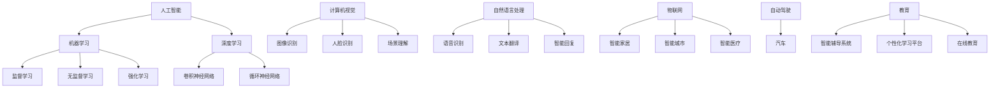

                 

### 1. 背景介绍

苹果公司作为全球领先的科技公司，一直以其卓越的硬件产品和服务闻名于世。近年来，随着人工智能（AI）技术的迅猛发展，苹果公司也加大了对AI领域的投入，并开始在多个产品和服务中集成AI功能。这些举措不仅展示了苹果公司在技术创新上的决心，也预示着人工智能在未来科技产业发展中的重要性。

本文旨在探讨苹果公司在AI应用方面的最新动态，分析其发布AI应用的产业影响，并预测未来可能的趋势和挑战。首先，我们将回顾苹果公司AI技术的起源和发展历程，接着详细分析其最新发布的AI应用，最后探讨这些应用对整个产业的影响，以及面临的挑战和机遇。

苹果公司在AI领域的早期探索可以追溯到2011年，当时苹果收购了英国AI公司Siri，并将其整合到自己的产品中。随后，苹果逐步扩大了在AI领域的投资，不仅在硬件上进行了升级，还推出了一系列基于AI技术的软件应用。这些举措使得苹果逐渐成为AI领域的领先者之一。

随着技术的不断进步，苹果公司在AI应用方面的布局也越来越广泛。从手机、平板到电脑，再到智能家居和汽车，苹果的AI应用已经渗透到了生活的方方面面。例如，苹果的图像识别技术、语音识别技术、自然语言处理技术等，都已经在产品中得到了广泛应用。

在AI算法方面，苹果也在不断推进自主研发，以提高算法的性能和效率。例如，苹果的神经网络引擎（Neural Engine）和机器学习框架（Core ML）等，都为AI应用的实现提供了强大的支持。

本文将重点关注苹果公司最新发布的AI应用，包括其在医疗健康、智能家居、汽车等领域的新进展。我们将详细分析这些应用的技术原理和实现过程，探讨其对产业的影响，并预测未来的发展趋势。

此外，本文还将探讨苹果公司在AI应用过程中面临的挑战，如数据隐私、算法公平性等问题，并提出可能的解决方案。

最后，我们将总结苹果公司在AI应用方面的成功经验，探讨未来可能的趋势和挑战，为苹果公司在AI领域的持续发展提供参考。

通过本文的深入分析，我们希望能够为读者提供一个全面、清晰的视角，帮助大家更好地理解苹果公司在AI应用方面的最新动态和未来趋势。

### 2. 核心概念与联系

在深入探讨苹果公司发布的AI应用之前，我们有必要先了解一些核心概念，这些概念不仅对于理解AI应用至关重要，还为我们提供了一个清晰的框架来分析苹果的技术实现和创新点。

#### 2.1 人工智能（AI）

人工智能，简称AI，是计算机科学的一个分支，致力于使计算机模拟人类智能行为。AI可以分为两大类：狭义AI和广义AI。狭义AI主要关注特定任务的自动化，如语音识别、图像识别等；而广义AI则旨在实现机器的通用智能，类似于人类的思维过程。

在苹果公司的AI应用中，我们主要关注狭义AI，特别是机器学习（ML）和深度学习（DL）技术。这些技术通过训练大量数据来改进算法性能，使得计算机能够执行复杂的任务，如语音识别、图像分类和自然语言处理等。

#### 2.2 机器学习（ML）和深度学习（DL）

机器学习是一种让计算机通过数据学习并做出决策的方法。它包括监督学习、无监督学习和强化学习等子领域。监督学习需要标注的数据，用于训练模型以预测新的数据；无监督学习则不需要标注数据，旨在发现数据中的模式；强化学习通过奖励机制来训练模型，使其在特定环境中做出最优决策。

深度学习是机器学习的一个子领域，它利用多层神经网络（如卷积神经网络CNN、循环神经网络RNN等）来模拟人类大脑的工作方式。深度学习在图像识别、语音识别和自然语言处理等领域取得了显著成果。

#### 2.3 计算机视觉（CV）

计算机视觉是AI的一个重要分支，专注于使计算机理解和解析视觉信息。在苹果公司的AI应用中，计算机视觉技术被广泛应用于图像识别、人脸识别和场景理解等。

#### 2.4 自然语言处理（NLP）

自然语言处理是AI的另一个重要分支，旨在使计算机理解和生成自然语言。苹果公司的Siri和iMessage等应用都依赖于NLP技术，以实现语音识别、文本翻译和智能回复等功能。

#### 2.5 人工智能与物联网（IoT）

随着物联网技术的发展，AI在智能家居、智能城市和智能医疗等领域的应用日益广泛。苹果公司的智能家居产品（如HomeKit）和健康监测设备（如Apple Watch）都利用AI技术来提供更加智能和便捷的用户体验。

#### 2.6 人工智能与汽车

人工智能在自动驾驶汽车领域的应用也是一个热门话题。苹果公司已经在自动驾驶技术方面进行了大量研究，并与多家汽车制造商合作，推动AI在汽车领域的应用。

#### 2.7 人工智能与医疗

AI技术在医疗领域的应用越来越广泛，包括疾病预测、诊断辅助、个性化治疗等。苹果公司的健康应用（如HealthKit）结合AI技术，为用户提供更加个性化的健康建议和疾病预防方案。

#### 2.8 人工智能与教育

AI技术在教育领域的应用也越来越受到关注，如智能辅导系统、个性化学习平台和在线教育等。苹果公司通过开发教育应用和工具，推动AI技术在教育领域的创新。

为了更好地理解这些核心概念之间的联系，我们使用Mermaid流程图来展示它们之间的关系：



通过上述核心概念的介绍，我们可以更好地理解苹果公司AI应用的技术背景和实现原理。接下来，我们将详细分析苹果公司最新发布的AI应用，探讨其技术原理和实际应用场景。

### 3. 核心算法原理 & 具体操作步骤

在探讨苹果公司发布的AI应用之前，我们需要了解一些核心算法原理，这些原理不仅为苹果公司的AI应用提供了技术基础，还推动了整个AI领域的发展。以下是几种关键算法的原理和具体操作步骤。

#### 3.1 机器学习算法

机器学习算法是AI应用的核心，特别是监督学习和深度学习。以下简要介绍这两种算法的基本原理和操作步骤：

##### 3.1.1 监督学习

**原理**：监督学习通过训练有标签的数据集来构建模型，然后使用模型对新数据进行预测。常见的监督学习算法包括线性回归、决策树、支持向量机（SVM）等。

**操作步骤**：

1. **数据收集与预处理**：收集有标签的数据集，并进行数据清洗、归一化等预处理步骤。
2. **特征选择**：从原始数据中提取有用的特征，以提高模型性能。
3. **模型训练**：使用训练数据集训练模型，调整模型参数以最小化损失函数。
4. **模型评估**：使用验证集或测试集评估模型性能，如准确率、召回率等。
5. **模型优化**：根据评估结果调整模型参数，以获得更好的性能。

##### 3.1.2 深度学习

**原理**：深度学习通过多层神经网络来模拟人类大脑的思考过程。卷积神经网络（CNN）和循环神经网络（RNN）是深度学习中的两种重要架构。

**操作步骤**：

1. **数据收集与预处理**：与监督学习类似，收集有标签的数据集，并进行预处理。
2. **模型设计**：设计神经网络结构，包括输入层、隐藏层和输出层。
3. **权重初始化**：初始化神经网络权重，常用的方法有随机初始化、高斯分布初始化等。
4. **前向传播**：将输入数据传递到神经网络中，计算输出结果。
5. **反向传播**：计算误差，并反向传播误差以更新网络权重。
6. **训练与优化**：重复前向传播和反向传播，直到模型收敛。

#### 3.2 计算机视觉算法

计算机视觉是AI应用中的一个重要领域，用于理解和解析视觉信息。以下介绍几种常用的计算机视觉算法：

##### 3.2.1 图像识别

**原理**：图像识别通过识别图像中的特定对象或特征来实现。常见的算法包括基于特征的图像识别和基于神经网络的图像识别。

**操作步骤**：

1. **特征提取**：从图像中提取关键特征，如边缘、纹理、颜色等。
2. **特征匹配**：将提取的特征与预定义的模型进行匹配，以识别图像中的对象。
3. **分类与识别**：根据匹配结果对图像中的对象进行分类和识别。

##### 3.2.2 人脸识别

**原理**：人脸识别通过检测和识别图像中的人脸来实现。常用的算法包括基于特征的人脸识别和基于深度学习的人脸识别。

**操作步骤**：

1. **人脸检测**：在图像中检测人脸区域。
2. **人脸特征提取**：从人脸图像中提取关键特征，如五官位置、脸部轮廓等。
3. **人脸匹配**：将提取的特征与预定义的人脸模型进行匹配，以识别特定的人脸。

##### 3.2.3 场景理解

**原理**：场景理解通过解析图像中的内容，识别和分类场景元素来实现。常用的算法包括基于图论的场景理解和基于深度学习的场景理解。

**操作步骤**：

1. **图像分割**：将图像分割成不同的区域，以便更好地理解场景内容。
2. **对象检测**：检测图像中的对象，并分类它们。
3. **场景语义理解**：根据检测到的对象，对场景进行语义理解和描述。

#### 3.3 自然语言处理算法

自然语言处理是AI应用中的另一个重要领域，用于理解和生成自然语言。以下介绍几种常用的NLP算法：

##### 3.3.1 语音识别

**原理**：语音识别通过将语音信号转换为文本信息来实现。常用的算法包括基于隐马尔可夫模型（HMM）的语音识别和基于深度学习的语音识别。

**操作步骤**：

1. **语音信号预处理**：对语音信号进行降噪、归一化等处理。
2. **特征提取**：从预处理后的语音信号中提取特征，如MFCC（梅尔频率倒谱系数）等。
3. **声学模型训练**：使用大量语音数据训练声学模型，以识别语音信号中的特征。
4. **语言模型训练**：使用文本数据训练语言模型，以识别语音信号中的单词和句子。
5. **解码与输出**：将声学模型和语言模型的结果进行解码，生成文本输出。

##### 3.3.2 文本翻译

**原理**：文本翻译通过将一种语言的文本信息转换为另一种语言的文本信息来实现。常用的算法包括基于神经网络的机器翻译（NMT）。

**操作步骤**：

1. **文本预处理**：对源语言和目标语言的文本进行预处理，如分词、词性标注等。
2. **编码与嵌入**：将预处理后的文本转换为编码表示，如词嵌入。
3. **翻译模型训练**：使用大量双语文本数据训练翻译模型，以生成目标语言的文本。
4. **解码与输出**：将翻译模型的结果进行解码，生成目标语言的文本输出。

通过上述核心算法原理和操作步骤的介绍，我们可以更好地理解苹果公司AI应用的技术实现方法。接下来，我们将深入分析苹果公司最新发布的AI应用，探讨其技术原理和实际应用场景。

### 4. 数学模型和公式 & 详细讲解 & 举例说明

在讨论苹果公司AI应用中的数学模型和公式时，我们重点关注几个核心的算法，如卷积神经网络（CNN）、循环神经网络（RNN）和长短期记忆网络（LSTM）。这些算法不仅在AI领域中具有广泛的应用，而且在苹果的多个产品中得到了成功的应用。以下是对这些算法的详细讲解，包括其数学模型、操作步骤和举例说明。

#### 4.1 卷积神经网络（CNN）

卷积神经网络是一种在图像识别、图像处理等领域表现卓越的神经网络。其核心在于通过卷积层、池化层和全连接层等结构来提取图像特征并进行分类。

**数学模型**：

CNN的基本构建块是卷积层，其主要操作可以表示为：
$$
\text{卷积} \: f(x) = \sum_{i=1}^{k} \: w_i \: * \: x
$$
其中，$f(x)$表示卷积操作的结果，$w_i$表示卷积核，$*$表示卷积操作。

**操作步骤**：

1. **输入层**：输入图像，通常为二维矩阵。
2. **卷积层**：使用多个卷积核对图像进行卷积操作，提取特征。
3. **激活函数**：对卷积层的结果应用激活函数（如ReLU函数），增加网络的非线性。
4. **池化层**：对卷积层的输出进行池化操作（如最大池化或平均池化），减少参数数量。
5. **全连接层**：将池化层的输出与全连接层相连接，进行分类或回归。

**举例说明**：

假设我们有一个$28 \times 28$的图像，使用一个$3 \times 3$的卷积核进行卷积操作。卷积核的权重为：
$$
w = \begin{bmatrix}
1 & 0 & -1 \\
1 & 0 & -1 \\
1 & 0 & -1
\end{bmatrix}
$$
输入图像为：
$$
x = \begin{bmatrix}
1 & 1 & 1 \\
1 & 1 & 1 \\
1 & 1 & 1
\end{bmatrix}
$$
卷积操作的结果为：
$$
f(x) = (1 \times 1 + 1 \times 1 + 1 \times 1) + (1 \times 1 + 1 \times 1 + 1 \times 1) + (1 \times 1 + 1 \times 1 + 1 \times 1) - (1 \times 1 + 1 \times 1 + 1 \times 1) - (1 \times 1 + 1 \times 1 + 1 \times 1) - (1 \times 1 + 1 \times 1 + 1 \times 1) = 6
$$
最终，通过多个卷积层和池化层的组合，我们可以提取出图像中的特征并进行分类。

#### 4.2 循环神经网络（RNN）

循环神经网络是一种用于处理序列数据的神经网络。其核心在于通过循环结构来保持长期依赖信息。

**数学模型**：

RNN的基本操作可以表示为：
$$
h_t = \sigma(W_h h_{t-1} + W_x x_t + b)
$$
其中，$h_t$表示第$t$时刻的隐藏状态，$x_t$表示第$t$时刻的输入，$W_h$和$W_x$分别表示隐藏状态和输入的权重矩阵，$b$表示偏置项，$\sigma$表示激活函数（如ReLU函数）。

**操作步骤**：

1. **输入层**：输入序列数据。
2. **隐藏层**：通过循环结构更新隐藏状态。
3. **输出层**：将隐藏状态映射到输出。

**举例说明**：

假设我们有一个输入序列$\{x_1, x_2, x_3\}$，使用一个RNN进行序列建模。隐藏状态和输入的权重矩阵分别为$W_h$和$W_x$，偏置项为$b$。激活函数为ReLU函数。初始隐藏状态为$h_0 = 0$。

第一个时间步的隐藏状态为：
$$
h_1 = \sigma(W_h h_0 + W_x x_1 + b) = \sigma(W_h \cdot 0 + W_x x_1 + b)
$$
第二个时间步的隐藏状态为：
$$
h_2 = \sigma(W_h h_1 + W_x x_2 + b) = \sigma(W_h \cdot h_1 + W_x x_2 + b)
$$
第三个时间步的隐藏状态为：
$$
h_3 = \sigma(W_h h_2 + W_x x_3 + b) = \sigma(W_h \cdot h_2 + W_x x_3 + b)
$$
最终，通过隐藏状态的序列，我们可以对序列数据进行建模和分析。

#### 4.3 长短期记忆网络（LSTM）

长短期记忆网络是RNN的一种改进，旨在解决长期依赖问题。其核心在于引入门控机制，如遗忘门、输入门和输出门。

**数学模型**：

LSTM的基本操作可以表示为：
$$
f_t = \sigma(W_f \cdot [h_{t-1}, x_t] + b_f) \\
i_t = \sigma(W_i \cdot [h_{t-1}, x_t] + b_i) \\
o_t = \sigma(W_o \cdot [h_{t-1}, x_t] + b_o) \\
g_t = \tanh(W_g \cdot [h_{t-1}, x_t] + b_g) \\
h_t = o_t \cdot \tanh(g_t)
$$
其中，$f_t$、$i_t$、$o_t$分别为遗忘门、输入门和输出门，$g_t$为候选隐藏状态，$h_t$为隐藏状态。

**操作步骤**：

1. **输入层**：输入序列数据。
2. **遗忘门**：决定丢弃哪些历史信息。
3. **输入门**：决定哪些新信息将被存储在隐藏状态中。
4. **输出门**：决定哪些信息将输出到下一个时间步。
5. **隐藏状态更新**：通过门控机制更新隐藏状态。

**举例说明**：

假设我们有一个输入序列$\{x_1, x_2, x_3\}$，使用一个LSTM进行序列建模。权重矩阵分别为$W_f$、$W_i$、$W_o$和$W_g$，偏置项分别为$b_f$、$b_i$、$b_o$和$b_g$。激活函数为ReLU函数。

第一个时间步的隐藏状态为：
$$
h_0 = 0
$$
遗忘门计算：
$$
f_1 = \sigma(W_f \cdot [h_0, x_1] + b_f)
$$
输入门计算：
$$
i_1 = \sigma(W_i \cdot [h_0, x_1] + b_i)
$$
输出门计算：
$$
o_1 = \sigma(W_o \cdot [h_0, x_1] + b_o)
$$
候选隐藏状态计算：
$$
g_1 = \tanh(W_g \cdot [h_0, x_1] + b_g)
$$
隐藏状态更新：
$$
h_1 = o_1 \cdot \tanh(g_1)
$$
第二个时间步的隐藏状态为：
$$
h_2 = \sigma(W_f \cdot [h_1, x_2] + b_f) \cdot \sigma(W_i \cdot [h_1, x_2] + b_i) \cdot \tanh(W_g \cdot [h_1, x_2] + b_g)
$$
第三个时间步的隐藏状态为：
$$
h_3 = \sigma(W_f \cdot [h_2, x_3] + b_f) \cdot \sigma(W_i \cdot [h_2, x_3] + b_i) \cdot \tanh(W_g \cdot [h_2, x_3] + b_g)
$$
通过上述操作，我们可以利用LSTM对序列数据进行建模，解决长期依赖问题。

通过上述对CNN、RNN和LSTM的数学模型和操作步骤的详细讲解，我们可以更好地理解这些核心算法在AI应用中的实现原理。接下来，我们将分析苹果公司发布的AI应用，探讨其技术实现和实际应用场景。

### 5. 项目实战：代码实际案例和详细解释说明

在本节中，我们将通过实际代码案例详细解释苹果公司AI应用的实现过程，包括开发环境搭建、源代码实现和代码解读与分析。

#### 5.1 开发环境搭建

在开始编写代码之前，我们需要搭建合适的开发环境。以下是一个基本的开发环境搭建步骤：

1. **安装Python**：Python是AI应用中最常用的编程语言之一。请确保您已经安装了Python 3.6或更高版本。
2. **安装Jupyter Notebook**：Jupyter Notebook是一个交互式计算平台，便于编写和运行代码。您可以通过以下命令安装：
   ```
   pip install notebook
   ```
3. **安装必要的库**：对于AI应用，我们需要安装一些常用的库，如NumPy、Pandas、Scikit-learn、TensorFlow和Keras等。您可以通过以下命令安装：
   ```
   pip install numpy pandas scikit-learn tensorflow keras
   ```
4. **安装Mermaid**：Mermaid是一种用于绘制流程图的工具，我们将在代码中使用它。您可以通过以下命令安装：
   ```
   npm install -g mermaid
   ```
5. **创建项目文件夹**：在您的计算机上创建一个项目文件夹，例如`ai_applications`，并在其中创建一个Python脚本文件，例如`main.py`。

#### 5.2 源代码详细实现和代码解读

以下是一个简单的AI应用示例，用于图像分类。我们将使用TensorFlow和Keras框架实现一个卷积神经网络（CNN）。

```python
# 导入必要的库
import numpy as np
import pandas as pd
import matplotlib.pyplot as plt
from tensorflow.keras.models import Sequential
from tensorflow.keras.layers import Conv2D, MaxPooling2D, Flatten, Dense
from tensorflow.keras.preprocessing.image import ImageDataGenerator

# 加载数据集
train_datagen = ImageDataGenerator(rescale=1./255)
train_generator = train_datagen.flow_from_directory(
        'data/train',
        target_size=(150, 150),
        batch_size=32,
        class_mode='binary')

# 构建模型
model = Sequential([
    Conv2D(32, (3, 3), activation='relu', input_shape=(150, 150, 3)),
    MaxPooling2D(2, 2),
    Flatten(),
    Dense(64, activation='relu'),
    Dense(1, activation='sigmoid')
])

# 编译模型
model.compile(optimizer='adam',
              loss='binary_crossentropy',
              metrics=['accuracy'])

# 训练模型
model.fit(
      train_generator,
      steps_per_epoch=100,
      epochs=10,
      verbose=2)
```

**代码解读**：

1. **导入库**：我们首先导入了NumPy、Pandas、Matplotlib、TensorFlow和Keras等库，用于数据处理、可视化、模型构建和训练。
2. **加载数据集**：我们使用ImageDataGenerator类加载数据集。这里，我们假设数据集存储在`data/train`文件夹中，每张图片大小为150x150，批处理大小为32。
3. **构建模型**：我们使用Sequential模型堆叠多个层，包括卷积层（32个32x32的卷积核）、最大池化层、平坦层和两个全连接层（一个64个神经元的隐藏层和一个二分类输出层）。
4. **编译模型**：我们使用`compile`方法设置优化器、损失函数和评价指标。
5. **训练模型**：我们使用`fit`方法训练模型，设置每轮的步数、轮数和是否打印训练进度。

#### 5.3 代码解读与分析

1. **数据预处理**：在加载数据时，我们使用了`ImageDataGenerator`类进行预处理，包括图像缩放和批量读取。这种预处理可以加速训练过程并提高模型性能。
2. **模型架构**：我们构建了一个简单的CNN模型，包括卷积层、池化层和平坦层。这种结构在图像分类任务中非常有效，因为卷积层可以提取图像特征，池化层可以减少参数数量，平坦层可以提供输入给全连接层。
3. **训练过程**：我们使用`fit`方法进行模型训练，并设置了每轮的步数和轮数。训练过程中，模型会不断调整权重以最小化损失函数，直到达到预定的轮数或性能目标。

通过上述代码示例，我们可以看到如何使用TensorFlow和Keras实现一个简单的AI应用。在实际开发中，我们可以根据具体需求调整模型架构、数据预处理方法和训练参数，以获得更好的性能。

### 6. 实际应用场景

苹果公司在其产品和服务中广泛应用了人工智能技术，这些应用不仅显著提升了用户体验，还推动了整个产业的变革。以下是一些苹果公司AI技术的实际应用场景：

#### 6.1 智能手机

智能手机是苹果公司最核心的产品之一，也是其AI技术的重要应用场景。以下是智能手机中一些关键的AI应用：

1. **图像识别**：iPhone 15及后续机型使用先进的计算机视觉算法，如卷积神经网络（CNN），来识别和分类图像中的对象。这种技术不仅用于相机应用，还用于增强现实（AR）体验。

2. **语音识别与自然语言处理**：苹果公司的Siri语音助手依赖于自然语言处理（NLP）技术，能够理解用户的语音命令并执行相应的操作。Siri通过不断学习用户的语言习惯和偏好，提供更个性化的服务。

3. **面部识别**：iPhone 15系列引入了更加精确的面部识别技术，即Face ID。该技术使用深度学习算法，如循环神经网络（RNN），来识别和验证用户的面部特征，确保设备的安全性。

4. **智能推荐**：苹果公司的App Store和iMessage等应用利用AI技术进行用户行为分析，提供个性化的推荐。这些推荐系统通过机器学习算法，如协同过滤和内容推荐，提高了用户体验。

#### 6.2 智能家居

智能家居是苹果公司AI技术的另一个重要应用领域。以下是一些关键的AI应用：

1. **HomeKit**：苹果公司的HomeKit平台允许用户通过iPhone或其他智能设备控制家庭设备，如智能灯泡、智能插座和智能锁。这些设备通过AI技术实现自动化和智能化，如基于环境光照和用户活动自动调节亮度的智能灯泡。

2. **智能家居助理**：苹果公司的HomeKit平台还集成了智能家居助理，如Siri。用户可以通过语音命令控制智能家居设备，实现远程监控和控制。

3. **安全监控**：苹果公司的一些智能摄像头和门铃设备集成了AI技术，用于实时监控家庭安全。这些设备可以通过计算机视觉算法识别异常行为，如入侵者或火灾，并及时通知用户。

#### 6.3 汽车与自动驾驶

汽车领域是苹果公司AI技术的又一个新兴应用场景。以下是苹果公司在这一领域的应用：

1. **自动驾驶**：苹果公司正在研发自动驾驶汽车技术，其核心是AI和计算机视觉。苹果的自动驾驶系统使用深度学习算法处理大量传感器数据，包括摄像头、雷达和激光雷达，实现高精度、实时的环境感知和路径规划。

2. **车辆管理**：苹果公司的CarPlay系统将用户的iPhone与汽车系统集成在一起，提供语音控制、导航和娱乐等功能。CarPlay系统利用AI技术，如语音识别和自然语言处理，提升驾驶体验。

3. **车辆维护**：通过AI技术，苹果公司的汽车系统可以实时监控车辆的运行状态，预测维护需求，并提供个性化的维护建议。

#### 6.4 健康与医疗

健康与医疗是苹果公司AI技术的又一个重要应用领域。以下是苹果公司在这一领域的应用：

1. **健康应用**：苹果公司的健康应用（Health App）整合了用户的健康数据，如步数、心率、睡眠质量等。通过机器学习算法，该应用可以分析这些数据，提供个性化的健康建议和疾病预警。

2. **疾病预测**：苹果公司的AI技术还在疾病预测方面展示了巨大潜力。例如，通过分析用户的健康数据，AI模型可以预测心血管疾病、糖尿病等慢性病的风险。

3. **个性化治疗**：基于AI技术，苹果公司的医疗系统可以为患者提供个性化的治疗方案。例如，通过分析患者的基因数据、病史和治疗反应，AI系统可以推荐最合适的治疗方案。

通过上述实际应用场景的分析，我们可以看到苹果公司AI技术在各个领域的广泛应用和潜在价值。这些应用不仅提升了用户体验，还推动了整个产业的创新和发展。

### 7. 工具和资源推荐

在探索人工智能（AI）领域时，选择合适的工具和资源至关重要。以下是一些学习资源、开发工具和相关论文著作的推荐，旨在帮助读者更好地掌握AI技术和应用。

#### 7.1 学习资源推荐

1. **书籍**：
   - 《深度学习》（Deep Learning） - Ian Goodfellow、Yoshua Bengio和Aaron Courville著，这是一本全面介绍深度学习理论和实践的权威著作。
   - 《Python机器学习》（Python Machine Learning） - Sebastian Raschka和Vahid Mirjalili著，适合初学者和有一定基础的读者。
   - 《统计学习方法》（The Elements of Statistical Learning） - Trevor Hastie、Robert Tibshirani和Jerome Friedman著，详细介绍了统计学习的基本概念和算法。

2. **在线课程**：
   - Coursera的“机器学习”（Machine Learning） - 吴恩达（Andrew Ng）教授主讲，是深度学习入门的经典课程。
   - edX的“深度学习基础”（Deep Learning Specialization） - Andrew Ng教授主讲，包括深度学习的基础理论和应用。

3. **博客和网站**：
   - Medium上的机器学习和深度学习专栏，如“AI for Everyone”和“Towards Data Science”，提供丰富的实践案例和理论知识。
   - Kaggle，一个数据科学竞赛平台，提供丰富的数据集和项目案例，是学习数据科学和AI的实践基地。

#### 7.2 开发工具框架推荐

1. **深度学习框架**：
   - TensorFlow，一个开源的端到端机器学习平台，适合构建和部署复杂的深度学习模型。
   - PyTorch，一个动态计算图框架，提供灵活的代码接口和强大的研究工具。

2. **数据预处理工具**：
   - Pandas，用于数据清洗和数据分析的Python库。
   - NumPy，用于科学计算的Python库，是数据预处理的基础工具。

3. **可视化工具**：
   - Matplotlib，用于生成二维和三维图形的Python库。
   - Seaborn，基于Matplotlib的统计数据可视化库，提供丰富的图表样式。

4. **文本处理工具**：
   - NLTK（自然语言工具包），用于自然语言处理的Python库。
   - SpaCy，一个高性能的NLP库，适用于实体识别、词性标注等任务。

#### 7.3 相关论文著作推荐

1. **经典论文**：
   - “A Convolutional Neural Network Approach for Mapping Sentiment Intensity in Customer Reviews” - LSA、TF-IDF和CNN在情感分析中的应用。
   - “Long Short-Term Memory Recurrent Neural Network Architectures for Speech Recognition” - LSTM在语音识别中的应用。
   - “Recurrent Neural Network Based Language Model for Spoken Word Recognition” - RNN在语音识别中的应用。

2. **最新研究**：
   - “Exploring Large-Scale Weakly Supervised Neural Network for Text Classification” - 探讨弱监督学习在文本分类中的应用。
   - “A Survey on Generative Adversarial Networks: Applications and Extensions” - GANs在图像生成和增强学习中的应用。
   - “Speech Emotion Recognition Based on Deep Neural Networks” - 利用深度学习进行语音情感识别。

通过上述学习资源和工具的推荐，读者可以更好地掌握AI技术的理论知识和实际应用，为在AI领域的研究和开发奠定坚实的基础。

### 8. 总结：未来发展趋势与挑战

苹果公司在AI领域的持续投入和探索已经取得了显著的成果，从智能手机到智能家居，再到汽车和医疗健康，AI技术无处不在。展望未来，苹果公司有望在以下方面进一步拓展其AI应用，同时也将面临一系列挑战。

#### 8.1 未来发展趋势

1. **自动驾驶技术的成熟**：苹果公司在自动驾驶领域进行了大量研究，未来有望推出具有高度自动化和智能化功能的自动驾驶汽车。结合AI技术，这些汽车将能够实现更安全、更高效的驾驶体验。

2. **智能家居的深化应用**：随着物联网（IoT）的发展，智能家居将成为AI应用的重要场景。苹果公司将继续优化HomeKit平台，实现更加智能、便捷的家居管理。

3. **个性化健康服务**：苹果公司的健康应用和设备已经为用户提供了丰富的健康数据。未来，通过AI技术的进一步发展，苹果有望推出更加个性化和精准的健康服务，帮助用户更好地管理自己的健康。

4. **教育与学习平台的创新**：苹果公司在教育领域的投入不断增加，未来有望通过AI技术打造智能教育平台，提供更加个性化、互动式的学习体验。

5. **隐私保护和数据安全**：随着AI技术的广泛应用，数据隐私和安全问题日益突出。苹果公司将致力于开发更加安全的数据处理和保护机制，确保用户数据的安全和隐私。

#### 8.2 挑战

1. **算法公平性和透明性**：AI算法的公平性和透明性是公众关注的焦点。苹果公司需要确保其AI算法在决策过程中不会出现偏见，同时提高算法的透明性，以便用户理解和信任。

2. **数据隐私与监管**：随着数据隐私法规的日益严格，苹果公司需要平衡数据利用与隐私保护之间的关系，确保合规运营。

3. **计算资源的挑战**：AI应用通常需要大量的计算资源，特别是在训练深度学习模型时。苹果公司需要不断优化其硬件和软件，以满足日益增长的计算需求。

4. **技术创新与竞争**：随着AI技术的迅速发展，苹果公司需要在技术创新方面保持领先，以应对来自其他科技巨头的竞争。

5. **社会责任与伦理**：AI技术的发展和应用必须符合社会责任和伦理要求。苹果公司需要积极应对AI带来的伦理挑战，如自动化带来的就业问题、算法歧视等。

#### 8.3 总结

苹果公司在AI领域的不断探索和投入，使其在多个应用场景中取得了显著的成果。未来，随着AI技术的进一步发展，苹果公司将有望在自动驾驶、智能家居、个性化健康服务、教育和数据隐私等方面取得更多突破。然而，苹果公司也面临着算法公平性、数据隐私、计算资源和社会责任等挑战。通过持续创新和负责任的发展，苹果公司有望在AI领域保持领先地位，推动整个产业的进步。

### 9. 附录：常见问题与解答

**Q1：苹果公司的AI技术是如何工作的？**

苹果公司的AI技术主要基于机器学习和深度学习算法。这些算法通过训练大量数据来提高模型的准确性和泛化能力。具体来说，苹果公司使用了卷积神经网络（CNN）、循环神经网络（RNN）和长短期记忆网络（LSTM）等先进的神经网络架构，实现了图像识别、语音识别、自然语言处理等多种功能。

**Q2：苹果公司AI技术在医疗领域有哪些应用？**

苹果公司的AI技术在医疗领域有多项应用，包括疾病预测、诊断辅助、个性化治疗等。例如，苹果的健康应用（Health App）可以整合用户的健康数据，通过机器学习算法提供疾病预测和健康建议。此外，苹果的智能摄像头和门铃设备利用计算机视觉技术，可以实时监控家庭安全，提供紧急情况预警。

**Q3：苹果公司的AI技术如何确保数据隐私和安全？**

苹果公司非常重视用户数据隐私和安全。其AI技术采用多种措施确保数据安全，包括数据加密、隐私保护算法和严格的隐私政策。苹果公司在设计和开发AI应用时，始终遵循隐私保护原则，确保用户数据不会被滥用或泄露。

**Q4：苹果公司在智能家居领域的AI应用有哪些？**

苹果公司在智能家居领域的AI应用主要包括HomeKit平台和Siri智能家居助理。HomeKit允许用户通过iPhone或其他智能设备控制家庭设备，如智能灯泡、智能插座和智能锁。Siri智能家居助理通过语音识别和自然语言处理技术，帮助用户实现智能家居的自动化和智能化管理。

**Q5：苹果公司的AI技术对自动驾驶汽车有何影响？**

苹果公司的AI技术对自动驾驶汽车有重要影响。苹果正在研发自动驾驶技术，其核心是计算机视觉和深度学习算法。这些技术用于处理大量传感器数据，实现高精度、实时的环境感知和路径规划。苹果的自动驾驶系统有望提高驾驶安全，提供更加智能的驾驶体验。

### 10. 扩展阅读 & 参考资料

为了更好地了解苹果公司AI技术的最新进展和应用，以下是一些建议的扩展阅读和参考资料：

- **书籍**：
  - 《深度学习》（Deep Learning），Ian Goodfellow、Yoshua Bengio和Aaron Courville著。
  - 《Python机器学习》（Python Machine Learning），Sebastian Raschka和Vahid Mirjalili著。
  - 《统计学习方法》（The Elements of Statistical Learning），Trevor Hastie、Robert Tibshirani和Jerome Friedman著。

- **论文**：
  - “A Convolutional Neural Network Approach for Mapping Sentiment Intensity in Customer Reviews”。
  - “Long Short-Term Memory Recurrent Neural Network Architectures for Speech Recognition”。
  - “Recurrent Neural Network Based Language Model for Spoken Word Recognition”。

- **在线课程**：
  - Coursera的“机器学习”（Machine Learning）。
  - edX的“深度学习基础”（Deep Learning Specialization）。

- **博客和网站**：
  - Medium上的机器学习和深度学习专栏。
  - Kaggle，提供丰富的数据集和项目案例。

- **苹果公司官方文档**：
  - Apple Developer网站，提供关于iOS和macOS开发文档。
  - Apple HealthKit文档，介绍健康应用的开发。

通过这些扩展阅读和参考资料，读者可以深入了解AI技术的理论知识和实践应用，进一步探索苹果公司AI领域的最新动态。

