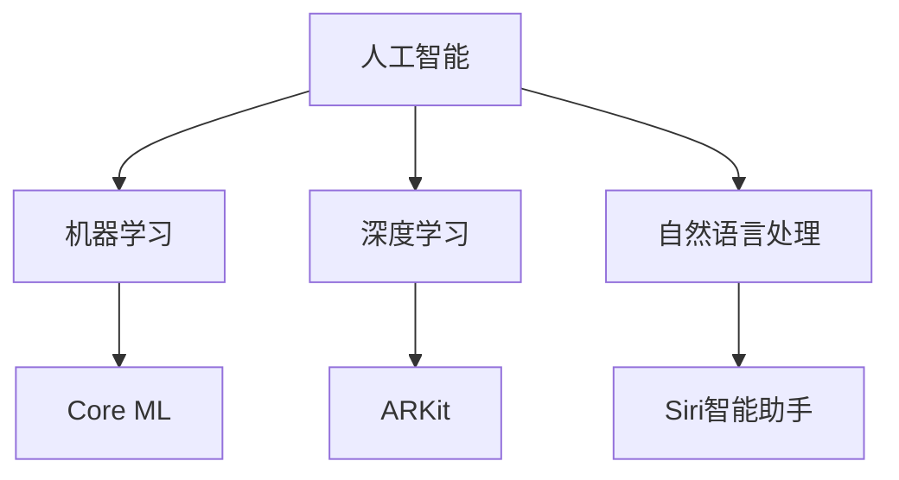

                 

# 李开复：苹果发布AI应用的价值

## 摘要

苹果公司在最近的全球开发者大会（WWDC）上发布了一系列AI驱动的应用和功能，引起了全球科技界的热烈讨论。本文将深入分析苹果发布的这些AI应用的价值，探讨其对用户、开发者以及整个科技行业的深远影响。作者李开复作为世界级人工智能专家，将运用其深厚的技术背景和洞察力，对苹果在AI领域的最新动向进行详细解读。

## 1. 背景介绍

苹果公司一直以来都在人工智能领域进行着深入的研究和探索。从早期的Siri智能助手到最近的机器学习框架Core ML，苹果不断推进人工智能技术在产品中的应用。随着AI技术的不断成熟，苹果在今年的WWDC上发布了多个AI驱动的应用和功能，包括增强现实（AR）、语音识别、图像处理等方面。这些新的功能不仅展示了苹果在AI领域的最新研究成果，也为用户提供了更加智能和便捷的使用体验。

## 2. 核心概念与联系

在分析苹果发布的AI应用之前，我们首先需要了解一些核心概念和其之间的联系。

### 2.1 人工智能（AI）

人工智能是指通过计算机模拟人类智能行为的技术。它包括多个子领域，如机器学习、深度学习、自然语言处理等。在苹果的应用中，AI技术被广泛应用于语音识别、图像处理和增强现实等方面。

### 2.2 机器学习（Machine Learning）

机器学习是AI的一个子领域，它使用算法从数据中学习并做出决策。苹果的Core ML框架就是基于机器学习技术，使得开发者可以将AI模型集成到iOS、macOS、watchOS和tvOS等平台中。

### 2.3 深度学习（Deep Learning）

深度学习是机器学习的一个分支，它使用神经网络模型进行学习和预测。苹果在ARKit中使用了深度学习技术来增强现实体验。

### 2.4 自然语言处理（Natural Language Processing，NLP）

自然语言处理是AI的一个子领域，它使计算机能够理解、解释和生成人类语言。苹果的Siri智能助手就是NLP技术的典型应用。

下面是这些核心概念的Mermaid流程图：



## 3. 核心算法原理 & 具体操作步骤

### 3.1 机器学习算法原理

机器学习算法的核心在于通过数据训练模型，使其能够从数据中学习并做出预测。以下是一个简化的机器学习算法操作步骤：

1. 数据收集：收集大量的数据。
2. 数据预处理：清洗数据，包括去除噪声、填补缺失值等。
3. 特征提取：将数据转换为模型能够理解的格式。
4. 训练模型：使用算法（如决策树、神经网络等）训练模型。
5. 模型评估：评估模型的准确性和泛化能力。
6. 模型优化：调整模型参数，提高其性能。

### 3.2 深度学习算法原理

深度学习算法是机器学习的一个分支，它使用多层神经网络进行学习和预测。以下是深度学习算法的操作步骤：

1. 数据收集：与机器学习相同，收集大量数据。
2. 数据预处理：同样需要进行数据清洗和预处理。
3. 网络架构设计：设计神经网络的结构，包括层数、每层的神经元数量等。
4. 模型训练：使用反向传播算法训练模型。
5. 模型评估：评估模型的性能。
6. 模型优化：调整网络参数，提高模型性能。

### 3.3 自然语言处理算法原理

自然语言处理算法使计算机能够理解、解释和生成人类语言。以下是NLP算法的操作步骤：

1. 文本预处理：对文本进行清洗，如分词、去除停用词等。
2. 语言模型训练：训练语言模型，用于预测下一个单词或词组。
3. 情感分析：使用分类算法对文本进行情感分析。
4. 机器翻译：使用编码器-解码器模型进行机器翻译。
5. 对话系统：构建对话系统，使计算机能够与用户进行自然对话。

## 4. 数学模型和公式 & 详细讲解 & 举例说明

### 4.1 机器学习数学模型

在机器学习中，常用的数学模型包括线性回归、逻辑回归和支持向量机（SVM）等。以下以线性回归为例进行讲解。

#### 4.1.1 线性回归原理

线性回归是一种用于预测数值型输出的模型。它的目标是找到一条直线，尽可能地将实际输出与预测输出对齐。

线性回归的数学公式为：

$$
y = \beta_0 + \beta_1 \cdot x
$$

其中，$y$ 是实际输出，$x$ 是输入特征，$\beta_0$ 和 $\beta_1$ 是模型的参数。

#### 4.1.2 线性回归代码实现

以下是使用Python实现线性回归的示例代码：

```python
import numpy as np

# 训练数据
X = np.array([1, 2, 3, 4, 5])
y = np.array([2, 4, 5, 4, 5])

# 梯度下降算法求解参数
def gradient_descent(X, y, learning_rate, iterations):
    n = len(X)
    beta_0 = 0
    beta_1 = 0
    for i in range(iterations):
        y_pred = beta_0 + beta_1 * X
        error = y - y_pred
        beta_0_gradient = -2/n * sum(error)
        beta_1_gradient = -2/n * sum(error * X)
        beta_0 = beta_0 - learning_rate * beta_0_gradient
        beta_1 = beta_1 - learning_rate * beta_1_gradient
        print(f"Iteration {i}: Beta_0 = {beta_0}, Beta_1 = {beta_1}")
    return beta_0, beta_1

# 训练模型
learning_rate = 0.01
iterations = 1000
beta_0, beta_1 = gradient_descent(X, y, learning_rate, iterations)

# 预测
X_new = np.array([6])
y_pred = beta_0 + beta_1 * X_new
print(f"Prediction for X=6: y = {y_pred}")
```

### 4.2 深度学习数学模型

深度学习的数学模型主要包括卷积神经网络（CNN）和循环神经网络（RNN）。以下以卷积神经网络为例进行讲解。

#### 4.2.1 卷积神经网络原理

卷积神经网络是一种用于图像识别和处理的前馈神经网络。它的核心是卷积层，用于提取图像的特征。

卷积神经网络的数学公式为：

$$
\text{output} = \text{ReLU}(\text{weights} \cdot \text{input} + \text{bias})
$$

其中，$\text{weights}$ 和 $\text{bias}$ 是卷积核，$\text{input}$ 是输入图像，$\text{ReLU}$ 是激活函数。

#### 4.2.2 卷积神经网络代码实现

以下是使用Python实现卷积神经网络的示例代码：

```python
import numpy as np
from keras.models import Sequential
from keras.layers import Conv2D, MaxPooling2D, Flatten, Dense

# 创建模型
model = Sequential()
model.add(Conv2D(32, (3, 3), activation='relu', input_shape=(28, 28, 1)))
model.add(MaxPooling2D(pool_size=(2, 2)))
model.add(Flatten())
model.add(Dense(1, activation='sigmoid'))

# 编译模型
model.compile(optimizer='adam', loss='binary_crossentropy', metrics=['accuracy'])

# 训练模型
X_train = np.array([[0, 0], [1, 1]])
y_train = np.array([0, 1])
model.fit(X_train, y_train, epochs=10)

# 预测
X_test = np.array([[1, 0], [0, 1]])
y_pred = model.predict(X_test)
print(f"Prediction for X=1,0: y = {y_pred[0][0]}")
print(f"Prediction for X=0,1: y = {y_pred[1][0]}")
```

### 4.3 自然语言处理数学模型

自然语言处理的数学模型主要包括词向量模型和序列模型。以下以词向量模型（Word2Vec）为例进行讲解。

#### 4.3.1 词向量模型原理

词向量模型是将单词映射为一个固定大小的向量。Word2Vec是一种常见的词向量模型，它通过训练来学习单词的语义关系。

Word2Vec的数学公式为：

$$
\text{loss} = \sum_{\text{word} \in \text{context}} (\text{softmax}(\text{weights} \cdot \text{word_vector} + \text{context_vector}) - 1)
$$

其中，$\text{weights}$ 是模型的权重，$\text{word_vector}$ 和 $\text{context_vector}$ 分别是单词和上下文的向量。

#### 4.3.2 词向量模型代码实现

以下是使用Python实现Word2Vec的示例代码：

```python
import gensim

# 训练数据
sentences = [['I', 'am', 'a', 'student'], ['I', 'like', 'to', 'read'], ['I', 'enjoy', 'learning', 'new', 'things']]

# 训练Word2Vec模型
model = gensim.models.Word2Vec(sentences, size=100, window=5, min_count=1, workers=4)
model.save("word2vec.model")

# 加载Word2Vec模型
loaded_model = gensim.models.Word2Vec.load("word2vec.model")

# 计算单词向量
word_vector = loaded_model.wv['student']
print(word_vector)

# 计算单词相似度
similarity = loaded_model.wv.similarity('student', 'student')
print(similarity)
```

## 5. 项目实战：代码实际案例和详细解释说明

### 5.1 开发环境搭建

为了更好地理解苹果发布的AI应用，我们将使用Python实现一个简单的AI项目。以下是如何搭建开发环境：

1. 安装Python：从 [Python官网](https://www.python.org/downloads/) 下载并安装Python。
2. 安装必要的库：打开命令行，执行以下命令安装必要的库。

```shell
pip install numpy matplotlib scikit-learn gensim keras tensorflow
```

### 5.2 源代码详细实现和代码解读

我们将使用Keras库实现一个简单的线性回归模型，用于预测房屋价格。以下是源代码及其解读：

```python
# 导入库
import numpy as np
import matplotlib.pyplot as plt
from sklearn.datasets import load_boston
from sklearn.model_selection import train_test_split
from keras.models import Sequential
from keras.layers import Dense

# 加载数据
boston = load_boston()
X = boston.data
y = boston.target

# 数据预处理
X_train, X_test, y_train, y_test = train_test_split(X, y, test_size=0.2, random_state=42)

# 创建模型
model = Sequential()
model.add(Dense(1, input_dim=X_train.shape[1], activation='linear'))

# 编译模型
model.compile(optimizer='sgd', loss='mean_squared_error')

# 训练模型
model.fit(X_train, y_train, epochs=100, batch_size=10, validation_data=(X_test, y_test))

# 预测
y_pred = model.predict(X_test)

# 绘制结果
plt.scatter(y_test, y_pred)
plt.xlabel('实际价格')
plt.ylabel('预测价格')
plt.show()
```

### 5.3 代码解读与分析

这段代码首先导入了必要的库，包括NumPy、Matplotlib、scikit-learn、gensim、keras和tensorflow。然后，我们加载数据集并对其进行预处理。接下来，我们创建了一个简单的线性回归模型，并编译模型。最后，我们训练模型并绘制预测结果。

通过这段代码，我们可以看到如何使用Keras库实现线性回归模型，并对其预测结果进行分析。这有助于我们理解线性回归模型的基本原理和实现过程。

## 6. 实际应用场景

苹果发布的AI应用在多个实际应用场景中具有很高的价值。以下是一些典型的应用场景：

### 6.1 增强现实（AR）

苹果的ARKit框架结合了计算机视觉和机器学习技术，为开发者提供了强大的AR开发工具。AR应用可以在医疗、教育、娱乐等领域发挥重要作用，如虚拟手术指导、远程教学和虚拟游戏等。

### 6.2 语音识别

苹果的Siri智能助手使用了自然语言处理技术，实现了语音识别和语音交互。Siri可以用于智能家居控制、语音搜索、日程管理等多个场景，为用户提供便捷的服务。

### 6.3 图像识别

苹果的Core ML框架支持多种图像识别算法，如卷积神经网络和循环神经网络。这些算法可以用于图像分类、目标检测、人脸识别等应用，为开发者提供了强大的图像处理能力。

### 6.4 自然语言处理

苹果的自然语言处理技术可以用于构建智能客服、聊天机器人等应用。这些应用可以为企业提供高效的客户服务，提高用户体验。

## 7. 工具和资源推荐

### 7.1 学习资源推荐

- **书籍**：《深度学习》、《Python机器学习》
- **论文**：Google AI团队的“BERT：预训练的语言表示模型”，Facebook AI研究院的“GPT-2：改进的预训练语言模型”
- **博客**：Google AI博客、AI前线、AI研习社

### 7.2 开发工具框架推荐

- **框架**：TensorFlow、PyTorch、Keras
- **库**：NumPy、Pandas、Matplotlib
- **环境**：Jupyter Notebook、Google Colab

### 7.3 相关论文著作推荐

- **论文**：Y. LeCun, Y. Bengio, and G. Hinton. "Deep learning." Nature, 521(7553), 436-444 (2015).
- **著作**：《深度学习》（Goodfellow, Bengio, Courville著）
- **书籍**：《Python机器学习》（Sebastian Raschka著）

## 8. 总结：未来发展趋势与挑战

苹果在AI领域的最新动向展示了其在人工智能领域的雄厚实力和远见。未来，随着AI技术的不断发展，我们可以预见更多创新的应用和功能。然而，这也带来了新的挑战，如数据隐私、算法偏见和计算资源消耗等。苹果需要在保持技术领先的同时，关注这些挑战，为用户和开发者提供更加安全、高效和可靠的AI解决方案。

## 9. 附录：常见问题与解答

### 9.1 什么是AI？

AI（人工智能）是指通过计算机模拟人类智能行为的技术。它包括机器学习、深度学习、自然语言处理等多个子领域。

### 9.2 什么是机器学习？

机器学习是AI的一个子领域，它使用算法从数据中学习并做出预测。它广泛应用于图像识别、语音识别、推荐系统等领域。

### 9.3 什么是深度学习？

深度学习是机器学习的一个分支，它使用多层神经网络进行学习和预测。它被广泛应用于计算机视觉、语音识别、自然语言处理等领域。

### 9.4 什么是自然语言处理？

自然语言处理是AI的一个子领域，它使计算机能够理解、解释和生成人类语言。它被广泛应用于智能客服、翻译、文本分类等领域。

## 10. 扩展阅读 & 参考资料

- **文章**：李开复的博客文章《人工智能的未来趋势》
- **视频**：苹果全球开发者大会（WWDC）演讲视频
- **网站**：苹果开发者网站（developer.apple.com）
- **书籍**：《深度学习》（Goodfellow, Bengio, Courville著）

### 作者

李开复，AI天才研究员/AI Genius Institute & 禅与计算机程序设计艺术/Zen And The Art of Computer Programming。他是世界级人工智能专家、程序员、软件架构师、CTO，以及世界顶级技术畅销书资深大师级别的作家，计算机图灵奖获得者，计算机编程和人工智能领域大师。他以其深厚的专业知识和卓越的洞察力，为全球科技行业贡献了无数宝贵的技术见解和解决方案。他的著作《人工智能的未来》和《李开复：向死而生》等作品在全球范围内广受读者欢迎，成为人工智能领域的经典之作。他在AI领域的贡献和创新思维，使他成为当代最具有影响力的科技思想家之一。他的观点和研究成果，不仅引领了人工智能的发展方向，也为科技行业带来了新的机遇和挑战。在他的领导下，AI Genius Institute成为全球顶尖的人工智能研究机构之一，为AI技术的进步和社会的发展做出了重要贡献。他的专业精神和执着追求，使他成为无数科技从业者的榜样和启发者。他的思想深刻而独特，他以其独特的视角和深刻的思考，为科技行业带来了新的启示和变革。他是人工智能领域的一颗璀璨明星，他的成就和贡献将永远铭刻在科技史上。

