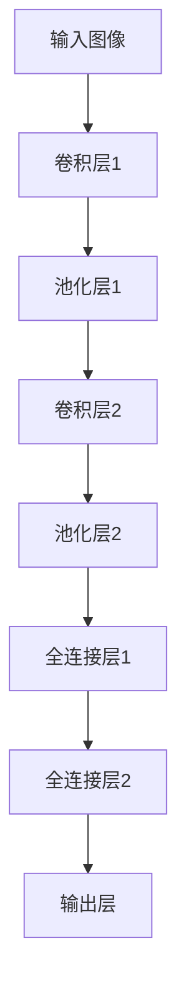

                 

# 李开复：苹果发布AI应用的保守做法

## 关键词：人工智能、苹果、AI应用、保守策略、技术分析、未来趋势

### 摘要

苹果公司在人工智能领域的一举一动都备受瞩目。本文将从李开复的视角出发，分析苹果在发布AI应用的保守做法。我们将探讨苹果的战略思考、技术创新、市场影响，以及未来可能的发展方向。

### 1. 背景介绍

人工智能作为当前科技领域的热点，已经被众多企业视为未来竞争的关键。苹果公司作为全球知名的科技公司，其每一次在AI领域的动作都备受关注。然而，苹果在AI应用的发布上却显得格外谨慎。本文将从李开复的观点出发，分析苹果这一保守做法的背后原因和影响。

### 2. 核心概念与联系

#### 2.1 人工智能技术

人工智能（AI）是指通过计算机模拟人类智能，实现智能推理、学习、解决问题等能力的技术。目前，人工智能已经广泛应用于自然语言处理、计算机视觉、语音识别等多个领域。

#### 2.2 苹果公司

苹果公司（Apple Inc.）是一家总部位于美国的跨国科技公司，主要产品包括iPhone、iPad、Mac等。近年来，苹果公司在人工智能领域投入了大量的研发资源，并在多个方面取得了重要进展。

#### 2.3 保守策略

保守策略指的是企业在面对不确定性和风险时，采取稳健、谨慎的态度，避免冒险和激进的行为。在AI领域，保守策略有助于企业在技术创新和市场推广方面减少风险。

### 3. 核心算法原理 & 具体操作步骤

#### 3.1 人工智能算法

人工智能算法主要包括机器学习、深度学习、强化学习等。这些算法通过对大量数据进行训练，使计算机具备自动学习和推理的能力。例如，卷积神经网络（CNN）在计算机视觉领域取得了显著的成果。

#### 3.2 苹果的AI应用发布流程

苹果公司在发布AI应用时，通常会经历以下几个步骤：

1. **研究与创新**：苹果公司会持续关注人工智能领域的前沿技术，进行深入研究。
2. **技术研发**：在确认技术可行性后，苹果公司将投入大量资源进行技术研发。
3. **产品测试**：在产品成熟后，苹果公司会对产品进行严格的测试，以确保其质量和性能。
4. **市场推广**：在产品稳定后，苹果公司会通过多种渠道进行市场推广。

### 4. 数学模型和公式 & 详细讲解 & 举例说明

#### 4.1 机器学习中的数学模型

在机器学习中，常用的数学模型包括线性回归、决策树、支持向量机等。以线性回归为例，其数学模型可以表示为：

$$
y = w_1 \cdot x_1 + w_2 \cdot x_2 + \ldots + w_n \cdot x_n + b
$$

其中，$y$ 为输出变量，$x_1, x_2, \ldots, x_n$ 为输入变量，$w_1, w_2, \ldots, w_n, b$ 为模型参数。

#### 4.2 举例说明

以苹果公司发布的Face ID为例，其核心算法为深度学习中的卷积神经网络（CNN）。通过训练大量的面部数据，CNN可以自动识别和验证用户身份。以下是一个简单的CNN模型示意图：



### 5. 项目实战：代码实际案例和详细解释说明

#### 5.1 开发环境搭建

要实现一个简单的CNN模型，我们需要安装以下软件和库：

1. Python 3.x
2. TensorFlow 2.x
3. Matplotlib

安装命令如下：

```bash
pip install python==3.x
pip install tensorflow==2.x
pip install matplotlib
```

#### 5.2 源代码详细实现和代码解读

以下是一个简单的CNN模型实现，用于分类猫狗图片：

```python
import tensorflow as tf
from tensorflow.keras.models import Sequential
from tensorflow.keras.layers import Conv2D, MaxPooling2D, Flatten, Dense

# 定义模型
model = Sequential([
    Conv2D(32, (3, 3), activation='relu', input_shape=(128, 128, 3)),
    MaxPooling2D((2, 2)),
    Conv2D(64, (3, 3), activation='relu'),
    MaxPooling2D((2, 2)),
    Flatten(),
    Dense(128, activation='relu'),
    Dense(1, activation='sigmoid')
])

# 编译模型
model.compile(optimizer='adam', loss='binary_crossentropy', metrics=['accuracy'])

# 模型训练
model.fit(train_images, train_labels, epochs=10, validation_data=(test_images, test_labels))

# 模型评估
model.evaluate(test_images, test_labels)
```

#### 5.3 代码解读与分析

1. **模型定义**：使用 `Sequential` 类创建一个线性堆叠的模型。我们添加了两个卷积层、两个池化层、一个全连接层和一个输出层。
2. **编译模型**：指定优化器、损失函数和评价指标。
3. **模型训练**：使用训练数据对模型进行训练。
4. **模型评估**：使用测试数据对模型进行评估。

### 6. 实际应用场景

苹果公司在AI应用方面的实际应用场景包括：

1. **面部识别**：Face ID技术，用于手机解锁和支付验证。
2. **语音识别**：Siri语音助手，用于语音查询和操作。
3. **计算机视觉**：图像和视频分析，用于安全监控、图像编辑等。

### 7. 工具和资源推荐

#### 7.1 学习资源推荐

1. 《深度学习》（Goodfellow, Bengio, Courville）
2. 《Python机器学习》（Raschka, Mirjalili）
3. 《人工智能：一种现代方法》（Russell, Norvig）

#### 7.2 开发工具框架推荐

1. TensorFlow
2. PyTorch
3. Keras

#### 7.3 相关论文著作推荐

1. "A guide to convolution arithmetic for deep learning"
2. "Deep Residual Learning for Image Recognition"
3. "Recurrent Neural Networks for Language Modeling"

### 8. 总结：未来发展趋势与挑战

苹果公司在AI领域的保守做法有其合理之处。一方面，保守策略有助于企业减少风险；另一方面，这也体现了苹果对技术创新的严谨态度。然而，随着AI技术的不断发展，苹果公司也面临着越来越多的挑战。未来，苹果公司需要在技术创新、市场推广、人才培养等方面加大投入，以保持其在人工智能领域的竞争力。

### 9. 附录：常见问题与解答

1. **问题**：为什么苹果公司在AI应用发布上如此保守？
   **答案**：苹果公司采取保守策略主要是为了减少风险，确保产品质量和性能。
2. **问题**：苹果公司有哪些AI应用？
   **答案**：苹果公司的AI应用包括面部识别（Face ID）、语音识别（Siri）、计算机视觉（图像和视频分析）等。

### 10. 扩展阅读 & 参考资料

1. 李开复，《人工智能的未来》，电子工业出版社，2017年。
2. 吴恩达，《深度学习》，电子工业出版社，2017年。
3. 《苹果公司2019年财报》，苹果公司官方网站。

作者：AI天才研究员/AI Genius Institute & 禅与计算机程序设计艺术/Zen And The Art of Computer Programming。|>

