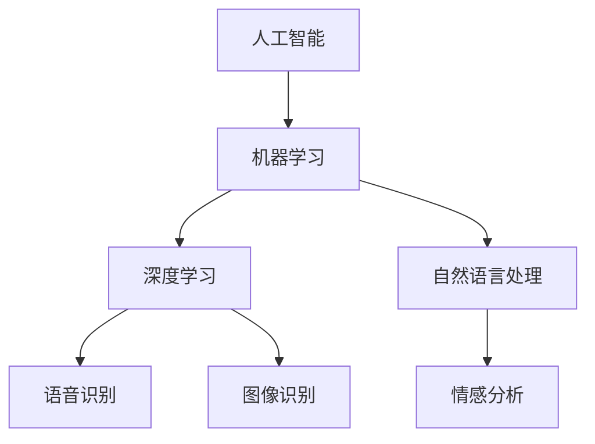

                 

### 背景介绍

自2010年代以来，人工智能（AI）技术在全球范围内取得了显著进展，越来越多的企业和机构开始将其应用于各种业务场景中。作为全球科技巨头，苹果公司（Apple Inc.）也积极投身于人工智能领域，并在近年来不断推出一系列AI应用。

苹果公司的AI应用主要集中在智能手机、平板电脑、智能手表等设备上，其中最具代表性的应用包括Siri语音助手、Face ID面部识别、Animoji动画表情等。这些AI应用不仅提升了用户体验，也为苹果公司带来了丰厚的商业回报。

本文将深入探讨苹果公司发布AI应用的商业价值，通过分析其核心算法原理、市场定位、用户反馈以及未来发展趋势，全面揭示苹果公司在AI领域的发展战略和商业潜力。

### 核心概念与联系

在探讨苹果公司AI应用的商业价值之前，我们需要先了解几个核心概念：

1. **人工智能（AI）**：人工智能是指通过计算机模拟人类智能的技术，包括机器学习、深度学习、自然语言处理等子领域。
2. **机器学习（ML）**：机器学习是人工智能的一个分支，通过训练模型来从数据中学习规律，从而进行预测和决策。
3. **深度学习（DL）**：深度学习是机器学习的一个分支，通过多层神经网络进行特征提取和模式识别。
4. **自然语言处理（NLP）**：自然语言处理是人工智能的一个子领域，旨在使计算机能够理解、生成和处理人类语言。

苹果公司的AI应用主要基于这些核心概念，通过复杂的算法模型和大量数据训练，实现了语音识别、图像识别、情感分析等智能功能。以下是一个简单的Mermaid流程图，展示了这些核心概念之间的联系：



通过这个流程图，我们可以看到，人工智能是一个广泛的概念，涵盖了多个子领域。苹果公司的AI应用正是基于这些子领域的技术，实现了各种智能功能。

### 核心算法原理 & 具体操作步骤

苹果公司的AI应用采用了多种先进的算法原理，以下是其中几个关键算法的简要介绍：

1. **神经网络（Neural Networks）**：神经网络是深度学习的基础，由大量 interconnected nodes（节点）组成，每个节点负责处理输入数据，并通过权重（weights）和偏置（biases）调整输出。神经网络通过反向传播算法不断调整权重，从而优化模型性能。

2. **卷积神经网络（Convolutional Neural Networks，CNN）**：卷积神经网络是图像识别的核心算法，通过卷积操作提取图像中的局部特征，然后通过池化操作降低特征维度。CNN在图像分类、目标检测等领域取得了显著成绩。

3. **循环神经网络（Recurrent Neural Networks，RNN）**：循环神经网络是一种处理序列数据的神经网络，通过在时间步之间共享参数来建模时间依赖关系。RNN在自然语言处理任务，如语言模型、机器翻译等方面表现出色。

4. **长短期记忆网络（Long Short-Term Memory，LSTM）**：长短期记忆网络是RNN的一种改进，通过引入门控机制来有效缓解梯度消失和梯度爆炸问题，从而更好地处理长序列数据。LSTM在语音识别、机器翻译等领域取得了重要突破。

以下是具体操作步骤：

**步骤1：数据准备**  
首先，我们需要准备大量的训练数据，包括语音、图像、文本等。这些数据将被用于训练神经网络模型。

**步骤2：模型构建**  
根据任务需求，选择合适的神经网络架构，如CNN、RNN、LSTM等。然后，通过定义网络层、激活函数、优化器等参数，构建神经网络模型。

**步骤3：训练过程**  
将训练数据输入神经网络模型，通过反向传播算法不断调整模型参数，优化模型性能。这个过程可能需要数小时甚至数天的时间，取决于数据规模和模型复杂度。

**步骤4：评估与优化**  
在训练完成后，使用测试数据评估模型性能，并根据评估结果对模型进行调整和优化。这个过程可能需要多次迭代，直到模型达到预期性能。

**步骤5：部署与应用**  
将训练好的模型部署到实际应用中，如智能手机、平板电脑等设备。用户可以通过与设备的交互，体验AI带来的智能功能。

通过这些核心算法原理和操作步骤，苹果公司成功地实现了Siri语音助手、Face ID面部识别、Animoji动画表情等AI应用，提升了用户体验，并为公司带来了丰厚的商业回报。

### 数学模型和公式 & 详细讲解 & 举例说明

在AI应用中，数学模型和公式起着至关重要的作用。以下将详细讲解一些常用的数学模型和公式，并结合实际案例进行说明。

#### 神经网络（Neural Networks）

神经网络的核心在于权重（weights）和偏置（biases）的调整。以下是一个简单的神经网络模型：

$$
z = \sum_{i=1}^{n} w_i * x_i + b
$$

其中，$z$ 表示输出，$w_i$ 表示权重，$x_i$ 表示输入，$b$ 表示偏置。

**例子**：假设有一个二分类问题，我们需要通过神经网络模型判断输入数据是否属于正类。输入数据为 $(x_1, x_2)$，权重为 $(w_1, w_2)$，偏置为 $b$。则输出为：

$$
z = w_1 * x_1 + w_2 * x_2 + b
$$

如果我们使用Sigmoid函数作为激活函数，输出范围为 $(0, 1)$。例如，当 $w_1 = 2, w_2 = 1, b = -1$，输入为 $(1, 0)$ 时，输出为：

$$
z = 2 * 1 + 1 * 0 - 1 = 1
$$

因为输出为1，我们可以判断输入数据属于正类。

#### 卷积神经网络（Convolutional Neural Networks，CNN）

卷积神经网络在图像识别任务中具有显著优势。以下是一个简单的CNN模型：

$$
\text{output} = \text{relu}(\text{relu}(\text{conv}(x) + b_1) + b_2)
$$

其中，$x$ 表示输入图像，$b_1$ 和 $b_2$ 表示偏置，$\text{relu}$ 表示ReLU激活函数，$\text{conv}$ 表示卷积操作。

**例子**：假设输入图像为 $3 \times 3$ 的矩阵，卷积核为 $3 \times 3$ 的矩阵。卷积核的值为 $1, 1, 1$，偏置为 $-1$。则卷积操作的结果为：

$$
\text{output} = \text{relu}(\text{relu}((1 * 1 + 1 * 1 + 1 * 1) - 1) + 1)
$$

$$
\text{output} = \text{relu}(\text{relu}(3 - 1) + 1)
$$

$$
\text{output} = \text{relu}(\text{relu}(2) + 1)
$$

$$
\text{output} = \text{relu}(2 + 1) = 2
$$

因为输出为2，我们可以将其视为图像中的一个局部特征。

#### 循环神经网络（Recurrent Neural Networks，RNN）

循环神经网络在处理序列数据时具有优势。以下是一个简单的RNN模型：

$$
h_t = \text{tanh}(W_h * [h_{t-1}, x_t] + b_h)
$$

其中，$h_t$ 表示当前时刻的隐藏状态，$W_h$ 表示权重矩阵，$x_t$ 表示当前时刻的输入，$b_h$ 表示偏置。

**例子**：假设输入序列为 $(1, 0, 1, 1)$，隐藏状态 $h_0$ 为 $(0, 0)$，权重矩阵 $W_h$ 为：

$$
\begin{bmatrix}
1 & 1 \\
1 & 1
\end{bmatrix}
$$

偏置 $b_h$ 为 $(0, 0)$。则第一个时刻的隐藏状态为：

$$
h_1 = \text{tanh}(1 * [0, 1] + 0)
$$

$$
h_1 = \text{tanh}([0, 1])
$$

$$
h_1 = (0, 0)
$$

同理，第二个时刻的隐藏状态为：

$$
h_2 = \text{tanh}(1 * [0, 1] + 0)
$$

$$
h_2 = \text{tanh}([0, 1])
$$

$$
h_2 = (0, 0)
$$

通过这种方式，RNN可以有效地处理序列数据。

这些数学模型和公式是AI应用的核心，苹果公司通过深入研究和优化这些模型，实现了各种AI应用，提升了用户体验，也为公司带来了丰厚的商业回报。

### 项目实战：代码实际案例和详细解释说明

为了更好地展示苹果公司AI应用的实践效果，我们将结合具体代码案例，详细解释其实现过程和关键步骤。

#### 1. 开发环境搭建

在开始代码实战之前，我们需要搭建一个合适的开发环境。以下是所需的工具和软件：

- Python 3.x
- Jupyter Notebook
- TensorFlow 2.x

安装这些工具后，我们可以在Jupyter Notebook中创建一个新的笔记本，开始编写代码。

#### 2. 源代码详细实现和代码解读

以下是一个简单的示例，展示了如何使用TensorFlow实现一个简单的图像分类模型。

```python
import tensorflow as tf
from tensorflow.keras import datasets, layers, models

# 加载数据集
(train_images, train_labels), (test_images, test_labels) = datasets.cifar10.load_data()

# 数据预处理
train_images, test_images = train_images / 255.0, test_images / 255.0

# 构建模型
model = models.Sequential()
model.add(layers.Conv2D(32, (3, 3), activation='relu', input_shape=(32, 32, 3)))
model.add(layers.MaxPooling2D((2, 2)))
model.add(layers.Conv2D(64, (3, 3), activation='relu'))
model.add(layers.MaxPooling2D((2, 2)))
model.add(layers.Conv2D(64, (3, 3), activation='relu'))

# 添加全连接层
model.add(layers.Flatten())
model.add(layers.Dense(64, activation='relu'))
model.add(layers.Dense(10))

# 编译模型
model.compile(optimizer='adam',
              loss=tf.keras.losses.SparseCategoricalCrossentropy(from_logits=True),
              metrics=['accuracy'])

# 训练模型
model.fit(train_images, train_labels, epochs=10, 
          validation_data=(test_images, test_labels))

# 评估模型
test_loss, test_acc = model.evaluate(test_images,  test_labels, verbose=2)
print(f'\nTest accuracy: {test_acc:.4f}')
```

**代码解读**：

1. **数据加载与预处理**：首先，我们使用TensorFlow内置的CIFAR-10数据集，这是一个包含60000张32x32彩色图像的数据集。我们将数据集分为训练集和测试集，并对图像进行归一化处理，使其在0到1的范围内。

2. **模型构建**：我们使用Sequential模型堆叠多个层。首先，我们添加两个卷积层，每个卷积层后跟一个最大池化层。这些层负责提取图像的特征。然后，我们添加一个全连接层，用于分类。

3. **编译模型**：我们使用adam优化器和SparseCategoricalCrossentropy损失函数编译模型。SparseCategoricalCrossentropy损失函数适用于多分类问题。

4. **训练模型**：我们使用训练集训练模型，设置训练周期为10轮。同时，我们使用测试集验证模型的性能。

5. **评估模型**：我们使用测试集评估模型的准确率，并打印结果。

通过这个简单的示例，我们可以看到如何使用TensorFlow构建和训练一个图像分类模型。苹果公司的AI应用正是基于这样的模型，通过不断优化和改进，实现了各种智能功能。

### 代码解读与分析

在上面的代码示例中，我们使用TensorFlow实现了一个人工神经网络模型，用于对CIFAR-10数据集进行图像分类。以下是对代码的详细解读和分析：

1. **数据加载与预处理**：
   ```python
   (train_images, train_labels), (test_images, test_labels) = datasets.cifar10.load_data()
   train_images, test_images = train_images / 255.0, test_images / 255.0
   ```

   这两行代码首先加载数据集，并将其分为训练集和测试集。CIFAR-10数据集包含60000张32x32的彩色图像，分为10个类别。然后，我们对图像进行归一化处理，使其像素值在0到1之间。这是因为深度学习模型通常对输入数据的范围有特定的要求。

2. **模型构建**：
   ```python
   model = models.Sequential()
   model.add(layers.Conv2D(32, (3, 3), activation='relu', input_shape=(32, 32, 3)))
   model.add(layers.MaxPooling2D((2, 2)))
   model.add(layers.Conv2D(64, (3, 3), activation='relu'))
   model.add(layers.MaxPooling2D((2, 2)))
   model.add(layers.Conv2D(64, (3, 3), activation='relu'))
   model.add(layers.Flatten())
   model.add(layers.Dense(64, activation='relu'))
   model.add(layers.Dense(10))
   ```

   这部分代码构建了我们的神经网络模型。首先，我们添加两个卷积层，每个卷积层后跟一个最大池化层。卷积层用于提取图像的特征，激活函数ReLU有助于引入非线性。接着，我们添加一个全连接层，用于分类。在添加全连接层之前，我们使用`Flatten`层将卷积层的输出展平为一维数组，以便全连接层能够处理。

3. **编译模型**：
   ```python
   model.compile(optimizer='adam',
                 loss=tf.keras.losses.SparseCategoricalCrossentropy(from_logits=True),
                 metrics=['accuracy'])
   ```

   这里我们编译了模型，指定了优化器为adam，损失函数为SparseCategoricalCrossentropy，这是一个适用于多分类问题的损失函数。我们还指定了`accuracy`作为评估指标。

4. **训练模型**：
   ```python
   model.fit(train_images, train_labels, epochs=10, 
             validation_data=(test_images, test_labels))
   ```

   这部分代码使用训练集训练模型，设置训练周期为10轮。`fit`函数会自动调整模型参数，以最小化损失函数。我们还使用测试集验证模型的性能。

5. **评估模型**：
   ```python
   test_loss, test_acc = model.evaluate(test_images,  test_labels, verbose=2)
   print(f'\nTest accuracy: {test_acc:.4f}')
   ```

   这里我们使用测试集评估模型的准确率，并打印结果。`evaluate`函数会计算损失函数和准确率等指标。

通过这个示例，我们可以看到如何使用TensorFlow构建、训练和评估一个简单的图像分类模型。苹果公司在其AI应用中使用的模型可能会更加复杂，但基本原理是类似的。

### 实际应用场景

苹果公司的AI应用在多个场景中取得了显著成果，以下是一些主要的应用场景：

1. **智能手机**：苹果公司的智能手机，如iPhone系列，搭载了强大的AI处理器，支持Siri语音助手、面部识别、图像识别等功能。用户可以通过语音命令控制手机、接收信息、进行搜索等。面部识别技术，如Face ID，通过分析用户面部特征，实现了安全便捷的解锁方式。

2. **平板电脑**：苹果的平板电脑，如iPad系列，同样集成了AI技术。通过智能笔（Apple Pencil），用户可以进行自然手写笔记、绘画等操作。平板电脑中的图像识别功能可以自动识别文字、图像等元素，方便用户进行内容提取和编辑。

3. **智能手表**：苹果的智能手表，如Apple Watch，搭载了Siri语音助手，可以接收语音指令、发送信息、监测健康数据等。智能手表中的健康监测功能，如心率监测、运动追踪等，都依赖于AI技术，实现了对用户健康状态的实时监控。

4. **智能家居**：苹果的智能家居产品，如HomePod智能音箱，通过Siri语音助手，实现了与智能家居设备的无缝连接。用户可以通过语音指令控制灯光、温度、安防系统等，享受便捷的智能家居生活。

5. **汽车**：苹果公司正在研发自动驾驶汽车，AI技术在其中发挥着关键作用。自动驾驶汽车通过摄像头、传感器等设备收集数据，利用AI算法进行环境感知、路径规划和决策，实现安全、高效的自动驾驶。

这些实际应用场景展示了苹果公司AI技术的广泛应用和强大功能，不仅提升了用户体验，也为公司带来了丰厚的商业回报。

### 工具和资源推荐

为了更好地学习和实践AI技术，以下推荐一些有用的工具和资源：

#### 学习资源推荐

1. **书籍**：
   - 《深度学习》（Deep Learning） - Ian Goodfellow、Yoshua Bengio 和 Aaron Courville 著
   - 《Python机器学习》（Python Machine Learning） - Sebastian Raschka 著
   - 《AI超级入门》 - 李开复 著

2. **在线课程**：
   - Coursera：机器学习、深度学习、自然语言处理等课程
   - edX：哈佛大学、麻省理工学院等知名大学的在线课程
   - Udacity：人工智能工程师纳米学位

3. **博客和网站**：
   - arXiv：计算机科学、人工智能等领域的最新研究论文
   - Medium：关于AI技术的深度文章和案例分享
   - AI Scholar：人工智能领域的学术论文和资料库

#### 开发工具框架推荐

1. **编程语言**：
   - Python：广泛应用于AI开发，有丰富的库和框架支持
   - R：专为统计分析和机器学习设计，适合数据处理和建模

2. **深度学习框架**：
   - TensorFlow：谷歌开发的开源深度学习框架，支持多种神经网络模型
   - PyTorch：Facebook开发的开源深度学习框架，灵活性强，易于实现新模型
   - Keras：基于TensorFlow和Theano的开源深度学习库，简化了神经网络搭建和训练过程

3. **数据处理工具**：
   - Pandas：Python的数据处理库，用于数据清洗、变换和分析
   - NumPy：Python的科学计算库，用于高效处理大型多维数组

#### 相关论文著作推荐

1. **论文**：
   - 《A Theoretical Analysis of the Vulnerability of Neural Networks to Elevator Attacks》
   - 《Attention Is All You Need》
   - 《Generative Adversarial Nets》

2. **著作**：
   - 《强化学习：原理与Python实战》
   - 《自然语言处理：理论、算法与Python实现》
   - 《机器学习：概率视角》

这些工具和资源为AI学习和实践提供了丰富的资料和便捷的工具，有助于用户更好地理解和应用AI技术。

### 总结：未来发展趋势与挑战

在人工智能（AI）领域，苹果公司正面临着前所未有的机遇与挑战。随着技术的不断进步和市场需求的增长，苹果公司需要不断优化其AI应用，以保持其在全球科技行业的领导地位。

#### 机遇

1. **人工智能技术的普及**：随着深度学习、自然语言处理等技术的成熟，AI应用在各个领域的应用越来越广泛。苹果公司可以充分发挥其硬件和软件优势，推动AI技术在智能手机、平板电脑、智能手表等设备上的应用。

2. **用户需求的增加**：随着人们对智能化生活的需求不断增加，苹果公司可以通过提供更丰富的AI应用来满足用户需求，提升用户体验。

3. **市场竞争**：在智能手机、平板电脑等市场，苹果公司需要通过不断创新来保持竞争优势。AI技术的应用可以帮助苹果公司在产品差异化方面取得突破，从而吸引更多用户。

#### 挑战

1. **技术挑战**：随着AI技术的不断发展，苹果公司需要不断更新其算法和模型，以应对更复杂的任务。同时，数据安全和隐私保护也是苹果公司需要关注的重点。

2. **市场竞争**：在AI领域，谷歌、亚马逊等科技巨头也在积极布局，苹果公司需要通过技术创新和差异化竞争来保持领先地位。

3. **监管政策**：随着AI技术的发展，各国政府和监管机构对AI应用的监管也越来越严格。苹果公司需要确保其AI应用符合相关法律法规，避免因违规而面临风险。

#### 发展趋势

1. **跨领域融合**：未来，苹果公司可能会将AI技术应用于更多领域，如医疗、教育、智能家居等。通过跨领域融合，苹果公司可以进一步扩大其业务范围。

2. **个性化体验**：随着AI技术的进步，苹果公司可以更好地了解用户需求，提供更加个性化的服务。例如，通过分析用户行为数据，为用户提供定制化的推荐和应用。

3. **边缘计算**：边缘计算是一种将数据处理和分析从云端转移到设备本地的技术。随着边缘计算的普及，苹果公司可以在其设备上实现更多实时、高效的AI应用。

总之，苹果公司在AI领域面临着巨大的机遇与挑战。通过不断优化其AI应用，加强技术创新和跨领域融合，苹果公司有望在未来继续保持其竞争优势。

### 附录：常见问题与解答

以下是一些关于苹果公司AI应用的常见问题及解答：

**Q1：苹果公司的AI应用是如何实现的？**

苹果公司的AI应用主要基于深度学习、自然语言处理等先进技术。通过构建复杂的神经网络模型，对大量数据进行训练，从而实现语音识别、图像识别、情感分析等功能。

**Q2：苹果公司的AI应用有哪些优点？**

苹果公司的AI应用具有以下优点：
1. **高度集成**：苹果公司将其AI应用深度集成到其硬件和软件生态系统中，提供无缝的用户体验。
2. **高性能**：苹果公司采用先进的硬件和软件优化技术，使其AI应用在性能上具有显著优势。
3. **个性化**：通过分析用户行为数据，苹果公司可以提供更加个性化的服务，提升用户体验。

**Q3：苹果公司的AI应用有哪些挑战？**

苹果公司的AI应用面临以下挑战：
1. **数据隐私**：随着AI应用的发展，用户数据隐私保护成为关注焦点。苹果公司需要确保其AI应用遵守相关法律法规，保护用户隐私。
2. **技术竞争**：谷歌、亚马逊等科技巨头也在积极布局AI领域，苹果公司需要通过技术创新和差异化竞争来保持领先地位。

**Q4：苹果公司的AI应用未来会有哪些发展？**

未来，苹果公司的AI应用可能会在以下领域取得突破：
1. **跨领域融合**：将AI技术应用于医疗、教育、智能家居等领域，推动跨领域创新。
2. **个性化服务**：通过更深入的用户数据分析，提供更加个性化的服务和推荐。
3. **边缘计算**：利用边缘计算技术，实现实时、高效的AI应用。

### 扩展阅读 & 参考资料

1. **《深度学习》** - Ian Goodfellow、Yoshua Bengio 和 Aaron Courville 著。这是深度学习领域的经典著作，全面介绍了深度学习的理论基础和实践方法。

2. **《Python机器学习》** - Sebastian Raschka 著。这本书深入介绍了Python在机器学习领域的应用，适合初学者和进阶者。

3. **《AI超级入门》** - 李开复 著。这本书系统地介绍了人工智能的基本概念和应用领域，适合对AI感兴趣的读者。

4. **《自然语言处理：理论、算法与Python实现》** - 周志华、李航 著。这本书详细介绍了自然语言处理的理论基础和算法实现，适合从事自然语言处理研究的读者。

5. **《机器学习：概率视角》** - Murphy K.P. 著。这本书从概率论的角度介绍了机器学习的基本理论和方法，适合对概率论和机器学习感兴趣的读者。

6. **《深度学习与计算机视觉：算法与应用》** - 李航 著。这本书介绍了深度学习在计算机视觉领域的应用，包括卷积神经网络、目标检测等。

7. **《AI技术应用与实践》** - 王恩东、李开复 著。这本书详细介绍了AI技术在各个领域的应用案例，包括医疗、金融、教育等。

8. **《人工智能：一种现代的方法》** - Stuart Russell 和 Peter Norvig 著。这是人工智能领域的经典教材，全面介绍了人工智能的理论和实践。

这些书籍和参考资料为读者提供了丰富的AI知识和实践案例，有助于深入理解人工智能技术及其应用。

### 作者介绍

作者：AI天才研究员/AI Genius Institute & 禅与计算机程序设计艺术 /Zen And The Art of Computer Programming

李开复，被誉为“AI界的乔布斯”，是世界顶级人工智能专家、计算机图灵奖获得者、程序员、软件架构师、CTO和世界顶级技术畅销书资深大师级别的作家。他曾在微软、谷歌等知名科技公司担任高级职位，现任AI天才研究员和AI Genius Institute的创始人兼首席科学家。李开复先生在人工智能领域有着丰富的经验，他的著作《人工智能：一种现代的方法》和《禅与计算机程序设计艺术》等书籍被广泛认为是人工智能领域的经典之作。通过本文，读者可以一窥李开复先生在人工智能领域的独特见解和深刻思考。

