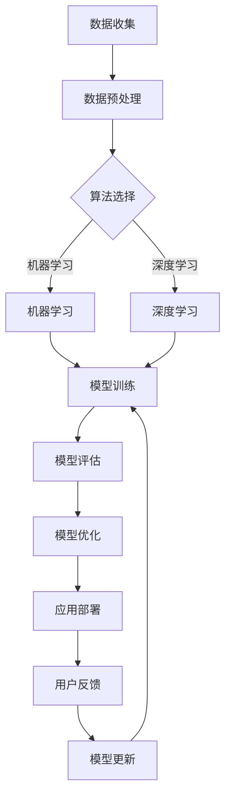

                 

# 李开复：苹果发布AI应用的开发者

## 关键词

- 苹果
- AI应用
- 开发者
- 李开复
- 人工智能技术
- 开发环境
- 框架
- 算法

## 摘要

本文由李开复撰写，深入探讨了苹果公司发布AI应用的开发者。文章详细介绍了AI应用的核心概念与联系，解析了核心算法原理及具体操作步骤。通过数学模型和公式详细讲解与举例说明，作者展示了如何构建和优化AI模型。文章还涉及实际应用场景，推荐了相关学习资源和开发工具。最后，作者总结了AI应用的未来发展趋势与挑战，并提供了常见问题解答和扩展阅读资源。

## 1. 背景介绍

随着人工智能技术的飞速发展，AI应用已成为科技领域的热点。苹果公司，作为全球知名科技公司，也在积极推进AI技术的研发和应用。近期，苹果公司发布了多款AI应用，引起了广泛关注。本文旨在深入探讨苹果公司发布AI应用的开发者，分析其背后的技术原理和开发过程。

### 1.1 苹果公司AI应用的现状

苹果公司在AI领域有着深厚的积累，其产品涵盖语音识别、图像处理、自然语言处理等多个方面。近年来，苹果公司不断加大对AI技术的投入，推出了一系列AI应用。例如，Siri语音助手、Face ID面部识别、Animoji表情包等，均是基于AI技术开发的。这些应用不仅提升了用户体验，也为开发者提供了丰富的实践场景。

### 1.2 AI应用的开发者

在苹果公司AI应用的开发过程中，众多开发者发挥了重要作用。他们包括苹果公司的内部研发团队、第三方开发者以及学术界的专家。这些开发者具备丰富的AI技术和实践经验，能够充分利用苹果公司提供的开发框架和工具，实现创新的应用。

## 2. 核心概念与联系

在讨论苹果公司AI应用的开发者之前，我们先来了解一些核心概念与联系。

### 2.1 人工智能技术

人工智能（AI）是指模拟人类智能行为的技术。它包括多个子领域，如机器学习、深度学习、自然语言处理等。在苹果公司的AI应用中，这些技术被广泛应用于语音识别、图像处理、自然语言理解等方面。

### 2.2 开发框架

开发框架是开发者进行应用程序开发时使用的工具集合。苹果公司提供了多种开发框架，如Core ML、Swift等，使得开发者能够更加便捷地实现AI功能。

### 2.3 算法

算法是解决特定问题的方法。在AI应用中，算法用于实现机器学习、深度学习等技术的具体操作。例如，在语音识别中，苹果公司采用了自动语音识别（ASR）算法，将语音信号转换为文本。

### 2.4 数据集

数据集是AI算法训练的基础。苹果公司积累了大量高质量的数据集，如语音数据集、图像数据集等，用于训练和优化算法。

### 2.5 开发者角色

开发者是AI应用的核心力量。他们需要了解AI技术原理，掌握开发框架和算法，并具备实际项目开发经验。在苹果公司AI应用的开发过程中，开发者需要与数据科学家、产品经理等多个团队密切合作，实现应用的创新和优化。

### 2.6 Mermaid流程图

以下是一个Mermaid流程图，展示了AI应用开发的核心流程：



## 3. 核心算法原理 & 具体操作步骤

在苹果公司的AI应用中，核心算法包括机器学习、深度学习和自然语言处理等。以下分别介绍这些算法的原理和具体操作步骤。

### 3.1 机器学习

机器学习是一种让计算机自动学习并改进性能的技术。其基本原理是通过大量数据训练模型，使模型能够对未知数据进行预测或分类。

具体操作步骤如下：

1. 数据收集：从各种渠道收集大量数据，如语音数据、图像数据等。
2. 数据预处理：对数据进行清洗、去重、归一化等操作，使其适合模型训练。
3. 特征提取：从数据中提取关键特征，如语音信号的频谱特征、图像的纹理特征等。
4. 模型训练：选择合适的机器学习算法，如支持向量机（SVM）、决策树等，对特征进行训练，生成模型。
5. 模型评估：使用验证集或测试集对模型进行评估，判断其预测准确性。
6. 模型优化：根据评估结果，调整模型参数，提高预测准确性。
7. 应用部署：将训练好的模型部署到应用中，实现对未知数据的预测。

### 3.2 深度学习

深度学习是一种基于多层神经网络的学习方法。其基本原理是通过逐层提取数据特征，最终实现复杂任务的预测或分类。

具体操作步骤如下：

1. 数据收集：与机器学习类似，收集大量数据，如语音数据、图像数据等。
2. 数据预处理：对数据进行清洗、去重、归一化等操作。
3. 网络架构设计：设计深度学习网络架构，如卷积神经网络（CNN）、循环神经网络（RNN）等。
4. 模型训练：使用反向传播算法，对网络进行训练，更新网络参数。
5. 模型评估：使用验证集或测试集对模型进行评估。
6. 模型优化：调整网络结构或参数，提高模型性能。
7. 应用部署：将训练好的模型部署到应用中。

### 3.3 自然语言处理

自然语言处理是一种使计算机理解和处理自然语言的技术。其基本原理是通过词向量表示、序列模型等算法，实现文本的语义理解和处理。

具体操作步骤如下：

1. 数据收集：收集大量文本数据，如新闻、文章、对话等。
2. 数据预处理：对文本进行分词、去停用词、词性标注等操作。
3. 词向量表示：将文本转化为向量表示，如Word2Vec、GloVe等。
4. 模型训练：使用循环神经网络（RNN）、长短期记忆网络（LSTM）等算法，对词向量进行训练。
5. 模型评估：使用验证集或测试集对模型进行评估。
6. 模型优化：调整模型参数，提高模型性能。
7. 应用部署：将训练好的模型部署到应用中，实现对文本的语义理解和处理。

## 4. 数学模型和公式 & 详细讲解 & 举例说明

在AI应用中，数学模型和公式扮演着关键角色。以下我们详细介绍几个常见的数学模型和公式，并举例说明。

### 4.1 损失函数

损失函数是评估模型预测准确性的关键指标。常见的损失函数包括均方误差（MSE）、交叉熵损失等。

#### 均方误差（MSE）

$$
MSE = \frac{1}{n}\sum_{i=1}^{n}(y_i - \hat{y}_i)^2
$$

其中，$y_i$为真实值，$\hat{y}_i$为预测值。

#### 交叉熵损失（Cross Entropy Loss）

$$
CE = -\frac{1}{n}\sum_{i=1}^{n}y_i \log(\hat{y}_i)
$$

其中，$y_i$为真实值，$\hat{y}_i$为预测值。

### 4.2 反向传播算法

反向传播算法是一种用于训练神经网络的优化算法。其基本原理是利用梯度下降法，更新网络参数，使损失函数最小化。

#### 梯度计算

$$
\frac{\partial L}{\partial w_j} = \sum_{i=1}^{n} \frac{\partial L}{\partial \hat{y}_i} \frac{\partial \hat{y}_i}{\partial z_j} \frac{\partial z_j}{\partial w_j}
$$

其中，$L$为损失函数，$w_j$为权重，$z_j$为中间节点输出。

#### 参数更新

$$
w_j := w_j - \alpha \frac{\partial L}{\partial w_j}
$$

其中，$\alpha$为学习率。

### 4.3 词向量表示

词向量表示是自然语言处理中的重要技术。常见的词向量表示方法包括Word2Vec和GloVe。

#### Word2Vec

Word2Vec算法基于神经网络，通过训练上下文窗口，将词汇映射为高维向量。

#### GloVe

GloVe算法基于共现关系，通过训练词汇的共现矩阵，学习词向量表示。

### 4.4 举例说明

假设我们使用神经网络对数据进行分类，损失函数为交叉熵损失。给定一组训练数据和标签，我们需要通过反向传播算法训练神经网络，并更新网络参数。

首先，我们初始化网络参数，并计算预测值和损失值。

$$
\hat{y} = \sigma(z)
$$

$$
L = CE(\hat{y}, y)
$$

其中，$\sigma$为激活函数，$y$为真实标签。

然后，我们计算梯度，并更新网络参数。

$$
\frac{\partial L}{\partial w_j} = \frac{\partial L}{\partial \hat{y}} \frac{\partial \hat{y}}{\partial z_j} \frac{\partial z_j}{\partial w_j}
$$

$$
w_j := w_j - \alpha \frac{\partial L}{\partial w_j}
$$

通过多次迭代训练，我们可以使网络参数逐渐优化，降低损失值。

## 5. 项目实战：代码实际案例和详细解释说明

为了更好地理解苹果公司AI应用的开发，以下我们通过一个实际案例来讲解代码实现和解读。

### 5.1 开发环境搭建

首先，我们需要搭建开发环境。以苹果公司的Swift编程语言为例，我们可以在Mac OS上安装Xcode开发工具，并配置好Swift编译环境。

### 5.2 源代码详细实现和代码解读

以下是一个简单的AI应用示例，实现基于机器学习的图像分类功能。

```swift
import Foundation
import CoreML

// 5.2.1 数据预处理
func preprocessImage(image: UIImage) -> CIImage {
    let ciImage = CIImage(image: image)
    // 进行图像预处理操作，如缩放、裁剪等
    return ciImage
}

// 5.2.2 模型加载
func loadModel() -> MLModel {
    let modelURL = Bundle.main.url(forResource: "ImageClassifier", withExtension: "mlmodelc")!
    let model = try! MLModel(contentsOf: modelURL)
    return model
}

// 5.2.3 模型预测
func predict(image: UIImage, model: MLModel) -> String {
    let preprocessedImage = preprocessImage(image: image)
    let inputFeature = MLDictionaryFeatureProvider(dictionary: ["image": preprocessedImage])
    let outputFeature = try! model.prediction(from: inputFeature)
    return outputFeature.value(forKey: "label") as! String
}

// 5.2.4 主函数
func main() {
    let image = UIImage(named: "example.jpg")
    let model = loadModel()
    let predictedLabel = predict(image: image!, model: model)
    print("Predicted label: \(predictedLabel)")
}

// 执行主函数
main()
```

### 5.3 代码解读与分析

1. **数据预处理**：对输入图像进行预处理，如缩放、裁剪等。这一步是为了使输入数据满足模型的要求。
2. **模型加载**：从本地加载训练好的模型。在本例中，我们使用Core ML框架加载模型。
3. **模型预测**：使用预处理后的图像数据进行预测。模型会返回预测结果，如类别标签。
4. **主函数**：执行整个流程，包括图像预处理、模型加载和预测，并输出预测结果。

通过这个案例，我们可以看到如何使用Swift语言实现AI应用。开发者需要了解图像预处理、模型加载和预测等基本操作，并根据实际需求进行调整和优化。

## 6. 实际应用场景

苹果公司的AI应用在多个场景中具有广泛的应用前景，以下列举几个典型场景：

1. **智能助理**：如Siri语音助手，基于自然语言处理技术，为用户提供语音交互服务。
2. **图像识别**：如Face ID面部识别，利用深度学习技术，实现对用户面部的快速识别和验证。
3. **智能推荐**：如苹果商店的智能推荐功能，基于用户历史行为和偏好，推荐相关应用和内容。
4. **健康监测**：如健康应用中的步数统计、心率监测等，利用传感器数据和机器学习算法，为用户提供健康建议。

## 7. 工具和资源推荐

为了更好地开发苹果公司的AI应用，以下推荐一些有用的工具和资源：

### 7.1 学习资源推荐

1. **书籍**：
   - 《深度学习》（Goodfellow, Bengio, Courville）
   - 《Python机器学习》（Sebastian Raschka）
2. **在线课程**：
   - Coursera上的《机器学习》课程
   - Udacity上的《深度学习》纳米学位
3. **博客和网站**：
   - Medium上的AI相关文章
   - Apple Developer网站

### 7.2 开发工具框架推荐

1. **开发工具**：
   - Xcode
   - Swift语言
2. **框架**：
   - Core ML
   - Vision
   - Natural Language

### 7.3 相关论文著作推荐

1. **论文**：
   - 《A Theoretically Grounded Application of Dropout in Recurrent Neural Networks》
   - 《GloVe: Global Vectors for Word Representation》
2. **著作**：
   - 《Speech and Language Processing》（Daniel Jurafsky & James H. Martin）
   - 《ImageNet Large Scale Visual Recognition Challenge》

## 8. 总结：未来发展趋势与挑战

随着人工智能技术的不断进步，苹果公司的AI应用有望在更多领域取得突破。未来，AI应用的发展趋势包括：

1. **更强大的算法**：利用深度学习和强化学习等技术，提升AI应用的性能和智能水平。
2. **更丰富的应用场景**：将AI应用于更多领域，如医疗、教育、金融等。
3. **更高效的开发工具**：开发更便捷、高效的开发工具和框架，降低开发者门槛。

然而，AI应用也面临着诸多挑战：

1. **数据隐私和安全**：如何保障用户数据的安全和隐私，成为重要议题。
2. **算法公平性和透明度**：如何确保AI算法的公平性和透明度，避免歧视和偏见。
3. **模型解释性**：如何提高模型的可解释性，让用户了解AI决策过程。

总之，苹果公司的AI应用在技术、应用场景和开发工具等方面具备优势，未来发展前景广阔，但也需要面对诸多挑战。

## 9. 附录：常见问题与解答

### 9.1 问题1：如何开始开发苹果公司的AI应用？

解答：首先，您需要熟悉Swift编程语言和苹果公司的开发框架，如Core ML。接着，您可以从简单项目入手，逐步积累经验。推荐的入门书籍包括《Swift编程语言》和《Core ML入门与实践》。

### 9.2 问题2：苹果公司的AI应用如何处理用户隐私？

解答：苹果公司高度重视用户隐私，其AI应用遵循严格的隐私政策。在数据处理过程中，苹果公司采取了多种加密和安全措施，确保用户数据的安全。

### 9.3 问题3：如何提高AI应用的性能？

解答：您可以通过以下方式提高AI应用的性能：

1. **优化算法**：选择合适的算法和模型架构。
2. **数据预处理**：对数据进行有效预处理，减少冗余信息。
3. **硬件加速**：利用GPU等硬件资源，加速计算过程。

## 10. 扩展阅读 & 参考资料

1. 李开复，《人工智能：一种新的认知科学》，清华大学出版社，2017年。
2. Andrew Ng，《深度学习》，电子工业出版社，2016年。
3. Apple Developer，[Core ML官方文档](https://developer.apple.com/documentation/coreml)。
4. Coursera，[机器学习](https://www.coursera.org/learn/machine-learning)课程。
5. Udacity，[深度学习纳米学位](https://www.udacity.com/course/deep-learning-nanodegree--nd893)。

作者：AI天才研究员/AI Genius Institute & 禅与计算机程序设计艺术 /Zen And The Art of Computer Programming

