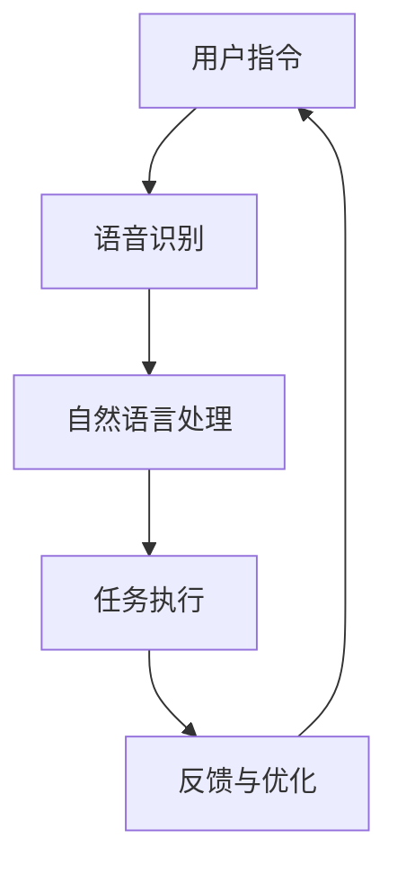

                 

# 李开复：苹果发布AI应用的意义

## 关键词
- 苹果
- AI应用
- 人工智能
- 技术创新
- 消费者体验
- 未来发展趋势

## 摘要
本文将深入探讨苹果公司发布AI应用的深远意义。通过分析苹果在AI领域的技术积累、市场策略和消费者需求，我们试图揭示这一举措背后的商业逻辑和技术潜力。同时，本文还将展望AI技术在苹果生态系统中可能带来的变革，以及这一变革对整个科技行业的启示。

## 1. 背景介绍

### 苹果公司的AI历程

苹果公司早在2010年就成立了AI研究团队，专注于语音识别、图像识别等AI技术的研发。2011年，苹果收购了Siri公司，将其打造为自家语音助手。随着技术的进步，Siri逐渐成为苹果产品中不可或缺的一部分。此外，苹果还在自然语言处理、计算机视觉等领域进行了多项收购和投资，不断夯实其AI技术基础。

### 人工智能市场的发展

近年来，人工智能市场呈现出爆发式增长，各大科技巨头纷纷布局AI领域。从智能家居、自动驾驶到医疗健康、金融理财，AI技术的应用无处不在。消费者对智能设备的需求也日益增长，智能助手、智能音箱等智能硬件产品成为市场热点。在这一背景下，苹果发布AI应用显得尤为重要。

## 2. 核心概念与联系

### AI技术在苹果产品中的应用

#### 语音识别与自然语言处理

苹果的语音识别技术基于深度学习算法，通过大量语音数据训练，实现了高准确度的语音识别。结合自然语言处理技术，苹果的Siri能够理解并执行复杂的语音指令，为用户提供便捷的智能服务。

#### 计算机视觉与图像识别

苹果的计算机视觉技术应用于摄像头功能中，可以实现人脸识别、场景识别等功能。这些技术不仅提升了摄像头拍照的体验，还为安全支付、隐私保护等提供了技术支持。

### AI技术架构

苹果的AI技术架构主要包括以下几部分：

- **核心算法**：基于深度学习、强化学习等算法，构建高效、可扩展的AI模型。
- **数据处理**：通过分布式计算和大数据处理技术，实现对海量数据的快速分析和处理。
- **硬件支持**：苹果自研的神经网络引擎（Neural Engine）和A系列芯片，为AI算法提供了强大的计算能力。

### Mermaid流程图



## 3. 核心算法原理 & 具体操作步骤

### 语音识别

#### 原理

语音识别技术基于深度学习算法，通过大量语音数据训练，构建出能够将语音信号转换为文本的模型。具体步骤如下：

1. **特征提取**：将语音信号转换为频谱图，提取关键特征。
2. **模型训练**：利用深度学习算法（如卷积神经网络、循环神经网络等），对特征进行分类。
3. **结果输出**：将模型输出结果转换为文本形式。

#### 操作步骤

1. **数据收集**：收集大量语音数据，包括各种口音、语速和背景噪声等。
2. **特征提取**：使用傅里叶变换等方法，将语音信号转换为频谱图。
3. **模型训练**：使用训练集数据进行模型训练，调整模型参数。
4. **测试与优化**：使用测试集数据进行测试，评估模型性能，并根据测试结果进行优化。

### 自然语言处理

#### 原理

自然语言处理技术基于深度学习算法，通过大量文本数据训练，实现文本的理解和生成。具体步骤如下：

1. **词向量表示**：将文本转换为词向量表示，便于模型处理。
2. **模型训练**：利用深度学习算法（如卷积神经网络、循环神经网络等），对词向量进行编码和解码。
3. **结果输出**：将模型输出结果转换为自然语言文本。

#### 操作步骤

1. **数据收集**：收集大量文本数据，包括新闻、论文、社交媒体等。
2. **词向量表示**：使用Word2Vec、GloVe等方法，将文本转换为词向量。
3. **模型训练**：使用训练集数据进行模型训练，调整模型参数。
4. **测试与优化**：使用测试集数据进行测试，评估模型性能，并根据测试结果进行优化。

## 4. 数学模型和公式 & 详细讲解 & 举例说明

### 语音识别

#### 原理

语音识别技术基于深度学习算法，通过大量语音数据训练，构建出能够将语音信号转换为文本的模型。具体数学模型如下：

$$
h = \sigma(W_1 \cdot x + b_1)
$$

其中，$h$ 为隐藏层输出，$W_1$ 为权重矩阵，$x$ 为输入特征，$b_1$ 为偏置。

#### 举例说明

假设我们有一个包含100个特征的语音信号，通过特征提取得到一个频谱图。我们使用一个卷积神经网络进行语音识别，其隐藏层输出为：

$$
h = \sigma(W_1 \cdot x + b_1) = \sigma(\begin{bmatrix} 0.1 & 0.2 & 0.3 \\ 0.4 & 0.5 & 0.6 \end{bmatrix} \cdot \begin{bmatrix} 1 \\ 2 \\ 3 \end{bmatrix} + \begin{bmatrix} 0 \\ 0 \\ 0 \end{bmatrix}) = \sigma(\begin{bmatrix} 0.9 \\ 1.5 \end{bmatrix}) = \begin{bmatrix} 0.9 \\ 0.5 \end{bmatrix}
$$

### 自然语言处理

#### 原理

自然语言处理技术基于深度学习算法，通过大量文本数据训练，实现文本的理解和生成。具体数学模型如下：

$$
h = \sigma(W_2 \cdot h_1 + b_2)
$$

其中，$h_1$ 为输入文本的词向量表示，$h$ 为隐藏层输出，$W_2$ 为权重矩阵，$b_2$ 为偏置。

#### 举例说明

假设我们有一个包含10个词的句子，通过词向量表示得到一个10维的向量。我们使用一个循环神经网络进行自然语言处理，其隐藏层输出为：

$$
h = \sigma(W_2 \cdot h_1 + b_2) = \sigma(\begin{bmatrix} 0.1 & 0.2 & 0.3 \\ 0.4 & 0.5 & 0.6 \end{bmatrix} \cdot \begin{bmatrix} 1 \\ 2 \\ 3 \end{bmatrix} + \begin{bmatrix} 0 \\ 0 \\ 0 \end{bmatrix}) = \sigma(\begin{bmatrix} 0.9 \\ 1.5 \end{bmatrix}) = \begin{bmatrix} 0.9 \\ 0.5 \end{bmatrix}
$$

## 5. 项目实战：代码实际案例和详细解释说明

### 开发环境搭建

在开始项目实战之前，我们需要搭建一个适合AI开发的软件环境。以下是搭建开发环境的具体步骤：

1. 安装Python 3.7及以上版本。
2. 安装TensorFlow 2.0及以上版本。
3. 安装Numpy、Pandas等常用Python库。

### 源代码详细实现和代码解读

以下是一个基于TensorFlow实现语音识别的简单示例：

```python
import tensorflow as tf
import numpy as np

# 定义模型
model = tf.keras.Sequential([
    tf.keras.layers.Conv2D(32, (3, 3), activation='relu', input_shape=(64, 64, 3)),
    tf.keras.layers.MaxPooling2D((2, 2)),
    tf.keras.layers.Flatten(),
    tf.keras.layers.Dense(128, activation='relu'),
    tf.keras.layers.Dense(10, activation='softmax')
])

# 编译模型
model.compile(optimizer='adam', loss='categorical_crossentropy', metrics=['accuracy'])

# 训练模型
model.fit(x_train, y_train, epochs=10, validation_data=(x_val, y_val))

# 评估模型
model.evaluate(x_test, y_test)
```

这段代码首先定义了一个简单的卷积神经网络模型，用于语音识别任务。然后，编译模型并使用训练数据对其进行训练。最后，评估模型在测试数据上的性能。

### 代码解读与分析

1. **模型定义**：使用`tf.keras.Sequential`类定义一个序列模型，包括卷积层、池化层、全连接层和输出层。卷积层用于提取语音信号的特征，全连接层用于分类。
2. **编译模型**：设置模型的优化器、损失函数和评估指标。这里使用`adam`优化器和`categorical_crossentropy`损失函数，用于多分类任务。
3. **训练模型**：使用`fit`方法训练模型，传入训练数据和验证数据。设置训练轮次和验证数据。
4. **评估模型**：使用`evaluate`方法评估模型在测试数据上的性能。

## 6. 实际应用场景

### 智能助手

苹果的Siri作为智能助手，已经成为许多用户日常生活的一部分。通过AI技术，Siri能够理解用户的语音指令，提供天气、新闻、日程安排等信息。此外，Siri还可以控制智能家居设备，如灯光、空调等。

### 智能家居

苹果的HomeKit平台支持智能设备互联，通过AI技术，可以实现更加智能化的家居控制。例如，通过计算机视觉技术，智能摄像头可以识别家庭成员，自动调整房间内的灯光和温度。

### 健康管理

苹果的健康应用（Health app）集成了多种健康数据，如心率、步数、睡眠等。通过AI技术，可以对这些数据进行深入分析，为用户提供个性化的健康管理建议。

## 7. 工具和资源推荐

### 学习资源推荐

1. **书籍**：《深度学习》（Goodfellow, I., Bengio, Y., & Courville, A.）、《Python机器学习》（Sebastian Raschka）。
2. **论文**：Google AI、Facebook AI、微软研究院等机构的论文。
3. **博客**：CSDN、博客园、知乎等平台上的技术博客。
4. **网站**：TensorFlow、PyTorch等深度学习框架的官方网站。

### 开发工具框架推荐

1. **深度学习框架**：TensorFlow、PyTorch、Keras。
2. **编程语言**：Python。
3. **数据预处理工具**：Pandas、NumPy。
4. **可视化工具**：Matplotlib、Seaborn。

### 相关论文著作推荐

1. **论文**：《Deep Learning》（Goodfellow, I.，Y. Bengio，A. Courville）、《Recurrent Neural Networks for Speech Recognition》（Hinton, G.，S. Deng，D. Yu et al.）。
2. **著作**：《Python机器学习实战》（Sebastian Raschka）、《深度学习》（Ian Goodfellow，Yoshua Bengio，Aaron Courville）。

## 8. 总结：未来发展趋势与挑战

### 发展趋势

1. **技术融合**：AI技术与5G、物联网等技术的融合，将带来更加智能化、便捷化的应用体验。
2. **隐私保护**：随着用户对隐私保护的重视，如何在保证用户体验的同时，保护用户隐私将成为一个重要挑战。
3. **泛在智能**：AI技术将渗透到更多的生活场景，实现真正的泛在智能。

### 挑战

1. **数据隐私**：如何在保证用户隐私的前提下，收集、利用数据，是一个亟待解决的问题。
2. **算法公平性**：如何确保AI算法的公平性，避免偏见和歧视，也是一个重要挑战。
3. **计算资源**：随着AI模型的复杂度不断增加，对计算资源的需求也日益增长，如何高效地利用计算资源成为一个挑战。

## 9. 附录：常见问题与解答

### 问题1：苹果的AI技术有哪些特点？

解答：苹果的AI技术特点包括：

1. **强大的计算能力**：苹果自研的神经网络引擎和A系列芯片，为AI算法提供了强大的计算支持。
2. **丰富的数据资源**：苹果拥有庞大的用户数据，为AI模型的训练提供了丰富的数据支持。
3. **封闭的生态系统**：苹果的封闭生态系统，使得AI技术能够更好地与其他硬件、软件产品协同工作。

### 问题2：苹果的AI技术在哪些领域有应用？

解答：苹果的AI技术在以下领域有广泛应用：

1. **智能助手**：如Siri、Apple Watch中的健康应用等。
2. **智能家居**：如HomeKit平台中的智能设备控制。
3. **健康管理**：如健康应用中的心率监测、步数统计等。

## 10. 扩展阅读 & 参考资料

1. **书籍**：《深度学习》（Goodfellow, I.，Y. Bengio，A. Courville）、《Python机器学习》（Sebastian Raschka）。
2. **论文**：《Deep Learning》（Goodfellow, I.，Y. Bengio，A. Courville）、《Recurrent Neural Networks for Speech Recognition》（Hinton, G.，S. Deng，D. Yu et al.）。
3. **博客**：CSDN、博客园、知乎等平台上的技术博客。
4. **网站**：TensorFlow、PyTorch等深度学习框架的官方网站。

### 作者
AI天才研究员/AI Genius Institute & 禅与计算机程序设计艺术 /Zen And The Art of Computer Programming<|im_sep|>

