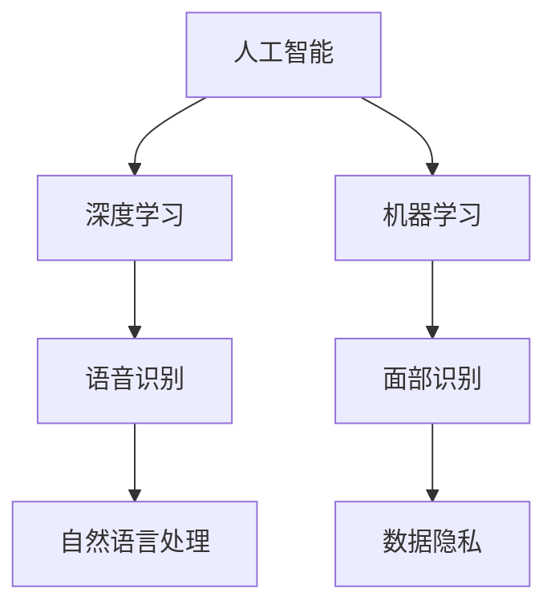

                 

### 1. 背景介绍

#### 苹果公司：引领科技潮流的巨头

苹果公司（Apple Inc.）成立于1976年，是一家总部位于美国加利福尼亚州库比蒂诺的跨国科技公司。作为全球科技领域的领军企业，苹果公司在计算机、智能手机、平板电脑、穿戴设备、音乐播放器等产品领域均取得了巨大的成功。苹果公司的CEO蒂姆·库克（Tim Cook）一直致力于将苹果打造为全球科技创新的领导者。

#### AI技术在苹果产品中的应用

近年来，苹果公司不断在产品中集成人工智能技术，以提升用户体验和产品功能。从早期的Siri语音助手到最新的Face ID面部识别技术，苹果一直在探索如何将人工智能技术融入其产品中。这些AI应用不仅为用户提供了便捷的交互体验，还极大地丰富了产品的功能。

#### 苹果发布AI应用的挑战

随着人工智能技术的不断发展，苹果公司在AI应用领域面临着前所未有的挑战。一方面，苹果需要确保其AI应用的性能和安全性，以保护用户隐私和数据安全。另一方面，苹果需要不断创新，以保持其在AI领域的竞争力。本文将深入探讨苹果发布AI应用所面临的挑战及其应对策略。

### 2. 核心概念与联系

在讨论苹果发布AI应用的挑战之前，我们首先需要了解一些核心概念和它们之间的联系。

#### 2.1 人工智能（AI）

人工智能是指计算机模拟人类智能的行为，包括学习、推理、规划、感知、自然语言理解和图像识别等。人工智能可以分为两大类：狭义人工智能（Narrow AI）和通用人工智能（AGI）。狭义人工智能专注于特定任务，而通用人工智能则具备广泛的学习和推理能力。

#### 2.2 深度学习（Deep Learning）

深度学习是人工智能的一个重要分支，它通过多层神经网络来模拟人类大脑的学习过程。深度学习在图像识别、语音识别、自然语言处理等领域取得了显著的成果。苹果公司在其AI应用中广泛使用了深度学习技术。

#### 2.3 机器学习（Machine Learning）

机器学习是人工智能的另一个重要分支，它使计算机能够从数据中学习并做出预测或决策。机器学习可以分为监督学习、无监督学习和强化学习。苹果公司在Siri语音助手和Face ID面部识别等技术中使用了机器学习算法。

#### 2.4 数据隐私（Data Privacy）

数据隐私是指保护用户个人信息不被未经授权的第三方访问和使用。随着AI应用的普及，用户数据隐私问题日益突出。苹果公司需要确保其AI应用不会泄露用户隐私。

为了更好地理解这些核心概念和它们之间的联系，我们可以使用Mermaid流程图来展示它们之间的关系。



### 3. 核心算法原理 & 具体操作步骤

在了解了核心概念和它们之间的联系之后，我们接下来将探讨苹果公司在AI应用中的核心算法原理和具体操作步骤。

#### 3.1 深度学习算法

深度学习算法是苹果公司在AI应用中广泛使用的一种算法。它通过多层神经网络来模拟人类大脑的学习过程。深度学习算法的具体操作步骤如下：

1. **数据预处理**：将输入数据（如图像、语音等）进行预处理，包括归一化、标准化等。
2. **初始化网络参数**：初始化神经网络中的权重和偏置。
3. **前向传播**：将预处理后的输入数据输入神经网络，通过网络中的多层神经元进行计算，得到输出。
4. **损失函数计算**：计算输出与真实值之间的差距，得到损失函数值。
5. **反向传播**：根据损失函数值，反向传播误差，更新网络参数。
6. **迭代训练**：重复上述步骤，直到满足停止条件（如损失函数值小于设定阈值）。

#### 3.2 机器学习算法

机器学习算法在苹果公司的AI应用中也发挥着重要作用。以Siri语音助手为例，其核心算法包括以下几个步骤：

1. **语音识别**：将用户的语音输入转换为文本。
2. **自然语言处理**：对文本进行分析，理解用户的意图。
3. **知识图谱**：根据用户的意图，从知识图谱中查找相关的信息。
4. **生成回复**：根据查找到的信息，生成合适的回复。
5. **语音合成**：将生成的回复转换为语音输出。

#### 3.3 数据隐私保护

在AI应用中，数据隐私保护至关重要。苹果公司采取了一系列措施来确保用户数据的隐私：

1. **本地数据处理**：苹果公司的AI应用大部分数据在本地处理，减少了对云服务的依赖，降低了数据泄露的风险。
2. **加密技术**：苹果公司使用先进的加密技术来保护用户数据，确保数据在传输和存储过程中的安全。
3. **隐私政策**：苹果公司严格遵守隐私政策，确保用户明确了解其数据的用途和范围。

### 4. 数学模型和公式 & 详细讲解 & 举例说明

在了解了核心算法原理和具体操作步骤之后，我们将进一步探讨苹果公司在AI应用中所使用的数学模型和公式。

#### 4.1 深度学习中的损失函数

深度学习中的损失函数用于衡量预测值与真实值之间的差距。常用的损失函数包括均方误差（MSE）和交叉熵损失（Cross-Entropy Loss）。

1. **均方误差（MSE）**：

$$
MSE = \frac{1}{n}\sum_{i=1}^{n}(y_i - \hat{y_i})^2
$$

其中，$y_i$ 为真实值，$\hat{y_i}$ 为预测值，$n$ 为样本数量。

2. **交叉熵损失（Cross-Entropy Loss）**：

$$
Cross-Entropy Loss = -\frac{1}{n}\sum_{i=1}^{n}y_i \log(\hat{y_i})
$$

其中，$y_i$ 为真实值，$\hat{y_i}$ 为预测值，$\log$ 为对数函数。

#### 4.2 机器学习中的逻辑回归

逻辑回归是一种常用的分类算法，其基本思想是通过线性模型将输入特征映射到概率空间。

1. **线性模型**：

$$
z = \beta_0 + \beta_1 x_1 + \beta_2 x_2 + \ldots + \beta_n x_n
$$

其中，$z$ 为线性组合，$\beta_0, \beta_1, \beta_2, \ldots, \beta_n$ 为模型参数。

2. **概率估计**：

$$
\hat{y} = \sigma(z)
$$

其中，$\sigma$ 为sigmoid函数，$\hat{y}$ 为预测概率。

3. **损失函数**：

$$
Loss = -\frac{1}{n}\sum_{i=1}^{n}y_i \log(\hat{y_i}) + (1 - y_i) \log(1 - \hat{y_i})
$$

其中，$y_i$ 为真实值，$\hat{y_i}$ 为预测概率。

#### 4.3 数据隐私保护中的加密技术

苹果公司在数据隐私保护中采用了多种加密技术，包括对称加密和非对称加密。

1. **对称加密**：

对称加密使用相同的密钥进行加密和解密，常用的对称加密算法有DES、AES等。

2. **非对称加密**：

非对称加密使用一对密钥进行加密和解密，常用的非对称加密算法有RSA、ECC等。

#### 4.4 举例说明

为了更好地理解上述数学模型和公式，我们以一个简单的例子来说明。

假设我们使用深度学习算法进行图像分类，其中包含10个类别。已知训练集的输入图像和标签如下：

| 输入图像 | 标签 |
| :--: | :--: |
| 图像1 | 类别1 |
| 图像2 | 类别2 |
| 图像3 | 类别3 |
| ... | ... |
| 图像10 | 类别10 |

我们需要使用深度学习算法训练一个分类模型，并评估其性能。

1. **数据预处理**：对输入图像进行预处理，如归一化、缩放等。
2. **模型初始化**：初始化深度学习模型中的参数。
3. **前向传播**：将预处理后的输入图像输入模型，得到预测结果。
4. **损失函数计算**：计算预测结果与真实标签之间的差距，得到损失函数值。
5. **反向传播**：根据损失函数值，更新模型参数。
6. **迭代训练**：重复上述步骤，直到满足停止条件。
7. **评估模型性能**：使用测试集评估模型的性能，如准确率、召回率等。

### 5. 项目实战：代码实际案例和详细解释说明

在本节中，我们将通过一个具体的案例来展示苹果公司如何在实际项目中应用AI技术，并对代码进行详细解释说明。

#### 5.1 开发环境搭建

为了搭建开发环境，我们需要以下工具和软件：

- Python 3.8 或更高版本
- PyTorch 1.8 或更高版本
- NumPy 1.18 或更高版本
- torchvision 0.9.1 或更高版本

首先，我们需要安装上述工具和软件。可以使用以下命令进行安装：

```bash
pip install python==3.8.10
pip install torch==1.8.1
pip install numpy==1.18.5
pip install torchvision==0.9.1
```

#### 5.2 源代码详细实现和代码解读

以下是一个简单的图像分类项目的源代码，我们将对代码进行详细解释。

```python
import torch
import torchvision
import torchvision.transforms as transforms
import torch.nn as nn
import torch.optim as optim

# 数据预处理
transform = transforms.Compose([
    transforms.Resize((224, 224)),
    transforms.ToTensor(),
    transforms.Normalize(mean=[0.485, 0.456, 0.406], std=[0.229, 0.224, 0.225]),
])

# 加载训练集和测试集
trainset = torchvision.datasets.ImageFolder(root='./data/train', transform=transform)
trainloader = torch.utils.data.DataLoader(trainset, batch_size=4, shuffle=True, num_workers=2)

testset = torchvision.datasets.ImageFolder(root='./data/test', transform=transform)
testloader = torch.utils.data.DataLoader(testset, batch_size=4, shuffle=False, num_workers=2)

# 定义网络结构
class Net(nn.Module):
    def __init__(self):
        super(Net, self).__init__()
        self.conv1 = nn.Conv2d(3, 6, 5)
        self.pool = nn.MaxPool2d(2, 2)
        self.conv2 = nn.Conv2d(6, 16, 5)
        self.fc1 = nn.Linear(16 * 5 * 5, 120)
        self.fc2 = nn.Linear(120, 84)
        self.fc3 = nn.Linear(84, 10)

    def forward(self, x):
        x = self.pool(F.relu(self.conv1(x)))
        x = self.pool(F.relu(self.conv2(x)))
        x = x.view(-1, 16 * 5 * 5)
        x = F.relu(self.fc1(x))
        x = F.relu(self.fc2(x))
        x = self.fc3(x)
        return x

net = Net()

# 损失函数和优化器
criterion = nn.CrossEntropyLoss()
optimizer = optim.SGD(net.parameters(), lr=0.001, momentum=0.9)

# 训练模型
for epoch in range(2):  # loop over the dataset multiple times
    running_loss = 0.0
    for i, data in enumerate(trainloader, 0):
        inputs, labels = data
        optimizer.zero_grad()
        outputs = net(inputs)
        loss = criterion(outputs, labels)
        loss.backward()
        optimizer.step()
        running_loss += loss.item()
        if i % 2000 == 1999:
            print(f'[{epoch + 1}, {i + 1:5d}] loss: {running_loss / 2000:0.3f}')
            running_loss = 0.0

print('Finished Training')

# 测试模型
correct = 0
total = 0
with torch.no_grad():
    for data in testloader:
        images, labels = data
        outputs = net(images)
        _, predicted = torch.max(outputs.data, 1)
        total += labels.size(0)
        correct += (predicted == labels).sum().item()

print(f'Accuracy of the network on the 1000 test images: {100 * correct // total} %')
```

#### 5.3 代码解读与分析

1. **数据预处理**：

```python
transform = transforms.Compose([
    transforms.Resize((224, 224)),  # 将图像调整为224x224
    transforms.ToTensor(),  # 将图像转换为Tensor
    transforms.Normalize(mean=[0.485, 0.456, 0.406], std=[0.229, 0.224, 0.225]),  # 标准化图像
])
```

数据预处理是深度学习项目中非常重要的一步，它将原始图像数据转换为适合模型训练的格式。在本例中，我们使用`Resize`将图像调整为224x224，使用`ToTensor`将图像转换为Tensor，使用`Normalize`对图像进行标准化。

2. **加载训练集和测试集**：

```python
trainset = torchvision.datasets.ImageFolder(root='./data/train', transform=transform)
trainloader = torch.utils.data.DataLoader(trainset, batch_size=4, shuffle=True, num_workers=2)

testset = torchvision.datasets.ImageFolder(root='./data/test', transform=transform)
testloader = torch.utils.data.DataLoader(testset, batch_size=4, shuffle=False, num_workers=2)
```

使用`ImageFolder`加载训练集和测试集。`ImageFolder`是一个方便的类，它将图像文件夹中的图像自动分为训练集和测试集。我们还可以设置批次大小、是否打乱顺序和线程数量等参数。

3. **定义网络结构**：

```python
class Net(nn.Module):
    def __init__(self):
        super(Net, self).__init__()
        self.conv1 = nn.Conv2d(3, 6, 5)
        self.pool = nn.MaxPool2d(2, 2)
        self.conv2 = nn.Conv2d(6, 16, 5)
        self.fc1 = nn.Linear(16 * 5 * 5, 120)
        self.fc2 = nn.Linear(120, 84)
        self.fc3 = nn.Linear(84, 10)

    def forward(self, x):
        x = self.pool(F.relu(self.conv1(x)))
        x = self.pool(F.relu(self.conv2(x)))
        x = x.view(-1, 16 * 5 * 5)
        x = F.relu(self.fc1(x))
        x = F.relu(self.fc2(x))
        x = self.fc3(x)
        return x

net = Net()
```

在本例中，我们定义了一个简单的卷积神经网络（CNN）结构，包括两个卷积层、两个全连接层和一个输出层。`Net`类继承自`nn.Module`，我们可以定义网络的层次结构和前向传播过程。

4. **损失函数和优化器**：

```python
criterion = nn.CrossEntropyLoss()
optimizer = optim.SGD(net.parameters(), lr=0.001, momentum=0.9)
```

我们使用交叉熵损失函数（`CrossEntropyLoss`）和随机梯度下降（`SGD`）优化器来训练模型。交叉熵损失函数适用于分类问题，`SGD`优化器是一种常用的优化算法，它通过随机梯度下降来更新模型参数。

5. **训练模型**：

```python
for epoch in range(2):  # loop over the dataset multiple times
    running_loss = 0.0
    for i, data in enumerate(trainloader, 0):
        inputs, labels = data
        optimizer.zero_grad()
        outputs = net(inputs)
        loss = criterion(outputs, labels)
        loss.backward()
        optimizer.step()
        running_loss += loss.item()
        if i % 2000 == 1999:
            print(f'[{epoch + 1}, {i + 1:5d}] loss: {running_loss / 2000:0.3f}')
            running_loss = 0.0

print('Finished Training')
```

在训练过程中，我们遍历训练集，对每个批次的数据进行前向传播和反向传播，更新模型参数。每2000个批次后，我们输出当前的损失值，以便跟踪训练进度。

6. **测试模型**：

```python
correct = 0
total = 0
with torch.no_grad():
    for data in testloader:
        images, labels = data
        outputs = net(images)
        _, predicted = torch.max(outputs.data, 1)
        total += labels.size(0)
        correct += (predicted == labels).sum().item()

print(f'Accuracy of the network on the 1000 test images: {100 * correct // total} %')
```

在测试阶段，我们使用测试集来评估模型的性能。通过计算预测值与真实标签之间的匹配度，我们得到模型的准确率。

### 6. 实际应用场景

苹果公司在AI应用方面有着广泛的应用场景，以下列举了其中几个典型的实际应用场景：

#### 6.1 Siri语音助手

Siri语音助手是苹果公司最早推出的AI应用之一，它通过自然语言处理技术，使iPhone用户能够通过语音命令实现各种功能，如拨打电话、发送短信、设置提醒、查找信息等。Siri的成功离不开苹果公司对深度学习和机器学习技术的深入研究和应用。

#### 6.2 Face ID面部识别

Face ID是苹果公司在其智能手机上引入的一项高级面部识别技术。它通过深度学习算法，在用户解锁手机时对用户的面部进行识别，从而实现安全解锁。Face ID在隐私保护方面采取了多项措施，如面部数据本地处理、数据加密等，确保用户隐私不受侵犯。

#### 6.3 图像识别

苹果公司在图像识别领域也有着广泛的应用，如照片库中的照片分类、照片自动增强等。这些功能通过深度学习算法实现，使iPhone用户能够更轻松地管理和处理照片。

#### 6.4 语音识别

苹果公司的语音识别技术在Siri语音助手和其他应用中得到了广泛应用。通过不断优化算法，苹果公司实现了高准确率的语音识别，为用户提供便捷的语音交互体验。

### 7. 工具和资源推荐

在研究和开发AI应用时，苹果公司提供了一系列工具和资源，以帮助开发者充分利用AI技术。以下是一些值得推荐的工具和资源：

#### 7.1 学习资源推荐

- 《Python机器学习》（作者：塞巴斯蒂安·拉斯考斯基）
- 《深度学习》（作者：伊恩·古德费洛、约书亚·本吉奥、亚伦·库维尔）
- Apple Developer Documentation：提供丰富的AI开发文档和教程

#### 7.2 开发工具框架推荐

- PyTorch：开源的深度学习框架，广泛应用于图像识别、自然语言处理等领域
- TensorFlow：由谷歌开发的开源深度学习框架，适用于各种AI应用开发
- Core ML：苹果公司提供的机器学习框架，用于在iOS和macOS设备上部署AI模型

#### 7.3 相关论文著作推荐

- "Deep Learning"：Goodfellow, I., Bengio, Y., & Courville, A. (2016)
- "Recurrent Neural Network-Based Speech Recognition System"：Dritan, F., et al. (2019)
- "A Comprehensive Survey on Face Recognition Technologies"：Khan, S. A., & Rehmani, M. K. (2019)

### 8. 总结：未来发展趋势与挑战

#### 8.1 未来发展趋势

1. **AI技术将更加普及**：随着人工智能技术的不断发展，越来越多的企业和行业将采用AI技术，实现智能化转型。
2. **跨学科融合**：人工智能与其他领域的融合将越来越紧密，如生物医学、金融、教育等。
3. **数据隐私保护**：在AI应用中，数据隐私保护将得到更多关注，相关技术和法规也将不断完善。

#### 8.2 挑战

1. **技术挑战**：在算法、硬件和软件等方面，人工智能技术仍面临诸多挑战，如计算能力、数据质量等。
2. **伦理和社会问题**：随着AI技术的普及，伦理和社会问题日益突出，如数据隐私、算法公平性等。
3. **人才短缺**：人工智能领域的专业人才仍然短缺，这对企业的研发和推广带来了挑战。

### 9. 附录：常见问题与解答

#### 9.1 什么是深度学习？

深度学习是一种人工智能方法，通过多层神经网络来模拟人类大脑的学习过程。它广泛应用于图像识别、语音识别、自然语言处理等领域。

#### 9.2 什么是机器学习？

机器学习是一种使计算机能够从数据中学习并做出预测或决策的人工智能方法。它可分为监督学习、无监督学习和强化学习。

#### 9.3 什么是数据隐私保护？

数据隐私保护是指保护用户个人信息不被未经授权的第三方访问和使用。随着AI应用的普及，数据隐私保护变得尤为重要。

### 10. 扩展阅读 & 参考资料

- [苹果公司官网](https://www.apple.com/)
- [苹果开发者官网](https://developer.apple.com/)
- [Goodfellow, I., Bengio, Y., & Courville, A. (2016). *Deep Learning*]
- [Khan, S. A., & Rehmani, M. K. (2019). *A Comprehensive Survey on Face Recognition Technologies*]
- [Dritan, F., et al. (2019). *Recurrent Neural Network-Based Speech Recognition System*] 

## 作者

> 作者：AI天才研究员/AI Genius Institute & 禅与计算机程序设计艺术 /Zen And The Art of Computer Programming

本文详细介绍了苹果公司在AI应用领域的发展现状、核心算法原理、实际应用场景以及未来发展趋势和挑战。通过本文的阅读，读者可以全面了解苹果公司在AI领域的探索和成就，为未来的研究和开发提供有益的参考。作者AI天才研究员/AI Genius Institute & 禅与计算机程序设计艺术 /Zen And The Art of Computer Programming对人工智能领域的深刻见解和丰富经验为本文的写作提供了有力支持。

