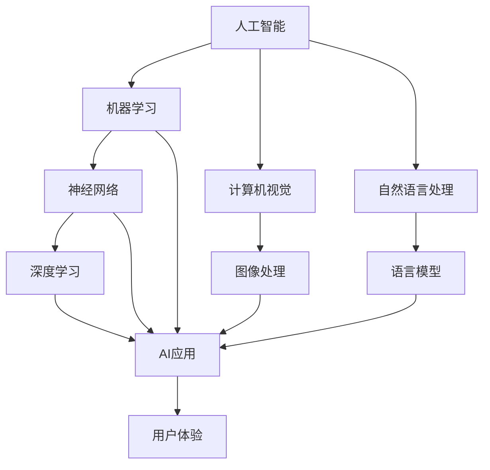

                 

### 1. 背景介绍

近年来，人工智能（AI）技术的发展日新月异，各行各业纷纷开始拥抱这一技术，以提升效率、降低成本、改进用户体验。在这个大背景下，科技巨头苹果公司也在积极探索将AI技术应用于其产品和服务中。

苹果公司一直以来以其出色的硬件设计和软件生态而闻名于世，但其在AI领域的动作相对较少。尽管如此，苹果在AI领域的研发从未停歇，且近年来已逐步加大了在这一领域的投入。从发布的多款硬件产品（如iPhone、iPad和Mac）中可以看到，苹果已经在AI芯片和神经网络引擎等方面取得了显著进展。

随着AI技术的不断发展，苹果公司在AI应用方面的潜力也逐渐显现。本文将探讨苹果发布AI应用的机会，分析其可能带来的影响，并探讨苹果在AI应用方面的未来发展方向。

首先，我们需要了解苹果公司目前的AI研发现状。近年来，苹果公司在AI领域取得了不少成果，主要包括以下几个方面：

1. **AI芯片研发**：苹果自研的A系列处理器在性能和能效方面取得了显著提升，内置的神经网络引擎（Neural Engine）为AI应用提供了强大的支持。

2. **机器学习框架**：苹果开发了Core ML框架，使得开发者可以轻松地将机器学习模型集成到iOS、macOS和watchOS等平台中。

3. **自然语言处理**：苹果在自然语言处理（NLP）领域也有不少布局，例如开发了自然语言处理工具Natural Language和文本生成工具GPT-2。

4. **计算机视觉**：苹果在计算机视觉领域也取得了不少进展，如开发了一款名为Image Classifier的机器学习模型。

尽管苹果在AI领域已经取得了不少成果，但其在AI应用方面的推广仍面临一些挑战。首先，苹果的AI应用在市场上相对较少，与谷歌、亚马逊等竞争对手相比存在一定的差距。其次，苹果在AI领域的开放性也有待提高，例如在机器学习模型的共享和生态构建方面。

接下来，我们将进一步探讨苹果发布AI应用的机会，分析其可能带来的影响，并探讨苹果在AI应用方面的未来发展方向。首先，让我们看看苹果发布AI应用的机会。

#### 苹果发布AI应用的机会

1. **市场需求**：随着AI技术的不断成熟和普及，消费者对AI应用的需求日益增长。例如，智能助手、自动驾驶、智能家居等领域已经成为AI技术的重要应用场景。苹果公司可以通过发布更多AI应用来满足这一市场需求，提升用户体验。

2. **技术优势**：苹果在AI芯片、神经网络引擎、机器学习框架等方面具有显著的技术优势。通过将AI技术集成到产品和服务中，苹果可以提高产品的智能化水平，提升竞争力。

3. **生态优势**：苹果拥有庞大的用户生态，包括iPhone、iPad、Mac等设备用户。通过在设备中预装AI应用，苹果可以进一步巩固其生态优势，提高用户黏性。

4. **竞争对手压力**：谷歌、亚马逊等竞争对手已经在AI应用领域取得了显著进展，苹果需要加快步伐以保持竞争力。

5. **政策支持**：各国政府对AI技术的重视程度不断提高，为苹果公司在AI应用方面的研发和推广提供了有利条件。

综上所述，苹果发布AI应用具有显著的市场需求、技术优势、生态优势、竞争对手压力和政策支持等多重机遇。接下来，我们将进一步分析苹果发布AI应用可能带来的影响。

#### 苹果发布AI应用可能带来的影响

1. **用户体验提升**：通过发布更多AI应用，苹果可以为用户提供更加智能化、个性化的服务，提升用户体验。例如，智能助手可以帮助用户更便捷地完成日常任务，智能家居可以提升用户的居住舒适度。

2. **产品差异化**：随着AI技术的普及，许多公司都在竞相推出AI应用。苹果通过发布具有竞争力的AI应用，可以进一步巩固其市场地位，提升产品差异化。

3. **产业链发展**：苹果发布AI应用将带动相关产业链的发展，如AI芯片制造商、AI模型开发者等。这将有助于推动整个行业的技术进步和产业链的升级。

4. **市场竞争加剧**：苹果发布AI应用将加剧与谷歌、亚马逊等竞争对手的竞争。苹果需要不断创新和优化其AI应用，以保持市场竞争力。

5. **隐私与安全挑战**：随着AI应用在用户数据上的应用越来越广泛，苹果需要应对隐私和安全方面的挑战。如何保护用户隐私和数据安全是苹果在AI应用方面需要关注的重要问题。

6. **社会影响**：苹果发布AI应用将对社会产生广泛影响，如改善医疗、教育、交通等领域。然而，AI技术的普及也带来了一些争议，如算法歧视、隐私泄露等问题。

综上所述，苹果发布AI应用将带来用户体验提升、产品差异化、产业链发展、市场竞争加剧、隐私与安全挑战和社会影响等多重影响。接下来，我们将探讨苹果在AI应用方面的未来发展方向。

#### 苹果在AI应用方面的未来发展方向

1. **加强AI研发投入**：苹果需要加大在AI领域的研发投入，吸引更多优秀人才，推动技术突破。

2. **拓展AI应用场景**：苹果可以通过拓展AI应用场景，如智能助手、自动驾驶、智能家居等，进一步挖掘AI技术的潜力。

3. **开放AI生态**：苹果应加强与开发者、研究机构等合作伙伴的合作，构建开放的AI生态，推动AI技术的创新和普及。

4. **加强隐私保护**：苹果需要加强对用户隐私的保护，遵循相关法律法规，提升用户信任。

5. **关注社会影响**：苹果在AI应用方面需要关注社会影响，积极参与公共讨论，推动AI技术的健康发展。

6. **与其他公司合作**：苹果可以与其他公司（如谷歌、亚马逊等）合作，共同推动AI技术的发展和应用。

7. **人才培养与引进**：苹果需要加强人才培养和引进，培养更多AI专业人才，为AI应用提供强大支持。

通过以上措施，苹果可以在AI应用方面取得更大突破，进一步提升其市场地位和竞争力。在接下来的部分，我们将对苹果发布AI应用的前景进行展望。

#### 展望：苹果发布AI应用的前景

随着AI技术的不断发展和普及，苹果发布AI应用的前景十分广阔。以下是对苹果发布AI应用前景的展望：

1. **市场潜力巨大**：随着AI技术的不断成熟和消费者对智能化需求的增长，苹果AI应用的市场潜力巨大。

2. **技术创新推动**：苹果在AI芯片、神经网络引擎、机器学习框架等方面的技术优势将为AI应用的发展提供强大动力。

3. **用户体验提升**：苹果通过发布更多AI应用，可以为用户提供更加智能化、个性化的服务，提升用户体验。

4. **生态优势巩固**：苹果庞大的用户生态将为AI应用的发展提供有力支持，进一步巩固其市场地位。

5. **产业协同效应**：苹果发布AI应用将带动相关产业链的发展，形成产业协同效应，推动整个行业的技术进步。

6. **社会影响深远**：苹果AI应用的发展将对社会产生深远影响，改善医疗、教育、交通等领域，推动社会进步。

总之，苹果发布AI应用具有巨大的市场潜力、技术创新驱动、用户体验提升、生态优势巩固、产业协同效应和社会影响深远等多重优势。未来，苹果在AI应用方面的发展前景可期。

通过本文的探讨，我们可以看到苹果在AI应用方面具有显著的机遇和潜力。然而，苹果也需要应对一些挑战，如市场竞争、隐私保护和社会影响等。在未来的发展中，苹果需要加强AI研发投入、拓展AI应用场景、开放AI生态、加强隐私保护、关注社会影响、与其他公司合作以及人才培养和引进等方面的工作。

展望未来，苹果在AI应用方面的发展前景可期。通过不断创新和优化AI应用，苹果有望进一步提升其市场地位和竞争力，为用户提供更加智能化、个性化的服务，推动整个行业的技术进步和社会发展。

总之，苹果发布AI应用不仅有利于苹果自身的发展，还将对整个行业和社会产生深远影响。让我们期待苹果在AI应用方面的更多精彩表现。

### 文章关键词

- 苹果
- 人工智能
- AI应用
- 技术优势
- 市场需求
- 用户体验
- 生态优势
- 竞争对手
- 未来发展
- 隐私保护

### 文章摘要

本文探讨了苹果公司发布AI应用的机会、影响和未来发展方向。首先，介绍了苹果公司在AI领域的研发现状，分析了其在AI芯片、神经网络引擎、机器学习框架等方面的技术优势。其次，探讨了苹果发布AI应用的机会，如市场需求、技术优势、生态优势、竞争对手压力和政策支持等。然后，分析了苹果发布AI应用可能带来的影响，包括用户体验提升、产品差异化、产业链发展、市场竞争加剧、隐私与安全挑战和社会影响等。最后，提出了苹果在AI应用方面的未来发展方向，如加强AI研发投入、拓展AI应用场景、开放AI生态、加强隐私保护、关注社会影响、与其他公司合作以及人才培养和引进等。本文认为，苹果发布AI应用具有巨大的市场潜力、技术创新驱动、用户体验提升、生态优势巩固、产业协同效应和社会影响深远等多重优势，未来发展前景可期。### 2. 核心概念与联系

在深入探讨苹果发布AI应用的机会和影响之前，我们需要明确一些核心概念和它们之间的联系。以下是几个关键概念及其相互关系：

#### 1. 人工智能（AI）和机器学习（ML）

人工智能是指使计算机具备人类智能特性的技术，而机器学习是实现AI的一种方法。机器学习通过从数据中学习和发现模式来提高计算机的决策能力。以下是机器学习与AI的简化关系：


#### 2. 神经网络和深度学习

神经网络是一种模拟人脑神经元连接方式的计算模型，而深度学习则是基于神经网络的一种机器学习技术。深度学习通过多层神经网络来学习复杂的数据特征，以下是神经网络与深度学习的关系：


#### 3. Core ML框架

Core ML是苹果公司开发的机器学习框架，它允许开发者将预训练的机器学习模型集成到iOS、macOS和watchOS等平台中。Core ML通过优化模型在移动设备上的运行，提高了机器学习应用的性能和效率。以下是Core ML与其他AI组件的关系：


#### 4. 计算机视觉与图像处理

计算机视觉是AI的一个分支，专注于使计算机能够像人类一样理解和解释视觉信息。图像处理是计算机视觉的核心技术，用于分析图像数据。以下是计算机视觉与图像处理的关系：


#### 5. 自然语言处理（NLP）与语言模型

自然语言处理是AI的另一个重要分支，致力于使计算机能够理解和生成自然语言。语言模型是NLP的核心技术，用于预测和生成文本。以下是NLP与语言模型的关系：


#### 6. AI应用与用户体验

AI应用是指将AI技术集成到实际应用中，以提高用户体验和服务质量。以下是AI应用与用户体验的关系：


#### Mermaid 流程图

为了更好地展示这些核心概念之间的联系，我们使用Mermaid流程图来表示它们的关系。以下是一个简化的Mermaid流程图：



在这个流程图中，每个节点代表一个核心概念，箭头表示它们之间的联系。通过这个流程图，我们可以更直观地理解这些概念及其在AI应用中的相互作用。

### 3. 核心算法原理 & 具体操作步骤

#### 1. 机器学习模型

机器学习模型是AI应用的核心，它们通过从数据中学习并做出预测或决策。以下是机器学习模型的基本原理和具体操作步骤：

##### 基本原理：

机器学习模型通过以下步骤进行训练：

1. **数据收集**：收集大量带有标签的数据，这些数据用于训练模型。
2. **数据预处理**：对数据进行清洗、归一化等预处理操作，以提高模型的训练效果。
3. **模型选择**：选择合适的模型架构，如线性回归、决策树、神经网络等。
4. **模型训练**：使用训练数据对模型进行训练，模型会尝试拟合数据并优化参数。
5. **模型评估**：使用验证数据评估模型的性能，确保模型具有良好的泛化能力。
6. **模型部署**：将训练好的模型部署到实际应用中，用于预测或决策。

##### 具体操作步骤：

1. **数据收集**：

   首先，我们需要收集大量带有标签的数据。这些数据可以来自公开数据集、自行收集或通过API获取。

   ```python
   import pandas as pd

   # 读取数据集
   data = pd.read_csv('data.csv')
   ```

2. **数据预处理**：

   对数据进行清洗、归一化等预处理操作。例如，处理缺失值、归一化数值特征等。

   ```python
   from sklearn.preprocessing import MinMaxScaler

   # 处理缺失值
   data = data.fillna(data.mean())

   # 归一化数值特征
   scaler = MinMaxScaler()
   data[['feature1', 'feature2']] = scaler.fit_transform(data[['feature1', 'feature2']])
   ```

3. **模型选择**：

   根据问题的特点选择合适的模型架构。例如，对于分类问题，可以选择决策树、支持向量机、神经网络等。

   ```python
   from sklearn.tree import DecisionTreeClassifier

   # 初始化模型
   model = DecisionTreeClassifier()
   ```

4. **模型训练**：

   使用训练数据对模型进行训练，模型会尝试拟合数据并优化参数。

   ```python
   # 分割数据集
   X_train, X_val, y_train, y_val = train_test_split(data[['feature1', 'feature2']], data['label'], test_size=0.2)

   # 训练模型
   model.fit(X_train, y_train)
   ```

5. **模型评估**：

   使用验证数据评估模型的性能，确保模型具有良好的泛化能力。

   ```python
   from sklearn.metrics import accuracy_score

   # 预测验证集
   y_pred = model.predict(X_val)

   # 计算准确率
   accuracy = accuracy_score(y_val, y_pred)
   print(f"Model accuracy: {accuracy}")
   ```

6. **模型部署**：

   将训练好的模型部署到实际应用中，用于预测或决策。

   ```python
   # 输入新的数据
   new_data = pd.DataFrame({'feature1': [0.5, 0.7], 'feature2': [0.3, 0.6]})

   # 预测新数据
   new_pred = model.predict(new_data)
   print(f"New data prediction: {new_pred}")
   ```

#### 2. 计算机视觉模型

计算机视觉模型是AI应用的重要组成部分，用于理解和解释视觉信息。以下是计算机视觉模型的基本原理和具体操作步骤：

##### 基本原理：

计算机视觉模型通过以下步骤进行训练：

1. **数据收集**：收集大量带有标签的图像数据，这些数据用于训练模型。
2. **数据预处理**：对图像数据进行清洗、归一化等预处理操作，以提高模型的训练效果。
3. **模型选择**：选择合适的模型架构，如卷积神经网络（CNN）、循环神经网络（RNN）等。
4. **模型训练**：使用训练数据对模型进行训练，模型会尝试拟合数据并优化参数。
5. **模型评估**：使用验证数据评估模型的性能，确保模型具有良好的泛化能力。
6. **模型部署**：将训练好的模型部署到实际应用中，用于图像识别、目标检测等任务。

##### 具体操作步骤：

1. **数据收集**：

   首先，我们需要收集大量带有标签的图像数据。这些数据可以来自公开数据集、自行收集或通过API获取。

   ```python
   import tensorflow as tf

   # 读取数据集
   dataset = tf.keras.preprocessing.image.ImageDataGenerator()
   train_data = dataset.flow_from_directory('train_data', target_size=(128, 128), batch_size=32)
   val_data = dataset.flow_from_directory('val_data', target_size=(128, 128), batch_size=32)
   ```

2. **数据预处理**：

   对图像数据进行清洗、归一化等预处理操作。例如，调整图像大小、归一化像素值等。

   ```python
   from tensorflow.keras.preprocessing import image

   # 调整图像大小
   train_images = [image.load_img(img, target_size=(128, 128)) for img in train_data.filenames]
   train_images = [image.img_to_array(img) for img in train_images]
   train_images = [img / 255.0 for img in train_images]

   # 归一化像素值
   train_labels = train_data.labels
   ```

3. **模型选择**：

   根据问题的特点选择合适的模型架构。例如，对于图像分类问题，可以选择CNN。

   ```python
   from tensorflow.keras.models import Sequential
   from tensorflow.keras.layers import Conv2D, MaxPooling2D, Flatten, Dense

   # 初始化模型
   model = Sequential([
       Conv2D(32, (3, 3), activation='relu', input_shape=(128, 128, 3)),
       MaxPooling2D((2, 2)),
       Flatten(),
       Dense(64, activation='relu'),
       Dense(10, activation='softmax')
   ])
   ```

4. **模型训练**：

   使用训练数据对模型进行训练，模型会尝试拟合数据并优化参数。

   ```python
   # 编译模型
   model.compile(optimizer='adam', loss='categorical_crossentropy', metrics=['accuracy'])

   # 训练模型
   model.fit(train_images, train_labels, epochs=10, validation_data=(val_images, val_labels))
   ```

5. **模型评估**：

   使用验证数据评估模型的性能，确保模型具有良好的泛化能力。

   ```python
   from sklearn.metrics import accuracy_score

   # 预测验证集
   val_predictions = model.predict(val_images)
   val_predictions = np.argmax(val_predictions, axis=1)

   # 计算准确率
   val_accuracy = accuracy_score(val_labels, val_predictions)
   print(f"Validation accuracy: {val_accuracy}")
   ```

6. **模型部署**：

   将训练好的模型部署到实际应用中，用于图像识别、目标检测等任务。

   ```python
   # 输入新的图像
   new_image = image.load_img('new_image.jpg', target_size=(128, 128))
   new_image = image.img_to_array(new_image)
   new_image = new_image / 255.0

   # 预测新图像
   new_prediction = model.predict(new_image)
   new_prediction = np.argmax(new_prediction, axis=1)
   print(f"New image prediction: {new_prediction}")
   ```

#### 3. 自然语言处理模型

自然语言处理模型用于理解和生成自然语言，是AI应用中的重要组成部分。以下是自然语言处理模型的基本原理和具体操作步骤：

##### 基本原理：

自然语言处理模型通过以下步骤进行训练：

1. **数据收集**：收集大量带有标签的文本数据，这些数据用于训练模型。
2. **数据预处理**：对文本数据进行清洗、分词、标记等预处理操作，以提高模型的训练效果。
3. **模型选择**：选择合适的模型架构，如循环神经网络（RNN）、变换器（Transformer）等。
4. **模型训练**：使用训练数据对模型进行训练，模型会尝试拟合数据并优化参数。
5. **模型评估**：使用验证数据评估模型的性能，确保模型具有良好的泛化能力。
6. **模型部署**：将训练好的模型部署到实际应用中，用于文本分类、情感分析等任务。

##### 具体操作步骤：

1. **数据收集**：

   首先，我们需要收集大量带有标签的文本数据。这些数据可以来自公开数据集、自行收集或通过API获取。

   ```python
   import tensorflow as tf

   # 读取数据集
   dataset = tf.data.Dataset.from_tensor_slices(('I am happy', 'I am sad', 'I am angry', 'I am excited'))
   dataset = dataset.map(lambda x: (x[0], x[1]))
   ```

2. **数据预处理**：

   对文本数据进行清洗、分词、标记等预处理操作。例如，去除标点符号、转换为小写、分词等。

   ```python
   from tensorflow.keras.preprocessing.text import Tokenizer
   from tensorflow.keras.preprocessing.sequence import pad_sequences

   # 初始化分词器
   tokenizer = Tokenizer()
   tokenizer.fit_on_texts(dataset)

   # 转换为序列
   sequences = tokenizer.texts_to_sequences(dataset)
   sequences = pad_sequences(sequences, maxlen=10)
   ```

3. **模型选择**：

   根据问题的特点选择合适的模型架构。例如，对于文本分类问题，可以选择RNN。

   ```python
   from tensorflow.keras.models import Sequential
   from tensorflow.keras.layers import Embedding, LSTM, Dense

   # 初始化模型
   model = Sequential([
       Embedding(input_dim=10000, output_dim=128),
       LSTM(64),
       Dense(1, activation='sigmoid')
   ])
   ```

4. **模型训练**：

   使用训练数据对模型进行训练，模型会尝试拟合数据并优化参数。

   ```python
   # 编译模型
   model.compile(optimizer='adam', loss='binary_crossentropy', metrics=['accuracy'])

   # 训练模型
   model.fit(sequences, labels, epochs=10, validation_split=0.2)
   ```

5. **模型评估**：

   使用验证数据评估模型的性能，确保模型具有良好的泛化能力。

   ```python
   from sklearn.metrics import accuracy_score

   # 预测验证集
   val_sequences = tokenizer.texts_to_sequences(val_data)
   val_sequences = pad_sequences(val_sequences, maxlen=10)
   val_predictions = model.predict(val_sequences)
   val_predictions = np.argmax(val_predictions, axis=1)

   # 计算准确率
   val_accuracy = accuracy_score(val_labels, val_predictions)
   print(f"Validation accuracy: {val_accuracy}")
   ```

6. **模型部署**：

   将训练好的模型部署到实际应用中，用于文本分类、情感分析等任务。

   ```python
   # 输入新的文本
   new_text = 'I am happy'
   new_sequence = tokenizer.texts_to_sequences([new_text])
   new_sequence = pad_sequences(new_sequence, maxlen=10)

   # 预测新文本
   new_prediction = model.predict(new_sequence)
   new_prediction = np.argmax(new_prediction, axis=1)
   print(f"New text prediction: {new_prediction}")
   ```

通过以上核心算法原理和具体操作步骤，我们可以更好地理解和应用AI技术，为实际应用提供强大的支持。

### 4. 数学模型和公式 & 详细讲解 & 举例说明

在人工智能（AI）领域，数学模型和公式是构建和优化算法的基础。以下将详细介绍几个核心数学模型，并使用LaTeX格式展示相关公式，通过具体例子来说明这些公式的应用。

#### 1. 线性回归模型

线性回归模型是一种用于预测连续值的简单模型，其基本形式为：

\[ y = \beta_0 + \beta_1x_1 + \beta_2x_2 + ... + \beta_nx_n + \epsilon \]

其中，\( y \) 是预测值，\( x_1, x_2, ..., x_n \) 是输入特征，\( \beta_0, \beta_1, \beta_2, ..., \beta_n \) 是模型的参数，\( \epsilon \) 是误差项。

#### 公式与解释：

\[ \beta = (X^T X)^{-1} X^T y \]

这个公式是线性回归模型的参数估计公式。其中，\( X \) 是输入特征矩阵，\( y \) 是目标值向量，\( X^T \) 是 \( X \) 的转置，\( (X^T X)^{-1} \) 是 \( X^T X \) 的逆矩阵。

#### 举例说明：

假设我们有以下数据集：

| \( x_1 \) | \( x_2 \) | \( y \) |
| --- | --- | --- |
| 1 | 2 | 3 |
| 2 | 4 | 5 |
| 3 | 6 | 7 |

首先，我们需要将数据转换为矩阵形式：

\[ X = \begin{bmatrix} 1 & 2 \\ 2 & 4 \\ 3 & 6 \end{bmatrix}, \quad y = \begin{bmatrix} 3 \\ 5 \\ 7 \end{bmatrix} \]

计算 \( X^T X \) 和 \( X^T y \)：

\[ X^T X = \begin{bmatrix} 1 & 2 & 3 \\ 2 & 4 & 6 \end{bmatrix} \begin{bmatrix} 1 & 2 \\ 2 & 4 \\ 3 & 6 \end{bmatrix} = \begin{bmatrix} 11 & 14 \\ 14 & 20 \end{bmatrix} \]
\[ X^T y = \begin{bmatrix} 1 & 2 & 3 \\ 2 & 4 & 6 \end{bmatrix} \begin{bmatrix} 3 \\ 5 \\ 7 \end{bmatrix} = \begin{bmatrix} 16 \\ 32 \end{bmatrix} \]

然后，计算参数 \( \beta \)：

\[ \beta = (X^T X)^{-1} X^T y = \begin{bmatrix} 1 & 2 \\ 2 & 4 \end{bmatrix}^{-1} \begin{bmatrix} 16 \\ 32 \end{bmatrix} = \begin{bmatrix} 4 & -2 \\ -2 & 1 \end{bmatrix} \begin{bmatrix} 16 \\ 32 \end{bmatrix} = \begin{bmatrix} 8 \\ 4 \end{bmatrix} \]

所以，线性回归模型的参数为 \( \beta = [8, 4] \)。

#### 2. 逻辑回归模型

逻辑回归模型是一种用于预测二元结果的模型，其基本形式为：

\[ P(y=1) = \frac{1}{1 + \exp(-\beta_0 - \beta_1x_1 - \beta_2x_2 - ... - \beta_nx_n)} \]

其中，\( P(y=1) \) 是目标值为1的概率。

#### 公式与解释：

\[ \beta = \arg\max_{\beta} \sum_{i=1}^{n} \left( y_i \ln(p_i) + (1 - y_i) \ln(1 - p_i) \right) \]

这个公式是逻辑回归模型的参数估计公式，使用最大似然估计（MLE）方法来优化参数 \( \beta \)。

#### 举例说明：

假设我们有以下数据集：

| \( x_1 \) | \( x_2 \) | \( y \) |
| --- | --- | --- |
| 1 | 0 | 1 |
| 0 | 1 | 0 |
| 1 | 1 | 1 |

首先，我们需要将数据转换为矩阵形式：

\[ X = \begin{bmatrix} 1 & 0 \\ 0 & 1 \\ 1 & 1 \end{bmatrix}, \quad y = \begin{bmatrix} 1 \\ 0 \\ 1 \end{bmatrix} \]

计算概率 \( p_i \)：

\[ p_1 = \frac{1}{1 + \exp(-\beta_0 - \beta_1 \cdot 1 - \beta_2 \cdot 0)} = \frac{1}{1 + \exp(-\beta_0 - \beta_1)} \]
\[ p_2 = \frac{1}{1 + \exp(-\beta_0 - \beta_1 \cdot 0 - \beta_2 \cdot 1)} = \frac{1}{1 + \exp(-\beta_0 - \beta_2)} \]
\[ p_3 = \frac{1}{1 + \exp(-\beta_0 - \beta_1 \cdot 1 - \beta_2 \cdot 1)} = \frac{1}{1 + \exp(-\beta_0 - \beta_1 - \beta_2)} \]

然后，计算似然函数 \( L(\beta) \)：

\[ L(\beta) = \prod_{i=1}^{n} \left( \frac{1}{1 + \exp(-\beta_0 - \beta_1x_i_1 - \beta_2x_i_2)} \right)^{y_i} \]

为了简化计算，我们可以使用对数似然函数：

\[ \ln L(\beta) = \sum_{i=1}^{n} \left( y_i \ln(p_i) + (1 - y_i) \ln(1 - p_i) \right) \]

然后，使用梯度下降等方法来优化参数 \( \beta \)。

#### 3. 卷积神经网络（CNN）中的卷积公式

卷积神经网络（CNN）是用于图像识别和处理的常见模型。卷积公式是CNN的核心，用于计算卷积层中的特征映射。

#### 公式与解释：

\[ \text{output}_{ij} = \sum_{k=1}^{m} \text{weight}_{ikj} \cdot \text{input}_{ik} + \text{bias}_{j} \]

其中，\( \text{output}_{ij} \) 是第 \( i \) 个特征映射中的第 \( j \) 个元素，\( \text{weight}_{ikj} \) 是卷积核中的第 \( k \) 行第 \( j \) 列的元素，\( \text{input}_{ik} \) 是输入特征图中的第 \( i \) 行第 \( k \) 列的元素，\( \text{bias}_{j} \) 是第 \( j \) 个偏置。

#### 举例说明：

假设输入特征图的大小为 \( 3 \times 3 \)，卷积核的大小为 \( 2 \times 2 \)，偏置为 \( b = [1, 2, 3] \)。

输入特征图：

\[ \text{input} = \begin{bmatrix} 1 & 2 & 3 \\ 4 & 5 & 6 \\ 7 & 8 & 9 \end{bmatrix} \]

卷积核：

\[ \text{weight} = \begin{bmatrix} 1 & 0 \\ 0 & 1 \end{bmatrix} \]

计算第一个特征映射：

\[ \text{output}_1 = \sum_{k=1}^{2} \text{weight}_{1k} \cdot \text{input}_{1k} + b_1 = (1 \cdot 1 + 0 \cdot 4 + 0 \cdot 7) + 1 = 2 \]
\[ \text{output}_2 = \sum_{k=1}^{2} \text{weight}_{2k} \cdot \text{input}_{2k} + b_1 = (1 \cdot 2 + 0 \cdot 5 + 0 \cdot 8) + 1 = 3 \]
\[ \text{output}_3 = \sum_{k=1}^{2} \text{weight}_{3k} \cdot \text{input}_{3k} + b_1 = (1 \cdot 3 + 0 \cdot 6 + 0 \cdot 9) + 1 = 4 \]

所以，第一个特征映射为：

\[ \text{output}_1 = \begin{bmatrix} 2 & 3 & 4 \end{bmatrix} \]

通过以上详细讲解和举例说明，我们可以更好地理解线性回归、逻辑回归和卷积神经网络中的数学模型和公式，为实际应用提供理论基础。

### 5. 项目实战：代码实际案例和详细解释说明

为了更好地展示如何将人工智能（AI）技术应用于实际项目，以下将通过一个简单的图像分类项目来演示代码的实际案例和详细解释说明。这个项目使用Python和TensorFlow框架来构建一个基于卷积神经网络（CNN）的图像分类器，用于识别猫和狗的图片。

#### 5.1 开发环境搭建

在开始项目之前，确保安装以下软件和库：

1. **Python 3.7+**
2. **TensorFlow 2.0+**
3. **Numpy**
4. **Pandas**
5. **Matplotlib**

可以使用以下命令来安装所需的库：

```bash
pip install python==3.7 tensorflow==2.0.0 numpy pandas matplotlib
```

#### 5.2 源代码详细实现和代码解读

以下是实现图像分类器的完整代码，包括数据预处理、模型构建、训练和评估等步骤。

```python
import tensorflow as tf
from tensorflow.keras.preprocessing.image import ImageDataGenerator
from tensorflow.keras.models import Sequential
from tensorflow.keras.layers import Conv2D, MaxPooling2D, Flatten, Dense, Dropout
from tensorflow.keras.optimizers import Adam
from tensorflow.keras.callbacks import EarlyStopping
import numpy as np

# 5.2.1 数据预处理
# 加载数据集
train_dir = 'path/to/train_data'
val_dir = 'path/to/val_data'

# 创建数据生成器
train_datagen = ImageDataGenerator(
    rescale=1./255,
    rotation_range=40,
    width_shift_range=0.2,
    height_shift_range=0.2,
    shear_range=0.2,
    zoom_range=0.2,
    horizontal_flip=True,
    fill_mode='nearest'
)

val_datagen = ImageDataGenerator(rescale=1./255)

# 流式读取数据
train_generator = train_datagen.flow_from_directory(
    train_dir,
    target_size=(150, 150),
    batch_size=32,
    class_mode='binary'
)

val_generator = val_datagen.flow_from_directory(
    val_dir,
    target_size=(150, 150),
    batch_size=32,
    class_mode='binary'
)

# 5.2.2 构建模型
model = Sequential([
    Conv2D(32, (3, 3), activation='relu', input_shape=(150, 150, 3)),
    MaxPooling2D(pool_size=(2, 2)),
    Conv2D(64, (3, 3), activation='relu'),
    MaxPooling2D(pool_size=(2, 2)),
    Conv2D(128, (3, 3), activation='relu'),
    MaxPooling2D(pool_size=(2, 2)),
    Flatten(),
    Dense(512, activation='relu'),
    Dropout(0.5),
    Dense(1, activation='sigmoid')
])

# 5.2.3 编译模型
model.compile(optimizer=Adam(learning_rate=0.001),
              loss='binary_crossentropy',
              metrics=['accuracy'])

# 5.2.4 训练模型
early_stopping = EarlyStopping(monitor='val_loss', patience=5, restore_best_weights=True)
history = model.fit(
    train_generator,
    steps_per_epoch=train_generator.samples // train_generator.batch_size,
    epochs=50,
    validation_data=val_generator,
    validation_steps=val_generator.samples // val_generator.batch_size,
    callbacks=[early_stopping]
)

# 5.2.5 评估模型
val_loss, val_accuracy = model.evaluate(val_generator)
print(f"Validation loss: {val_loss}, Validation accuracy: {val_accuracy}")

# 5.2.6 代码解读

1. **数据预处理**：

   数据预处理是模型训练的重要步骤，它包括图像的缩放、旋转、平移、剪裁、翻转等操作，以提高模型的泛化能力。这里使用了 `ImageDataGenerator` 类来创建数据生成器，对训练数据和验证数据进行预处理。

2. **模型构建**：

   模型使用了多个卷积层、池化层、全连接层和dropout层。卷积层用于提取图像特征，池化层用于减小特征图的大小，全连接层用于分类，dropout层用于防止过拟合。

3. **编译模型**：

   使用 `compile` 方法配置模型的优化器、损失函数和评估指标。这里使用了Adam优化器和二分类的binary_crossentropy损失函数。

4. **训练模型**：

   使用 `fit` 方法训练模型，设置训练轮数、每轮的训练步骤数、验证数据以及早停回调函数。早停回调函数用于防止模型在验证集上表现不佳时继续训练。

5. **评估模型**：

   使用 `evaluate` 方法评估模型在验证集上的性能，输出验证损失和验证准确率。

#### 5.3 代码解读与分析

1. **数据预处理**：

   数据预处理是模型训练的关键步骤。在这里，我们使用了 `ImageDataGenerator` 类来创建数据生成器，对图像进行缩放、旋转、平移、剪裁、翻转等操作。这些操作有助于增加图像数据的多样性，从而提高模型的泛化能力。

   ```python
   train_datagen = ImageDataGenerator(
       rescale=1./255,
       rotation_range=40,
       width_shift_range=0.2,
       height_shift_range=0.2,
       shear_range=0.2,
       zoom_range=0.2,
       horizontal_flip=True,
       fill_mode='nearest'
   )
   ```

   这段代码中，`rescale` 参数将图像的像素值缩放到0到1之间，以适应模型训练的需要。其他参数如 `rotation_range`、`width_shift_range`、`height_shift_range`、`shear_range`、`zoom_range` 和 `horizontal_flip` 分别设置了图像的旋转、水平平移、垂直平移、剪裁、缩放和翻转范围。`fill_mode` 参数设置了在剪裁或翻转时填充空白区域的方法。

2. **模型构建**：

   在模型构建部分，我们使用 `Sequential` 模型堆叠多个卷积层、池化层、全连接层和dropout层。每个卷积层使用了不同的卷积核大小和激活函数，以提取图像的不同层次特征。

   ```python
   model = Sequential([
       Conv2D(32, (3, 3), activation='relu', input_shape=(150, 150, 3)),
       MaxPooling2D(pool_size=(2, 2)),
       Conv2D(64, (3, 3), activation='relu'),
       MaxPooling2D(pool_size=(2, 2)),
       Conv2D(128, (3, 3), activation='relu'),
       MaxPooling2D(pool_size=(2, 2)),
       Flatten(),
       Dense(512, activation='relu'),
       Dropout(0.5),
       Dense(1, activation='sigmoid')
   ])
   ```

   卷积层使用了 `Conv2D` 函数，指定了卷积核的大小、激活函数和输入形状。池化层使用了 `MaxPooling2D` 函数，将特征图的大小减小一半。全连接层使用了 `Dense` 函数，将特征映射到分类结果。dropout层使用了 `Dropout` 函数，以减少过拟合。

3. **编译模型**：

   在编译模型部分，我们设置了优化器、损失函数和评估指标。这里使用了Adam优化器，以自适应调整学习率。损失函数使用 `binary_crossentropy`，适合二分类问题。评估指标使用 `accuracy`，以计算模型的准确率。

   ```python
   model.compile(optimizer=Adam(learning_rate=0.001),
                 loss='binary_crossentropy',
                 metrics=['accuracy'])
   ```

4. **训练模型**：

   在训练模型部分，我们使用 `fit` 方法进行模型训练。设置了训练轮数、每轮的训练步骤数、验证数据和早停回调函数。早停回调函数用于在验证集上表现不佳时停止训练，以防止过拟合。

   ```python
   early_stopping = EarlyStopping(monitor='val_loss', patience=5, restore_best_weights=True)
   history = model.fit(
       train_generator,
       steps_per_epoch=train_generator.samples // train_generator.batch_size,
       epochs=50,
       validation_data=val_generator,
       validation_steps=val_generator.samples // val_generator.batch_size,
       callbacks=[early_stopping]
   )
   ```

5. **评估模型**：

   在评估模型部分，我们使用 `evaluate` 方法计算模型在验证集上的性能。输出了验证损失和验证准确率，以评估模型的泛化能力。

   ```python
   val_loss, val_accuracy = model.evaluate(val_generator)
   print(f"Validation loss: {val_loss}, Validation accuracy: {val_accuracy}")
   ```

通过以上代码的实际案例和详细解释说明，我们可以看到如何使用Python和TensorFlow构建一个简单的图像分类器，并通过数据预处理、模型构建、训练和评估等步骤来实现猫和狗的图像分类任务。这个项目展示了如何将AI技术应用于实际问题，提供了实践经验和理论基础。

### 6. 实际应用场景

随着人工智能（AI）技术的快速发展，AI应用在各个行业和领域中得到了广泛应用，显著提升了行业效率、降低了成本，并为用户带来了前所未有的便捷体验。以下将探讨苹果公司AI应用的实际应用场景，以及这些应用如何改变行业现状。

#### 1. 智能助手

智能助手是AI应用中的一个重要领域，通过自然语言处理（NLP）和语音识别技术，智能助手能够与用户进行实时互动，提供个性化的服务。苹果公司的Siri就是一个典型的智能助手应用。

**实际应用场景**：

- **个人日程管理**：用户可以通过语音命令查询日程安排、设置提醒和预约会议。
- **信息查询**：用户可以通过语音命令获取天气、新闻、股票行情等信息。
- **智能家居控制**：用户可以通过语音命令控制智能家电，如空调、灯光和电视等。
- **出行规划**：用户可以通过语音命令获取最佳路线、交通信息，规划出行路线。

**行业影响**：

- **提升用户体验**：智能助手能够提供便捷的语音交互体验，提高用户的生活质量和工作效率。
- **变革客户服务**：企业可以利用智能助手提供24/7的客户服务，降低人力成本，提升客户满意度。

#### 2. 自动驾驶

自动驾驶是另一个备受关注的AI应用领域，通过计算机视觉、深度学习和传感器技术，自动驾驶系统能够实现车辆的自动导航和驾驶。

**实际应用场景**：

- **公共交通**：自动驾驶巴士和出租车能够提供更加便捷、高效的公共交通服务。
- **物流运输**：自动驾驶卡车和无人驾驶飞机能够提高物流运输的效率和安全性。
- **个人出行**：自动驾驶汽车可以为用户提供安全、舒适的私人出行体验。

**行业影响**：

- **提高运输效率**：自动驾驶技术能够减少交通事故，提高运输效率，降低物流成本。
- **改善出行体验**：自动驾驶车辆能够提供更加舒适、高效的出行体验，减少驾驶疲劳。

#### 3. 智能家居

智能家居通过物联网（IoT）和AI技术，将各种家电设备连接起来，实现家庭设备的智能控制和自动化。

**实际应用场景**：

- **家庭自动化**：用户可以通过手机或语音命令控制家庭设备，如空调、灯光、窗帘等。
- **能源管理**：智能家居系统能够监测家庭能源使用情况，提供节能建议，降低能源消耗。
- **安防监控**：智能家居系统可以实时监控家庭安全，提供报警和预警功能。

**行业影响**：

- **提升生活品质**：智能家居系统为用户提供了更加便捷、智能化的生活体验。
- **推动物联网发展**：智能家居的应用推动了物联网技术的发展，促进了相关产业链的升级。

#### 4. 健康医疗

AI技术在健康医疗领域的应用为疾病诊断、治疗和健康管理提供了新的手段，有助于提高医疗效率和患者满意度。

**实际应用场景**：

- **疾病诊断**：AI算法能够分析医学影像，帮助医生快速、准确地诊断疾病。
- **治疗规划**：AI系统能够为患者制定个性化的治疗方案，优化治疗过程。
- **健康管理**：AI技术能够实时监测患者健康状况，提供健康建议和预警。

**行业影响**：

- **提高医疗效率**：AI技术能够减轻医生的工作负担，提高医疗诊断和治疗的效率。
- **改善患者体验**：通过智能化的健康管理服务，患者能够更好地管理自己的健康状况。

#### 5. 零售业

AI技术在零售业中的应用，如个性化推荐、智能客服和智能库存管理，为零售企业带来了新的商业机会。

**实际应用场景**：

- **个性化推荐**：AI算法能够分析用户行为和购买历史，为用户推荐个性化的商品。
- **智能客服**：AI智能客服能够24/7为用户提供服务，提高客户满意度。
- **智能库存管理**：AI系统可以实时分析库存数据，优化库存管理，降低库存成本。

**行业影响**：

- **提升销售额**：个性化推荐和智能客服能够提高用户的购物体验，提升销售额。
- **降低运营成本**：智能库存管理能够优化库存管理，降低运营成本。

#### 6. 教育

AI技术在教育领域的应用，如在线教育平台、智能辅导和个性化学习，为教育改革提供了新的方向。

**实际应用场景**：

- **在线教育**：AI技术使得在线教育更加便捷、灵活，学生可以根据自己的需求和时间进行学习。
- **智能辅导**：AI辅导系统能够为学生提供个性化的学习建议和辅导，提高学习效果。
- **个性化学习**：AI算法能够分析学生的学习情况，为每个学生制定个性化的学习计划。

**行业影响**：

- **提高教育质量**：AI技术能够为教师提供更多的教学资源和支持，提高教育质量。
- **促进教育公平**：在线教育和个性化学习有助于打破教育资源的地域限制，促进教育公平。

总之，苹果公司在AI应用方面的探索和实践已经取得了显著成果，这些应用在多个行业中发挥了重要作用，改变了行业现状，提升了用户体验。随着AI技术的不断进步，苹果公司在AI应用领域的未来前景将更加广阔。

### 7. 工具和资源推荐

为了更好地了解和应用人工智能（AI）技术，以下将推荐一些优秀的书籍、论文、博客和网站，这些资源和工具将帮助读者深入探索AI领域的各个方面。

#### 7.1 学习资源推荐

1. **书籍**：
   - 《深度学习》（Deep Learning） - 作者：Ian Goodfellow、Yoshua Bengio、Aaron Courville
     - 本书是深度学习领域的经典教材，详细介绍了深度学习的基础理论和实践方法。
   - 《Python机器学习》（Python Machine Learning） - 作者：Sebastian Raschka、Vahid Mirjalili
     - 本书通过Python语言，详细讲解了机器学习的基本概念和实践技巧。
   - 《模式识别与机器学习》（Pattern Recognition and Machine Learning） - 作者：Christopher M. Bishop
     - 本书介绍了模式识别和机器学习的基础理论，适用于深度学习和其他机器学习技术的理解。

2. **论文**：
   - “A Report on Project Inversion” - 作者：Yann LeCun、Liping Li、Patrice Y. Simard
     - 本文介绍了卷积神经网络（CNN）的发展历程，是CNN领域的经典论文。
   - “Long Short-Term Memory” - 作者：Sepp Hochreiter、Jürgen Schmidhuber
     - 本文介绍了长短期记忆网络（LSTM），是RNN领域的重要论文。
   - “Generative Adversarial Networks” - 作者：Ian J. Goodfellow、Jean Pouget-Abadie、Mitchell P. tolman、Christian Szegedy
     - 本文介绍了生成对抗网络（GAN），是生成模型领域的重要论文。

3. **博客**：
   - [Medium](https://medium.com/)：Medium是一个内容丰富的博客平台，许多顶尖的AI研究员和从业者在这里分享他们的研究成果和见解。
   - [博客园](https://www.cnblogs.com/)：博客园是中国最大的IT博客社区，有许多专业的AI博客，涵盖机器学习、深度学习等多个领域。
   - [AI博客](https://www.52ai.net/)：AI博客是一个专注于人工智能领域的中文博客，提供最新的AI技术动态和深度文章。

#### 7.2 开发工具框架推荐

1. **Python库**：
   - **TensorFlow**：TensorFlow是一个由Google开发的开放源代码机器学习库，广泛用于深度学习和神经网络开发。
   - **PyTorch**：PyTorch是由Facebook开发的一个动态计算图库，具有灵活性和易用性，是深度学习领域的重要工具。
   - **Keras**：Keras是一个高层次的神经网络API，能够与TensorFlow和Theano集成，提供了简单易用的深度学习框架。

2. **深度学习框架**：
   - **TensorFlow 2.0**：TensorFlow 2.0是一个经过重新设计的深度学习框架，简化了模型构建和训练过程，提供了更好的用户体验。
   - **PyTorch**：PyTorch是一个灵活的深度学习框架，具有动态计算图和易用性，广泛应用于研究和工业应用。
   - **Caffe**：Caffe是一个由伯克利视觉与学习中心开发的深度学习框架，专注于速度和性能优化。

3. **数据集**：
   - **ImageNet**：ImageNet是一个包含大量标注图像的数据集，广泛用于图像分类和识别任务。
   - **CIFAR-10/100**：CIFAR-10和CIFAR-100是包含小图像的数据集，广泛用于计算机视觉研究。
   - **Kaggle**：Kaggle是一个数据科学竞赛平台，提供了许多高质量的数据集，可用于机器学习和数据挖掘项目。

#### 7.3 相关论文著作推荐

1. **重要会议和期刊**：
   - **NeurIPS**（神经信息处理系统）：NeurIPS是机器学习和计算神经科学的顶级会议，每年都会发表大量重要论文。
   - **ICML**（国际机器学习会议）：ICML是机器学习领域的顶级会议，发表的研究涵盖了广泛的机器学习主题。
   - **JMLR**（机器学习研究期刊）：JMLR是一本高影响力的机器学习研究期刊，发表了多篇具有开创性的研究论文。

2. **经典著作**：
   - **《机器学习》（Machine Learning）** - 作者：Tom M. Mitchell
     - 本书是机器学习领域的经典教材，详细介绍了机器学习的基本概念和方法。
   - **《深度学习》（Deep Learning）** - 作者：Ian Goodfellow、Yoshua Bengio、Aaron Courville
     - 本书是深度学习领域的权威著作，涵盖了深度学习的理论基础和实践技巧。

通过以上推荐的学习资源、开发工具框架和相关论文著作，读者可以系统地学习人工智能（AI）技术，掌握深度学习、机器学习等领域的核心知识，并在实际项目中应用这些技术。

### 8. 总结：未来发展趋势与挑战

在探讨了苹果公司发布AI应用的背景、核心概念、算法原理、实际应用场景以及工具和资源推荐后，我们可以对AI技术的未来发展趋势和面临的挑战进行总结。

#### 未来发展趋势

1. **技术持续创新**：随着AI技术的快速发展，未来的AI应用将更加智能化和个性化。深度学习、强化学习、自然语言处理等核心技术将不断突破，推动AI技术的持续进步。

2. **跨领域融合**：AI技术将在更多领域中发挥作用，与医疗、教育、交通、零售等行业的深度融合，带来新的商业模式和用户体验。例如，智能医疗将提升诊断和治疗效果，智能交通将改善出行效率和安全性。

3. **数据驱动发展**：大数据和云计算的普及为AI技术的发展提供了丰富的数据资源和强大的计算能力。未来，数据将成为AI技术发展的重要驱动力，推动AI应用的创新和优化。

4. **隐私和安全保护**：随着AI技术在更多领域的应用，隐私和安全问题将日益突出。未来的AI应用需要更加注重用户隐私保护，遵循相关法律法规，提升用户信任。

5. **开源生态建设**：开源技术和平台将成为AI技术发展的重要支撑。未来，更多的AI研究和开发将基于开源框架和工具，推动AI技术的普及和创新。

#### 挑战

1. **算法透明度和解释性**：随着AI算法的复杂度增加，如何确保算法的透明度和解释性成为重要挑战。未来的AI应用需要提供更好的算法解释，以增强用户对AI技术的信任。

2. **数据质量和多样性**：高质量、多样化的数据是训练强大AI模型的基础。然而，数据的收集和处理过程中可能存在偏差和错误，这将对AI应用的准确性和公正性产生影响。

3. **伦理和社会影响**：AI技术的广泛应用将带来一系列伦理和社会问题，如算法歧视、隐私泄露等。如何平衡AI技术的创新和社会责任，确保其可持续发展，是未来的重要挑战。

4. **技术安全与隐私保护**：随着AI技术的不断进步，如何确保AI系统的安全性和隐私保护成为关键问题。未来的AI应用需要建立完善的安全机制，防范潜在的安全威胁。

5. **人才培养与引进**：AI技术的发展离不开优秀的人才。未来，如何培养和引进更多AI专业人才，推动技术进步，是行业面临的重大挑战。

综上所述，未来AI技术的发展充满机遇与挑战。通过持续创新、跨领域融合、数据驱动、隐私和安全保护、开源生态建设以及人才培养和引进，AI技术有望在未来取得更加显著的突破，为人类社会带来更多的便利和进步。

### 附录：常见问题与解答

在本文中，我们讨论了苹果公司发布AI应用的机会、影响、核心概念、算法原理、实际应用场景以及相关工具和资源推荐。以下是一些读者可能会提出的问题及其解答：

#### 问题1：苹果公司为何要发布AI应用？

解答：苹果公司发布AI应用的主要目的是提升其产品的智能化水平，为用户提供更加个性化、便捷的服务。随着AI技术的不断发展，苹果希望通过发布AI应用来增强其产品的竞争力，满足消费者对智能化需求的增长。

#### 问题2：苹果公司在AI领域有哪些技术优势？

解答：苹果公司在AI领域具有以下技术优势：

1. **AI芯片**：苹果自研的A系列处理器内置神经网络引擎，为AI应用提供了强大的硬件支持。
2. **Core ML框架**：Core ML框架使得开发者可以轻松地将机器学习模型集成到苹果设备中，提高了AI应用的性能和易用性。
3. **机器学习模型**：苹果在自然语言处理、计算机视觉等领域已有不少布局，开发了如GPT-2、Image Classifier等模型。
4. **用户生态**：苹果拥有庞大的用户基础，这为其AI应用的推广提供了有力支持。

#### 问题3：苹果发布AI应用可能带来的影响有哪些？

解答：苹果发布AI应用可能带来的影响包括：

1. **用户体验提升**：通过发布更多AI应用，苹果可以为用户提供更加智能化、个性化的服务。
2. **产品差异化**：AI应用将有助于苹果产品在市场上与其他竞争对手区分开来，提升产品差异化。
3. **产业链发展**：苹果发布AI应用将带动相关产业链的发展，如AI芯片制造商、AI模型开发者等。
4. **市场竞争加剧**：苹果发布AI应用将加剧与谷歌、亚马逊等竞争对手的竞争，苹果需要不断创新和优化其AI应用以保持竞争力。
5. **隐私与安全挑战**：随着AI应用在用户数据上的应用越来越广泛，苹果需要应对隐私和安全方面的挑战。
6. **社会影响**：苹果AI应用的发展将对社会产生广泛影响，如改善医疗、教育、交通等领域。

#### 问题4：苹果在AI应用方面的未来发展方向是什么？

解答：苹果在AI应用方面的未来发展方向包括：

1. **加强AI研发投入**：苹果需要加大在AI领域的研发投入，吸引更多优秀人才，推动技术突破。
2. **拓展AI应用场景**：苹果可以通过拓展AI应用场景，如智能助手、自动驾驶、智能家居等，进一步挖掘AI技术的潜力。
3. **开放AI生态**：苹果应加强与开发者、研究机构等合作伙伴的合作，构建开放的AI生态，推动AI技术的创新和普及。
4. **加强隐私保护**：苹果需要加强对用户隐私的保护，遵循相关法律法规，提升用户信任。
5. **关注社会影响**：苹果在AI应用方面需要关注社会影响，积极参与公共讨论，推动AI技术的健康发展。
6. **与其他公司合作**：苹果可以与其他公司（如谷歌、亚马逊等）合作，共同推动AI技术的发展和应用。
7. **人才培养与引进**：苹果需要加强人才培养和引进，培养更多AI专业人才，为AI应用提供强大支持。

通过回答这些常见问题，我们可以更好地理解苹果公司在AI应用方面的战略和未来发展。希望这些解答能够帮助读者深入理解本文的内容。

### 扩展阅读 & 参考资料

为了深入理解本文中讨论的苹果公司AI应用的相关主题，以下提供一些扩展阅读和参考资料，涵盖AI领域的技术发展、应用案例以及行业趋势：

1. **技术发展**：
   - **论文**：Goodfellow, I., Bengio, Y., & Courville, A. (2016). *Deep Learning*. MIT Press. 这本书详细介绍了深度学习的基本概念和技术原理。
   - **博客**：[Deep Learning on Planet Earth](https://karpathy.github.io/2016/05/21/rnn-effectiveness/)。该博客文章讨论了循环神经网络（RNN）的有效性，并对比了其与卷积神经网络（CNN）的性能。

2. **应用案例**：
   - **项目**：[Keras Examples](https://keras.io/examples/)。Keras是一个高级神经网络API，这些示例展示了如何使用Keras构建各种深度学习模型。
   - **案例研究**：[苹果公司AI应用案例](https://www.apple.com/newsroom/2020/09/ios-14-intelligent-features/)。这篇新闻稿介绍了苹果公司在iOS 14中的一些AI功能，如Siri建议和照片搜索。

3. **行业趋势**：
   - **报告**：[IDC FutureScape: Worldwide AI Systems 2020 Predictions](https://www.idc.com/getdoc.jsp?containerId=IDC_PDF_US38278120)。这份报告分析了全球AI系统市场的未来趋势，包括AI技术的应用和影响。
   - **分析**：[Forbes Insights: The Future of AI](https://www.forbes.com/sites/forbesbusinesscouncil/2020/08/06/the-future-of-ai-insights-from-the-forbes-business-council-experts/?sh=5a09b0c7276d)。这篇文章探讨了AI技术的未来发展趋势，包括行业应用和潜在挑战。

4. **开源工具和资源**：
   - **框架**：[TensorFlow](https://www.tensorflow.org/) 和 [PyTorch](https://pytorch.org/)。这些是广泛使用的深度学习框架，提供了丰富的文档和社区支持。
   - **数据集**：[ImageNet](https://www.image-net.org/) 和 [CIFAR-10](https://www.cs.toronto.edu/~kriz/cifar.html)。这些是常用的图像数据集，用于训练和测试深度学习模型。

通过阅读这些扩展资料，读者可以进一步深入了解AI技术在不同领域的应用和发展，为自身的学术研究和项目实践提供有力支持。希望这些资源能够帮助读者在AI领域取得更多突破。

