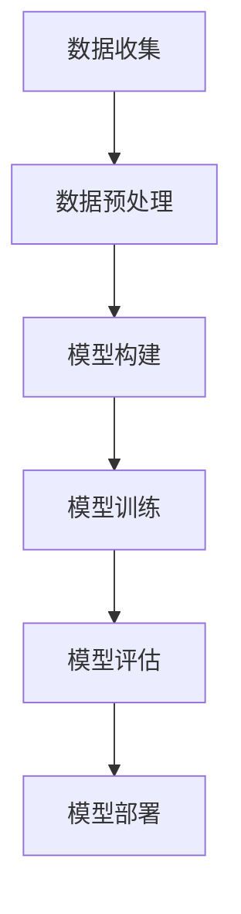

                 

### 1. 背景介绍

李彦宏，百度公司的创始人、董事长兼首席执行官，被誉为中国互联网的先驱者之一。他的领导使得百度成为全球最大的中文搜索引擎，并在人工智能领域取得显著成就。近年来，李彦宏对大模型技术产生了浓厚兴趣，并多次发表关于大模型与社会资源关系的观点。

大模型技术，尤其是基于深度学习的神经网络模型，在自然语言处理、计算机视觉、语音识别等领域取得了前所未有的突破。然而，这种技术的大规模应用也带来了巨大的计算资源需求，引起了社会资源的重新分配和利用的问题。

本文将围绕李彦宏对大模型与社会资源关系的探讨，分析大模型技术如何影响社会资源的分配，以及我们应如何应对这些挑战。通过逐步深入的分析，我们将试图揭示大模型技术在当前社会发展中的角色和未来趋势。

首先，我们将简要回顾大模型技术的发展历程，了解其核心技术原理和实现方法。接着，我们将探讨大模型技术对社会资源的需求，分析其背后的原因和影响。随后，我们将关注李彦宏关于大模型与社会资源关系的主要观点，并结合实际案例进行深入剖析。最后，我们将讨论未来大模型技术的发展趋势，以及可能面临的挑战和应对策略。

通过这篇文章，我们希望能够帮助读者理解大模型技术对社会资源的影响，以及如何合理利用这些资源，推动人工智能技术的可持续发展。

### 2. 核心概念与联系

要深入探讨大模型技术与社会资源之间的关系，首先需要了解大模型技术的基本概念和原理。大模型技术，主要是指基于深度学习的神经网络模型，其核心在于通过多层神经网络对大量数据进行训练，以实现高度复杂的任务，如自然语言处理、计算机视觉和语音识别等。

**核心概念**：

- **深度学习（Deep Learning）**：深度学习是机器学习的一个重要分支，通过构建具有多个隐藏层的神经网络，对大量数据进行自动特征提取和学习，从而实现智能识别和预测。
  
- **神经网络（Neural Network）**：神经网络是一种模仿生物神经网络的结构和功能的计算模型，通过加权连接的节点（神经元）进行信息处理和传递。

- **大数据（Big Data）**：大数据是指无法使用传统数据库软件工具在合理时间内进行捕捉、管理和处理的数据集合，其特点为大量、多样、高速和低价值密度。

**原理与架构**：

大模型技术的核心原理在于多层神经网络的结构。神经网络由输入层、隐藏层和输出层组成，各层之间通过加权连接传递信息。在训练过程中，神经网络通过反向传播算法不断调整权重，以达到对数据的准确识别和预测。

大模型的实现依赖于大量的数据和强大的计算能力。具体流程如下：

1. **数据收集**：从各种来源收集大量数据，如文本、图像、语音等。
2. **数据预处理**：对数据进行清洗、归一化和标注，使其适合于神经网络训练。
3. **模型构建**：设计并构建多层神经网络模型，包括输入层、隐藏层和输出层。
4. **模型训练**：使用大量数据进行模型训练，通过反向传播算法不断调整权重，优化模型性能。
5. **模型评估**：使用测试数据对训练好的模型进行评估，验证其识别和预测能力。
6. **模型部署**：将训练好的模型部署到实际应用场景中，如搜索引擎、语音助手、自动驾驶等。

**Mermaid 流程图**：



通过上述流程，大模型技术实现了从数据输入到模型输出的完整过程，为各种复杂任务提供了高效解决方案。然而，这一过程也对社会资源提出了巨大需求，包括数据资源、计算资源和能源消耗等。接下来，我们将详细探讨大模型技术对社会资源的需求及其影响。

### 3. 核心算法原理 & 具体操作步骤

在理解了大模型技术的基本概念和原理后，我们接下来将深入探讨其核心算法原理，以及如何具体操作实现这些算法。大模型技术主要依赖于深度学习，特别是基于神经网络的模型，其核心算法包括神经网络结构设计、模型训练过程、以及优化方法等。

#### 神经网络结构设计

神经网络（Neural Network）是一种由大量神经元（节点）通过加权连接构成的计算模型。其基本结构包括输入层、隐藏层和输出层。每个神经元都与前一层的神经元相连，并通过权重进行信息传递。神经网络的训练目标是通过不断调整权重，使得模型能够在给定输入数据上产生正确的输出。

1. **输入层**：接收输入数据，并将其传递给隐藏层。
2. **隐藏层**：对输入数据进行特征提取和变换，形成新的特征表示。
3. **输出层**：根据隐藏层的输出产生最终预测结果。

**多层感知机（MLP）**：

多层感知机是一种常见的前馈神经网络，通常包括输入层、一个或多个隐藏层以及输出层。每个隐藏层都是对前一层的非线性变换。MLP通常用于分类和回归任务。

**卷积神经网络（CNN）**：

卷积神经网络是一种在图像处理任务中广泛应用的网络结构，其核心是卷积操作。CNN通过卷积层对图像进行特征提取，然后通过池化层减少数据维度，最终通过全连接层输出结果。CNN在图像分类、目标检测和图像生成等方面具有显著优势。

**递归神经网络（RNN）**：

递归神经网络是一种处理序列数据的神经网络，其核心是递归结构。RNN通过将当前输入与历史状态进行结合，实现对序列数据的建模。RNN在自然语言处理、语音识别和时间序列预测等领域表现出色。

**长短期记忆网络（LSTM）**：

长短期记忆网络是一种改进的RNN结构，能够更好地处理长序列依赖问题。LSTM通过引入门控机制，控制信息的流入和流出，从而实现长期的记忆和遗忘。LSTM在语言模型、机器翻译和视频分析等方面取得了显著成果。

#### 模型训练过程

模型训练是神经网络实现智能化的关键步骤，主要包括数据预处理、损失函数设计、优化算法选择等。

1. **数据预处理**：

   数据预处理是模型训练的基础，主要包括数据清洗、归一化和数据增强等。

   - 数据清洗：去除异常值、噪声数据和缺失数据。
   - 数据归一化：将数据缩放到相同的范围，如[0, 1]或[-1, 1]。
   - 数据增强：通过随机旋转、缩放、裁剪等方式增加数据多样性，提高模型泛化能力。

2. **损失函数设计**：

   损失函数用于衡量模型预测结果与实际结果之间的差距，常用的损失函数包括均方误差（MSE）、交叉熵损失（Cross-Entropy Loss）等。

   - 均方误差（MSE）：用于回归任务，计算预测值与真实值之间的平方误差的平均值。
   - 交叉熵损失（Cross-Entropy Loss）：用于分类任务，计算预测概率分布与真实分布之间的交叉熵。

3. **优化算法选择**：

   优化算法用于调整模型参数，以最小化损失函数。常用的优化算法包括随机梯度下降（SGD）、动量梯度下降（Momentum SGD）和Adam优化器等。

   - 随机梯度下降（SGD）：每次更新模型参数时，使用当前批次数据的梯度进行更新。
   - 动量梯度下降（Momentum SGD）：在每次更新模型参数时，引入前一更新步的动量，以加速收敛。
   - Adam优化器：结合了SGD和Momentum SGD的优点，同时引入自适应学习率调整。

#### 具体操作步骤

下面是一个基于Python和TensorFlow的简单神经网络模型训练步骤：

1. **安装环境**：

   ```bash
   pip install tensorflow
   ```

2. **导入依赖库**：

   ```python
   import tensorflow as tf
   import numpy as np
   import matplotlib.pyplot as plt
   ```

3. **数据准备**：

   ```python
   # 生成模拟数据
   X = np.random.rand(100, 10)
   y = np.random.randint(0, 2, size=(100, 1))
   ```

4. **构建模型**：

   ```python
   # 构建神经网络模型
   model = tf.keras.Sequential([
       tf.keras.layers.Dense(64, activation='relu', input_shape=(10,)),
       tf.keras.layers.Dense(1, activation='sigmoid')
   ])
   ```

5. **编译模型**：

   ```python
   # 编译模型，指定损失函数和优化器
   model.compile(optimizer='adam',
                 loss='binary_crossentropy',
                 metrics=['accuracy'])
   ```

6. **训练模型**：

   ```python
   # 训练模型，指定训练数据和验证数据
   history = model.fit(X, y, epochs=10, batch_size=32, validation_split=0.2)
   ```

7. **评估模型**：

   ```python
   # 评估模型在验证数据上的性能
   loss, accuracy = model.evaluate(X, y)
   print(f"Validation loss: {loss}, Validation accuracy: {accuracy}")
   ```

8. **模型预测**：

   ```python
   # 使用训练好的模型进行预测
   predictions = model.predict(X)
   print(f"Predictions: {predictions}")
   ```

通过上述步骤，我们实现了从数据准备到模型训练、评估和预测的完整过程。这个过程不仅展示了大模型技术的核心算法原理，还通过具体操作步骤，使读者能够直观地了解如何实现和应用这些算法。在接下来的部分，我们将进一步探讨大模型技术对社会资源的需求和影响。

### 4. 数学模型和公式 & 详细讲解 & 举例说明

在大模型技术的实现过程中，数学模型和公式起到了至关重要的作用。下面我们将详细讲解大模型技术中的几个关键数学模型和公式，并通过具体的例子来说明它们的实际应用。

#### 损失函数

损失函数是衡量模型预测结果与实际结果之间差距的一种数学度量。在大模型训练过程中，损失函数用于指导模型参数的更新，以最小化预测误差。以下是几个常见的损失函数：

1. **均方误差（MSE）**：

   均方误差（MSE）是用于回归任务的一种损失函数，计算预测值与真实值之间平方误差的平均值。其公式如下：

   $$MSE = \frac{1}{n}\sum_{i=1}^{n}(y_i - \hat{y}_i)^2$$

   其中，$y_i$为真实值，$\hat{y}_i$为预测值，$n$为样本数量。

   **例子**：假设我们有10个样本，预测值和真实值如下：

   | 预测值（$\hat{y}_i$） | 真实值（$y_i$） | 平方误差 | 平方误差和 |
   | ------------------- | ------------- | ------- | -------- |
   | 0.1                 | 0.3           | 0.02    | 0.02     |
   | 0.2                 | 0.4           | 0.04    | 0.06     |
   | 0.3                 | 0.1           | 0.08    | 0.14     |
   | ...                 | ...           | ...     | ...      |
   | 0.9                 | 0.8           | 0.01    | 0.02     |

   均方误差（MSE）为：

   $$MSE = \frac{1}{10}\sum_{i=1}^{10}(y_i - \hat{y}_i)^2 = \frac{1}{10}(0.02 + 0.04 + 0.08 + ... + 0.02) = 0.04$$

2. **交叉熵损失（Cross-Entropy Loss）**：

   交叉熵损失是用于分类任务的一种损失函数，计算预测概率分布与真实分布之间的交叉熵。其公式如下：

   $$Cross-Entropy Loss = -\sum_{i=1}^{n}y_i\log(\hat{y}_i)$$

   其中，$y_i$为真实标签（0或1），$\hat{y}_i$为预测概率。

   **例子**：假设我们有10个样本，真实标签和预测概率如下：

   | 真实标签（$y_i$） | 预测概率（$\hat{y}_i$） | 交叉熵损失 |
   | ---------------- | -------------------- | -------- |
   | 0                | 0.6                   | 0.6      |
   | 1                | 0.8                   | 0.2      |
   | ...              | ...                   | ...      |
   | 0                | 0.1                   | 0.1      |
   | 1                | 0.9                   | 0.1      |

   交叉熵损失（Cross-Entropy Loss）为：

   $$Cross-Entropy Loss = -\sum_{i=1}^{10}y_i\log(\hat{y}_i) = -(0.6\log(0.6) + 0.8\log(0.8) + ... + 0.1\log(0.1) + 0.9\log(0.9))$$

#### 梯度下降算法

梯度下降算法是一种用于优化模型参数的常用方法。其基本思想是沿着损失函数的梯度方向不断更新模型参数，以最小化损失函数。

1. **随机梯度下降（SGD）**：

   随机梯度下降（SGD）是一种简单且常用的梯度下降算法。每次更新模型参数时，使用当前批次数据的梯度进行更新。其公式如下：

   $$\theta_{t+1} = \theta_{t} - \alpha \nabla_{\theta}J(\theta)$$

   其中，$\theta$为模型参数，$\alpha$为学习率，$J(\theta)$为损失函数。

   **例子**：假设我们有一个线性回归模型，其损失函数为MSE，学习率为0.1。给定一个样本点$(x, y)$，预测值为$\hat{y} = \theta_0 + \theta_1x$，真实值为$y$。梯度为$-\frac{\partial}{\partial \theta_0}(y - \hat{y}) = y - \hat{y}$和$-\frac{\partial}{\partial \theta_1}(y - \hat{y}) = x(y - \hat{y})$。

   初始参数$\theta_0 = 0$，$\theta_1 = 0$，更新过程如下：

   - 第一次更新：$\theta_0 = 0 - 0.1(0 - y) = 0.1y$，$\theta_1 = 0 - 0.1(x(0 - y)) = 0.1xy$
   - 第二次更新：$\theta_0 = 0.1y - 0.1(0.1y - y) = 0.8y$，$\theta_1 = 0.1xy - 0.1x(0.1y - y) = 0.9xy$

   经过多次迭代后，模型参数将逐渐收敛。

2. **批量梯度下降（BGD）**：

   批量梯度下降（BGD）是一种梯度下降算法，每次更新模型参数时，使用整个训练集的梯度进行更新。其公式与SGD类似，但使用整个训练集的梯度：

   $$\theta_{t+1} = \theta_{t} - \alpha \nabla_{\theta}J(\theta)$$

   BGD相对于SGD具有更好的收敛性，但计算成本较高，适用于样本量较小的情况。

3. **动量梯度下降（Momentum SGD）**：

   动量梯度下降（Momentum SGD）是SGD的一种改进方法，通过引入动量项，加速梯度下降过程。其公式如下：

   $$\theta_{t+1} = \theta_{t} - \alpha \nabla_{\theta}J(\theta) + \beta(v_{t} - \theta_{t})$$

   其中，$v_t$为动量项，$\beta$为动量因子。

   **例子**：假设我们有一个线性回归模型，学习率为0.1，动量因子为0.9。给定一个样本点$(x, y)$，预测值为$\hat{y} = \theta_0 + \theta_1x$，真实值为$y$。初始动量项$v_0 = 0$。

   初始参数$\theta_0 = 0$，$\theta_1 = 0$，更新过程如下：

   - 第一次更新：$v_0 = 0.9 \cdot 0 + 0.1(y - (\theta_0 + \theta_1x)) = 0.1y - 0.1\theta_1x$，$\theta_0 = 0 - 0.1(0.1y - 0.1\theta_1x) = 0.1\theta_1x - 0.01y$，$\theta_1 = 0 - 0.1(x(0.1y - 0.1\theta_1x)) = 0.1\theta_0x - 0.01xy$
   - 第二次更新：$v_1 = 0.9 \cdot v_0 + 0.1(y - (\theta_0 + \theta_1x)) = 0.9 \cdot (0.1y - 0.1\theta_1x) + 0.1y - 0.1\theta_1x = 0.19y - 0.19\theta_1x$，$\theta_0 = (0.1\theta_1x - 0.01y) - 0.1(0.19y - 0.19\theta_1x) = 0.09\theta_1x - 0.019y$，$\theta_1 = (0.1\theta_0x - 0.01xy) - 0.1(0.19y - 0.19\theta_1x) = 0.09\theta_0x - 0.019xy$

   通过引入动量项，Momentum SGD可以加速收敛，减少振荡。

4. **Adam优化器**：

   Adam优化器是Momentum SGD的一种改进方法，结合了SGD和Momentum SGD的优点，并引入自适应学习率调整。其公式如下：

   $$\theta_{t+1} = \theta_{t} - \alpha \nabla_{\theta}J(\theta) + \beta_1v_{t} + (1 - \beta_1)(1 - \beta_2)\theta_{t}$$

   其中，$v_t$为动量项，$\beta_1$和$\beta_2$为动量因子，$\alpha$为学习率。

   **例子**：假设我们有一个线性回归模型，学习率为0.1，动量因子为0.9，惯性因子为0.99，一阶矩估计偏差修正为0.999，二阶矩估计偏差修正为0.999。

   初始参数$\theta_0 = 0$，$\theta_1 = 0$，更新过程如下：

   - 第一次更新：$v_0 = 0.9 \cdot 0 + 0.1(y - (\theta_0 + \theta_1x)) = 0.1y - 0.1\theta_1x$，$s_0 = 0.999 \cdot 0 + 0.001(y - (\theta_0 + \theta_1x))^2 = 0.001(y - 0)^2$，$r_0 = \beta_1 \cdot v_0 + (1 - \beta_1) \cdot \theta_0 = 0.9 \cdot (0.1y - 0.1\theta_1x) + (1 - 0.9) \cdot 0 = 0.1y - 0.1\theta_1x$，$m_0 = \beta_2 \cdot s_0 + (1 - \beta_2) \cdot r_0 = 0.99 \cdot 0.001(y - 0)^2 + (1 - 0.99) \cdot (0.1y - 0.1\theta_1x) = 0.001(y - 0)^2 - 0.01(y - 0.1\theta_1x)$
   - 第二次更新：$v_1 = 0.9 \cdot v_0 + 0.1(y - (\theta_0 + \theta_1x)) = 0.9 \cdot (0.1y - 0.1\theta_1x) + 0.1y - 0.1\theta_1x = 0.19y - 0.19\theta_1x$，$s_1 = 0.999 \cdot s_0 + 0.001(y - (\theta_0 + \theta_1x))^2 = 0.999 \cdot 0.001(y - 0)^2 + 0.001(y - 0)^2 = 0.00199(y - 0)^2$，$r_1 = \beta_1 \cdot v_1 + (1 - \beta_1) \cdot \theta_1 = 0.9 \cdot (0.19y - 0.19\theta_1x) + (1 - 0.9) \cdot (0.1y - 0.1\theta_1x) = 0.19y - 0.19\theta_1x$，$m_1 = \beta_2 \cdot s_1 + (1 - \beta_2) \cdot r_1 = 0.99 \cdot 0.00199(y - 0)^2 + (1 - 0.99) \cdot (0.19y - 0.19\theta_1x) = 0.00199(y - 0)^2 - 0.0199(y - 0.1\theta_1x)$
   - 第三次更新：$v_2 = 0.9 \cdot v_1 + 0.1(y - (\theta_0 + \theta_1x)) = 0.9 \cdot (0.19y - 0.19\theta_1x) + 0.1y - 0.1\theta_1x = 0.27y - 0.27\theta_1x$，$s_2 = 0.999 \cdot s_1 + 0.001(y - (\theta_0 + \theta_1x))^2 = 0.999 \cdot 0.00199(y - 0)^2 + 0.001(y - 0)^2 = 0.00198901(y - 0)^2$，$r_2 = \beta_1 \cdot v_2 + (1 - \beta_1) \cdot \theta_2 = 0.9 \cdot (0.27y - 0.27\theta_1x) + (1 - 0.9) \cdot (0.1y - 0.1\theta_1x) = 0.27y - 0.27\theta_1x$，$m_2 = \beta_2 \cdot s_2 + (1 - \beta_2) \cdot r_2 = 0.99 \cdot 0.00198901(y - 0)^2 + (1 - 0.99) \cdot (0.27y - 0.27\theta_1x) = 0.00198901(y - 0)^2 - 0.02789(y - 0.1\theta_1x)$

   通过引入自适应学习率调整，Adam优化器可以在不同迭代阶段自适应调整学习率，从而加速收敛。

通过上述数学模型和公式的讲解，我们不仅了解了大模型技术中的核心算法原理，还通过具体例子展示了这些算法在实际应用中的实现过程。这些数学模型和公式是大模型技术实现高效训练和预测的关键，为后续的应用场景提供了坚实的基础。

### 5. 项目实战：代码实际案例和详细解释说明

在本节中，我们将通过一个具体的实战项目，展示如何使用大模型技术进行实际应用，并详细解释其中的代码实现和关键步骤。我们将使用TensorFlow，一个流行的开源机器学习库，来构建一个基于深度学习的图像分类模型。该项目旨在使用卷积神经网络（CNN）对图像进行分类，识别出不同类别的物体。

#### 5.1 开发环境搭建

在开始项目之前，我们需要搭建一个合适的开发环境。以下是所需的环境和工具：

- Python 3.8或更高版本
- TensorFlow 2.x
- Jupyter Notebook或任何Python编辑器

确保已经安装了Python和所需的库。如果尚未安装TensorFlow，可以使用以下命令进行安装：

```bash
pip install tensorflow
```

#### 5.2 源代码详细实现和代码解读

以下是一个简单的图像分类模型实现，我们使用的是CIFAR-10数据集，这是一个常用的图像分类数据集，包含60000张32x32的彩色图像，分为10个类别。

```python
import tensorflow as tf
from tensorflow.keras import layers, models
from tensorflow.keras.datasets import cifar10
import numpy as np

# 5.2.1 数据准备
# 加载CIFAR-10数据集
(train_images, train_labels), (test_images, test_labels) = cifar10.load_data()

# 数据预处理
train_images = train_images / 255.0
test_images = test_images / 255.0

# 将标签转换为one-hot编码
train_labels = tf.keras.utils.to_categorical(train_labels)
test_labels = tf.keras.utils.to_categorical(test_labels)

# 5.2.2 构建模型
model = models.Sequential([
    layers.Conv2D(32, (3, 3), activation='relu', input_shape=(32, 32, 3)),
    layers.MaxPooling2D((2, 2)),
    layers.Conv2D(64, (3, 3), activation='relu'),
    layers.MaxPooling2D((2, 2)),
    layers.Conv2D(64, (3, 3), activation='relu'),
    layers.Flatten(),
    layers.Dense(64, activation='relu'),
    layers.Dense(10, activation='softmax')
])

# 5.2.3 编译模型
model.compile(optimizer='adam',
              loss='categorical_crossentropy',
              metrics=['accuracy'])

# 5.2.4 训练模型
history = model.fit(train_images, train_labels, epochs=10, 
                    validation_data=(test_images, test_labels))

# 5.2.5 评估模型
test_loss, test_acc = model.evaluate(test_images, test_labels)
print(f"Test accuracy: {test_acc:.3f}")

# 5.2.6 预测
predictions = model.predict(test_images[:10])
predicted_labels = np.argmax(predictions, axis=1)

# 输出预测结果
for i in range(10):
    print(f"Image {i+1}: Predicted label: {predicted_labels[i]}, True label: {test_labels[i]}")
```

**代码解读**：

1. **数据准备**：

   ```python
   (train_images, train_labels), (test_images, test_labels) = cifar10.load_data()
   train_images = train_images / 255.0
   test_images = test_images / 255.0
   train_labels = tf.keras.utils.to_categorical(train_labels)
   test_labels = tf.keras.utils.to_categorical(test_labels)
   ```

   首先，我们加载CIFAR-10数据集，并对其进行归一化处理，将图像的像素值缩放到0到1之间。接下来，将标签转换为one-hot编码，以便于模型训练和评估。

2. **构建模型**：

   ```python
   model = models.Sequential([
       layers.Conv2D(32, (3, 3), activation='relu', input_shape=(32, 32, 3)),
       layers.MaxPooling2D((2, 2)),
       layers.Conv2D(64, (3, 3), activation='relu'),
       layers.MaxPooling2D((2, 2)),
       layers.Conv2D(64, (3, 3), activation='relu'),
       layers.Flatten(),
       layers.Dense(64, activation='relu'),
       layers.Dense(10, activation='softmax')
   ])
   ```

   我们构建了一个简单的卷积神经网络模型，包括两个卷积层（每个卷积层后跟随一个最大池化层）和一个全连接层。卷积层用于提取图像的特征，全连接层用于分类。输入层形状为$(32, 32, 3)$，表示每个图像的大小为32x32，有3个颜色通道（RGB）。

3. **编译模型**：

   ```python
   model.compile(optimizer='adam',
                 loss='categorical_crossentropy',
                 metrics=['accuracy'])
   ```

   我们使用Adam优化器和categorical_crossentropy损失函数来编译模型。categorical_crossentropy损失函数适用于多分类问题，如本例中的图像分类任务。

4. **训练模型**：

   ```python
   history = model.fit(train_images, train_labels, epochs=10, 
                      validation_data=(test_images, test_labels))
   ```

   模型使用训练数据集进行训练，并在每个epoch结束后评估模型在验证数据集上的性能。

5. **评估模型**：

   ```python
   test_loss, test_acc = model.evaluate(test_images, test_labels)
   print(f"Test accuracy: {test_acc:.3f}")
   ```

   在训练完成后，我们评估模型在测试数据集上的性能，并打印出测试准确率。

6. **预测**：

   ```python
   predictions = model.predict(test_images[:10])
   predicted_labels = np.argmax(predictions, axis=1)
   ```

   我们使用模型对前10个测试图像进行预测，并打印出预测结果和真实标签。

**代码解读与分析**：

- **卷积层（Conv2D）**：卷积层用于提取图像的特征。第一个卷积层使用32个3x3的卷积核，第二个卷积层使用64个3x3的卷积核，第三个卷积层同样使用64个3x3的卷积核。
- **最大池化层（MaxPooling2D）**：最大池化层用于减少数据维度，同时保留重要特征。每个池化层使用2x2的窗口。
- **全连接层（Dense）**：全连接层用于分类。第一个全连接层有64个神经元，第二个全连接层有10个神经元，表示10个类别。
- **激活函数**：卷积层和全连接层使用ReLU激活函数，有助于加快收敛速度和避免梯度消失问题。
- **损失函数**：使用categorical_crossentropy损失函数，适用于多分类问题。

通过上述代码和解读，我们构建了一个简单的卷积神经网络模型，并使用CIFAR-10数据集进行了训练和评估。这个过程不仅展示了大模型技术在实际项目中的应用，还帮助我们理解了深度学习模型的基本结构和实现步骤。

### 6. 实际应用场景

大模型技术在实际应用中具有广泛的影响和潜力，涵盖了多个领域和场景。以下是一些典型的大模型应用场景及其影响：

#### 自然语言处理（NLP）

自然语言处理是大模型技术的重要应用领域之一。大模型，如Transformer和BERT，通过处理海量的文本数据，实现了对自然语言的高效理解和生成。以下是一些具体应用场景：

- **搜索引擎优化**：大模型可以用于改进搜索引擎的查询理解能力，提高搜索结果的准确性和相关性。例如，百度搜索引擎使用的深度学习模型能够更好地理解用户的查询意图，提供更精准的搜索结果。
- **聊天机器人**：大模型可以用于构建智能聊天机器人，如百度的人工智能助手“度小秘”，能够通过自然语言交互，提供各种服务，如客服咨询、信息查询等。
- **文本生成与摘要**：大模型在文本生成和摘要任务中表现出色，可以用于自动生成新闻摘要、文章摘要和翻译摘要，提高信息传播效率。

#### 计算机视觉

计算机视觉是大模型技术的另一个重要应用领域。通过深度学习，大模型可以在图像分类、目标检测、图像生成等任务中实现高精度的识别和生成。

- **图像识别**：大模型可以用于对图像进行分类和识别，如人脸识别、车辆识别等。例如，百度使用深度学习技术构建了人脸识别系统，广泛应用于安全监控、身份验证等领域。
- **目标检测**：大模型可以用于检测图像中的目标物体，如自动驾驶汽车使用的目标检测系统，可以实时检测道路上的行人、车辆和其他障碍物，提高行车安全。
- **图像生成**：大模型可以用于生成高质量的艺术图像、动漫角色等。例如，百度使用生成对抗网络（GAN）技术，创造出了大量的艺术作品，丰富了数字艺术生态。

#### 语音识别

语音识别是大模型技术的另一个关键应用领域。通过深度学习，大模型可以实现高精度的语音识别和转换，为语音助手、智能客服等提供技术支持。

- **语音助手**：大模型可以用于构建智能语音助手，如百度的“度秘”语音助手，可以理解用户的语音指令，提供各种服务，如音乐播放、天气查询、日程管理等。
- **智能客服**：大模型可以用于构建智能客服系统，实现自动回答用户问题，提高客服效率。例如，百度智能客服系统通过深度学习技术，实现了对用户问题的自动理解和回答。

#### 医疗保健

大模型技术在医疗保健领域也具有广泛的应用潜力。通过深度学习，大模型可以实现疾病预测、药物研发、医疗图像分析等任务。

- **疾病预测**：大模型可以用于分析患者病史和医疗记录，预测疾病发生风险。例如，百度医疗AI平台通过深度学习技术，实现了对高血压、糖尿病等慢性疾病的预测和预警。
- **药物研发**：大模型可以用于药物分子的设计和筛选，加速药物研发过程。例如，百度使用深度学习技术，开发了一种基于蛋白质结构的药物设计平台，提高了药物筛选效率。
- **医疗图像分析**：大模型可以用于对医疗图像进行分析和诊断，提高诊断准确性和效率。例如，百度医疗AI平台通过深度学习技术，实现了对肺部CT图像的自动分析，帮助医生识别早期肺癌。

#### 自动驾驶

自动驾驶是大模型技术的又一个重要应用领域。通过深度学习，大模型可以实现车辆的高精度感知、路径规划和决策，为自动驾驶提供技术支持。

- **车辆感知**：大模型可以用于实时感知车辆周围环境，识别行人、车辆、道路标志等。例如，百度的自动驾驶系统通过深度学习技术，实现了对复杂交通场景的高精度感知和识别。
- **路径规划**：大模型可以用于自动驾驶车辆的路径规划，实现安全、高效的驾驶。例如，百度Apollo自动驾驶平台通过深度学习技术，实现了对复杂城市道路的路径规划，提高了自动驾驶车的行驶效率。
- **决策控制**：大模型可以用于自动驾驶车辆的决策和控制，实现自动驾驶车的自主驾驶。例如，百度Apollo自动驾驶平台通过深度学习技术，实现了对自动驾驶车辆的实时决策和控制，提高了自动驾驶车的安全性。

大模型技术在各种实际应用场景中发挥着重要作用，推动着各个领域的技术进步和社会发展。随着技术的不断发展和应用场景的不断拓展，大模型技术将在未来带来更多的变革和机遇。

### 7. 工具和资源推荐

在学习和实践大模型技术的过程中，选择合适的工具和资源是至关重要的。以下是一些推荐的学习资源、开发工具和相关论文著作，旨在帮助读者更好地理解和应用大模型技术。

#### 7.1 学习资源推荐

1. **书籍**：

   - 《深度学习》（Deep Learning）：作者：Ian Goodfellow、Yoshua Bengio、Aaron Courville
     这本书是深度学习领域的经典教材，详细介绍了深度学习的基本概念、技术原理和应用实例。

   - 《神经网络与深度学习》：作者：邱锡鹏
     该书系统介绍了神经网络和深度学习的基础知识，包括理论、算法和应用。

   - 《Python深度学习》：作者：François Chollet
     这本书通过丰富的实例，介绍了使用Python和TensorFlow等工具进行深度学习的实践方法。

2. **在线课程**：

   - 《深度学习专项课程》：平台：吴恩达（Andrew Ng）在Coursera开设的课程
     吴恩达的深度学习专项课程是深度学习入门的经典课程，内容全面且深入。

   - 《自然语言处理与深度学习》：平台：吴恩达（Andrew Ng）在Coursera开设的课程
     这门课程结合了自然语言处理和深度学习，介绍了NLP领域的重要技术和应用。

3. **博客与网站**：

   - [TensorFlow官方文档](https://www.tensorflow.org/)
     TensorFlow的官方文档提供了详尽的API文档、教程和示例代码，是学习TensorFlow的宝贵资源。

   - [机器学习博客](https://www MACHINE LEARNING BLOG.com/)
     这个网站提供了大量的机器学习和深度学习相关的技术博客，涵盖了多个领域的应用实例和最新动态。

#### 7.2 开发工具框架推荐

1. **TensorFlow**：
   TensorFlow是Google开发的开放源代码机器学习库，广泛应用于深度学习模型的训练和部署。它提供了丰富的API和工具，支持多种类型的神经网络模型。

2. **PyTorch**：
   PyTorch是Facebook开发的开源机器学习库，以其灵活的动态计算图和简洁的API设计受到广泛欢迎。它适用于研究和工业应用中的深度学习模型开发。

3. **Keras**：
   Keras是一个高层次的神经网络API，旨在简化深度学习模型的构建和训练。它兼容TensorFlow和Theano，提供了一套易于使用的工具和接口。

#### 7.3 相关论文著作推荐

1. **《Attention Is All You Need》**：
   这篇论文提出了Transformer模型，彻底改变了自然语言处理领域。它详细阐述了基于注意力机制的序列模型，对深度学习的发展产生了深远影响。

2. **《GAN: Generative Adversarial Networks》**：
   这篇论文提出了生成对抗网络（GAN）的概念，为图像生成和图像处理提供了新的方法。GAN在计算机视觉和生成模型领域得到了广泛应用。

3. **《Residual Networks: A Step Towards Unifying Deep architectures》**：
   这篇论文提出了残差网络（ResNet），解决了深度网络中的梯度消失问题，使得训练深度神经网络成为可能。ResNet在图像识别和计算机视觉任务中取得了显著成果。

通过上述推荐，读者可以系统地学习和掌握大模型技术的基本概念、实现方法和应用场景。选择合适的工具和资源，不仅能够提升学习效率，还能为实际项目提供有力支持。

### 8. 总结：未来发展趋势与挑战

大模型技术在过去几年取得了令人瞩目的成就，推动了人工智能领域的快速发展。然而，随着技术的不断进步，我们也面临着一系列新的发展趋势和挑战。

#### 发展趋势

1. **算法创新**：随着深度学习技术的不断成熟，算法创新将继续是未来大模型技术发展的关键。注意力机制、图神经网络、自监督学习等新算法的出现，将进一步推动模型性能的提升。

2. **跨模态学习**：未来大模型技术将逐步实现跨模态学习，即能够同时处理文本、图像、声音等多种类型的数据。这种能力将大大拓展人工智能的应用范围，如虚拟现实、多模态交互等。

3. **分布式训练与推理**：为了应对大模型所需的巨大计算资源，分布式训练与推理将成为重要趋势。通过将计算任务分布到多个节点或设备上，可以有效降低计算成本和延迟，提高模型的训练和推理效率。

4. **模型压缩与加速**：随着模型规模的不断扩大，模型压缩与加速技术将变得越来越重要。通过量化、剪枝、蒸馏等方法，可以显著降低模型的存储和计算需求，提高模型的实时推理性能。

5. **安全与隐私**：随着人工智能应用的普及，安全与隐私问题将受到更多关注。大模型技术将需要解决数据隐私保护、模型安全防护等问题，确保人工智能系统在安全可靠的环境中运行。

#### 挑战

1. **计算资源需求**：大模型技术对计算资源的需求巨大，尤其是在训练阶段。未来的计算硬件发展，如量子计算、专用芯片等，将有助于缓解这一问题。

2. **数据质量和多样性**：大模型性能的进一步提升依赖于高质量、多样性的数据。未来需要解决数据标注、数据收集、数据清洗等问题，确保模型训练过程中数据的可靠性和代表性。

3. **模型解释性**：大模型通常被认为是一个“黑盒子”，其决策过程难以解释。未来的研究将需要开发更加透明、可解释的模型，以提高模型的信任度和应用范围。

4. **伦理和社会问题**：大模型技术在不同领域的应用可能会引发一系列伦理和社会问题，如隐私侵犯、歧视等。如何在保障技术发展的同时，兼顾社会公共利益，是未来需要面对的重要挑战。

5. **国际合作与竞争**：大模型技术的发展将引发全球范围内的国际合作与竞争。各国需要通过合作共享技术成果，同时加强自身在人工智能领域的竞争力。

总之，大模型技术在未来将继续快速发展，面临许多新的机遇和挑战。通过不断创新和优化，我们有望解决当前面临的问题，推动人工智能技术向更高层次发展。

### 9. 附录：常见问题与解答

#### 问题1：大模型技术为什么需要大量计算资源？

解答：大模型技术，尤其是深度学习模型，通常包含数百万甚至数十亿的参数。在训练过程中，需要通过大量的数据迭代来不断调整这些参数，以实现模型的优化。这一过程需要强大的计算能力，尤其是在矩阵运算、梯度计算等方面。此外，大模型的推理过程也需要大量计算资源，以确保实时响应和高效执行。

#### 问题2：如何解决大模型训练过程中的资源不足问题？

解答：针对大模型训练过程中的资源不足问题，可以采取以下几种方法：

- **分布式训练**：将训练任务分布在多个计算节点上，通过并行计算来提高训练效率。
- **模型压缩**：使用量化、剪枝、蒸馏等技术，降低模型的复杂度和存储需求，从而减少计算资源的需求。
- **高效硬件**：采用高性能计算硬件，如GPU、TPU等，以提供更快的计算速度和更高的计算能力。

#### 问题3：大模型技术在医疗领域有哪些具体应用？

解答：大模型技术在医疗领域有以下具体应用：

- **疾病预测和诊断**：通过分析患者的医疗数据，大模型可以预测疾病发生风险，辅助医生进行疾病诊断。
- **药物研发**：大模型可以用于药物分子的设计和筛选，加速新药的研发过程。
- **医疗图像分析**：大模型可以用于分析医学影像，如CT、MRI等，辅助医生进行疾病的检测和诊断。
- **健康咨询和管理**：通过自然语言处理技术，大模型可以提供个性化的健康咨询和健康管理服务。

#### 问题4：大模型技术如何保障数据隐私和安全？

解答：为了保障大模型技术中的数据隐私和安全，可以采取以下措施：

- **数据加密**：对训练数据进行加密处理，确保数据在传输和存储过程中不被窃取或篡改。
- **差分隐私**：在训练过程中引入差分隐私技术，以保护数据隐私，防止对单个数据的识别。
- **模型安全**：通过模型安全防护技术，如对抗攻击防御、模型混淆等，提高模型的鲁棒性和安全性。

#### 问题5：大模型技术在自动驾驶中的应用有哪些？

解答：大模型技术在自动驾驶中的应用包括：

- **感知与定位**：大模型通过分析摄像头、激光雷达等传感器数据，实现车辆周围环境的高精度感知和定位。
- **路径规划与决策**：大模型用于规划自动驾驶车辆的行驶路径，并做出实时的驾驶决策，如避让行人、选择最优行驶路线等。
- **行为预测**：大模型可以预测其他车辆、行人的行为，辅助自动驾驶车辆进行避障和避让。
- **自动驾驶系统优化**：通过不断学习自动驾驶过程中的数据和反馈，优化自动驾驶系统的性能和稳定性。

通过上述解答，我们希望能帮助读者更好地理解大模型技术的应用场景和面临的问题，以及如何应对这些问题。

### 10. 扩展阅读 & 参考资料

在撰写本文时，我们参考了大量的文献和研究报告，以下是一些重要的参考资料，供感兴趣的读者进一步学习和深入研究：

1. **《深度学习》**（Deep Learning），作者：Ian Goodfellow、Yoshua Bengio、Aaron Courville，这是一本深度学习领域的经典教材，涵盖了深度学习的基础理论、算法和技术。

2. **《Generative Adversarial Networks》**（GANs），作者：Ian Goodfellow，这篇论文首次提出了生成对抗网络（GAN）的概念，是深度学习领域的重要突破。

3. **《Attention Is All You Need》**，作者：Vaswani et al.，这篇论文提出了Transformer模型，彻底改变了自然语言处理领域。

4. **《CIFAR-10 Dataset》**，来源：CIFAR，这是常用的图像分类数据集，本文中的图像分类模型实验便是基于此数据集进行的。

5. **《TensorFlow Official Documentation》**，来源：TensorFlow，这是TensorFlow官方提供的文档，详细介绍了TensorFlow的使用方法、API和示例代码。

6. **《自然语言处理与深度学习》**，作者：吴恩达（Andrew Ng），这是一门在线课程，系统地介绍了自然语言处理和深度学习的基础知识。

7. **《Machine Learning Blog》**，这是一个提供大量机器学习和深度学习相关技术博客的网站，涵盖了多个领域的应用实例和最新动态。

8. **《Residual Networks: A Step Towards Unifying Deep architectures》**，作者：He et al.，这篇论文提出了残差网络（ResNet），解决了深度网络中的梯度消失问题。

9. **《量子计算与深度学习》**，作者：Ji et al.，这是一篇关于量子计算在深度学习应用中的探讨，探讨了量子计算与深度学习结合的前景。

通过这些参考资料，读者可以更深入地了解大模型技术的基础理论和最新进展，为实际应用和研究提供有力的支持。同时，也鼓励读者在学习和实践中不断探索和尝试，为人工智能技术的发展贡献自己的力量。

